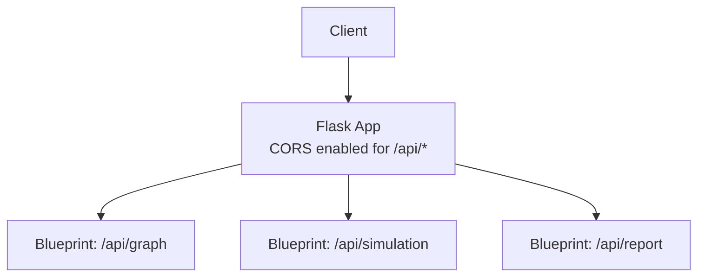
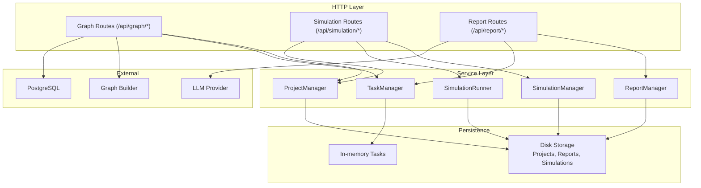
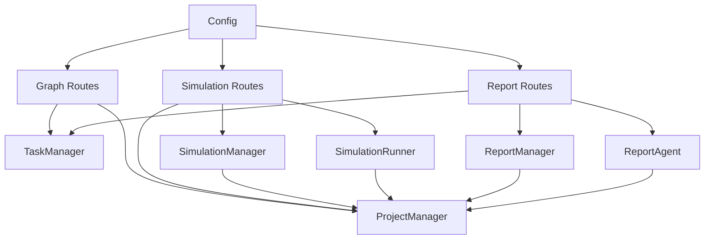

# API Reference

<cite>
**Referenced Files in This Document**
- [backend/app/__init__.py](file://backend/app/__init__.py)
- [backend/app/api/__init__.py](file://backend/app/api/__init__.py)
- [backend/app/api/graph.py](file://backend/app/api/graph.py)
- [backend/app/api/simulation.py](file://backend/app/api/simulation.py)
- [backend/app/api/report.py](file://backend/app/api/report.py)
- [backend/app/config.py](file://backend/app/config.py)
- [backend/app/models/project.py](file://backend/app/models/project.py)
- [backend/app/models/task.py](file://backend/app/models/task.py)
- [backend/run.py](file://backend/run.py)
- [frontend/src/api/index.js](file://frontend/src/api/index.js)
- [frontend/src/api/graph.js](file://frontend/src/api/graph.js)
- [frontend/src/api/simulation.js](file://frontend/src/api/simulation.js)
- [frontend/src/api/report.js](file://frontend/src/api/report.js)
</cite>

## Table of Contents
1. [Introduction](#introduction)
2. [Project Structure](#project-structure)
3. [Core Components](#core-components)
4. [Architecture Overview](#architecture-overview)
5. [Detailed Component Analysis](#detailed-component-analysis)
6. [Dependency Analysis](#dependency-analysis)
7. [Performance Considerations](#performance-considerations)
8. [Troubleshooting Guide](#troubleshooting-guide)
9. [Conclusion](#conclusion)
10. [Appendices](#appendices)

## Introduction
This document provides a comprehensive API reference for the Parallel World backend REST API. It covers:
- Graph management APIs for project lifecycle, file uploads, ontology generation, graph building, and graph data retrieval
- Simulation control APIs for configuration, environment preparation, execution control, and status monitoring
- Report generation APIs for asynchronous report creation, progress monitoring, and retrieval
It also includes authentication, rate limiting, security, and practical usage examples with curl and client guidelines.

## Project Structure
The backend is a Flask application with three primary API blueprints:
- Graph API under /api/graph
- Simulation API under /api/simulation
- Report API under /api/report

The application registers blueprints and enables CORS for all /api/* routes. It validates configuration on startup and exposes a health endpoint.

**Diagram sources**
- [backend/app/__init__.py:78-81](file://backend/app/__init__.py#L78-L81)

**Section sources**
- [backend/app/__init__.py:44-96](file://backend/app/__init__.py#L44-L96)
- [backend/app/api/__init__.py:7-13](file://backend/app/api/__init__.py#L7-L13)

## Core Components
- Configuration: Centralized configuration via environment variables and validation
- Project context: Persistent project state stored on disk
- Task management: In-memory task tracking for long-running operations
- Simulation runner: Controls simulation lifecycle and IPC with external processes
- Report agent: Generates structured reports asynchronously

Key behaviors:
- CORS is enabled for all /api/* endpoints
- Health endpoint checks database connectivity
- Configuration validation occurs at startup

**Section sources**
- [backend/app/config.py:66-75](file://backend/app/config.py#L66-L75)
- [backend/app/__init__.py:44-96](file://backend/app/__init__.py#L44-L96)
- [backend/run.py:28-34](file://backend/run.py#L28-L34)

## Architecture Overview
The API follows a layered architecture:
- HTTP layer: Flask blueprints define routes
- Service layer: Business logic orchestrated by managers and runners
- Persistence layer: Disk-backed project storage and in-memory task registry
- External integrations: LLM clients, graph builders, and simulation runners

**Diagram sources**
- [backend/app/api/graph.py:121-255](file://backend/app/api/graph.py#L121-L255)
- [backend/app/api/simulation.py:146-219](file://backend/app/api/simulation.py#L146-L219)
- [backend/app/api/report.py:24-196](file://backend/app/api/report.py#L24-L196)
- [backend/app/models/project.py:101-196](file://backend/app/models/project.py#L101-L196)
- [backend/app/models/task.py:54-99](file://backend/app/models/task.py#L54-L99)

## Detailed Component Analysis

### Graph API
Endpoints for project and knowledge graph operations.

- Project Management
  - GET /api/graph/project/{project_id}
    - Description: Retrieve project details
    - Authentication: Not specified in code
    - Response: success flag and project data
    - Errors: 404 if not found
  - GET /api/graph/project/list
    - Description: List projects with optional limit
    - Query: limit (integer)
    - Response: success flag, array of projects, count
  - DELETE /api/graph/project/{project_id}
    - Description: Delete a project
    - Response: success flag and message; 404 if not found
  - POST /api/graph/project/{project_id}/reset
    - Description: Reset project status for rebuilding
    - Response: success flag, message, and updated project data

- Ontology Generation
  - POST /api/graph/ontology/generate
    - Description: Upload files and generate ontology
    - Content-Type: multipart/form-data
    - Form fields:
      - files: one or more PDF/MD/TXT files
      - simulation_requirement: required text
      - project_name: optional
      - additional_context: optional
    - Response: success flag, project_id, ontology, analysis_summary, files, total_text_length
    - Errors: 400 if missing fields or no valid files; 500 on internal error

- Graph Building
  - POST /api/graph/build
    - Description: Start graph building from project
    - Body JSON:
      - project_id: required
      - graph_name: optional
      - chunk_size: optional, default from config
      - chunk_overlap: optional, default from config
      - force: optional, force rebuild
    - Response: success flag, project_id, task_id, message
    - Validation: project existence, status checks, configuration validation
    - Errors: 400 if invalid or missing; 404 if not found; 500 on internal error

- Task Management
  - GET /api/graph/task/{task_id}
    - Description: Query task status
    - Response: success flag and task data
    - Errors: 404 if not found
  - GET /api/graph/tasks
    - Description: List all tasks
    - Response: success flag, array of tasks, count

- Graph Data
  - GET /api/graph/data/{graph_id}
    - Description: Retrieve graph node and edge data
    - Response: success flag and graph data
    - Errors: 500 on internal error
  - DELETE /api/graph/delete/{graph_id}
    - Description: Delete a graph
    - Response: success flag and message
    - Errors: 500 on internal error

Common response format:
- On success: {"success": true, "data": {...}}
- On error: {"success": false, "error": "..."} plus optional "traceback"

Authentication and security:
- No explicit authentication is enforced in the graph blueprint
- CORS is enabled for /api/*

Rate limiting:
- Not implemented in the graph blueprint

Practical usage examples:
- Upload files and generate ontology
  - curl -X POST http://localhost:5001/api/graph/ontology/generate -F files=@doc1.pdf -F files=@doc2.txt -F simulation_requirement="Analyze public sentiment"
- Build graph
  - curl -X POST http://localhost:5001/api/graph/build -H "Content-Type: application/json" -d '{"project_id":"proj_xxxx","graph_name":"My Graph"}'

Client implementation guidelines:
- Use frontend wrappers for convenience
  - See [frontend/src/api/graph.js:8-34](file://frontend/src/api/graph.js#L8-L34)

**Section sources**
- [backend/app/api/graph.py:35-117](file://backend/app/api/graph.py#L35-L117)
- [backend/app/api/graph.py:121-255](file://backend/app/api/graph.py#L121-L255)
- [backend/app/api/graph.py:259-523](file://backend/app/api/graph.py#L259-L523)
- [backend/app/api/graph.py:527-604](file://backend/app/api/graph.py#L527-L604)
- [backend/app/models/project.py:101-196](file://backend/app/models/project.py#L101-L196)
- [backend/app/models/task.py:54-99](file://backend/app/models/task.py#L54-L99)

### Simulation API
Endpoints for simulation configuration, preparation, execution control, and monitoring.

- Entity Reading
  - GET /api/simulation/entities/{graph_id}
    - Query: entity_types (comma-separated), enrich (boolean)
    - Response: success flag and filtered entities
  - GET /api/simulation/entities/{graph_id}/{entity_uuid}
    - Response: success flag and entity details; 404 if not found
  - GET /api/simulation/entities/{graph_id}/by-type/{entity_type}
    - Query: enrich (boolean)
    - Response: success flag, entity_type, count, entities

- Simulation Management
  - POST /api/simulation/create
    - Body: project_id, graph_id (optional), enable_twitter, enable_reddit
    - Response: success flag and simulation state
    - Errors: 400/404 if missing dependencies
  - POST /api/simulation/prepare
    - Body: simulation_id, entity_types, use_llm_for_profiles, parallel_profile_count, force_regenerate
    - Response: success flag, simulation_id, task_id, status, message, and counts
    - Notes: Async task; checks preparation completeness
  - POST /api/simulation/prepare/status
    - Body: task_id or simulation_id
    - Response: task status and progress; can detect already prepared state
  - GET /api/simulation/{simulation_id}
    - Response: success flag and simulation state; attaches run instructions when ready
  - GET /api/simulation/list
    - Query: project_id (optional)
    - Response: success flag, simulations, count

- Simulation Environment and Profiles
  - GET /api/simulation/{simulation_id}/profiles
    - Query: platform (reddit/twitter)
    - Response: platform, count, profiles
  - GET /api/simulation/{simulation_id}/profiles/realtime
    - Query: platform
    - Response: includes generation status and file metadata
  - GET /api/simulation/{simulation_id}/config
    - Response: complete simulation configuration
  - GET /api/simulation/{simulation_id}/config/realtime
    - Response: includes generation stage and partial config
  - GET /api/simulation/script/{script_name}/download
    - Response: downloadable script file (run_twitter_simulation.py, run_reddit_simulation.py, run_parallel_simulation.py, action_logger.py)

- Simulation Run Control
  - POST /api/simulation/start
    - Body: simulation_id, platform, max_rounds, enable_graph_memory_update, force
    - Response: runner status, process PID, platform flags, timestamps, and flags
  - POST /api/simulation/stop
    - Body: simulation_id
    - Response: runner status and completion timestamp
  - POST /api/simulation/close-env
    - Body: simulation_id, timeout
    - Response: success flag and result
  - POST /api/simulation/env-status
    - Body: simulation_id
    - Response: environment alive flags and availability

- Real-time Status Monitoring
  - GET /api/simulation/{simulation_id}/run-status
    - Response: runner status, current/total rounds, progress percent, simulated hours, action counts, timestamps
  - GET /api/simulation/{simulation_id}/run-status/detail
    - Query: platform (optional)
    - Response: includes all actions, per-platform actions, and recent actions
  - GET /api/simulation/{simulation_id}/timeline
    - Query: start_round, end_round
    - Response: rounds_count and timeline summaries
  - GET /api/simulation/{simulation_id}/agent-stats
    - Response: agents_count and stats
  - GET /api/simulation/{simulation_id}/actions
    - Query: limit, offset, platform, agent_id, round_num
    - Response: count and actions
  - GET /api/simulation/{simulation_id}/posts
    - Query: platform, limit, offset
    - Response: platform, total, count, posts
  - GET /api/simulation/{simulation_id}/comments
    - Query: post_id (optional), limit, offset
    - Response: count and comments

- Interview Endpoints
  - POST /api/simulation/interview
    - Body: simulation_id, agent_id, prompt, platform (optional), timeout
    - Response: result per platform or unified depending on platform specification
  - POST /api/simulation/interview/batch
    - Body: simulation_id, interviews[], platform (optional), timeout
    - Response: aggregated results across agents and platforms
  - POST /api/simulation/interview/all
    - Body: simulation_id, prompt, platform (optional), timeout
    - Response: results for all agents
  - POST /api/simulation/interview/history
    - Body: simulation_id, platform (optional), agent_id (optional), limit
    - Response: count and history entries

- Historical Simulations
  - GET /api/simulation/history
    - Query: limit
    - Response: enriched simulation list with project details, counts, and report_id

Common response format:
- On success: {"success": true, "data": {...}}
- On error: {"success": false, "error": "..."} plus optional "traceback"

Authentication and security:
- No explicit authentication is enforced in the simulation blueprint
- CORS is enabled for /api/*

Rate limiting:
- Not implemented in the simulation blueprint

Practical usage examples:
- Create simulation
  - curl -X POST http://localhost:5001/api/simulation/create -H "Content-Type: application/json" -d '{"project_id":"proj_xxxx","enable_twitter":true,"enable_reddit":true}'
- Prepare simulation
  - curl -X POST http://localhost:5001/api/simulation/prepare -H "Content-Type: application/json" -d '{"simulation_id":"sim_xxxx","force_regenerate":false}'
- Start simulation
  - curl -X POST http://localhost:5001/api/simulation/start -H "Content-Type: application/json" -d '{"simulation_id":"sim_xxxx","platform":"parallel","max_rounds":100}'

Client implementation guidelines:
- Use frontend wrappers for convenience
  - See [frontend/src/api/simulation.js:7-188](file://frontend/src/api/simulation.js#L7-L188)

**Section sources**
- [backend/app/api/simulation.py:47-142](file://backend/app/api/simulation.py#L47-L142)
- [backend/app/api/simulation.py:146-219](file://backend/app/api/simulation.py#L146-L219)
- [backend/app/api/simulation.py:340-730](file://backend/app/api/simulation.py#L340-L730)
- [backend/app/api/simulation.py:732-792](file://backend/app/api/simulation.py#L732-L792)
- [backend/app/api/simulation.py:853-965](file://backend/app/api/simulation.py#L853-L965)
- [backend/app/api/simulation.py:967-1113](file://backend/app/api/simulation.py#L967-L1113)
- [backend/app/api/simulation.py:1115-1233](file://backend/app/api/simulation.py#L1115-L1233)
- [backend/app/api/simulation.py:1235-1298](file://backend/app/api/simulation.py#L1235-L1298)
- [backend/app/api/simulation.py:1300-1350](file://backend/app/api/simulation.py#L1300-L1350)
- [backend/app/api/simulation.py:1354-1424](file://backend/app/api/simulation.py#L1354-L1424)
- [backend/app/api/simulation.py:1428-1619](file://backend/app/api/simulation.py#L1428-L1619)
- [backend/app/api/simulation.py:1621-1678](file://backend/app/api/simulation.py#L1621-L1678)
- [backend/app/api/simulation.py:1682-1839](file://backend/app/api/simulation.py#L1682-L1839)
- [backend/app/api/simulation.py:1841-1933](file://backend/app/api/simulation.py#L1841-L1933)
- [backend/app/api/simulation.py:1964-2040](file://backend/app/api/simulation.py#L1964-L2040)
- [backend/app/api/simulation.py:2042-2115](file://backend/app/api/simulation.py#L2042-L2115)
- [backend/app/api/simulation.py:2119-2384](file://backend/app/api/simulation.py#L2119-L2384)
- [backend/app/api/simulation.py:2386-2487](file://backend/app/api/simulation.py#L2386-L2487)
- [backend/app/api/simulation.py:2489-2559](file://backend/app/api/simulation.py#L2489-L2559)
- [backend/app/api/simulation.py:2561-2624](file://backend/app/api/simulation.py#L2561-L2624)
- [backend/app/api/simulation.py:2626-2694](file://backend/app/api/simulation.py#L2626-L2694)

### Report API
Endpoints for asynchronous report generation, progress monitoring, retrieval, and chat with the Report Agent.

- Report Generation
  - POST /api/report/generate
    - Body: simulation_id, force_regenerate
    - Response: success flag, simulation_id, report_id, task_id, status, message, already_generated flag
  - POST /api/report/generate/status
    - Body: task_id or simulation_id
    - Response: task status and progress; detects existing completed report

- Report Retrieval
  - GET /api/report/{report_id}
    - Response: success flag and report details
  - GET /api/report/by-simulation/{simulation_id}
    - Response: success flag and report; has_report flag
  - GET /api/report/list
    - Query: simulation_id (optional), limit
    - Response: success flag, array of reports, count
  - GET /api/report/{report_id}/download
    - Response: downloadable Markdown file
  - DELETE /api/report/{report_id}
    - Response: success flag and message

- Report Agent Chat
  - POST /api/report/chat
    - Body: simulation_id, message, chat_history[]
    - Response: success flag, response, tool_calls, sources

- Report Progress and Sections
  - GET /api/report/{report_id}/progress
    - Response: status, progress, message, current_section, completed_sections, updated_at
  - GET /api/report/{report_id}/sections
    - Response: report_id, sections[], total_sections, is_complete
  - GET /api/report/{report_id}/section/{section_index}
    - Response: filename, section_index, content

- Report Status Check
  - GET /api/report/check/{simulation_id}
    - Response: has_report, report_status, report_id, interview_unlocked

- Agent Logs
  - GET /api/report/{report_id}/agent-log
    - Query: from_line
    - Response: logs array, total_lines, from_line, has_more

Common response format:
- On success: {"success": true, "data": {...}}
- On error: {"success": false, "error": "..."} plus optional "traceback"

Authentication and security:
- No explicit authentication is enforced in the report blueprint
- CORS is enabled for /api/*

Rate limiting:
- Not implemented in the report blueprint

Practical usage examples:
- Start report generation
  - curl -X POST http://localhost:5001/api/report/generate -H "Content-Type: application/json" -d '{"simulation_id":"sim_xxxx","force_regenerate":false}'
- Poll generation status
  - curl -X POST http://localhost:5001/api/report/generate/status -H "Content-Type: application/json" -d '{"task_id":"task_xxxx"}'
- Download report
  - curl -X GET http://localhost:5001/api/report/report_xxxx/download -o report.md

Client implementation guidelines:
- Use frontend wrappers for convenience
  - See [frontend/src/api/report.js:7-52](file://frontend/src/api/report.js#L7-L52)

**Section sources**
- [backend/app/api/report.py:24-196](file://backend/app/api/report.py#L24-L196)
- [backend/app/api/report.py:198-268](file://backend/app/api/report.py#L198-L268)
- [backend/app/api/report.py:272-463](file://backend/app/api/report.py#L272-L463)
- [backend/app/api/report.py:467-560](file://backend/app/api/report.py#L467-L560)
- [backend/app/api/report.py:564-698](file://backend/app/api/report.py#L564-L698)
- [backend/app/api/report.py:702-749](file://backend/app/api/report.py#L702-L749)
- [backend/app/api/report.py:753-800](file://backend/app/api/report.py#L753-L800)

### Authentication, Rate Limiting, and Security
- Authentication: No explicit authentication is enforced in any of the blueprints
- CORS: Enabled for all /api/* routes
- Security considerations:
  - Validate configuration at startup
  - Use HTTPS in production deployments
  - Restrict file uploads to allowed extensions
  - Consider implementing rate limiting and request size limits
  - Add API keys or JWT authentication as needed

**Section sources**
- [backend/app/__init__.py:44-96](file://backend/app/__init__.py#L44-L96)
- [backend/app/config.py:38-42](file://backend/app/config.py#L38-L42)
- [backend/run.py:28-34](file://backend/run.py#L28-L34)

### Practical Examples and Client Guidelines
- Example: Generate ontology and build graph
  - curl -X POST http://localhost:5001/api/graph/ontology/generate -F files=@paper.pdf -F simulation_requirement="Analyze research impact"
  - curl -X POST http://localhost:5001/api/graph/build -H "Content-Type: application/json" -d '{"project_id":"proj_xxxx","graph_name":"Research Graph"}'
- Example: Prepare and run simulation
  - curl -X POST http://localhost:5001/api/simulation/create -H "Content-Type: application/json" -d '{"project_id":"proj_xxxx"}'
  - curl -X POST http://localhost:5001/api/simulation/prepare -H "Content-Type: application/json" -d '{"simulation_id":"sim_xxxx"}'
  - curl -X POST http://localhost:5001/api/simulation/start -H "Content-Type: application/json" -d '{"simulation_id":"sim_xxxx","platform":"parallel"}'
- Example: Generate and download report
  - curl -X POST http://localhost:5001/api/report/generate -H "Content-Type: application/json" -d '{"simulation_id":"sim_xxxx"}'
  - curl -X GET http://localhost:5001/api/report/report_xxxx/download -o report.md

Client implementation guidelines:
- Use the provided frontend axios instance and helpers
  - Base URL, timeouts, interceptors, and retry logic
  - See [frontend/src/api/index.js:4-68](file://frontend/src/api/index.js#L4-L68)
- Graph API helpers
  - See [frontend/src/api/graph.js:8-71](file://frontend/src/api/graph.js#L8-L71)
- Simulation API helpers
  - See [frontend/src/api/simulation.js:7-188](file://frontend/src/api/simulation.js#L7-L188)
- Report API helpers
  - See [frontend/src/api/report.js:7-52](file://frontend/src/api/report.js#L7-L52)

**Section sources**
- [frontend/src/api/index.js:4-68](file://frontend/src/api/index.js#L4-L68)
- [frontend/src/api/graph.js:8-71](file://frontend/src/api/graph.js#L8-L71)
- [frontend/src/api/simulation.js:7-188](file://frontend/src/api/simulation.js#L7-L188)
- [frontend/src/api/report.js:7-52](file://frontend/src/api/report.js#L7-L52)

## Dependency Analysis
The API routes depend on:
- Configuration for LLM, database, uploads, and simulation settings
- ProjectManager for persistent project state
- TaskManager for async task tracking
- SimulationManager and SimulationRunner for simulation orchestration
- ReportManager and ReportAgent for report generation

**Diagram sources**
- [backend/app/config.py:20-76](file://backend/app/config.py#L20-L76)
- [backend/app/models/project.py:101-306](file://backend/app/models/project.py#L101-L306)
- [backend/app/models/task.py:54-185](file://backend/app/models/task.py#L54-L185)
- [backend/app/api/graph.py:121-255](file://backend/app/api/graph.py#L121-L255)
- [backend/app/api/simulation.py:146-219](file://backend/app/api/simulation.py#L146-L219)
- [backend/app/api/report.py:24-196](file://backend/app/api/report.py#L24-L196)

**Section sources**
- [backend/app/config.py:20-76](file://backend/app/config.py#L20-L76)
- [backend/app/models/project.py:101-306](file://backend/app/models/project.py#L101-L306)
- [backend/app/models/task.py:54-185](file://backend/app/models/task.py#L54-L185)

## Performance Considerations
- Long-running operations:
  - Graph building and report generation use background threads and task tracking
  - Simulation preparation and runs involve external processes and databases
- Recommendations:
  - Use task polling endpoints to avoid blocking requests
  - Implement client-side retries with exponential backoff
  - Monitor task progress and adjust chunk sizes for graph building
  - Consider pagination for large lists (projects, reports, actions)

[No sources needed since this section provides general guidance]

## Troubleshooting Guide
Common issues and resolutions:
- Configuration errors at startup
  - Validate LLM_API_KEY and DATABASE_URL; fix or set environment variables
  - See [backend/run.py:28-34](file://backend/run.py#L28-L34) and [backend/app/config.py:66-75](file://backend/app/config.py#L66-L75)
- Missing or invalid project/simulation IDs
  - Ensure IDs are correct and resources exist before invoking dependent endpoints
  - See graph and simulation endpoints for 404 handling
- Graph build conflicts
  - Use force flag to rebuild; avoid concurrent submissions
  - See [backend/app/api/graph.py:314-335](file://backend/app/api/graph.py#L314-L335)
- Simulation not ready
  - Call /prepare first; check status via /prepare/status
  - See [backend/app/api/simulation.py:340-428](file://backend/app/api/simulation.py#L340-L428)
- Interview environment not alive
  - Ensure simulation environment is running and not closed
  - See [backend/app/api/simulation.py:2204-2210](file://backend/app/api/simulation.py#L2204-L2210)
- Report generation failures
  - Check task status and logs; retry with force_regenerate if needed
  - See [backend/app/api/report.py:198-268](file://backend/app/api/report.py#L198-L268)

**Section sources**
- [backend/run.py:28-34](file://backend/run.py#L28-L34)
- [backend/app/config.py:66-75](file://backend/app/config.py#L66-L75)
- [backend/app/api/graph.py:314-335](file://backend/app/api/graph.py#L314-L335)
- [backend/app/api/simulation.py:340-428](file://backend/app/api/simulation.py#L340-L428)
- [backend/app/api/simulation.py:2204-2210](file://backend/app/api/simulation.py#L2204-L2210)
- [backend/app/api/report.py:198-268](file://backend/app/api/report.py#L198-L268)

## Conclusion
The Parallel World backend provides a comprehensive REST API for knowledge graph construction, simulation orchestration, and report generation. The API is organized into three blueprints with consistent response patterns and robust task management for long-running operations. For production use, consider adding authentication, rate limiting, and transport security.

[No sources needed since this section summarizes without analyzing specific files]

## Appendices

### API Endpoints Summary
- Graph
  - GET /api/graph/project/{project_id}
  - GET /api/graph/project/list
  - DELETE /api/graph/project/{project_id}
  - POST /api/graph/project/{project_id}/reset
  - POST /api/graph/ontology/generate
  - POST /api/graph/build
  - GET /api/graph/task/{task_id}
  - GET /api/graph/tasks
  - GET /api/graph/data/{graph_id}
  - DELETE /api/graph/delete/{graph_id}

- Simulation
  - GET /api/simulation/entities/{graph_id}
  - GET /api/simulation/entities/{graph_id}/{entity_uuid}
  - GET /api/simulation/entities/{graph_id}/by-type/{entity_type}
  - POST /api/simulation/create
  - POST /api/simulation/prepare
  - POST /api/simulation/prepare/status
  - GET /api/simulation/{simulation_id}
  - GET /api/simulation/list
  - GET /api/simulation/{simulation_id}/profiles
  - GET /api/simulation/{simulation_id}/profiles/realtime
  - GET /api/simulation/{simulation_id}/config
  - GET /api/simulation/{simulation_id}/config/realtime
  - GET /api/simulation/script/{script_name}/download
  - POST /api/simulation/start
  - POST /api/simulation/stop
  - POST /api/simulation/close-env
  - POST /api/simulation/env-status
  - GET /api/simulation/{simulation_id}/run-status
  - GET /api/simulation/{simulation_id}/run-status/detail
  - GET /api/simulation/{simulation_id}/timeline
  - GET /api/simulation/{simulation_id}/agent-stats
  - GET /api/simulation/{simulation_id}/actions
  - GET /api/simulation/{simulation_id}/posts
  - GET /api/simulation/{simulation_id}/comments
  - POST /api/simulation/interview
  - POST /api/simulation/interview/batch
  - POST /api/simulation/interview/all
  - POST /api/simulation/interview/history
  - GET /api/simulation/history

- Report
  - POST /api/report/generate
  - POST /api/report/generate/status
  - GET /api/report/{report_id}
  - GET /api/report/by-simulation/{simulation_id}
  - GET /api/report/list
  - GET /api/report/{report_id}/download
  - DELETE /api/report/{report_id}
  - POST /api/report/chat
  - GET /api/report/{report_id}/progress
  - GET /api/report/{report_id}/sections
  - GET /api/report/{report_id}/section/{section_index}
  - GET /api/report/check/{simulation_id}
  - GET /api/report/{report_id}/agent-log

**Section sources**
- [backend/app/api/graph.py:35-604](file://backend/app/api/graph.py#L35-L604)
- [backend/app/api/simulation.py:47-2694](file://backend/app/api/simulation.py#L47-L2694)
- [backend/app/api/report.py:24-800](file://backend/app/api/report.py#L24-L800)