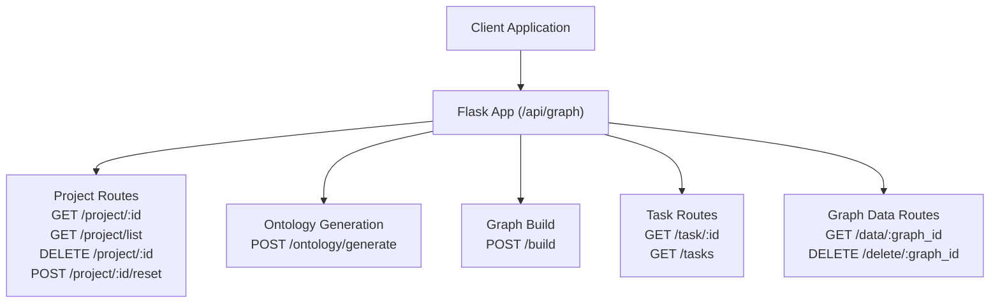
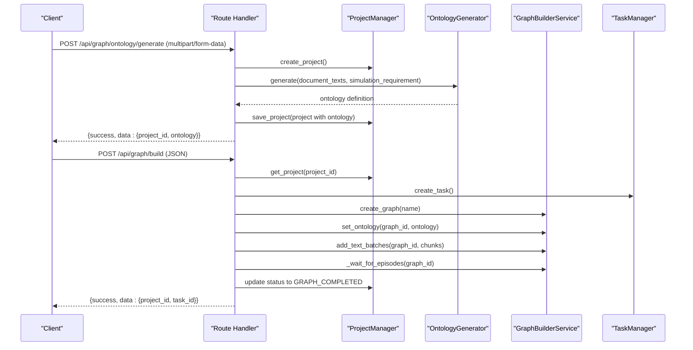
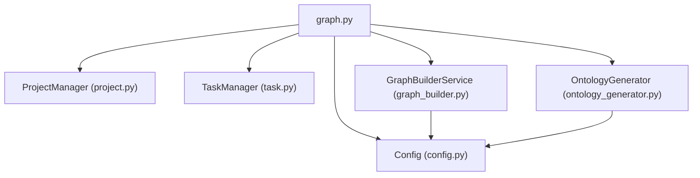

# Graph Management API

<cite>
**Referenced Files in This Document**
- [graph.py](file://backend/app/api/graph.py)
- [project.py](file://backend/app/models/project.py)
- [task.py](file://backend/app/models/task.py)
- [graph_builder.py](file://backend/app/services/graph_builder.py)
- [ontology_generator.py](file://backend/app/services/ontology_generator.py)
- [config.py](file://backend/app/config.py)
- [__init__.py](file://backend/app/api/__init__.py)
- [__init__.py](file://backend/app/__init__.py)
- [run.py](file://backend/run.py)
- [graph.js](file://frontend/src/api/graph.js)
</cite>

## Table of Contents
1. [Introduction](#introduction)
2. [Project Structure](#project-structure)
3. [Core Components](#core-components)
4. [Architecture Overview](#architecture-overview)
5. [Detailed Component Analysis](#detailed-component-analysis)
6. [Dependency Analysis](#dependency-analysis)
7. [Performance Considerations](#performance-considerations)
8. [Troubleshooting Guide](#troubleshooting-guide)
9. [Conclusion](#conclusion)
10. [Appendices](#appendices)

## Introduction
This document provides comprehensive API documentation for the Graph Management API endpoints. It covers project management, ontology generation, graph building, task monitoring, and graph data operations. The API is implemented as a Flask blueprint mounted under `/api/graph` and exposes endpoints for managing knowledge graphs built from uploaded documents.

## Project Structure
The Graph Management API is organized around a Flask blueprint that registers routes for:
- Project lifecycle management
- Ontology generation from uploaded documents
- Asynchronous graph building
- Task status monitoring
- Graph data retrieval and deletion



**Diagram sources**
- [__init__.py:7-13](file://backend/app/api/__init__.py#L7-L13)
- [__init__.py:78-81](file://backend/app/__init__.py#L78-L81)
- [graph.py:35-117](file://backend/app/api/graph.py#L35-L117)

**Section sources**
- [__init__.py:78-81](file://backend/app/__init__.py#L78-L81)
- [__init__.py:7-13](file://backend/app/api/__init__.py#L7-L13)

## Core Components
- Project Manager: Persistent storage and retrieval of project state, including uploaded files, extracted text, and graph metadata.
- Task Manager: Thread-safe tracking of long-running operations with progress updates and status transitions.
- Graph Builder Service: Orchestrates graph creation, chunking, LLM-powered entity extraction, and data retrieval.
- Ontology Generator: Analyzes document content and simulation requirements to produce entity and relationship type definitions.

**Section sources**
- [project.py:101-306](file://backend/app/models/project.py#L101-L306)
- [task.py:54-185](file://backend/app/models/task.py#L54-L185)
- [graph_builder.py:39-307](file://backend/app/services/graph_builder.py#L39-L307)
- [ontology_generator.py:158-449](file://backend/app/services/ontology_generator.py#L158-L449)

## Architecture Overview
The API follows a layered architecture:
- Route handlers orchestrate requests and delegate to services
- Services encapsulate business logic and interact with external systems
- Models manage persistent state and data structures
- Configuration centralizes environment-dependent settings



**Diagram sources**
- [graph.py:121-254](file://backend/app/api/graph.py#L121-L254)
- [graph.py:259-522](file://backend/app/api/graph.py#L259-L522)
- [project.py:133-196](file://backend/app/models/project.py#L133-L196)
- [ontology_generator.py:167-206](file://backend/app/services/ontology_generator.py#L167-L206)
- [graph_builder.py:185-302](file://backend/app/services/graph_builder.py#L185-L302)

## Detailed Component Analysis

### Project Management Endpoints
- GET /api/graph/project/<project_id>
  - Purpose: Retrieve project details by ID
  - Authentication: Not specified in code
  - Request parameters: None
  - Response: Project object with status, files, graph metadata, and configuration
  - Error handling: 404 if project not found
  - Example curl:
    ```bash
    curl -X GET http://localhost:5001/api/graph/project/proj_xxxxxx
    ```

- GET /api/graph/project/list
  - Purpose: List recent projects with pagination
  - Query parameters:
    - limit: integer, default 50
  - Response: Array of projects with count
  - Example curl:
    ```bash
    curl -X GET "http://localhost:5001/api/graph/project/list?limit=20"
    ```

- DELETE /api/graph/project/<project_id>
  - Purpose: Delete a project and associated files
  - Response: Deletion confirmation or 404 if not found
  - Example curl:
    ```bash
    curl -X DELETE http://localhost:5001/api/graph/project/proj_xxxxxx
    ```

- POST /api/graph/project/<project_id>/reset
  - Purpose: Reset project status to allow rebuilding the graph
  - Behavior: Sets status to ONTOLOGY_GENERATED if ontology exists, otherwise CREATED; clears graph_id and task_id
  - Response: Updated project state
  - Example curl:
    ```bash
    curl -X POST http://localhost:5001/api/graph/project/proj_xxxxxx/reset
    ```

**Section sources**
- [graph.py:35-117](file://backend/app/api/graph.py#L35-L117)
- [project.py:17-98](file://backend/app/models/project.py#L17-L98)

### Ontology Generation Endpoint
- POST /api/graph/ontology/generate
  - Method: multipart/form-data
  - Required fields:
    - files: one or more PDF/MD/TXT files
    - simulation_requirement: string describing simulation goals
  - Optional fields:
    - project_name: string, defaults to "Unnamed Project"
    - additional_context: string for extra guidance
  - Workflow:
    - Validates presence of simulation_requirement and files
    - Creates project, saves files, extracts text, preprocesses text
    - Calls OntologyGenerator to produce entity and relationship types
    - Saves ontology to project and sets status to ONTOLOGY_GENERATED
  - Response schema:
    - success: boolean
    - data: {
        project_id: string
        project_name: string
        ontology: {
          entity_types: array
          edge_types: array
          analysis_summary: string
        }
        files: array
        total_text_length: integer
      }
  - Error handling:
    - 400 if missing required fields or no documents processed
    - 500 on internal exceptions with error and traceback
  - Example curl:
    ```bash
    curl -X POST http://localhost:5001/api/graph/ontology/generate \
      -F files=@document1.pdf \
      -F files=@document2.md \
      -F simulation_requirement="Public opinion simulation on social media" \
      -F project_name="Demo Project"
    ```

**Section sources**
- [graph.py:121-254](file://backend/app/api/graph.py#L121-L254)
- [ontology_generator.py:167-206](file://backend/app/services/ontology_generator.py#L167-L206)
- [project.py:241-291](file://backend/app/models/project.py#L241-L291)

### Graph Building Endpoint
- POST /api/graph/build
  - Method: JSON
  - Required fields:
    - project_id: string from previous endpoint
  - Optional fields:
    - graph_name: string, defaults to project name or a default graph name
    - chunk_size: integer, default 500
    - chunk_overlap: integer, default 50
    - force: boolean, default false
  - Validation:
    - Requires project to have ONTOLOGY_GENERATED status
    - Prevents duplicate builds unless force=true
  - Workflow:
    - Creates a background task via TaskManager
    - Initializes GraphBuilderService
    - Splits text into chunks, creates graph, sets ontology
    - Adds text in batches, waits for LLM processing
    - Updates project status to GRAPH_COMPLETED with graph_id
  - Response schema:
    - success: boolean
    - data: {
        project_id: string
        task_id: string
        message: string
      }
  - Error handling:
    - 400 if project not ready or missing text/ontology
    - 404 if project not found
    - 500 on internal exceptions
  - Example curl:
    ```bash
    curl -X POST http://localhost:5001/api/graph/build \
      -H "Content-Type: application/json" \
      -d '{
        "project_id": "proj_xxxxxx",
        "graph_name": "Demo Graph",
        "chunk_size": 500,
        "chunk_overlap": 50
      }'
    ```

**Section sources**
- [graph.py:259-522](file://backend/app/api/graph.py#L259-L522)
- [graph_builder.py:185-302](file://backend/app/services/graph_builder.py#L185-L302)
- [task.py:54-185](file://backend/app/models/task.py#L54-L185)

### Task Management Endpoints
- GET /api/graph/task/<task_id>
  - Purpose: Query status of a specific task
  - Response schema:
    - success: boolean
    - data: Task object with status, progress, message, result, error
  - Error handling: 404 if task not found
  - Example curl:
    ```bash
    curl -X GET http://localhost:5001/api/graph/task/task_xxxxxx
    ```

- GET /api/graph/tasks
  - Purpose: List all tasks
  - Response schema:
    - success: boolean
    - data: array of tasks
    - count: integer
  - Example curl:
    ```bash
    curl -X GET http://localhost:5001/api/graph/tasks
    ```

**Section sources**
- [graph.py:527-557](file://backend/app/api/graph.py#L527-L557)
- [task.py:101-171](file://backend/app/models/task.py#L101-L171)

### Graph Data Endpoints
- GET /api/graph/data/<graph_id>
  - Purpose: Retrieve complete graph data (nodes and edges)
  - Response schema:
    - success: boolean
    - data: {
        graph_id: string
        nodes: array of node objects
        edges: array of edge objects
        node_count: integer
        edge_count: integer
      }
  - Example curl:
    ```bash
    curl -X GET http://localhost:5001/api/graph/data/graph_xxxxxx
    ```

- DELETE /api/graph/delete/<graph_id>
  - Purpose: Delete a graph
  - Response: Deletion confirmation
  - Example curl:
    ```bash
    curl -X DELETE http://localhost:5001/api/graph/delete/graph_xxxxxx
    ```

**Section sources**
- [graph.py:562-603](file://backend/app/api/graph.py#L562-L603)
- [graph_builder.py:248-307](file://backend/app/services/graph_builder.py#L248-L307)

## Dependency Analysis
The API routes depend on:
- ProjectManager for persistent project state
- TaskManager for asynchronous task tracking
- GraphBuilderService for graph operations
- OntologyGenerator for knowledge base definition
- Configuration for environment settings and validations



**Diagram sources**
- [graph.py:11-20](file://backend/app/api/graph.py#L11-L20)
- [project.py:101-196](file://backend/app/models/project.py#L101-L196)
- [task.py:54-100](file://backend/app/models/task.py#L54-L100)
- [graph_builder.py:39-50](file://backend/app/services/graph_builder.py#L39-L50)
- [ontology_generator.py:158-166](file://backend/app/services/ontology_generator.py#L158-L166)
- [config.py:20-76](file://backend/app/config.py#L20-L76)

**Section sources**
- [graph.py:11-20](file://backend/app/api/graph.py#L11-L20)
- [config.py:20-76](file://backend/app/config.py#L20-L76)

## Performance Considerations
- Asynchronous processing: Graph building runs in background threads to prevent blocking the API. Poll task endpoints for progress updates.
- Chunking strategy: Default chunk size and overlap can be tuned to balance memory usage and LLM throughput.
- File upload limits: Maximum upload size is configured; large documents may increase processing time.
- Database connectivity: Ensure PostgreSQL is available and reachable; the application attempts initialization on startup.

[No sources needed since this section provides general guidance]

## Troubleshooting Guide
Common issues and resolutions:
- Configuration errors: The server validates LLM and database configuration on startup. Check logs for validation failures.
- Missing project: Many endpoints require a valid project_id; ensure the project exists and has the expected status.
- Duplicate builds: The build endpoint prevents concurrent builds; use force=true to restart a failed build.
- File format errors: Only PDF, MD, TXT are accepted; ensure files are not corrupted.
- Task not found: Verify task_id correctness and that the task hasn't been cleaned up by the TaskManager.

**Section sources**
- [run.py:28-34](file://backend/run.py#L28-L34)
- [graph.py:286-293](file://backend/app/api/graph.py#L286-L293)
- [graph.py:316-335](file://backend/app/api/graph.py#L316-L335)
- [config.py:38-45](file://backend/app/config.py#L38-L45)

## Conclusion
The Graph Management API provides a complete pipeline for transforming documents into knowledge graphs through ontology-driven design and asynchronous graph construction. It offers robust project lifecycle management, task monitoring, and graph data operations suitable for social simulation workflows.

[No sources needed since this section summarizes without analyzing specific files]

## Appendices

### Endpoint Reference Summary
- Project Management
  - GET /api/graph/project/<project_id>
  - GET /api/graph/project/list
  - DELETE /api/graph/project/<project_id>
  - POST /api/graph/project/<project_id>/reset
- Ontology Generation
  - POST /api/graph/ontology/generate (multipart/form-data)
- Graph Build
  - POST /api/graph/build (JSON)
- Task Monitoring
  - GET /api/graph/task/<task_id>
  - GET /api/graph/tasks
- Graph Data
  - GET /api/graph/data/<graph_id>
  - DELETE /api/graph/delete/<graph_id>

### Request/Response Schema Details
- Project object (selected fields):
  - project_id: string
  - name: string
  - status: enum (created, ontology_generated, graph_building, graph_completed, failed)
  - files: array of {filename, size}
  - total_text_length: integer
  - ontology: object with entity_types, edge_types, analysis_summary
  - graph_id: string
  - graph_build_task_id: string
  - simulation_requirement: string
  - chunk_size: integer
  - chunk_overlap: integer
  - error: string

- Task object:
  - task_id: string
  - task_type: string
  - status: enum (pending, processing, completed, failed)
  - created_at: ISO timestamp
  - updated_at: ISO timestamp
  - progress: integer (0-100)
  - message: string
  - result: object
  - error: string
  - metadata: object
  - progress_detail: object

- Graph data:
  - nodes: array of node objects with uuid, name, labels, summary, attributes, timestamps
  - edges: array of edge objects with uuid, name, fact, fact_type, source/target uuid/name, attributes, timestamps

**Section sources**
- [project.py:26-98](file://backend/app/models/project.py#L26-L98)
- [task.py:22-51](file://backend/app/models/task.py#L22-L51)
- [graph_builder.py:248-302](file://backend/app/services/graph_builder.py#L248-L302)