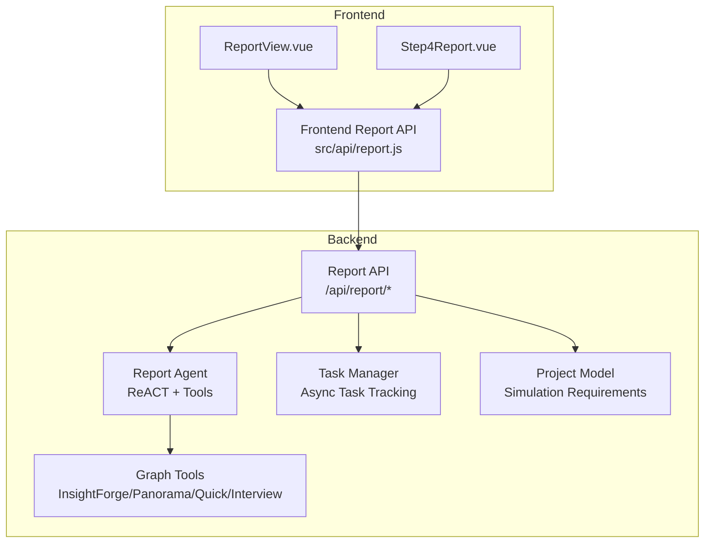
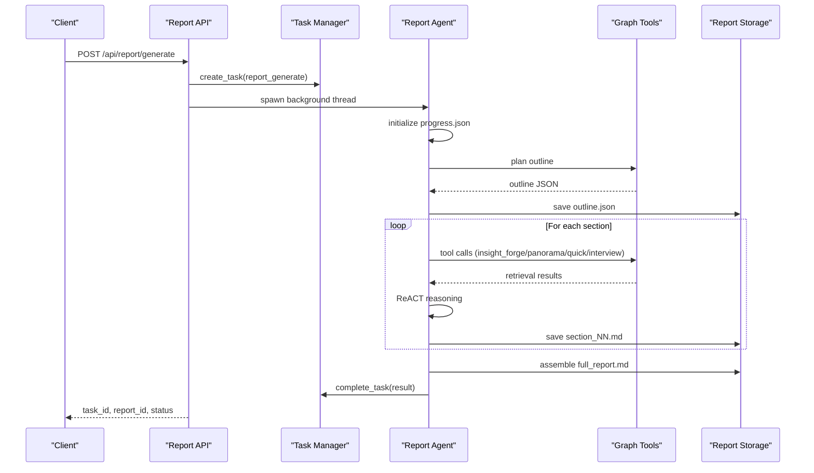
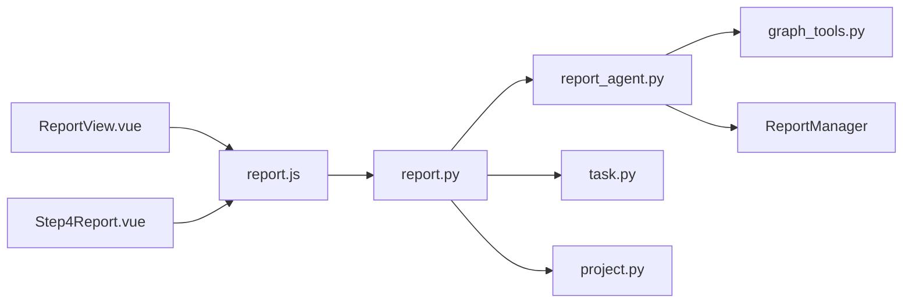

# Report Generation API

<cite>
**Referenced Files in This Document**
- [report.py](file://backend/app/api/report.py)
- [report_agent.py](file://backend/app/services/report_agent.py)
- [graph_tools.py](file://backend/app/services/graph_tools.py)
- [task.py](file://backend/app/models/task.py)
- [project.py](file://backend/app/models/project.py)
- [report.js](file://frontend/src/api/report.js)
- [ReportView.vue](file://frontend/src/views/ReportView.vue)
- [Step4Report.vue](file://frontend/src/components/Step4Report.vue)
- [config.py](file://backend/app/config.py)
</cite>

## Table of Contents
1. [Introduction](#introduction)
2. [Project Structure](#project-structure)
3. [Core Components](#core-components)
4. [Architecture Overview](#architecture-overview)
5. [Detailed Component Analysis](#detailed-component-analysis)
6. [Dependency Analysis](#dependency-analysis)
7. [Performance Considerations](#performance-considerations)
8. [Troubleshooting Guide](#troubleshooting-guide)
9. [Conclusion](#conclusion)
10. [Appendices](#appendices)

## Introduction
This document provides comprehensive API documentation for the Report Generation subsystem. It covers endpoints for initiating AI-powered analysis and prediction reports, monitoring generation progress, retrieving completed reports, accessing report data and interactive insights, and integrating with the broader simulation pipeline. It also documents the underlying Report Agent, retrieval tools, and frontend components that drive the report generation experience.

## Project Structure
The Report Generation API is implemented in the backend Flask blueprint and integrates with:
- Report API routes for generation, status, retrieval, and chat
- Report Agent service implementing ReACT reasoning with retrieval tools
- Graph tools providing deep insight, panorama, quick search, and agent interview capabilities
- Task management for asynchronous report generation
- Project context for simulation requirements and graph linkage
- Frontend APIs and UI components for real-time progress and interactive insights

**Diagram sources**
- [report.py:24-196](file://backend/app/api/report.py#L24-L196)
- [report_agent.py:1883-2572](file://backend/app/services/report_agent.py#L1883-L2572)
- [graph_tools.py:1-200](file://backend/app/services/graph_tools.py#L1-L200)
- [task.py:54-185](file://backend/app/models/task.py#L54-L185)
- [project.py:26-99](file://backend/app/models/project.py#L26-L99)
- [report.js:1-52](file://frontend/src/api/report.js#L1-L52)
- [ReportView.vue:1-128](file://frontend/src/views/ReportView.vue#L1-L128)
- [Step4Report.vue:1-390](file://frontend/src/components/Step4Report.vue#L1-L390)

**Section sources**
- [report.py:1-1016](file://backend/app/api/report.py#L1-L1016)
- [report_agent.py:1-2572](file://backend/app/services/report_agent.py#L1-L2572)
- [graph_tools.py:1-200](file://backend/app/services/graph_tools.py#L1-L200)
- [task.py:1-185](file://backend/app/models/task.py#L1-L185)
- [project.py:1-306](file://backend/app/models/project.py#L1-L306)
- [report.js:1-52](file://frontend/src/api/report.js#L1-L52)
- [ReportView.vue:1-128](file://frontend/src/views/ReportView.vue#L1-L128)
- [Step4Report.vue:1-390](file://frontend/src/components/Step4Report.vue#L1-L390)

## Core Components
- Report API routes: expose endpoints for report generation initiation, status polling, retrieval, section streaming, downloads, and agent chat.
- Report Agent: orchestrates ReACT planning and generation, manages progress, and writes structured logs for real-time monitoring.
- Graph Tools: provide retrieval capabilities (deep insight, panorama, quick search) and agent interviews.
- Task Manager: tracks asynchronous report generation tasks with progress and status.
- Project Model: stores simulation requirements and links to graph IDs used by the Report Agent.
- Frontend APIs and UI: poll status, stream logs, render sections, and enable interactive insights.

**Section sources**
- [report.py:24-749](file://backend/app/api/report.py#L24-L749)
- [report_agent.py:35-304](file://backend/app/services/report_agent.py#L35-L304)
- [graph_tools.py:24-200](file://backend/app/services/graph_tools.py#L24-L200)
- [task.py:54-185](file://backend/app/models/task.py#L54-L185)
- [project.py:26-99](file://backend/app/models/project.py#L26-L99)
- [report.js:1-52](file://frontend/src/api/report.js#L1-L52)
- [Step4Report.vue:1-390](file://frontend/src/components/Step4Report.vue#L1-L390)

## Architecture Overview
The Report Generation API follows an asynchronous, event-driven architecture:
- Clients initiate report generation with a simulation ID.
- The backend creates an async task and spawns a background thread to run the Report Agent.
- The Report Agent plans the report outline, then generates sections iteratively using ReACT reasoning and retrieval tools.
- Progress and logs are persisted and streamed to the client for real-time visualization.
- Completed reports are stored as Markdown and metadata, with optional section-by-section delivery.

**Diagram sources**
- [report.py:24-196](file://backend/app/api/report.py#L24-L196)
- [report_agent.py:1883-2572](file://backend/app/services/report_agent.py#L1883-L2572)
- [graph_tools.py:1-200](file://backend/app/services/graph_tools.py#L1-L200)
- [task.py:54-185](file://backend/app/models/task.py#L54-L185)

## Detailed Component Analysis

### Report Generation Endpoints
- POST /api/report/generate
  - Purpose: Initiate report generation asynchronously.
  - Request JSON:
    - simulation_id: required
    - force_regenerate: optional boolean
  - Response JSON:
    - success: boolean
    - data: { simulation_id, report_id, task_id, status, message, already_generated? }
  - Validation:
    - Requires simulation_id; validates simulation existence and project graph availability.
    - Prevents redundant generation unless force_regenerate is true.
  - Behavior:
    - Creates a task of type "report_generate".
    - Spawns a background thread to run Report Agent with progress callbacks.
    - Returns immediately with task_id and report_id for subsequent status checks.

- POST /api/report/generate/status
  - Purpose: Poll for generation progress.
  - Request JSON:
    - task_id: optional
    - simulation_id: optional
  - Response JSON:
    - success: boolean
    - data: { task_id, status, progress, message } or { report_id, status, progress, already_completed? } if completed
  - Behavior:
    - If simulation_id provided and a completed report exists, returns completed status immediately.
    - Otherwise, returns task status from Task Manager.

**Section sources**
- [report.py:24-267](file://backend/app/api/report.py#L24-L267)

### Report Retrieval Endpoints
- GET /api/report/{report_id}
  - Purpose: Fetch report details (metadata, outline, markdown content).
  - Response JSON:
    - success: boolean
    - data: { report_id, simulation_id, status, outline?, markdown_content, created_at, completed_at }

- GET /api/report/by-simulation/{simulation_id}
  - Purpose: Retrieve report by simulation ID.
  - Response JSON:
    - success: boolean
    - data: report object
    - has_report: boolean flag

- GET /api/report/list
  - Purpose: List reports with optional filters.
  - Query params:
    - simulation_id: optional
    - limit: optional (default 50)
  - Response JSON:
    - success: boolean
    - data: array of report objects
    - count: integer

- GET /api/report/{report_id}/download
  - Purpose: Download report as Markdown.
  - Response: File attachment (.md)

- DELETE /api/report/{report_id}
  - Purpose: Delete report (folder or legacy files).
  - Response JSON:
    - success: boolean
    - message or error

**Section sources**
- [report.py:272-462](file://backend/app/api/report.py#L272-L462)

### Report Data and Interactive Insights Endpoints
- GET /api/report/{report_id}/progress
  - Purpose: Stream real-time generation progress.
  - Response JSON:
    - success: boolean
    - data: { status, progress, message, current_section, completed_sections, updated_at }

- GET /api/report/{report_id}/sections
  - Purpose: List generated sections (section-by-section output).
  - Response JSON:
    - success: boolean
    - data: { report_id, sections: [{ filename, section_index, content }], total_sections, is_complete }

- GET /api/report/{report_id}/section/{section_index}
  - Purpose: Retrieve a single section’s content.
  - Response JSON:
    - success: boolean
    - data: { filename, section_index, content }

- GET /api/report/{report_id}/agent-log
  - Purpose: Incrementally fetch structured agent logs (JSONL).
  - Query params:
    - from_line: optional (default 0)
  - Response JSON:
    - success: boolean
    - data: { logs, total_lines, from_line, has_more }

- GET /api/report/{report_id}/console-log
  - Purpose: Incrementally fetch console logs (plain text).
  - Query params:
    - from_line: optional (default 0)
  - Response JSON:
    - success: boolean
    - data: { logs, total_lines, from_line, has_more }

**Section sources**
- [report.py:564-791](file://backend/app/api/report.py#L564-L791)
- [report_agent.py:1957-2077](file://backend/app/services/report_agent.py#L1957-L2077)

### Report Agent Chat Endpoints
- POST /api/report/chat
  - Purpose: Chat with Report Agent using retrieval tools.
  - Request JSON:
    - simulation_id: required
    - message: required
    - chat_history: optional array of { role, content }
  - Response JSON:
    - success: boolean
    - data: { response, tool_calls, sources }

**Section sources**
- [report.py:467-559](file://backend/app/api/report.py#L467-L559)

### Report Status Check Endpoint
- GET /api/report/check/{simulation_id}
  - Purpose: Determine if a report exists and its status; used to unlock downstream steps.
  - Response JSON:
    - success: boolean
    - data: { simulation_id, has_report, report_status, report_id, interview_unlocked }

**Section sources**
- [report.py:702-748](file://backend/app/api/report.py#L702-L748)

### Report Agent Service and Tools
- Report Agent
  - Implements ReACT pattern with retrieval tools.
  - Maintains detailed logs (agent_log.jsonl) and console logs (console_log.txt).
  - Updates progress.json for real-time UI updates.
  - Assembles final report from section files.

- Graph Tools
  - InsightForge: deep multi-dimensional retrieval with sub-questions and integrated analysis.
  - PanoramaSearch: full timeline and evolution view (active vs historical).
  - QuickSearch: fast, targeted retrieval.
  - InterviewAgents: real interviews with simulation agents on dual platforms.

- Task Manager
  - Thread-safe singleton for task lifecycle management.
  - Tracks status, progress, messages, and results.

- Project Model
  - Stores simulation requirements and graph linkage used by the Report Agent.

**Section sources**
- [report_agent.py:35-304](file://backend/app/services/report_agent.py#L35-L304)
- [report_agent.py:1883-2572](file://backend/app/services/report_agent.py#L1883-L2572)
- [graph_tools.py:24-200](file://backend/app/services/graph_tools.py#L24-L200)
- [task.py:54-185](file://backend/app/models/task.py#L54-L185)
- [project.py:26-99](file://backend/app/models/project.py#L26-L99)

### Frontend Integration
- Frontend API wrappers
  - generateReport, getReportStatus, getAgentLog, getConsoleLog, getReport, chatWithReport
- ReportView.vue
  - Loads report metadata and related simulation/project/graph data.
- Step4Report.vue
  - Streams agent logs, console logs, and sections.
  - Renders report sections progressively and provides interactive insights.

**Section sources**
- [report.js:1-52](file://frontend/src/api/report.js#L1-L52)
- [ReportView.vue:1-128](file://frontend/src/views/ReportView.vue#L1-L128)
- [Step4Report.vue:1-390](file://frontend/src/components/Step4Report.vue#L1-L390)

## Dependency Analysis

**Diagram sources**
- [report.py:11-18](file://backend/app/api/report.py#L11-L18)
- [report_agent.py:1883-2572](file://backend/app/services/report_agent.py#L1883-L2572)
- [graph_tools.py:1-200](file://backend/app/services/graph_tools.py#L1-L200)
- [task.py:54-185](file://backend/app/models/task.py#L54-L185)
- [project.py:1-306](file://backend/app/models/project.py#L1-L306)
- [report.js:1-52](file://frontend/src/api/report.js#L1-L52)
- [ReportView.vue:1-128](file://frontend/src/views/ReportView.vue#L1-L128)
- [Step4Report.vue:1-390](file://frontend/src/components/Step4Report.vue#L1-L390)

**Section sources**
- [report.py:11-18](file://backend/app/api/report.py#L11-L18)
- [report_agent.py:1883-2572](file://backend/app/services/report_agent.py#L1883-L2572)
- [graph_tools.py:1-200](file://backend/app/services/graph_tools.py#L1-L200)
- [task.py:54-185](file://backend/app/models/task.py#L54-L185)
- [project.py:1-306](file://backend/app/models/project.py#L1-L306)
- [report.js:1-52](file://frontend/src/api/report.js#L1-L52)
- [ReportView.vue:1-128](file://frontend/src/views/ReportView.vue#L1-L128)
- [Step4Report.vue:1-390](file://frontend/src/components/Step4Report.vue#L1-L390)

## Performance Considerations
- Asynchronous generation: Long-running report generation runs in a background thread, preventing blocking the API.
- Section-by-section output: Clients can render sections as they become available, reducing perceived latency.
- Incremental log streaming: JSONL and plain text logs support incremental retrieval via from_line parameter.
- Tool call limits: Configurable maximum tool calls and reflection rounds reduce resource consumption.
- File-based storage: Reports are persisted as Markdown and JSON files for efficient retrieval and download.

[No sources needed since this section provides general guidance]

## Troubleshooting Guide
Common issues and resolutions:
- Missing simulation_id or simulation not found:
  - Ensure the simulation exists and belongs to a valid project with a graph ID.
- Missing graph ID:
  - Verify that the graph has been built for the project or simulation.
- Report already exists:
  - Use force_regenerate to overwrite; otherwise, reuse existing report_id.
- Task not found:
  - Confirm task_id is correct and not expired; check Task Manager cleanup policies.
- Report not found:
  - Verify report_id correctness and that the report was saved successfully.
- Tool failures:
  - Inspect agent_log.jsonl and console_log.txt for detailed error traces.

**Section sources**
- [report.py:49-195](file://backend/app/api/report.py#L49-L195)
- [report_agent.py:1957-2077](file://backend/app/services/report_agent.py#L1957-L2077)

## Conclusion
The Report Generation API provides a robust, asynchronous pipeline for AI-powered analysis and prediction reports. It integrates tightly with retrieval tools and simulation context, supports real-time progress streaming, and offers flexible retrieval and interactive chat capabilities. The frontend components deliver a rich, incremental user experience while the backend ensures reliability and scalability.

[No sources needed since this section summarizes without analyzing specific files]

## Appendices

### Request/Response Schemas

- POST /api/report/generate
  - Request: { simulation_id: string, force_regenerate?: boolean }
  - Response: { success: boolean, data: { simulation_id: string, report_id: string, task_id: string, status: string, message: string, already_generated?: boolean } }

- POST /api/report/generate/status
  - Request: { task_id?: string, simulation_id?: string }
  - Response: { success: boolean, data: { task_id: string, status: string, progress: number, message: string } }

- GET /api/report/{report_id}
  - Response: { success: boolean, data: { report_id: string, simulation_id: string, status: string, outline?: any, markdown_content: string, created_at: string, completed_at: string } }

- GET /api/report/by-simulation/{simulation_id}
  - Response: { success: boolean, data: any, has_report: boolean }

- GET /api/report/list
  - Query: simulation_id?: string, limit?: number
  - Response: { success: boolean, data: any[], count: number }

- GET /api/report/{report_id}/download
  - Response: File attachment

- DELETE /api/report/{report_id}
  - Response: { success: boolean, message?: string, error?: string }

- POST /api/report/chat
  - Request: { simulation_id: string, message: string, chat_history?: Array<{ role: string, content: string }> }
  - Response: { success: boolean, data: { response: string, tool_calls: any[], sources: any[] } }

- GET /api/report/{report_id}/progress
  - Response: { success: boolean, data: { status: string, progress: number, message: string, current_section?: string, completed_sections?: string[], updated_at: string } }

- GET /api/report/{report_id}/sections
  - Response: { success: boolean, data: { report_id: string, sections: Array<{ filename: string, section_index: number, content: string }>, total_sections: number, is_complete: boolean } }

- GET /api/report/{report_id}/section/{section_index}
  - Response: { success: boolean, data: { filename: string, section_index: number, content: string } }

- GET /api/report/{report_id}/agent-log
  - Query: from_line?: number
  - Response: { success: boolean, data: { logs: any[], total_lines: number, from_line: number, has_more: boolean } }

- GET /api/report/{report_id}/console-log
  - Query: from_line?: number
  - Response: { success: boolean, data: { logs: string[], total_lines: number, from_line: number, has_more: boolean } }

- GET /api/report/check/{simulation_id}
  - Response: { success: boolean, data: { simulation_id: string, has_report: boolean, report_status?: string, report_id?: string, interview_unlocked: boolean } }

**Section sources**
- [report.py:24-749](file://backend/app/api/report.py#L24-L749)
- [report_agent.py:1957-2077](file://backend/app/services/report_agent.py#L1957-L2077)

### Practical Workflows

- Initiating Report Generation
  - Steps: Prepare simulation_id, call POST /api/report/generate, poll POST /api/report/generate/status until completed, then GET /api/report/{report_id}.

- Monitoring Progress and Insights
  - Steps: Poll GET /api/report/{report_id}/progress, GET /api/report/{report_id}/sections, GET /api/report/{report_id}/agent-log with from_line increment.

- Interactive Chat
  - Steps: POST /api/report/chat with message and optional chat_history; inspect tool_calls and sources in response.

- Downloading Reports
  - Steps: GET /api/report/{report_id}/download to retrieve Markdown file.

**Section sources**
- [report.py:24-749](file://backend/app/api/report.py#L24-L749)
- [report.js:1-52](file://frontend/src/api/report.js#L1-L52)
- [Step4Report.vue:1-390](file://frontend/src/components/Step4Report.vue#L1-L390)

### Security and Privacy Considerations
- Authentication and Authorization: Enforce API access controls at the gateway or middleware; ensure only authorized users can trigger report generation for their simulations.
- Data Handling: Avoid exposing sensitive internal paths; restrict file access to report folders and validated report IDs.
- Logging: Review logs for sensitive information; sanitize logs and limit retention.
- CORS and Headers: Configure CORS appropriately and validate Content-Type for JSON payloads.

[No sources needed since this section provides general guidance]

### Configuration Notes
- Report Agent configuration:
  - REPORT_AGENT_MAX_TOOL_CALLS, REPORT_AGENT_MAX_REFLECTION_ROUNDS, REPORT_AGENT_TEMPERATURE
- Upload and storage:
  - UPLOAD_FOLDER defines report storage root; ensure adequate disk space and permissions.

**Section sources**
- [config.py:61-64](file://backend/app/config.py#L61-L64)
- [config.py](file://backend/app/config.py#L40)