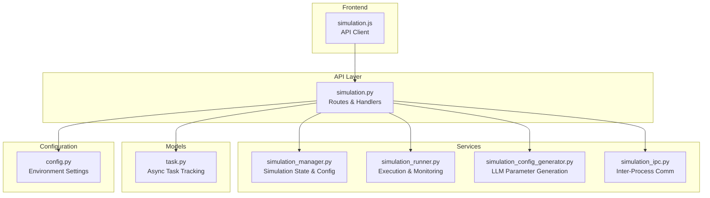
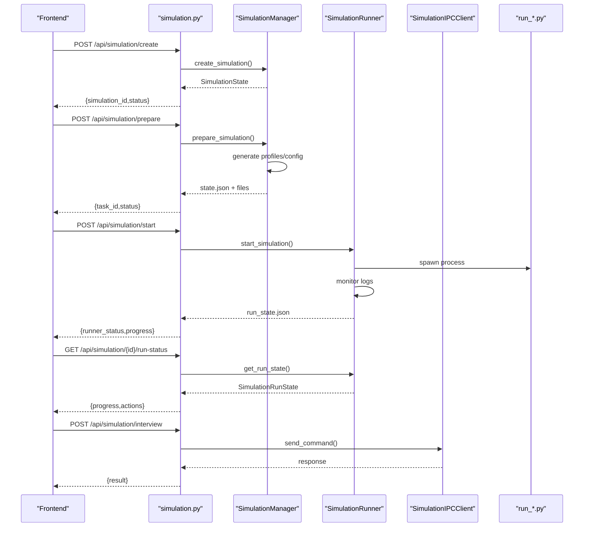
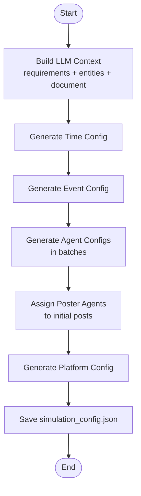
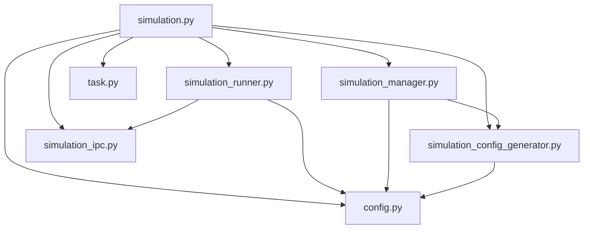

# Simulation Control API

<cite>
**Referenced Files in This Document**
- [simulation.py](file://backend/app/api/simulation.py)
- [simulation_manager.py](file://backend/app/services/simulation_manager.py)
- [simulation_runner.py](file://backend/app/services/simulation_runner.py)
- [simulation_config_generator.py](file://backend/app/services/simulation_config_generator.py)
- [simulation_ipc.py](file://backend/app/services/simulation_ipc.py)
- [task.py](file://backend/app/models/task.py)
- [config.py](file://backend/app/config.py)
- [simulation.js](file://frontend/src/api/simulation.js)
</cite>

## Table of Contents
1. [Introduction](#introduction)
2. [Project Structure](#project-structure)
3. [Core Components](#core-components)
4. [Architecture Overview](#architecture-overview)
5. [Detailed Component Analysis](#detailed-component-analysis)
6. [Dependency Analysis](#dependency-analysis)
7. [Performance Considerations](#performance-considerations)
8. [Troubleshooting Guide](#troubleshooting-guide)
9. [Conclusion](#conclusion)

## Introduction
This document provides comprehensive API documentation for the Simulation Control API, covering multi-agent simulation environments across Twitter and Reddit platforms. It details configuration endpoints for persona generation and parameter injection, execution endpoints for starting/stopping parallel runs, real-time monitoring endpoints, and memory management for temporal/long-term updates. The guide includes request/response schemas, parameter validation rules, error handling patterns, and practical workflows for setup and monitoring.

## Project Structure
The Simulation Control API is implemented in the backend Flask application with modular services:
- API layer: Routes and request/response handling
- Services: Simulation management, runner, configuration generation, IPC
- Models: Task management for async operations
- Configuration: Environment and platform settings

**Diagram sources**
- [simulation.py:1-2694](file://backend/app/api/simulation.py#L1-L2694)
- [simulation_manager.py:1-529](file://backend/app/services/simulation_manager.py#L1-L529)
- [simulation_runner.py:1-1763](file://backend/app/services/simulation_runner.py#L1-L1763)
- [simulation_config_generator.py:1-988](file://backend/app/services/simulation_config_generator.py#L1-L988)
- [simulation_ipc.py:1-395](file://backend/app/services/simulation_ipc.py#L1-L395)
- [task.py:1-185](file://backend/app/models/task.py#L1-L185)
- [config.py:1-76](file://backend/app/config.py#L1-L76)
- [simulation.js:1-188](file://frontend/src/api/simulation.js#L1-L188)

**Section sources**
- [simulation.py:1-2694](file://backend/app/api/simulation.py#L1-L2694)
- [simulation_manager.py:1-529](file://backend/app/services/simulation_manager.py#L1-L529)
- [simulation_runner.py:1-1763](file://backend/app/services/simulation_runner.py#L1-L1763)
- [simulation_config_generator.py:1-988](file://backend/app/services/simulation_config_generator.py#L1-L988)
- [simulation_ipc.py:1-395](file://backend/app/services/simulation_ipc.py#L1-L395)
- [task.py:1-185](file://backend/app/models/task.py#L1-L185)
- [config.py:1-76](file://backend/app/config.py#L1-L76)
- [simulation.js:1-188](file://frontend/src/api/simulation.js#L1-L188)

## Core Components
- Simulation Manager: Creates, prepares, and tracks simulation state; generates configuration and profiles; exposes run instructions.
- Simulation Runner: Executes simulations in background processes, monitors real-time status, parses action logs, and manages memory updates.
- Configuration Generator: Uses LLM to intelligently generate time/event/agent/platform parameters based on project requirements and graph entities.
- IPC Module: Provides file-based command/response communication between Flask and simulation scripts for interviews and environment control.
- Task Manager: Tracks long-running tasks (e.g., preparation) with progress callbacks and completion/failure states.
- Frontend API Client: Wraps HTTP requests to the Simulation Control API.

Key simulation status lifecycle:
- CREATED → PREPARING → READY → RUNNING → COMPLETED/STOPPED/FAILED
- Runner status: IDLE → STARTING → RUNNING → COMPLETED/STOPPED/FAILED

**Section sources**
- [simulation_manager.py:24-112](file://backend/app/services/simulation_manager.py#L24-L112)
- [simulation_runner.py:35-193](file://backend/app/services/simulation_runner.py#L35-L193)
- [simulation_config_generator.py:199-379](file://backend/app/services/simulation_config_generator.py#L199-L379)
- [simulation_ipc.py:25-93](file://backend/app/services/simulation_ipc.py#L25-L93)
- [task.py:14-52](file://backend/app/models/task.py#L14-L52)

## Architecture Overview
The API orchestrates multi-agent simulations across Twitter and Reddit with asynchronous preparation and real-time execution monitoring.

**Diagram sources**
- [simulation.py:146-1619](file://backend/app/api/simulation.py#L146-L1619)
- [simulation_manager.py:193-457](file://backend/app/services/simulation_manager.py#L193-L457)
- [simulation_runner.py:312-577](file://backend/app/services/simulation_runner.py#L312-L577)
- [simulation_ipc.py:117-268](file://backend/app/services/simulation_ipc.py#L117-L268)

## Detailed Component Analysis

### Simulation Configuration Endpoints
These endpoints configure persona generation, platform settings, and parameter injection for simulations.

- POST /api/simulation/create
  - Purpose: Create a new simulation with optional platform enable flags.
  - Request JSON:
    - project_id (required)
    - graph_id (optional, auto-filled from project)
    - enable_twitter (boolean, default true)
    - enable_reddit (boolean, default true)
  - Response JSON:
    - success (boolean)
    - data: SimulationState fields including status, platform flags, timestamps

- POST /api/simulation/prepare
  - Purpose: Asynchronously prepare simulation environment (entities, profiles, config).
  - Request JSON:
    - simulation_id (required)
    - entity_types (array of strings, optional)
    - use_llm_for_profiles (boolean, default true)
    - parallel_profile_count (integer, default 5)
    - force_regenerate (boolean, default false)
  - Response JSON:
    - success (boolean)
    - data: {simulation_id, task_id, status, message, already_prepared, prepare_info}
  - Notes: Supports progress tracking via POST /prepare/status.

- POST /api/simulation/prepare/status
  - Purpose: Query preparation progress or completion status.
  - Request JSON:
    - task_id (optional, if querying in-progress task)
    - simulation_id (optional, if checking completion)
  - Response JSON:
    - success (boolean)
    - data: {status, progress, message, already_prepared, prepare_info}

- GET /api/simulation/{simulation_id}/config
  - Purpose: Retrieve complete LLM-generated simulation configuration.
  - Response JSON:
    - success (boolean)
    - data: {time_config, agent_configs, event_config, twitter_config, reddit_config, generation_reasoning}

- GET /api/simulation/{simulation_id}/config/realtime
  - Purpose: Real-time config inspection during generation.
  - Response JSON:
    - success (boolean)
    - data: {file_exists, file_modified_at, is_generating, generation_stage, config_generated, config, summary}

- GET /api/simulation/{simulation_id}/profiles
  - Purpose: Retrieve Agent profiles for a platform.
  - Query: platform (reddit|twitter, default reddit)
  - Response JSON:
    - success (boolean)
    - data: {platform, count, profiles}

- GET /api/simulation/{simulation_id}/profiles/realtime
  - Purpose: Real-time profiles inspection during generation.
  - Query: platform (reddit|twitter, default reddit)
  - Response JSON:
    - success (boolean)
    - data: {simulation_id, platform, count, total_expected, is_generating, file_exists, file_modified_at, profiles}

- POST /api/simulation/generate-profiles
  - Purpose: Generate profiles directly from a graph (standalone).
  - Request JSON:
    - graph_id (required)
    - entity_types (array, optional)
    - use_llm (boolean, default true)
    - platform (string, default reddit)
  - Response JSON:
    - success (boolean)
    - data: {platform, entity_types, count, profiles}

Validation rules:
- Missing required fields return 400 with error message.
- Non-existent simulations/projects return 404.
- Preparation checks ensure required files and state.json presence; auto-updates status when ready.

**Section sources**
- [simulation.py:146-2694](file://backend/app/api/simulation.py#L146-L2694)
- [simulation_manager.py:193-529](file://backend/app/services/simulation_manager.py#L193-L529)
- [simulation_config_generator.py:242-379](file://backend/app/services/simulation_config_generator.py#L242-L379)
- [task.py:73-185](file://backend/app/models/task.py#L73-L185)

### Simulation Execution Endpoints
Endpoints to start, stop, and manage parallel simulation runs.

- POST /api/simulation/start
  - Purpose: Start simulation with platform selection and optional graph memory updates.
  - Request JSON:
    - simulation_id (required)
    - platform (twitter|reddit|parallel, default parallel)
    - max_rounds (integer, optional, positive)
    - enable_graph_memory_update (boolean, default false)
    - force (boolean, default false)
  - Response JSON:
    - success (boolean)
    - data: {runner_status, process_pid, twitter_running, reddit_running, started_at, graph_memory_update_enabled, force_restarted, max_rounds_applied?}

- POST /api/simulation/stop
  - Purpose: Stop a running simulation.
  - Request JSON:
    - simulation_id (required)
  - Response JSON:
    - success (boolean)
    - data: {runner_status, completed_at?}

- GET /api/simulation/{simulation_id}/run-status
  - Purpose: Poll real-time run status.
  - Response JSON:
    - success (boolean)
    - data: {runner_status, current_round, total_rounds, progress_percent, simulated_hours, total_simulation_hours, twitter_running, reddit_running, twitter_actions_count, reddit_actions_count, total_actions_count, started_at, updated_at}

- GET /api/simulation/{simulation_id}/run-status/detail
  - Purpose: Detailed status including recent actions and platform breakdown.
  - Query: platform (twitter|reddit, optional)
  - Response JSON:
    - success (boolean)
    - data: {runner_status, current_round, total_rounds, progress_percent, all_actions[], twitter_actions[], reddit_actions[], recent_actions[], rounds_count}

- GET /api/simulation/{simulation_id}/timeline
  - Purpose: Timeline summary by round.
  - Query: start_round (integer, default 0), end_round (integer, optional)
  - Response JSON:
    - success (boolean)
    - data: {rounds_count, timeline[]}

- GET /api/simulation/{simulation_id}/agent-stats
  - Purpose: Statistics per Agent.
  - Response JSON:
    - success (boolean)
    - data: {agents_count, stats[]}

Resource management considerations:
- max_rounds truncates long simulations.
- force restart cleans run logs while preserving config/profiles.
- Graph memory updates require a valid graph_id and use batching to reduce API calls.

**Section sources**
- [simulation.py:1428-2399](file://backend/app/api/simulation.py#L1428-L2399)
- [simulation_runner.py:312-800](file://backend/app/services/simulation_runner.py#L312-L800)

### Simulation Status Monitoring Endpoints
Real-time monitoring of simulation progress and results.

- GET /api/simulation/{simulation_id}/actions
  - Purpose: Retrieve Agent action history with filters.
  - Query: limit (integer, default 100), offset (integer, default 0), platform (twitter|reddit), agent_id (integer), round_num (integer)
  - Response JSON:
    - success (boolean)
    - data: {count, actions[]}

- GET /api/simulation/{simulation_id}/posts
  - Purpose: Retrieve posts from platform-specific SQLite databases.
  - Query: platform (twitter|reddit, default reddit), limit (integer, default 50), offset (integer, default 0)
  - Response JSON:
    - success (boolean)
    - data: {platform, total, count, posts[]}

- GET /api/simulation/{simulation_id}/comments
  - Purpose: Retrieve comments (Reddit only).
  - Query: post_id (integer, optional), limit (integer, default 50), offset (integer, default 0)
  - Response JSON:
    - success (boolean)
    - data: {count, comments[]}

- GET /api/simulation/history
  - Purpose: Historical simulations with enriched info for homepage display.
  - Query: limit (integer, default 20)
  - Response JSON:
    - success (boolean)
    - data: [simulation entries with project info, status, counts, report_id, version]

**Section sources**
- [simulation.py:1841-2040](file://backend/app/api/simulation.py#L1841-L2040)
- [simulation_runner.py:195-800](file://backend/app/services/simulation_runner.py#L195-L800)

### Simulation Parameter Configuration Endpoints
Intelligent parameter generation using LLM with step-by-step refinement.

- Time configuration generation:
  - Based on entity count and daily activity patterns (Beijing time).
  - Outputs total_simulation_hours, minutes_per_round, agents_per_hour ranges, and peak/off-peak hours.

- Event configuration generation:
  - Extracts trending topics and narrative direction.
  - Assigns initial posts with poster types mapped to entity types.

- Agent configuration generation:
  - Generates activity configs per Agent (activity_level, posts_per_hour, comments_per_hour, active_hours, response_delay, sentiment_bias, stance, influence_weight).

- Platform configuration:
  - Platform-specific weights (recency, popularity, relevance) and thresholds (viral_threshold, echo_chamber_strength).

Generation workflow:

**Diagram sources**
- [simulation_config_generator.py:242-379](file://backend/app/services/simulation_config_generator.py#L242-L379)

**Section sources**
- [simulation_config_generator.py:199-988](file://backend/app/services/simulation_config_generator.py#L199-L988)

### Memory Management Endpoints
Temporal and long-term memory updates during simulation runs.

- Enable graph memory updates:
  - When starting simulation with enable_graph_memory_update=true, activities are streamed to Zep graph in real-time.
  - Requires a valid graph_id from project or simulation state.

- Real-time updates:
  - GraphMemoryManager batches updates to minimize API calls.
  - Activities include posts, comments, likes, reposts, follows, etc.

- Graceful environment closure:
  - POST /api/simulation/close-env sends a close command to the simulation environment.
  - Updates simulation status to COMPLETED upon successful closure.

- Interview memory integration:
  - Interviews can be sent via IPC; responses recorded in environment status and action logs.

**Section sources**
- [simulation.py:1626-1694](file://backend/app/api/simulation.py#L1626-L1694)
- [simulation_runner.py:372-577](file://backend/app/services/simulation_runner.py#L372-L577)
- [simulation_ipc.py:256-286](file://backend/app/services/simulation_ipc.py#L256-L286)

### Interview Endpoints
Interactive interviews with Agents during simulation command-waiting mode.

- POST /api/simulation/interview
  - Single Agent interview with optional platform specification.
  - Request JSON: {simulation_id, agent_id, prompt, platform?, timeout?}
  - Response JSON: {agent_id, prompt, result, timestamp}

- POST /api/simulation/interview/batch
  - Batch interview multiple Agents with optional per-item platform overrides.
  - Request JSON: {simulation_id, interviews[], platform?, timeout?}
  - Response JSON: {interviews_count, result, timestamp}

- POST /api/simulation/interview/all
  - Global interview: same prompt for all Agents across platforms.
  - Request JSON: {simulation_id, prompt, platform?, timeout?}
  - Response JSON: {interviews_count, result, timestamp}

- POST /api/simulation/interview/history
  - Retrieve interview history with filters.
  - Request JSON: {simulation_id, platform?, agent_id?, limit?}
  - Response JSON: {count, history[]}

- POST /api/simulation/env-status
  - Check environment availability for interviews.
  - Response JSON: {simulation_id, env_alive, twitter_available, reddit_available, message}

- POST /api/simulation/close-env
  - Graceful environment shutdown.
  - Response JSON: {message, result, timestamp}

Prompt optimization:
- All interview prompts are optimized with a prefix to prevent Agent tool calls and enforce direct text responses.

**Section sources**
- [simulation.py:2119-2694](file://backend/app/api/simulation.py#L2119-L2694)
- [simulation_runner.py:195-800](file://backend/app/services/simulation_runner.py#L195-L800)
- [simulation_ipc.py:117-286](file://backend/app/services/simulation_ipc.py#L117-L286)

### Practical Setup Workflows

#### Multi-Platform Simulation Setup
1. Create simulation:
   - POST /api/simulation/create with project_id and platform flags.
2. Prepare environment:
   - POST /api/simulation/prepare with entity_types and generation preferences.
   - Poll /api/simulation/prepare/status until status=ready.
3. Review configuration:
   - GET /api/simulation/{id}/config or /config/realtime for insights.
4. Start simulation:
   - POST /api/simulation/start with platform selection and optional max_rounds.
5. Monitor progress:
   - GET /api/simulation/{id}/run-status or /run-status/detail.
6. Retrieve results:
   - GET /api/simulation/{id}/posts/comments or /actions.

#### Parameter Injection Workflow
- Use POST /api/simulation/generate-profiles for quick persona generation from a graph.
- Modify generation parameters via prepare endpoint (entity_types, use_llm_for_profiles, parallel_profile_count).
- Adjust platform-specific behavior by enabling/disabling platforms during create/start.

#### Interview Workflow
- Ensure environment is alive via POST /api/simulation/env-status.
- Send interviews using /interview, /interview/batch, or /interview/all.
- Retrieve history via /interview/history.

**Section sources**
- [simulation.js:1-188](file://frontend/src/api/simulation.js#L1-L188)
- [simulation.py:146-2694](file://backend/app/api/simulation.py#L146-L2694)

## Dependency Analysis
The API relies on several internal modules with clear separation of concerns.

**Diagram sources**
- [simulation.py:1-2694](file://backend/app/api/simulation.py#L1-L2694)
- [simulation_manager.py:1-529](file://backend/app/services/simulation_manager.py#L1-L529)
- [simulation_runner.py:1-1763](file://backend/app/services/simulation_runner.py#L1-L1763)
- [simulation_config_generator.py:1-988](file://backend/app/services/simulation_config_generator.py#L1-L988)
- [simulation_ipc.py:1-395](file://backend/app/services/simulation_ipc.py#L1-L395)
- [task.py:1-185](file://backend/app/models/task.py#L1-L185)
- [config.py:1-76](file://backend/app/config.py#L1-L76)

**Section sources**
- [simulation.py:1-2694](file://backend/app/api/simulation.py#L1-L2694)
- [simulation_manager.py:1-529](file://backend/app/services/simulation_manager.py#L1-L529)
- [simulation_runner.py:1-1763](file://backend/app/services/simulation_runner.py#L1-L1763)
- [simulation_config_generator.py:1-988](file://backend/app/services/simulation_config_generator.py#L1-L988)
- [simulation_ipc.py:1-395](file://backend/app/services/simulation_ipc.py#L1-L395)
- [task.py:1-185](file://backend/app/models/task.py#L1-L185)
- [config.py:1-76](file://backend/app/config.py#L1-L76)

## Performance Considerations
- Asynchronous preparation: Use task_id polling to avoid blocking the UI.
- Real-time monitoring: Prefer incremental log reading and pagination for actions/posts.
- LLM generation: Context length limits and batched agent generation reduce failure rates.
- Graph memory updates: Batching minimizes external API calls; ensure adequate rate limits.
- Process management: Proper cleanup of stdout/stderr handles and process groups prevents resource leaks.

## Troubleshooting Guide
Common error patterns and resolutions:
- Missing project_id/graph_id: Ensure project exists and graph is built before creating simulations.
- Simulation not ready: Call /prepare and wait for status=ready; use /prepare/status to track progress.
- Running simulation conflicts: Use force=true to stop and clean logs before restarting.
- Interview timeouts: Increase timeout values; verify environment status via /env-status.
- LLM generation failures: Retry with adjusted parameters; check context length and JSON repair logic.
- File I/O errors: Verify simulation directory permissions and disk space.

**Section sources**
- [simulation.py:146-2694](file://backend/app/api/simulation.py#L146-L2694)
- [simulation_runner.py:478-577](file://backend/app/services/simulation_runner.py#L478-L577)
- [simulation_config_generator.py:433-533](file://backend/app/services/simulation_config_generator.py#L433-L533)

## Conclusion
The Simulation Control API provides a robust framework for configuring, executing, and monitoring multi-agent simulations across Twitter and Reddit. Its asynchronous preparation, real-time monitoring, and integrated memory management enable scalable and insightful social media simulation workflows. By following the documented endpoints, validation rules, and troubleshooting guidance, users can efficiently orchestrate complex simulation campaigns with precise control over parameters, execution, and results.