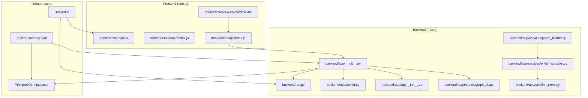
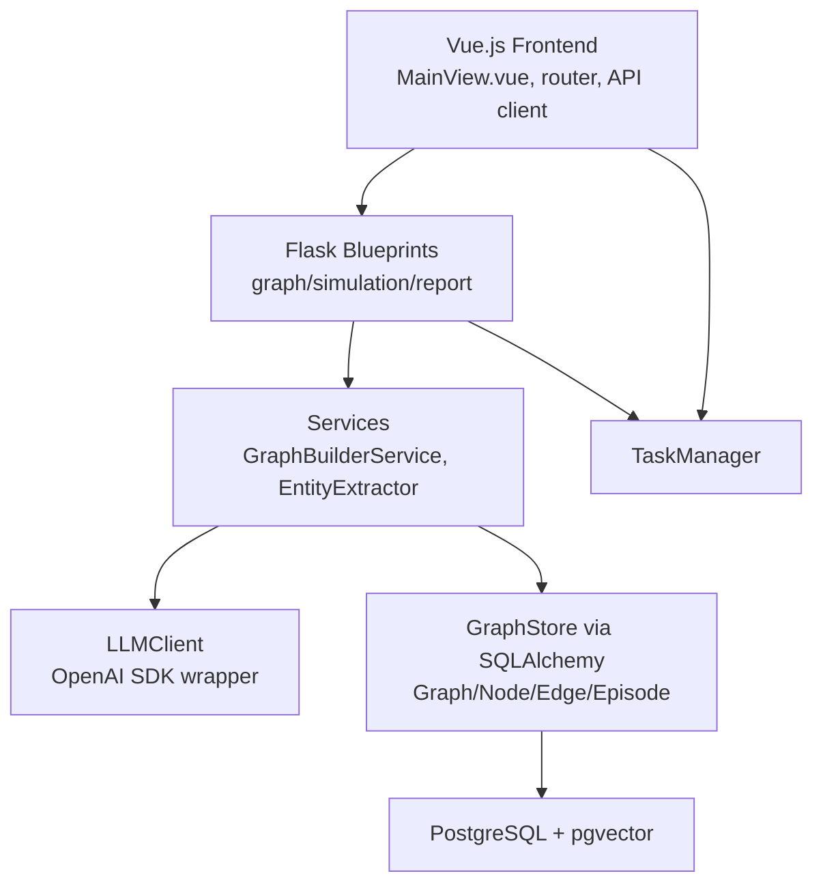
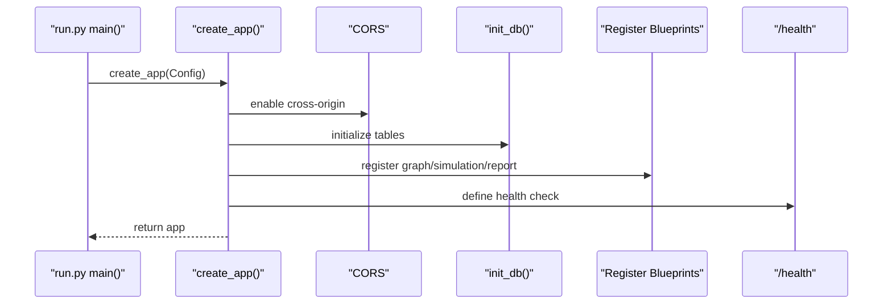
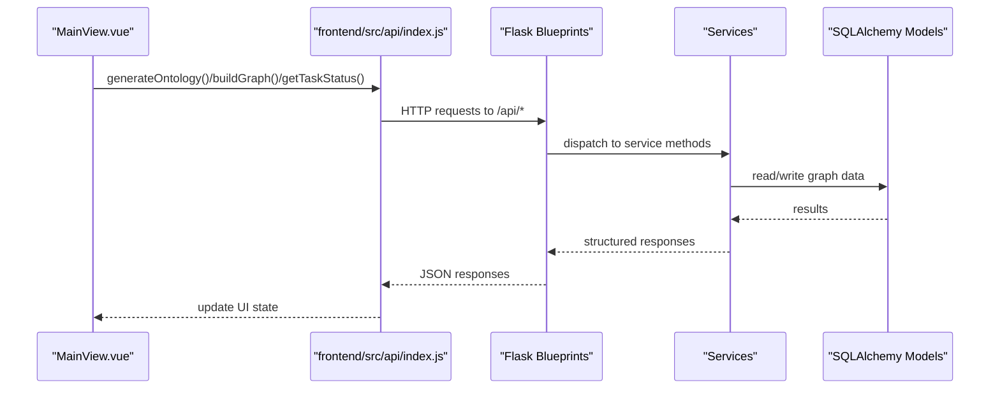
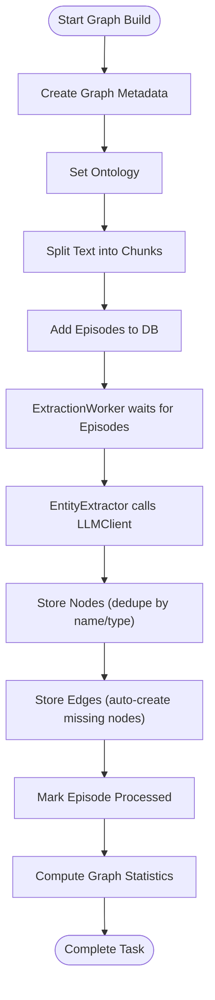
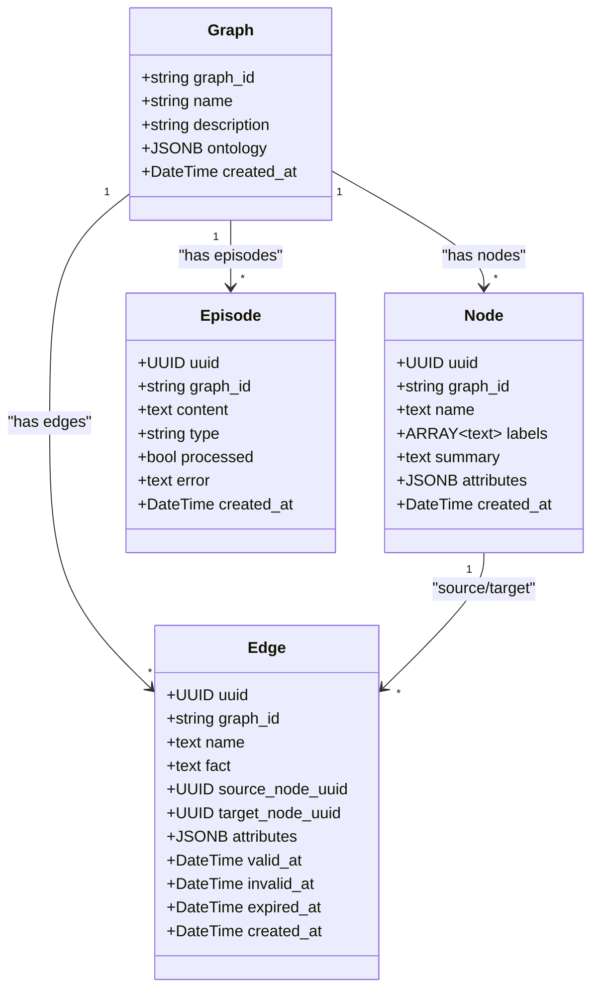
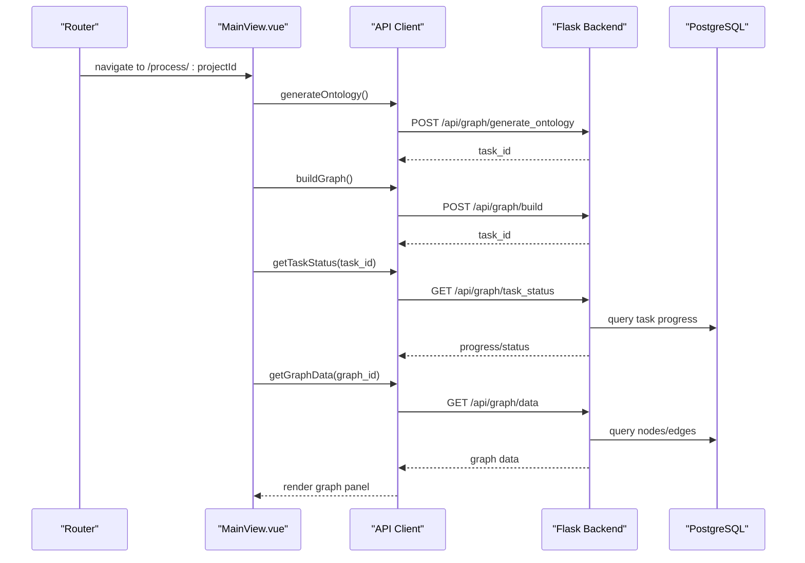
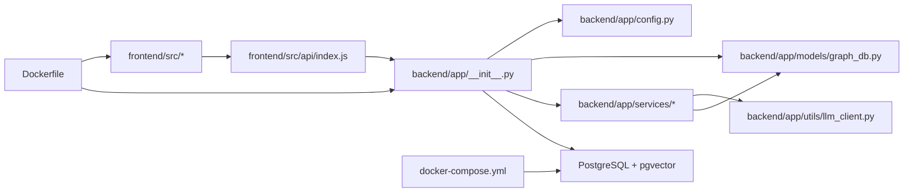

# Architecture and Design

<cite>
**Referenced Files in This Document**
- [backend/app/__init__.py](file://backend/app/__init__.py)
- [backend/run.py](file://backend/run.py)
- [backend/app/config.py](file://backend/app/config.py)
- [backend/app/api/__init__.py](file://backend/app/api/__init__.py)
- [backend/app/models/graph_db.py](file://backend/app/models/graph_db.py)
- [backend/app/models/__init__.py](file://backend/app/models/__init__.py)
- [backend/app/utils/llm_client.py](file://backend/app/utils/llm_client.py)
- [backend/app/services/entity_extractor.py](file://backend/app/services/entity_extractor.py)
- [backend/app/services/graph_builder.py](file://backend/app/services/graph_builder.py)
- [Dockerfile](file://Dockerfile)
- [docker-compose.yml](file://docker-compose.yml)
- [frontend/src/main.js](file://frontend/src/main.js)
- [frontend/src/router/index.js](file://frontend/src/router/index.js)
- [frontend/src/api/index.js](file://frontend/src/api/index.js)
- [frontend/src/views/MainView.vue](file://frontend/src/views/MainView.vue)
</cite>

## Table of Contents
1. [Introduction](#introduction)
2. [Project Structure](#project-structure)
3. [Core Components](#core-components)
4. [Architecture Overview](#architecture-overview)
5. [Detailed Component Analysis](#detailed-component-analysis)
6. [Dependency Analysis](#dependency-analysis)
7. [Performance Considerations](#performance-considerations)
8. [Troubleshooting Guide](#troubleshooting-guide)
9. [Conclusion](#conclusion)
10. [Appendices](#appendices)

## Introduction
This document describes the architecture and design of the Parallel World AI Prediction Engine. The system integrates a Flask backend with a Vue.js frontend, runs in Docker containers, and persists graph data in PostgreSQL enhanced with pgvector for vector embeddings. It follows a layered architecture with presentation, business logic, data access, and integration layers. The technology stack includes Flask 3.0+, Vue.js 3.5+, OpenAI SDK-compatible LLM client, CAMEL AI/OASIS simulation orchestration, and PyMuPDF-based text processing. Design patterns include the application factory pattern, service layer pattern, repository pattern (via SQLAlchemy), and observer-like polling mechanisms for asynchronous tasks.

## Project Structure
The repository is organized into:
- backend: Flask application with API blueprints, models, services, utilities, and configuration
- frontend: Vue.js 3.5+ SPA with routing, API clients, and views
- docker artifacts: Dockerfile and docker-compose for containerized deployment

**Diagram sources**
- [backend/app/__init__.py:1-99](file://backend/app/__init__.py#L1-L99)
- [backend/run.py:1-51](file://backend/run.py#L1-L51)
- [backend/app/config.py:1-76](file://backend/app/config.py#L1-L76)
- [backend/app/api/__init__.py:1-15](file://backend/app/api/__init__.py#L1-L15)
- [backend/app/models/graph_db.py:1-151](file://backend/app/models/graph_db.py#L1-L151)
- [backend/app/utils/llm_client.py:1-104](file://backend/app/utils/llm_client.py#L1-L104)
- [backend/app/services/graph_builder.py:1-307](file://backend/app/services/graph_builder.py#L1-L307)
- [backend/app/services/entity_extractor.py:1-291](file://backend/app/services/entity_extractor.py#L1-L291)
- [frontend/src/main.js:1-15](file://frontend/src/main.js#L1-L15)
- [frontend/src/router/index.js:1-53](file://frontend/src/router/index.js#L1-L53)
- [frontend/src/api/index.js:1-68](file://frontend/src/api/index.js#L1-L68)
- [frontend/src/views/MainView.vue:1-327](file://frontend/src/views/MainView.vue#L1-L327)
- [docker-compose.yml:1-38](file://docker-compose.yml#L1-L38)
- [Dockerfile:1-30](file://Dockerfile#L1-L30)

**Section sources**
- [backend/app/__init__.py:1-99](file://backend/app/__init__.py#L1-L99)
- [backend/run.py:1-51](file://backend/run.py#L1-L51)
- [backend/app/config.py:1-76](file://backend/app/config.py#L1-L76)
- [backend/app/api/__init__.py:1-15](file://backend/app/api/__init__.py#L1-L15)
- [backend/app/models/graph_db.py:1-151](file://backend/app/models/graph_db.py#L1-L151)
- [backend/app/utils/llm_client.py:1-104](file://backend/app/utils/llm_client.py#L1-L104)
- [backend/app/services/graph_builder.py:1-307](file://backend/app/services/graph_builder.py#L1-L307)
- [backend/app/services/entity_extractor.py:1-291](file://backend/app/services/entity_extractor.py#L1-L291)
- [frontend/src/main.js:1-15](file://frontend/src/main.js#L1-L15)
- [frontend/src/router/index.js:1-53](file://frontend/src/router/index.js#L1-L53)
- [frontend/src/api/index.js:1-68](file://frontend/src/api/index.js#L1-L68)
- [frontend/src/views/MainView.vue:1-327](file://frontend/src/views/MainView.vue#L1-L327)
- [docker-compose.yml:1-38](file://docker-compose.yml#L1-L38)
- [Dockerfile:1-30](file://Dockerfile#L1-L30)

## Core Components
- Flask Application Factory: Creates and configures the Flask app, registers blueprints, sets up CORS, logging, and health checks, and initializes the database.
- API Layer: Blueprints for graph, simulation, and report endpoints; routes are mounted under /api/{graph,simulation,report}.
- Business Logic Layer: Services such as GraphBuilderService and EntityExtractor orchestrate graph construction, text processing, and LLM-driven extraction.
- Data Access Layer: SQLAlchemy models for Graph, Node, Edge, Episode backed by PostgreSQL with pgvector support; session management and indexing.
- Integration Layer: LLMClient wraps OpenAI SDK-compatible calls; file parsing utilities; task management for asynchronous operations.
- Frontend: Vue.js SPA with routing, API client with interceptors, and views orchestrating the workflow from graph building to simulation and reporting.

**Section sources**
- [backend/app/__init__.py:20-99](file://backend/app/__init__.py#L20-L99)
- [backend/app/api/__init__.py:5-15](file://backend/app/api/__init__.py#L5-L15)
- [backend/app/services/graph_builder.py:39-307](file://backend/app/services/graph_builder.py#L39-L307)
- [backend/app/services/entity_extractor.py:16-291](file://backend/app/services/entity_extractor.py#L16-L291)
- [backend/app/models/graph_db.py:24-151](file://backend/app/models/graph_db.py#L24-L151)
- [backend/app/utils/llm_client.py:14-104](file://backend/app/utils/llm_client.py#L14-L104)
- [frontend/src/router/index.js:1-53](file://frontend/src/router/index.js#L1-L53)
- [frontend/src/api/index.js:1-68](file://frontend/src/api/index.js#L1-L68)

## Architecture Overview
The system uses a layered architecture:
- Presentation: Vue.js frontend handles user interactions, routing, and polling for task updates.
- Business Logic: Flask blueprints delegate to services that coordinate extraction, graph building, and simulation orchestration.
- Data Access: SQLAlchemy ORM models persist graph data; PostgreSQL with pgvector enables vector similarity operations.
- Integration: LLMClient abstracts LLM calls; task manager tracks asynchronous work; file parsing utilities prepare text for processing.

**Diagram sources**
- [frontend/src/views/MainView.vue:1-327](file://frontend/src/views/MainView.vue#L1-L327)
- [frontend/src/router/index.js:1-53](file://frontend/src/router/index.js#L1-L53)
- [frontend/src/api/index.js:1-68](file://frontend/src/api/index.js#L1-L68)
- [backend/app/api/__init__.py:5-15](file://backend/app/api/__init__.py#L5-L15)
- [backend/app/services/graph_builder.py:39-307](file://backend/app/services/graph_builder.py#L39-L307)
- [backend/app/services/entity_extractor.py:16-291](file://backend/app/services/entity_extractor.py#L16-L291)
- [backend/app/utils/llm_client.py:14-104](file://backend/app/utils/llm_client.py#L14-L104)
- [backend/app/models/graph_db.py:24-151](file://backend/app/models/graph_db.py#L24-L151)

## Detailed Component Analysis

### Flask Application Factory and Bootstrapping
- Application factory creates the Flask app, configures JSON encoding, CORS, logging, and registers blueprints for graph, simulation, and report APIs.
- Database initialization ensures tables exist and health endpoint validates connectivity.
- Request/response logging middleware records method/path and status codes.
- Simulation runner cleanup is registered to terminate child processes on shutdown.

**Diagram sources**
- [backend/run.py:25-46](file://backend/run.py#L25-L46)
- [backend/app/__init__.py:20-99](file://backend/app/__init__.py#L20-L99)

**Section sources**
- [backend/run.py:1-51](file://backend/run.py#L1-L51)
- [backend/app/__init__.py:20-99](file://backend/app/__init__.py#L20-L99)

### API Layer and Routing
- Blueprints organize endpoints under /api/graph, /api/simulation, and /api/report.
- The frontend API client targets http://localhost:5001 by default, configurable via environment variables.

**Diagram sources**
- [frontend/src/views/MainView.vue:119-327](file://frontend/src/views/MainView.vue#L119-L327)
- [frontend/src/api/index.js:1-68](file://frontend/src/api/index.js#L1-L68)
- [backend/app/api/__init__.py:5-15](file://backend/app/api/__init__.py#L5-L15)
- [backend/app/models/graph_db.py:24-151](file://backend/app/models/graph_db.py#L24-L151)

**Section sources**
- [backend/app/api/__init__.py:1-15](file://backend/app/api/__init__.py#L1-L15)
- [frontend/src/api/index.js:1-68](file://frontend/src/api/index.js#L1-L68)
- [frontend/src/views/MainView.vue:119-327](file://frontend/src/views/MainView.vue#L119-L327)

### Graph Construction Service and Entity Extraction
- GraphBuilderService coordinates graph creation, setting an ontology, chunking text, adding episodes, and triggering LLM-based extraction via ExtractionWorker.
- EntityExtractor uses LLMClient to parse structured JSON responses and stores nodes and edges in the graph store, deduplicating entities and auto-creating missing nodes for relationships.
- TextProcessor splits input text into overlapping chunks; ExtractionWorker manages episode processing lifecycle.

**Diagram sources**
- [backend/app/services/graph_builder.py:51-184](file://backend/app/services/graph_builder.py#L51-L184)
- [backend/app/services/entity_extractor.py:26-167](file://backend/app/services/entity_extractor.py#L26-L167)
- [backend/app/utils/llm_client.py:35-104](file://backend/app/utils/llm_client.py#L35-L104)

**Section sources**
- [backend/app/services/graph_builder.py:39-307](file://backend/app/services/graph_builder.py#L39-L307)
- [backend/app/services/entity_extractor.py:16-291](file://backend/app/services/entity_extractor.py#L16-L291)
- [backend/app/utils/llm_client.py:14-104](file://backend/app/utils/llm_client.py#L14-L104)

### Data Models and Persistence
- SQLAlchemy models define Graph, Node, Edge, and Episode with appropriate indices for performance.
- PostgreSQL with pgvector is used for vector embeddings; the engine supports pooling and pre-ping for reliability.
- Session management uses scoped sessions with commit/rollback semantics.

**Diagram sources**
- [backend/app/models/graph_db.py:24-105](file://backend/app/models/graph_db.py#L24-L105)

**Section sources**
- [backend/app/models/graph_db.py:1-151](file://backend/app/models/graph_db.py#L1-L151)

### Frontend Integration and Workflow
- Vue.js SPA bootstraps the app, installs router, and mounts the root component.
- Router defines routes for home, process, simulation, report, and interaction views.
- MainView orchestrates project initialization, polling for task status, and graph data retrieval.
- API client centralizes request/response handling and includes a retry mechanism.

**Diagram sources**
- [frontend/src/router/index.js:1-53](file://frontend/src/router/index.js#L1-L53)
- [frontend/src/views/MainView.vue:119-327](file://frontend/src/views/MainView.vue#L119-L327)
- [frontend/src/api/index.js:1-68](file://frontend/src/api/index.js#L1-L68)
- [backend/app/models/graph_db.py:24-151](file://backend/app/models/graph_db.py#L24-L151)

**Section sources**
- [frontend/src/main.js:1-15](file://frontend/src/main.js#L1-L15)
- [frontend/src/router/index.js:1-53](file://frontend/src/router/index.js#L1-L53)
- [frontend/src/views/MainView.vue:1-327](file://frontend/src/views/MainView.vue#L1-L327)
- [frontend/src/api/index.js:1-68](file://frontend/src/api/index.js#L1-L68)

## Dependency Analysis
- Flask application depends on configuration, logging, CORS, SQLAlchemy engine/session, and blueprints.
- Services depend on the graph store and LLM client; entity extractor depends on the graph store and LLM client.
- Frontend depends on axios for HTTP communication and Vue Router for navigation.
- Infrastructure depends on Docker Compose to provision PostgreSQL with pgvector and expose ports.

**Diagram sources**
- [frontend/src/api/index.js:1-68](file://frontend/src/api/index.js#L1-L68)
- [backend/app/__init__.py:1-99](file://backend/app/__init__.py#L1-L99)
- [backend/app/config.py:1-76](file://backend/app/config.py#L1-L76)
- [backend/app/models/graph_db.py:1-151](file://backend/app/models/graph_db.py#L1-L151)
- [backend/app/utils/llm_client.py:1-104](file://backend/app/utils/llm_client.py#L1-L104)
- [docker-compose.yml:1-38](file://docker-compose.yml#L1-L38)
- [Dockerfile:1-30](file://Dockerfile#L1-L30)

**Section sources**
- [frontend/src/api/index.js:1-68](file://frontend/src/api/index.js#L1-L68)
- [backend/app/__init__.py:1-99](file://backend/app/__init__.py#L1-L99)
- [backend/app/config.py:1-76](file://backend/app/config.py#L1-L76)
- [backend/app/models/graph_db.py:1-151](file://backend/app/models/graph_db.py#L1-L151)
- [backend/app/utils/llm_client.py:1-104](file://backend/app/utils/llm_client.py#L1-L104)
- [docker-compose.yml:1-38](file://docker-compose.yml#L1-L38)
- [Dockerfile:1-30](file://Dockerfile#L1-L30)

## Performance Considerations
- Asynchronous task execution: Graph building and LLM extraction run in background threads; polling updates UI progressively.
- Database pooling: SQLAlchemy engine configured with pool size and overflow to handle concurrent requests.
- Indexes: Nodes and edges have composite and single-column indexes to optimize lookups during graph queries.
- Chunking and batching: Text is split into overlapping chunks and processed in batches to balance throughput and memory usage.
- LLM cost control: Temperature and token limits are tuned; JSON mode reduces hallucinations and parsing overhead.
- Frontend polling cadence: Graph and task polling intervals are tuned to reduce load while keeping UX responsive.

[No sources needed since this section provides general guidance]

## Troubleshooting Guide
- Health check failures: The /health endpoint verifies database connectivity; failures indicate PostgreSQL not running or misconfigured credentials.
- Configuration validation: The backend validates required keys (LLM_API_KEY, DATABASE_URL) and exits early if missing.
- Request logging: Middleware logs request method/path and response status; inspect logs for detailed traces.
- Frontend timeouts: The API client sets a generous timeout for long-running operations like ontology generation; network errors and timeouts are surfaced in interceptors.
- Simulation cleanup: On shutdown, simulation processes are registered to be cleaned up to prevent orphaned processes.

**Section sources**
- [backend/app/__init__.py:84-92](file://backend/app/__init__.py#L84-L92)
- [backend/run.py:28-34](file://backend/run.py#L28-L34)
- [backend/app/__init__.py:64-75](file://backend/app/__init__.py#L64-L75)
- [frontend/src/api/index.js:24-51](file://frontend/src/api/index.js#L24-L51)

## Conclusion
The Parallel World AI Prediction Engine combines a Vue.js frontend with a Flask backend, orchestrated by Docker and powered by PostgreSQL with pgvector. The layered architecture cleanly separates concerns, while design patterns such as the application factory, service layer, repository pattern, and observer-style polling enable maintainable and scalable development. The system emphasizes asynchronous workflows, robust configuration, and resilient integrations with LLM providers and vector databases.

[No sources needed since this section summarizes without analyzing specific files]

## Appendices

### Technology Stack
- Backend: Flask 3.0+, SQLAlchemy, PostgreSQL with pgvector, OpenAI SDK-compatible LLM client
- Frontend: Vue.js 3.5+, Vue Router, Axios
- DevOps: Docker, docker-compose
- Additional: PyMuPDF-based text processing utilities

**Section sources**
- [backend/app/utils/llm_client.py:9](file://backend/app/utils/llm_client.py#L9)
- [backend/app/models/graph_db.py:16](file://backend/app/models/graph_db.py#L16)
- [frontend/src/router/index.js:1](file://frontend/src/router/index.js#L1)
- [frontend/src/api/index.js:1](file://frontend/src/api/index.js#L1)
- [Dockerfile:1-30](file://Dockerfile#L1-L30)
- [docker-compose.yml:1-38](file://docker-compose.yml#L1-L38)

### Deployment Topology and Infrastructure Requirements
- Containers: PostgreSQL with pgvector and the application container exposing ports for frontend and backend.
- Volumes: Persistent volume for PostgreSQL data; shared uploads directory for simulations.
- Ports: Exposed 3000 (frontend dev), 5001 (backend), and 5433 (PostgreSQL).
- Dependencies: uv for fast Python dependency resolution; Node.js installed for frontend toolchain.

**Section sources**
- [docker-compose.yml:1-38](file://docker-compose.yml#L1-L38)
- [Dockerfile:1-30](file://Dockerfile#L1-L30)