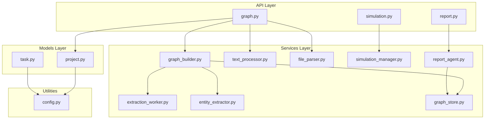
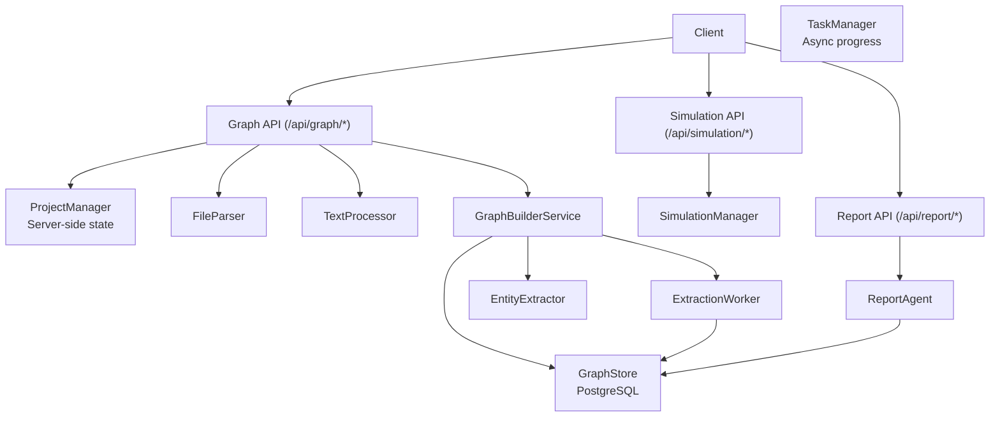
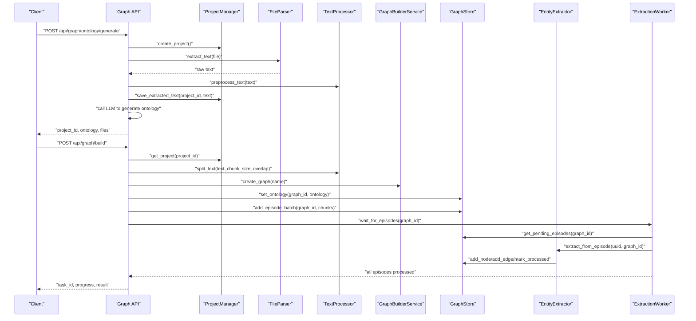
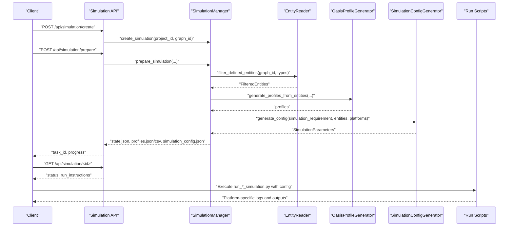
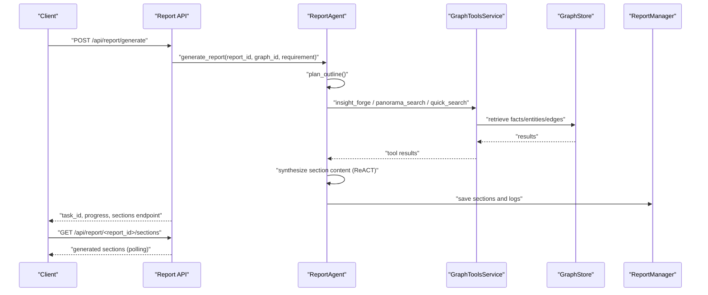
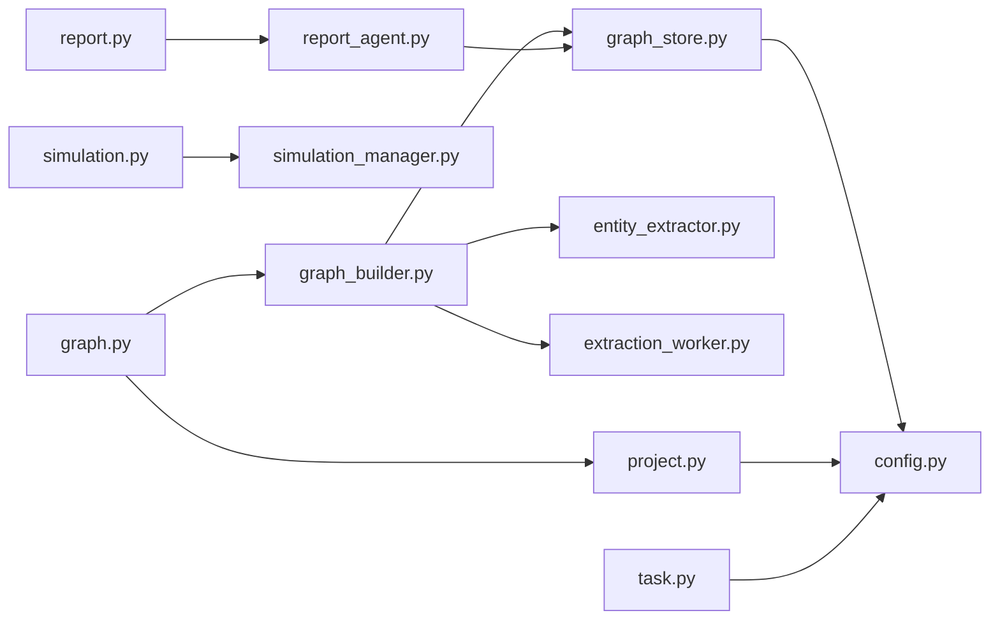

# Data Flow Architecture

<cite>
**Referenced Files in This Document**
- [graph.py](file://backend/app/api/graph.py)
- [simulation.py](file://backend/app/api/simulation.py)
- [report.py](file://backend/app/api/report.py)
- [graph_builder.py](file://backend/app/services/graph_builder.py)
- [extraction_worker.py](file://backend/app/services/extraction_worker.py)
- [entity_extractor.py](file://backend/app/services/entity_extractor.py)
- [graph_store.py](file://backend/app/services/graph_store.py)
- [text_processor.py](file://backend/app/services/text_processor.py)
- [file_parser.py](file://backend/app/utils/file_parser.py)
- [project.py](file://backend/app/models/project.py)
- [task.py](file://backend/app/models/task.py)
- [simulation_manager.py](file://backend/app/services/simulation_manager.py)
- [report_agent.py](file://backend/app/services/report_agent.py)
- [config.py](file://backend/app/config.py)
</cite>

## Table of Contents
1. [Introduction](#introduction)
2. [Project Structure](#project-structure)
3. [Core Components](#core-components)
4. [Architecture Overview](#architecture-overview)
5. [Detailed Component Analysis](#detailed-component-analysis)
6. [Dependency Analysis](#dependency-analysis)
7. [Performance Considerations](#performance-considerations)
8. [Troubleshooting Guide](#troubleshooting-guide)
9. [Conclusion](#conclusion)

## Introduction
This document describes the data flow architecture of the Parallel World AI Prediction Engine. It covers three primary data pathways:
- Document processing flow: upload → text extraction → chunking → LLM analysis → graph construction
- Simulation flow: configuration → agent initialization → action execution → memory updates → status reporting
- Report generation flow: requirement analysis → tool retrieval → content synthesis → review process

It explains data transformation stages, persistence points, real-time processing mechanisms, and error handling. Sequence diagrams illustrate typical workflows, and performance considerations and optimization strategies are provided for each flow.

## Project Structure
The backend is organized around:
- API layer: Flask blueprints exposing endpoints for graph, simulation, and report workflows
- Services layer: orchestration and domain logic for graph building, entity extraction, simulation management, and report generation
- Models layer: project state and task status persistence
- Utilities: file parsing, LLM client, logging, and retry helpers
- Configuration: centralized configuration and validation

**Diagram sources**
- [graph.py:1-604](file://backend/app/api/graph.py#L1-L604)
- [simulation.py:1-800](file://backend/app/api/simulation.py#L1-L800)
- [report.py:1-800](file://backend/app/api/report.py#L1-L800)
- [graph_builder.py:1-307](file://backend/app/services/graph_builder.py#L1-L307)
- [extraction_worker.py:1-109](file://backend/app/services/extraction_worker.py#L1-L109)
- [entity_extractor.py:1-291](file://backend/app/services/entity_extractor.py#L1-L291)
- [graph_store.py:1-375](file://backend/app/services/graph_store.py#L1-L375)
- [text_processor.py:1-72](file://backend/app/services/text_processor.py#L1-L72)
- [file_parser.py:1-190](file://backend/app/utils/file_parser.py#L1-L190)
- [project.py:1-306](file://backend/app/models/project.py#L1-L306)
- [task.py:1-185](file://backend/app/models/task.py#L1-L185)
- [simulation_manager.py:1-529](file://backend/app/services/simulation_manager.py#L1-L529)
- [report_agent.py:1-1200](file://backend/app/services/report_agent.py#L1-L1200)
- [config.py:1-76](file://backend/app/config.py#L1-L76)

**Section sources**
- [graph.py:1-604](file://backend/app/api/graph.py#L1-L604)
- [simulation.py:1-800](file://backend/app/api/simulation.py#L1-L800)
- [report.py:1-800](file://backend/app/api/report.py#L1-L800)
- [graph_builder.py:1-307](file://backend/app/services/graph_builder.py#L1-L307)
- [extraction_worker.py:1-109](file://backend/app/services/extraction_worker.py#L1-L109)
- [entity_extractor.py:1-291](file://backend/app/services/entity_extractor.py#L1-L291)
- [graph_store.py:1-375](file://backend/app/services/graph_store.py#L1-L375)
- [text_processor.py:1-72](file://backend/app/services/text_processor.py#L1-L72)
- [file_parser.py:1-190](file://backend/app/utils/file_parser.py#L1-L190)
- [project.py:1-306](file://backend/app/models/project.py#L1-L306)
- [task.py:1-185](file://backend/app/models/task.py#L1-L185)
- [simulation_manager.py:1-529](file://backend/app/services/simulation_manager.py#L1-L529)
- [report_agent.py:1-1200](file://backend/app/services/report_agent.py#L1-L1200)
- [config.py:1-76](file://backend/app/config.py#L1-L76)

## Core Components
- Project context: server-side persistent state for uploads, extracted text, and graph metadata
- Task manager: asynchronous task lifecycle and progress tracking
- Graph builder: orchestrates chunking, LLM extraction, and graph persistence
- Entity extractor: prompts and parses LLM JSON for entities and relationships
- Extraction worker: background processing of episodes until completion
- Graph store: unified PostgreSQL access layer for nodes, edges, episodes, and statistics
- Text processor and file parser: robust text extraction and chunking
- Simulation manager: prepares dual-platform simulation environments
- Report agent: ReACT-based report planner and generator with tool integration

**Section sources**
- [project.py:17-98](file://backend/app/models/project.py#L17-L98)
- [task.py:14-51](file://backend/app/models/task.py#L14-L51)
- [graph_builder.py:39-93](file://backend/app/services/graph_builder.py#L39-L93)
- [entity_extractor.py:16-35](file://backend/app/services/entity_extractor.py#L16-L35)
- [extraction_worker.py:16-35](file://backend/app/services/extraction_worker.py#L16-L35)
- [graph_store.py:21-71](file://backend/app/services/graph_store.py#L21-L71)
- [text_processor.py:9-34](file://backend/app/services/text_processor.py#L9-L34)
- [file_parser.py:61-94](file://backend/app/utils/file_parser.py#L61-L94)
- [simulation_manager.py:114-137](file://backend/app/services/simulation_manager.py#L114-L137)
- [report_agent.py:864-916](file://backend/app/services/report_agent.py#L864-L916)

## Architecture Overview
The engine separates concerns across API, services, models, and utilities. Data flows are persisted at key stages (project metadata, extracted text, graph store, simulation state, report artifacts) and monitored via task progress. Asynchronous workers and background threads enable scalable processing.

**Diagram sources**
- [graph.py:121-522](file://backend/app/api/graph.py#L121-L522)
- [simulation.py:146-791](file://backend/app/api/simulation.py#L146-L791)
- [report.py:24-195](file://backend/app/api/report.py#L24-L195)
- [project.py:101-165](file://backend/app/models/project.py#L101-L165)
- [task.py:54-99](file://backend/app/models/task.py#L54-L99)
- [graph_builder.py:39-93](file://backend/app/services/graph_builder.py#L39-L93)
- [extraction_worker.py:30-108](file://backend/app/services/extraction_worker.py#L30-L108)
- [entity_extractor.py:26-166](file://backend/app/services/entity_extractor.py#L26-L166)
- [graph_store.py:32-124](file://backend/app/services/graph_store.py#L32-L124)
- [file_parser.py:67-94](file://backend/app/utils/file_parser.py#L67-L94)
- [text_processor.py:18-34](file://backend/app/services/text_processor.py#L18-L34)
- [simulation_manager.py:229-447](file://backend/app/services/simulation_manager.py#L229-L447)
- [report_agent.py:864-916](file://backend/app/services/report_agent.py#L864-L916)

## Detailed Component Analysis

### Document Processing Flow
End-to-end flow: upload → text extraction → chunking → LLM analysis → graph construction.

**Diagram sources**
- [graph.py:121-522](file://backend/app/api/graph.py#L121-L522)
- [project.py:133-165](file://backend/app/models/project.py#L133-L165)
- [file_parser.py:67-94](file://backend/app/utils/file_parser.py#L67-L94)
- [text_processor.py:18-34](file://backend/app/services/text_processor.py#L18-L34)
- [graph_builder.py:185-235](file://backend/app/services/graph_builder.py#L185-L235)
- [entity_extractor.py:26-166](file://backend/app/services/entity_extractor.py#L26-L166)
- [extraction_worker.py:30-108](file://backend/app/services/extraction_worker.py#L30-L108)
- [graph_store.py:75-124](file://backend/app/services/graph_store.py#L75-L124)

Key transformations and persistence:
- File parsing normalizes encodings and extracts raw text
- Text preprocessing removes excessive whitespace and normalizes line breaks
- Chunking splits text into overlapping segments for LLM consumption
- LLM-driven entity/relationship extraction produces structured JSON consumed by the graph store
- Episodes are marked processed; graph statistics are computed post-build

Validation and error handling:
- API validates presence of simulation requirement and uploaded files
- Project state transitions guard against invalid sequencing
- Task manager tracks progress and failures; project status is updated accordingly

**Section sources**
- [graph.py:121-522](file://backend/app/api/graph.py#L121-L522)
- [file_parser.py:11-58](file://backend/app/utils/file_parser.py#L11-L58)
- [text_processor.py:37-61](file://backend/app/services/text_processor.py#L37-L61)
- [graph_builder.py:185-235](file://backend/app/services/graph_builder.py#L185-L235)
- [entity_extractor.py:26-166](file://backend/app/services/entity_extractor.py#L26-L166)
- [extraction_worker.py:30-108](file://backend/app/services/extraction_worker.py#L30-L108)
- [graph_store.py:106-124](file://backend/app/services/graph_store.py#L106-L124)
- [project.py:17-24](file://backend/app/models/project.py#L17-L24)
- [task.py:106-162](file://backend/app/models/task.py#L106-L162)

### Simulation Flow
End-to-end flow: configuration → agent initialization → action execution → memory updates → status reporting.

**Diagram sources**
- [simulation.py:146-791](file://backend/app/api/simulation.py#L146-L791)
- [simulation_manager.py:193-447](file://backend/app/services/simulation_manager.py#L193-L447)

Key transformations and persistence:
- Entities are filtered by defined types and enriched with edges
- Agent profiles are generated and saved to platform-specific formats
- Simulation configuration is generated and persisted
- Run instructions expose commands to execute scripts from the scripts directory

Real-time processing:
- Progress callbacks update task state during preparation
- Preparation checks for existing state to avoid duplication

**Section sources**
- [simulation.py:146-791](file://backend/app/api/simulation.py#L146-L791)
- [simulation_manager.py:229-447](file://backend/app/services/simulation_manager.py#L229-L447)

### Report Generation Flow
End-to-end flow: requirement analysis → tool retrieval → content synthesis → review process.

**Diagram sources**
- [report.py:24-195](file://backend/app/api/report.py#L24-L195)
- [report_agent.py:864-1200](file://backend/app/services/report_agent.py#L864-L1200)
- [graph_store.py:259-316](file://backend/app/services/graph_store.py#L259-L316)

Key transformations and persistence:
- Report agent plans an outline based on simulation context
- Sections are generated iteratively using ReACT with tool calls
- Logs capture detailed agent actions and tool results
- Sections are persisted and retrievable individually

Real-time processing:
- Progress callbacks and polling endpoints enable near real-time visibility
- Agent logs support debugging and auditing

**Section sources**
- [report.py:24-195](file://backend/app/api/report.py#L24-L195)
- [report_agent.py:1136-1200](file://backend/app/services/report_agent.py#L1136-L1200)
- [graph_store.py:259-316](file://backend/app/services/graph_store.py#L259-L316)

### Data Validation Points and Error Handling
- API layer validates inputs (e.g., required parameters, allowed file extensions)
- Configuration validation ensures LLM and database credentials are present
- Task manager centralizes progress, completion, and failure states
- Project state enforces valid workflow transitions
- Extraction worker and entity extractor handle partial failures and mark episodes accordingly

**Section sources**
- [graph.py:25-30](file://backend/app/api/graph.py#L25-L30)
- [graph.py:286-292](file://backend/app/api/graph.py#L286-L292)
- [config.py:66-74](file://backend/app/config.py#L66-L74)
- [task.py:106-162](file://backend/app/models/task.py#L106-L162)
- [project.py:17-24](file://backend/app/models/project.py#L17-L24)
- [extraction_worker.py:82-88](file://backend/app/services/extraction_worker.py#L82-L88)

## Dependency Analysis
The system exhibits layered dependencies with clear separation of concerns:
- API depends on models and services
- Services depend on models and utilities
- Graph builder composes entity extraction and the extraction worker
- Report agent composes graph tools and logging utilities
- Persistence is centralized in the graph store and project/task models

**Diagram sources**
- [graph.py:121-522](file://backend/app/api/graph.py#L121-L522)
- [simulation.py:146-791](file://backend/app/api/simulation.py#L146-L791)
- [report.py:24-195](file://backend/app/api/report.py#L24-L195)
- [graph_builder.py:39-93](file://backend/app/services/graph_builder.py#L39-L93)
- [entity_extractor.py:16-35](file://backend/app/services/entity_extractor.py#L16-L35)
- [extraction_worker.py:16-35](file://backend/app/services/extraction_worker.py#L16-L35)
- [graph_store.py:21-71](file://backend/app/services/graph_store.py#L21-L71)
- [project.py:101-165](file://backend/app/models/project.py#L101-L165)
- [task.py:54-99](file://backend/app/models/task.py#L54-L99)
- [simulation_manager.py:114-137](file://backend/app/services/simulation_manager.py#L114-L137)
- [report_agent.py:864-916](file://backend/app/services/report_agent.py#L864-L916)
- [config.py:20-76](file://backend/app/config.py#L20-L76)

**Section sources**
- [graph.py:121-522](file://backend/app/api/graph.py#L121-L522)
- [simulation.py:146-791](file://backend/app/api/simulation.py#L146-L791)
- [report.py:24-195](file://backend/app/api/report.py#L24-L195)
- [graph_builder.py:39-93](file://backend/app/services/graph_builder.py#L39-L93)
- [entity_extractor.py:16-35](file://backend/app/services/entity_extractor.py#L16-L35)
- [extraction_worker.py:16-35](file://backend/app/services/extraction_worker.py#L16-L35)
- [graph_store.py:21-71](file://backend/app/services/graph_store.py#L21-L71)
- [project.py:101-165](file://backend/app/models/project.py#L101-L165)
- [task.py:54-99](file://backend/app/models/task.py#L54-L99)
- [simulation_manager.py:114-137](file://backend/app/services/simulation_manager.py#L114-L137)
- [report_agent.py:864-916](file://backend/app/services/report_agent.py#L864-L916)
- [config.py:20-76](file://backend/app/config.py#L20-L76)

## Performance Considerations
- Batch processing: Graph builder adds text in small batches to balance throughput and memory
- Chunk sizing: Tuning chunk_size and overlap balances LLM context limits and recall
- Parallelism: Extraction worker processes episodes with bounded concurrency; parallel profile generation in simulation manager reduces wall-clock time
- Database efficiency: Graph store uses indexed queries and pagination; full-text search leverages PostgreSQL capabilities
- Asynchronous execution: Long-running tasks are offloaded to background threads; clients poll progress endpoints
- Logging overhead: Report agent logs are persisted to files; consider rotating logs and limiting verbosity in production

[No sources needed since this section provides general guidance]

## Troubleshooting Guide
Common issues and remedies:
- Missing configuration: Ensure LLM and database URLs are set; validation errors will surface during startup
- File format errors: Unsupported extensions or unreadable encodings; verify allowed extensions and encoding fallbacks
- Graph build failures: Check task status and error messages; inspect project state transitions
- Simulation preparation duplicates: Use force flags to regenerate; rely on preparation detection logic
- Report generation stalls: Poll progress endpoints; inspect agent logs for tool call outcomes

**Section sources**
- [config.py:66-74](file://backend/app/config.py#L66-L74)
- [graph.py:286-292](file://backend/app/api/graph.py#L286-L292)
- [simulation.py:340-428](file://backend/app/api/simulation.py#L340-L428)
- [report.py:198-267](file://backend/app/api/report.py#L198-L267)
- [task.py:145-162](file://backend/app/models/task.py#L145-L162)

## Conclusion
The Parallel World AI Prediction Engine implements a robust, layered architecture enabling scalable document processing, simulation preparation, and report generation. Clear data transformations, persistent state management, and asynchronous processing provide reliable real-time workflows. The documented flows, validation points, and performance strategies offer a practical foundation for extending and operating the system effectively.