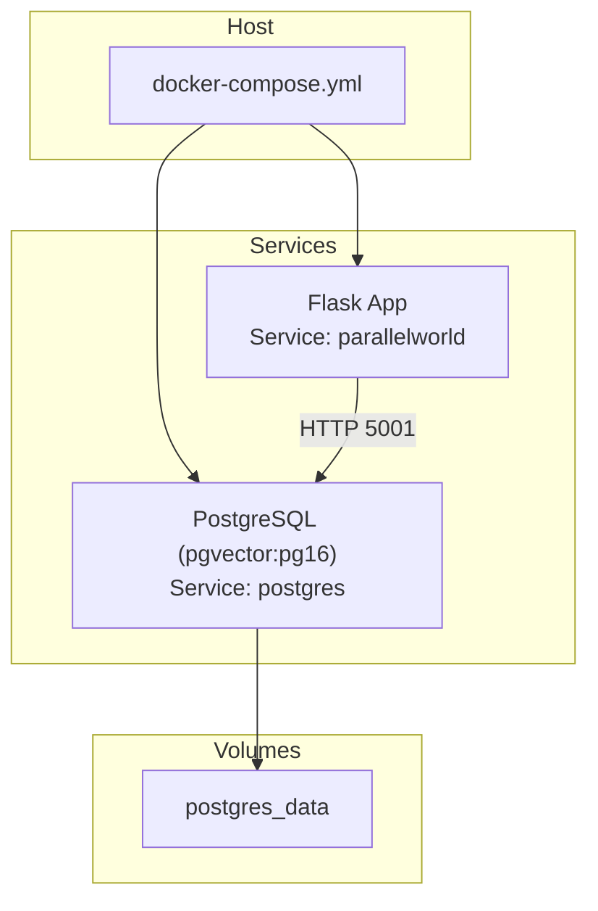
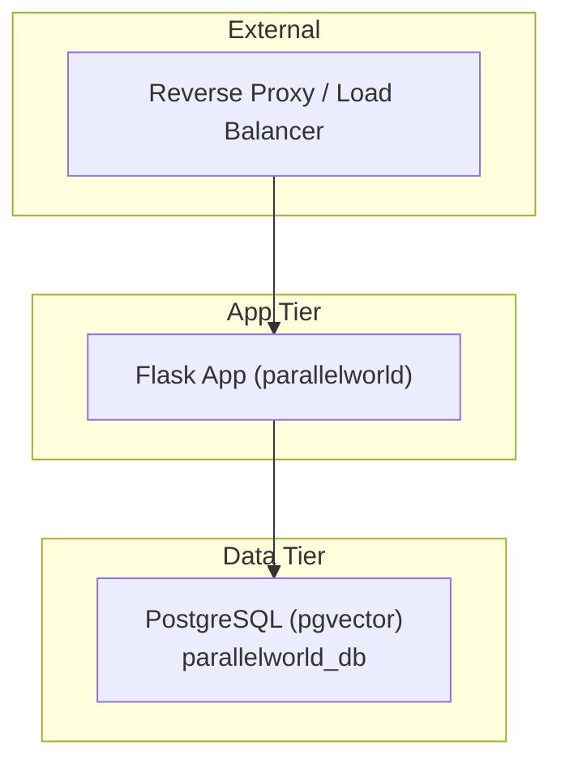
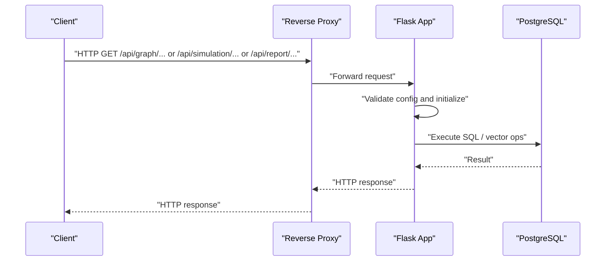
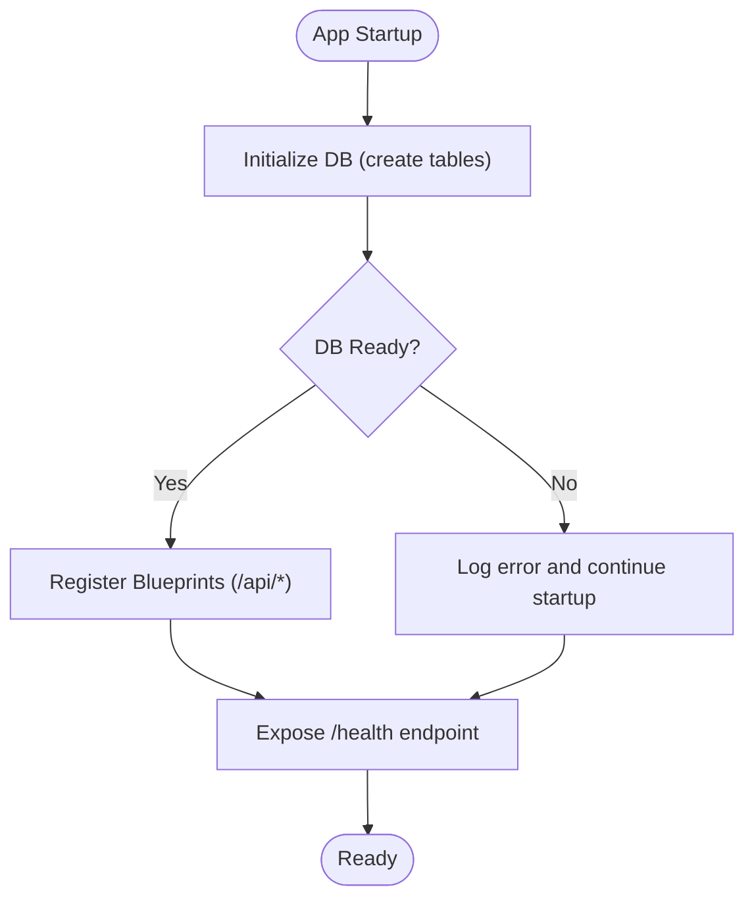
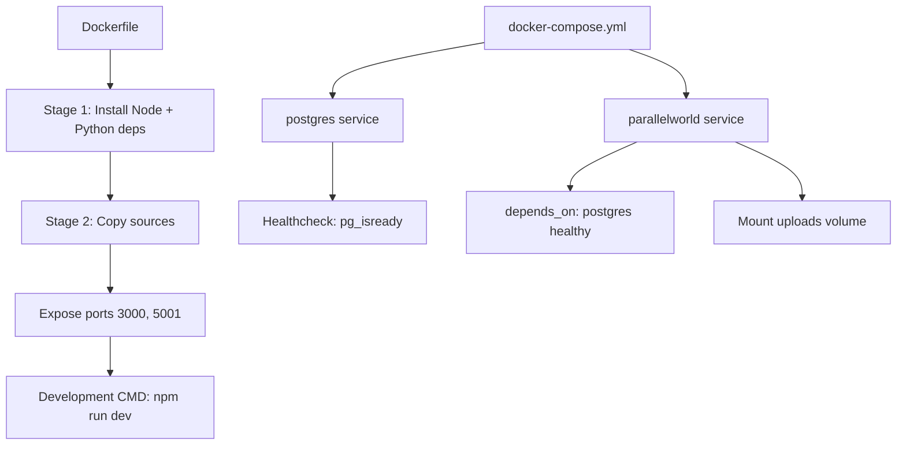
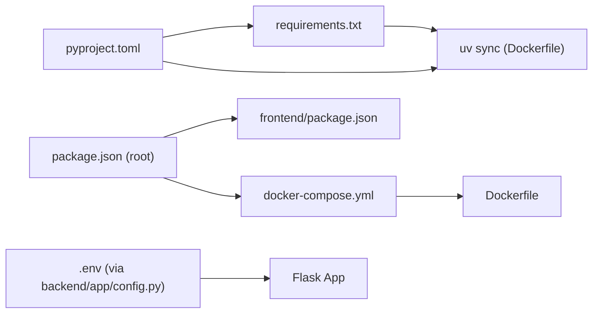

# Deployment Architecture

<cite>
**Referenced Files in This Document**
- [Dockerfile](file://Dockerfile)
- [docker-compose.yml](file://docker-compose.yml)
- [.github/workflows/docker-image.yml](file://.github/workflows/docker-image.yml)
- [backend/pyproject.toml](file://backend/pyproject.toml)
- [backend/requirements.txt](file://backend/requirements.txt)
- [backend/run.py](file://backend/run.py)
- [backend/app/config.py](file://backend/app/config.py)
- [backend/app/__init__.py](file://backend/app/__init__.py)
- [package.json](file://package.json)
- [frontend/package.json](file://frontend/package.json)
- [frontend/vite.config.js](file://frontend/vite.config.js)
- [README.md](file://README.md)
</cite>

## Table of Contents
1. [Introduction](#introduction)
2. [Project Structure](#project-structure)
3. [Core Components](#core-components)
4. [Architecture Overview](#architecture-overview)
5. [Detailed Component Analysis](#detailed-component-analysis)
6. [Dependency Analysis](#dependency-analysis)
7. [Performance Considerations](#performance-considerations)
8. [Security Measures](#security-measures)
9. [Scaling and High Availability](#scaling-and-high-availability)
10. [Environment Variables and Configuration Management](#environment-variables-and-configuration-management)
11. [Volume Mounting and Persistence](#volume-mounting-and-persistence)
12. [Network Configuration](#network-configuration)
13. [Reverse Proxy and Routing](#reverse-proxy-and-routing)
14. [Monitoring and Observability](#monitoring-and-observability)
15. [Disaster Recovery Procedures](#disaster-recovery-procedures)
16. [Deployment Checklists](#deployment-checklists)
17. [Troubleshooting Guide](#troubleshooting-guide)
18. [Conclusion](#conclusion)

## Introduction
This document describes the deployment architecture for the Parallel World AI Prediction Engine. It covers containerized deployment using Docker multi-stage builds and docker-compose orchestration, the production topology including the Flask application server, PostgreSQL with pgvector extensions, and reverse proxy configuration. It also documents environment variable management, volume mounting strategies, network configuration, scaling considerations, load balancing, high availability, security measures (including TLS/SSL, authentication, and data encryption), monitoring setup, disaster recovery procedures, and practical deployment checklists.

## Project Structure
The project is organized into:
- Backend: Flask application with API endpoints, services, models, and configuration.
- Frontend: Vue-based single-page application built with Vite.
- Containerization: A single Dockerfile defines a multi-stage build that installs Node.js and Python dependencies, builds the frontend and backend, and exposes development ports.
- Orchestration: A docker-compose file defines two primary services (PostgreSQL with pgvector and the Flask app) plus persistent volumes and health checks.

**Diagram sources**
- [docker-compose.yml:1-38](file://docker-compose.yml#L1-L38)

**Section sources**
- [Dockerfile:1-30](file://Dockerfile#L1-L30)
- [docker-compose.yml:1-38](file://docker-compose.yml#L1-L38)
- [backend/app/__init__.py:1-99](file://backend/app/__init__.py#L1-L99)

## Core Components
- PostgreSQL with pgvector extension: Vector database for similarity search and embeddings.
- Flask application: API server exposing endpoints for graph, simulation, and report services.
- Frontend: Vue SPA served via Vite’s dev server and proxied to the backend during development.
- Docker image: Multi-stage build installing Node.js and Python dependencies, copying sources, and exposing ports for development.

Key runtime behaviors:
- The Flask app loads configuration from environment variables and validates required settings.
- The application initializes the database and registers API blueprints under /api/*.
- Health endpoint verifies connectivity to the database.

**Section sources**
- [backend/app/config.py:20-76](file://backend/app/config.py#L20-L76)
- [backend/app/__init__.py:20-99](file://backend/app/__init__.py#L20-L99)
- [backend/run.py:25-46](file://backend/run.py#L25-L46)
- [Dockerfile:1-30](file://Dockerfile#L1-L30)

## Architecture Overview
The production deployment topology consists of:
- Reverse proxy (external to this repository) terminating TLS and routing traffic to the Flask application.
- Flask application server handling API requests and coordinating with the database.
- PostgreSQL with pgvector extension storing structured data and vector embeddings.
- Persistent storage for PostgreSQL data.

**Diagram sources**
- [backend/app/__init__.py:84-92](file://backend/app/__init__.py#L84-L92)
- [docker-compose.yml:20-36](file://docker-compose.yml#L20-L36)

## Detailed Component Analysis

### Flask Application Server
The Flask application is created via an application factory, enables CORS, initializes the database, registers API blueprints, and exposes a health endpoint.

**Diagram sources**
- [backend/app/__init__.py:20-99](file://backend/app/__init__.py#L20-L99)
- [backend/app/config.py:20-76](file://backend/app/config.py#L20-L76)

**Section sources**
- [backend/app/__init__.py:20-99](file://backend/app/__init__.py#L20-L99)
- [backend/app/config.py:20-76](file://backend/app/config.py#L20-L76)

### Database Initialization and Health Check
The application attempts to initialize the database and exposes a /health endpoint that executes a simple query to verify connectivity.

**Diagram sources**
- [backend/app/__init__.py:46-92](file://backend/app/__init__.py#L46-L92)

**Section sources**
- [backend/app/__init__.py:46-92](file://backend/app/__init__.py#L46-L92)

### Container Build and Orchestration
The Dockerfile defines a multi-stage build that:
- Installs Node.js and necessary tools.
- Copies dependency manifests and installs Node and Python dependencies.
- Copies the project source and exposes ports for development.

The docker-compose file orchestrates:
- PostgreSQL service with health checks and persistent volume.
- Flask application service with environment file, port mappings, volume mounts, and dependency on the database.

**Diagram sources**
- [Dockerfile:1-30](file://Dockerfile#L1-L30)
- [docker-compose.yml:1-38](file://docker-compose.yml#L1-L38)

**Section sources**
- [Dockerfile:1-30](file://Dockerfile#L1-L30)
- [docker-compose.yml:1-38](file://docker-compose.yml#L1-L38)

## Dependency Analysis
- Backend dependencies are declared in both pyproject.toml and requirements.txt. The Dockerfile uses uv to install Python dependencies, while the root package.json coordinates Node.js setup and development commands.
- The Flask app depends on configuration loaded from environment variables and validates required keys before starting.
- The GitHub Actions workflow automates building and pushing Docker images to GHCR on tagged releases.

**Diagram sources**
- [backend/pyproject.toml:1-58](file://backend/pyproject.toml#L1-L58)
- [backend/requirements.txt:1-36](file://backend/requirements.txt#L1-L36)
- [Dockerfile:18-21](file://Dockerfile#L18-L21)
- [package.json:1-22](file://package.json#L1-L22)
- [frontend/package.json:1-22](file://frontend/package.json#L1-L22)
- [docker-compose.yml:20-36](file://docker-compose.yml#L20-L36)
- [backend/app/config.py:9-17](file://backend/app/config.py#L9-L17)

**Section sources**
- [backend/pyproject.toml:1-58](file://backend/pyproject.toml#L1-L58)
- [backend/requirements.txt:1-36](file://backend/requirements.txt#L1-L36)
- [Dockerfile:18-21](file://Dockerfile#L18-L21)
- [package.json:1-22](file://package.json#L1-L22)
- [frontend/package.json:1-22](file://frontend/package.json#L1-L22)
- [docker-compose.yml:20-36](file://docker-compose.yml#L20-L36)
- [backend/app/config.py:9-17](file://backend/app/config.py#L9-L17)

## Performance Considerations
- Resource allocation: Ensure CPU and memory limits for both the Flask app and PostgreSQL containers are set appropriately in production to handle concurrent simulations and vector operations.
- Database tuning: Configure PostgreSQL shared_buffers, work_mem, and maintenance_work_mem based on workload characteristics; enable connection pooling at the application level.
- Vector index performance: Use appropriate indexing strategies for pgvector (e.g., IVFFLAT or HNSW) and tune lists/probes for recall vs latency trade-offs.
- Caching: Introduce application-level caching for frequently accessed reports and intermediate simulation artifacts.
- Asynchronous tasks: Offload long-running simulation tasks to background workers and queue systems (e.g., Celery with Redis/RabbitMQ) to keep API response times low.
- CDN and static assets: Serve frontend static assets via CDN to reduce origin load.

## Security Measures
- TLS/SSL termination: Terminate TLS at the reverse proxy/load balancer and enforce HTTPS-only requests to the Flask app.
- Authentication and authorization: Implement API key-based or OAuth-based authentication at the reverse proxy or application level; protect sensitive endpoints with rate limiting.
- Data protection:
  - Encrypt data at rest using PostgreSQL encryption features and filesystem encryption.
  - Encrypt data in transit with TLS 1.3.
  - Restrict database access to internal networks and use strong credentials.
- Secrets management: Store secrets in a secure secret manager and mount them as environment variables or files at runtime.
- Network segmentation: Place services in private subnets behind firewalls; restrict ingress/egress rules to minimal required ports.
- Input validation and sanitization: Enforce strict validation for uploads and API inputs; limit payload sizes and enforce content-type checks.
- Audit logs: Enable request/response logging and database query auditing for compliance.

## Scaling and High Availability
- Horizontal scaling:
  - Scale the Flask application behind a load balancer with sticky sessions disabled for stateless endpoints; maintain state in PostgreSQL.
  - Use multiple replicas of the Flask app and a shared volume or object storage for uploaded files.
- Database scaling:
  - Use PostgreSQL read replicas for reporting queries; keep writes on the primary.
  - Consider partitioning large tables and optimizing queries for vector similarity searches.
- Simulation isolation: Run simulations in isolated processes or containers with resource quotas to prevent noisy neighbor effects.
- Health checks and auto-healing: Configure readiness/liveness probes for Kubernetes or Compose to ensure traffic is only routed to healthy instances.
- Disaster recovery: Maintain regular backups of PostgreSQL, automate restore testing, and replicate backups offsite.

## Environment Variables and Configuration Management
- Required variables (validated at startup):
  - LLM_API_KEY: Required for LLM integrations.
  - DATABASE_URL: Connection string to PostgreSQL with pgvector.
- Optional variables:
  - SECRET_KEY, FLASK_DEBUG, FLASK_HOST, FLASK_PORT, LLM_BASE_URL, LLM_MODEL_NAME, upload and processing thresholds, OASIS simulation parameters, report agent settings.
- Loading order:
  - The backend loads .env from the project root if present; otherwise it falls back to environment variables from the runtime context.

Best practices:
- Keep .env out of version control; use .gitignore.
- Use separate .env files per environment (dev/stage/prod).
- Rotate secrets regularly and invalidate compromised keys.

**Section sources**
- [backend/app/config.py:20-76](file://backend/app/config.py#L20-L76)
- [backend/run.py:25-46](file://backend/run.py#L25-L46)

## Volume Mounting and Persistence
- PostgreSQL data persistence:
  - A named volume (postgres_data) persists PostgreSQL data across container restarts.
- Uploads persistence:
  - The Flask app mounts a host directory for uploads; ensure proper permissions and disk quotas.
- Recommendations:
  - Use external object storage for large uploads and cache frequently accessed artifacts.
  - Back up the postgres_data volume regularly and test restoration procedures.

**Section sources**
- [docker-compose.yml:11-12](file://docker-compose.yml#L11-L12)
- [docker-compose.yml:31-32](file://docker-compose.yml#L31-L32)
- [backend/app/config.py:38-41](file://backend/app/config.py#L38-L41)

## Network Configuration
- Ports exposed:
  - Flask app listens on 5001 inside the container; mapped to 5001 on the host.
  - Frontend dev server runs on 3000 inside the container; mapped to 3000 on the host.
- Internal communication:
  - The Flask app connects to PostgreSQL using the service name and port 5432.
- Production networking:
  - Expose only necessary ports externally (e.g., 443 for HTTPS).
  - Use internal networks for inter-service communication.

**Section sources**
- [Dockerfile:26](file://Dockerfile#L26)
- [docker-compose.yml:27-35](file://docker-compose.yml#L27-L35)
- [backend/app/config.py:36](file://backend/app/config.py#L36)

## Reverse Proxy and Routing
- Development proxy:
  - Vite dev server proxies /api requests to http://localhost:5001.
- Production routing:
  - Place a reverse proxy (Nginx, Traefik, or cloud LB) in front of the Flask app.
  - Route /api/* to the Flask service and serve frontend static assets via the proxy.
  - Terminate TLS at the reverse proxy and enforce HSTS.

**Section sources**
- [frontend/vite.config.js:10-16](file://frontend/vite.config.js#L10-L16)
- [README.md:149-161](file://README.md#L149-L161)

## Monitoring and Observability
- Application metrics:
  - Expose Prometheus metrics from the Flask app and scrape via Prometheus.
  - Track request latency, error rates, and throughput per endpoint.
- Logs:
  - Centralize application logs and database logs; ship to a SIEM or log aggregation platform.
- Database monitoring:
  - Monitor PostgreSQL connections, replication lag, and slow queries.
- Health checks:
  - Use the /health endpoint for readiness probes; configure periodic checks for alerting.
- Tracing:
  - Add distributed tracing (e.g., OpenTelemetry) to track requests across services.

## Disaster Recovery Procedures
- Backup strategy:
  - Schedule regular logical backups of PostgreSQL and retain offline copies.
  - Back up the uploads directory and any cached artifacts.
- Restore testing:
  - Periodically practice restore drills to validate backup integrity and recovery time objectives.
- Failover:
  - Configure PostgreSQL streaming replication and automated failover if using managed services.
- Incident response:
  - Define escalation paths, communication plans, and rollback procedures for deployments.

## Deployment Checklists
- Pre-deployment
  - Review and approve environment variables for the target environment.
  - Confirm database schema migration readiness.
  - Verify TLS certificates and reverse proxy configuration.
- Deployment
  - Build and push the Docker image (or pull from registry).
  - Deploy services via docker-compose or Kubernetes.
  - Validate health endpoints and connectivity to the database.
- Post-deployment
  - Smoke test API endpoints and frontend.
  - Confirm logs and metrics are flowing.
  - Perform load tests and capacity validation.

## Troubleshooting Guide
Common issues and resolutions:
- Database not ready:
  - The Flask app waits for the database to become healthy before starting. Check the PostgreSQL service health and logs.
- Missing environment variables:
  - The app validates required variables and exits on configuration errors. Ensure LLM_API_KEY and DATABASE_URL are set.
- Port conflicts:
  - Ensure ports 3000 and 5001 are free on the host or adjust mappings.
- Upload failures:
  - Verify the mounted uploads directory exists and has correct permissions.

**Section sources**
- [docker-compose.yml:13-17](file://docker-compose.yml#L13-L17)
- [backend/run.py:25-46](file://backend/run.py#L25-L46)
- [backend/app/config.py:66-74](file://backend/app/config.py#L66-L74)

## Conclusion
The Parallel World AI Prediction Engine can be deployed as a containerized stack with a Flask application, PostgreSQL with pgvector, and a reverse proxy. The provided Dockerfile and docker-compose files establish a reproducible development environment, while the configuration and runtime behavior ensure robust startup, health checking, and API exposure. For production, augment the setup with TLS termination, authentication, secrets management, monitoring, and high availability practices described above.