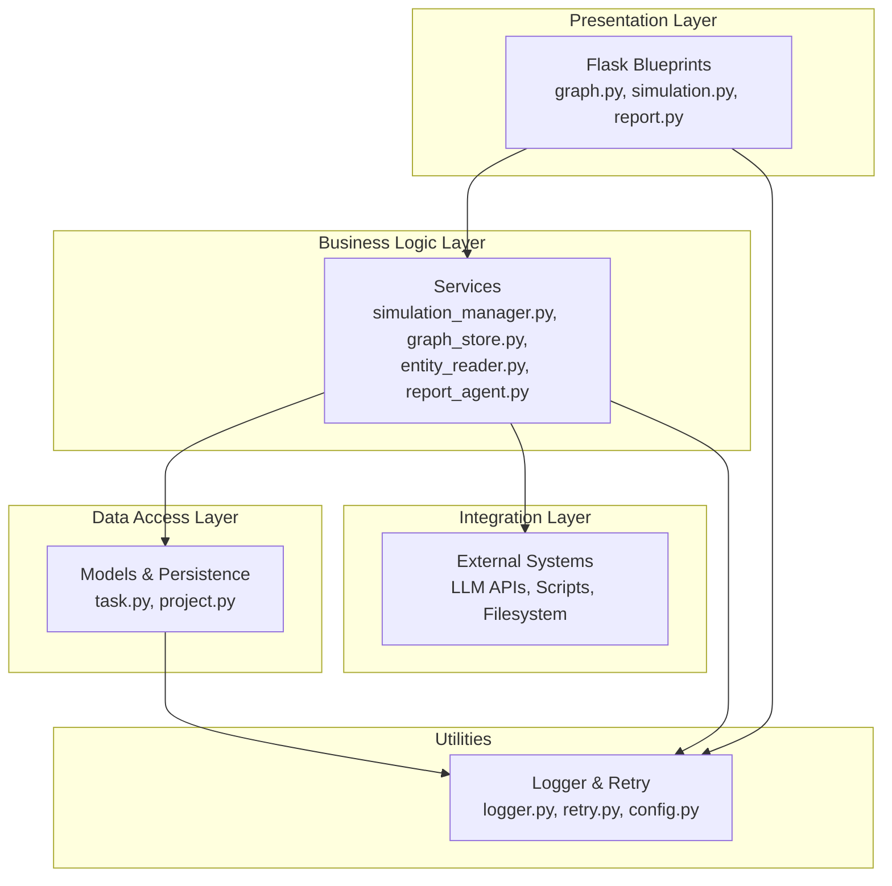
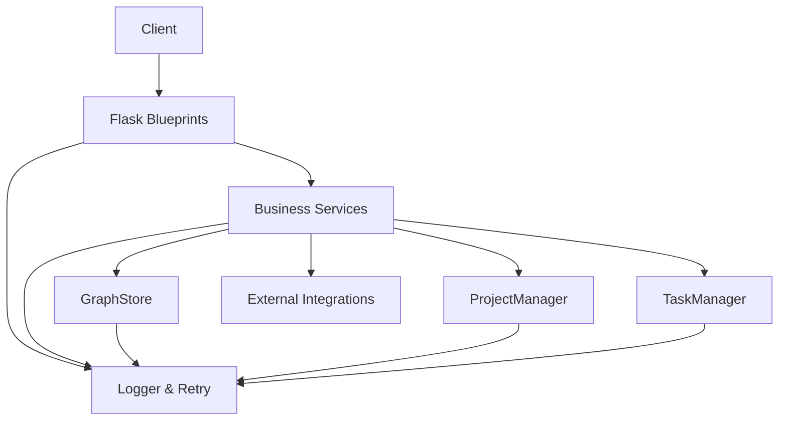
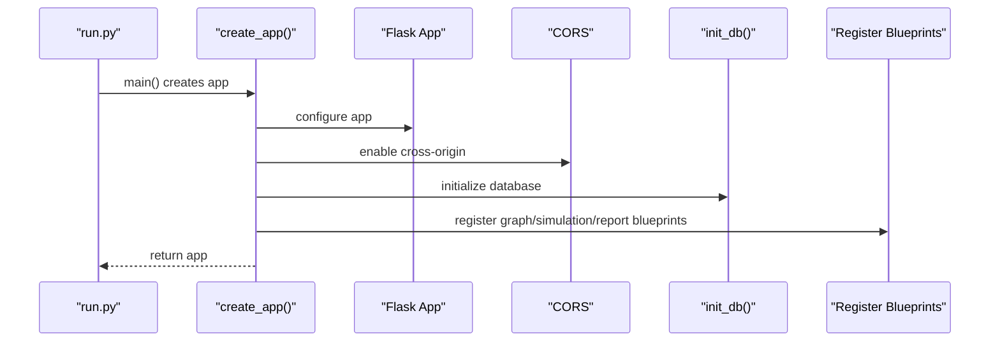
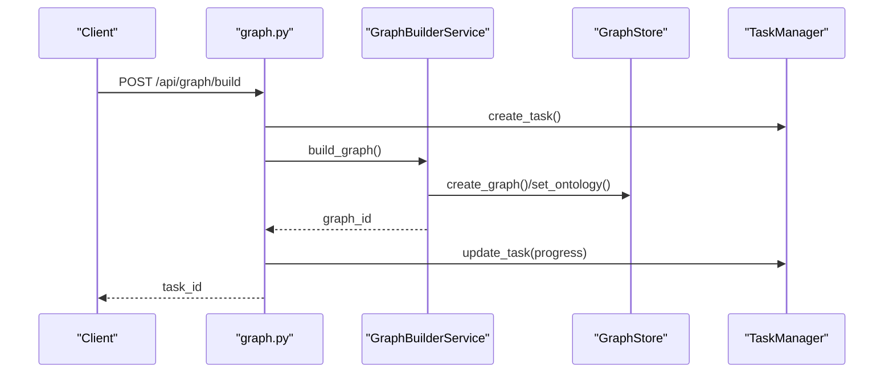
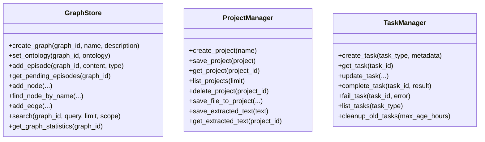
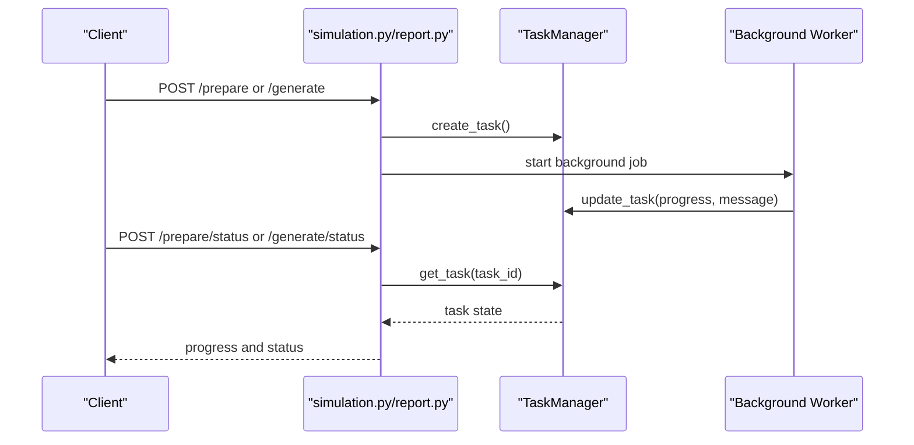
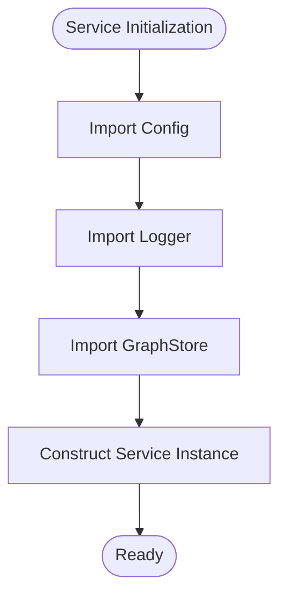
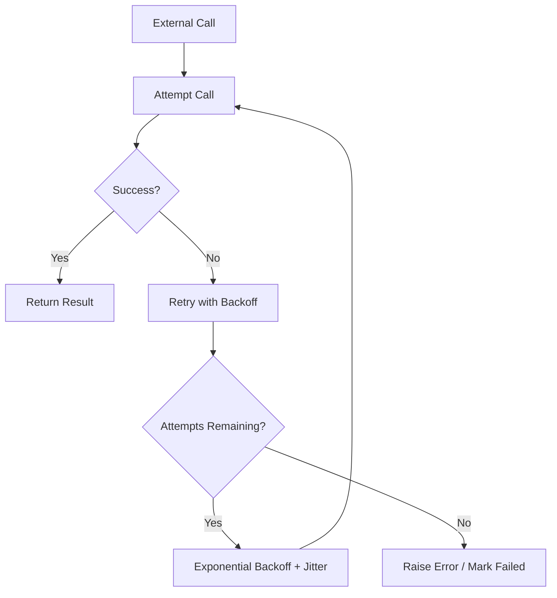
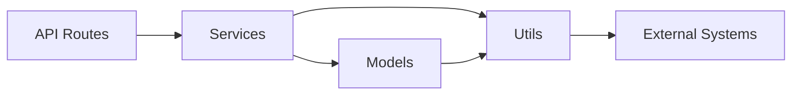

# Design Patterns and Architectural Principles

<cite>
**Referenced Files in This Document**
- [backend/app/__init__.py](file://backend/app/__init__.py)
- [backend/run.py](file://backend/run.py)
- [backend/app/config.py](file://backend/app/config.py)
- [backend/app/api/__init__.py](file://backend/app/api/__init__.py)
- [backend/app/api/graph.py](file://backend/app/api/graph.py)
- [backend/app/api/simulation.py](file://backend/app/api/simulation.py)
- [backend/app/api/report.py](file://backend/app/api/report.py)
- [backend/app/services/__init__.py](file://backend/app/services/__init__.py)
- [backend/app/services/simulation_manager.py](file://backend/app/services/simulation_manager.py)
- [backend/app/services/graph_store.py](file://backend/app/services/graph_store.py)
- [backend/app/models/task.py](file://backend/app/models/task.py)
- [backend/app/models/project.py](file://backend/app/models/project.py)
- [backend/app/utils/logger.py](file://backend/app/utils/logger.py)
- [backend/app/utils/retry.py](file://backend/app/utils/retry.py)
</cite>

## Table of Contents
1. [Introduction](#introduction)
2. [Project Structure](#project-structure)
3. [Core Components](#core-components)
4. [Architecture Overview](#architecture-overview)
5. [Detailed Component Analysis](#detailed-component-analysis)
6. [Dependency Analysis](#dependency-analysis)
7. [Performance Considerations](#performance-considerations)
8. [Troubleshooting Guide](#troubleshooting-guide)
9. [Conclusion](#conclusion)

## Introduction
This document explains the design patterns and architectural principles implemented in the Parallel World AI Prediction Engine backend. It focuses on:
- Application factory pattern for Flask
- Service layer pattern for business logic separation
- Repository pattern for data access abstraction
- Observer pattern for real-time task status polling
- Layered architecture separating presentation, business logic, data access, and integration concerns
- Dependency injection patterns, plugin-style extensibility, and robust error handling strategies

These patterns collectively improve maintainability, scalability, and modularity across the system.

## Project Structure
The backend follows a clear, layered structure:
- Presentation layer: Flask Blueprints and API routes
- Business logic layer: Services encapsulating domain workflows
- Data access layer: Unified graph store and persistence managers
- Integration layer: External APIs and scripts invoked by services
- Utilities: Logging, retry mechanisms, and configuration

**Diagram sources**
- [backend/app/api/graph.py:1-604](file://backend/app/api/graph.py#L1-L604)
- [backend/app/api/simulation.py:1-800](file://backend/app/api/simulation.py#L1-L800)
- [backend/app/api/report.py:1-800](file://backend/app/api/report.py#L1-L800)
- [backend/app/services/simulation_manager.py:1-529](file://backend/app/services/simulation_manager.py#L1-L529)
- [backend/app/services/graph_store.py:1-375](file://backend/app/services/graph_store.py#L1-L375)
- [backend/app/models/task.py:1-185](file://backend/app/models/task.py#L1-L185)
- [backend/app/models/project.py:1-306](file://backend/app/models/project.py#L1-L306)
- [backend/app/utils/logger.py:1-127](file://backend/app/utils/logger.py#L1-L127)
- [backend/app/utils/retry.py:1-239](file://backend/app/utils/retry.py#L1-L239)

**Section sources**
- [backend/app/__init__.py:1-99](file://backend/app/__init__.py#L1-L99)
- [backend/app/api/__init__.py:1-15](file://backend/app/api/__init__.py#L1-L15)

## Core Components
- Application factory: Centralized Flask app creation, configuration, logging, CORS, and blueprint registration
- Service layer: Domain services orchestrating workflows (graph building, simulation preparation, report generation)
- Data access abstraction: GraphStore for unified graph operations and persistence managers for projects and tasks
- Observer pattern: TaskManager and polling endpoints enabling real-time status updates
- Utilities: Centralized logging and retry mechanisms

**Section sources**
- [backend/app/__init__.py:20-99](file://backend/app/__init__.py#L20-L99)
- [backend/app/config.py:1-76](file://backend/app/config.py#L1-L76)
- [backend/app/utils/logger.py:1-127](file://backend/app/utils/logger.py#L1-L127)
- [backend/app/utils/retry.py:1-239](file://backend/app/utils/retry.py#L1-L239)
- [backend/app/models/task.py:1-185](file://backend/app/models/task.py#L1-L185)
- [backend/app/models/project.py:1-306](file://backend/app/models/project.py#L1-L306)
- [backend/app/services/graph_store.py:1-375](file://backend/app/services/graph_store.py#L1-L375)
- [backend/app/services/simulation_manager.py:1-529](file://backend/app/services/simulation_manager.py#L1-L529)

## Architecture Overview
The system employs a layered architecture:
- Presentation: Flask Blueprints expose REST endpoints
- Business logic: Services encapsulate workflows and orchestrate external integrations
- Data access: GraphStore abstracts graph operations; ProjectManager and TaskManager manage persistent state
- Integration: LLM calls, filesystem operations, and external scripts
- Utilities: Logging and retry decorate critical operations

**Diagram sources**
- [backend/app/api/graph.py:1-604](file://backend/app/api/graph.py#L1-L604)
- [backend/app/api/simulation.py:1-800](file://backend/app/api/simulation.py#L1-L800)
- [backend/app/api/report.py:1-800](file://backend/app/api/report.py#L1-L800)
- [backend/app/services/graph_store.py:1-375](file://backend/app/services/graph_store.py#L1-L375)
- [backend/app/models/project.py:1-306](file://backend/app/models/project.py#L1-L306)
- [backend/app/models/task.py:1-185](file://backend/app/models/task.py#L1-L185)
- [backend/app/utils/logger.py:1-127](file://backend/app/utils/logger.py#L1-L127)
- [backend/app/utils/retry.py:1-239](file://backend/app/utils/retry.py#L1-L239)

## Detailed Component Analysis

### Application Factory Pattern (Flask)
The application factory centralizes configuration, logging, CORS, database initialization, and blueprint registration. It ensures predictable startup behavior and clean separation of concerns.

**Diagram sources**
- [backend/run.py:25-46](file://backend/run.py#L25-L46)
- [backend/app/__init__.py:20-99](file://backend/app/__init__.py#L20-L99)

**Section sources**
- [backend/app/__init__.py:20-99](file://backend/app/__init__.py#L20-L99)
- [backend/run.py:25-46](file://backend/run.py#L25-L46)

### Service Layer Pattern
Services encapsulate business workflows:
- Graph building: orchestrates text chunking, graph creation, and LLM-driven entity extraction
- Simulation management: prepares agent profiles, generates configs, and manages simulation lifecycle
- Report generation: async report creation with progress tracking and section streaming

**Diagram sources**
- [backend/app/api/graph.py:259-523](file://backend/app/api/graph.py#L259-L523)
- [backend/app/services/graph_store.py:32-72](file://backend/app/services/graph_store.py#L32-L72)
- [backend/app/models/task.py:73-100](file://backend/app/models/task.py#L73-L100)

**Section sources**
- [backend/app/api/graph.py:259-523](file://backend/app/api/graph.py#L259-L523)
- [backend/app/services/graph_store.py:1-375](file://backend/app/services/graph_store.py#L1-L375)
- [backend/app/models/task.py:1-185](file://backend/app/models/task.py#L1-L185)

### Repository Pattern (Data Access Abstraction)
The GraphStore provides a unified interface for graph operations, hiding SQLAlchemy details and offering a cohesive API for CRUD, search, and statistics. ProjectManager and TaskManager handle persistent state for projects and tasks respectively.

**Diagram sources**
- [backend/app/services/graph_store.py:21-375](file://backend/app/services/graph_store.py#L21-L375)
- [backend/app/models/project.py:101-306](file://backend/app/models/project.py#L101-L306)
- [backend/app/models/task.py:54-185](file://backend/app/models/task.py#L54-L185)

**Section sources**
- [backend/app/services/graph_store.py:1-375](file://backend/app/services/graph_store.py#L1-L375)
- [backend/app/models/project.py:1-306](file://backend/app/models/project.py#L1-L306)
- [backend/app/models/task.py:1-185](file://backend/app/models/task.py#L1-L185)

### Observer Pattern (Real-Time Task Status Polling)
The TaskManager maintains in-memory state with thread safety. Clients poll endpoints to observe progress and completion. The simulation and report endpoints demonstrate this pattern by returning task IDs and providing status endpoints.

**Diagram sources**
- [backend/app/api/simulation.py:340-730](file://backend/app/api/simulation.py#L340-L730)
- [backend/app/api/report.py:24-268](file://backend/app/api/report.py#L24-L268)
- [backend/app/models/task.py:54-185](file://backend/app/models/task.py#L54-L185)

**Section sources**
- [backend/app/models/task.py:1-185](file://backend/app/models/task.py#L1-L185)
- [backend/app/api/simulation.py:340-730](file://backend/app/api/simulation.py#L340-L730)
- [backend/app/api/report.py:24-268](file://backend/app/api/report.py#L24-L268)

### Dependency Injection Patterns
- Constructor injection: Services receive dependencies (e.g., GraphStore) via constructors
- Module-level imports: Services import utilities (logger, retry) as needed
- Configuration injection: Config class provides centralized settings consumed across modules

**Diagram sources**
- [backend/app/services/simulation_manager.py:15-21](file://backend/app/services/simulation_manager.py#L15-L21)
- [backend/app/services/graph_store.py:10-18](file://backend/app/services/graph_store.py#L10-L18)
- [backend/app/config.py:20-76](file://backend/app/config.py#L20-L76)

**Section sources**
- [backend/app/services/simulation_manager.py:1-529](file://backend/app/services/simulation_manager.py#L1-L529)
- [backend/app/services/graph_store.py:1-375](file://backend/app/services/graph_store.py#L1-L375)
- [backend/app/config.py:1-76](file://backend/app/config.py#L1-L76)

### Plugin Architecture for Extensibility
- Blueprints modularize API namespaces (graph, simulation, report)
- Service modules export reusable components via __all__ lists
- Retry decorators and logging utilities can be composed around service methods to extend behavior without altering core logic

**Section sources**
- [backend/app/api/__init__.py:1-15](file://backend/app/api/__init__.py#L1-L15)
- [backend/app/services/__init__.py:1-73](file://backend/app/services/__init__.py#L1-L73)
- [backend/app/utils/retry.py:1-239](file://backend/app/utils/retry.py#L1-L239)
- [backend/app/utils/logger.py:1-127](file://backend/app/utils/logger.py#L1-L127)

### Error Handling Strategies
- Centralized logging: Structured logs with file and console handlers
- Retry with exponential backoff: Decorators and clients wrap external calls
- Graceful degradation: Status polling endpoints return meaningful messages and partial results
- Validation: Configuration validation at startup

**Diagram sources**
- [backend/app/utils/retry.py:15-78](file://backend/app/utils/retry.py#L15-L78)
- [backend/app/utils/logger.py:1-127](file://backend/app/utils/logger.py#L1-L127)
- [backend/app/api/graph.py:282-293](file://backend/app/api/graph.py#L282-L293)

**Section sources**
- [backend/app/utils/retry.py:1-239](file://backend/app/utils/retry.py#L1-L239)
- [backend/app/utils/logger.py:1-127](file://backend/app/utils/logger.py#L1-L127)
- [backend/app/api/graph.py:282-293](file://backend/app/api/graph.py#L282-L293)

## Dependency Analysis
The system exhibits low coupling and high cohesion:
- Presentation depends on services, not on data stores directly
- Services depend on models and utilities, not on Flask specifics
- Data access is abstracted behind GraphStore and managers
- Utilities are shared across layers

**Diagram sources**
- [backend/app/api/graph.py:1-604](file://backend/app/api/graph.py#L1-L604)
- [backend/app/api/simulation.py:1-800](file://backend/app/api/simulation.py#L1-L800)
- [backend/app/api/report.py:1-800](file://backend/app/api/report.py#L1-L800)
- [backend/app/services/graph_store.py:1-375](file://backend/app/services/graph_store.py#L1-L375)
- [backend/app/models/project.py:1-306](file://backend/app/models/project.py#L1-L306)
- [backend/app/models/task.py:1-185](file://backend/app/models/task.py#L1-L185)
- [backend/app/utils/logger.py:1-127](file://backend/app/utils/logger.py#L1-L127)
- [backend/app/utils/retry.py:1-239](file://backend/app/utils/retry.py#L1-L239)

**Section sources**
- [backend/app/api/graph.py:1-604](file://backend/app/api/graph.py#L1-L604)
- [backend/app/api/simulation.py:1-800](file://backend/app/api/simulation.py#L1-L800)
- [backend/app/api/report.py:1-800](file://backend/app/api/report.py#L1-L800)
- [backend/app/services/graph_store.py:1-375](file://backend/app/services/graph_store.py#L1-L375)
- [backend/app/models/project.py:1-306](file://backend/app/models/project.py#L1-L306)
- [backend/app/models/task.py:1-185](file://backend/app/models/task.py#L1-L185)
- [backend/app/utils/logger.py:1-127](file://backend/app/utils/logger.py#L1-L127)
- [backend/app/utils/retry.py:1-239](file://backend/app/utils/retry.py#L1-L239)

## Performance Considerations
- Asynchronous task execution: Long-running operations offload to background threads with progress updates
- Pagination and limits: Graph queries support pagination to control memory footprint
- Retry with backoff: Reduces contention and improves resilience for external services
- Minimal coupling: Blueprints and services reduce hotspots and enable horizontal scaling

[No sources needed since this section provides general guidance]

## Troubleshooting Guide
- Health checks: Use the /health endpoint to verify database connectivity
- Logs: Review structured logs for detailed traces and timestamps
- Configuration validation: Startup validates required environment variables
- Task status: Poll status endpoints to diagnose stalled or failed operations

**Section sources**
- [backend/app/__init__.py:84-96](file://backend/app/__init__.py#L84-L96)
- [backend/app/utils/logger.py:1-127](file://backend/app/utils/logger.py#L1-L127)
- [backend/app/config.py:66-76](file://backend/app/config.py#L66-L76)
- [backend/app/api/graph.py:527-558](file://backend/app/api/graph.py#L527-L558)
- [backend/app/api/simulation.py:619-730](file://backend/app/api/simulation.py#L619-L730)
- [backend/app/api/report.py:198-268](file://backend/app/api/report.py#L198-L268)

## Conclusion
The Parallel World AI Prediction Engine applies well-established design patterns and architectural principles to achieve a maintainable, scalable backend:
- The application factory pattern ensures consistent initialization
- The service layer cleanly separates business logic from presentation
- The repository pattern abstracts data access for flexibility
- The observer pattern enables responsive, real-time status updates
- Utilities provide robust logging and retry strategies
- The layered architecture promotes modularity and testability

These choices collectively support future enhancements, improved reliability, and easier maintenance.