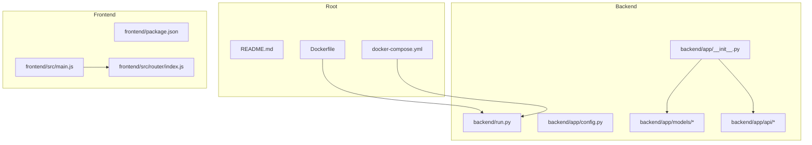
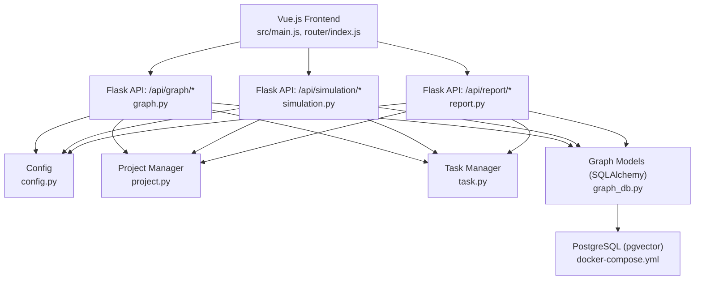
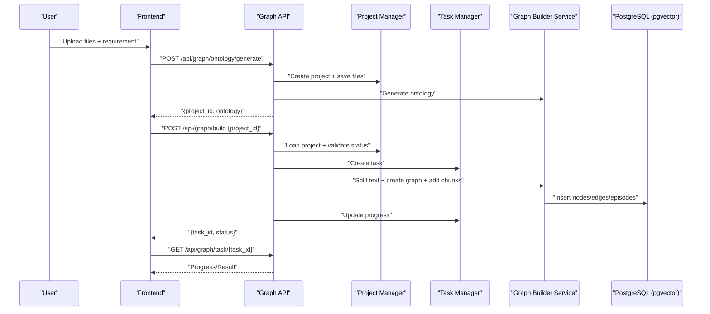
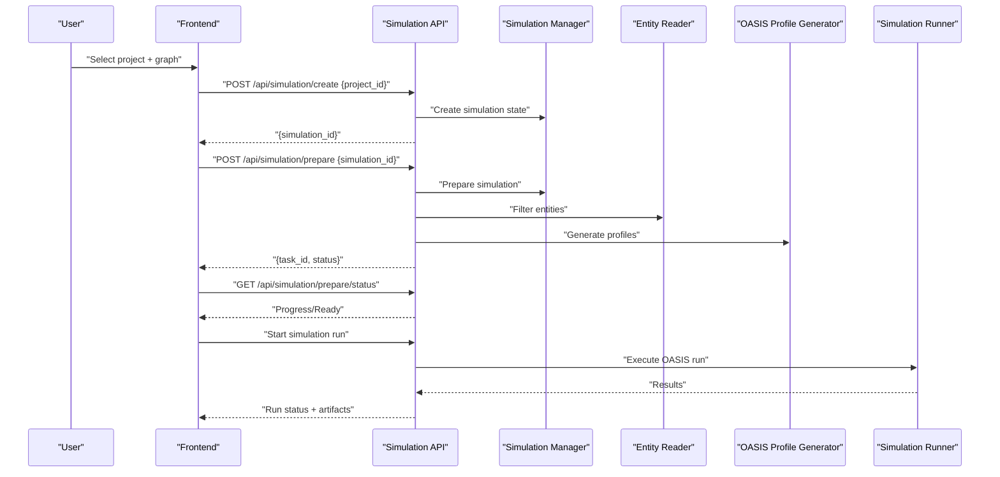
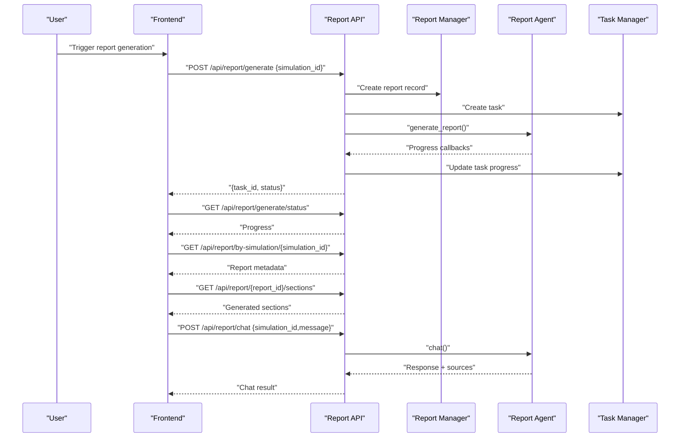
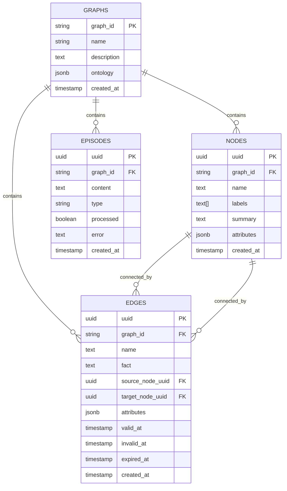
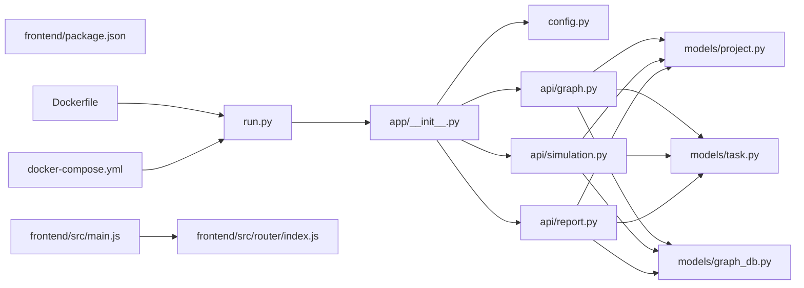

# System Overview

<cite>
**Referenced Files in This Document**
- [README.md](file://README.md)
- [Dockerfile](file://Dockerfile)
- [docker-compose.yml](file://docker-compose.yml)
- [backend/run.py](file://backend/run.py)
- [backend/app/__init__.py](file://backend/app/__init__.py)
- [backend/app/config.py](file://backend/app/config.py)
- [backend/app/api/graph.py](file://backend/app/api/graph.py)
- [backend/app/api/simulation.py](file://backend/app/api/simulation.py)
- [backend/app/api/report.py](file://backend/app/api/report.py)
- [backend/app/models/project.py](file://backend/app/models/project.py)
- [backend/app/models/task.py](file://backend/app/models/task.py)
- [backend/app/models/graph_db.py](file://backend/app/models/graph_db.py)
- [frontend/package.json](file://frontend/package.json)
- [frontend/src/main.js](file://frontend/src/main.js)
- [frontend/src/router/index.js](file://frontend/src/router/index.js)
</cite>

## Table of Contents
1. [Introduction](#introduction)
2. [Project Structure](#project-structure)
3. [Core Components](#core-components)
4. [Architecture Overview](#architecture-overview)
5. [Detailed Component Analysis](#detailed-component-analysis)
6. [Dependency Analysis](#dependency-analysis)
7. [Performance Considerations](#performance-considerations)
8. [Troubleshooting Guide](#troubleshooting-guide)
9. [Conclusion](#conclusion)

## Introduction
Parallel World is a next-generation AI prediction engine built on multi-agent simulation. It transforms real-world seed information (news, policy drafts, financial signals, literature) into a high-fidelity digital world containing tens of thousands of agents with personalities, memory, and behavioral logic. Users can dynamically inject variables to forecast future trajectories in a risk-free environment. The system emphasizes modularity, scalability, and real-time processing, integrating a Flask backend, a Vue.js frontend, containerized deployment, and a PostgreSQL database with pgvector for vector embeddings.

## Project Structure
The repository is organized into:
- backend: Flask application with API endpoints, services, models, and utilities
- frontend: Vue.js SPA with routing and UI components
- docker and compose files for containerized deployment
- documentation and assets

**Diagram sources**
- [Dockerfile:1-30](file://Dockerfile#L1-L30)
- [docker-compose.yml:1-38](file://docker-compose.yml#L1-L38)
- [backend/run.py:1-51](file://backend/run.py#L1-L51)
- [backend/app/__init__.py:1-99](file://backend/app/__init__.py#L1-L99)
- [backend/app/config.py:1-76](file://backend/app/config.py#L1-L76)
- [frontend/package.json:1-22](file://frontend/package.json#L1-L22)
- [frontend/src/main.js:1-15](file://frontend/src/main.js#L1-L15)
- [frontend/src/router/index.js:1-53](file://frontend/src/router/index.js#L1-L53)

**Section sources**
- [README.md:15-77](file://README.md#L15-L77)
- [Dockerfile:1-30](file://Dockerfile#L1-L30)
- [docker-compose.yml:1-38](file://docker-compose.yml#L1-L38)
- [backend/run.py:1-51](file://backend/run.py#L1-L51)
- [backend/app/__init__.py:1-99](file://backend/app/__init__.py#L1-L99)
- [frontend/package.json:1-22](file://frontend/package.json#L1-L22)
- [frontend/src/main.js:1-15](file://frontend/src/main.js#L1-L15)
- [frontend/src/router/index.js:1-53](file://frontend/src/router/index.js#L1-L53)

## Core Components
- Knowledge Graph Construction
  - Upload and parse documents, generate ontology, split text, and build a graph with nodes, edges, and episodes
- Multi-Agent Simulation Engine
  - Prepare simulation environments, generate agent profiles, orchestrate dual-platform runs, and manage simulation lifecycle
- Report Generation System
  - Asynchronously generate structured reports, stream sections, and provide a chat interface with a Report Agent

Key backend components:
- Flask application factory with CORS, logging, and health checks
- Configuration loader for LLM, database, uploads, and simulation parameters
- Project and task managers for persistent state and long-running jobs
- Graph database models with SQLAlchemy and pgvector support

Frontend components:
- Vue 3 application with Vue Router for multi-view navigation
- API clients for graph, simulation, and report endpoints

**Section sources**
- [backend/app/api/graph.py:121-254](file://backend/app/api/graph.py#L121-L254)
- [backend/app/api/simulation.py:146-218](file://backend/app/api/simulation.py#L146-L218)
- [backend/app/api/report.py:24-195](file://backend/app/api/report.py#L24-L195)
- [backend/app/models/project.py:26-99](file://backend/app/models/project.py#L26-L99)
- [backend/app/models/task.py:22-52](file://backend/app/models/task.py#L22-L52)
- [backend/app/models/graph_db.py:24-105](file://backend/app/models/graph_db.py#L24-L105)
- [frontend/src/router/index.js:9-45](file://frontend/src/router/index.js#L9-L45)

## Architecture Overview
The system follows a layered architecture:
- Presentation Layer: Vue.js SPA handles user interactions and navigates through steps (graph build, environment setup, simulation, report, interaction)
- Application Layer: Flask Blueprints expose REST APIs for graph, simulation, and report workflows
- Domain Services: Orchestrate LLM calls, entity extraction, profile generation, and simulation preparation
- Persistence Layer: PostgreSQL with pgvector for graph data and metadata; local filesystem for uploads and simulation artifacts
- Containerization: Single Docker image builds both frontend and backend; docker-compose provisions a Postgres container with pgvector

**Diagram sources**
- [frontend/src/main.js:1-15](file://frontend/src/main.js#L1-L15)
- [frontend/src/router/index.js:1-53](file://frontend/src/router/index.js#L1-L53)
- [backend/app/api/graph.py:1-604](file://backend/app/api/graph.py#L1-L604)
- [backend/app/api/simulation.py:1-800](file://backend/app/api/simulation.py#L1-L800)
- [backend/app/api/report.py:1-800](file://backend/app/api/report.py#L1-L800)
- [backend/app/config.py:1-76](file://backend/app/config.py#L1-L76)
- [backend/app/models/project.py:101-306](file://backend/app/models/project.py#L101-L306)
- [backend/app/models/task.py:54-185](file://backend/app/models/task.py#L54-L185)
- [backend/app/models/graph_db.py:108-151](file://backend/app/models/graph_db.py#L108-L151)
- [docker-compose.yml:1-38](file://docker-compose.yml#L1-L38)

## Detailed Component Analysis

### Knowledge Graph Construction
End-to-end workflow:
- Upload documents and generate an ontology
- Split text into chunks and build the graph asynchronously
- Track progress via tasks and expose graph data

**Diagram sources**
- [backend/app/api/graph.py:121-254](file://backend/app/api/graph.py#L121-L254)
- [backend/app/api/graph.py:259-523](file://backend/app/api/graph.py#L259-L523)
- [backend/app/models/project.py:133-196](file://backend/app/models/project.py#L133-L196)
- [backend/app/models/task.py:73-100](file://backend/app/models/task.py#L73-L100)
- [backend/app/models/graph_db.py:24-105](file://backend/app/models/graph_db.py#L24-L105)

**Section sources**
- [backend/app/api/graph.py:121-254](file://backend/app/api/graph.py#L121-L254)
- [backend/app/api/graph.py:259-523](file://backend/app/api/graph.py#L259-L523)
- [backend/app/models/project.py:101-196](file://backend/app/models/project.py#L101-L196)
- [backend/app/models/task.py:54-100](file://backend/app/models/task.py#L54-L100)

### Multi-Agent Simulation Engine
Workflow:
- Create simulation with project and graph context
- Prepare environment: read entities, generate profiles, create simulation config
- Run simulation and manage lifecycle

**Diagram sources**
- [backend/app/api/simulation.py:146-218](file://backend/app/api/simulation.py#L146-L218)
- [backend/app/api/simulation.py:340-617](file://backend/app/api/simulation.py#L340-L617)
- [backend/app/api/simulation.py:732-792](file://backend/app/api/simulation.py#L732-L792)

**Section sources**
- [backend/app/api/simulation.py:146-218](file://backend/app/api/simulation.py#L146-L218)
- [backend/app/api/simulation.py:340-617](file://backend/app/api/simulation.py#L340-L617)
- [backend/app/api/simulation.py:732-792](file://backend/app/api/simulation.py#L732-L792)

### Report Generation System
Asynchronous report generation with streaming sections and chat:
- Start generation task, poll progress, fetch sections as they complete
- Chat with Report Agent using retrieval tools

**Diagram sources**
- [backend/app/api/report.py:24-195](file://backend/app/api/report.py#L24-L195)
- [backend/app/api/report.py:198-268](file://backend/app/api/report.py#L198-L268)
- [backend/app/api/report.py:314-391](file://backend/app/api/report.py#L314-L391)
- [backend/app/api/report.py:467-560](file://backend/app/api/report.py#L467-L560)

**Section sources**
- [backend/app/api/report.py:24-195](file://backend/app/api/report.py#L24-L195)
- [backend/app/api/report.py:198-268](file://backend/app/api/report.py#L198-L268)
- [backend/app/api/report.py:314-391](file://backend/app/api/report.py#L314-L391)
- [backend/app/api/report.py:467-560](file://backend/app/api/report.py#L467-L560)

### Data Model: Graph and Metadata

**Diagram sources**
- [backend/app/models/graph_db.py:24-105](file://backend/app/models/graph_db.py#L24-L105)

**Section sources**
- [backend/app/models/graph_db.py:24-105](file://backend/app/models/graph_db.py#L24-L105)

## Dependency Analysis
- Flask application factory registers blueprints and initializes database and logging
- APIs depend on configuration, project/task managers, and domain services
- Frontend depends on Vue ecosystem and communicates with Flask endpoints
- Containerization ties together Python, Node.js, PostgreSQL with pgvector, and shared volumes

**Diagram sources**
- [backend/run.py:1-51](file://backend/run.py#L1-L51)
- [backend/app/__init__.py:78-82](file://backend/app/__init__.py#L78-L82)
- [backend/app/config.py:1-76](file://backend/app/config.py#L1-L76)
- [backend/app/api/graph.py:1-20](file://backend/app/api/graph.py#L1-L20)
- [backend/app/api/simulation.py:1-20](file://backend/app/api/simulation.py#L1-L20)
- [backend/app/api/report.py:1-20](file://backend/app/api/report.py#L1-L20)
- [backend/app/models/project.py:101-196](file://backend/app/models/project.py#L101-L196)
- [backend/app/models/task.py:54-100](file://backend/app/models/task.py#L54-L100)
- [backend/app/models/graph_db.py:108-151](file://backend/app/models/graph_db.py#L108-L151)
- [frontend/package.json:1-22](file://frontend/package.json#L1-L22)
- [frontend/src/main.js:1-15](file://frontend/src/main.js#L1-L15)
- [frontend/src/router/index.js:1-53](file://frontend/src/router/index.js#L1-L53)
- [docker-compose.yml:1-38](file://docker-compose.yml#L1-L38)
- [Dockerfile:1-30](file://Dockerfile#L1-L30)

**Section sources**
- [backend/app/__init__.py:78-82](file://backend/app/__init__.py#L78-L82)
- [backend/app/config.py:35-41](file://backend/app/config.py#L35-L41)
- [frontend/package.json:11-20](file://frontend/package.json#L11-L20)
- [docker-compose.yml:20-35](file://docker-compose.yml#L20-L35)
- [Dockerfile:19-29](file://Dockerfile#L19-L29)

## Performance Considerations
- Asynchronous task execution: Long-running operations (graph build, simulation preparation, report generation) are offloaded to background threads and tracked via task IDs
- Chunked processing: Text is split into configurable chunks to balance throughput and LLM cost/latency
- Database pooling: SQLAlchemy scoped sessions with connection pooling to handle concurrent requests
- Container resource limits: Configure CPU/memory for containers in production deployments
- Streaming sections: Reports are generated incrementally to reduce perceived latency

[No sources needed since this section provides general guidance]

## Troubleshooting Guide
Common issues and resolutions:
- Configuration errors: Ensure required environment variables (LLM API key, database URL) are set; the backend validates configuration at startup
- Database connectivity: Verify PostgreSQL with pgvector is healthy and reachable; health check endpoint confirms connectivity
- Port conflicts: Default ports are exposed; adjust docker-compose or environment variables if ports are in use
- Large uploads: File size limits are enforced; ensure documents are within allowed sizes
- Simulation readiness: Confirm preparation completed successfully before attempting to run simulations

**Section sources**
- [backend/app/config.py:66-76](file://backend/app/config.py#L66-L76)
- [backend/app/__init__.py:84-93](file://backend/app/__init__.py#L84-L93)
- [backend/run.py:25-46](file://backend/run.py#L25-L46)
- [backend/app/config.py:38-41](file://backend/app/config.py#L38-L41)

## Conclusion
Parallel World integrates a modular Flask backend, a Vue.js frontend, and containerized deployment to deliver a scalable, real-time multi-agent simulation platform. Its architecture supports knowledge graph construction, simulation orchestration, and asynchronous report generation with streaming capabilities. The use of PostgreSQL with pgvector enables semantic search and retrieval-augmented generation, while Docker simplifies reproducible deployments across environments.