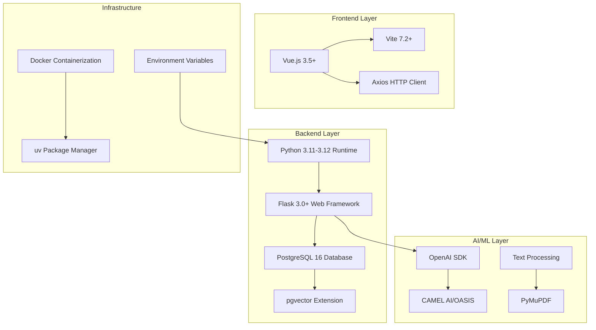
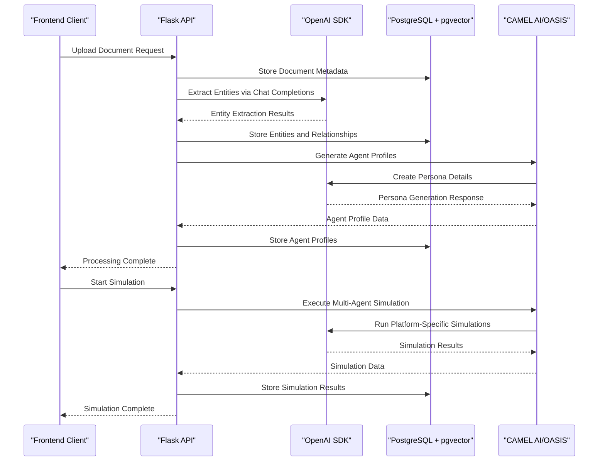
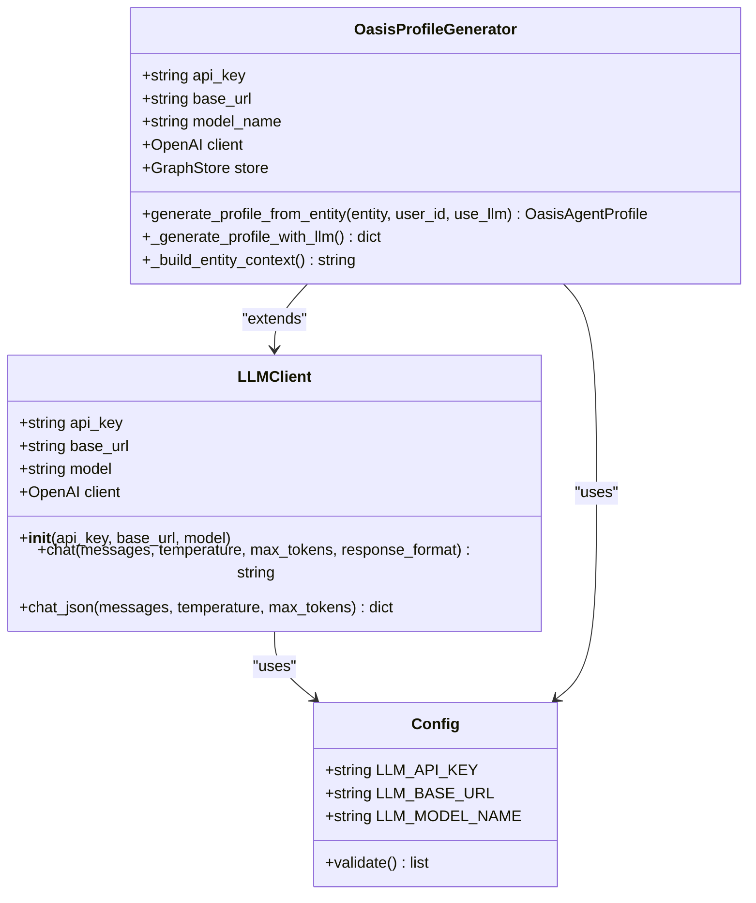
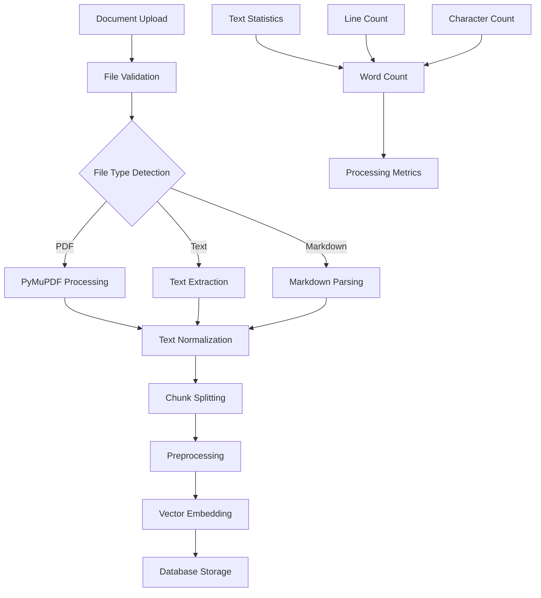
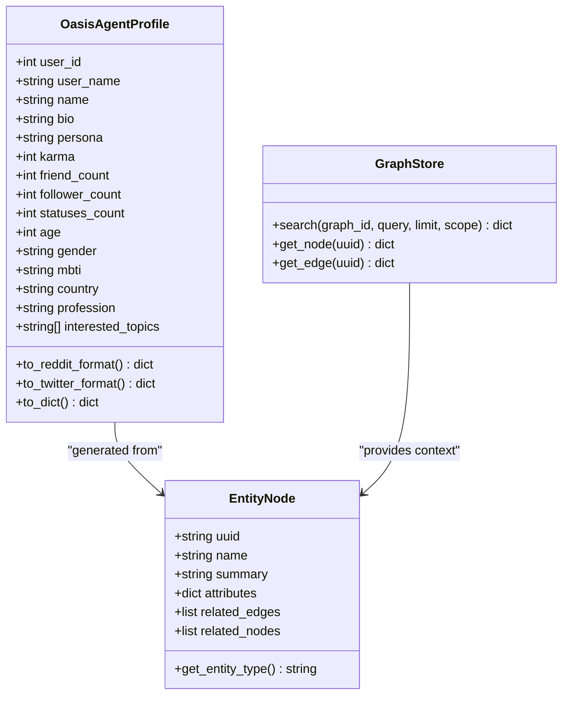
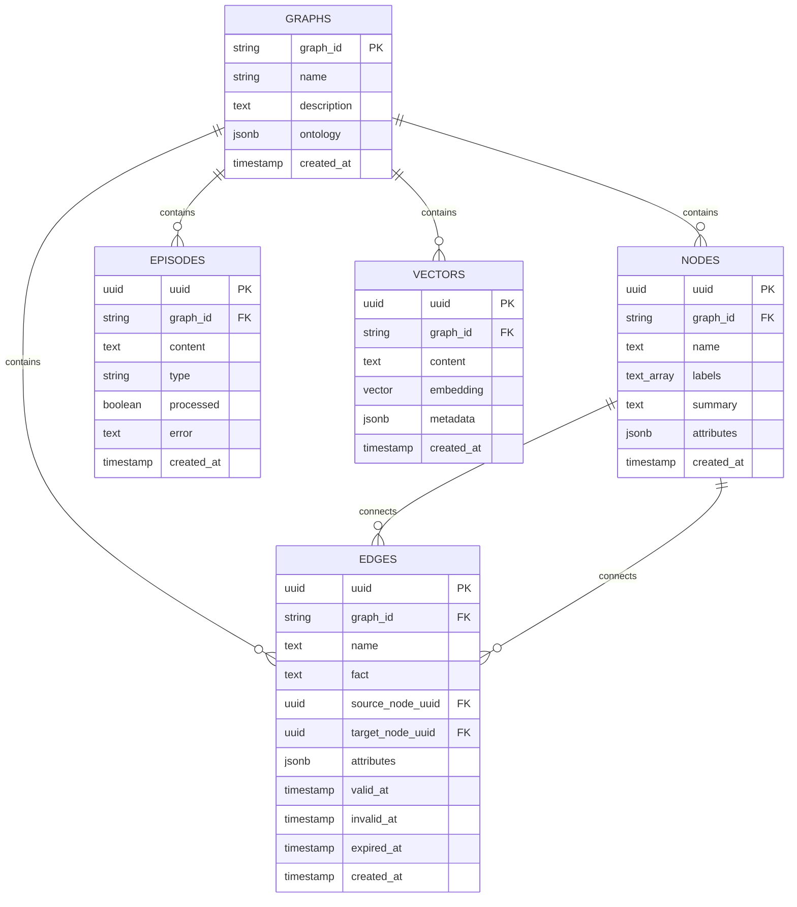
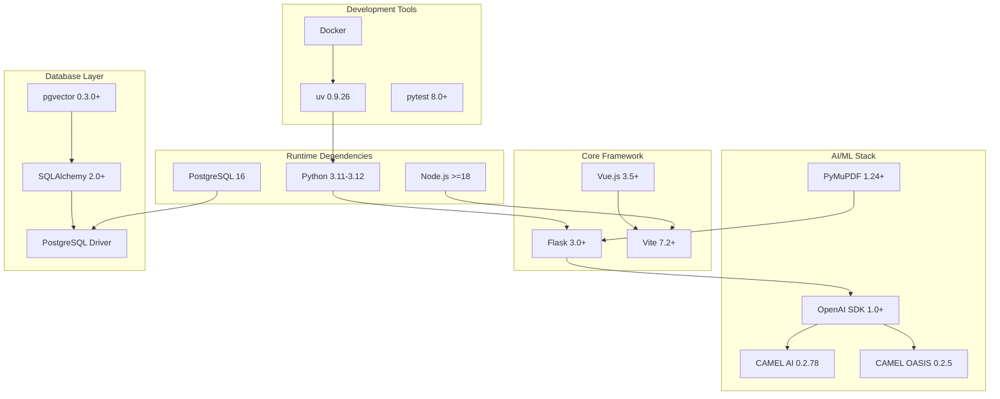

# Technology Stack and Dependencies

<cite>
**Referenced Files in This Document**
- [Dockerfile](file://Dockerfile)
- [docker-compose.yml](file://docker-compose.yml)
- [backend/pyproject.toml](file://backend/pyproject.toml)
- [backend/requirements.txt](file://backend/requirements.txt)
- [backend/uv.lock](file://backend/uv.lock)
- [frontend/package.json](file://frontend/package.json)
- [frontend/vite.config.js](file://frontend/vite.config.js)
- [backend/app/config.py](file://backend/app/config.py)
- [backend/run.py](file://backend/run.py)
- [backend/app/utils/llm_client.py](file://backend/app/utils/llm_client.py)
- [backend/app/services/oasis_profile_generator.py](file://backend/app/services/oasis_profile_generator.py)
- [backend/app/services/text_processor.py](file://backend/app/services/text_processor.py)
- [backend/app/models/graph_db.py](file://backend/app/models/graph_db.py)
- [frontend/src/main.js](file://frontend/src/main.js)
- [frontend/src/router/index.js](file://frontend/src/router/index.js)
</cite>

## Table of Contents
1. [Introduction](#introduction)
2. [Project Structure](#project-structure)
3. [Core Components](#core-components)
4. [Architecture Overview](#architecture-overview)
5. [Detailed Component Analysis](#detailed-component-analysis)
6. [Dependency Analysis](#dependency-analysis)
7. [Performance Considerations](#performance-considerations)
8. [Security Considerations](#security-considerations)
9. [Development vs Production Environments](#development-vs-production-environments)
10. [Conclusion](#conclusion)

## Introduction

The Parallel World AI Prediction Engine is a sophisticated multi-agent simulation platform that combines advanced AI technologies with a modern web interface. This technology stack documentation provides comprehensive coverage of the complete technology stack, including Python 3.11-3.12 with Flask 3.0+, Vue.js 3.5+ with Vite, PostgreSQL with pgvector, and OpenAI SDK integration. The system leverages CAMEL AI/OASIS for multi-agent simulation, PyMuPDF for document processing, and uv for package management.

The platform enables users to upload documents, extract entities, generate detailed agent profiles, and run social media simulations across multiple platforms including Twitter and Reddit. The architecture supports both development and production environments with robust security measures and performance optimizations.

## Project Structure

The project follows a clear separation of concerns with distinct backend and frontend components:

**Diagram sources**
- [Dockerfile:1-30](file://Dockerfile#L1-L30)
- [backend/pyproject.toml:1-58](file://backend/pyproject.toml#L1-L58)
- [frontend/package.json:1-22](file://frontend/package.json#L1-L22)

The project structure demonstrates a microservice-like architecture where the backend handles AI processing, database operations, and API orchestration, while the frontend provides an interactive user interface for simulation management and visualization.

**Section sources**
- [Dockerfile:1-30](file://Dockerfile#L1-L30)
- [docker-compose.yml:1-38](file://docker-compose.yml#L1-L38)
- [backend/pyproject.toml:1-58](file://backend/pyproject.toml#L1-L58)
- [frontend/package.json:1-22](file://frontend/package.json#L1-L22)

## Core Components

### Python Backend Infrastructure

The backend is built on Python 3.11-3.12 with Flask 3.0+ providing a robust foundation for AI-powered applications. The system utilizes uv as the primary package manager, offering significant performance improvements over traditional pip installations.

**Key Dependencies:**
- **Flask 3.0+**: Modern web framework with enhanced security and performance
- **OpenAI SDK**: Unified interface for accessing various AI models
- **SQLAlchemy 2.0+**: Next-generation ORM for database operations
- **PostgreSQL with pgvector**: Advanced vector database capabilities
- **CAMEL AI/OASIS**: Multi-agent simulation framework
- **PyMuPDF**: High-performance PDF processing library

**Section sources**
- [backend/pyproject.toml:11-37](file://backend/pyproject.toml#L11-L37)
- [backend/requirements.txt:8-36](file://backend/requirements.txt#L8-L36)
- [backend/uv.lock:1-10](file://backend/uv.lock#L1-L10)

### Frontend Architecture

The frontend leverages Vue.js 3.5+ with Composition API for reactive component development, paired with Vite 7.2+ for lightning-fast builds and development server. The architecture emphasizes modularity and maintainability through component-based design.

**Frontend Technologies:**
- **Vue.js 3.5+**: Progressive JavaScript framework with Composition API
- **Vite 7.2+**: Next-generation build tool with instant server start
- **Vue Router 4.6+**: Official routing solution for Vue.js applications
- **Axios 1.13+**: Promise-based HTTP client for API communication
- **D3.js 7.9+**: Data visualization library for complex graph rendering

**Section sources**
- [frontend/package.json:11-21](file://frontend/package.json#L11-L21)
- [frontend/vite.config.js:1-19](file://frontend/vite.config.js#L1-L19)
- [frontend/src/main.js:1-15](file://frontend/src/main.js#L1-L15)
- [frontend/src/router/index.js:1-53](file://frontend/src/router/index.js#L1-L53)

### Database and Vector Storage

The system employs PostgreSQL 16 with pgvector extension for advanced similarity search capabilities. This combination provides both relational data management and vector embeddings for semantic search and AI-powered recommendations.

**Database Features:**
- **PostgreSQL 16**: Enterprise-grade relational database
- **pgvector 0.3.0+**: Vector similarity search and machine learning
- **SQLAlchemy ORM**: Type-safe database operations
- **Connection Pooling**: Optimized database connections

**Section sources**
- [backend/app/models/graph_db.py:1-151](file://backend/app/models/graph_db.py#L1-L151)
- [docker-compose.yml:2-18](file://docker-compose.yml#L2-L18)

## Architecture Overview

The Parallel World AI Prediction Engine implements a distributed architecture that separates concerns across multiple layers while maintaining efficient communication between components.

**Diagram sources**
- [backend/app/utils/llm_client.py:14-104](file://backend/app/utils/llm_client.py#L14-L104)
- [backend/app/services/oasis_profile_generator.py:141-202](file://backend/app/services/oasis_profile_generator.py#L141-L202)
- [backend/app/models/graph_db.py:108-151](file://backend/app/models/graph_db.py#L108-L151)

The architecture supports horizontal scaling through containerization and provides fault tolerance through database replication and connection pooling. The system maintains state through persistent storage while keeping computation intensive tasks isolated in separate services.

**Section sources**
- [backend/run.py:25-50](file://backend/run.py#L25-L50)
- [backend/app/config.py:20-76](file://backend/app/config.py#L20-L76)

## Detailed Component Analysis

### LLM Integration Layer

The LLM integration provides a unified interface for accessing multiple AI models through the OpenAI SDK. The system supports various models including GPT-4, GPT-4o-mini, and other compatible providers.

**Diagram sources**
- [backend/app/utils/llm_client.py:14-104](file://backend/app/utils/llm_client.py#L14-L104)
- [backend/app/config.py:30-34](file://backend/app/config.py#L30-L34)
- [backend/app/services/oasis_profile_generator.py:179-202](file://backend/app/services/oasis_profile_generator.py#L179-L202)

The LLM client implements intelligent response parsing with JSON format support and automatic cleanup of model-specific formatting artifacts. It provides fallback mechanisms for truncated responses and includes robust error handling for production deployments.

**Section sources**
- [backend/app/utils/llm_client.py:35-104](file://backend/app/utils/llm_client.py#L35-L104)

### Document Processing Pipeline

The document processing pipeline utilizes PyMuPDF for high-quality PDF extraction combined with advanced text preprocessing capabilities. The system supports multiple document formats including PDF, Markdown, and plain text.

**Diagram sources**
- [backend/app/services/text_processor.py:9-72](file://backend/app/services/text_processor.py#L9-L72)
- [backend/app/utils/llm_client.py:14-104](file://backend/app/utils/llm_client.py#L14-L104)

The processing pipeline includes intelligent chunk splitting with configurable overlap, whitespace normalization, and statistical analysis for quality assessment. This ensures optimal performance for downstream AI processing tasks.

**Section sources**
- [backend/app/services/text_processor.py:12-72](file://backend/app/services/text_processor.py#L12-L72)

### Multi-Agent Simulation Framework

The OASIS integration provides sophisticated multi-agent simulation capabilities with platform-specific agent profiles for Twitter and Reddit. The system generates detailed personas with behavioral patterns, social connections, and content preferences.

**Diagram sources**
- [backend/app/services/oasis_profile_generator.py:27-139](file://backend/app/services/oasis_profile_generator.py#L27-L139)
- [backend/app/services/oasis_profile_generator.py:199-201](file://backend/app/services/oasis_profile_generator.py#L199-L201)

The simulation framework distinguishes between individual personas and institutional accounts, applying different generation strategies and behavioral patterns. This ensures realistic social media interactions across diverse user types.

**Section sources**
- [backend/app/services/oasis_profile_generator.py:141-800](file://backend/app/services/oasis_profile_generator.py#L141-L800)

### Database Schema and Vector Operations

The database design supports complex graph operations with vector similarity search capabilities. The schema includes specialized tables for nodes, edges, episodes, and graph metadata with optimized indexing for performance.

**Diagram sources**
- [backend/app/models/graph_db.py:24-106](file://backend/app/models/graph_db.py#L24-L106)

The vector storage system enables semantic search and similarity matching, crucial for entity resolution and content recommendation. The schema supports complex queries with proper indexing strategies for optimal performance.

**Section sources**
- [backend/app/models/graph_db.py:108-151](file://backend/app/models/graph_db.py#L108-L151)

## Dependency Analysis

The technology stack demonstrates careful dependency management with clear separation of concerns and strategic technology choices.

**Diagram sources**
- [backend/pyproject.toml:5-48](file://backend/pyproject.toml#L5-L48)
- [frontend/package.json:1-22](file://frontend/package.json#L1-L22)
- [Dockerfile:1-10](file://Dockerfile#L1-L10)

The dependency tree reveals strategic choices that balance performance, maintainability, and feature richness. The uv package manager provides deterministic builds and faster installation times compared to traditional pip approaches.

**Section sources**
- [backend/pyproject.toml:1-58](file://backend/pyproject.toml#L1-L58)
- [backend/uv.lock:1-10](file://backend/uv.lock#L1-L10)

## Performance Considerations

The technology stack incorporates several performance optimization strategies:

### Database Performance
- **Connection Pooling**: SQLAlchemy scoped sessions with pre-ping for connection health
- **Vector Indexing**: Optimized pgvector configurations for similarity search
- **Query Optimization**: Proper indexing on frequently queried fields
- **Batch Operations**: Efficient bulk insert operations for large datasets

### AI Processing Optimization
- **Response Caching**: Intelligent caching of LLM responses for repeated queries
- **Parallel Processing**: Concurrent execution of independent AI operations
- **Memory Management**: Efficient text processing with streaming for large documents
- **Model Selection**: Appropriate model choice based on computational requirements

### Frontend Performance
- **Code Splitting**: Dynamic imports for route-based lazy loading
- **Asset Optimization**: Vite's built-in optimization for production builds
- **Component Caching**: Vue's reactivity system for efficient updates
- **Network Optimization**: Axios interceptors for request/response optimization

## Security Considerations

The system implements comprehensive security measures across all technology layers:

### Backend Security
- **Environment-Based Configuration**: Centralized configuration management with sensitive data protection
- **Input Validation**: Comprehensive validation for all user inputs and API requests
- **SQL Injection Prevention**: SQLAlchemy ORM provides protection against SQL injection attacks
- **CORS Management**: Flask-CORS configuration for cross-origin resource sharing
- **Rate Limiting**: Implementation of rate limiting for API endpoints

### Database Security
- **Connection Encryption**: SSL/TLS encryption for database connections
- **Role-Based Access Control**: Proper database user permissions and roles
- **Data Masking**: Sensitive data handling and masking for logs and displays
- **Backup Security**: Encrypted database backups and secure restoration procedures

### Frontend Security
- **Content Security Policy**: Strict CSP headers to prevent XSS attacks
- **Input Sanitization**: Client-side input validation and sanitization
- **Authentication**: JWT-based authentication for protected routes
- **Secure Communication**: HTTPS enforcement for all API communications

### Container Security
- **Image Hardening**: Minimal base images with security updates
- **Non-Root Execution**: Container processes run as non-root users
- **Secret Management**: Environment variable injection without exposing secrets
- **Network Isolation**: Proper network segmentation between services

**Section sources**
- [backend/app/config.py:20-76](file://backend/app/config.py#L20-L76)
- [backend/run.py:25-50](file://backend/run.py#L25-L50)

## Development vs Production Environments

The system supports distinct development and production environments with different configurations and deployment strategies.

### Development Environment
- **Local Development**: Docker Compose for local service orchestration
- **Hot Reloading**: Vite's fast refresh for frontend development
- **Debug Mode**: Flask debug mode with detailed error reporting
- **Development Database**: Local PostgreSQL instance with development data
- **API Proxy**: Vite proxy configuration for backend API communication

### Production Environment
- **Containerized Deployment**: Docker containers with optimized base images
- **Process Management**: Gunicorn or similar WSGI servers for production
- **Health Checks**: Database and service health monitoring
- **Resource Limits**: CPU and memory limits for container isolation
- **Logging**: Structured logging with centralized log aggregation

### Environment Configuration
The system uses environment variables for configuration management, supporting different settings for development, staging, and production environments. Sensitive configuration values are managed through environment files and secret management systems.

**Section sources**
- [frontend/vite.config.js:7-18](file://frontend/vite.config.js#L7-L18)
- [docker-compose.yml:25-35](file://docker-compose.yml#L25-L35)
- [backend/app/config.py:13-17](file://backend/app/config.py#L13-L17)

## Conclusion

The Parallel World AI Prediction Engine represents a sophisticated technology stack that successfully combines modern web development practices with cutting-edge AI capabilities. The architecture demonstrates excellent separation of concerns, with clear boundaries between the frontend Vue.js application, backend Flask services, and AI processing layers.

Key strengths of the technology stack include:

- **Modern Development Practices**: Vue.js 3.5+ with Composition API, Vite for build optimization, and uv for package management
- **Advanced AI Integration**: Seamless OpenAI SDK integration with CAMEL AI/OASIS for multi-agent simulations
- **Scalable Infrastructure**: PostgreSQL with pgvector for vector operations, containerized deployment, and connection pooling
- **Robust Security**: Comprehensive security measures across all layers with proper configuration management
- **Performance Optimization**: Strategic technology choices that balance performance, maintainability, and feature richness

The system's modular architecture supports future enhancements and scaling requirements while maintaining code quality and developer productivity. The comprehensive dependency management through uv ensures reproducible builds and faster development cycles.

This technology stack provides an excellent foundation for AI-powered prediction engines and can serve as a template for similar applications requiring advanced AI capabilities with modern web interfaces.