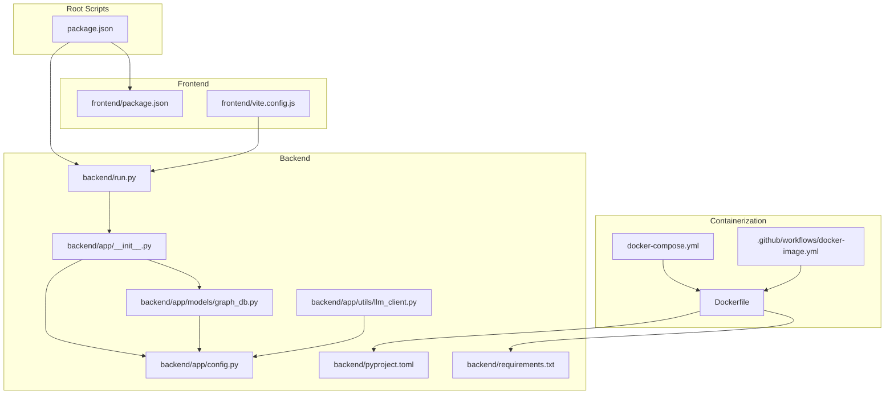
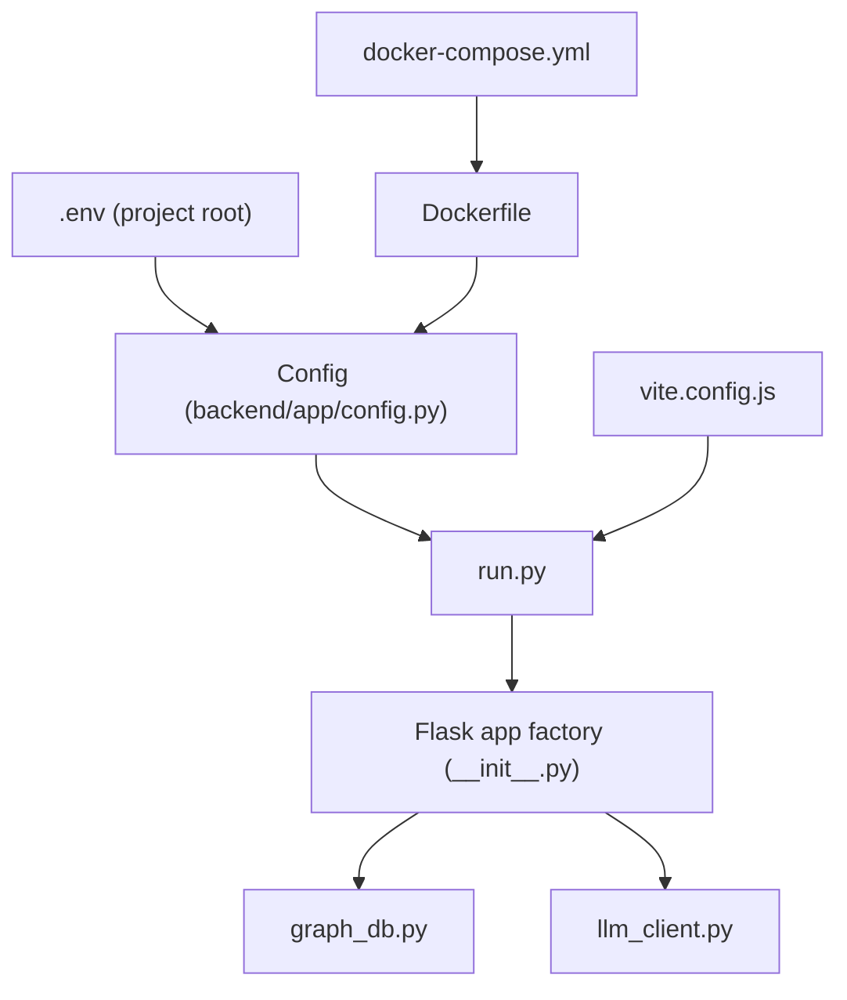
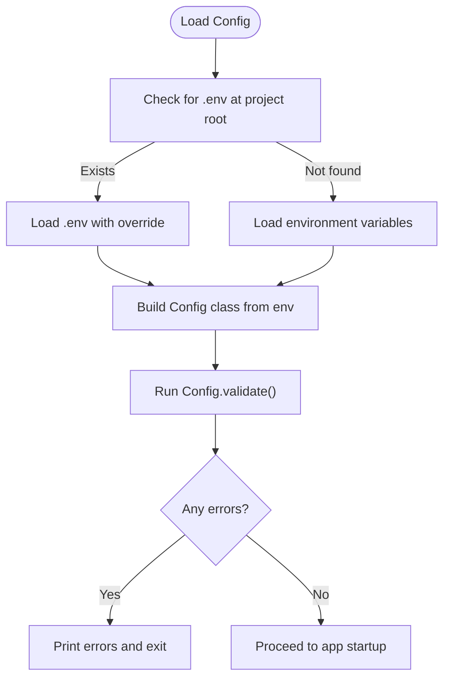
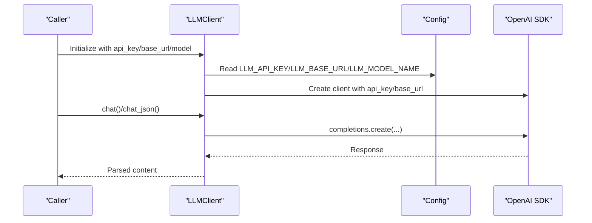
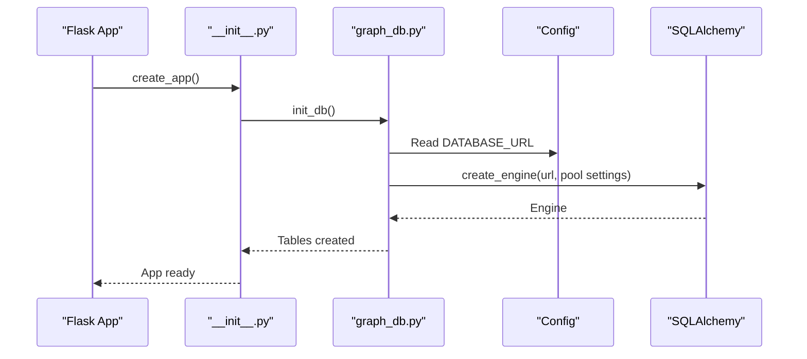
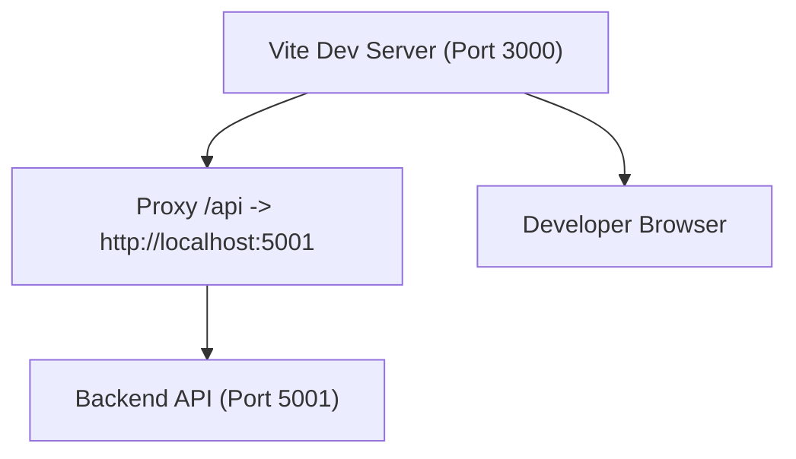
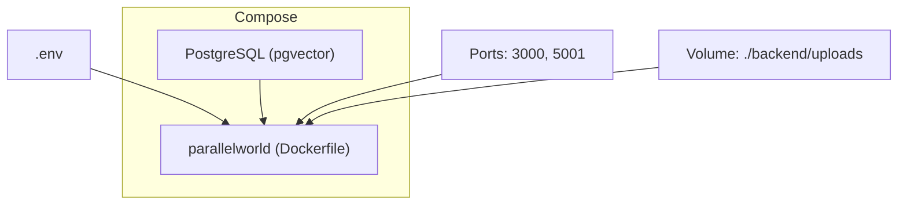
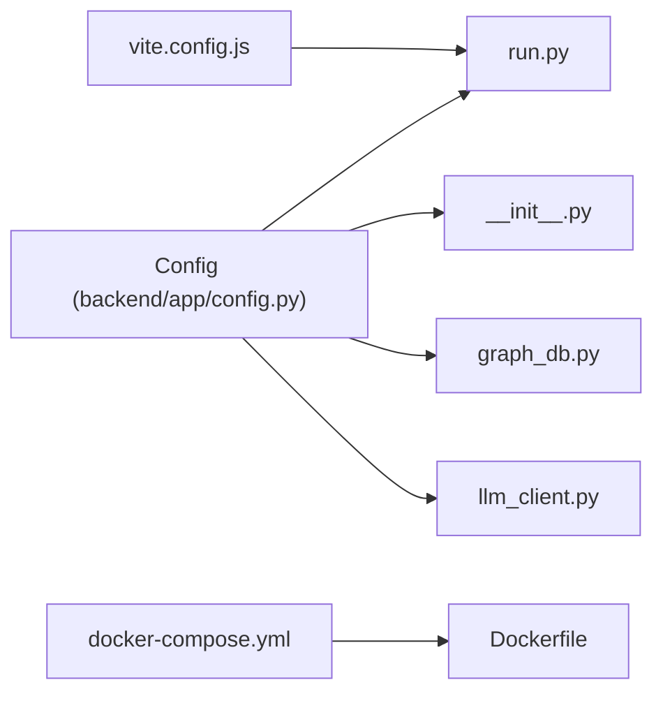

# Configuration and Environment

<cite>
**Referenced Files in This Document**
- [backend/app/config.py](file://backend/app/config.py)
- [backend/run.py](file://backend/run.py)
- [backend/app/__init__.py](file://backend/app/__init__.py)
- [backend/app/utils/llm_client.py](file://backend/app/utils/llm_client.py)
- [backend/app/models/graph_db.py](file://backend/app/models/graph_db.py)
- [backend/pyproject.toml](file://backend/pyproject.toml)
- [backend/requirements.txt](file://backend/requirements.txt)
- [frontend/package.json](file://frontend/package.json)
- [frontend/vite.config.js](file://frontend/vite.config.js)
- [package.json](file://package.json)
- [Dockerfile](file://Dockerfile)
- [docker-compose.yml](file://docker-compose.yml)
- [.github/workflows/docker-image.yml](file://.github/workflows/docker-image.yml)
- [README.md](file://README.md)
</cite>

## Table of Contents
1. [Introduction](#introduction)
2. [Project Structure](#project-structure)
3. [Core Components](#core-components)
4. [Architecture Overview](#architecture-overview)
5. [Detailed Component Analysis](#detailed-component-analysis)
6. [Dependency Analysis](#dependency-analysis)
7. [Performance Considerations](#performance-considerations)
8. [Troubleshooting Guide](#troubleshooting-guide)
9. [Conclusion](#conclusion)
10. [Appendices](#appendices)

## Introduction
This document explains configuration management and environment setup for the Parallel World application. It covers environment variables for LLM API integration, optional Zep Cloud services, database connectivity, configuration validation, development/staging/production considerations, Docker multi-stage builds and orchestration, frontend and backend configuration files, security practices for API keys and sensitive data, deployment options, and troubleshooting.

## Project Structure
The configuration system spans three areas:
- Backend configuration and validation
- Frontend build and proxy configuration
- Containerization via Docker and docker-compose

**Diagram sources**
- [backend/app/config.py:20-76](file://backend/app/config.py#L20-L76)
- [backend/run.py:25-46](file://backend/run.py#L25-L46)
- [backend/app/__init__.py:20-99](file://backend/app/__init__.py#L20-L99)
- [backend/app/models/graph_db.py:108-151](file://backend/app/models/graph_db.py#L108-L151)
- [backend/app/utils/llm_client.py:14-34](file://backend/app/utils/llm_client.py#L14-L34)
- [frontend/package.json:1-22](file://frontend/package.json#L1-L22)
- [frontend/vite.config.js:1-19](file://frontend/vite.config.js#L1-L19)
- [Dockerfile:1-30](file://Dockerfile#L1-L30)
- [docker-compose.yml:1-38](file://docker-compose.yml#L1-L38)
- [.github/workflows/docker-image.yml:1-50](file://.github/workflows/docker-image.yml#L1-L50)

**Section sources**
- [backend/app/config.py:1-76](file://backend/app/config.py#L1-L76)
- [backend/run.py:1-51](file://backend/run.py#L1-L51)
- [backend/app/__init__.py:1-99](file://backend/app/__init__.py#L1-L99)
- [frontend/package.json:1-22](file://frontend/package.json#L1-L22)
- [frontend/vite.config.js:1-19](file://frontend/vite.config.js#L1-L19)
- [Dockerfile:1-30](file://Dockerfile#L1-L30)
- [docker-compose.yml:1-38](file://docker-compose.yml#L1-L38)
- [README.md:90-162](file://README.md#L90-L162)

## Core Components
- Backend configuration class loads environment variables from a project root .env file and provides defaults for most settings. It validates required keys and exposes constants for LLM, database, uploads, simulation, and report agent parameters.
- The backend entrypoint validates configuration before starting the Flask app and reads runtime host/port from environment variables.
- The Flask app factory applies configuration, sets up logging, initializes the database, registers blueprints, and adds a health endpoint.
- The LLM client reads credentials from configuration and raises explicit errors if missing.
- The graph database module uses the configuration’s database URL to create an SQLAlchemy engine and manage sessions.
- Frontend build and dev server are configured via Vite; the dev server proxies API requests to the backend.
- Root package.json orchestrates installation and dev tasks across backend and frontend.
- Dockerfile and docker-compose.yml define multi-stage builds, dependency installation, port mappings, and service orchestration.

**Section sources**
- [backend/app/config.py:20-76](file://backend/app/config.py#L20-L76)
- [backend/run.py:25-46](file://backend/run.py#L25-L46)
- [backend/app/__init__.py:20-99](file://backend/app/__init__.py#L20-L99)
- [backend/app/utils/llm_client.py:14-34](file://backend/app/utils/llm_client.py#L14-L34)
- [backend/app/models/graph_db.py:108-151](file://backend/app/models/graph_db.py#L108-L151)
- [frontend/package.json:1-22](file://frontend/package.json#L1-L22)
- [frontend/vite.config.js:1-19](file://frontend/vite.config.js#L1-L19)
- [package.json:1-22](file://package.json#L1-L22)
- [Dockerfile:1-30](file://Dockerfile#L1-L30)
- [docker-compose.yml:1-38](file://docker-compose.yml#L1-L38)

## Architecture Overview
The configuration architecture integrates environment-driven settings across backend, frontend, and container layers. The backend loads .env at startup, validates required variables, and exposes them to services and models. The frontend consumes environment variables via Vite during build and development. Docker composes the backend and database services, exposing ports and mounting volumes for uploads.

**Diagram sources**
- [backend/app/config.py:10-17](file://backend/app/config.py#L10-L17)
- [backend/app/config.py:20-76](file://backend/app/config.py#L20-L76)
- [backend/run.py:25-46](file://backend/run.py#L25-L46)
- [backend/app/__init__.py:20-99](file://backend/app/__init__.py#L20-L99)
- [backend/app/models/graph_db.py:108-151](file://backend/app/models/graph_db.py#L108-L151)
- [backend/app/utils/llm_client.py:14-34](file://backend/app/utils/llm_client.py#L14-L34)
- [frontend/vite.config.js:1-19](file://frontend/vite.config.js#L1-L19)
- [Dockerfile:1-30](file://Dockerfile#L1-L30)
- [docker-compose.yml:1-38](file://docker-compose.yml#L1-L38)

## Detailed Component Analysis

### Backend Configuration and Validation
- Environment loading: Loads .env from the project root if present; otherwise relies on environment variables for production contexts.
- Required variables:
  - LLM_API_KEY: Required for LLM operations.
  - DATABASE_URL: Required for database connectivity.
- Optional variables:
  - LLM_BASE_URL, LLM_MODEL_NAME, SECRET_KEY, FLASK_DEBUG, FLASK_HOST, FLASK_PORT, OASIS_DEFAULT_MAX_ROUNDS, REPORT_AGENT_* settings, and upload-related parameters.
- Validation: The Config class centralizes validation checks and returns a list of missing required items.

**Diagram sources**
- [backend/app/config.py:10-17](file://backend/app/config.py#L10-L17)
- [backend/app/config.py:66-76](file://backend/app/config.py#L66-L76)
- [backend/run.py:25-46](file://backend/run.py#L25-L46)

**Section sources**
- [backend/app/config.py:10-17](file://backend/app/config.py#L10-L17)
- [backend/app/config.py:20-76](file://backend/app/config.py#L20-L76)
- [backend/run.py:25-46](file://backend/run.py#L25-L46)

### LLM Client and API Integration
- The LLM client reads API key, base URL, and model from configuration. It raises an explicit error if the API key is missing.
- The backend scripts demonstrate setting OPENAI-compatible environment variables for third-party libraries when using boost configurations.

**Diagram sources**
- [backend/app/utils/llm_client.py:14-34](file://backend/app/utils/llm_client.py#L14-L34)
- [backend/app/utils/llm_client.py:35-104](file://backend/app/utils/llm_client.py#L35-L104)
- [backend/app/config.py:30-36](file://backend/app/config.py#L30-L36)

**Section sources**
- [backend/app/utils/llm_client.py:14-34](file://backend/app/utils/llm_client.py#L14-L34)
- [backend/app/utils/llm_client.py:35-104](file://backend/app/utils/llm_client.py#L35-L104)
- [backend/scripts/run_parallel_simulation.py:1004-1037](file://backend/scripts/run_parallel_simulation.py#L1004-L1037)

### Database Configuration and Initialization
- The graph database module reads DATABASE_URL from configuration to create an engine and scoped sessions.
- The Flask app factory initializes database tables on startup and logs health status.

**Diagram sources**
- [backend/app/__init__.py:46-56](file://backend/app/__init__.py#L46-L56)
- [backend/app/models/graph_db.py:108-151](file://backend/app/models/graph_db.py#L108-L151)
- [backend/app/config.py:35-37](file://backend/app/config.py#L35-L37)

**Section sources**
- [backend/app/models/graph_db.py:108-151](file://backend/app/models/graph_db.py#L108-L151)
- [backend/app/__init__.py:46-56](file://backend/app/__init__.py#L46-L56)

### Frontend Configuration and Dev Proxy
- Scripts: Development, build, and preview commands are defined in the frontend package.json.
- Vite dev server:
  - Port 3000
  - Proxies API requests under /api to the backend at http://localhost:5001
  - Opens browser automatically

**Diagram sources**
- [frontend/package.json:6-10](file://frontend/package.json#L6-L10)
- [frontend/vite.config.js:7-17](file://frontend/vite.config.js#L7-L17)

**Section sources**
- [frontend/package.json:1-22](file://frontend/package.json#L1-L22)
- [frontend/vite.config.js:1-19](file://frontend/vite.config.js#L1-L19)

### Docker Configuration and Orchestration
- Multi-stage build:
  - Installs Node.js and uv
  - Copies dependency manifests and installs Node and Python dependencies
  - Copies source and exposes ports 3000 and 5001
  - Starts both frontend and backend in dev mode
- docker-compose:
  - PostgreSQL service with pgvector image, healthcheck, and volume
  - Application service built from Dockerfile, reading .env, mapping ports, mounting uploads, and depending on the database

**Diagram sources**
- [Dockerfile:1-30](file://Dockerfile#L1-L30)
- [docker-compose.yml:1-38](file://docker-compose.yml#L1-L38)

**Section sources**
- [Dockerfile:1-30](file://Dockerfile#L1-L30)
- [docker-compose.yml:1-38](file://docker-compose.yml#L1-L38)
- [.github/workflows/docker-image.yml:1-50](file://.github/workflows/docker-image.yml#L1-L50)

### Environment Variable Reference and Defaults
- Required
  - LLM_API_KEY: Used by Config and validated by Config.validate().
  - DATABASE_URL: Used by Config and consumed by graph_db engine creation.
- Optional
  - LLM_BASE_URL: Defaults to a common OpenAI-compatible base URL.
  - LLM_MODEL_NAME: Defaults to a lightweight model name.
  - SECRET_KEY: Defaults to a development key.
  - FLASK_DEBUG: Defaults to True.
  - FLASK_HOST: Defaults to 0.0.0.0.
  - FLASK_PORT: Defaults to 5001.
  - OASIS_DEFAULT_MAX_ROUNDS: Defaults to 10.
  - REPORT_AGENT_MAX_TOOL_CALLS: Defaults to 5.
  - REPORT_AGENT_MAX_REFLECTION_ROUNDS: Defaults to 2.
  - REPORT_AGENT_TEMPERATURE: Defaults to 0.5.
  - Upload and chunking parameters: Have defaults for size and overlap.

These are defined and validated in the backend configuration class.

**Section sources**
- [backend/app/config.py:20-76](file://backend/app/config.py#L20-L76)

### Environment-Specific Settings and Deployment Scenarios
- Development
  - Use .env with LLM_API_KEY and DATABASE_URL set.
  - Start services with npm run dev to launch frontend and backend concurrently.
  - Frontend dev server proxies /api to backend at 5001.
- Staging/Production
  - Provide environment variables directly (e.g., via docker-compose env_file or container runtime).
  - Ensure DATABASE_URL points to a managed PostgreSQL instance.
  - Keep FLASK_DEBUG disabled and configure SECRET_KEY securely.
- Dockerized deployment
  - docker-compose reads .env and maps ports 3000/5001.
  - The container exposes both frontend and backend ports and mounts uploads.

**Section sources**
- [README.md:90-162](file://README.md#L90-L162)
- [docker-compose.yml:25-35](file://docker-compose.yml#L25-L35)
- [backend/run.py:40-45](file://backend/run.py#L40-L45)

### Security Considerations
- API keys and secrets
  - LLM_API_KEY is required and validated at startup; store in .env or environment variables.
  - Avoid committing secrets to version control; use .dockerignore and restrict access to .env.
- Database credentials
  - DATABASE_URL should point to a protected database; ensure network ACLs and TLS.
- Logging and output
  - Logging is configured to output to console and rotated files; avoid logging sensitive data.
- CORS and health checks
  - CORS is enabled for API routes; health endpoints expose minimal status.

**Section sources**
- [backend/app/config.py:66-76](file://backend/app/config.py#L66-L76)
- [backend/app/__init__.py:44-92](file://backend/app/__init__.py#L44-L92)
- [backend/app/utils/logger.py:30-88](file://backend/app/utils/logger.py#L30-L88)

### Dependency Management
- Backend
  - pyproject.toml defines core dependencies (Flask, OpenAI, SQLAlchemy, psycopg2, pgvector, camel-oasis, camel-ai, PyMuPDF, charset-normalizer, chardet, python-dotenv, pydantic) and dev dependencies.
  - requirements.txt lists pinned dependencies for pip-based workflows.
- Frontend
  - package.json defines Vue, Axios, and Vite with Vue plugin.
- Root
  - package.json orchestrates setup and dev tasks across backend and frontend.

**Section sources**
- [backend/pyproject.toml:11-37](file://backend/pyproject.toml#L11-L37)
- [backend/requirements.txt:8-36](file://backend/requirements.txt#L8-L36)
- [frontend/package.json:1-22](file://frontend/package.json#L1-L22)
- [package.json:5-13](file://package.json#L5-L13)

## Dependency Analysis
The backend configuration is consumed by the Flask app factory, which initializes the database and registers API blueprints. The LLM client depends on configuration for credentials. The frontend dev server proxies API traffic to the backend. Docker composes both services and exposes ports.

**Diagram sources**
- [backend/app/config.py:20-76](file://backend/app/config.py#L20-L76)
- [backend/run.py:25-46](file://backend/run.py#L25-L46)
- [backend/app/__init__.py:20-99](file://backend/app/__init__.py#L20-L99)
- [backend/app/models/graph_db.py:108-151](file://backend/app/models/graph_db.py#L108-L151)
- [backend/app/utils/llm_client.py:14-34](file://backend/app/utils/llm_client.py#L14-L34)
- [frontend/vite.config.js:1-19](file://frontend/vite.config.js#L1-L19)
- [docker-compose.yml:1-38](file://docker-compose.yml#L1-L38)
- [Dockerfile:1-30](file://Dockerfile#L1-L30)

**Section sources**
- [backend/app/config.py:20-76](file://backend/app/config.py#L20-L76)
- [backend/app/__init__.py:20-99](file://backend/app/__init__.py#L20-L99)
- [backend/app/models/graph_db.py:108-151](file://backend/app/models/graph_db.py#L108-L151)
- [backend/app/utils/llm_client.py:14-34](file://backend/app/utils/llm_client.py#L14-L34)
- [frontend/vite.config.js:1-19](file://frontend/vite.config.js#L1-L19)
- [docker-compose.yml:1-38](file://docker-compose.yml#L1-L38)
- [Dockerfile:1-30](file://Dockerfile#L1-L30)

## Performance Considerations
- Database pooling: The graph database module configures engine pool size and overflow to handle concurrent requests efficiently.
- Chunking and overlap: Upload processing parameters (chunk size and overlap) influence ingestion throughput and memory usage.
- LLM cost and latency: Choose appropriate models and base URLs; consider rate limits and quotas.

**Section sources**
- [backend/app/models/graph_db.py:116-121](file://backend/app/models/graph_db.py#L116-L121)
- [backend/app/config.py:44-45](file://backend/app/config.py#L44-L45)

## Troubleshooting Guide
- Configuration validation failures
  - Symptom: Startup exits with configuration errors.
  - Cause: Missing LLM_API_KEY or DATABASE_URL.
  - Action: Set required environment variables in .env or environment and rerun.
- Database connection issues
  - Symptom: Database initialization fails or health endpoint reports disconnected.
  - Cause: Incorrect DATABASE_URL or database not running.
  - Action: Verify database service is healthy and reachable; confirm credentials and port mapping.
- LLM client errors
  - Symptom: Explicit error indicating missing API key.
  - Cause: LLM_API_KEY not configured.
  - Action: Set LLM_API_KEY and ensure compatibility with LLM_BASE_URL and LLM_MODEL_NAME.
- Frontend proxy issues
  - Symptom: API calls fail during development.
  - Cause: Backend not running at http://localhost:5001 or proxy misconfiguration.
  - Action: Confirm backend is running and Vite proxy target matches backend port.

**Section sources**
- [backend/run.py:25-46](file://backend/run.py#L25-L46)
- [backend/app/__init__.py:48-56](file://backend/app/__init__.py#L48-L56)
- [backend/app/utils/llm_client.py:27-28](file://backend/app/utils/llm_client.py#L27-L28)
- [frontend/vite.config.js:10-16](file://frontend/vite.config.js#L10-L16)

## Conclusion
The Parallel World application centralizes configuration in the backend, validating essential variables and exposing defaults for optional settings. The frontend and Docker layers complement this by providing dev/proxy configuration and containerized orchestration. Secure handling of API keys, robust validation, and clear environment-specific guidance enable reliable development and production deployments.

## Appendices

### Environment Variables Summary
- Required
  - LLM_API_KEY
  - DATABASE_URL
- Optional
  - LLM_BASE_URL, LLM_MODEL_NAME, SECRET_KEY, FLASK_DEBUG, FLASK_HOST, FLASK_PORT, OASIS_DEFAULT_MAX_ROUNDS, REPORT_AGENT_MAX_TOOL_CALLS, REPORT_AGENT_MAX_REFLECTION_ROUNDS, REPORT_AGENT_TEMPERATURE, upload and chunking parameters.

**Section sources**
- [backend/app/config.py:20-76](file://backend/app/config.py#L20-L76)

### Deployment Options
- Source code deployment
  - Configure .env, install dependencies, and start services with npm scripts.
- Docker deployment
  - Use docker-compose to build and run services with port mappings and volume mounts.

**Section sources**
- [README.md:90-162](file://README.md#L90-L162)
- [docker-compose.yml:1-38](file://docker-compose.yml#L1-L38)