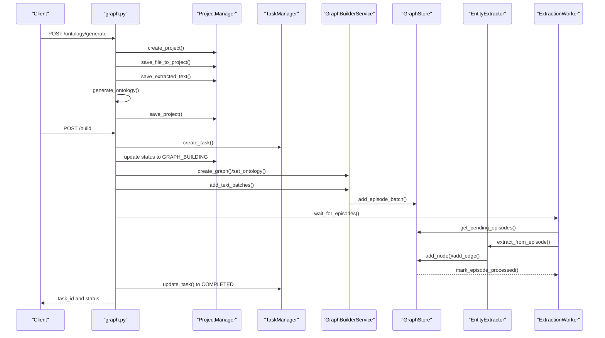
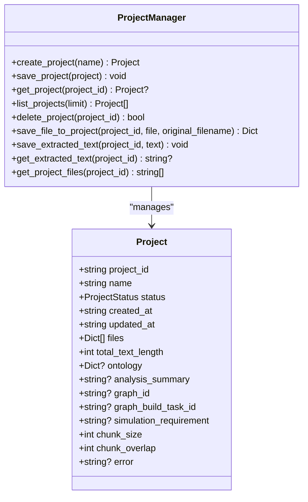
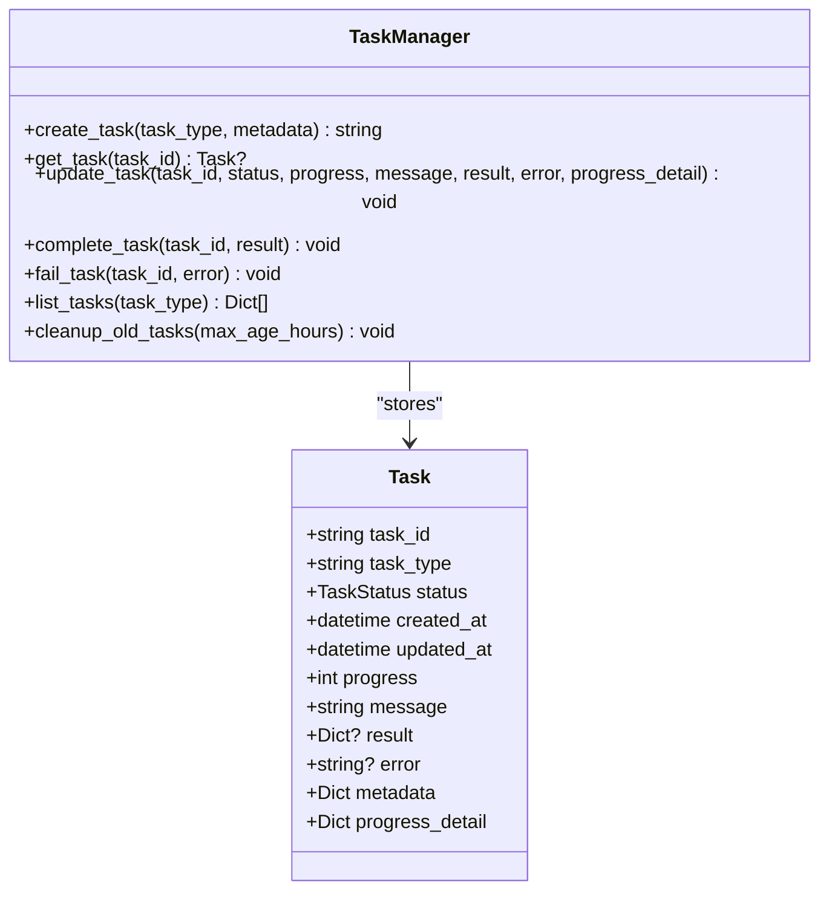
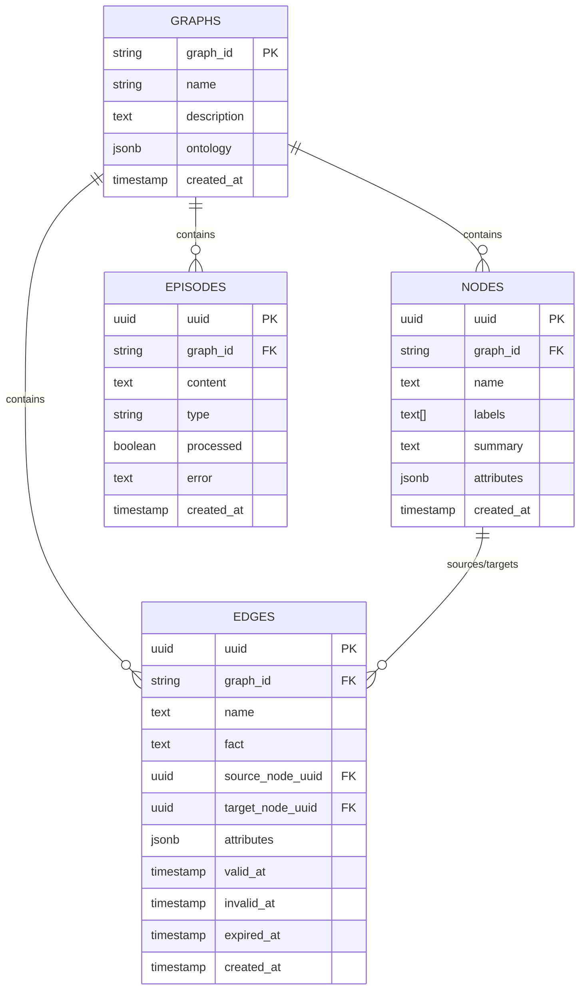
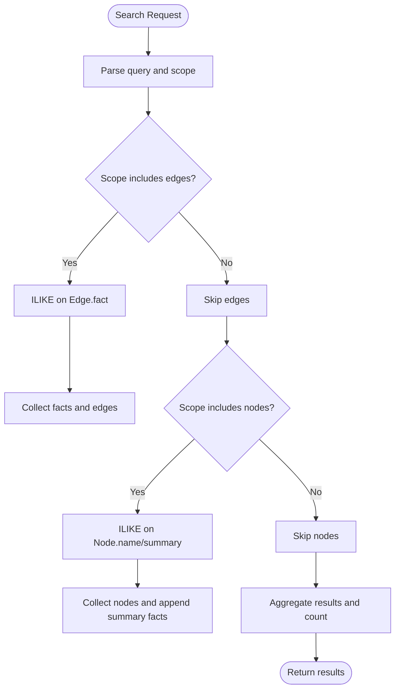
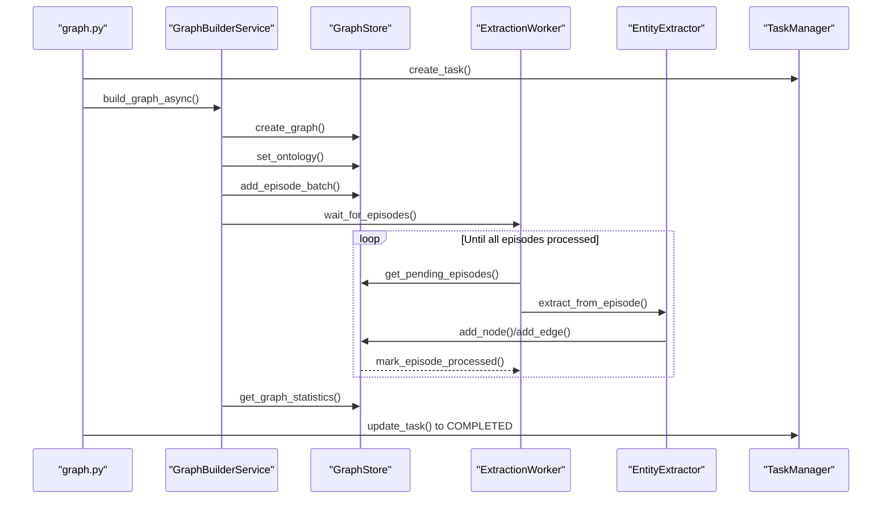
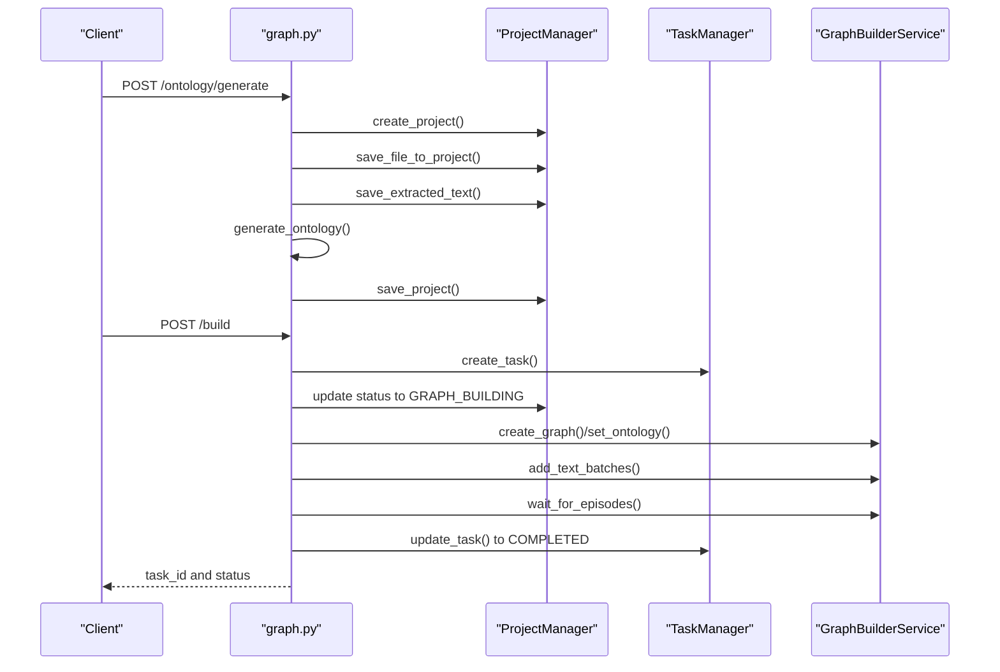
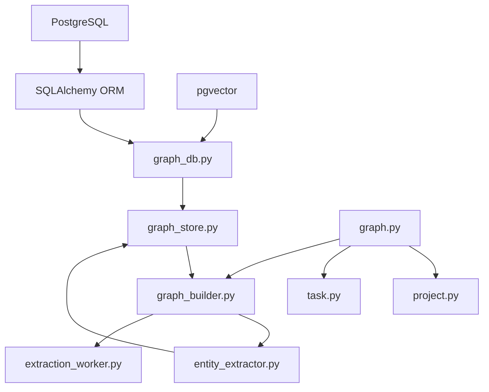

# Data Models and Database

<cite>
**Referenced Files in This Document**
- [project.py](file://backend/app/models/project.py)
- [task.py](file://backend/app/models/task.py)
- [graph_db.py](file://backend/app/models/graph_db.py)
- [graph_store.py](file://backend/app/services/graph_store.py)
- [graph_builder.py](file://backend/app/services/graph_builder.py)
- [entity_extractor.py](file://backend/app/services/entity_extractor.py)
- [extraction_worker.py](file://backend/app/services/extraction_worker.py)
- [graph.py](file://backend/app/api/graph.py)
- [config.py](file://backend/app/config.py)
- [docker-compose.yml](file://docker-compose.yml)
- [uv.lock](file://backend/uv.lock)
</cite>

## Table of Contents
1. [Introduction](#introduction)
2. [Project Structure](#project-structure)
3. [Core Components](#core-components)
4. [Architecture Overview](#architecture-overview)
5. [Detailed Component Analysis](#detailed-component-analysis)
6. [Dependency Analysis](#dependency-analysis)
7. [Performance Considerations](#performance-considerations)
8. [Troubleshooting Guide](#troubleshooting-guide)
9. [Conclusion](#conclusion)
10. [Appendices](#appendices)

## Introduction
This document provides comprehensive data model documentation for the Parallel World database schema and ORM implementations. It details the entity relationships among projects, tasks, and the knowledge graph, defines field semantics, data types, primary/foreign keys, and constraints. It also explains the project model for workflow state persistence and metadata storage, the task model for asynchronous operation tracking, and the graph database model including entity-relationship structures. While vector embeddings are imported via pgvector, the current schema does not define explicit vector columns; therefore, vector-related fields are not included in the schema diagrams. The document covers data access patterns, caching strategies, performance optimization techniques, data lifecycle management, retention policies, archival procedures, security and privacy requirements, access control mechanisms, and migration/version management procedures.

## Project Structure
The backend organizes data models, services, and APIs under the backend/app directory. The key modules relevant to data models and database are:
- Models: project.py, task.py, graph_db.py
- Services: graph_store.py, graph_builder.py, entity_extractor.py, extraction_worker.py
- API: graph.py
- Configuration: config.py
- Infrastructure: docker-compose.yml
- Dependencies: uv.lock

```mermaid
graph TB
subgraph "Models"
PM["ProjectManager<br/>Project"]
TM["TaskManager<br/>Task"]
GDB["Graph ORM Models<br/>Graph, Node, Edge, Episode"]
end
subgraph "Services"
GS["GraphStore"]
GB["GraphBuilderService"]
EE["EntityExtractor"]
EW["ExtractionWorker"]
end
subgraph "API"
API["graph.py"]
end
subgraph "Config"
CFG["Config"]
end
subgraph "Infra"
DC["docker-compose.yml"]
end
API --> PM
API --> TM
API --> GB
GB --> GS
GB --> EE
EE --> GS
EW --> GS
GS --> GDB
CFG --> GS
CFG --> GDB
DC --> CFG
```

**Diagram sources**
- [graph.py:1-604](file://backend/app/api/graph.py#L1-L604)
- [project.py:1-306](file://backend/app/models/project.py#L1-L306)
- [task.py:1-185](file://backend/app/models/task.py#L1-L185)
- [graph_db.py:1-151](file://backend/app/models/graph_db.py#L1-L151)
- [graph_store.py:1-375](file://backend/app/services/graph_store.py#L1-L375)
- [graph_builder.py:1-307](file://backend/app/services/graph_builder.py#L1-L307)
- [entity_extractor.py:1-291](file://backend/app/services/entity_extractor.py#L1-L291)
- [extraction_worker.py:1-109](file://backend/app/services/extraction_worker.py#L1-L109)
- [config.py:1-76](file://backend/app/config.py#L1-L76)
- [docker-compose.yml:1-38](file://docker-compose.yml#L1-L38)

**Section sources**
- [graph.py:1-604](file://backend/app/api/graph.py#L1-L604)
- [project.py:1-306](file://backend/app/models/project.py#L1-L306)
- [task.py:1-185](file://backend/app/models/task.py#L1-L185)
- [graph_db.py:1-151](file://backend/app/models/graph_db.py#L1-L151)
- [graph_store.py:1-375](file://backend/app/services/graph_store.py#L1-L375)
- [graph_builder.py:1-307](file://backend/app/services/graph_builder.py#L1-L307)
- [entity_extractor.py:1-291](file://backend/app/services/entity_extractor.py#L1-L291)
- [extraction_worker.py:1-109](file://backend/app/services/extraction_worker.py#L1-L109)
- [config.py:1-76](file://backend/app/config.py#L1-L76)
- [docker-compose.yml:1-38](file://docker-compose.yml#L1-L38)

## Core Components
This section summarizes the core data models and their responsibilities.

- Project model
  - Purpose: Persistent workflow state and metadata for a project.
  - Fields: project_id, name, status, created_at, updated_at, files, total_text_length, ontology, analysis_summary, graph_id, graph_build_task_id, simulation_requirement, chunk_size, chunk_overlap, error.
  - Persistence: JSON metadata stored under Config.UPLOAD_FOLDER/projects/{project_id}/project.json; files stored under Config.UPLOAD_FOLDER/projects/{project_id}/files; extracted text stored under Config.UPLOAD_FOLDER/projects/{project_id}/extracted_text.txt.
  - Status transitions: CREATED → ONTOLOGY_GENERATED → GRAPH_BUILDING → GRAPH_COMPLETED or FAILED.

- Task model
  - Purpose: Asynchronous operation tracking and status management.
  - Fields: task_id, task_type, status, created_at, updated_at, progress, message, result, error, metadata, progress_detail.
  - Lifecycle: PENDING → PROCESSING → COMPLETED or FAILED; periodic cleanup of old completed/failed tasks.

- Graph database models
  - Purpose: Knowledge graph storage with nodes, edges, episodes, and graph metadata.
  - Entities: Graph, Node, Edge, Episode; relationships and foreign keys defined via SQLAlchemy.
  - Constraints: Primary keys, foreign keys with cascading deletes; indexes for performance.

**Section sources**
- [project.py:17-98](file://backend/app/models/project.py#L17-L98)
- [task.py:14-51](file://backend/app/models/task.py#L14-L51)
- [graph_db.py:24-105](file://backend/app/models/graph_db.py#L24-L105)
- [graph_store.py:32-71](file://backend/app/services/graph_store.py#L32-L71)

## Architecture Overview
The system orchestrates project workflow state, asynchronous task execution, and graph construction. The API layer coordinates with ProjectManager and TaskManager for state and progress tracking, and delegates graph operations to GraphBuilderService, which uses GraphStore to persist nodes, edges, and episodes. EntityExtractor and ExtractionWorker process episodes through LLM calls and store results.



**Diagram sources**
- [graph.py:121-523](file://backend/app/api/graph.py#L121-L523)
- [project.py:133-304](file://backend/app/models/project.py#L133-L304)
- [task.py:73-184](file://backend/app/models/task.py#L73-L184)
- [graph_builder.py:51-184](file://backend/app/services/graph_builder.py#L51-L184)
- [graph_store.py:75-124](file://backend/app/services/graph_store.py#L75-L124)
- [entity_extractor.py:26-166](file://backend/app/services/entity_extractor.py#L26-L166)
- [extraction_worker.py:30-108](file://backend/app/services/extraction_worker.py#L30-L108)

## Detailed Component Analysis

### Project Model and Workflow State Persistence
- Responsibilities
  - Create, persist, list, and delete projects.
  - Track file uploads, extracted text, and project-level metadata.
  - Coordinate with API endpoints for workflow progression.

- Data Access Patterns
  - Project metadata stored as JSON; files and extracted text stored as separate files.
  - Directory layout ensures isolation per project.

- Field Definitions and Types
  - project_id: string (UUID-like hex segment).
  - name: string.
  - status: enum (CREATED, ONTOLOGY_GENERATED, GRAPH_BUILDING, GRAPH_COMPLETED, FAILED).
  - created_at/updated_at: ISO format timestamps.
  - files: array of dicts with filename, path, size.
  - total_text_length: integer.
  - ontology: dict with entity_types, edge_types, analysis_summary.
  - analysis_summary: string.
  - graph_id/graph_build_task_id: optional strings.
  - simulation_requirement: optional string.
  - chunk_size/chunk_overlap: integers.
  - error: optional string.

- Constraints and Defaults
  - Default chunk_size: 500; chunk_overlap: 50.
  - Status defaults to CREATED upon creation.

- Sample Data Example
  - Project JSON includes project_id, name, status, timestamps, files, total_text_length, optional ontology, graph identifiers, and configuration.



**Diagram sources**
- [project.py:27-304](file://backend/app/models/project.py#L27-L304)

**Section sources**
- [project.py:17-304](file://backend/app/models/project.py#L17-L304)
- [graph.py:121-254](file://backend/app/api/graph.py#L121-L254)

### Task Model and Asynchronous Operation Tracking
- Responsibilities
  - Track long-running tasks (e.g., graph building).
  - Provide thread-safe singleton access to task registry.
  - Support progress updates, completion, failure, and cleanup.

- Data Access Patterns
  - In-memory dictionary keyed by task_id; thread-safe via lock.
  - Periodic cleanup of old completed/failed tasks.

- Field Definitions and Types
  - task_id: string.
  - task_type: string.
  - status: enum (PENDING, PROCESSING, COMPLETED, FAILED).
  - created_at/updated_at: datetime.
  - progress: integer (0–100).
  - message: string.
  - result/error: optional dicts/strings.
  - metadata/progress_detail: dicts.

- Constraints and Defaults
  - Default status: PENDING; progress: 0; empty metadata/progress_detail.

- Sample Data Example
  - Task JSON includes task_id, task_type, status, timestamps, progress, message, optional result/error, and metadata.



**Diagram sources**
- [task.py:23-184](file://backend/app/models/task.py#L23-L184)

**Section sources**
- [task.py:14-184](file://backend/app/models/task.py#L14-L184)
- [graph.py:527-557](file://backend/app/api/graph.py#L527-L557)

### Graph Database Model and Entity-Relationship Structures
- Responsibilities
  - Define relational schema for graphs, nodes, edges, and episodes.
  - Provide unified access layer for CRUD, search, and statistics.

- Schema Overview
  - Graph: graph_id (PK), name, description, ontology (JSONB), created_at.
  - Node: uuid (PK), graph_id (FK), name, labels (ARRAY), summary, attributes (JSONB), created_at; indexes on graph_id and name.
  - Edge: uuid (PK), graph_id (FK), name, fact, source_node_uuid/target_node_uuid (FK), attributes (JSONB), valid_at/invalid_at/expired_at, created_at; indexes on graph_id, source_node_uuid, target_node_uuid.
  - Episode: uuid (PK), graph_id (FK), content, type, processed (boolean), error, created_at; indexes on graph_id and (graph_id, processed).

- Relationships
  - One-to-many: Graph → Nodes, Edges, Episodes.
  - Many-to-one: Node ↔ Edges (source/target).
  - Cascade deletes: Deletion of a Graph cascades to Nodes, Edges, Episodes.

- Indexes and Constraints
  - Indexes improve query performance for frequent filters.
  - Foreign keys enforce referential integrity.



**Diagram sources**
- [graph_db.py:24-105](file://backend/app/models/graph_db.py#L24-L105)

**Section sources**
- [graph_db.py:24-151](file://backend/app/models/graph_db.py#L24-L151)
- [graph_store.py:32-374](file://backend/app/services/graph_store.py#L32-L374)

### Graph Data Access Layer (GraphStore)
- Responsibilities
  - Provide CRUD operations for Graph, Node, Edge, Episode.
  - Manage episodes lifecycle (add, batch add, mark processed, pending retrieval).
  - Perform full-text search across edges and nodes.
  - Compute graph statistics and entity type distributions.

- Data Access Patterns
  - Session management via get_db_session context manager.
  - Batch operations for episodes to reduce transaction overhead.
  - Pagination for nodes and edges.

- Search Implementation
  - Edge facts: ILIKE-based case-insensitive search.
  - Node names/summaries: ILIKE-based search.
  - Results aggregated with matched facts and counts.

- Statistics
  - Counts for nodes, edges, episodes, processed episodes.
  - Entity type distribution derived from node labels.



**Diagram sources**
- [graph_store.py:259-316](file://backend/app/services/graph_store.py#L259-L316)

**Section sources**
- [graph_store.py:32-374](file://backend/app/services/graph_store.py#L32-L374)

### Graph Construction Pipeline (GraphBuilderService)
- Responsibilities
  - Orchestrate graph creation from text using LLM-based extraction.
  - Manage asynchronous task progress and outcomes.
  - Coordinate with GraphStore, EntityExtractor, and ExtractionWorker.

- Workflow
  - Create graph and set ontology.
  - Split text into chunks and add episodes in batches.
  - Process episodes via ExtractionWorker and EntityExtractor.
  - Retrieve graph data and update project status.

- Progress Tracking
  - Updates TaskManager with milestones and progress percentages.



**Diagram sources**
- [graph_builder.py:51-184](file://backend/app/services/graph_builder.py#L51-L184)
- [entity_extractor.py:26-166](file://backend/app/services/entity_extractor.py#L26-L166)
- [extraction_worker.py:30-108](file://backend/app/services/extraction_worker.py#L30-L108)
- [graph_store.py:75-124](file://backend/app/services/graph_store.py#L75-L124)

**Section sources**
- [graph_builder.py:51-307](file://backend/app/services/graph_builder.py#L51-L307)
- [entity_extractor.py:16-291](file://backend/app/services/entity_extractor.py#L16-L291)
- [extraction_worker.py:16-109](file://backend/app/services/extraction_worker.py#L16-L109)

### API Endpoints and Data Flow
- Project endpoints
  - GET /project/<project_id>, GET /project/list, DELETE /project/<project_id>, POST /project/<project_id>/reset.
- Ontology generation endpoint
  - POST /ontology/generate: Creates project, saves files, extracts text, generates ontology, persists project state.
- Graph build endpoint
  - POST /build: Validates configuration, checks project status, creates task, starts background build, updates progress, completes/failed states.
- Task endpoints
  - GET /task/<task_id>, GET /tasks.
- Graph data endpoints
  - GET /data/<graph_id>, DELETE /delete/<graph_id>.



**Diagram sources**
- [graph.py:121-523](file://backend/app/api/graph.py#L121-L523)

**Section sources**
- [graph.py:35-604](file://backend/app/api/graph.py#L35-L604)

## Dependency Analysis
- External dependencies relevant to data models
  - SQLAlchemy ORM for PostgreSQL dialect and JSONB/ARRAY support.
  - pgvector for vector extensions (imported but not currently used in schema).
  - PostgreSQL with pgvector image in Docker Compose.

- Internal dependencies
  - GraphStore depends on Graph, Node, Edge, Episode ORM models.
  - GraphBuilderService composes GraphStore, EntityExtractor, ExtractionWorker, and TaskManager.
  - API endpoints depend on ProjectManager, TaskManager, and GraphBuilderService.



**Diagram sources**
- [graph_db.py:6-19](file://backend/app/models/graph_db.py#L6-L19)
- [graph_store.py:12-16](file://backend/app/services/graph_store.py#L12-L16)
- [graph_builder.py:13-19](file://backend/app/services/graph_builder.py#L13-L19)
- [entity_extractor.py:10-11](file://backend/app/services/entity_extractor.py#L10-L11)
- [extraction_worker.py:9-11](file://backend/app/services/extraction_worker.py#L9-L11)
- [task.py:1-11](file://backend/app/models/task.py#L1-L11)
- [project.py:1-14](file://backend/app/models/project.py#L1-L14)
- [graph.py:11-19](file://backend/app/api/graph.py#L11-L19)
- [docker-compose.yml:3-3](file://docker-compose.yml#L3-L3)
- [uv.lock:1822-1832](file://backend/uv.lock#L1822-L1832)

**Section sources**
- [graph_db.py:6-19](file://backend/app/models/graph_db.py#L6-L19)
- [graph_store.py:12-16](file://backend/app/services/graph_store.py#L12-L16)
- [graph_builder.py:13-19](file://backend/app/services/graph_builder.py#L13-L19)
- [entity_extractor.py:10-11](file://backend/app/services/entity_extractor.py#L10-L11)
- [extraction_worker.py:9-11](file://backend/app/services/extraction_worker.py#L9-L11)
- [task.py:1-11](file://backend/app/models/task.py#L1-L11)
- [project.py:1-14](file://backend/app/models/project.py#L1-L14)
- [graph.py:11-19](file://backend/app/api/graph.py#L11-L19)
- [docker-compose.yml:3-3](file://docker-compose.yml#L3-L3)
- [uv.lock:1822-1832](file://backend/uv.lock#L1822-L1832)

## Performance Considerations
- Database connection pooling
  - Engine configured with pool_size and max_overflow; pool_pre_ping enabled for robustness.
- Indexes
  - Composite and single-column indexes on graph_id, node name, and episode processed status to optimize reads.
- Pagination
  - Nodes and edges queries support limit/offset to avoid large result sets.
- Batch operations
  - Episode batch insertion reduces transaction overhead.
- Cleanup
  - TaskManager.cleanup_old_tasks removes stale completed/failed tasks to prevent memory bloat.
- Search
  - ILIKE-based search is straightforward but may benefit from full-text search enhancements if scale grows.

[No sources needed since this section provides general guidance]

## Troubleshooting Guide
- Configuration validation
  - Config.validate checks for required LLM_API_KEY and DATABASE_URL; missing values cause endpoint failures.
- Task cleanup
  - Old completed/failed tasks are pruned automatically; adjust max_age_hours if needed.
- Episode processing
  - ExtractionWorker loops until all episodes processed or timeout; monitor logs for individual episode failures.
- Graph deletion
  - GraphStore.delete_graph cascades to nodes, edges, episodes; ensure no dependent operations are running.

**Section sources**
- [config.py:67-74](file://backend/app/config.py#L67-L74)
- [task.py:172-184](file://backend/app/models/task.py#L172-L184)
- [extraction_worker.py:47-91](file://backend/app/services/extraction_worker.py#L47-L91)
- [graph_store.py:45-54](file://backend/app/services/graph_store.py#L45-L54)

## Conclusion
The Parallel World system integrates project workflow state persistence, asynchronous task tracking, and a relational graph database to support knowledge graph construction. Projects encapsulate metadata and file artifacts; tasks manage long-running operations; and the graph ORM models define a robust entity-relationship schema. The GraphStore provides efficient CRUD and search capabilities, while GraphBuilderService orchestrates the end-to-end pipeline. Current schema does not include explicit vector columns; vector embeddings would require schema additions and indexing strategies. The system’s design supports scalability through batching, indexing, and cleanup mechanisms, and it provides clear data lifecycle boundaries for retention and archival.

[No sources needed since this section summarizes without analyzing specific files]

## Appendices

### Database Schema Diagram (Entities and Relationships)


**Diagram sources**
- [graph_db.py:24-105](file://backend/app/models/graph_db.py#L24-L105)

### Data Lifecycle Management and Retention
- Projects
  - Stored as JSON metadata and files; deletion removes entire project directory.
- Tasks
  - Automatic cleanup of old completed/failed tasks after a configurable period.
- Graphs
  - Deletion cascades to nodes, edges, episodes; ensure no concurrent operations.

**Section sources**
- [project.py:222-238](file://backend/app/models/project.py#L222-L238)
- [task.py:172-184](file://backend/app/models/task.py#L172-L184)
- [graph_store.py:45-54](file://backend/app/services/graph_store.py#L45-L54)

### Security, Privacy, and Access Control
- Configuration
  - DATABASE_URL and LLM_API_KEY validated at runtime; ensure secrets are managed securely.
- File uploads
  - Allowed file types restricted; filenames sanitized; files stored under controlled upload directory.
- Access control
  - No explicit authentication/authorization logic present in referenced files; implement at API gateway or middleware as needed.

**Section sources**
- [config.py:67-74](file://backend/app/config.py#L67-L74)
- [graph.py:25-30](file://backend/app/api/graph.py#L25-L30)

### Migration and Version Management
- Schema initialization
  - Base.metadata.create_all invoked via init_db to create tables.
- Vector embeddings
  - pgvector imported; schema does not define vector columns; adding vector columns would require migrations and indexes.
- Docker environment
  - Postgres with pgvector image ensures vector extension availability.

**Section sources**
- [graph_db.py:132-135](file://backend/app/models/graph_db.py#L132-L135)
- [docker-compose.yml:3-3](file://docker-compose.yml#L3-L3)
- [uv.lock:1822-1832](file://backend/uv.lock#L1822-L1832)