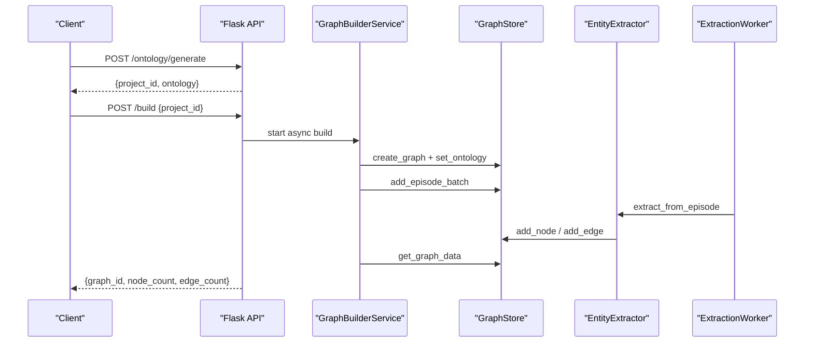
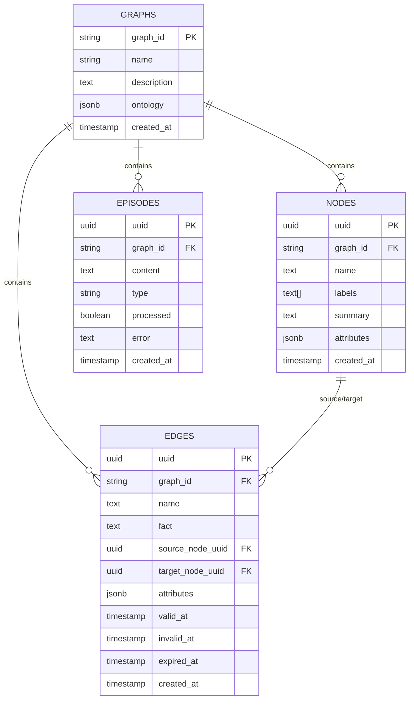
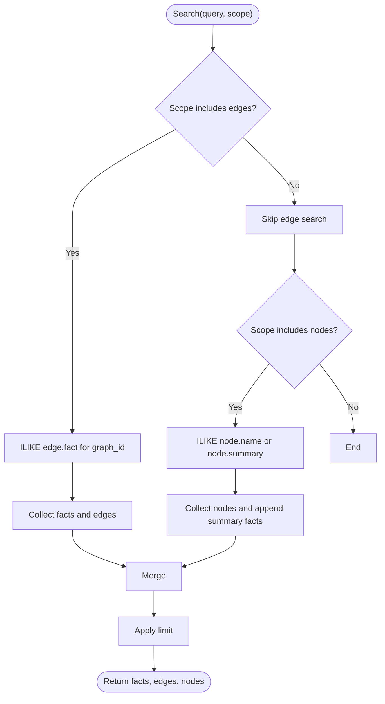
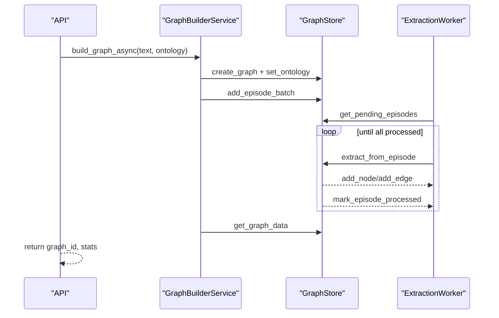
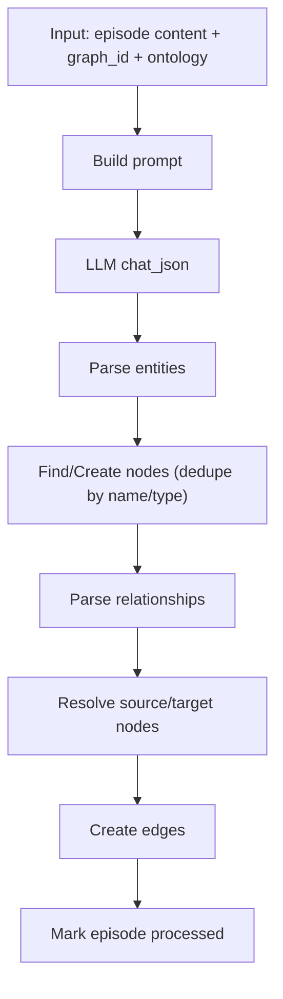
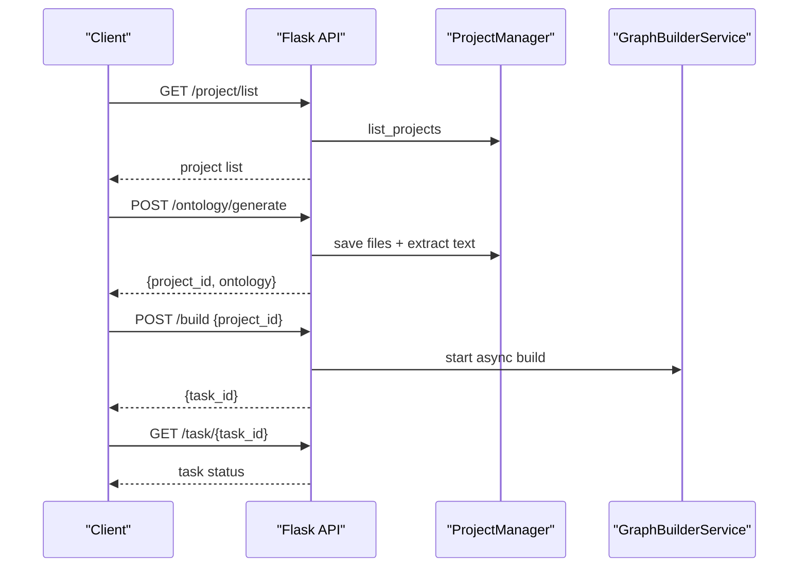
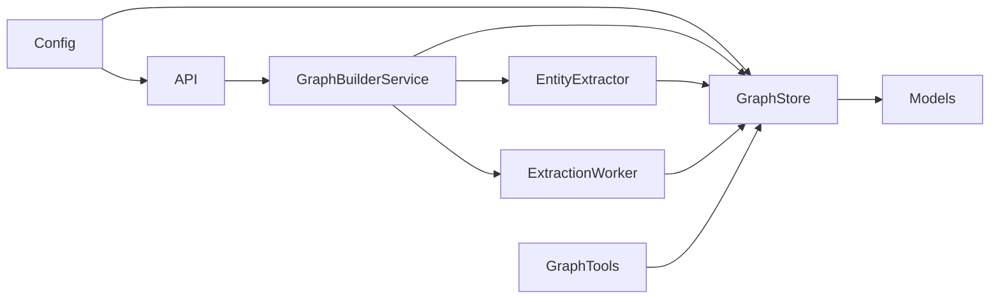

# Graph Database Model

<cite>
**Referenced Files in This Document**
- [graph_db.py](file://backend/app/models/graph_db.py)
- [graph_store.py](file://backend/app/services/graph_store.py)
- [graph_builder.py](file://backend/app/services/graph_builder.py)
- [graph.py](file://backend/app/api/graph.py)
- [config.py](file://backend/app/config.py)
- [entity_extractor.py](file://backend/app/services/entity_extractor.py)
- [extraction_worker.py](file://backend/app/services/extraction_worker.py)
- [graph_tools.py](file://backend/app/services/graph_tools.py)
- [task.py](file://backend/app/models/task.py)
- [requirements.txt](file://backend/requirements.txt)
- [uv.lock](file://backend/uv.lock)
</cite>

## Table of Contents
1. [Introduction](#introduction)
2. [Project Structure](#project-structure)
3. [Core Components](#core-components)
4. [Architecture Overview](#architecture-overview)
5. [Detailed Component Analysis](#detailed-component-analysis)
6. [Dependency Analysis](#dependency-analysis)
7. [Performance Considerations](#performance-considerations)
8. [Troubleshooting Guide](#troubleshooting-guide)
9. [Conclusion](#conclusion)
10. [Appendices](#appendices)

## Introduction
This document describes the graph database schema and vector embedding storage system used to represent a knowledge graph in PostgreSQL with pgvector integration. It details the entity-relationship model (nodes, edges, episodes), property schemas, indexing strategies, and query capabilities. It also explains graph construction workflows, traversal patterns, and optimization techniques for large-scale knowledge graphs.

## Project Structure
The graph system is implemented in the backend Python application under the app/ directory. Key modules include:
- Models: SQLAlchemy ORM definitions for graphs, nodes, edges, and episodes
- Services: GraphStore for unified persistence, GraphBuilderService for orchestration, EntityExtractor for LLM-driven extraction, ExtractionWorker for background processing, and GraphTools for retrieval and search
- API: Flask routes for project lifecycle, graph building, and data retrieval
- Configuration: centralized configuration for database and LLM connectivity
- Tasks: in-memory task management for long-running operations

```mermaid
graph TB
subgraph "Models"
G["Graph (graphs)"]
N["Node (nodes)"]
E["Edge (edges)"]
EP["Episode (episodes)"]
end
subgraph "Services"
GS["GraphStore"]
GB["GraphBuilderService"]
EE["EntityExtractor"]
EW["ExtractionWorker"]
GT["GraphTools"]
end
subgraph "API"
API["Flask Routes"]
end
subgraph "Config"
CFG["Config"]
end
API --> GB
GB --> GS
GB --> EE
GB --> EW
GS --> G
GS --> N
GS --> E
GS --> EP
EE --> GS
EW --> GS
GT --> GS
CFG --> API
CFG --> GS
```

**Diagram sources**
- [graph_db.py:24-105](file://backend/app/models/graph_db.py#L24-L105)
- [graph_store.py:21-375](file://backend/app/services/graph_store.py#L21-L375)
- [graph_builder.py:39-307](file://backend/app/services/graph_builder.py#L39-L307)
- [entity_extractor.py:16-291](file://backend/app/services/entity_extractor.py#L16-L291)
- [extraction_worker.py:16-109](file://backend/app/services/extraction_worker.py#L16-L109)
- [graph_tools.py:24-200](file://backend/app/services/graph_tools.py#L24-L200)
- [graph.py:121-604](file://backend/app/api/graph.py#L121-L604)
- [config.py:20-76](file://backend/app/config.py#L20-L76)

**Section sources**
- [graph_db.py:24-105](file://backend/app/models/graph_db.py#L24-L105)
- [graph_store.py:21-375](file://backend/app/services/graph_store.py#L21-L375)
- [graph_builder.py:39-307](file://backend/app/services/graph_builder.py#L39-L307)
- [entity_extractor.py:16-291](file://backend/app/services/entity_extractor.py#L16-L291)
- [extraction_worker.py:16-109](file://backend/app/services/extraction_worker.py#L16-L109)
- [graph_tools.py:24-200](file://backend/app/services/graph_tools.py#L24-L200)
- [graph.py:121-604](file://backend/app/api/graph.py#L121-L604)
- [config.py:20-76](file://backend/app/config.py#L20-L76)

## Core Components
This section documents the data model and core services that implement the knowledge graph.

- Graph metadata: stores graph identity, name, description, and JSONB-encoded ontology
- Node: entity with UUID primary key, graph association, name, labels, summary, attributes, and timestamps
- Edge: relationship with UUID primary key, graph association, name/fact, source/target node references, temporal validity fields, and attributes
- Episode: text chunk container for extraction, with processing state and type
- GraphStore: unified persistence layer for CRUD, search, and statistics
- GraphBuilderService: orchestrates graph creation, chunking, episode ingestion, and extraction
- EntityExtractor: prompts LLM to extract entities and relationships, persists nodes and edges
- ExtractionWorker: background processor for pending episodes
- GraphTools: retrieval tools (search, panaroma, quick search) and advanced insight fusion
- TaskManager: in-memory task tracking for long-running operations
- Config: centralized configuration for database and LLM connectivity

**Section sources**
- [graph_db.py:24-105](file://backend/app/models/graph_db.py#L24-L105)
- [graph_store.py:21-375](file://backend/app/services/graph_store.py#L21-L375)
- [graph_builder.py:39-307](file://backend/app/services/graph_builder.py#L39-L307)
- [entity_extractor.py:16-291](file://backend/app/services/entity_extractor.py#L16-L291)
- [extraction_worker.py:16-109](file://backend/app/services/extraction_worker.py#L16-L109)
- [graph_tools.py:24-200](file://backend/app/services/graph_tools.py#L24-L200)
- [task.py:54-185](file://backend/app/models/task.py#L54-L185)
- [config.py:20-76](file://backend/app/config.py#L20-L76)

## Architecture Overview
The system integrates PostgreSQL with pgvector for vector similarity search and uses SQLAlchemy ORM for persistence. The API exposes endpoints to generate ontologies, build graphs asynchronously, and retrieve graph data. LLM-driven extraction populates nodes and edges, while background workers process episodes. Retrieval tools combine full-text search and semantic search for deep insights.



**Diagram sources**
- [graph.py:121-604](file://backend/app/api/graph.py#L121-L604)
- [graph_builder.py:39-307](file://backend/app/services/graph_builder.py#L39-L307)
- [graph_store.py:21-375](file://backend/app/services/graph_store.py#L21-L375)
- [entity_extractor.py:16-291](file://backend/app/services/entity_extractor.py#L16-L291)
- [extraction_worker.py:16-109](file://backend/app/services/extraction_worker.py#L16-L109)

## Detailed Component Analysis

### Data Model: Nodes, Edges, Episodes, and Graphs
- Graph: identity, name, description, JSONB ontology, timestamps
- Node: UUID primary key, graph_id FK, name, labels array, summary, attributes JSONB, timestamps
- Edge: UUID primary key, graph_id FK, name/fact, source/target node UUIDs, attributes JSONB, validity timestamps, timestamps
- Episode: UUID primary key, graph_id FK, content, type, processed flag, error, timestamps

Indexes:
- Nodes: graph_id, name
- Edges: graph_id, source_node_uuid, target_node_uuid
- Episodes: graph_id, (graph_id, processed)



**Diagram sources**
- [graph_db.py:24-105](file://backend/app/models/graph_db.py#L24-L105)

**Section sources**
- [graph_db.py:24-105](file://backend/app/models/graph_db.py#L24-L105)

### GraphStore: Persistence Layer
Responsibilities:
- Graph lifecycle: create/delete graph, set/get ontology
- Episodes: add single/batch episodes, mark processed, fetch pending
- Nodes: add, get, find by name, update, list with pagination
- Edges: add, list with pagination
- Search: full-text search across edges and nodes
- Statistics: counts, entity type distribution
- Helpers: edge conversion to dict, session context manager

Key operations:
- Full-text search uses PostgreSQL ILIKE matching across edge facts and node names/summaries
- Pagination supported for nodes and edges
- Deduplication by name and optional label during node lookup



**Diagram sources**
- [graph_store.py:259-317](file://backend/app/services/graph_store.py#L259-L317)

**Section sources**
- [graph_store.py:21-375](file://backend/app/services/graph_store.py#L21-L375)

### GraphBuilderService: Orchestration
Responsibilities:
- Asynchronous graph build: create graph, set ontology, chunk text, add episodes, wait for processing, compute statistics
- Batch episode ingestion with progress callbacks
- Retrieve complete graph data (nodes and edges) with name mapping



**Diagram sources**
- [graph_builder.py:39-307](file://backend/app/services/graph_builder.py#L39-L307)
- [graph_store.py:21-375](file://backend/app/services/graph_store.py#L21-L375)
- [extraction_worker.py:16-109](file://backend/app/services/extraction_worker.py#L16-L109)
- [entity_extractor.py:16-291](file://backend/app/services/entity_extractor.py#L16-L291)

**Section sources**
- [graph_builder.py:39-307](file://backend/app/services/graph_builder.py#L39-L307)

### EntityExtractor: LLM-driven Extraction
Responsibilities:
- Build extraction prompt from text and ontology
- Call LLM to produce structured JSON with entities and relationships
- Deduplicate nodes by name and type; create nodes and edges; optionally update summaries
- Support direct extraction from raw text



**Diagram sources**
- [entity_extractor.py:16-291](file://backend/app/services/entity_extractor.py#L16-L291)

**Section sources**
- [entity_extractor.py:16-291](file://backend/app/services/entity_extractor.py#L16-L291)

### ExtractionWorker: Background Processing
Responsibilities:
- Poll pending episodes and process them sequentially
- Update progress via callbacks
- Graceful failure handling with error marking

**Section sources**
- [extraction_worker.py:16-109](file://backend/app/services/extraction_worker.py#L16-L109)

### GraphTools: Retrieval and Search
Responsibilities:
- Structured search results and node/edge info dataclasses
- InsightForge: hybrid search that decomposes queries and aggregates facts from multiple sub-queries
- PanoramaSearch and QuickSearch: breadth and fast retrieval modes
- Converts results to text for LLM consumption

Note: The current implementation uses full-text search via GraphStore. There is no explicit vector embedding schema or pgvector similarity search defined in the referenced files.

**Section sources**
- [graph_tools.py:24-200](file://backend/app/services/graph_tools.py#L24-L200)
- [graph_tools.py:751-830](file://backend/app/services/graph_tools.py#L751-L830)
- [graph_store.py:259-317](file://backend/app/services/graph_store.py#L259-L317)

### API Endpoints: Graph Lifecycle and Data Access
Endpoints:
- Ontology generation: upload files, preprocess text, generate ontology, save to project
- Graph build: create async task, chunk text, ingest episodes, process via LLM, return results
- Task management: query status and list tasks
- Graph data: retrieve nodes and edges
- Delete graph



**Diagram sources**
- [graph.py:35-117](file://backend/app/api/graph.py#L35-L117)
- [graph.py:121-604](file://backend/app/api/graph.py#L121-L604)

**Section sources**
- [graph.py:35-117](file://backend/app/api/graph.py#L35-L117)
- [graph.py:121-604](file://backend/app/api/graph.py#L121-L604)

### Configuration and Dependencies
- Database URL and LLM configuration are loaded from environment variables
- Required dependencies include Flask, OpenAI SDK, and others; pgvector is present in lock file indicating support

**Section sources**
- [config.py:20-76](file://backend/app/config.py#L20-L76)
- [requirements.txt:1-36](file://backend/requirements.txt#L1-L36)
- [uv.lock:1822-1841](file://backend/uv.lock#L1822-L1841)

## Dependency Analysis
- Models depend on SQLAlchemy and pgvector Vector type
- Services depend on models and configuration
- API depends on services and task management
- Extraction pipeline composes GraphBuilderService, GraphStore, EntityExtractor, and ExtractionWorker
- Retrieval tools depend on GraphStore for search and statistics



**Diagram sources**
- [config.py:20-76](file://backend/app/config.py#L20-L76)
- [graph.py:121-604](file://backend/app/api/graph.py#L121-L604)
- [graph_store.py:21-375](file://backend/app/services/graph_store.py#L21-L375)
- [graph_db.py:24-105](file://backend/app/models/graph_db.py#L24-L105)
- [graph_builder.py:39-307](file://backend/app/services/graph_builder.py#L39-L307)
- [entity_extractor.py:16-291](file://backend/app/services/entity_extractor.py#L16-L291)
- [extraction_worker.py:16-109](file://backend/app/services/extraction_worker.py#L16-L109)
- [graph_tools.py:24-200](file://backend/app/services/graph_tools.py#L24-L200)

**Section sources**
- [graph_db.py:24-105](file://backend/app/models/graph_db.py#L24-L105)
- [graph_store.py:21-375](file://backend/app/services/graph_store.py#L21-L375)
- [graph_builder.py:39-307](file://backend/app/services/graph_builder.py#L39-L307)
- [entity_extractor.py:16-291](file://backend/app/services/entity_extractor.py#L16-L291)
- [extraction_worker.py:16-109](file://backend/app/services/extraction_worker.py#L16-L109)
- [graph_tools.py:24-200](file://backend/app/services/graph_tools.py#L24-L200)
- [graph.py:121-604](file://backend/app/api/graph.py#L121-L604)
- [config.py:20-76](file://backend/app/config.py#L20-L76)

## Performance Considerations
- Indexing: ensure graph_id, name, and UUID foreign keys are indexed as implemented
- Pagination: GraphStore supports pagination for nodes and edges; use limits to bound memory and latency
- Full-text search: ILIKE-based search is simple but not optimized; consider PostgreSQL full-text search (tsvector/ts_rank) for improved performance
- Concurrency: GraphStore sessions are scoped; avoid long transactions and batch writes
- Background processing: ExtractionWorker processes episodes incrementally with small delays to prevent contention
- Task management: TaskManager is thread-safe and lightweight; clean up old tasks periodically

[No sources needed since this section provides general guidance]

## Troubleshooting Guide
Common issues and remedies:
- Missing configuration: ensure DATABASE_URL and LLM credentials are set; validate via Config.validate
- Session errors: GraphStore wraps commits/rollbacks; inspect exceptions raised in context managers
- Extraction failures: ExtractionWorker marks episodes with error messages; re-run worker after fixing LLM connectivity
- Task stuck: use /task/{task_id} to inspect status; clean up old completed/failed tasks

**Section sources**
- [config.py:66-75](file://backend/app/config.py#L66-L75)
- [graph_store.py:138-151](file://backend/app/services/graph_store.py#L138-L151)
- [extraction_worker.py:82-88](file://backend/app/services/extraction_worker.py#L82-L88)
- [task.py:172-185](file://backend/app/models/task.py#L172-L185)

## Conclusion
The system provides a robust knowledge graph model on PostgreSQL with SQLAlchemy ORM and a flexible pipeline for constructing graphs from text using LLMs. Current search relies on full-text matching; extending to vector embeddings with pgvector would enable semantic similarity search. The modular design supports asynchronous graph building, background processing, and retrieval tools suitable for large-scale knowledge graphs.

[No sources needed since this section summarizes without analyzing specific files]

## Appendices

### Appendix A: Property Schema Reference
- Graph
  - graph_id: string (primary key)
  - name: string
  - description: text
  - ontology: JSONB
  - created_at: timestamp
- Node
  - uuid: UUID (primary key)
  - graph_id: string (foreign key)
  - name: text
  - labels: text[]
  - summary: text
  - attributes: JSONB
  - created_at: timestamp
- Edge
  - uuid: UUID (primary key)
  - graph_id: string (foreign key)
  - name: text
  - fact: text
  - source_node_uuid: UUID (foreign key)
  - target_node_uuid: UUID (foreign key)
  - attributes: JSONB
  - valid_at: timestamp
  - invalid_at: timestamp
  - expired_at: timestamp
  - created_at: timestamp
- Episode
  - uuid: UUID (primary key)
  - graph_id: string (foreign key)
  - content: text
  - type: string
  - processed: boolean
  - error: text
  - created_at: timestamp

**Section sources**
- [graph_db.py:24-105](file://backend/app/models/graph_db.py#L24-L105)

### Appendix B: Example Workflows

- Construct a graph from text:
  - Upload files and generate ontology via API
  - Submit /build with project_id; monitor task via /task/{task_id}
  - Retrieve graph data via /data/{graph_id}

- Query the graph:
  - Use GraphStore.search to search edges/nodes by text
  - Use GraphTools InsightForge for hybrid retrieval across sub-queries

- Delete a graph:
  - Use /delete/{graph_id} to remove all associated data

**Section sources**
- [graph.py:121-604](file://backend/app/api/graph.py#L121-L604)
- [graph_store.py:259-317](file://backend/app/services/graph_store.py#L259-L317)
- [graph_tools.py:751-830](file://backend/app/services/graph_tools.py#L751-L830)

### Appendix C: Vector Embedding Storage and pgvector Integration
- Presence: pgvector is declared in the lock file, indicating support for vector operations
- Current implementation: No explicit vector column or similarity search is defined in the referenced files
- Recommended extension:
  - Add a vector column to nodes or edges using the Vector type
  - Create GIN/GIST indexes on vector columns for similarity search
  - Implement similarity queries using distance metrics (e.g., cosine distance)
  - Integrate embedding generation in the extraction pipeline and retrieval tools

**Section sources**
- [uv.lock:1822-1841](file://backend/uv.lock#L1822-L1841)
- [graph_db.py:16](file://backend/app/models/graph_db.py#L16)