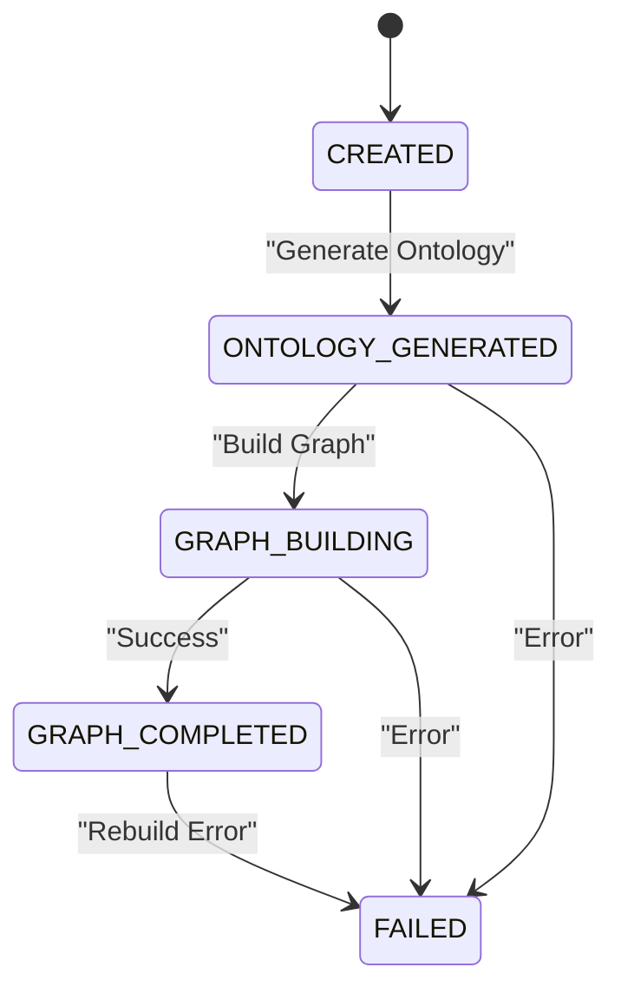
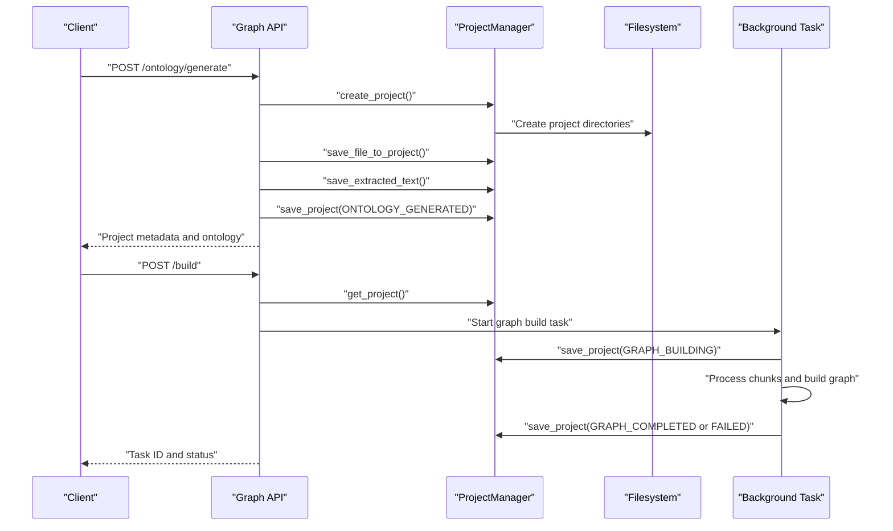
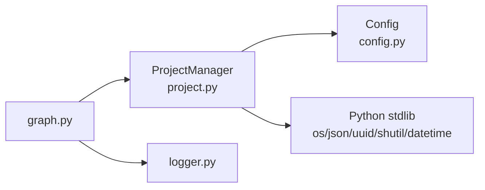

# Project Model

<cite>
**Referenced Files in This Document**
- [project.py](file://backend/app/models/project.py)
- [config.py](file://backend/app/config.py)
- [graph.py](file://backend/app/api/graph.py)
- [logger.py](file://backend/app/utils/logger.py)
</cite>

## Table of Contents
1. [Introduction](#introduction)
2. [Project Structure](#project-structure)
3. [Core Components](#core-components)
4. [Architecture Overview](#architecture-overview)
5. [Detailed Component Analysis](#detailed-component-analysis)
6. [Dependency Analysis](#dependency-analysis)
7. [Performance Considerations](#performance-considerations)
8. [Troubleshooting Guide](#troubleshooting-guide)
9. [Conclusion](#conclusion)

## Introduction
This document provides comprehensive data model documentation for the Project entity and ProjectManager class. It details the Project dataclass structure, the ProjectStatus enumeration, and the ProjectManager methods that manage the project lifecycle. It also covers file storage patterns, safe filename generation, directory organization, metadata serialization/deserialization, and error handling mechanisms. Practical examples illustrate project creation, status transitions, and persistence patterns.

## Project Structure
The project model resides in the backend application under the models package. It integrates with configuration settings for upload directories and interacts with API endpoints for lifecycle operations.

```mermaid
graph TB
subgraph "Models"
PM["ProjectManager<br/>project.py"]
P["Project<br/>project.py"]
PS["ProjectStatus<br/>project.py"]
end
subgraph "Config"
CFG["Config<br/>config.py"]
end
subgraph "API"
API["Graph API<br/>graph.py"]
end
subgraph "Utils"
LOG["Logger<br/>logger.py"]
end
PM --> P
PM --> PS
PM --> CFG
API --> PM
API --> LOG
```

**Diagram sources**
- [project.py:101-304](file://backend/app/models/project.py#L101-L304)
- [config.py:20-76](file://backend/app/config.py#L20-L76)
- [graph.py:1-200](file://backend/app/api/graph.py#L1-L200)
- [logger.py:1-127](file://backend/app/utils/logger.py#L1-L127)

**Section sources**
- [project.py:1-306](file://backend/app/models/project.py#L1-L306)
- [config.py:20-76](file://backend/app/config.py#L20-L76)

## Core Components
- Project: A dataclass representing a persistent project with metadata, file references, ontology data, graph references, configuration, and error information.
- ProjectStatus: An enumeration defining the project lifecycle states.
- ProjectManager: A class providing CRUD and file operations for projects, including safe filename generation and directory organization.

Key responsibilities:
- Project: Define schema and provide serialization/deserialization helpers.
- ProjectStatus: Enforce valid state transitions.
- ProjectManager: Persist and retrieve projects, manage file storage, and orchestrate lifecycle operations.

**Section sources**
- [project.py:17-98](file://backend/app/models/project.py#L17-L98)
- [project.py:101-304](file://backend/app/models/project.py#L101-L304)

## Architecture Overview
The Project model is part of a two-stage pipeline:
- Stage 1: Upload files and generate an ontology, transitioning the project to ONTOLOGY_GENERATED.
- Stage 2: Build a knowledge graph, transitioning to GRAPH_BUILDING and then GRAPH_COMPLETED, or FAILED on error.



**Diagram sources**
- [project.py:17-24](file://backend/app/models/project.py#L17-L24)
- [graph.py:214-235](file://backend/app/api/graph.py#L214-L235)
- [graph.py:366-369](file://backend/app/api/graph.py#L366-L369)
- [graph.py:488-502](file://backend/app/api/graph.py#L488-L502)

## Detailed Component Analysis

### Project Dataclass
The Project dataclass encapsulates all project state and metadata. It includes:
- Identity and timestamps: project_id, name, status, created_at, updated_at.
- File metadata: files (list of dictionaries with original and saved filenames, sizes), total_text_length.
- Ontology data: ontology (entity and edge types), analysis_summary.
- Graph references: graph_id, graph_build_task_id.
- Configuration: simulation_requirement, chunk_size, chunk_overlap.
- Error information: error.

Serialization and deserialization:
- to_dict(): Converts the Project instance to a dictionary suitable for JSON persistence.
- from_dict(): Creates a Project instance from a dictionary, normalizing status to ProjectStatus.

Practical usage patterns:
- Creation sets status to CREATED and timestamps to ISO format.
- After ontology generation, status transitions to ONTOLOGY_GENERATED and stores entity/relationship definitions.
- After graph building, status transitions to GRAPH_COMPLETED and stores graph identifiers.

**Section sources**
- [project.py:26-98](file://backend/app/models/project.py#L26-L98)

### ProjectStatus Enumeration
The enumeration defines five states:
- CREATED: Project created, files uploaded.
- ONTOLOGY_GENERATED: Ontology generated.
- GRAPH_BUILDING: Graph construction in progress.
- GRAPH_COMPLETED: Graph construction finished.
- FAILED: Operation failed.

These states drive UI phases and API validations.

**Section sources**
- [project.py:17-24](file://backend/app/models/project.py#L17-L24)

### ProjectManager Class
ProjectManager provides the following capabilities:

- Directory management:
  - Ensures the projects root directory exists.
  - Computes paths for project directories, metadata, files, and extracted text.

- Lifecycle methods:
  - create_project(name): Generates a unique project_id, initializes timestamps, creates directories, and persists metadata.
  - save_project(project): Updates updated_at and writes metadata to project.json.
  - get_project(project_id): Loads project metadata from disk.
  - list_projects(limit): Lists projects sorted by creation time (most recent first).
  - delete_project(project_id): Removes the project directory tree.

- File operations:
  - save_file_to_project(project_id, file_storage, original_filename): Saves uploaded files to a project’s files directory with a safe, randomized filename while preserving the original filename and size.
  - save_extracted_text(project_id, text): Writes extracted text to extracted_text.txt.
  - get_extracted_text(project_id): Reads extracted text.
  - get_project_files(project_id): Lists all stored file paths for a project.

Directory structure:
- Root: Config.UPLOAD_FOLDER/projects
- Per-project: {project_id}/project.json, {project_id}/files/, {project_id}/extracted_text.txt

Safe filename generation:
- Uses UUID-based short random prefix and preserves the original file extension.
- Prevents collisions and avoids exposing sensitive original filenames.

Error handling:
- API endpoints validate prerequisites and return structured error responses.
- Background graph build tasks set status to FAILED and capture exceptions with logs.

**Section sources**
- [project.py:101-304](file://backend/app/models/project.py#L101-L304)
- [config.py:38-41](file://backend/app/config.py#L38-L41)

### API Integration and Status Transitions
The graph API orchestrates project lifecycle:
- Ontology generation endpoint:
  - Validates inputs and uploads.
  - Extracts text and generates an ontology.
  - Sets status to ONTOLOGY_GENERATED and persists metadata.
- Graph build endpoint:
  - Validates project readiness and prevents duplicate submissions.
  - Starts a background task, sets status to GRAPH_BUILDING, and updates progress.
  - On success, sets status to GRAPH_COMPLETED; on failure, sets status to FAILED.



**Diagram sources**
- [graph.py:121-247](file://backend/app/api/graph.py#L121-L247)
- [graph.py:259-515](file://backend/app/api/graph.py#L259-L515)
- [project.py:133-165](file://backend/app/models/project.py#L133-L165)
- [project.py:168-174](file://backend/app/models/project.py#L168-L174)
- [project.py:241-272](file://backend/app/models/project.py#L241-L272)
- [project.py:275-290](file://backend/app/models/project.py#L275-L290)

## Dependency Analysis
- ProjectManager depends on:
  - Config.UPLOAD_FOLDER for storage roots.
  - Python stdlib (os, json, uuid, shutil, datetime) for filesystem operations and serialization.
- API endpoints depend on ProjectManager for persistence and on TaskManager for asynchronous operations.
- Logging is centralized via logger utilities.



**Diagram sources**
- [graph.py:1-23](file://backend/app/api/graph.py#L1-L23)
- [project.py:101-110](file://backend/app/models/project.py#L101-L110)
- [config.py:40](file://backend/app/config.py#L40)
- [logger.py:1-10](file://backend/app/utils/logger.py#L1-L10)

**Section sources**
- [project.py:101-110](file://backend/app/models/project.py#L101-L110)
- [graph.py:1-23](file://backend/app/api/graph.py#L1-L23)

## Performance Considerations
- Metadata persistence: JSON serialization is lightweight and efficient for small to medium-sized project metadata.
- File storage: Using UUID-based filenames avoids collisions and simplifies cleanup.
- Directory layout: Flat per-project files directory reduces filesystem overhead.
- Asynchronous graph builds: Offloads heavy computation to background threads, keeping API responses responsive.

## Troubleshooting Guide
Common issues and remedies:
- Project not found:
  - Verify project_id correctness and existence in the projects directory.
  - Check that project.json exists inside the project directory.
- Missing extracted text:
  - Confirm that save_extracted_text was invoked and that extracted_text.txt exists.
- Duplicate graph build requests:
  - The API enforces a guard against concurrent builds; use the reset endpoint to force a rebuild if needed.
- File upload failures:
  - Ensure the file extension is allowed and the upload size is within limits.
- Status inconsistencies:
  - Use the reset endpoint to revert to a valid state for reprocessing.

Operational logging:
- The logger module configures rotating file handlers and UTF-8 console output to aid diagnostics.

**Section sources**
- [graph.py:316-327](file://backend/app/api/graph.py#L316-L327)
- [graph.py:88-116](file://backend/app/api/graph.py#L88-L116)
- [logger.py:30-88](file://backend/app/utils/logger.py#L30-L88)

## Conclusion
The Project model and ProjectManager provide a robust foundation for managing project lifecycles, persisting metadata, and organizing file storage. The explicit ProjectStatus enumeration and API-driven transitions ensure predictable behavior across stages. Safe filename generation and clear directory layouts simplify maintenance and reduce operational risk. The combination of synchronous metadata persistence and asynchronous background processing delivers a scalable solution for knowledge graph construction.