# Task Model

<cite>
**Referenced Files in This Document**
- [task.py](file://backend/app/models/task.py)
- [graph.py](file://backend/app/api/graph.py)
- [simulation.py](file://backend/app/api/simulation.py)
- [graph_builder.py](file://backend/app/services/graph_builder.py)
- [simulation_manager.py](file://backend/app/services/simulation_manager.py)
- [retry.py](file://backend/app/utils/retry.py)
- [graph.js](file://frontend/src/api/graph.js)
- [simulation.js](file://frontend/src/api/simulation.js)
- [Step2EnvSetup.vue](file://frontend/src/components/Step2EnvSetup.vue)
- [Step3Simulation.vue](file://frontend/src/components/Step3Simulation.vue)
- [SimulationRunView.vue](file://frontend/src/views/SimulationRunView.vue)
</cite>

## Table of Contents
1. [Introduction](#introduction)
2. [Project Structure](#project-structure)
3. [Core Components](#core-components)
4. [Architecture Overview](#architecture-overview)
5. [Detailed Component Analysis](#detailed-component-analysis)
6. [Dependency Analysis](#dependency-analysis)
7. [Performance Considerations](#performance-considerations)
8. [Troubleshooting Guide](#troubleshooting-guide)
9. [Conclusion](#conclusion)
10. [Appendices](#appendices)

## Introduction
This document defines the Task entity used for asynchronous operation tracking and status management across the system. It covers the data model, lifecycle, queue integration patterns, polling mechanisms, error handling, and practical usage examples for graph building, simulation preparation, and report generation.

## Project Structure
The Task model is implemented in the backend models layer and is consumed by API endpoints and services. Frontend components poll task status via API clients to provide real-time updates.

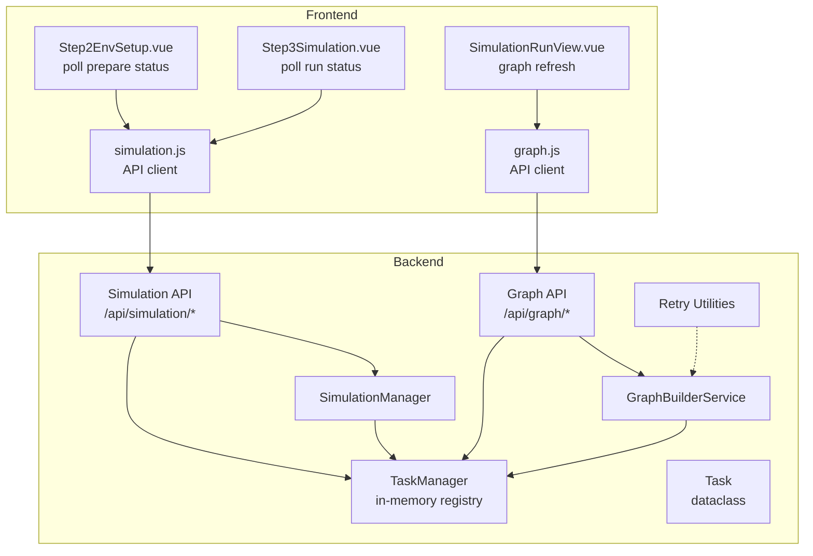

**Diagram sources**
- [task.py:22-185](file://backend/app/models/task.py#L22-L185)
- [graph.py:527-558](file://backend/app/api/graph.py#L527-L558)
- [simulation.py:380-729](file://backend/app/api/simulation.py#L380-L729)
- [graph_builder.py:49-92](file://backend/app/services/graph_builder.py#L49-L92)
- [simulation_manager.py:114-137](file://backend/app/services/simulation_manager.py#L114-L137)
- [graph.js:36-46](file://frontend/src/api/graph.js#L36-L46)
- [simulation.js:15-25](file://frontend/src/api/simulation.js#L15-L25)
- [Step2EnvSetup.vue:846-906](file://frontend/src/components/Step2EnvSetup.vue#L846-L906)
- [Step3Simulation.vue:489-531](file://frontend/src/components/Step3Simulation.vue#L489-L531)
- [SimulationRunView.vue:170-185](file://frontend/src/views/SimulationRunView.vue#L170-L185)

**Section sources**
- [task.py:22-185](file://backend/app/models/task.py#L22-L185)
- [graph.py:527-558](file://backend/app/api/graph.py#L527-L558)
- [simulation.py:380-729](file://backend/app/api/simulation.py#L380-L729)

## Core Components
- Task: Immutable data structure representing a single asynchronous operation with fields for identity, classification, status, timing, progress, messaging, results, errors, metadata, and detailed progress.
- TaskManager: Thread-safe singleton managing task creation, updates, completion, failure, listing, and cleanup.

Key fields and semantics:
- task_id: Unique identifier for the task.
- task_type: Classification of the task (e.g., graph_build, simulation_prepare).
- status: Lifecycle state drawn from TaskStatus (pending, processing, completed, failed).
- progress: Integer percentage (0–100) indicating completion.
- progress_detail: Structured object describing current stage, indices, and item-level details.
- message: Human-readable status message.
- result: Arbitrary structured result payload.
- error: Error string populated on failure.
- metadata: Free-form key-value bag for auxiliary data.
- created_at, updated_at: ISO timestamps for lifecycle tracking.

**Section sources**
- [task.py:14-51](file://backend/app/models/task.py#L14-L51)
- [task.py:54-185](file://backend/app/models/task.py#L54-L185)

## Architecture Overview
Tasks are created by API endpoints or services, executed asynchronously, and updated with progress and outcomes. Frontend components poll task status endpoints to render progress and trigger downstream actions.

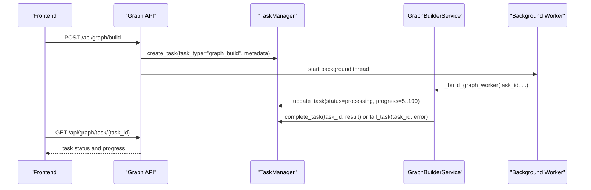

**Diagram sources**
- [graph.py:259-523](file://backend/app/api/graph.py#L259-L523)
- [graph_builder.py:51-184](file://backend/app/services/graph_builder.py#L51-L184)
- [task.py:73-162](file://backend/app/models/task.py#L73-L162)

## Detailed Component Analysis

### Task Data Model
The Task dataclass encapsulates all observable attributes of an asynchronous job. It is serialized to a dictionary for transport and persistence in memory.

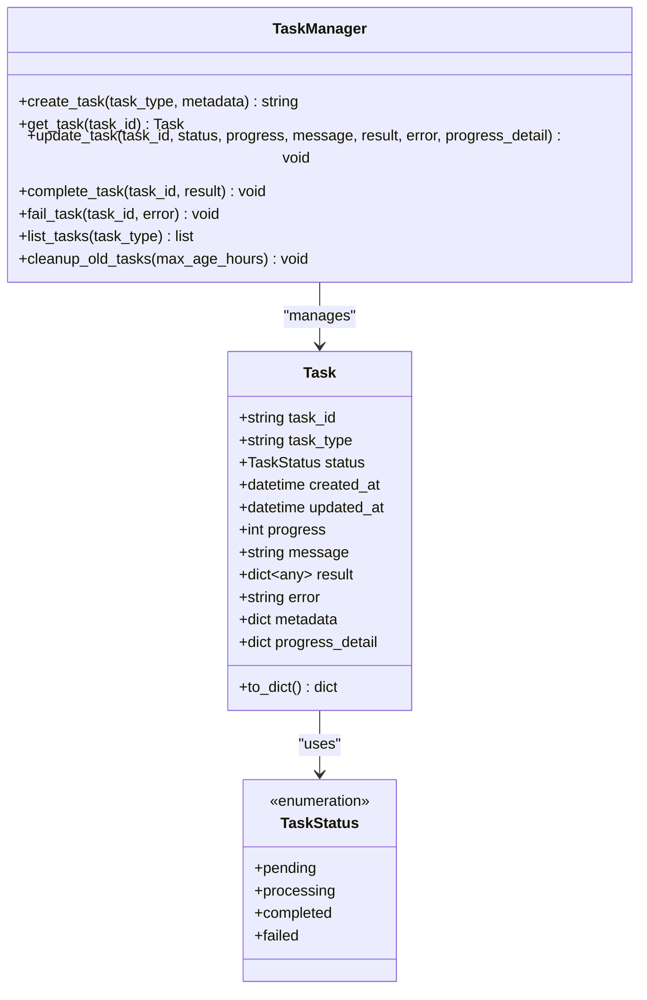

**Diagram sources**
- [task.py:14-185](file://backend/app/models/task.py#L14-L185)

**Section sources**
- [task.py:22-51](file://backend/app/models/task.py#L22-L51)
- [task.py:54-185](file://backend/app/models/task.py#L54-L185)

### Task Lifecycle
Lifecycle transitions:
- Creation: API or service creates a task with status pending.
- Execution: Worker updates status to processing and increments progress.
- Completion: On success, status becomes completed with result; on failure, status becomes failed with error.
- Cleanup: Old completed/failed tasks are removed after retention.

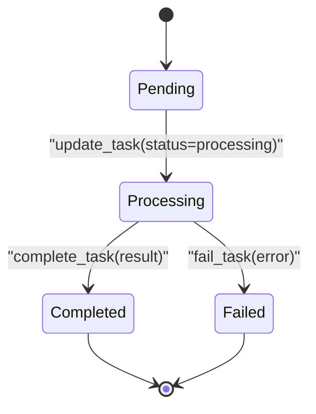

**Diagram sources**
- [task.py:106-162](file://backend/app/models/task.py#L106-L162)

**Section sources**
- [task.py:106-162](file://backend/app/models/task.py#L106-L162)

### Task Queue Integration Patterns
- In-process background threads: Graph build and simulation preparation spawn daemon threads to run workers and periodically update task state.
- File-based IPC (external scripts): Simulation runners poll command/response directories to coordinate with external Python scripts. While not a traditional queue, it provides similar asynchronous coordination.

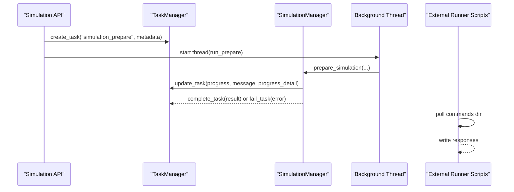

**Diagram sources**
- [simulation.py:380-616](file://backend/app/api/simulation.py#L380-L616)
- [simulation_manager.py:228-456](file://backend/app/services/simulation_manager.py#L228-L456)
- [run_parallel_simulation.py:256-277](file://backend/scripts/run_parallel_simulation.py#L256-L277)
- [run_twitter_simulation.py:170-191](file://backend/scripts/run_twitter_simulation.py#L170-L191)
- [run_reddit_simulation.py:170-191](file://backend/scripts/run_reddit_simulation.py#L170-L191)

**Section sources**
- [graph.py:372-506](file://backend/app/api/graph.py#L372-L506)
- [simulation.py:486-589](file://backend/app/api/simulation.py#L486-L589)
- [simulation_manager.py:228-456](file://backend/app/services/simulation_manager.py#L228-L456)

### Polling Mechanisms for Real-Time Updates
Frontend components poll task status endpoints at intervals to reflect progress and trigger navigation or UI updates.

- Step 2 Environment Setup: Polls preparation status using task_id or simulation_id, updates progress bar and detailed logs.
- Step 3 Simulation: Polls run status to track platform rounds and completion.
- Graph Data Refresh: Periodic refresh of graph data during simulation runs.

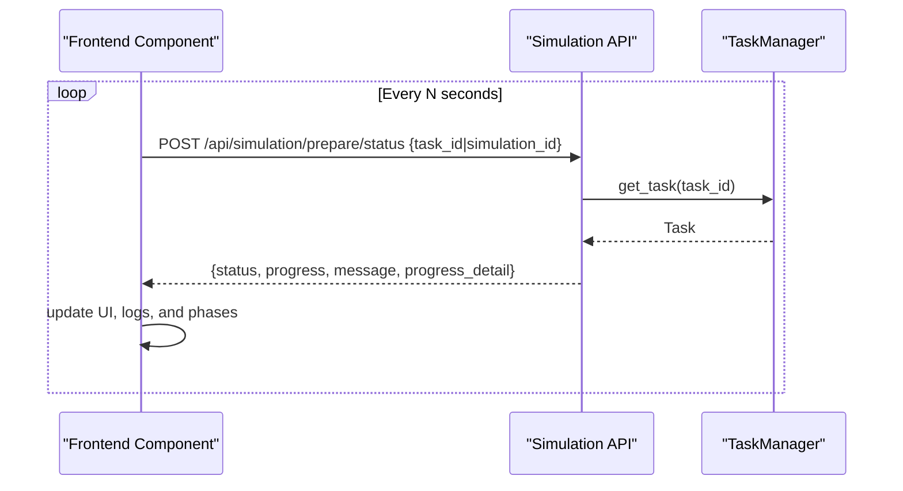

**Diagram sources**
- [Step2EnvSetup.vue:846-906](file://frontend/src/components/Step2EnvSetup.vue#L846-L906)
- [simulation.js:23-25](file://frontend/src/api/simulation.js#L23-L25)
- [simulation.py:619-729](file://backend/app/api/simulation.py#L619-L729)

**Section sources**
- [Step2EnvSetup.vue:846-906](file://frontend/src/components/Step2EnvSetup.vue#L846-L906)
- [Step3Simulation.vue:489-531](file://frontend/src/components/Step3Simulation.vue#L489-L531)
- [SimulationRunView.vue:170-185](file://frontend/src/views/SimulationRunView.vue#L170-L185)
- [simulation.js:23-25](file://frontend/src/api/simulation.js#L23-L25)

### Examples

#### Graph Building
- Creation: API endpoint creates a task of type graph_build and starts a background thread.
- Execution: Worker updates progress from 5% to 100% with messages and detailed progress.
- Result: On completion, result includes graph_id, node/edge counts, and chunk statistics.

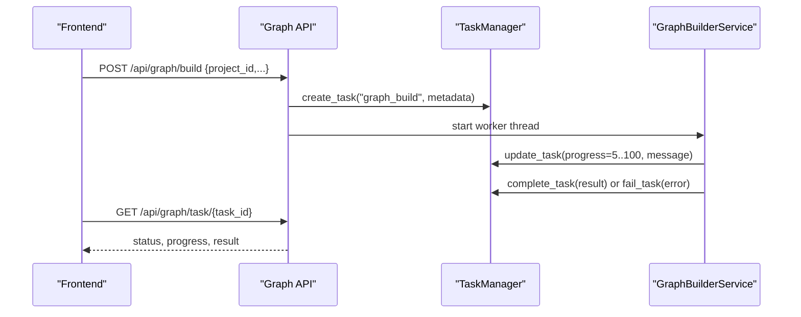

**Diagram sources**
- [graph.py:259-523](file://backend/app/api/graph.py#L259-L523)
- [graph_builder.py:51-184](file://backend/app/services/graph_builder.py#L51-L184)
- [task.py:145-162](file://backend/app/models/task.py#L145-L162)

**Section sources**
- [graph.py:259-523](file://backend/app/api/graph.py#L259-L523)
- [graph_builder.py:51-184](file://backend/app/services/graph_builder.py#L51-L184)

#### Simulation Preparation
- Creation: API creates a task of type simulation_prepare with metadata including simulation_id and project_id.
- Execution: Manager updates progress across stages (reading, generating profiles, generating config, copying scripts) with detailed progress.
- Result: On completion, result contains simplified simulation state.

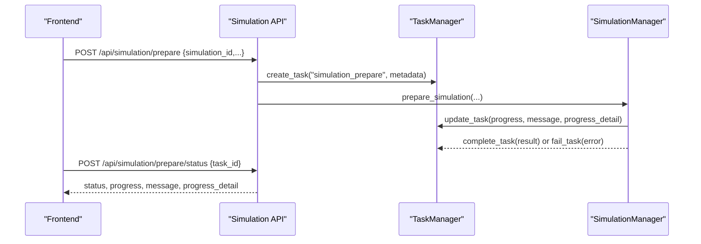

**Diagram sources**
- [simulation.py:380-616](file://backend/app/api/simulation.py#L380-L616)
- [simulation_manager.py:228-456](file://backend/app/services/simulation_manager.py#L228-L456)
- [task.py:145-162](file://backend/app/models/task.py#L145-L162)

**Section sources**
- [simulation.py:380-616](file://backend/app/api/simulation.py#L380-L616)
- [simulation_manager.py:228-456](file://backend/app/services/simulation_manager.py#L228-L456)

#### Report Generation
- Creation: Report generation is initiated via API; the backend writes agent logs and console logs to disk and updates status.
- Monitoring: Frontend polls agent_log.jsonl and console_log.txt to render live updates and detect completion.

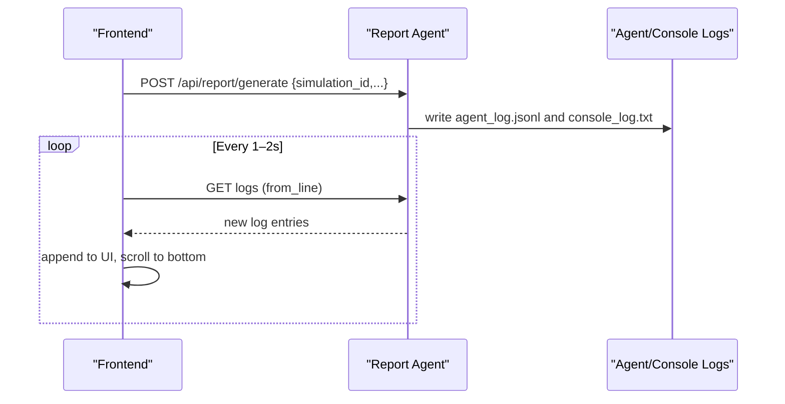

**Diagram sources**
- [report_agent.py:35-304](file://backend/app/services/report_agent.py#L35-L304)
- [Step4Report.vue:2040-2183](file://frontend/src/components/Step4Report.vue#L2040-L2183)

**Section sources**
- [report_agent.py:35-304](file://backend/app/services/report_agent.py#L35-L304)
- [Step4Report.vue:2040-2183](file://frontend/src/components/Step4Report.vue#L2040-L2183)

### Error Handling and Retry Mechanisms
- Task-level error handling: Workers wrap execution in try/catch and call fail_task with error details.
- External API retry: Utility decorators and clients provide exponential backoff with jitter and configurable exceptions.

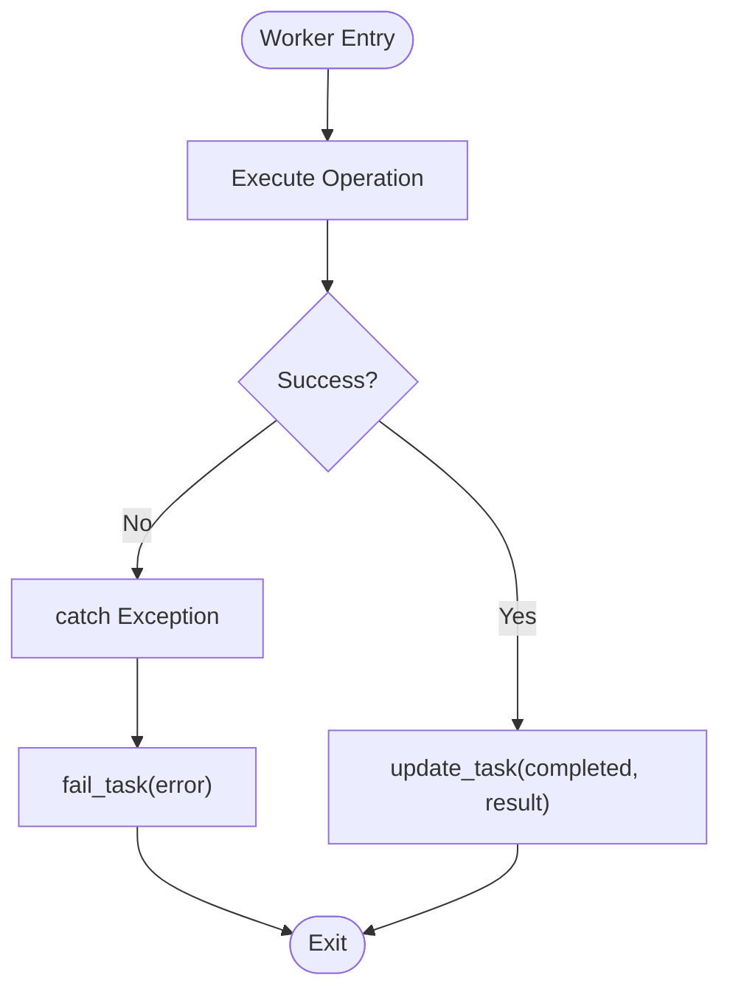

**Diagram sources**
- [graph_builder.py:180-184](file://backend/app/services/graph_builder.py#L180-L184)
- [simulation.py:576-586](file://backend/app/api/simulation.py#L576-L586)
- [retry.py:15-77](file://backend/app/utils/retry.py#L15-L77)

**Section sources**
- [graph_builder.py:180-184](file://backend/app/services/graph_builder.py#L180-L184)
- [simulation.py:576-586](file://backend/app/api/simulation.py#L576-L586)
- [retry.py:15-77](file://backend/app/utils/retry.py#L15-L77)

### Task Prioritization and Concurrent Execution
- Prioritization: No explicit priority queue is implemented. Tasks are ordered by creation time in listings.
- Concurrency: Multiple background threads can run concurrently; TaskManager uses a lock to ensure thread safety. External runners coordinate via file-based IPC rather than a shared queue.

**Section sources**
- [task.py:60-71](file://backend/app/models/task.py#L60-L71)
- [task.py:164-170](file://backend/app/models/task.py#L164-L170)
- [run_parallel_simulation.py:256-277](file://backend/scripts/run_parallel_simulation.py#L256-L277)

## Dependency Analysis
- TaskManager depends on threading locks and stores tasks in memory.
- APIs depend on TaskManager for status queries and updates.
- Services depend on TaskManager to report progress and outcomes.
- Frontend depends on API clients to poll status and drive UI updates.

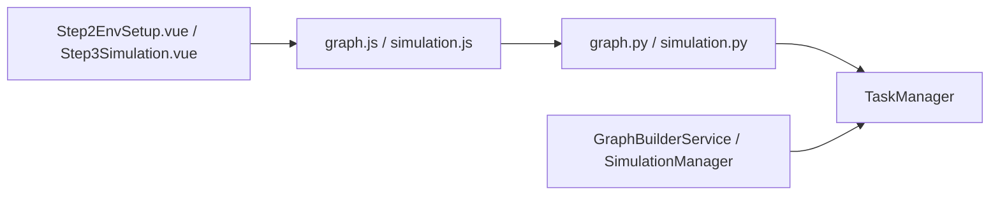

**Diagram sources**
- [graph.js:36-46](file://frontend/src/api/graph.js#L36-L46)
- [simulation.js:23-25](file://frontend/src/api/simulation.js#L23-L25)
- [graph.py:527-558](file://backend/app/api/graph.py#L527-L558)
- [simulation.py:619-729](file://backend/app/api/simulation.py#L619-L729)
- [task.py:54-185](file://backend/app/models/task.py#L54-L185)

**Section sources**
- [graph.py:527-558](file://backend/app/api/graph.py#L527-L558)
- [simulation.py:619-729](file://backend/app/api/simulation.py#L619-L729)
- [task.py:54-185](file://backend/app/models/task.py#L54-L185)

## Performance Considerations
- Prefer coarse-grained progress updates to reduce API traffic and database overhead.
- Use progress_detail to communicate stage-level granularity without frequent polling.
- Clean up old tasks periodically to prevent memory bloat.
- For long-running tasks, consider batching updates to minimize contention under thread locks.

[No sources needed since this section provides general guidance]

## Troubleshooting Guide
Common issues and remedies:
- Task not found: Ensure the correct task_id is used; verify task creation succeeded.
- Stuck at pending/processing: Check backend logs for worker thread exceptions; confirm TaskManager is reachable.
- Frequent polling overhead: Adjust polling intervals in frontend components; consolidate polling where possible.
- External runner not responding: Verify command/response directories exist and are writable; check runner status files.

**Section sources**
- [graph.py:527-558](file://backend/app/api/graph.py#L527-L558)
- [simulation.py:619-729](file://backend/app/api/simulation.py#L619-L729)
- [Step2EnvSetup.vue:846-906](file://frontend/src/components/Step2EnvSetup.vue#L846-L906)
- [Step3Simulation.vue:489-531](file://frontend/src/components/Step3Simulation.vue#L489-L531)

## Conclusion
The Task model provides a robust foundation for asynchronous operation tracking across graph building, simulation preparation, and report generation. With thread-safe management, structured progress reporting, and straightforward polling patterns, it enables responsive frontends and reliable backend orchestration.

[No sources needed since this section summarizes without analyzing specific files]

## Appendices

### Task API Endpoints
- Query task status: GET /api/graph/task/{task_id}
- List tasks: GET /api/graph/tasks
- Query preparation status: POST /api/simulation/prepare/status

**Section sources**
- [graph.py:527-558](file://backend/app/api/graph.py#L527-L558)
- [simulation.py:619-729](file://backend/app/api/simulation.py#L619-L729)