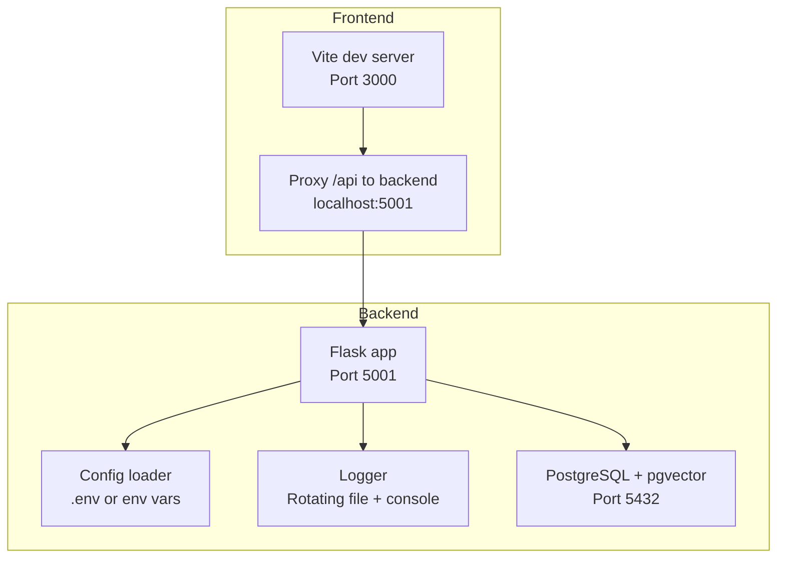
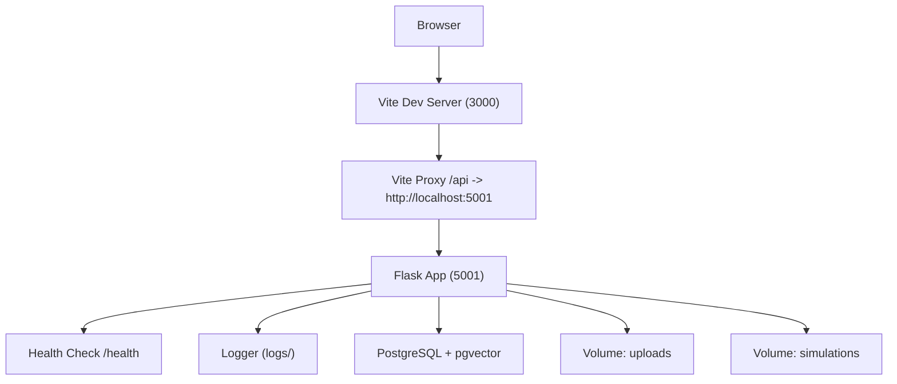
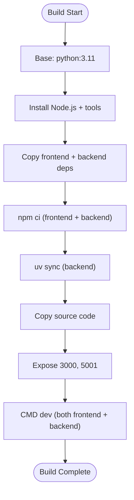
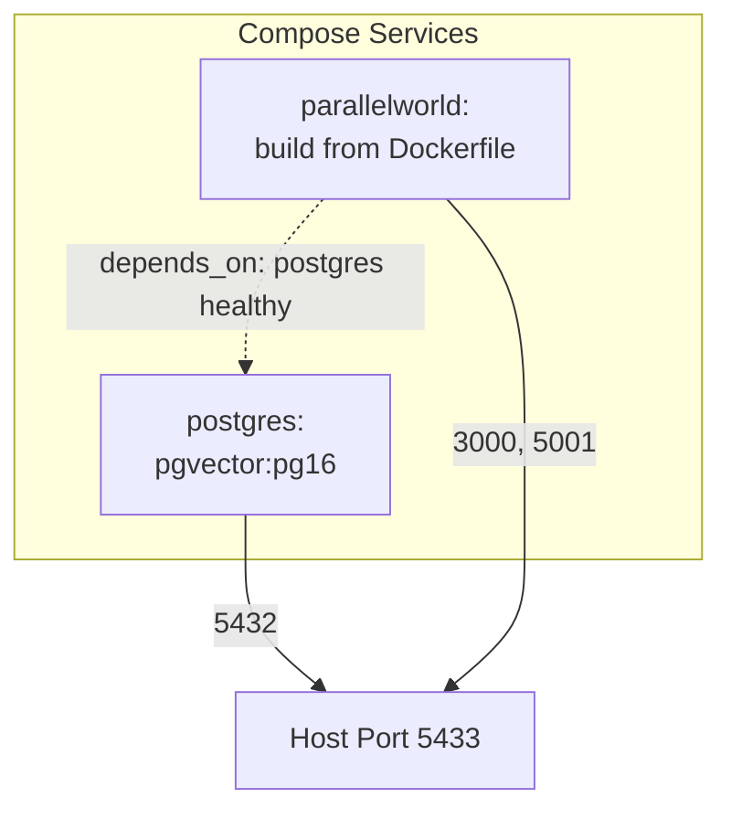
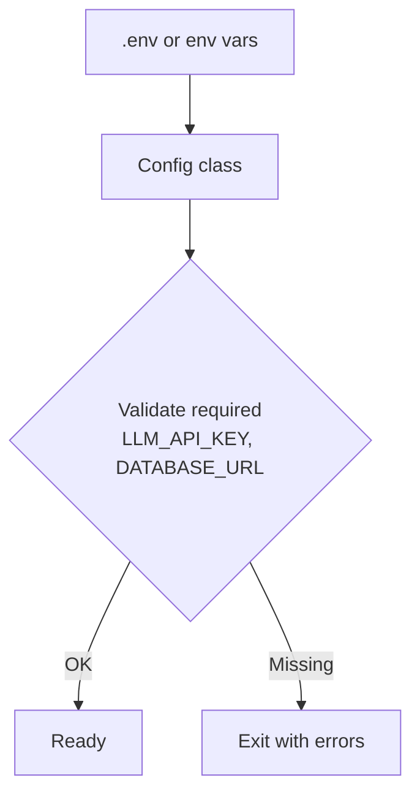
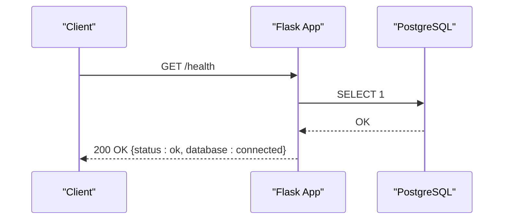
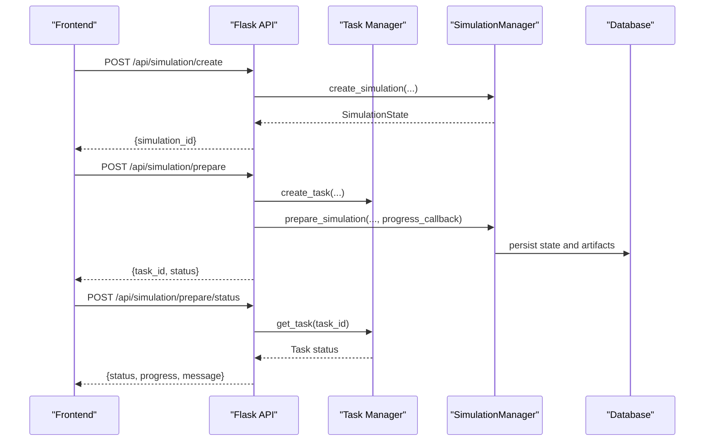
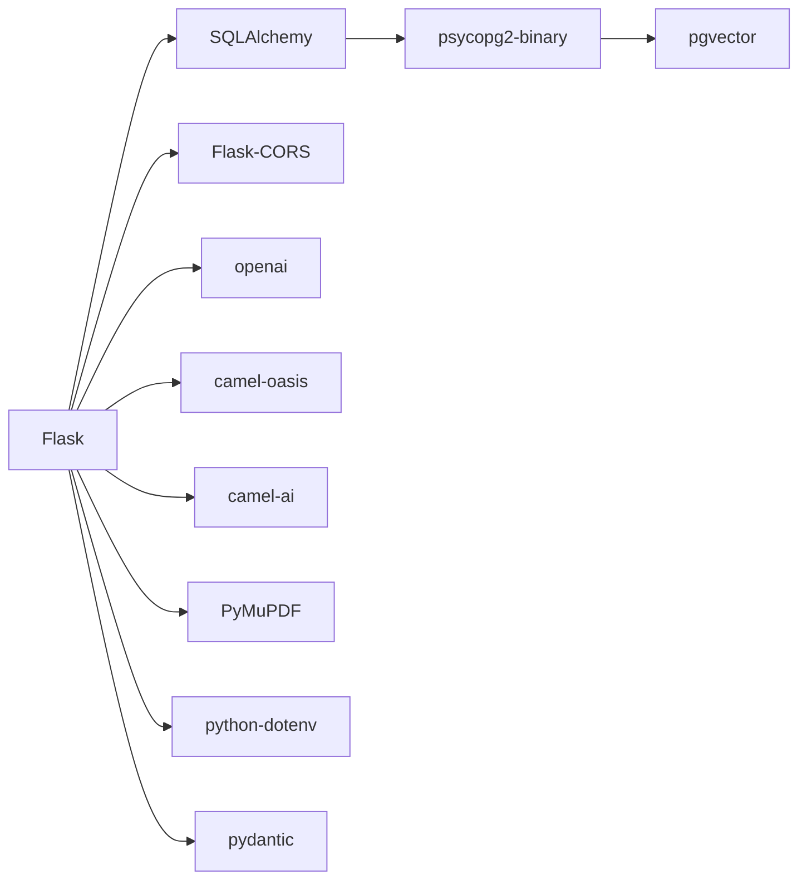
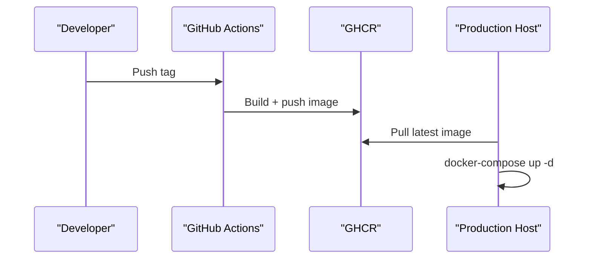

# Deployment and Operations

<cite>
**Referenced Files in This Document**
- [Dockerfile](file://Dockerfile)
- [docker-compose.yml](file://docker-compose.yml)
- [.github/workflows/docker-image.yml](file://.github/workflows/docker-image.yml)
- [backend/pyproject.toml](file://backend/pyproject.toml)
- [backend/requirements.txt](file://backend/requirements.txt)
- [backend/app/config.py](file://backend/app/config.py)
- [backend/run.py](file://backend/run.py)
- [backend/app/__init__.py](file://backend/app/__init__.py)
- [backend/app/utils/logger.py](file://backend/app/utils/logger.py)
- [backend/app/models/graph_db.py](file://backend/app/models/graph_db.py)
- [backend/app/api/graph.py](file://backend/app/api/graph.py)
- [backend/app/api/simulation.py](file://backend/app/api/simulation.py)
- [backend/app/services/simulation_manager.py](file://backend/app/services/simulation_manager.py)
- [frontend/vite.config.js](file://frontend/vite.config.js)
- [frontend/package.json](file://frontend/package.json)
</cite>

## Table of Contents
1. [Introduction](#introduction)
2. [Project Structure](#project-structure)
3. [Core Components](#core-components)
4. [Architecture Overview](#architecture-overview)
5. [Detailed Component Analysis](#detailed-component-analysis)
6. [Dependency Analysis](#dependency-analysis)
7. [Performance Considerations](#performance-considerations)
8. [Monitoring and Logging](#monitoring-and-logging)
9. [Scaling Strategies](#scaling-strategies)
10. [Backup and Recovery](#backup-and-recovery)
11. [Security Hardening and Access Control](#security-hardening-and-access-control)
12. [Production Deployment Process](#production-deployment-process)
13. [Maintenance and Updates](#maintenance-and-updates)
14. [Capacity Planning and Cost Optimization](#capacity-planning-and-cost-optimization)
15. [Troubleshooting Guide](#troubleshooting-guide)
16. [Conclusion](#conclusion)

## Introduction
This document provides comprehensive deployment and operations guidance for the Parallel World application. It covers Docker-based multi-stage container builds, image optimization, service orchestration with docker-compose, monitoring and logging strategies, scaling for concurrent simulations and large-scale knowledge graph operations, backup and recovery procedures, security hardening, network configuration, access control, operational procedures, and capacity planning with cost optimization strategies.

## Project Structure
The repository follows a clear separation of concerns:
- Frontend: Vue-based SPA served by Vite, proxied to the backend API.
- Backend: Flask application with modular services for graph building, simulation management, and reporting.
- DevOps: Dockerfile for multi-stage builds, docker-compose for local orchestration, and GitHub Actions for CI/CD image publishing.

**Diagram sources**
- [frontend/vite.config.js:1-19](file://frontend/vite.config.js#L1-L19)
- [backend/app/__init__.py:20-99](file://backend/app/__init__.py#L20-L99)
- [backend/app/config.py:20-76](file://backend/app/config.py#L20-L76)
- [backend/app/utils/logger.py:30-88](file://backend/app/utils/logger.py#L30-L88)
- [docker-compose.yml:1-38](file://docker-compose.yml#L1-L38)

**Section sources**
- [Dockerfile:1-30](file://Dockerfile#L1-L30)
- [docker-compose.yml:1-38](file://docker-compose.yml#L1-L38)
- [frontend/vite.config.js:1-19](file://frontend/vite.config.js#L1-L19)
- [backend/app/__init__.py:20-99](file://backend/app/__init__.py#L20-L99)

## Core Components
- Containerization: Multi-stage build installs Node.js and uv, copies dependency lock files, installs frontend and backend dependencies, exposes ports, and starts dev servers.
- Orchestration: docker-compose defines Postgres with health checks and the application service with volume mounts and environment overrides.
- Backend configuration: Centralized configuration loader supporting .env and environment variables, with strict validation and defaults.
- Logging: Unified logger with rotating file handler and console handler, ensuring UTF-8 output and structured logs.
- Database: SQLAlchemy engine with connection pooling and pre-ping, backed by PostgreSQL with pgvector support.
- APIs: Graph and simulation endpoints with asynchronous task management and health checks.

**Section sources**
- [Dockerfile:1-30](file://Dockerfile#L1-L30)
- [docker-compose.yml:1-38](file://docker-compose.yml#L1-L38)
- [backend/app/config.py:20-76](file://backend/app/config.py#L20-L76)
- [backend/app/utils/logger.py:30-88](file://backend/app/utils/logger.py#L30-L88)
- [backend/app/models/graph_db.py:113-151](file://backend/app/models/graph_db.py#L113-L151)
- [backend/app/__init__.py:83-93](file://backend/app/__init__.py#L83-L93)

## Architecture Overview
The system consists of:
- Frontend SPA (Vite) with API proxy to backend.
- Backend Flask app exposing graph and simulation APIs, with health checks and request/response logging.
- PostgreSQL with pgvector extension for vector similarity and graph storage.
- Shared volumes for uploads and simulation data.

**Diagram sources**
- [frontend/vite.config.js:7-17](file://frontend/vite.config.js#L7-L17)
- [backend/app/__init__.py:83-93](file://backend/app/__init__.py#L83-L93)
- [backend/app/utils/logger.py:27-88](file://backend/app/utils/logger.py#L27-L88)
- [docker-compose.yml:11-35](file://docker-compose.yml#L11-L35)

## Detailed Component Analysis

### Container Build and Image Optimization
- Multi-stage build strategy:
  - Installs Node.js and necessary tools.
  - Copies and installs frontend dependencies using npm ci.
  - Copies backend dependency files and installs Python dependencies using uv sync.
  - Copies source code and exposes ports 3000 and 5001.
  - Starts both frontend and backend in development mode.
- Optimization opportunities:
  - Separate production and development CMD entries.
  - Multi-stage build to reduce final image size.
  - Pin uv version and use frozen installs for reproducibility.

**Diagram sources**
- [Dockerfile:1-30](file://Dockerfile#L1-L30)

**Section sources**
- [Dockerfile:1-30](file://Dockerfile#L1-L30)

### Service Orchestration with docker-compose
- Services:
  - Postgres: named container, environment variables for credentials, exposed port mapping, health check using pg_isready, persistent volume, restart policy.
  - Application: builds from Dockerfile, env_file support, port mappings, restart policy, bind mount for uploads, depends_on with health check.
- Recommendations:
  - Use external networks for isolation.
  - Add resource limits and restart policies aligned with production needs.
  - Configure secrets for sensitive environment variables.

**Diagram sources**
- [docker-compose.yml:2-35](file://docker-compose.yml#L2-L35)

**Section sources**
- [docker-compose.yml:1-38](file://docker-compose.yml#L1-L38)

### Backend Configuration and Validation
- Loads .env from project root or environment variables.
- Provides defaults for keys and validates required values (LLM API key and database URL).
- Exposes configuration for LLM, database, uploads, text processing, simulation, and report agent.

**Diagram sources**
- [backend/app/config.py:9-76](file://backend/app/config.py#L9-L76)

**Section sources**
- [backend/app/config.py:9-76](file://backend/app/config.py#L9-L76)

### Logging and Health Checks
- Logger:
  - Creates logs directory, sets up rotating file handler and console handler.
  - Ensures UTF-8 output on Windows, structured formatting.
- Health check:
  - Flask route performs a simple SELECT 1 against the database to confirm connectivity.

**Diagram sources**
- [backend/app/__init__.py:83-93](file://backend/app/__init__.py#L83-L93)

**Section sources**
- [backend/app/utils/logger.py:30-88](file://backend/app/utils/logger.py#L30-L88)
- [backend/app/__init__.py:83-93](file://backend/app/__init__.py#L83-L93)

### Graph and Simulation APIs
- Graph API:
  - Project lifecycle management, file upload and parsing, ontology generation, graph building with progress tracking.
- Simulation API:
  - Simulation creation, preparation (async), status polling, and run instructions.
- Both APIs integrate with task managers and logging for observability.

**Diagram sources**
- [backend/app/api/simulation.py:146-617](file://backend/app/api/simulation.py#L146-L617)
- [backend/app/services/simulation_manager.py:193-457](file://backend/app/services/simulation_manager.py#L193-L457)

**Section sources**
- [backend/app/api/graph.py:121-523](file://backend/app/api/graph.py#L121-L523)
- [backend/app/api/simulation.py:146-617](file://backend/app/api/simulation.py#L146-L617)
- [backend/app/services/simulation_manager.py:193-457](file://backend/app/services/simulation_manager.py#L193-L457)

## Dependency Analysis
- Backend dependencies:
  - Flask, Flask-CORS, SQLAlchemy, psycopg2-binary, pgvector, OpenAI SDK, camel-oasis, camel-ai, PyMuPDF, charset-normalizer, chardet, python-dotenv, pydantic.
- Frontend dependencies:
  - Vue, Vue Router, Axios, D3, Vite, @vitejs/plugin-vue.
- Build system:
  - pyproject.toml with hatchling build backend and dependency groups.

**Diagram sources**
- [backend/pyproject.toml:11-37](file://backend/pyproject.toml#L11-L37)

**Section sources**
- [backend/pyproject.toml:11-37](file://backend/pyproject.toml#L11-L37)
- [backend/requirements.txt:9-36](file://backend/requirements.txt#L9-L36)
- [frontend/package.json:11-21](file://frontend/package.json#L11-L21)

## Performance Considerations
- Database connection pooling:
  - Engine configured with pool_size and max_overflow, pre-ping enabled for reliability.
- Async operations:
  - Graph building and simulation preparation use background threads and task managers to avoid blocking requests.
- Frontend proxy:
  - Vite proxy targets backend on localhost:5001 to minimize cross-origin overhead.
- Recommendations:
  - Tune pool_size and max_overflow based on workload.
  - Use Gunicorn or similar WSGI server for production backend.
  - Enable compression and caching headers in reverse proxy.

**Section sources**
- [backend/app/models/graph_db.py:113-122](file://backend/app/models/graph_db.py#L113-L122)
- [backend/app/api/graph.py:372-506](file://backend/app/api/graph.py#L372-L506)
- [frontend/vite.config.js:7-17](file://frontend/vite.config.js#L7-L17)

## Monitoring and Logging
- Logging:
  - Rotating file logs with detailed formatter and console handler with INFO level.
  - UTF-8 output handling for Windows consoles.
- Health checks:
  - Backend exposes /health endpoint performing a database ping.
- Recommendations:
  - Integrate structured logging with JSON format for centralized log collection.
  - Add Prometheus metrics for request latency, throughput, and error rates.
  - Set up alerting for failing health checks and slow queries.

**Section sources**
- [backend/app/utils/logger.py:30-88](file://backend/app/utils/logger.py#L30-L88)
- [backend/app/__init__.py:83-93](file://backend/app/__init__.py#L83-L93)

## Scaling Strategies
- Horizontal scaling:
  - Stateless backend can be scaled behind a load balancer; ensure shared storage for uploads and simulation data.
- Concurrency:
  - Use multiple worker processes or containers; separate simulation runner processes if needed.
- Database scaling:
  - Consider read replicas for heavy read workloads; optimize queries and indexes.
- Recommendations:
  - Use Kubernetes for orchestration with HPA based on CPU/memory or custom metrics.
  - Implement queue-based simulation execution for bursty loads.

[No sources needed since this section provides general guidance]

## Backup and Recovery
- Data locations:
  - PostgreSQL data stored in named volume postgres_data.
  - Simulation artifacts and uploads persisted in mounted volumes.
- Procedures:
  - Regularly back up postgres_data volume and application data directories.
  - Use logical backups (e.g., pg_dump) for database and tar archives for file volumes.
  - Test restoration in isolated environment before production restore.

**Section sources**
- [docker-compose.yml:11-17](file://docker-compose.yml#L11-L17)
- [docker-compose.yml:31-35](file://docker-compose.yml#L31-L35)

## Security Hardening and Access Control
- Network configuration:
  - Limit published ports; use internal networks for inter-service communication.
- Secrets management:
  - Store LLM_API_KEY, database credentials, and other secrets in environment files or secret stores.
- Access control:
  - Enforce CORS policies on backend; consider API keys or OAuth for frontend authentication.
- Recommendations:
  - Run containers with non-root user and minimal capabilities.
  - Enable HTTPS termination at reverse proxy or ingress controller.
  - Restrict inbound traffic to necessary ports only.

[No sources needed since this section provides general guidance]

## Production Deployment Process
- Build and publish:
  - GitHub Actions workflow builds and pushes Docker image to GHCR with semantic tags.
- Local production:
  - Use docker-compose with env_file for secrets and persistent volumes.
- Recommendations:
  - Use environment-specific compose files and override settings.
  - Automate deployments with CI/CD pipelines.

**Diagram sources**
- [.github/workflows/docker-image.yml:13-50](file://.github/workflows/docker-image.yml#L13-L50)

**Section sources**
- [.github/workflows/docker-image.yml:1-50](file://.github/workflows/docker-image.yml#L1-L50)
- [docker-compose.yml:20-35](file://docker-compose.yml#L20-L35)

## Maintenance and Updates
- Routine tasks:
  - Monitor health checks and logs; rotate and archive logs regularly.
  - Update dependencies per backend/pyproject.toml and frontend/package.json.
- Rollout strategy:
  - Blue-green or rolling updates; drain connections before restart.
- Recommendations:
  - Keep PostgreSQL and pgvector versions aligned with compatibility.
  - Validate simulation artifacts and uploads after upgrades.

[No sources needed since this section provides general guidance]

## Capacity Planning and Cost Optimization
- Resource sizing:
  - Estimate CPU and memory based on graph size, chunk counts, and concurrent simulation runs.
  - Provision adequate disk space for uploads and simulation data.
- Cost optimization:
  - Use reserved instances or spot instances for non-critical workloads.
  - Right-size containers and enable auto-scaling.
  - Archive old simulation results to reduce storage costs.

[No sources needed since this section provides general guidance]

## Troubleshooting Guide
- Common issues:
  - Database connectivity failures: verify DATABASE_URL and Postgres health checks.
  - Missing .env or secrets: ensure required environment variables are present.
  - Slow graph or simulation operations: inspect logs and adjust chunk sizes or parallelism.
- Debugging steps:
  - Check backend logs in logs/ directory.
  - Verify /health endpoint status.
  - Confirm volume mounts for uploads and simulation data.

**Section sources**
- [backend/app/config.py:67-74](file://backend/app/config.py#L67-L74)
- [backend/app/__init__.py:83-93](file://backend/app/__init__.py#L83-L93)
- [backend/app/utils/logger.py:27-88](file://backend/app/utils/logger.py#L27-L88)

## Conclusion
This guide outlines a robust deployment and operations strategy for Parallel World, covering containerization, orchestration, monitoring, scaling, backup, security, and maintenance. By following these practices, teams can reliably run the simulation engine at scale while maintaining performance, availability, and cost efficiency.