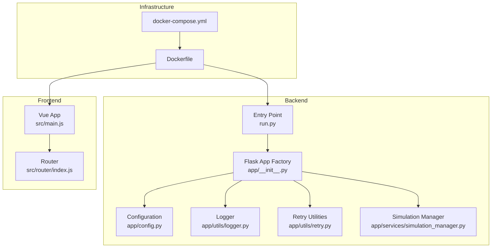
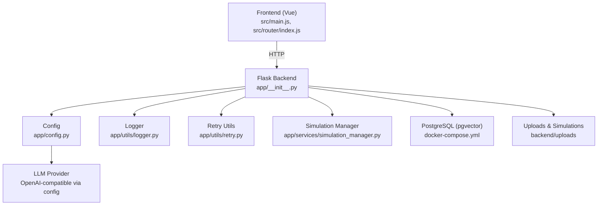
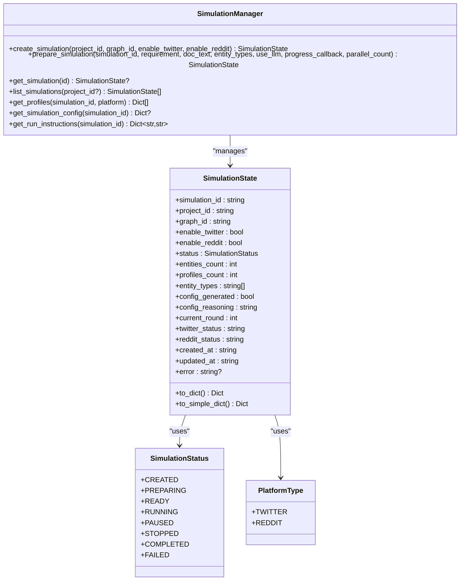
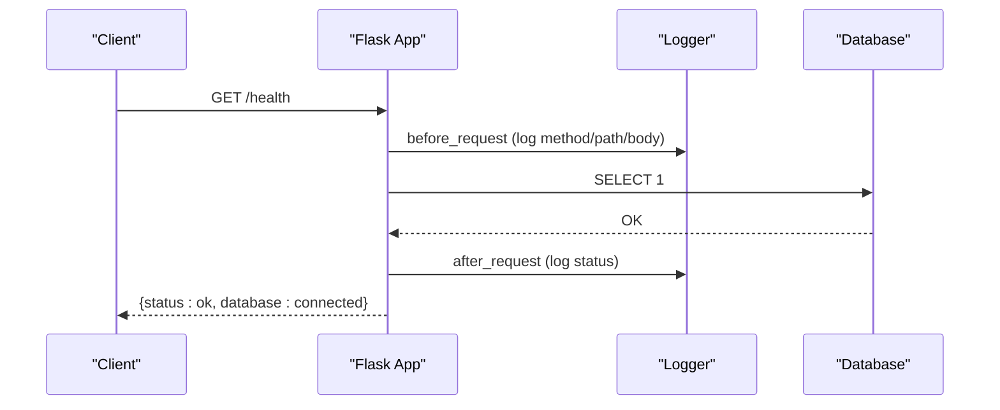
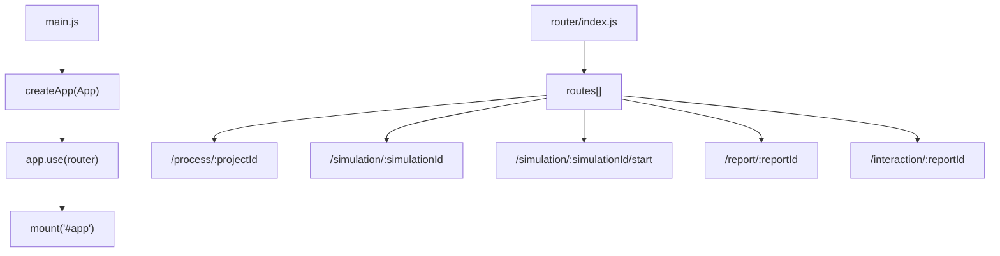
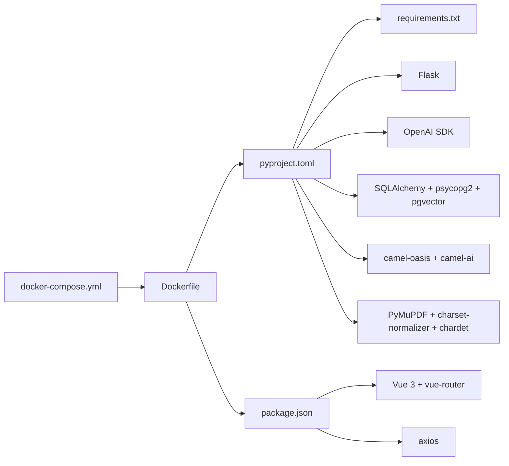

# Development Guidelines

<cite>
**Referenced Files in This Document**
- [README.md](file://README.md)
- [Dockerfile](file://Dockerfile)
- [docker-compose.yml](file://docker-compose.yml)
- [backend/pyproject.toml](file://backend/pyproject.toml)
- [backend/requirements.txt](file://backend/requirements.txt)
- [backend/run.py](file://backend/run.py)
- [backend/app/__init__.py](file://backend/app/__init__.py)
- [backend/app/config.py](file://backend/app/config.py)
- [backend/app/utils/logger.py](file://backend/app/utils/logger.py)
- [backend/app/utils/retry.py](file://backend/app/utils/retry.py)
- [backend/app/services/simulation_manager.py](file://backend/app/services/simulation_manager.py)
- [frontend/package.json](file://frontend/package.json)
- [frontend/src/main.js](file://frontend/src/main.js)
- [frontend/src/router/index.js](file://frontend/src/router/index.js)
</cite>

## Table of Contents
1. [Introduction](#introduction)
2. [Project Structure](#project-structure)
3. [Core Components](#core-components)
4. [Architecture Overview](#architecture-overview)
5. [Detailed Component Analysis](#detailed-component-analysis)
6. [Dependency Analysis](#dependency-analysis)
7. [Performance Considerations](#performance-considerations)
8. [Testing Strategies](#testing-strategies)
9. [Development Workflow](#development-workflow)
10. [Debugging Approaches](#debugging-approaches)
11. [Continuous Integration and Automated Testing](#continuous-integration-and-automated-testing)
12. [Extending the System](#extending-the-system)
13. [Code Review and Quality Assurance](#code-review-and-quality-assurance)
14. [Troubleshooting Guide](#troubleshooting-guide)
15. [Conclusion](#conclusion)

## Introduction
This document provides comprehensive development guidelines for contributing to the Parallel World application. It covers code standards and conventions for Python backend and JavaScript frontend, testing strategies, development workflow, debugging approaches for multi-agent simulations and knowledge graph construction, profiling and performance optimization techniques, CI pipeline and automated testing, extension guidelines for new features and LLM providers, and code review and QA practices.

## Project Structure
The project follows a clear separation of concerns:
- Backend: Flask application with modular services, utilities, and API blueprints.
- Frontend: Vue 3 application with routing and component-based UI.
- Infrastructure: Dockerfile and docker-compose for containerized deployment and local development.
- Configuration: Centralized environment variables and configuration classes.

**Diagram sources**
- [backend/app/__init__.py:20-99](file://backend/app/__init__.py#L20-L99)
- [backend/app/config.py:20-76](file://backend/app/config.py#L20-L76)
- [backend/app/utils/logger.py:30-104](file://backend/app/utils/logger.py#L30-L104)
- [backend/app/utils/retry.py:15-77](file://backend/app/utils/retry.py#L15-L77)
- [backend/app/services/simulation_manager.py:114-529](file://backend/app/services/simulation_manager.py#L114-L529)
- [backend/run.py:25-46](file://backend/run.py#L25-L46)
- [frontend/src/main.js:1-15](file://frontend/src/main.js#L1-L15)
- [frontend/src/router/index.js:1-53](file://frontend/src/router/index.js#L1-L53)
- [Dockerfile:1-30](file://Dockerfile#L1-L30)
- [docker-compose.yml:1-38](file://docker-compose.yml#L1-L38)

**Section sources**
- [README.md:78-147](file://README.md#L78-L147)
- [backend/run.py:1-51](file://backend/run.py#L1-L51)
- [backend/app/__init__.py:20-99](file://backend/app/__init__.py#L20-L99)
- [frontend/src/main.js:1-15](file://frontend/src/main.js#L1-L15)
- [frontend/src/router/index.js:1-53](file://frontend/src/router/index.js#L1-L53)
- [Dockerfile:1-30](file://Dockerfile#L1-L30)
- [docker-compose.yml:1-38](file://docker-compose.yml#L1-L38)

## Core Components
- Configuration Management: Centralized environment loading and validation for LLM, database, uploads, simulation defaults, and report agent parameters.
- Logging: Unified logging with rotating file handlers and console output, ensuring UTF-8 support.
- Retry Utilities: Decorators and client wrappers for robust external API calls with exponential backoff and jitter.
- Simulation Manager: Orchestrates multi-agent simulation lifecycle, including entity filtering, profile generation, configuration generation, and run instructions.
- Flask Application Factory: Registers blueprints, enables CORS, initializes database, registers request/response logging, and exposes health checks.
- Frontend App and Router: Vue 3 app bootstrapping and routing for the simulation workflow.

Key implementation references:
- Configuration class and validation: [backend/app/config.py:20-76](file://backend/app/config.py#L20-L76)
- Logger setup and convenience methods: [backend/app/utils/logger.py:30-127](file://backend/app/utils/logger.py#L30-L127)
- Retry decorators and client: [backend/app/utils/retry.py:15-239](file://backend/app/utils/retry.py#L15-L239)
- Simulation manager orchestration: [backend/app/services/simulation_manager.py:114-529](file://backend/app/services/simulation_manager.py#L114-L529)
- Flask app factory and health check: [backend/app/__init__.py:20-99](file://backend/app/__init__.py#L20-L99)
- Frontend bootstrap and router: [frontend/src/main.js:1-15](file://frontend/src/main.js#L1-L15), [frontend/src/router/index.js:1-53](file://frontend/src/router/index.js#L1-L53)

**Section sources**
- [backend/app/config.py:20-76](file://backend/app/config.py#L20-L76)
- [backend/app/utils/logger.py:30-127](file://backend/app/utils/logger.py#L30-L127)
- [backend/app/utils/retry.py:15-239](file://backend/app/utils/retry.py#L15-L239)
- [backend/app/services/simulation_manager.py:114-529](file://backend/app/services/simulation_manager.py#L114-L529)
- [backend/app/__init__.py:20-99](file://backend/app/__init__.py#L20-L99)
- [frontend/src/main.js:1-15](file://frontend/src/main.js#L1-L15)
- [frontend/src/router/index.js:1-53](file://frontend/src/router/index.js#L1-L53)

## Architecture Overview
The system integrates a Vue 3 frontend with a Flask backend. The backend exposes APIs for knowledge graph operations, simulation lifecycle, and report generation. The frontend routes users through a guided workflow. Dockerization ensures consistent local and CI environments.

**Diagram sources**
- [frontend/src/main.js:1-15](file://frontend/src/main.js#L1-L15)
- [frontend/src/router/index.js:1-53](file://frontend/src/router/index.js#L1-L53)
- [backend/app/__init__.py:20-99](file://backend/app/__init__.py#L20-L99)
- [backend/app/config.py:20-76](file://backend/app/config.py#L20-L76)
- [backend/app/utils/logger.py:30-127](file://backend/app/utils/logger.py#L30-L127)
- [backend/app/utils/retry.py:15-239](file://backend/app/utils/retry.py#L15-L239)
- [backend/app/services/simulation_manager.py:114-529](file://backend/app/services/simulation_manager.py#L114-L529)
- [docker-compose.yml:1-38](file://docker-compose.yml#L1-L38)

**Section sources**
- [README.md:78-147](file://README.md#L78-L147)
- [backend/app/__init__.py:20-99](file://backend/app/__init__.py#L20-L99)
- [docker-compose.yml:1-38](file://docker-compose.yml#L1-L38)

## Detailed Component Analysis

### Simulation Manager
The Simulation Manager coordinates multi-agent simulation creation, preparation, and run instructions. It manages state persistence, progress callbacks, and platform-specific configurations.

**Diagram sources**
- [backend/app/services/simulation_manager.py:24-112](file://backend/app/services/simulation_manager.py#L24-L112)
- [backend/app/services/simulation_manager.py:114-529](file://backend/app/services/simulation_manager.py#L114-L529)

**Section sources**
- [backend/app/services/simulation_manager.py:114-529](file://backend/app/services/simulation_manager.py#L114-L529)

### API Lifecycle and Request Logging
The Flask app factory registers blueprints, enables CORS, initializes the database, logs requests/responses, and exposes a health endpoint.

**Diagram sources**
- [backend/app/__init__.py:64-92](file://backend/app/__init__.py#L64-L92)
- [backend/app/utils/logger.py:30-104](file://backend/app/utils/logger.py#L30-L104)

**Section sources**
- [backend/app/__init__.py:64-92](file://backend/app/__init__.py#L64-L92)
- [backend/app/utils/logger.py:30-104](file://backend/app/utils/logger.py#L30-L104)

### Frontend Routing and Bootstrapping
The frontend initializes Vue, installs the router, and mounts the app. Routes define the simulation workflow.

**Diagram sources**
- [frontend/src/main.js:1-15](file://frontend/src/main.js#L1-L15)
- [frontend/src/router/index.js:9-50](file://frontend/src/router/index.js#L9-L50)

**Section sources**
- [frontend/src/main.js:1-15](file://frontend/src/main.js#L1-L15)
- [frontend/src/router/index.js:1-53](file://frontend/src/router/index.js#L1-L53)

## Dependency Analysis
- Backend dependencies are declared in both pyproject.toml and requirements.txt. The project uses Flask, OpenAI SDK, SQLAlchemy/PostgreSQL with pgvector, camel-oasis/camel-ai for simulation, and PyMuPDF with charset detection for file processing.
- Frontend dependencies include Vue 3, vue-router, axios, and vite for building.
- Dockerfile and docker-compose define the containerized environment, installing Node.js and uv, copying dependency manifests, installing dependencies, and exposing ports.

**Diagram sources**
- [backend/pyproject.toml:11-37](file://backend/pyproject.toml#L11-L37)
- [backend/requirements.txt:8-36](file://backend/requirements.txt#L8-L36)
- [frontend/package.json:11-20](file://frontend/package.json#L11-L20)
- [Dockerfile:1-30](file://Dockerfile#L1-L30)
- [docker-compose.yml:1-38](file://docker-compose.yml#L1-L38)

**Section sources**
- [backend/pyproject.toml:11-37](file://backend/pyproject.toml#L11-L37)
- [backend/requirements.txt:8-36](file://backend/requirements.txt#L8-L36)
- [frontend/package.json:11-20](file://frontend/package.json#L11-L20)
- [Dockerfile:1-30](file://Dockerfile#L1-L30)
- [docker-compose.yml:1-38](file://docker-compose.yml#L1-L38)

## Performance Considerations
- Logging: Use the centralized logger to capture detailed traces without impacting performance. Avoid excessive INFO-level logs in hot paths.
- Retry with Backoff: Apply exponential backoff with jitter for LLM and external API calls to reduce thundering herd effects and improve resilience.
- Simulation State Persistence: Persist simulation state to disk to avoid recomputation and enable resumable runs.
- Chunking and Overlap: Configure chunk size and overlap for text processing to balance recall and performance.
- Database Connections: Ensure connection pooling and proper session management to minimize latency.
- Profiling: Use Python’s cProfile or yep to profile hotspots in simulation preparation and LLM calls.

[No sources needed since this section provides general guidance]

## Testing Strategies
- Unit Tests: Focus on isolated components like retry utilities, configuration validation, and small service helpers. Use pytest with asyncio support for async paths.
- Integration Tests: Test end-to-end flows such as simulation preparation, state transitions, and API endpoints. Mock external services (LLM, Zep) behind configurable clients.
- Simulation Validation: Validate simulation outputs by asserting profile counts, configuration presence, and run instructions. Compare against expected artifacts.
- Frontend Tests: Use Vitest or Jest with Vue Test Utils to test components and router behavior under different routes and props.

[No sources needed since this section provides general guidance]

## Development Workflow
- Local Setup:
  - Source deployment: Install prerequisites, configure environment variables, install dependencies, and start services.
  - Docker deployment: Use docker-compose to spin up PostgreSQL and the application stack.
- Branching: Use feature branches prefixed with feature/, fix/, or chore/ and keep commits focused.
- Pull Requests: Open PRs with clear descriptions, link related issues, and ensure CI passes before merging.
- Environment Variables: Maintain .env.example and validate required keys at startup.

**Section sources**
- [README.md:80-147](file://README.md#L80-L147)
- [backend/app/config.py:66-75](file://backend/app/config.py#L66-L75)
- [backend/run.py:25-46](file://backend/run.py#L25-L46)
- [docker-compose.yml:20-36](file://docker-compose.yml#L20-L36)

## Debugging Approaches
- Multi-Agent Simulations:
  - Inspect simulation state JSON files under uploads/simulations/<id>.
  - Verify entity counts, profile counts, and platform statuses.
  - Confirm configuration JSON and run instructions.
- Knowledge Graph Construction:
  - Validate entity filtering and profile generation steps.
  - Check logs for errors during graph reads and retrievals.
- API Integration Issues:
  - Use request/response logging and health checks.
  - Verify LLM base URL, API key, and model name.
  - Confirm database connectivity and credentials.

**Section sources**
- [backend/app/services/simulation_manager.py:144-192](file://backend/app/services/simulation_manager.py#L144-L192)
- [backend/app/__init__.py:64-92](file://backend/app/__init__.py#L64-L92)
- [backend/app/config.py:30-36](file://backend/app/config.py#L30-L36)

## Continuous Integration and Automated Testing
- Containerized Builds: Dockerfile defines a reproducible build environment with uv for Python and npm ci for Node.js.
- Compose-Based Services: docker-compose.yml provisions PostgreSQL and the application, mounting uploads for persistence.
- CI Pipeline: Define stages for linting, backend tests, frontend tests, and image builds. Use matrix jobs for Python and Node.js versions aligned with project requirements.

**Section sources**
- [Dockerfile:1-30](file://Dockerfile#L1-L30)
- [docker-compose.yml:1-38](file://docker-compose.yml#L1-L38)
- [backend/pyproject.toml:11-37](file://backend/pyproject.toml#L11-L37)
- [frontend/package.json:11-20](file://frontend/package.json#L11-L20)

## Extending the System
- New Features:
  - Backend: Add new API blueprints, models, and services following existing patterns. Keep configuration centralized and validated.
  - Frontend: Add new views and components, and register routes in the router.
- Integrating Additional LLM Providers:
  - Ensure provider adheres to OpenAI SDK-compatible interface.
  - Update configuration fields and validation to support new base URLs and models.
- Adding New Simulation Platforms:
  - Extend platform enums and supported actions.
  - Integrate platform-specific profile formats and runner scripts.
  - Update simulation manager to handle new platform states and run instructions.

**Section sources**
- [backend/app/config.py:51-64](file://backend/app/config.py#L51-L64)
- [backend/app/services/simulation_manager.py:36-59](file://backend/app/services/simulation_manager.py#L36-L59)
- [backend/app/services/simulation_manager.py:506-529](file://backend/app/services/simulation_manager.py#L506-L529)

## Code Review and Quality Assurance
- Code Standards:
  - Python: Use type hints, descriptive variable names, and consistent docstrings. Prefer early returns and guard clauses.
  - JavaScript: Use strict mode, consistent imports, and clear component boundaries.
- Logging: Ensure comprehensive logging around critical paths and error handling.
- Testing: Require tests for new features and refactorings. Maintain coverage targets.
- Security: Validate environment variables at startup and sanitize inputs.
- Documentation: Keep README updated with setup, workflow, and extension instructions.

**Section sources**
- [backend/app/utils/logger.py:30-104](file://backend/app/utils/logger.py#L30-L104)
- [backend/app/config.py:66-75](file://backend/app/config.py#L66-L75)
- [README.md:78-147](file://README.md#L78-L147)

## Troubleshooting Guide
- Configuration Errors: Startup exits early if required keys are missing. Check LLM and database configuration.
- Database Connectivity: Health endpoint verifies database readiness; ensure PostgreSQL is healthy and credentials match.
- Logging: Logs are rotated daily and printed to console with UTF-8 support. Check logs directory for detailed traces.
- Retry Failures: Examine retry logs for exponential backoff attempts and underlying exceptions.

**Section sources**
- [backend/run.py:25-46](file://backend/run.py#L25-L46)
- [backend/app/__init__.py:84-92](file://backend/app/__init__.py#L84-L92)
- [backend/app/utils/logger.py:66-88](file://backend/app/utils/logger.py#L66-L88)
- [backend/app/utils/retry.py:41-77](file://backend/app/utils/retry.py#L41-L77)

## Conclusion
These guidelines establish a consistent development process for Parallel World, covering architecture, testing, debugging, performance, CI, and extensibility. Following these practices ensures reliable multi-agent simulations, maintainable code, and smooth collaboration across the team.