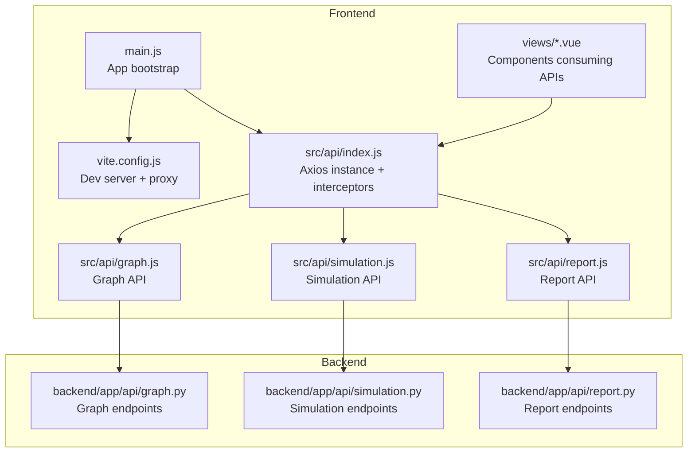
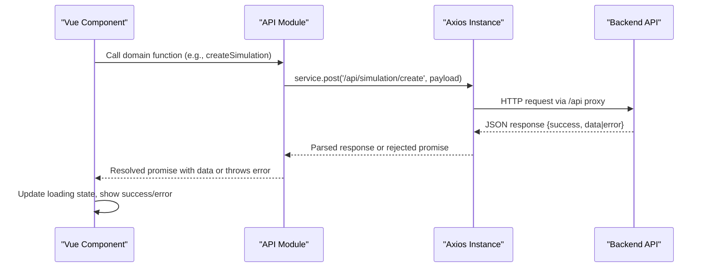
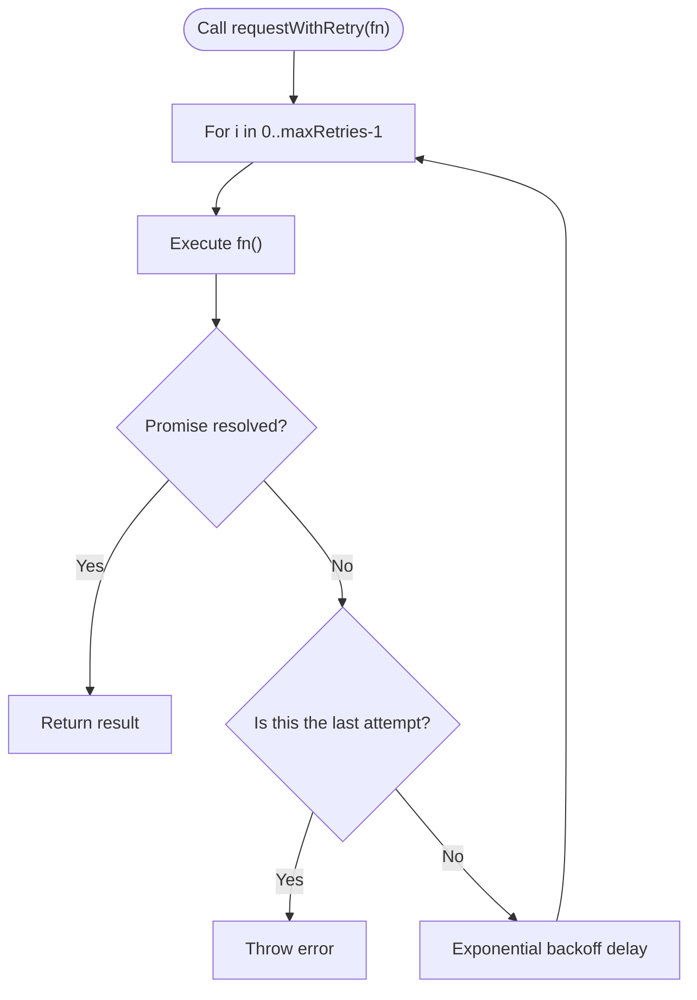
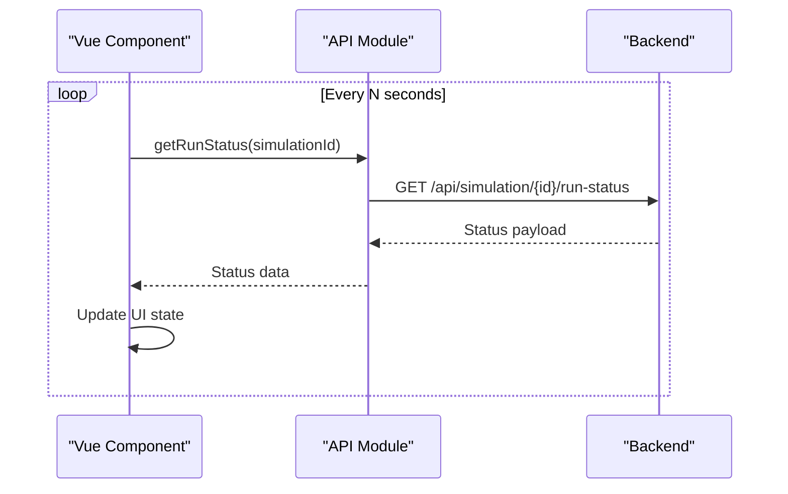
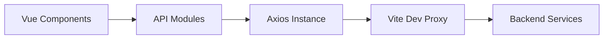

# API Integration Layer

<cite>
**Referenced Files in This Document**
- [index.js](file://frontend/src/api/index.js)
- [graph.js](file://frontend/src/api/graph.js)
- [simulation.js](file://frontend/src/api/simulation.js)
- [report.js](file://frontend/src/api/report.js)
- [package.json](file://frontend/package.json)
- [vite.config.js](file://frontend/vite.config.js)
- [main.js](file://frontend/src/main.js)
- [SimulationRunView.vue](file://frontend/src/views/SimulationRunView.vue)
- [ReportView.vue](file://frontend/src/views/ReportView.vue)
- [Step3Simulation.vue](file://frontend/src/components/Step3Simulation.vue)
- [Step4Report.vue](file://frontend/src/components/Step4Report.vue)
- [graph.py](file://backend/app/api/graph.py)
- [simulation.py](file://backend/app/api/simulation.py)
- [report.py](file://backend/app/api/report.py)
</cite>

## Table of Contents
1. [Introduction](#introduction)
2. [Project Structure](#project-structure)
3. [Core Components](#core-components)
4. [Architecture Overview](#architecture-overview)
5. [Detailed Component Analysis](#detailed-component-analysis)
6. [Dependency Analysis](#dependency-analysis)
7. [Performance Considerations](#performance-considerations)
8. [Troubleshooting Guide](#troubleshooting-guide)
9. [Conclusion](#conclusion)

## Introduction
This document describes the frontend API integration layer that connects Vue components to backend services. It covers the Axios-based API client configuration, request/response handling, error management strategies, and the specific APIs for graph construction, simulation orchestration, and report generation. It also explains how components integrate with the API layer, manage loading states, and implement real-time updates via polling.

## Project Structure
The frontend API integration is organized around a centralized Axios instance with modular API modules for each domain:
- Central API client with interceptors and retry logic
- Domain-specific API modules for graph, simulation, and report operations
- Vue components that consume these APIs and manage UI state

**Diagram sources**
- [main.js:1-15](file://frontend/src/main.js#L1-L15)
- [vite.config.js:1-19](file://frontend/vite.config.js#L1-L19)
- [index.js:1-68](file://frontend/src/api/index.js#L1-L68)
- [graph.js:1-71](file://frontend/src/api/graph.js#L1-L71)
- [simulation.js:1-188](file://frontend/src/api/simulation.js#L1-L188)
- [report.js:1-52](file://frontend/src/api/report.js#L1-L52)
- [graph.py:1-604](file://backend/app/api/graph.py#L1-L604)
- [simulation.py:1-800](file://backend/app/api/simulation.py#L1-L800)
- [report.py:1-800](file://backend/app/api/report.py#L1-L800)

**Section sources**
- [main.js:1-15](file://frontend/src/main.js#L1-L15)
- [vite.config.js:1-19](file://frontend/vite.config.js#L1-L19)
- [index.js:1-68](file://frontend/src/api/index.js#L1-L68)

## Core Components
- Central API client: Creates an Axios instance with base URL, timeout, and shared headers. Includes request and response interceptors for unified error handling and a retry utility for transient failures.
- Domain API modules: Expose typed functions for graph operations (ontology generation, graph building, task/status queries), simulation operations (create, prepare, start/stop, status, posts, timeline, agents), and report operations (generate, status, logs, retrieval).
- Vue components: Consume these APIs to load data, trigger operations, and update UI state. They implement loading indicators, error messaging, and polling for real-time updates.

Key characteristics:
- Unified response shape: All API responses include a success flag and either data or error fields.
- Retry strategy: A retry wrapper with exponential backoff is applied to critical operations.
- Real-time updates: Components poll backend endpoints to reflect live simulation and report progress.

**Section sources**
- [index.js:1-68](file://frontend/src/api/index.js#L1-L68)
- [graph.js:1-71](file://frontend/src/api/graph.js#L1-L71)
- [simulation.js:1-188](file://frontend/src/api/simulation.js#L1-L188)
- [report.js:1-52](file://frontend/src/api/report.js#L1-L52)

## Architecture Overview
The frontend communicates with the backend through a reverse proxy configured in Vite. Requests to /api/* are forwarded to the backend server. The API client enforces consistent error handling and retry behavior, while Vue components orchestrate user workflows across the three domains.

**Diagram sources**
- [vite.config.js:10-16](file://frontend/vite.config.js#L10-L16)
- [index.js:4-10](file://frontend/src/api/index.js#L4-L10)
- [simulation.js:7-9](file://frontend/src/api/simulation.js#L7-L9)

## Detailed Component Analysis

### Central API Client
The central client initializes Axios with:
- Base URL from environment variable (fallback to localhost)
- Long timeout suitable for long-running operations
- Shared JSON content type header

Interceptors:
- Request interceptor: Placeholder for future enhancements (currently passthrough)
- Response interceptor: Validates success flag and surfaces errors consistently
- Network and timeout handling: Logs and propagates meaningful errors

Retry utility:
- Exponential backoff retry loop with configurable attempts and delays
- Applied around critical API calls to improve resilience

**Diagram sources**
- [index.js:54-65](file://frontend/src/api/index.js#L54-L65)

**Section sources**
- [index.js:1-68](file://frontend/src/api/index.js#L1-L68)

### Graph API Integration
Functions:
- generateOntology: Uploads documents and requirements to generate an ontology; returns project metadata
- buildGraph: Starts graph construction from project data
- getTaskStatus: Queries asynchronous task progress
- getGraphData: Retrieves constructed graph data
- getProject: Fetches project details

Usage patterns:
- Components call these functions and handle loading states and errors
- Responses conform to the unified success/error structure

**Section sources**
- [graph.js:1-71](file://frontend/src/api/graph.js#L1-L71)

### Simulation API Integration
Functions:
- Lifecycle: createSimulation, prepareSimulation, startSimulation, stopSimulation
- Status and monitoring: getSimulation, getRunStatus, getRunStatusDetail, getPrepareStatus
- Data access: getSimulationProfiles, getSimulationProfilesRealtime, getSimulationConfig, getSimulationConfigRealtime
- Lists and history: listSimulations, getSimulationHistory
- Posts and analytics: getSimulationPosts, getSimulationTimeline, getAgentStats, getSimulationActions
- Environment controls: closeSimulationEnv, getEnvStatus
- Interviews: interviewAgents
- Real-time polling endpoints are used by components to update UI

Integration in components:
- SimulationRunView: Loads simulation and graph data, manages environment lifecycle, and refreshes graph periodically
- Step3Simulation: Manages simulation lifecycle, polls run status and detailed actions, triggers report generation

**Section sources**
- [simulation.js:1-188](file://frontend/src/api/simulation.js#L1-L188)
- [SimulationRunView.vue:1-195](file://frontend/src/views/SimulationRunView.vue#L1-L195)
- [Step3Simulation.vue:1-697](file://frontend/src/components/Step3Simulation.vue#L1-L697)

### Report API Integration
Functions:
- generateReport: Initiates report generation; returns task metadata
- getReportStatus: Checks generation progress
- getAgentLog: Streams agent execution logs incrementally
- getConsoleLog: Streams console logs incrementally
- getReport: Retrieves report metadata and outline
- chatWithReport: Engages with the Report Agent

Integration in components:
- ReportView: Loads report and related project/graph data
- Step4Report: Polls report sections and logs to render content progressively

**Section sources**
- [report.js:1-52](file://frontend/src/api/report.js#L1-L52)
- [ReportView.vue:1-128](file://frontend/src/views/ReportView.vue#L1-L128)
- [Step4Report.vue:1-1599](file://frontend/src/components/Step4Report.vue#L1-L1599)

### Component Integration Examples

#### Making API Calls from Components
- Import the appropriate API module and call exported functions
- Handle loading states with local reactive state
- Use try/catch to surface errors and update UI accordingly
- Trigger navigation or follow-up requests upon success

Examples in code:
- SimulationRunView uses getSimulation, getSimulationConfig, getProject, getGraphData, and environment control APIs
- Step3Simulation uses startSimulation, stopSimulation, getRunStatus, getRunStatusDetail, and generateReport
- ReportView uses getReport and related graph/project queries
- Step4Report uses getAgentLog and getConsoleLog for real-time updates

**Section sources**
- [SimulationRunView.vue:120-164](file://frontend/src/views/SimulationRunView.vue#L120-L164)
- [Step3Simulation.vue:380-460](file://frontend/src/components/Step3Simulation.vue#L380-L460)
- [ReportView.vue:73-98](file://frontend/src/views/ReportView.vue#L73-L98)
- [Step4Report.vue:392-430](file://frontend/src/components/Step4Report.vue#L392-L430)

#### Handling Loading States
- Local reactive booleans track loading for graph and report operations
- UI displays loading indicators while awaiting API responses
- After completion, state is updated and UI reflects new data

**Section sources**
- [SimulationRunView.vue:151-164](file://frontend/src/views/SimulationRunView.vue#L151-L164)
- [ReportView.vue:100-110](file://frontend/src/views/ReportView.vue#L100-L110)

#### Real-Time Updates via Polling
- Components set up periodic timers to poll backend status endpoints
- Timers are started/stopped based on component lifecycle and user actions
- Deduplication and incremental fetching are used to minimize redundant work

**Diagram sources**
- [Step3Simulation.vue:489-531](file://frontend/src/components/Step3Simulation.vue#L489-L531)

**Section sources**
- [Step3Simulation.vue:462-531](file://frontend/src/components/Step3Simulation.vue#L462-L531)
- [Step4Report.vue:392-430](file://frontend/src/components/Step4Report.vue#L392-L430)

### Authentication and Security
- The API client does not attach authentication headers by default
- Backend endpoints rely on server-side session/state management and do not require explicit frontend tokens
- Proxy configuration ensures requests are forwarded to the backend server

**Section sources**
- [index.js:4-10](file://frontend/src/api/index.js#L4-L10)
- [vite.config.js:10-16](file://frontend/vite.config.js#L10-L16)

## Dependency Analysis
The frontend depends on:
- Axios for HTTP transport
- Vue for reactive state and component lifecycle
- Vite for development server and proxy configuration

**Diagram sources**
- [package.json:11-16](file://frontend/package.json#L11-L16)
- [vite.config.js:10-16](file://frontend/vite.config.js#L10-L16)
- [index.js:1-10](file://frontend/src/api/index.js#L1-L10)

**Section sources**
- [package.json:1-22](file://frontend/package.json#L1-L22)
- [vite.config.js:1-19](file://frontend/vite.config.js#L1-L19)

## Performance Considerations
- Long timeouts: The Axios instance sets a generous timeout to accommodate long-running operations like graph building and report generation
- Retry strategy: The retry utility applies exponential backoff to reduce load on failing endpoints
- Polling intervals: Components use conservative intervals to balance responsiveness and server load
- Incremental log retrieval: Report logs support incremental fetching to avoid large payloads

[No sources needed since this section provides general guidance]

## Troubleshooting Guide
Common issues and resolutions:
- Network errors: Detected by the response interceptor; verify backend connectivity and proxy configuration
- Timeouts: Long-running operations may exceed default limits; ensure backend processing completes
- Non-success responses: The response interceptor validates the success flag and surfaces errors; inspect error messages returned by the backend
- Polling gaps: If real-time updates stall, confirm timers are active and endpoints are reachable

**Section sources**
- [index.js:23-51](file://frontend/src/api/index.js#L23-L51)

## Conclusion
The frontend API integration layer provides a robust, consistent interface for interacting with backend services. It centralizes HTTP configuration, enforces uniform response handling, and offers retry capabilities for resilient operations. Components leverage these APIs to implement complex workflows spanning graph construction, simulation orchestration, and report generation, with real-time updates achieved through polling. The design supports maintainability and scalability across the application’s feature set.