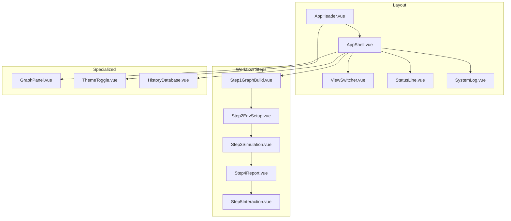
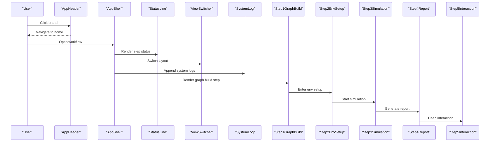
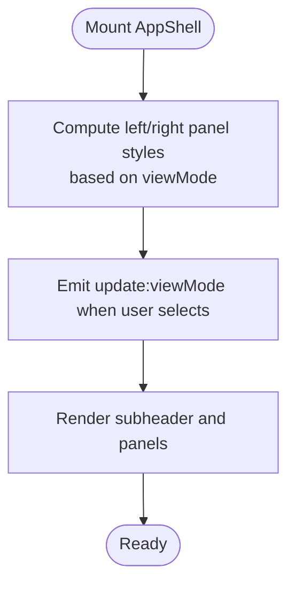
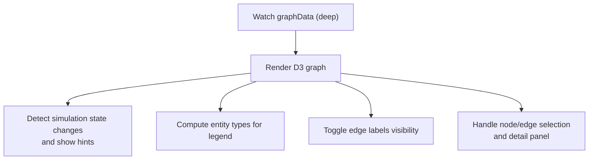
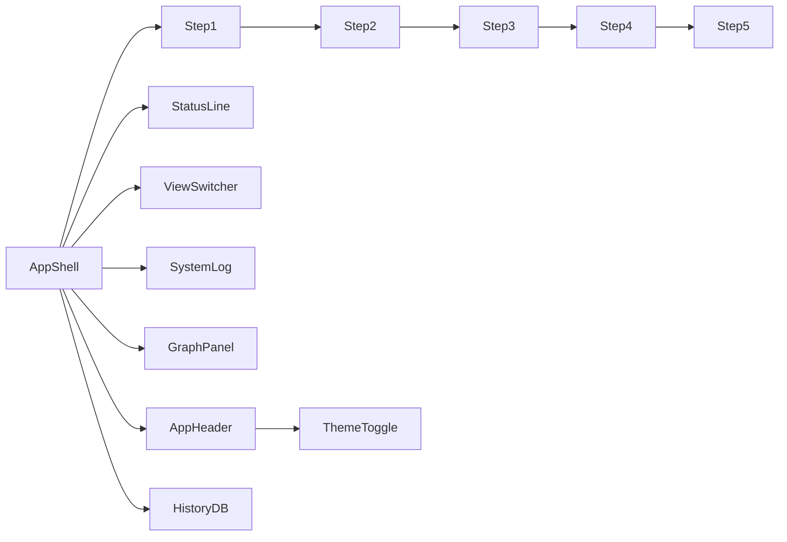

# Component Library

<cite>
**Referenced Files in This Document**
- [AppShell.vue](file://frontend/src/components/AppShell.vue)
- [AppHeader.vue](file://frontend/src/components/AppHeader.vue)
- [GraphPanel.vue](file://frontend/src/components/GraphPanel.vue)
- [StatusLine.vue](file://frontend/src/components/StatusLine.vue)
- [SystemLog.vue](file://frontend/src/components/SystemLog.vue)
- [Step1GraphBuild.vue](file://frontend/src/components/Step1GraphBuild.vue)
- [Step2EnvSetup.vue](file://frontend/src/components/Step2EnvSetup.vue)
- [Step3Simulation.vue](file://frontend/src/components/Step3Simulation.vue)
- [Step4Report.vue](file://frontend/src/components/Step4Report.vue)
- [Step5Interaction.vue](file://frontend/src/components/Step5Interaction.vue)
- [ThemeToggle.vue](file://frontend/src/components/ThemeToggle.vue)
- [ViewSwitcher.vue](file://frontend/src/components/ViewSwitcher.vue)
- [HistoryDatabase.vue](file://frontend/src/components/HistoryDatabase.vue)
- [useTheme.js](file://frontend/src/composables/useTheme.js)
- [design-tokens.css](file://frontend/src/styles/design-tokens.css)
</cite>

## Table of Contents
1. [Introduction](#introduction)
2. [Project Structure](#project-structure)
3. [Core Components](#core-components)
4. [Architecture Overview](#architecture-overview)
5. [Detailed Component Analysis](#detailed-component-analysis)
6. [Dependency Analysis](#dependency-analysis)
7. [Performance Considerations](#performance-considerations)
8. [Troubleshooting Guide](#troubleshooting-guide)
9. [Conclusion](#conclusion)
10. [Appendices](#appendices)

## Introduction
This document describes the Vue.js component library and reusable UI components that power the multi-step workflow for building, simulating, reporting, and interacting with a knowledge graph. It focuses on:
- Purpose, props, events, and slots for each component
- Component hierarchy starting with AppShell and AppHeader
- Workflow components (Step1–Step5) for the end-to-end process
- Specialized components (GraphPanel, StatusLine, SystemLog)
- Composition patterns, prop validation, event handling, theming, and responsive design
- Lifecycle management and performance optimization

## Project Structure
The frontend is organized into:
- Components: Reusable UI building blocks under frontend/src/components
- Composables: Shared logic under frontend/src/composables
- Styles: Design tokens and component-level styles under frontend/src/styles
- Views and routing: Pages under frontend/src/views and routing under frontend/src/router
- APIs: Backend integration under frontend/src/api

**Diagram sources**
- [AppShell.vue:1-103](file://frontend/src/components/AppShell.vue#L1-L103)
- [AppHeader.vue:1-64](file://frontend/src/components/AppHeader.vue#L1-L64)
- [GraphPanel.vue:1-800](file://frontend/src/components/GraphPanel.vue#L1-L800)
- [StatusLine.vue:1-74](file://frontend/src/components/StatusLine.vue#L1-L74)
- [SystemLog.vue:1-95](file://frontend/src/components/SystemLog.vue#L1-L95)
- [Step1GraphBuild.vue:1-701](file://frontend/src/components/Step1GraphBuild.vue#L1-L701)
- [Step2EnvSetup.vue:1-800](file://frontend/src/components/Step2EnvSetup.vue#L1-L800)
- [Step3Simulation.vue:1-800](file://frontend/src/components/Step3Simulation.vue#L1-L800)
- [Step4Report.vue:1-800](file://frontend/src/components/Step4Report.vue#L1-L800)
- [Step5Interaction.vue:1-800](file://frontend/src/components/Step5Interaction.vue#L1-L800)
- [ThemeToggle.vue:1-38](file://frontend/src/components/ThemeToggle.vue#L1-L38)
- [ViewSwitcher.vue:1-63](file://frontend/src/components/ViewSwitcher.vue#L1-L63)
- [HistoryDatabase.vue:1-362](file://frontend/src/components/HistoryDatabase.vue#L1-L362)

**Section sources**
- [AppShell.vue:1-103](file://frontend/src/components/AppShell.vue#L1-L103)
- [AppHeader.vue:1-64](file://frontend/src/components/AppHeader.vue#L1-L64)

## Core Components
This section summarizes the base layout and specialized components.

- AppHeader
  - Purpose: Brand header with logo and theme toggle
  - Props: None
  - Events: None
  - Slots: None
  - Theming: Uses design tokens and theme composable
  - Accessibility: Clickable brand area navigates home

- AppShell
  - Purpose: Main shell with subheader, split panels, and system log
  - Props:
    - stepNum: number|string (required)
    - stepName: string (required)
    - status: string (default: "pending")
    - viewMode: string (default: "split")
    - systemLogs: array (default: [])
  - Events:
    - update:viewMode
  - Slots:
    - graph: left panel content
    - workbench: right panel content
  - Behavior: Computes responsive panel widths based on viewMode; emits view mode changes

- StatusLine
  - Purpose: Displays current step and status indicator
  - Props:
    - stepNum: number|string (required)
    - stepName: string (required)
    - status: string (default: "pending")
  - Events: None
  - Slots: None

- SystemLog
  - Purpose: Fixed-height scrolling log panel at the bottom
  - Props:
    - logs: array (default: [])
  - Events: None
  - Slots: None

- GraphPanel
  - Purpose: Interactive D3-based knowledge graph visualization
  - Props:
    - graphData: object
    - loading: boolean
    - currentPhase: number
    - isSimulating: boolean
  - Events:
    - refresh
    - toggle-maximize
  - Slots: None

- ThemeToggle
  - Purpose: Switches between dark/light themes
  - Props: None
  - Events: None
  - Slots: None

- ViewSwitcher
  - Purpose: Switch between graph, split, and workbench layouts
  - Props:
    - modelValue: string (default: "split")
  - Events:
    - update:modelValue
  - Slots: None

- HistoryDatabase
  - Purpose: Lists recent simulations with quick navigation
  - Props: None
  - Events: None
  - Slots: None

**Section sources**
- [AppHeader.vue:1-64](file://frontend/src/components/AppHeader.vue#L1-L64)
- [AppShell.vue:33-53](file://frontend/src/components/AppShell.vue#L33-L53)
- [StatusLine.vue:17-21](file://frontend/src/components/StatusLine.vue#L17-L21)
- [SystemLog.vue:21-23](file://frontend/src/components/SystemLog.vue#L21-L23)
- [GraphPanel.vue:242-247](file://frontend/src/components/GraphPanel.vue#L242-L247)
- [ThemeToggle.vue:1-38](file://frontend/src/components/ThemeToggle.vue#L1-L38)
- [ViewSwitcher.vue:16-18](file://frontend/src/components/ViewSwitcher.vue#L16-L18)
- [HistoryDatabase.vue:84-166](file://frontend/src/components/HistoryDatabase.vue#L84-L166)

## Architecture Overview
The system follows a base-layer pattern:
- AppHeader provides branding and theme controls
- AppShell orchestrates layout, status, logs, and view switching
- Workflow components encapsulate domain-specific UI and state
- Specialized components (GraphPanel, SystemLog) integrate with backend APIs and streaming updates

**Diagram sources**
- [AppHeader.vue:3](file://frontend/src/components/AppHeader.vue#L3)
- [AppShell.vue:10](file://frontend/src/components/AppShell.vue#L10)
- [StatusLine.vue:1-74](file://frontend/src/components/StatusLine.vue#L1-L74)
- [ViewSwitcher.vue:22-26](file://frontend/src/components/ViewSwitcher.vue#L22-L26)
- [SystemLog.vue:28-33](file://frontend/src/components/SystemLog.vue#L28-L33)
- [Step1GraphBuild.vue:211-244](file://frontend/src/components/Step1GraphBuild.vue#L211-L244)
- [Step2EnvSetup.vue:769-794](file://frontend/src/components/Step2EnvSetup.vue#L769-L794)
- [Step3Simulation.vue:380-435](file://frontend/src/components/Step3Simulation.vue#L380-L435)
- [Step4Report.vue:392-412](file://frontend/src/components/Step4Report.vue#L392-L412)
- [Step5Interaction.vue:413-423](file://frontend/src/components/Step5Interaction.vue#L413-L423)

## Detailed Component Analysis

### AppShell
- Responsibilities:
  - Hosts AppHeader, StatusLine, ViewSwitcher, GraphPanel slots, and SystemLog
  - Manages responsive panel layout via viewMode
  - Emits viewMode changes to parent
- Prop validation:
  - stepNum: Number/String (required)
  - stepName: String (required)
  - status: String (default: "pending")
  - viewMode: String (default: "split")
  - systemLogs: Array (default: [])
- Event handling:
  - update:viewMode emitted when user switches layout
- Composition:
  - Uses computed styles to animate panel widths and opacity transitions
- Theming:
  - Inherits design tokens for borders, spacing, and transitions

**Diagram sources**
- [AppShell.vue:43-53](file://frontend/src/components/AppShell.vue#L43-L53)
- [AppShell.vue:41](file://frontend/src/components/AppShell.vue#L41)

**Section sources**
- [AppShell.vue:33-53](file://frontend/src/components/AppShell.vue#L33-L53)

### AppHeader
- Responsibilities:
  - Renders brand and logo
  - Integrates ThemeToggle
  - Navigates to home on brand click
- Theming:
  - Dynamically selects logo asset based on theme

**Section sources**
- [AppHeader.vue:18-24](file://frontend/src/components/AppHeader.vue#L18-L24)

### StatusLine
- Responsibilities:
  - Displays step number and name
  - Shows status with symbol and color-coded indicator
- Status mapping:
  - pending → ○
  - active → ◈
  - completed → ◆
  - error → ✖

**Section sources**
- [StatusLine.vue:23-41](file://frontend/src/components/StatusLine.vue#L23-L41)

### SystemLog
- Responsibilities:
  - Auto-scrolls to bottom when new logs arrive
  - Displays timestamped entries
- Behavior:
  - Watches logs length and scrolls container

**Section sources**
- [SystemLog.vue:28-33](file://frontend/src/components/SystemLog.vue#L28-L33)

### GraphPanel
- Responsibilities:
  - Renders D3 force-directed graph
  - Supports node/edge selection, detail panels, and toggles
  - Handles simulation hints and post-simulation notices
- Props:
  - graphData, loading, currentPhase, isSimulating
- Events:
  - refresh
  - toggle-maximize
- Rendering pipeline:
  - Watches graphData and re-renders on deep changes
  - Computes entity types for legend
  - Formats dates and toggles edge labels visibility

**Diagram sources**
- [GraphPanel.vue:786-788](file://frontend/src/components/GraphPanel.vue#L786-L788)
- [GraphPanel.vue:264-271](file://frontend/src/components/GraphPanel.vue#L264-L271)
- [GraphPanel.vue:284-299](file://frontend/src/components/GraphPanel.vue#L284-L299)
- [GraphPanel.vue:790-798](file://frontend/src/components/GraphPanel.vue#L790-L798)

**Section sources**
- [GraphPanel.vue:242-247](file://frontend/src/components/GraphPanel.vue#L242-L247)
- [GraphPanel.vue:328-784](file://frontend/src/components/GraphPanel.vue#L328-L784)

### Step1GraphBuild
- Responsibilities:
  - Ontology generation preview and progress
  - Graph build stats and progress
  - Navigation to environment setup
- Props:
  - currentPhase, projectData, ontologyProgress, buildProgress, graphData, systemLogs
- Events:
  - next-step
- Behavior:
  - Auto-scrolls system logs
  - Creates simulation and navigates on completion

**Section sources**
- [Step1GraphBuild.vue:196-205](file://frontend/src/components/Step1GraphBuild.vue#L196-L205)
- [Step1GraphBuild.vue:211-244](file://frontend/src/components/Step1GraphBuild.vue#L211-L244)
- [Step1GraphBuild.vue:263-270](file://frontend/src/components/Step1GraphBuild.vue#L263-L270)

### Step2EnvSetup
- Responsibilities:
  - Simulation instance creation
  - Agent persona generation
  - Dual-platform configuration preview
  - Round selection (auto/custom)
- Props:
  - simulationId, projectData, graphData, systemLogs
- Events:
  - go-back, next-step, add-log, update-status
- Behavior:
  - Polls preparation stages and config generation
  - Calculates auto-generated rounds from config

**Section sources**
- [Step2EnvSetup.vue:644-651](file://frontend/src/components/Step2EnvSetup.vue#L644-L651)
- [Step2EnvSetup.vue:675-689](file://frontend/src/components/Step2EnvSetup.vue#L675-L689)
- [Step2EnvSetup.vue:691-704](file://frontend/src/components/Step2EnvSetup.vue#L691-L704)
- [Step2EnvSetup.vue:768-794](file://frontend/src/components/Step2EnvSetup.vue#L768-L794)

### Step3Simulation
- Responsibilities:
  - Dual-platform simulation control and monitoring
  - Real-time action timeline
  - Report generation trigger
- Props:
  - simulationId, maxRounds, minutesPerRound, projectData, graphData, systemLogs
- Events:
  - go-back, next-step, add-log, update-status
- Behavior:
  - Starts/stops simulation
  - Polls run status and incremental actions
  - Generates report and navigates

**Section sources**
- [Step3Simulation.vue:299-309](file://frontend/src/components/Step3Simulation.vue#L299-L309)
- [Step3Simulation.vue:379-435](file://frontend/src/components/Step3Simulation.vue#L379-L435)
- [Step3Simulation.vue:489-555](file://frontend/src/components/Step3Simulation.vue#L489-L555)
- [Step3Simulation.vue:641-675](file://frontend/src/components/Step3Simulation.vue#L641-L675)

### Step4Report
- Responsibilities:
  - Report outline and section rendering
  - Agent log timeline with tool calls/results
  - Console logs
- Props:
  - reportId, simulationId, systemLogs
- Events:
  - add-log, update-status
- Behavior:
  - Parses structured agent logs
  - Renders markdown content
  - Navigates to interaction view upon completion

**Section sources**
- [Step4Report.vue:399-405](file://frontend/src/components/Step4Report.vue#L399-L405)
- [Step4Report.vue:414-429](file://frontend/src/components/Step4Report.vue#L414-L429)
- [Step4Report.vue:478-493](file://frontend/src/components/Step4Report.vue#L478-L493)

### Step5Interaction
- Responsibilities:
  - Report section browsing
  - Chat with Report Agent or individual agents
  - Bulk survey distribution
- Props:
  - reportId, simulationId
- Events:
  - add-log, update-status
- Behavior:
  - Maintains chat history per target
  - Renders markdown and handles agent selection

**Section sources**
- [Step5Interaction.vue:418-423](file://frontend/src/components/Step5Interaction.vue#L418-L423)
- [Step5Interaction.vue:487-517](file://frontend/src/components/Step5Interaction.vue#L487-L517)
- [Step5Interaction.vue:641-771](file://frontend/src/components/Step5Interaction.vue#L641-L771)

### ThemeToggle and Theme System
- ThemeToggle
  - Toggles theme via useTheme
- useTheme
  - Persists theme preference in localStorage
  - Applies data-theme attribute to document element
- Design tokens
  - Define dark/light color palettes, typography, spacing, borders, and transitions
  - Root tokens for dark mode; overrides for light mode

**Section sources**
- [ThemeToggle.vue:11](file://frontend/src/components/ThemeToggle.vue#L11)
- [useTheme.js:1-38](file://frontend/src/composables/useTheme.js#L1-L38)
- [design-tokens.css:6-72](file://frontend/src/styles/design-tokens.css#L6-L72)

### ViewSwitcher
- Purpose: Switch between layout modes
- Modes: graph, split, workbench
- Behavior: Emits update:modelValue on selection

**Section sources**
- [ViewSwitcher.vue:22-26](file://frontend/src/components/ViewSwitcher.vue#L22-L26)

### HistoryDatabase
- Purpose: Browse recent simulations and navigate to steps
- Behavior: Loads history, opens modals, routes to relevant views

**Section sources**
- [HistoryDatabase.vue:150-166](file://frontend/src/components/HistoryDatabase.vue#L150-L166)

## Dependency Analysis
- Component coupling:
  - AppShell composes AppHeader, StatusLine, ViewSwitcher, SystemLog, and slots for GraphPanel and workflow steps
  - Workflow steps depend on APIs for simulation and report generation
  - GraphPanel depends on D3 and consumes graphData
- External dependencies:
  - D3 for graph rendering
  - Vue reactivity (ref, computed, watch)
- Potential circular dependencies:
  - None observed among components; routing is centralized

**Diagram sources**
- [AppShell.vue:27-31](file://frontend/src/components/AppShell.vue#L27-L31)
- [Step1GraphBuild.vue:196-205](file://frontend/src/components/Step1GraphBuild.vue#L196-L205)
- [Step2EnvSetup.vue:644-651](file://frontend/src/components/Step2EnvSetup.vue#L644-L651)
- [Step3Simulation.vue:311](file://frontend/src/components/Step3Simulation.vue#L311)
- [Step4Report.vue:399-405](file://frontend/src/components/Step4Report.vue#L399-L405)
- [Step5Interaction.vue:418-423](file://frontend/src/components/Step5Interaction.vue#L418-L423)

## Performance Considerations
- GraphPanel
  - Uses computed entity types to minimize DOM and legend updates
  - Watches graphData deeply; consider debouncing heavy updates
  - Clears previous simulation on re-render to prevent resource leaks
- Step3Simulation
  - Polling intervals (2s and 3s) should be tuned for UX vs. network cost
  - Deduplicates incoming actions to avoid redundant renders
- General
  - Use CSS transitions and will-change for smooth animations
  - Avoid unnecessary watchers; leverage computed properties
  - Lazy-load heavy modules where feasible

[No sources needed since this section provides general guidance]

## Troubleshooting Guide
- Graph does not render
  - Ensure graphData is present and contains nodes/edges
  - Verify container dimensions and D3 selection
- Simulation not starting
  - Confirm simulationId exists and backend responds
  - Check status polling and error logs
- Report generation stuck
  - Inspect agent logs and tool call results
  - Verify reportId availability and navigation
- Theme not applying
  - Check data-theme attribute and localStorage persistence
  - Ensure design-tokens.css is loaded

**Section sources**
- [GraphPanel.vue:328-350](file://frontend/src/components/GraphPanel.vue#L328-L350)
- [Step3Simulation.vue:380-435](file://frontend/src/components/Step3Simulation.vue#L380-L435)
- [Step4Report.vue:414-429](file://frontend/src/components/Step4Report.vue#L414-L429)
- [useTheme.js:16-31](file://frontend/src/composables/useTheme.js#L16-L31)

## Conclusion
The component library provides a robust, theme-aware, and responsive foundation for a multi-step knowledge graph workflow. AppShell and AppHeader establish a consistent layout, while specialized components encapsulate complex behaviors such as graph visualization, simulation orchestration, and report interaction. Adhering to the documented prop/event/slot contracts and leveraging the theme system ensures maintainability and extensibility.

[No sources needed since this section summarizes without analyzing specific files]

## Appendices

### Component Composition Patterns
- Slot-based composition: AppShell exposes named slots for graph and workbench areas
- Event-driven updates: ViewSwitcher and AppShell communicate via update:modelValue
- Reactive props: StatusLine and SystemLog rely on reactive props and watchers for rendering

**Section sources**
- [AppShell.vue:13-22](file://frontend/src/components/AppShell.vue#L13-L22)
- [ViewSwitcher.vue:20](file://frontend/src/components/ViewSwitcher.vue#L20)
- [SystemLog.vue:28-33](file://frontend/src/components/SystemLog.vue#L28-L33)

### Theming Integration
- Design tokens define a retro monospace terminal aesthetic
- useTheme persists and applies theme changes globally
- ThemeToggle toggles between sun/moon icons and updates data-theme

**Section sources**
- [design-tokens.css:6-72](file://frontend/src/styles/design-tokens.css#L6-L72)
- [useTheme.js:16-31](file://frontend/src/composables/useTheme.js#L16-L31)
- [ThemeToggle.vue:1-38](file://frontend/src/components/ThemeToggle.vue#L1-L38)

### Responsive Design Implementation
- AppShell computes panel widths and opacity based on viewMode
- SystemLog uses fixed height with overflow-y auto
- Grid-based HistoryDatabase adapts card layout to screen size

**Section sources**
- [AppShell.vue:43-53](file://frontend/src/components/AppShell.vue#L43-L53)
- [SystemLog.vue:37-44](file://frontend/src/components/SystemLog.vue#L37-L44)
- [HistoryDatabase.vue:173-177](file://frontend/src/components/HistoryDatabase.vue#L173-L177)