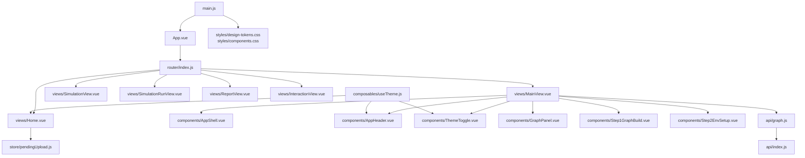
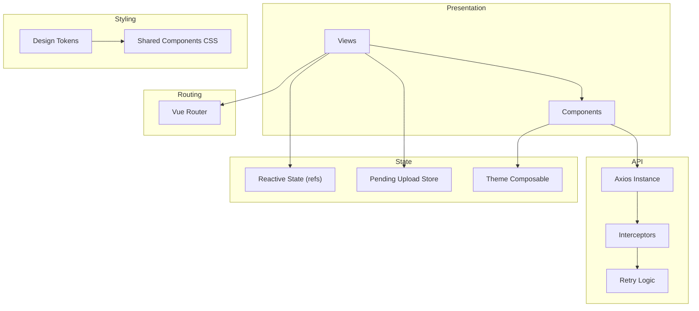
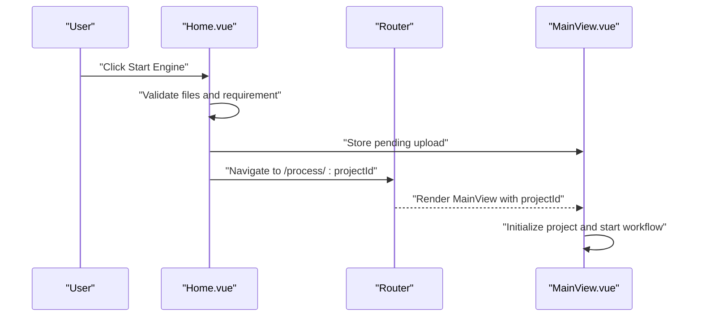
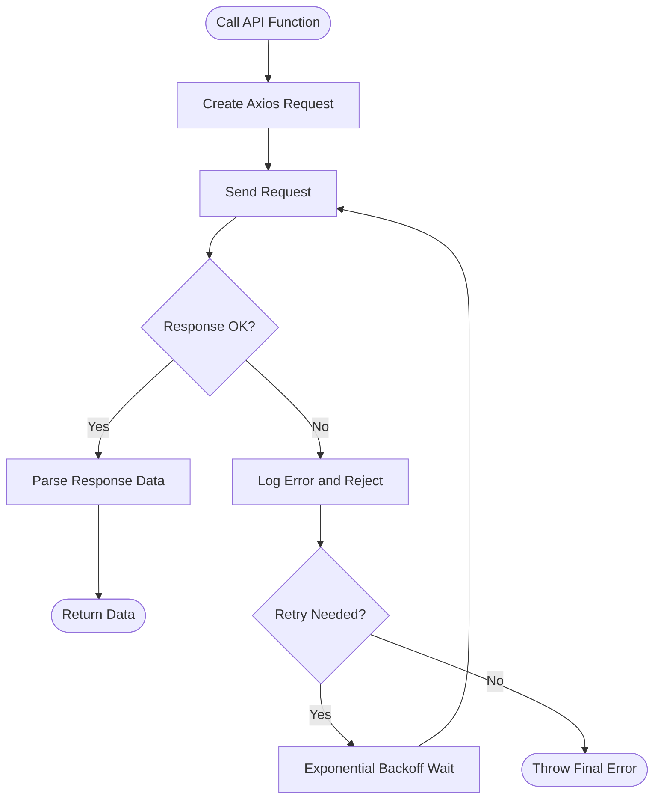
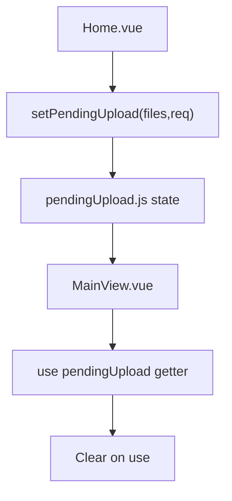
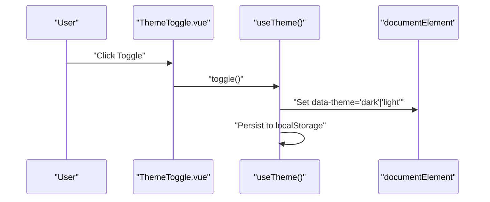
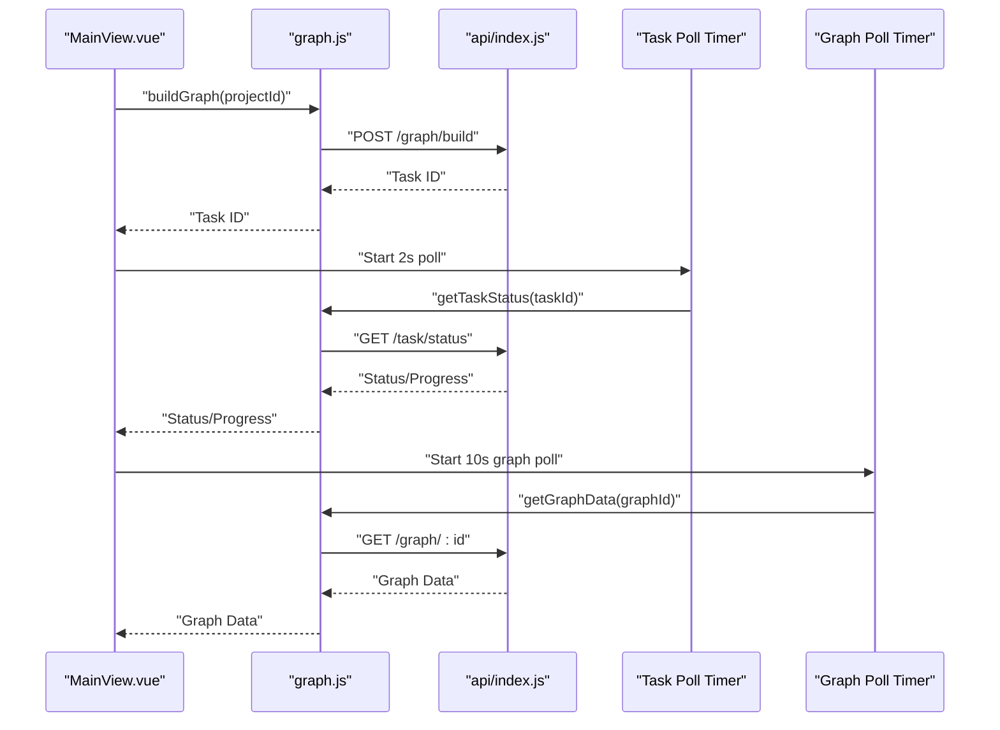
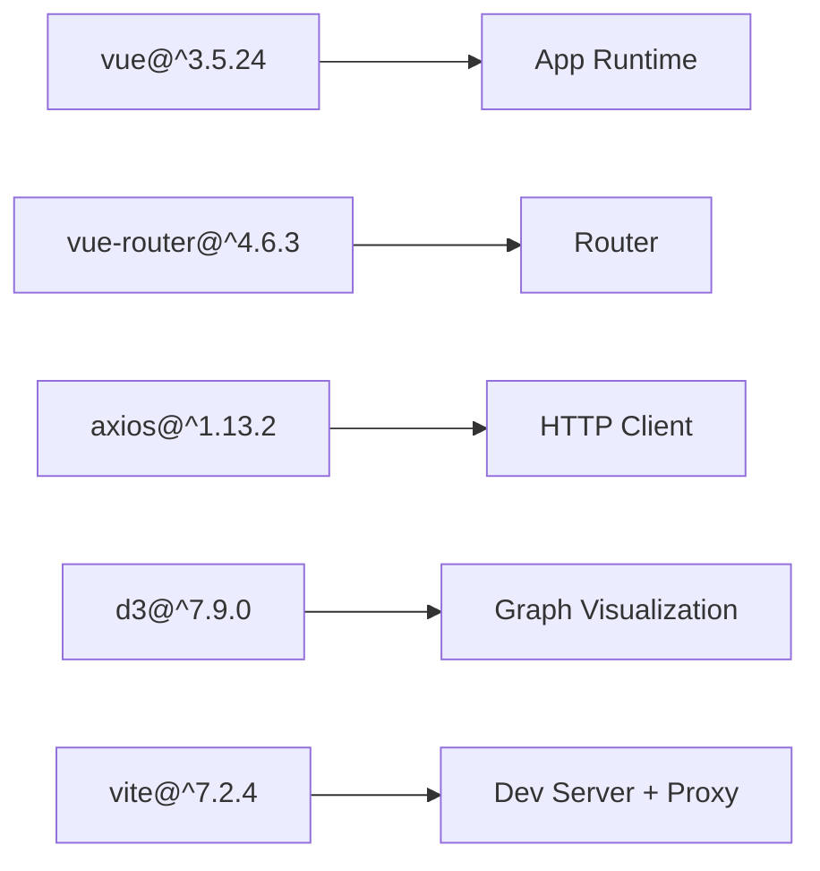

# Frontend Application

<cite>
**Referenced Files in This Document**
- [main.js](file://frontend/src/main.js)
- [App.vue](file://frontend/src/App.vue)
- [package.json](file://frontend/package.json)
- [vite.config.js](file://frontend/vite.config.js)
- [router/index.js](file://frontend/src/router/index.js)
- [api/index.js](file://frontend/src/api/index.js)
- [api/graph.js](file://frontend/src/api/graph.js)
- [store/pendingUpload.js](file://frontend/src/store/pendingUpload.js)
- [composables/useTheme.js](file://frontend/src/composables/useTheme.js)
- [styles/design-tokens.css](file://frontend/src/styles/design-tokens.css)
- [styles/components.css](file://frontend/src/styles/components.css)
- [views/Home.vue](file://frontend/src/views/Home.vue)
- [views/MainView.vue](file://frontend/src/views/MainView.vue)
- [views/SimulationView.vue](file://frontend/src/views/SimulationView.vue)
- [views/SimulationRunView.vue](file://frontend/src/views/SimulationRunView.vue)
- [views/ReportView.vue](file://frontend/src/views/ReportView.vue)
- [views/InteractionView.vue](file://frontend/src/views/InteractionView.vue)
- [components/AppShell.vue](file://frontend/src/components/AppShell.vue)
- [components/AppHeader.vue](file://frontend/src/components/AppHeader.vue)
- [components/ThemeToggle.vue](file://frontend/src/components/ThemeToggle.vue)
</cite>

## Table of Contents
1. [Introduction](#introduction)
2. [Project Structure](#project-structure)
3. [Core Components](#core-components)
4. [Architecture Overview](#architecture-overview)
5. [Detailed Component Analysis](#detailed-component-analysis)
6. [Dependency Analysis](#dependency-analysis)
7. [Performance Considerations](#performance-considerations)
8. [Troubleshooting Guide](#troubleshooting-guide)
9. [Conclusion](#conclusion)
10. [Appendices](#appendices)

## Introduction
This document describes the Vue.js 3.5+ frontend for Parallel World, focusing on the Composition API, Vite build tooling, component architecture, routing, API integration, state management, theming, responsiveness, accessibility, and real-time updates. The application provides a retro monospace terminal aesthetic with dark/light theme support, a multi-panel shell for graph visualization and step-based workflows, and robust integration with backend services via Axios.

## Project Structure
The frontend is organized around a clear separation of concerns:
- Entry point initializes the Vue app, registers the router, and loads global styles.
- Views represent page-level screens for the workflow.
- Components encapsulate UI building blocks and shell layout.
- Composables provide reusable logic (e.g., theme).
- Store holds temporary state for cross-route data passing.
- API module centralizes HTTP client configuration and retry logic.
- Styles define design tokens and shared component styles.

**Diagram sources**
- [main.js:1-15](file://frontend/src/main.js#L1-L15)
- [App.vue:1-8](file://frontend/src/App.vue#L1-L8)
- [router/index.js:1-53](file://frontend/src/router/index.js#L1-L53)
- [views/Home.vue:1-364](file://frontend/src/views/Home.vue#L1-L364)
- [views/MainView.vue:1-327](file://frontend/src/views/MainView.vue#L1-L327)
- [components/AppShell.vue:1-103](file://frontend/src/components/AppShell.vue#L1-L103)
- [components/AppHeader.vue:1-64](file://frontend/src/components/AppHeader.vue#L1-L64)
- [components/ThemeToggle.vue:1-38](file://frontend/src/components/ThemeToggle.vue#L1-L38)
- [store/pendingUpload.js:1-35](file://frontend/src/store/pendingUpload.js#L1-L35)
- [api/graph.js](file://frontend/src/api/graph.js)
- [api/index.js:1-68](file://frontend/src/api/index.js#L1-L68)
- [composables/useTheme.js:1-38](file://frontend/src/composables/useTheme.js#L1-L38)
- [styles/design-tokens.css:1-72](file://frontend/src/styles/design-tokens.css#L1-L72)
- [styles/components.css:1-295](file://frontend/src/styles/components.css#L1-L295)

**Section sources**
- [main.js:1-15](file://frontend/src/main.js#L1-L15)
- [App.vue:1-8](file://frontend/src/App.vue#L1-L8)
- [package.json:1-22](file://frontend/package.json#L1-L22)
- [vite.config.js:1-19](file://frontend/vite.config.js#L1-L19)
- [router/index.js:1-53](file://frontend/src/router/index.js#L1-L53)

## Core Components
- AppShell: Provides a two-panel layout with animated transitions, a status header, and a system log panel. It accepts slots for graph and workbench content and exposes a prop for view mode switching.
- AppHeader: Renders the brand and logo, integrates ThemeToggle, and supports navigation to the home route.
- ThemeToggle: A button that toggles the active theme and reflects the current mode via iconography.
- Pending Upload Store: A small reactive store to temporarily carry uploaded files and requirements from the home screen to the process view.
- Theme Composable: Encapsulates theme persistence and DOM attribute application for seamless dark/light switching.
- Design Tokens and Components CSS: Define a consistent retro monospace terminal aesthetic with typography, spacing, borders, and responsive breakpoints.

Key implementation patterns:
- Composition API: Reactive refs and computed values drive UI state and derived values.
- Slots and props: AppShell composes child components and passes data/state down.
- Local storage-backed theme: Theme preference persists across sessions.

**Section sources**
- [components/AppShell.vue:1-103](file://frontend/src/components/AppShell.vue#L1-L103)
- [components/AppHeader.vue:1-64](file://frontend/src/components/AppHeader.vue#L1-L64)
- [components/ThemeToggle.vue:1-38](file://frontend/src/components/ThemeToggle.vue#L1-L38)
- [store/pendingUpload.js:1-35](file://frontend/src/store/pendingUpload.js#L1-L35)
- [composables/useTheme.js:1-38](file://frontend/src/composables/useTheme.js#L1-L38)
- [styles/design-tokens.css:1-72](file://frontend/src/styles/design-tokens.css#L1-L72)
- [styles/components.css:1-295](file://frontend/src/styles/components.css#L1-L295)

## Architecture Overview
The frontend follows a layered architecture:
- Presentation Layer: Views and components render state and orchestrate user interactions.
- Routing Layer: Vue Router defines navigable pages and route parameters.
- API Integration Layer: Axios instance with interceptors and retry logic abstracts HTTP communication.
- State Management: Local reactive state for UI, a small store for cross-route data, and composables for cross-cutting concerns.
- Theming and Styles: CSS custom properties and media queries provide a cohesive design system.

**Diagram sources**
- [router/index.js:1-53](file://frontend/src/router/index.js#L1-L53)
- [api/index.js:1-68](file://frontend/src/api/index.js#L1-L68)
- [views/MainView.vue:42-327](file://frontend/src/views/MainView.vue#L42-L327)
- [store/pendingUpload.js:1-35](file://frontend/src/store/pendingUpload.js#L1-L35)
- [composables/useTheme.js:1-38](file://frontend/src/composables/useTheme.js#L1-L38)
- [styles/design-tokens.css:1-72](file://frontend/src/styles/design-tokens.css#L1-L72)
- [styles/components.css:1-295](file://frontend/src/styles/components.css#L1-L295)

## Detailed Component Analysis

### Routing System
Routes cover the primary application sections:
- Home: Upload files and requirements, initiate a new project.
- Process: Multi-step workflow for graph build and environment setup.
- Simulation: View simulation details.
- SimulationRun: Start and monitor simulation runs.
- Report: View generated reports.
- Interaction: Chat-like interaction with simulated entities.

Navigation uses named routes with dynamic parameters for project and simulation identifiers. History mode is configured for clean URLs.

**Diagram sources**
- [views/Home.vue:101-161](file://frontend/src/views/Home.vue#L101-L161)
- [router/index.js:9-44](file://frontend/src/router/index.js#L9-L44)
- [views/MainView.vue:119-198](file://frontend/src/views/MainView.vue#L119-L198)

**Section sources**
- [router/index.js:1-53](file://frontend/src/router/index.js#L1-L53)
- [views/Home.vue:101-161](file://frontend/src/views/Home.vue#L101-L161)
- [views/MainView.vue:119-198](file://frontend/src/views/MainView.vue#L119-L198)

### API Integration Layer
The Axios instance centralizes:
- Base URL resolution via environment variable.
- Request/response interceptors for unified error handling.
- A retry wrapper with exponential backoff.

**Diagram sources**
- [api/index.js:1-68](file://frontend/src/api/index.js#L1-L68)

**Section sources**
- [api/index.js:1-68](file://frontend/src/api/index.js#L1-L68)
- [api/graph.js](file://frontend/src/api/graph.js)

### State Management Patterns
- Local reactive state: Views maintain internal state using refs and computed values for UI logic and derived data.
- Cross-route data: Pending upload store carries files and requirements from Home to MainView.
- Theme state: Composable manages theme preference and applies it to the document element.

**Diagram sources**
- [views/Home.vue:154-160](file://frontend/src/views/Home.vue#L154-L160)
- [store/pendingUpload.js:14-26](file://frontend/src/store/pendingUpload.js#L14-L26)
- [views/MainView.vue:129-134](file://frontend/src/views/MainView.vue#L129-L134)

**Section sources**
- [views/MainView.vue:42-327](file://frontend/src/views/MainView.vue#L42-L327)
- [store/pendingUpload.js:1-35](file://frontend/src/store/pendingUpload.js#L1-L35)
- [composables/useTheme.js:1-38](file://frontend/src/composables/useTheme.js#L1-L38)

### Theming System and Accessibility
- Theme Toggle: Uses a composable to persist and apply theme preferences. The document element receives a data-theme attribute for CSS scoping.
- Design Tokens: Centralized CSS variables define colors, typography, spacing, borders, layout sizes, and transitions.
- Accessibility: Buttons and inputs use monospace fonts, clear labels, and visible focus states. Icons are accompanied by titles for assistive technologies.

**Diagram sources**
- [components/ThemeToggle.vue:1-38](file://frontend/src/components/ThemeToggle.vue#L1-L38)
- [composables/useTheme.js:16-31](file://frontend/src/composables/useTheme.js#L16-L31)
- [styles/design-tokens.css:58-72](file://frontend/src/styles/design-tokens.css#L58-L72)

**Section sources**
- [components/ThemeToggle.vue:1-38](file://frontend/src/components/ThemeToggle.vue#L1-L38)
- [composables/useTheme.js:1-38](file://frontend/src/composables/useTheme.js#L1-L38)
- [styles/design-tokens.css:1-72](file://frontend/src/styles/design-tokens.css#L1-L72)
- [styles/components.css:17-34](file://frontend/src/styles/components.css#L17-L34)

### Real-time Updates and Progress Monitoring
- Polling tasks: Periodic checks for task status and progress during graph build.
- Graph polling: Regular fetches for graph data while the project is in a live state.
- System logs: Aggregated logs with timestamps and capped length for UI feedback.
- Status indicators: Derived status from phase and errors; visual status dots and progress bars.

**Diagram sources**
- [views/MainView.vue:254-289](file://frontend/src/views/MainView.vue#L254-L289)
- [views/MainView.vue:231-252](file://frontend/src/views/MainView.vue#L231-L252)
- [api/graph.js](file://frontend/src/api/graph.js)
- [api/index.js:1-68](file://frontend/src/api/index.js#L1-L68)

**Section sources**
- [views/MainView.vue:231-289](file://frontend/src/views/MainView.vue#L231-L289)
- [api/graph.js](file://frontend/src/api/graph.js)

### Component Usage Examples and Integration Patterns
- AppShell usage: Pass step number/name/status, bind viewMode, and slot graph/workbench content.
- ThemeToggle usage: Import and place in headers; it automatically reads and toggles theme.
- Pending upload integration: On Home submit, store files and requirement; navigate to process route; retrieve and clear on MainView mount.
- API integration: Import graph APIs in views; wrap calls with retry where appropriate; handle success/error branches; update reactive state accordingly.

Integration tips:
- Keep API calls centralized in dedicated modules for reuse.
- Use computed values for derived UI state to minimize re-renders.
- Clean up timers on unmount to prevent memory leaks.

**Section sources**
- [components/AppShell.vue:33-53](file://frontend/src/components/AppShell.vue#L33-L53)
- [components/ThemeToggle.vue:8-12](file://frontend/src/components/ThemeToggle.vue#L8-L12)
- [views/Home.vue:154-160](file://frontend/src/views/Home.vue#L154-L160)
- [views/MainView.vue:129-198](file://frontend/src/views/MainView.vue#L129-L198)
- [api/index.js:54-65](file://frontend/src/api/index.js#L54-L65)

## Dependency Analysis
External dependencies include Vue 3.5+, Vue Router 4.x, Axios, and D3. Vite is used for development and production builds with a dev server proxy configured to forward API requests to the backend.

**Diagram sources**
- [package.json:11-20](file://frontend/package.json#L11-L20)
- [vite.config.js:7-17](file://frontend/vite.config.js#L7-L17)

**Section sources**
- [package.json:1-22](file://frontend/package.json#L1-L22)
- [vite.config.js:1-19](file://frontend/vite.config.js#L1-L19)

## Performance Considerations
- Polling cadence: Adjust intervals based on backend throughput and UI responsiveness needs.
- Graph data fetching: Debounce or throttle frequent refreshes; cache last-known good state.
- Rendering: Prefer computed values for derived data; avoid unnecessary deep watchers.
- Assets: Lazy-load heavy components or views when feasible.
- Network timeouts: Tune Axios timeout and retry backoff to balance reliability and perceived performance.

## Troubleshooting Guide
Common issues and resolutions:
- Network errors: Verify backend availability and CORS/proxy settings; check console logs for network failures.
- Timeout errors: Increase Axios timeout for long-running tasks; implement user feedback during extended waits.
- Theme not applying: Confirm data-theme attribute is present on document element and CSS selectors match.
- Polling not stopping: Ensure timers are cleared on component unmount to prevent memory leaks.
- Missing pending data: Validate that pending upload store is accessed and cleared appropriately across route transitions.

**Section sources**
- [api/index.js:23-51](file://frontend/src/api/index.js#L23-L51)
- [views/MainView.vue:316-322](file://frontend/src/views/MainView.vue#L316-L322)
- [composables/useTheme.js:16-31](file://frontend/src/composables/useTheme.js#L16-L31)

## Conclusion
The Parallel World frontend leverages Vue 3.5+ and the Composition API to deliver a structured, theme-aware, and responsive interface. Its modular architecture—comprising views, components, a robust API layer, and simple state management—supports a complex workflow spanning graph building, simulation runs, reporting, and interactive sessions. The design system and real-time update mechanisms provide a cohesive user experience aligned with the project’s terminal-inspired aesthetic.

## Appendices
- Environment configuration: The Vite dev server proxies API requests to the backend on port 5001. Adjust the proxy target in development as needed.
- Build and preview: Use npm/yarn scripts to develop, build, and preview the application locally.

**Section sources**
- [vite.config.js:10-16](file://frontend/vite.config.js#L10-L16)
- [package.json:6-10](file://frontend/package.json#L6-L10)