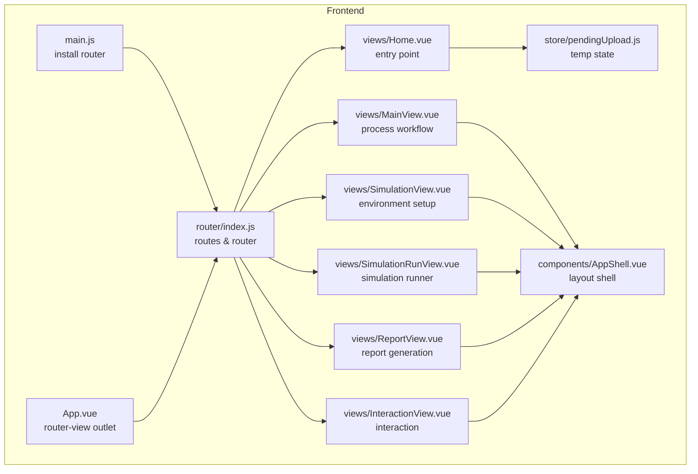
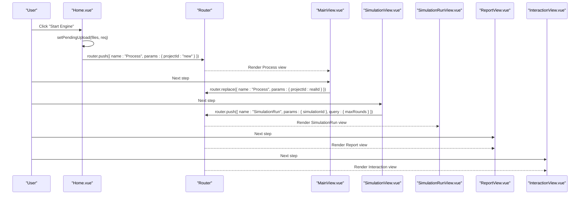
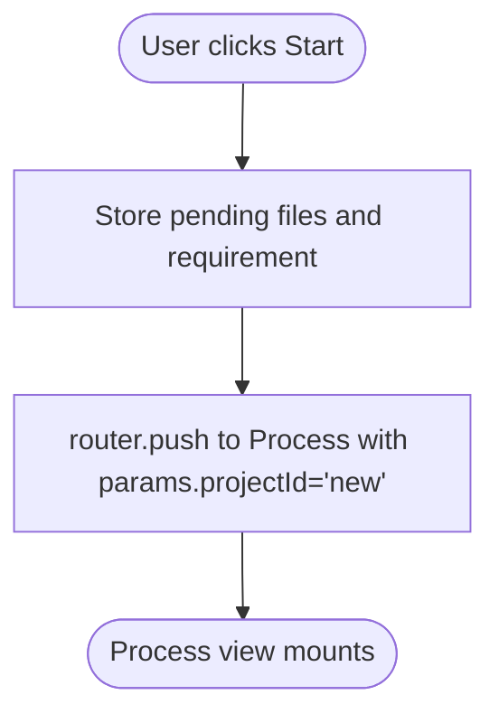
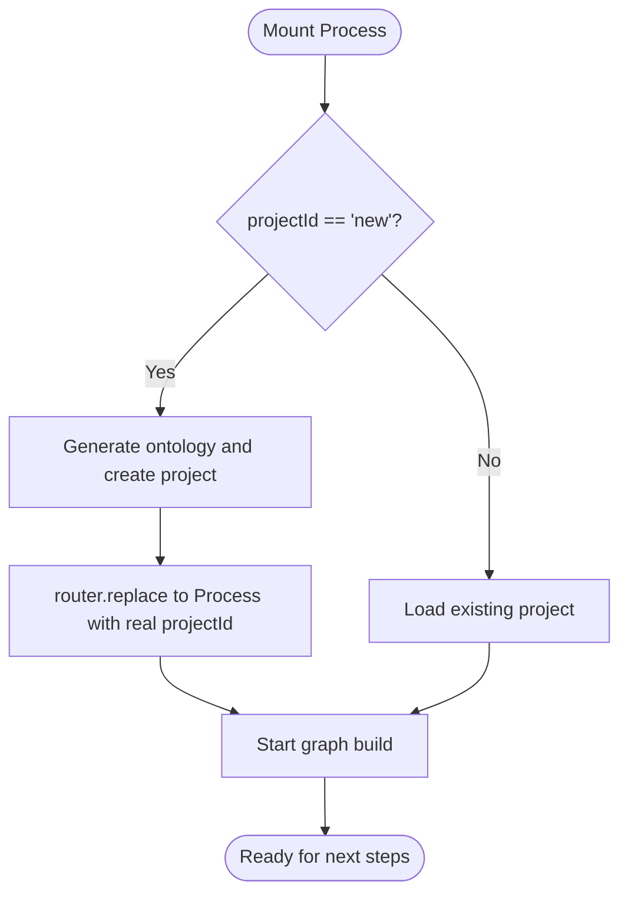
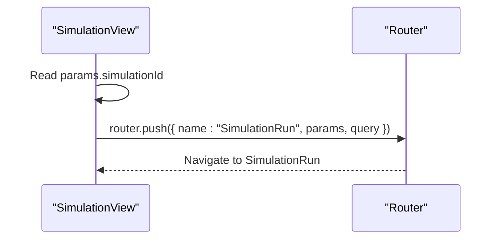
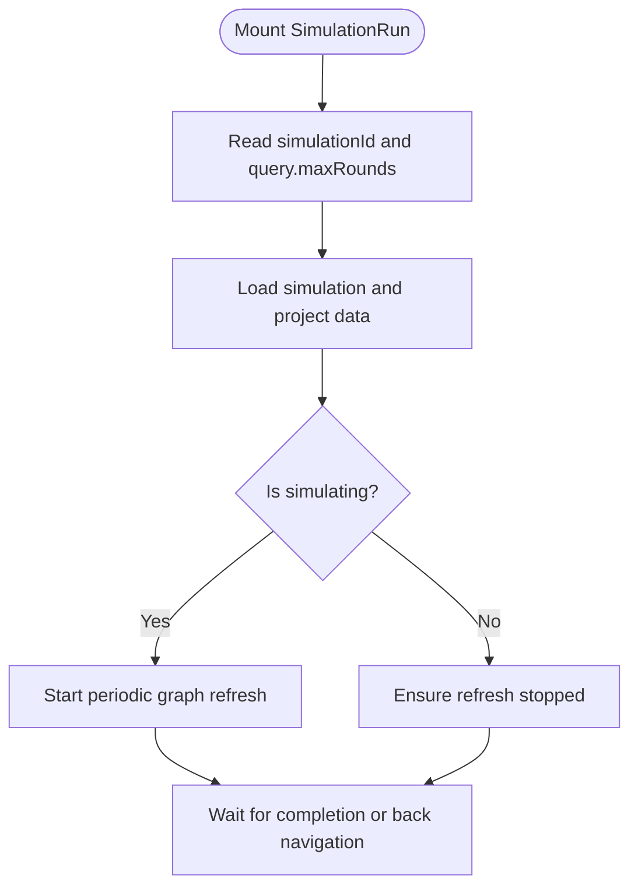
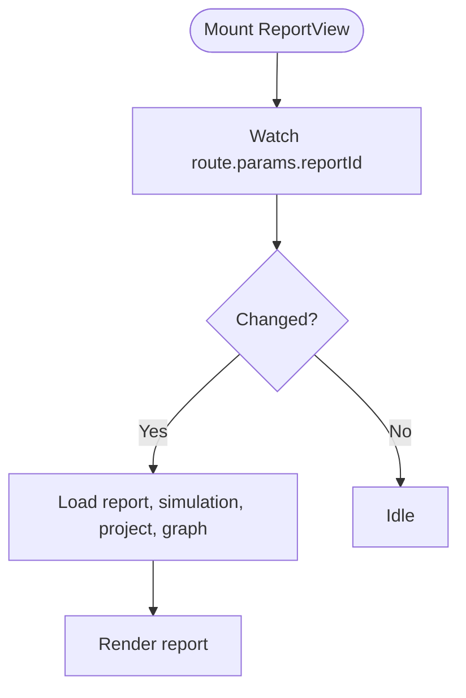
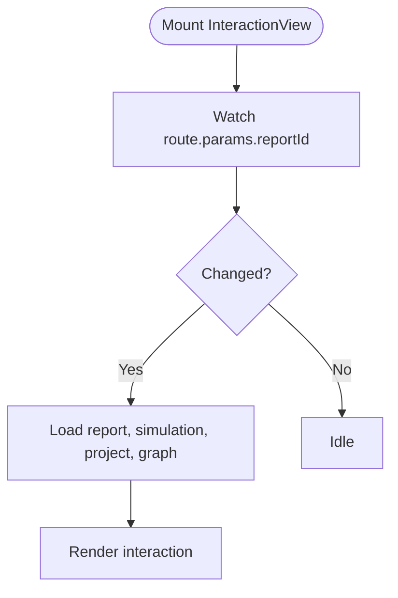
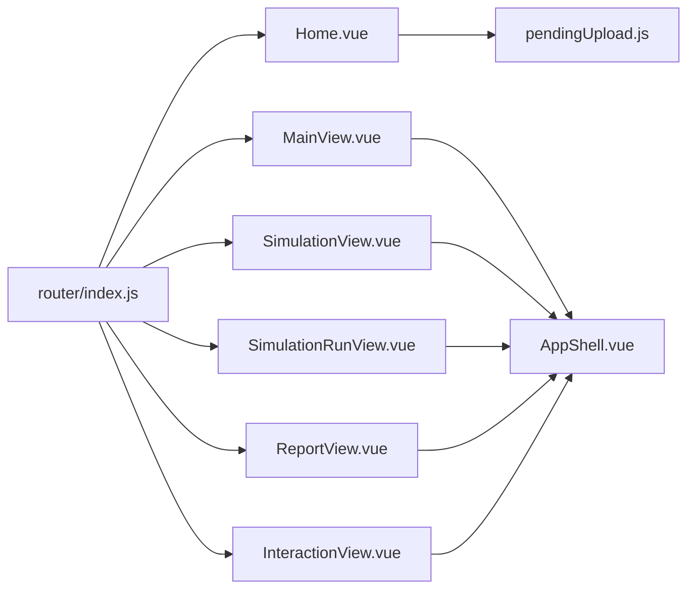

# Routing System

<cite>
**Referenced Files in This Document**
- [router/index.js](file://frontend/src/router/index.js)
- [main.js](file://frontend/src/main.js)
- [App.vue](file://frontend/src/App.vue)
- [Home.vue](file://frontend/src/views/Home.vue)
- [MainView.vue](file://frontend/src/views/MainView.vue)
- [SimulationView.vue](file://frontend/src/views/SimulationView.vue)
- [SimulationRunView.vue](file://frontend/src/views/SimulationRunView.vue)
- [ReportView.vue](file://frontend/src/views/ReportView.vue)
- [InteractionView.vue](file://frontend/src/views/InteractionView.vue)
- [AppShell.vue](file://frontend/src/components/AppShell.vue)
- [pendingUpload.js](file://frontend/src/store/pendingUpload.js)
- [package.json](file://frontend/package.json)
</cite>

## Table of Contents
1. [Introduction](#introduction)
2. [Project Structure](#project-structure)
3. [Core Components](#core-components)
4. [Architecture Overview](#architecture-overview)
5. [Detailed Component Analysis](#detailed-component-analysis)
6. [Dependency Analysis](#dependency-analysis)
7. [Performance Considerations](#performance-considerations)
8. [Troubleshooting Guide](#troubleshooting-guide)
9. [Conclusion](#conclusion)

## Introduction
This document explains the Vue Router implementation and navigation system used by the frontend application. It covers route configuration, navigation patterns, dynamic route generation, and how routes integrate with application state. It also documents the view components involved in the workflow and provides guidance for extending the routing system, including adding new routes, implementing guards, and handling navigation errors. Finally, it outlines responsive navigation patterns and mobile-friendly routing behavior.

## Project Structure
The routing system is centered around a single router definition that declares static routes for the application’s primary views. Navigation is driven programmatically via the Vue Router API within components, and state is shared through a small reactive store for pending uploads.

**Diagram sources**
- [main.js:1-15](file://frontend/src/main.js#L1-L15)
- [App.vue:1-8](file://frontend/src/App.vue#L1-L8)
- [router/index.js:1-53](file://frontend/src/router/index.js#L1-L53)
- [Home.vue:1-364](file://frontend/src/views/Home.vue#L1-L364)
- [MainView.vue:1-327](file://frontend/src/views/MainView.vue#L1-L327)
- [SimulationView.vue:1-180](file://frontend/src/views/SimulationView.vue#L1-L180)
- [SimulationRunView.vue:1-195](file://frontend/src/views/SimulationRunView.vue#L1-L195)
- [ReportView.vue:1-128](file://frontend/src/views/ReportView.vue#L1-L128)
- [InteractionView.vue:1-129](file://frontend/src/views/InteractionView.vue#L1-L129)
- [AppShell.vue:1-103](file://frontend/src/components/AppShell.vue#L1-L103)
- [pendingUpload.js:1-35](file://frontend/src/store/pendingUpload.js#L1-L35)

**Section sources**
- [main.js:1-15](file://frontend/src/main.js#L1-L15)
- [router/index.js:1-53](file://frontend/src/router/index.js#L1-L53)

## Core Components
- Router definition and routes: Declares static routes for Home, Process, Simulation, SimulationRun, Report, and Interaction views. Dynamic segments are used for project and simulation identifiers.
- Programmatic navigation: Components navigate using router.push and router.replace with named routes and parameterized paths.
- Route parameters and query handling: Components read route.params and route.query to configure behavior (e.g., simulation rounds).
- Application state integration: A temporary store holds pending uploads to bridge the Home view to the Process view without an immediate API call.

Key routing capabilities:
- Named routes for predictable navigation.
- Dynamic segments for resource IDs.
- Query string parameters for optional runtime configuration.
- Programmatic navigation with replace vs push semantics depending on intent.

**Section sources**
- [router/index.js:9-45](file://frontend/src/router/index.js#L9-L45)
- [Home.vue:154-160](file://frontend/src/views/Home.vue#L154-L160)
- [MainView.vue:128-166](file://frontend/src/views/MainView.vue#L128-L166)
- [SimulationView.vue:81-99](file://frontend/src/views/SimulationView.vue#L81-L99)
- [SimulationRunView.vue:52](file://frontend/src/views/SimulationRunView.vue#L52)
- [ReportView.vue:116-121](file://frontend/src/views/ReportView.vue#L116-L121)
- [InteractionView.vue:117-122](file://frontend/src/views/InteractionView.vue#L117-L122)
- [pendingUpload.js:14-32](file://frontend/src/store/pendingUpload.js#L14-L32)

## Architecture Overview
The routing architecture is straightforward: a central router instance defines routes and history mode. Views are rendered inside a top-level outlet and coordinate navigation among themselves. State transitions are driven by route changes and user actions.

**Diagram sources**
- [Home.vue:154-160](file://frontend/src/views/Home.vue#L154-L160)
- [MainView.vue:128-166](file://frontend/src/views/MainView.vue#L128-L166)
- [SimulationView.vue:81-99](file://frontend/src/views/SimulationView.vue#L81-L99)
- [SimulationRunView.vue:120-149](file://frontend/src/views/SimulationRunView.vue#L120-L149)
- [ReportView.vue:116-121](file://frontend/src/views/ReportView.vue#L116-L121)
- [InteractionView.vue:117-122](file://frontend/src/views/InteractionView.vue#L117-L122)
- [router/index.js:9-45](file://frontend/src/router/index.js#L9-L45)

## Detailed Component Analysis

### Route Configuration and Navigation Guards
- Routes are defined statically with path templates, names, and component bindings.
- There are no global or route-level navigation guards in the current implementation.
- Guards can be added later at the route level or globally via beforeEach if needed.

Route summary:
- Home: renders the landing page.
- Process: handles project lifecycle with dynamic projectId.
- Simulation: environment setup with dynamic simulationId.
- SimulationRun: runs simulations with optional maxRounds query parameter.
- Report: displays reports linked to simulationId.
- Interaction: allows interaction with simulated entities via reportId.

Navigation patterns:
- Programmatic navigation uses router.push for forward steps and router.replace for in-place updates.
- Back navigation uses router.push with appropriate targets.

**Section sources**
- [router/index.js:9-45](file://frontend/src/router/index.js#L9-L45)
- [MainView.vue:152](file://frontend/src/views/MainView.vue#L152)
- [SimulationView.vue:73-79](file://frontend/src/views/SimulationView.vue#L73-L79)
- [SimulationRunView.vue:80-114](file://frontend/src/views/SimulationRunView.vue#L80-L114)

### Home View
- Purpose: initial entry point; collects files and requirements.
- Behavior: stores pending upload data and navigates to the Process view using a named route with a special projectId value to signal creation flow.

**Diagram sources**
- [Home.vue:154-160](file://frontend/src/views/Home.vue#L154-L160)
- [pendingUpload.js:14-18](file://frontend/src/store/pendingUpload.js#L14-L18)

**Section sources**
- [Home.vue:154-160](file://frontend/src/views/Home.vue#L154-L160)
- [pendingUpload.js:14-18](file://frontend/src/store/pendingUpload.js#L14-L18)

### Main View (Process)
- Purpose: orchestrates the project workflow (graph build, environment setup, simulation, report, interaction).
- Behavior: reads route.params.projectId; supports both new and existing projects; replaces route after creation to reflect real IDs.

**Diagram sources**
- [MainView.vue:119-166](file://frontend/src/views/MainView.vue#L119-L166)
- [MainView.vue:152](file://frontend/src/views/MainView.vue#L152)

**Section sources**
- [MainView.vue:63-63](file://frontend/src/views/MainView.vue#L63-L63)
- [MainView.vue:119-166](file://frontend/src/views/MainView.vue#L119-L166)
- [MainView.vue:152](file://frontend/src/views/MainView.vue#L152)

### Simulation View
- Purpose: environment setup prior to simulation.
- Behavior: reads route.params.simulationId; navigates to SimulationRun with optional query parameters.

**Diagram sources**
- [SimulationView.vue:48](file://frontend/src/views/SimulationView.vue#L48)
- [SimulationView.vue:81-99](file://frontend/src/views/SimulationView.vue#L81-L99)

**Section sources**
- [SimulationView.vue:48](file://frontend/src/views/SimulationView.vue#L48)
- [SimulationView.vue:81-99](file://frontend/src/views/SimulationView.vue#L81-L99)

### Simulation Run View
- Purpose: runs simulations and optionally refreshes graph data in real time.
- Behavior: reads route.params.simulationId and route.query.maxRounds; manages simulation lifecycle and graph refresh intervals.

**Diagram sources**
- [SimulationRunView.vue:52](file://frontend/src/views/SimulationRunView.vue#L52)
- [SimulationRunView.vue:120-149](file://frontend/src/views/SimulationRunView.vue#L120-L149)
- [SimulationRunView.vue:170-185](file://frontend/src/views/SimulationRunView.vue#L170-L185)

**Section sources**
- [SimulationRunView.vue:52](file://frontend/src/views/SimulationRunView.vue#L52)
- [SimulationRunView.vue:120-149](file://frontend/src/views/SimulationRunView.vue#L120-L149)
- [SimulationRunView.vue:170-185](file://frontend/src/views/SimulationRunView.vue#L170-L185)

### Report View
- Purpose: displays simulation reports and loads associated graph data.
- Behavior: watches route.params.reportId and reloads data when it changes.

**Diagram sources**
- [ReportView.vue:116-121](file://frontend/src/views/ReportView.vue#L116-L121)
- [ReportView.vue:73-98](file://frontend/src/views/ReportView.vue#L73-L98)

**Section sources**
- [ReportView.vue:116-121](file://frontend/src/views/ReportView.vue#L116-L121)
- [ReportView.vue:73-98](file://frontend/src/views/ReportView.vue#L73-L98)

### Interaction View
- Purpose: enables interaction with simulated entities via reportId.
- Behavior: mirrors ReportView’s pattern for loading data based on route.params.reportId.

**Diagram sources**
- [InteractionView.vue:117-122](file://frontend/src/views/InteractionView.vue#L117-L122)
- [InteractionView.vue:74-99](file://frontend/src/views/InteractionView.vue#L74-L99)

**Section sources**
- [InteractionView.vue:117-122](file://frontend/src/views/InteractionView.vue#L117-L122)
- [InteractionView.vue:74-99](file://frontend/src/views/InteractionView.vue#L74-L99)

### AppShell Integration
- All views render within AppShell, which provides layout scaffolding, status indicators, and a view switcher.
- Views communicate logs upward via a shared array to keep the UI informed of asynchronous operations.

**Section sources**
- [AppShell.vue:1-103](file://frontend/src/components/AppShell.vue#L1-L103)
- [MainView.vue:93-99](file://frontend/src/views/MainView.vue#L93-L99)
- [SimulationView.vue:61-65](file://frontend/src/views/SimulationView.vue#L61-L65)
- [ReportView.vue:61-65](file://frontend/src/views/ReportView.vue#L61-L65)
- [InteractionView.vue:62-66](file://frontend/src/views/InteractionView.vue#L62-L66)

## Dependency Analysis
- Router depends on Vue Router and the history API.
- Views depend on the router for navigation and on the route for parameters/query.
- State integration occurs via a small reactive store for pending uploads.
- The outlet in App.vue renders the active view based on the current route.

**Diagram sources**
- [router/index.js:1-53](file://frontend/src/router/index.js#L1-L53)
- [Home.vue:154-160](file://frontend/src/views/Home.vue#L154-L160)
- [MainView.vue:1-327](file://frontend/src/views/MainView.vue#L1-L327)
- [SimulationView.vue:1-180](file://frontend/src/views/SimulationView.vue#L1-L180)
- [SimulationRunView.vue:1-195](file://frontend/src/views/SimulationRunView.vue#L1-L195)
- [ReportView.vue:1-128](file://frontend/src/views/ReportView.vue#L1-L128)
- [InteractionView.vue:1-129](file://frontend/src/views/InteractionView.vue#L1-L129)
- [pendingUpload.js:1-35](file://frontend/src/store/pendingUpload.js#L1-L35)
- [AppShell.vue:1-103](file://frontend/src/components/AppShell.vue#L1-L103)

**Section sources**
- [package.json:11-20](file://frontend/package.json#L11-L20)
- [main.js:1-15](file://frontend/src/main.js#L1-L15)
- [App.vue:1-8](file://frontend/src/App.vue#L1-L8)

## Performance Considerations
- Route transitions are lightweight; avoid heavy synchronous work in route handlers.
- Prefer lazy-loading components for large views if bundle size becomes a concern.
- Debounce or throttle frequent polling in views (already implemented via intervals) and cancel timers on unmount.
- Use router.replace judiciously to avoid polluting browser history when updating route parameters in place.

## Troubleshooting Guide
Common issues and resolutions:
- Navigation to invalid IDs: Ensure route guards validate params and redirect to safe fallbacks.
- Stale data after navigation: Use watchers on route.params to reload data when IDs change.
- Memory leaks from timers: Always clear intervals and timeouts in onUnmounted hooks.
- Pending uploads not persisted: The pending store is in-memory; consider persistence if needed across sessions.

**Section sources**
- [ReportView.vue:116-121](file://frontend/src/views/ReportView.vue#L116-L121)
- [InteractionView.vue:117-122](file://frontend/src/views/InteractionView.vue#L117-L122)
- [MainView.vue:316-322](file://frontend/src/views/MainView.vue#L316-L322)
- [SimulationRunView.vue:170-185](file://frontend/src/views/SimulationRunView.vue#L170-L185)

## Conclusion
The routing system is intentionally simple and effective for the current workflow. Static routes with named targets and dynamic segments cover the domain needs. Programmatic navigation integrates tightly with view lifecycle and state, while minimal guards and watchers keep the system maintainable. Extending the system involves adding new routes, implementing guards, and leveraging route params and queries for runtime configuration.