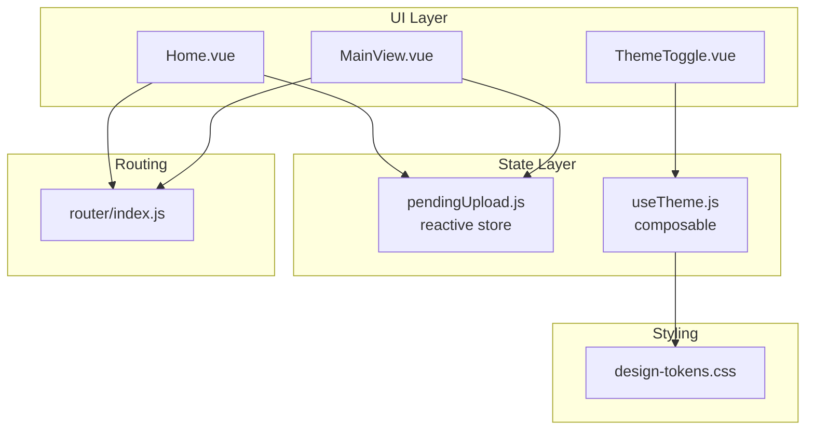
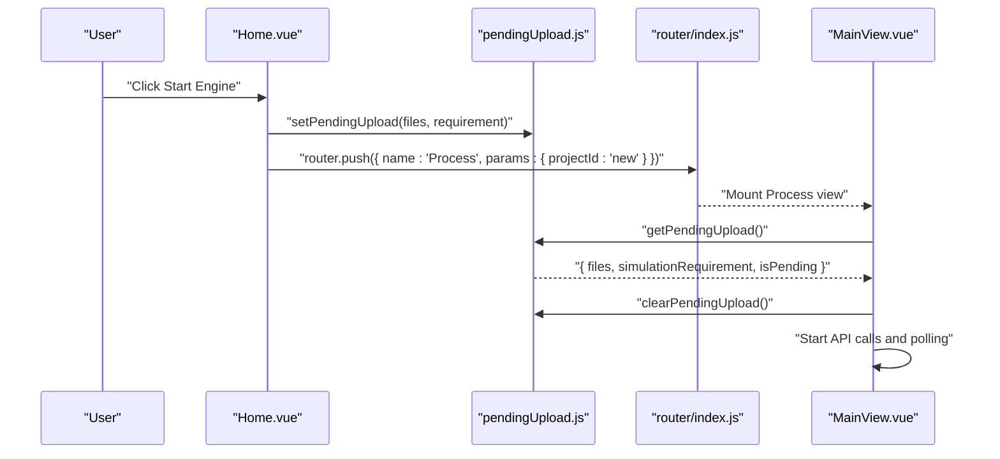
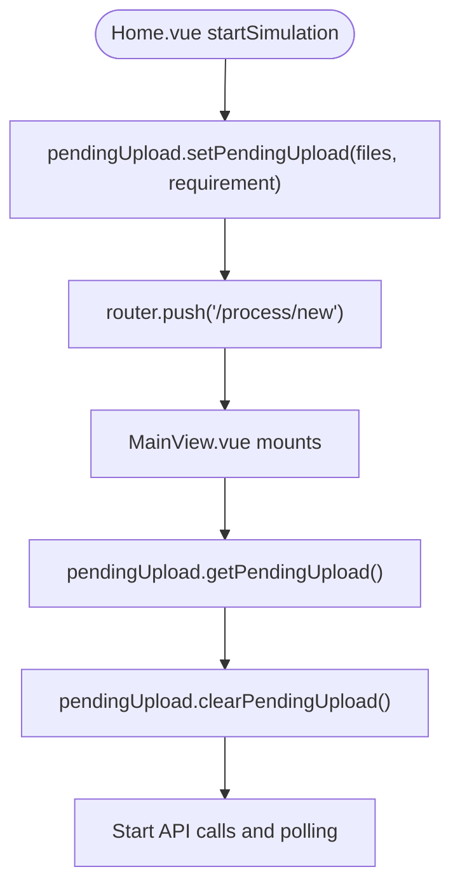
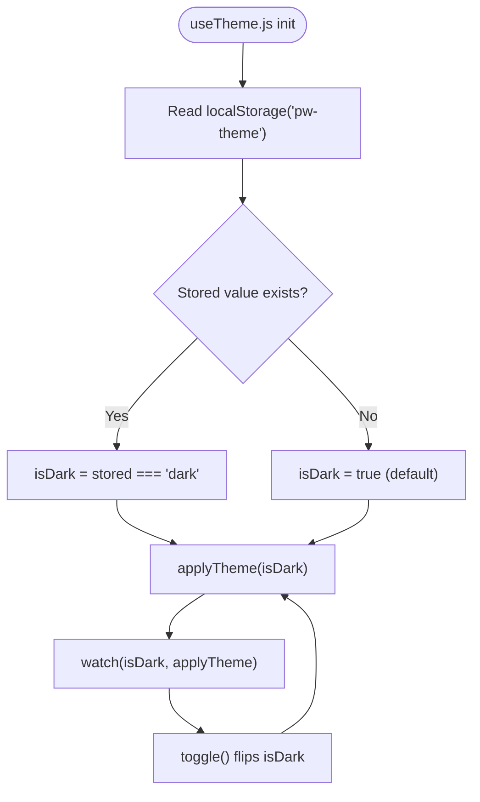
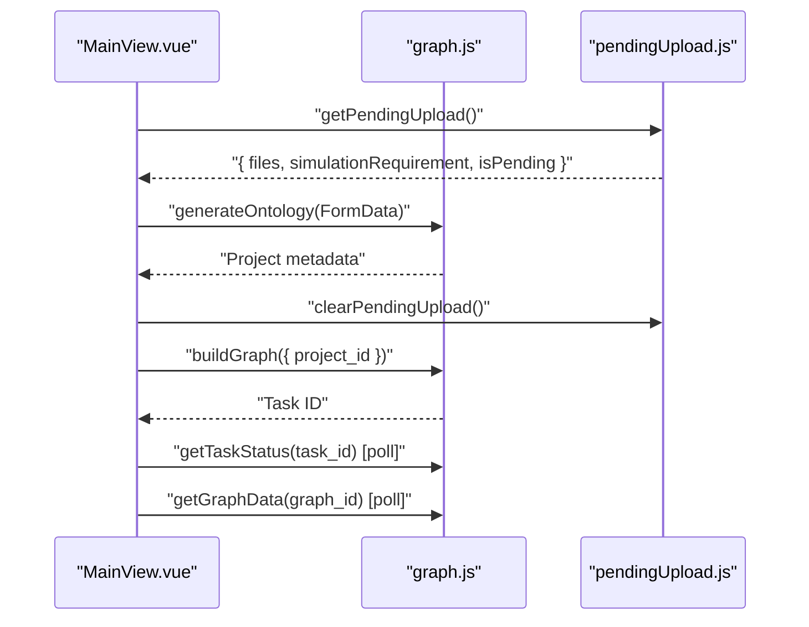
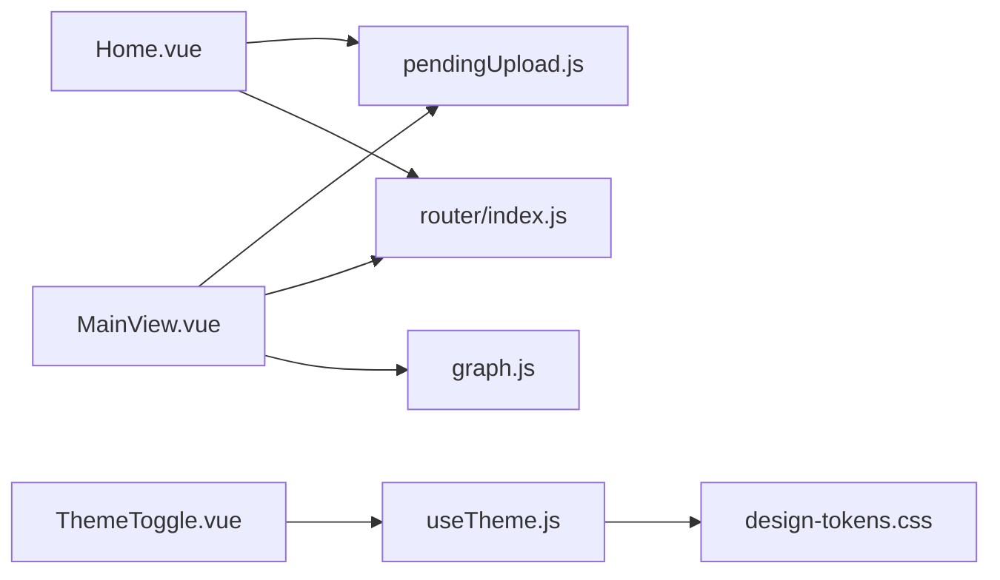

# State Management

<cite>
**Referenced Files in This Document**
- [pendingUpload.js](file://frontend/src/store/pendingUpload.js)
- [useTheme.js](file://frontend/src/composables/useTheme.js)
- [Home.vue](file://frontend/src/views/Home.vue)
- [MainView.vue](file://frontend/src/views/MainView.vue)
- [ThemeToggle.vue](file://frontend/src/components/ThemeToggle.vue)
- [design-tokens.css](file://frontend/src/styles/design-tokens.css)
- [graph.js](file://frontend/src/api/graph.js)
- [index.js](file://frontend/src/router/index.js)
- [main.js](file://frontend/src/main.js)
- [App.vue](file://frontend/src/App.vue)
</cite>

## Table of Contents
1. [Introduction](#introduction)
2. [Project Structure](#project-structure)
3. [Core Components](#core-components)
4. [Architecture Overview](#architecture-overview)
5. [Detailed Component Analysis](#detailed-component-analysis)
6. [Dependency Analysis](#dependency-analysis)
7. [Performance Considerations](#performance-considerations)
8. [Troubleshooting Guide](#troubleshooting-guide)
9. [Conclusion](#conclusion)

## Introduction
This document explains the frontend state management approach in the Vue application, focusing on Vue’s reactivity primitives, custom composables, and minimal centralized stores. It covers:
- The pendingUpload store for managing file upload states and cross-route data transfer
- The useTheme composable for theme switching and persistence
- Reactive state patterns, computed properties, and watchers
- Integration between local component state and global store management
- Practical examples of state persistence, synchronization with backend APIs, and error handling
- Best practices and performance considerations for large-scale applications

## Project Structure
The frontend uses a lightweight state management model:
- Local component refs and computed properties for UI and transient state
- A small reactive store for cross-route data transfer
- A composable for theme state with persistence via localStorage
- Router-driven navigation to coordinate state transitions

**Diagram sources**
- [Home.vue:101-161](file://frontend/src/views/Home.vue#L101-L161)
- [MainView.vue:42-327](file://frontend/src/views/MainView.vue#L42-L327)
- [ThemeToggle.vue:8-12](file://frontend/src/components/ThemeToggle.vue#L8-L12)
- [pendingUpload.js:1-35](file://frontend/src/store/pendingUpload.js#L1-L35)
- [useTheme.js:1-38](file://frontend/src/composables/useTheme.js#L1-L38)
- [index.js:1-53](file://frontend/src/router/index.js#L1-L53)
- [design-tokens.css:1-72](file://frontend/src/styles/design-tokens.css#L1-L72)

**Section sources**
- [main.js:1-15](file://frontend/src/main.js#L1-L15)
- [App.vue:1-8](file://frontend/src/App.vue#L1-L8)
- [index.js:1-53](file://frontend/src/router/index.js#L1-L53)

## Core Components
- Pending Upload Store: A minimal reactive store that holds files and simulation requirement temporarily until the process view consumes and clears it.
- Theme Composable: A composable that manages theme state, persists it to localStorage, and applies the theme to the document element.

Key characteristics:
- Uses Vue’s reactive primitives for state
- Exports functions to mutate and read state
- Encapsulates persistence and DOM updates

**Section sources**
- [pendingUpload.js:1-35](file://frontend/src/store/pendingUpload.js#L1-L35)
- [useTheme.js:1-38](file://frontend/src/composables/useTheme.js#L1-L38)

## Architecture Overview
The state lifecycle spans three stages:
1. Capture: The Home view captures user input and files and stores them in the pendingUpload store.
2. Navigation: The router navigates to the process view.
3. Consumption: The process view reads the pending data, clears it, and starts asynchronous operations.

**Diagram sources**
- [Home.vue:154-160](file://frontend/src/views/Home.vue#L154-L160)
- [pendingUpload.js:14-32](file://frontend/src/store/pendingUpload.js#L14-L32)
- [index.js:15-20](file://frontend/src/router/index.js#L15-L20)
- [MainView.vue:129-148](file://frontend/src/views/MainView.vue#L129-L148)

## Detailed Component Analysis

### Pending Upload Store
Purpose:
- Persist files and simulation requirement across a route transition so the process view can immediately start work without re-uploading.

Reactive state:
- files: array of File objects
- simulationRequirement: string describing the scenario
- isPending: boolean flag indicating presence of pending data

Mutations:
- setPendingUpload(files, requirement): sets state and marks pending
- clearPendingUpload(): resets state
- getPendingUpload(): returns a snapshot of current state

Integration:
- Home view calls setPendingUpload and navigates to the process route
- Process view reads pending data, clears it, and proceeds with API calls

**Diagram sources**
- [Home.vue:154-160](file://frontend/src/views/Home.vue#L154-L160)
- [pendingUpload.js:14-32](file://frontend/src/store/pendingUpload.js#L14-L32)
- [MainView.vue:129-148](file://frontend/src/views/MainView.vue#L129-L148)

**Section sources**
- [pendingUpload.js:1-35](file://frontend/src/store/pendingUpload.js#L1-L35)
- [Home.vue:154-160](file://frontend/src/views/Home.vue#L154-L160)
- [MainView.vue:129-148](file://frontend/src/views/MainView.vue#L129-L148)

### Theme Composable (useTheme)
Purpose:
- Manage theme state (dark/light) with persistence and immediate DOM application.

Implementation highlights:
- Persistent storage key: pw-theme
- Reads localStorage on initialization; defaults to dark
- Applies data-theme attribute to documentElement and writes preference to localStorage
- Exposes isDark ref and toggle function; a watcher reacts to isDark changes

Integration:
- ThemeToggle component consumes useTheme to render icons and toggle state
- design-tokens.css switches colors based on data-theme

**Diagram sources**
- [useTheme.js:1-38](file://frontend/src/composables/useTheme.js#L1-L38)
- [ThemeToggle.vue:8-12](file://frontend/src/components/ThemeToggle.vue#L8-L12)
- [design-tokens.css:58-71](file://frontend/src/styles/design-tokens.css#L58-L71)

**Section sources**
- [useTheme.js:1-38](file://frontend/src/composables/useTheme.js#L1-L38)
- [ThemeToggle.vue:1-38](file://frontend/src/components/ThemeToggle.vue#L1-L38)
- [design-tokens.css:1-72](file://frontend/src/styles/design-tokens.css#L1-L72)

### Reactive State Patterns Across Views
- Local refs for UI state (e.g., Home.vue files, formData, loading, drag state)
- Computed properties derived from refs (e.g., Home.vue canSubmit, logo selection)
- Composition API hooks for lifecycle and side effects (e.g., MainView.vue onMounted/onUnmounted for polling cleanup)

Example patterns:
- Computed for enabling/disabling controls based on form validity and file presence
- Computed for derived UI state (shell status) from internal flags
- Watchers in composables for side effects (theme application)

**Section sources**
- [Home.vue:101-161](file://frontend/src/views/Home.vue#L101-L161)
- [MainView.vue:42-327](file://frontend/src/views/MainView.vue#L42-L327)
- [useTheme.js:24-37](file://frontend/src/composables/useTheme.js#L24-L37)

### State Persistence and Backend Synchronization
Persistence:
- Theme preference persisted to localStorage via the theme composable
- Pending upload data persisted in memory via the reactive store during navigation

Backend synchronization:
- MainView.vue orchestrates asynchronous operations:
  - Fetches project status and graph data
  - Polls task status and graph availability
  - Clears pending upload after successful ingestion
- API module encapsulates requests for graph operations

**Diagram sources**
- [MainView.vue:129-148](file://frontend/src/views/MainView.vue#L129-L148)
- [MainView.vue:254-289](file://frontend/src/views/MainView.vue#L254-L289)
- [MainView.vue:231-252](file://frontend/src/views/MainView.vue#L231-L252)
- [graph.js:8-70](file://frontend/src/api/graph.js#L8-L70)
- [pendingUpload.js:20-32](file://frontend/src/store/pendingUpload.js#L20-L32)

**Section sources**
- [MainView.vue:129-148](file://frontend/src/views/MainView.vue#L129-L148)
- [MainView.vue:231-289](file://frontend/src/views/MainView.vue#L231-L289)
- [graph.js:1-71](file://frontend/src/api/graph.js#L1-L71)
- [pendingUpload.js:1-35](file://frontend/src/store/pendingUpload.js#L1-L35)

### Error Handling in State Operations
- Validation: MainView.vue checks for pending data and files before proceeding
- Try/catch blocks around async operations to capture errors and surface messages
- Dedicated error ref to drive UI status and logs
- Polling cleanup on unmount to prevent leaks

Recommendations:
- Normalize error surfaces (messages, codes) for consistent UX
- Debounce or throttle frequent polling to reduce network overhead
- Add optimistic updates with rollback on failure for better perceived performance

**Section sources**
- [MainView.vue:129-148](file://frontend/src/views/MainView.vue#L129-L148)
- [MainView.vue:168-198](file://frontend/src/views/MainView.vue#L168-L198)
- [MainView.vue:316-322](file://frontend/src/views/MainView.vue#L316-L322)

## Dependency Analysis
- Home.vue depends on:
  - pendingUpload store for cross-route data transfer
  - router for navigation
  - Theme composable indirectly via ThemeToggle
- MainView.vue depends on:
  - pendingUpload store for initial data
  - router for project routing
  - graph API module for backend operations
- ThemeToggle depends on useTheme composable
- useTheme composable depends on localStorage and documentElement attributes
- design-tokens.css depends on data-theme attribute

**Diagram sources**
- [Home.vue:101-161](file://frontend/src/views/Home.vue#L101-L161)
- [MainView.vue:42-327](file://frontend/src/views/MainView.vue#L42-L327)
- [ThemeToggle.vue:8-12](file://frontend/src/components/ThemeToggle.vue#L8-L12)
- [useTheme.js:1-38](file://frontend/src/composables/useTheme.js#L1-L38)
- [design-tokens.css:58-71](file://frontend/src/styles/design-tokens.css#L58-L71)
- [index.js:1-53](file://frontend/src/router/index.js#L1-L53)
- [graph.js:1-71](file://frontend/src/api/graph.js#L1-L71)

**Section sources**
- [Home.vue:101-161](file://frontend/src/views/Home.vue#L101-L161)
- [MainView.vue:42-327](file://frontend/src/views/MainView.vue#L42-L327)
- [ThemeToggle.vue:8-12](file://frontend/src/components/ThemeToggle.vue#L8-L12)
- [useTheme.js:1-38](file://frontend/src/composables/useTheme.js#L1-L38)
- [design-tokens.css:58-71](file://frontend/src/styles/design-tokens.css#L58-L71)
- [index.js:1-53](file://frontend/src/router/index.js#L1-L53)
- [graph.js:1-71](file://frontend/src/api/graph.js#L1-L71)

## Performance Considerations
- Prefer local refs for UI-only state to minimize unnecessary reactivity overhead
- Use computed properties for derived values to avoid recomputation
- Limit polling frequency and clean up timers on unmount
- Avoid storing large binary payloads in reactive stores; pass references or URLs instead
- Batch DOM updates when possible; leverage Vue’s reactivity batching
- For large datasets, consider pagination or virtualization in UI components

## Troubleshooting Guide
Common issues and resolutions:
- Pending data not consumed:
  - Verify that getPendingUpload is called in the process view and clearPendingUpload follows
  - Ensure the route param projectId is handled correctly
- Theme not persisting:
  - Confirm localStorage key matches the composable constant and that applyTheme updates data-theme
- Polling not stopping:
  - Ensure onUnmounted cleans up intervals and that component unmounts properly
- API failures:
  - Inspect error ref and logs emitted by the process view
  - Validate backend endpoints and network connectivity

**Section sources**
- [MainView.vue:129-148](file://frontend/src/views/MainView.vue#L129-L148)
- [MainView.vue:316-322](file://frontend/src/views/MainView.vue#L316-L322)
- [useTheme.js:16-22](file://frontend/src/composables/useTheme.js#L16-L22)

## Conclusion
The application employs a pragmatic, lightweight state management strategy:
- Local refs and computed properties for UI-centric state
- A minimal reactive store for cross-route data transfer
- A composable for theme state with persistence
- Router-driven orchestration and explicit API integration
This approach scales well for moderate complexity while remaining easy to understand and maintain. For larger applications, consider adopting a centralized state library with devtools and structured modules, but keep the existing patterns for UI-only state and composables.