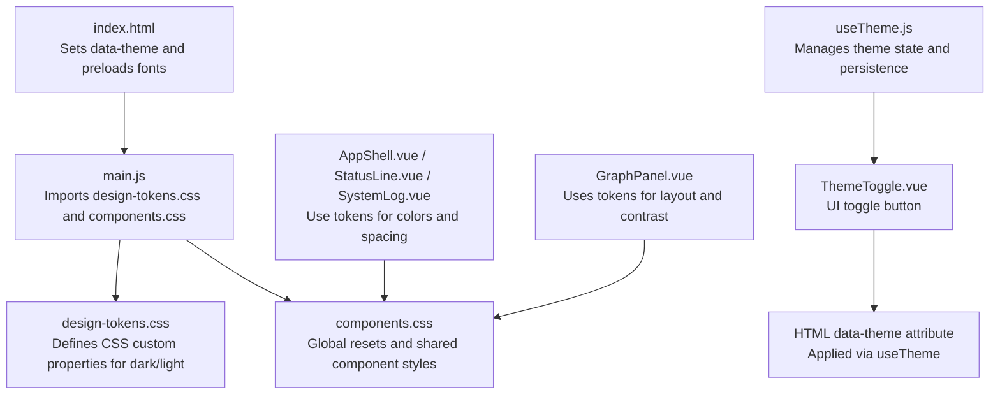
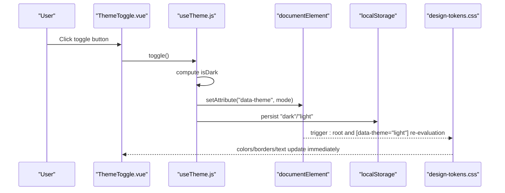
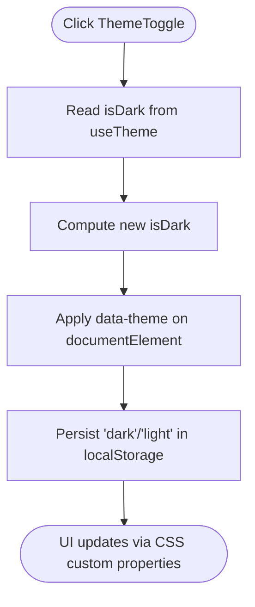
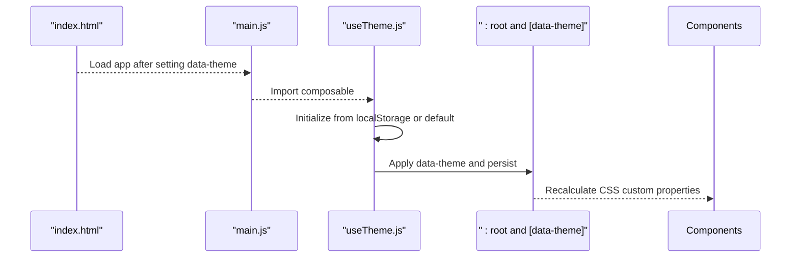
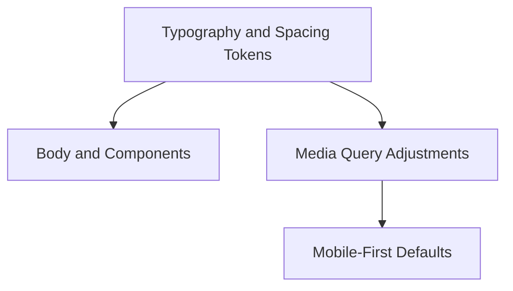
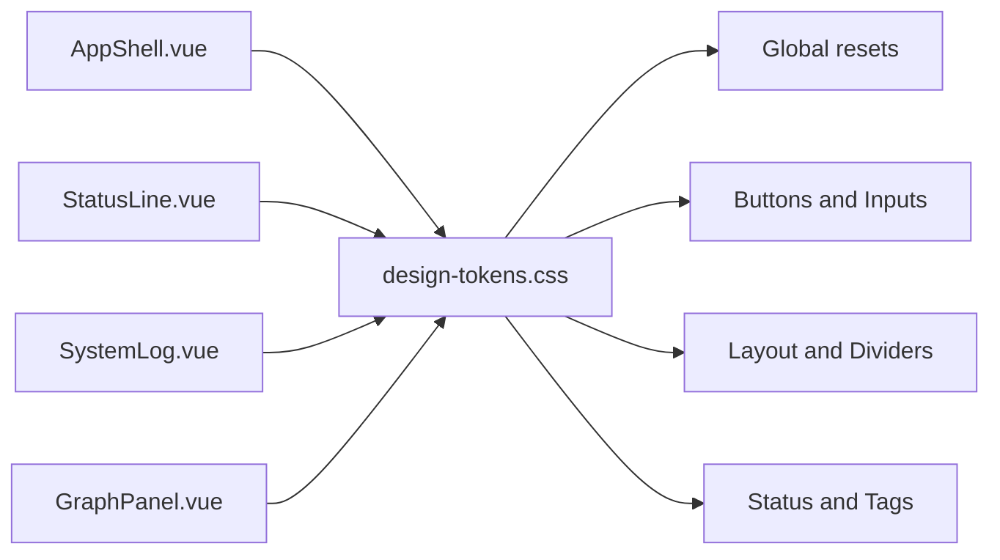
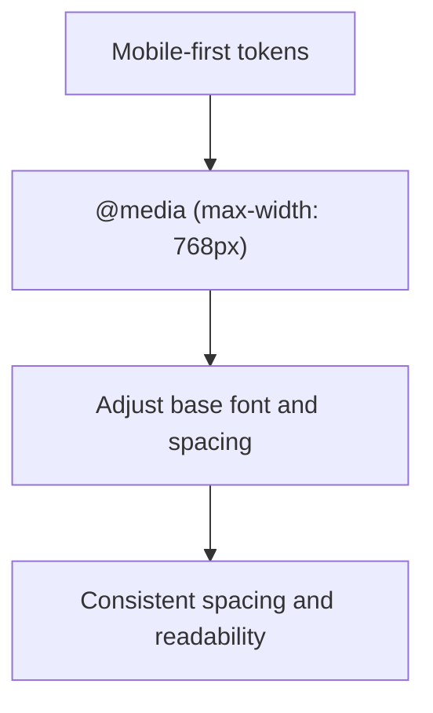
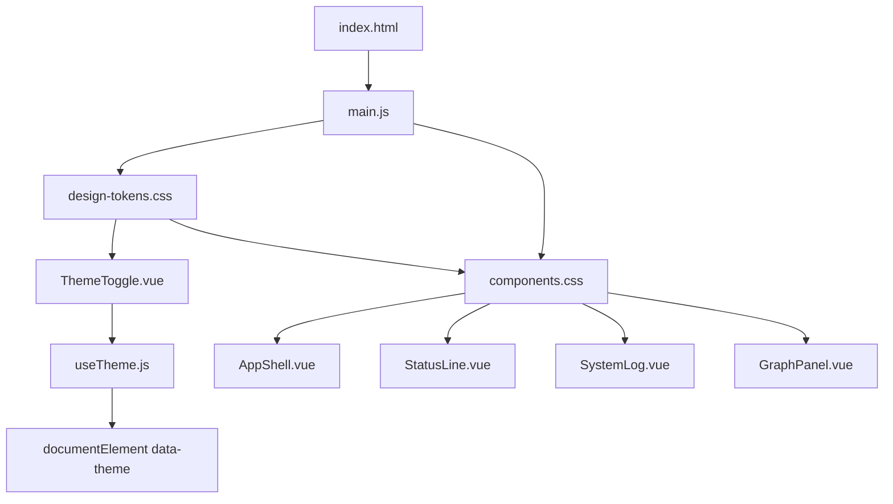

# Theming and Styling

<cite>
**Referenced Files in This Document**
- [index.html](file://frontend/index.html)
- [main.js](file://frontend/src/main.js)
- [design-tokens.css](file://frontend/src/styles/design-tokens.css)
- [components.css](file://frontend/src/styles/components.css)
- [useTheme.js](file://frontend/src/composables/useTheme.js)
- [ThemeToggle.vue](file://frontend/src/components/ThemeToggle.vue)
- [AppShell.vue](file://frontend/src/components/AppShell.vue)
- [StatusLine.vue](file://frontend/src/components/StatusLine.vue)
- [SystemLog.vue](file://frontend/src/components/SystemLog.vue)
- [GraphPanel.vue](file://frontend/src/components/GraphPanel.vue)
- [MainView.vue](file://frontend/src/views/MainView.vue)
- [package.json](file://frontend/package.json)
- [vite.config.js](file://frontend/vite.config.js)
</cite>

## Table of Contents
1. [Introduction](#introduction)
2. [Project Structure](#project-structure)
3. [Core Components](#core-components)
4. [Architecture Overview](#architecture-overview)
5. [Detailed Component Analysis](#detailed-component-analysis)
6. [Dependency Analysis](#dependency-analysis)
7. [Performance Considerations](#performance-considerations)
8. [Troubleshooting Guide](#troubleshooting-guide)
9. [Conclusion](#conclusion)
10. [Appendices](#appendices)

## Introduction
This document explains the theming and styling architecture of the frontend, focusing on a design-token-based system using CSS custom properties and a dual-mode theme (dark and light). It covers the color system, typography scale, spacing units, component styling patterns, the ThemeToggle mechanism, global design system integration, responsive design, customization guidelines, and best practices for performance and accessibility.

## Project Structure
The styling system is organized into two primary layers:
- Global design tokens: centralized CSS custom properties for colors, typography, spacing, borders, layout, and transitions.
- Shared component styles: reusable base styles and component-specific styles that consume tokens.

Entry points:
- HTML sets the initial theme attribute and preloads fonts.
- Application bootstrap imports global design tokens and shared component styles.
- Vue composables and components integrate the theme system.



**Diagram sources**
- [index.html:1-25](file://frontend/index.html#L1-L25)
- [main.js:1-15](file://frontend/src/main.js#L1-L15)
- [design-tokens.css:1-72](file://frontend/src/styles/design-tokens.css#L1-L72)
- [components.css:1-295](file://frontend/src/styles/components.css#L1-L295)
- [useTheme.js:1-38](file://frontend/src/composables/useTheme.js#L1-L38)
- [ThemeToggle.vue:1-38](file://frontend/src/components/ThemeToggle.vue#L1-L38)
- [AppShell.vue:1-103](file://frontend/src/components/AppShell.vue#L1-L103)
- [StatusLine.vue:1-74](file://frontend/src/components/StatusLine.vue#L1-L74)
- [SystemLog.vue:1-95](file://frontend/src/components/SystemLog.vue#L1-L95)
- [GraphPanel.vue:1-800](file://frontend/src/components/GraphPanel.vue#L1-L800)

**Section sources**
- [index.html:1-25](file://frontend/index.html#L1-L25)
- [main.js:1-15](file://frontend/src/main.js#L1-L15)
- [design-tokens.css:1-72](file://frontend/src/styles/design-tokens.css#L1-L72)
- [components.css:1-295](file://frontend/src/styles/components.css#L1-L295)

## Core Components
- Design tokens: CSS custom properties for colors, typography, spacing, borders, layout, and transitions. Light and dark modes are supported via a data-theme attribute selector.
- Shared component styles: global resets, scrollbars, cards, buttons, labels, tags, inputs, selects, checkboxes, dividers, progress bars, and responsive adjustments.
- Theme composable: manages theme state, persists selection to local storage, and applies the data-theme attribute.
- ThemeToggle component: a small button that toggles between dark and light modes and reflects the current mode via aria-like title text.
- Views and panels: MainView orchestrates the shell and steps; AppShell, StatusLine, and SystemLog consume tokens for consistent visuals.

**Section sources**
- [design-tokens.css:1-72](file://frontend/src/styles/design-tokens.css#L1-L72)
- [components.css:1-295](file://frontend/src/styles/components.css#L1-L295)
- [useTheme.js:1-38](file://frontend/src/composables/useTheme.js#L1-L38)
- [ThemeToggle.vue:1-38](file://frontend/src/components/ThemeToggle.vue#L1-L38)
- [MainView.vue:1-327](file://frontend/src/views/MainView.vue#L1-L327)
- [AppShell.vue:1-103](file://frontend/src/components/AppShell.vue#L1-L103)
- [StatusLine.vue:1-74](file://frontend/src/components/StatusLine.vue#L1-L74)
- [SystemLog.vue:1-95](file://frontend/src/components/SystemLog.vue#L1-L95)

## Architecture Overview
The theming architecture is driven by CSS custom properties and a small Vue composable that updates the root data-theme attribute. Components consume tokens directly, ensuring consistent visuals across the app. The system supports a mobile-first responsive approach with targeted adjustments at 768px.



**Diagram sources**
- [ThemeToggle.vue:1-38](file://frontend/src/components/ThemeToggle.vue#L1-L38)
- [useTheme.js:1-38](file://frontend/src/composables/useTheme.js#L1-L38)
- [design-tokens.css:58-72](file://frontend/src/styles/design-tokens.css#L58-L72)
- [index.html:12-18](file://frontend/index.html#L12-L18)

## Detailed Component Analysis

### ThemeToggle Component
- Purpose: Provides a quick toggle between dark and light modes.
- Behavior: Uses the useTheme composable to read and update the theme state. The button’s icon and title reflect the current mode.
- Styling: Consumes tokens for background, border, color, and hover effects. Scoped styles ensure isolation.



**Diagram sources**
- [ThemeToggle.vue:1-38](file://frontend/src/components/ThemeToggle.vue#L1-L38)
- [useTheme.js:16-31](file://frontend/src/composables/useTheme.js#L16-L31)

**Section sources**
- [ThemeToggle.vue:1-38](file://frontend/src/components/ThemeToggle.vue#L1-L38)
- [useTheme.js:1-38](file://frontend/src/composables/useTheme.js#L1-L38)

### Theme Switching Mechanism
- Initialization: The HTML head script reads the stored theme from localStorage and sets the data-theme attribute before the app mounts.
- Runtime: The composable initializes state from localStorage, defaults to dark if unset, and watches changes to re-apply the theme and persist the choice.
- Effect: Updating data-theme switches the active token set, enabling seamless theme transitions.



**Diagram sources**
- [index.html:12-18](file://frontend/index.html#L12-L18)
- [main.js:5-7](file://frontend/src/main.js#L5-L7)
- [useTheme.js:8-22](file://frontend/src/composables/useTheme.js#L8-L22)
- [design-tokens.css:6, 59:6-72](file://frontend/src/styles/design-tokens.css#L6-L72)

**Section sources**
- [index.html:12-18](file://frontend/index.html#L12-L18)
- [main.js:5-7](file://frontend/src/main.js#L5-L7)
- [useTheme.js:1-38](file://frontend/src/composables/useTheme.js#L1-L38)
- [design-tokens.css:1-72](file://frontend/src/styles/design-tokens.css#L1-L72)

### Design-Token-Based Color System
- Tokens: Backgrounds, surfaces, text, accents, and semantic colors (success, warning, error) are defined for both dark and light modes.
- Usage: Components reference tokens directly (e.g., background, borders, text, accent).
- Consistency: Changing a token updates all components automatically when data-theme changes.

```mermaid
classDiagram
class DesignTokens {
"+--bg"
"+--bg-raised"
"+--bg-surface"
"+--text"
"+--text-dim"
"+--text-faint"
"+--accent"
"+--accent-dim"
"+--success"
"+--warning"
"+--error"
}
class LightTheme {
"[data-theme='light'] overrides"
}
DesignTokens <.. LightTheme : "overrides"
```

**Diagram sources**
- [design-tokens.css:6-72](file://frontend/src/styles/design-tokens.css#L6-L72)

**Section sources**
- [design-tokens.css:6-72](file://frontend/src/styles/design-tokens.css#L6-L72)

### Typography Scale and Spacing Units
- Typography: A monospace font stack and a compact scale from extra-small to extra-large are defined as tokens.
- Spacing: Built on a 4px grid, enabling predictable layouts and rhythm.
- Responsive adjustment: At 768px and below, base font size and a key spacing unit are reduced to improve readability on smaller screens.



**Diagram sources**
- [design-tokens.css:20-56](file://frontend/src/styles/design-tokens.css#L20-L56)
- [components.css:288-295](file://frontend/src/styles/components.css#L288-L295)

**Section sources**
- [design-tokens.css:20-56](file://frontend/src/styles/design-tokens.css#L20-L56)
- [components.css:288-295](file://frontend/src/styles/components.css#L288-L295)

### Component Styling Patterns
- Global resets and base styles: Normalize margins/padding, scrollbar styling, and base body styles.
- Shared utilities: Box drawing borders, cards, buttons (primary, ghost), labels, tags, status indicators, progress bars, monospace inputs/selects/checkboxes, dividers, uppercase labels, and values.
- Component-specific styles: AppShell, StatusLine, SystemLog, and GraphPanel leverage tokens for consistent colors, borders, spacing, and transitions.



**Diagram sources**
- [components.css:1-295](file://frontend/src/styles/components.css#L1-L295)
- [AppShell.vue:56-102](file://frontend/src/components/AppShell.vue#L56-L102)
- [StatusLine.vue:44-74](file://frontend/src/components/StatusLine.vue#L44-L74)
- [SystemLog.vue:36-95](file://frontend/src/components/SystemLog.vue#L36-L95)
- [GraphPanel.vue:328-784](file://frontend/src/components/GraphPanel.vue#L328-L784)

**Section sources**
- [components.css:1-295](file://frontend/src/styles/components.css#L1-L295)
- [AppShell.vue:56-102](file://frontend/src/components/AppShell.vue#L56-L102)
- [StatusLine.vue:44-74](file://frontend/src/components/StatusLine.vue#L44-L74)
- [SystemLog.vue:36-95](file://frontend/src/components/SystemLog.vue#L36-L95)
- [GraphPanel.vue:328-784](file://frontend/src/components/GraphPanel.vue#L328-L784)

### Responsive Design and Mobile-First Approach
- Media query: At 768px and below, the base font size and a key spacing unit are adjusted to improve legibility and density on mobile devices.
- Mobile-first: Tokens and component styles assume smaller screens by default, scaling up with viewport width.



**Diagram sources**
- [components.css:288-295](file://frontend/src/styles/components.css#L288-L295)
- [design-tokens.css:20-56](file://frontend/src/styles/design-tokens.css#L20-L56)

**Section sources**
- [components.css:288-295](file://frontend/src/styles/components.css#L288-L295)
- [design-tokens.css:20-56](file://frontend/src/styles/design-tokens.css#L20-L56)

### Customizing Themes and Adding New Tokens
- Add or override tokens in the design-tokens.css file under :root for dark mode and [data-theme="light"] for light mode.
- Consume tokens in component styles using var(--token-name) to maintain consistency.
- Keep tokens namespaced and semantic (e.g., --text-dim, --accent, --success) for easy maintenance.

Best practices:
- Prefer tokens over hardcoded values.
- Group related tokens (colors, typography, spacing) for discoverability.
- Test both dark and light modes after changes.

**Section sources**
- [design-tokens.css:1-72](file://frontend/src/styles/design-tokens.css#L1-L72)
- [components.css:1-295](file://frontend/src/styles/components.css#L1-L295)

### Maintaining Consistency Across Components
- Centralized tokens: All components import the same design-tokens.css and components.css.
- Scoped component styles: Components use tokens for colors, borders, spacing, and transitions to avoid duplication.
- Shared utilities: Reusable classes (e.g., .card, .btn, .section-label) ensure uniform behavior.

**Section sources**
- [main.js:5-7](file://frontend/src/main.js#L5-L7)
- [components.css:1-295](file://frontend/src/styles/components.css#L1-L295)

## Dependency Analysis
- HTML depends on main.js to mount the app and on design-tokens.css and components.css for styling.
- useTheme.js depends on localStorage and the DOM data-theme attribute.
- Components depend on tokens from design-tokens.css and shared utilities from components.css.



**Diagram sources**
- [index.html:1-25](file://frontend/index.html#L1-L25)
- [main.js:5-7](file://frontend/src/main.js#L5-L7)
- [design-tokens.css:1-72](file://frontend/src/styles/design-tokens.css#L1-L72)
- [components.css:1-295](file://frontend/src/styles/components.css#L1-L295)
- [ThemeToggle.vue:1-38](file://frontend/src/components/ThemeToggle.vue#L1-L38)
- [useTheme.js:1-38](file://frontend/src/composables/useTheme.js#L1-L38)
- [AppShell.vue:1-103](file://frontend/src/components/AppShell.vue#L1-L103)
- [StatusLine.vue:1-74](file://frontend/src/components/StatusLine.vue#L1-L74)
- [SystemLog.vue:1-95](file://frontend/src/components/SystemLog.vue#L1-L95)
- [GraphPanel.vue:1-800](file://frontend/src/components/GraphPanel.vue#L1-L800)

**Section sources**
- [index.html:1-25](file://frontend/index.html#L1-L25)
- [main.js:5-7](file://frontend/src/main.js#L5-L7)
- [design-tokens.css:1-72](file://frontend/src/styles/design-tokens.css#L1-L72)
- [components.css:1-295](file://frontend/src/styles/components.css#L1-L295)
- [ThemeToggle.vue:1-38](file://frontend/src/components/ThemeToggle.vue#L1-L38)
- [useTheme.js:1-38](file://frontend/src/composables/useTheme.js#L1-L38)
- [AppShell.vue:1-103](file://frontend/src/components/AppShell.vue#L1-L103)
- [StatusLine.vue:1-74](file://frontend/src/components/StatusLine.vue#L1-L74)
- [SystemLog.vue:1-95](file://frontend/src/components/SystemLog.vue#L1-L95)
- [GraphPanel.vue:1-800](file://frontend/src/components/GraphPanel.vue#L1-L800)

## Performance Considerations
- CSS delivery: Import design-tokens.css and components.css once in main.js to avoid redundant loads.
- Minimize repaints: Use tokens for transitions and animations to leverage GPU-friendly properties.
- Fonts: Preload the monospace font in index.html to reduce FOIT/FOUT.
- Vite bundling: Ensure production builds optimize CSS assets.

**Section sources**
- [main.js:5-7](file://frontend/src/main.js#L5-L7)
- [index.html:9-18](file://frontend/index.html#L9-L18)
- [vite.config.js:1-19](file://frontend/vite.config.js#L1-L19)
- [package.json:1-22](file://frontend/package.json#L1-L22)

## Troubleshooting Guide
- Theme does not stick across reloads:
  - Verify localStorage key and initialization logic in the composable and HTML head script.
- Theme toggle has no effect:
  - Confirm data-theme attribute is applied to documentElement and tokens are defined for both modes.
- Tokens appear inconsistent:
  - Ensure components use var(--token-name) and that design-tokens.css is imported before component styles.
- Mobile layout issues:
  - Check media query adjustments and ensure breakpoints align with device widths.

**Section sources**
- [useTheme.js:3-22](file://frontend/src/composables/useTheme.js#L3-L22)
- [index.html:12-18](file://frontend/index.html#L12-L18)
- [design-tokens.css:1-72](file://frontend/src/styles/design-tokens.css#L1-L72)
- [components.css:288-295](file://frontend/src/styles/components.css#L288-L295)

## Conclusion
The theming and styling system leverages a robust design-token architecture with CSS custom properties and a minimal Vue composable to manage theme state. Components consistently consume tokens for colors, typography, spacing, and layout, enabling maintainable, scalable visual design. The mobile-first responsive approach and centralized token definitions support rapid customization while preserving consistency across the application.

## Appendices
- Example customization steps:
  - Add a new semantic token in :root and [data-theme="light"].
  - Use the token in component styles via var(--token-name).
  - Test both dark and light modes and verify responsiveness.

[No sources needed since this section provides general guidance]