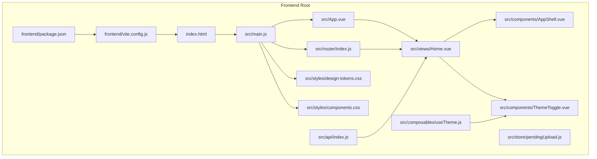
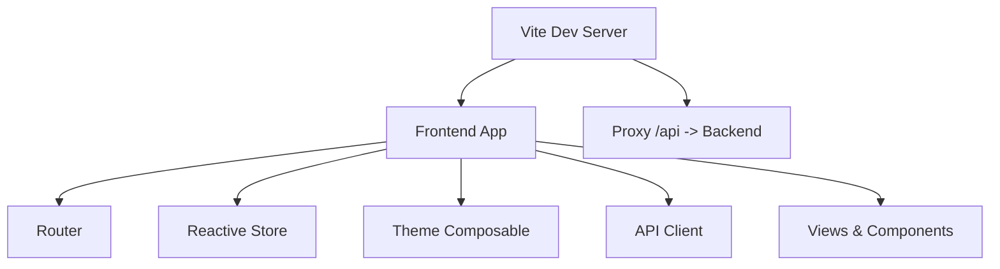
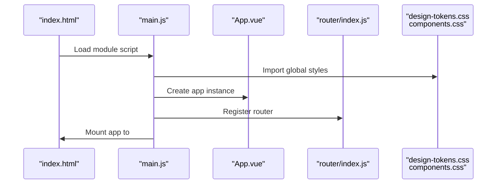
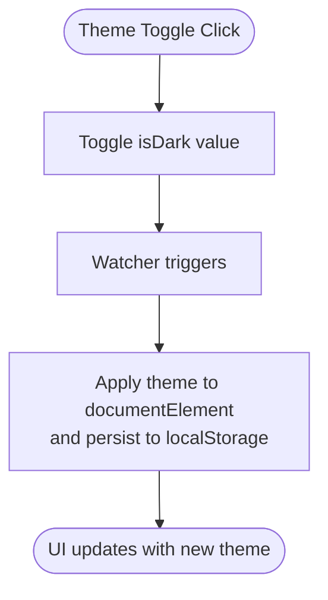
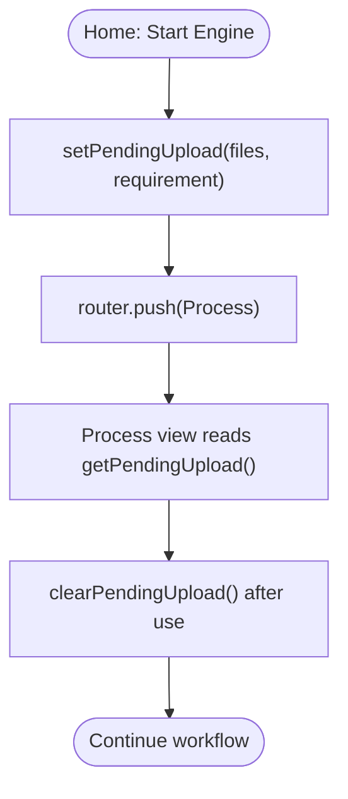
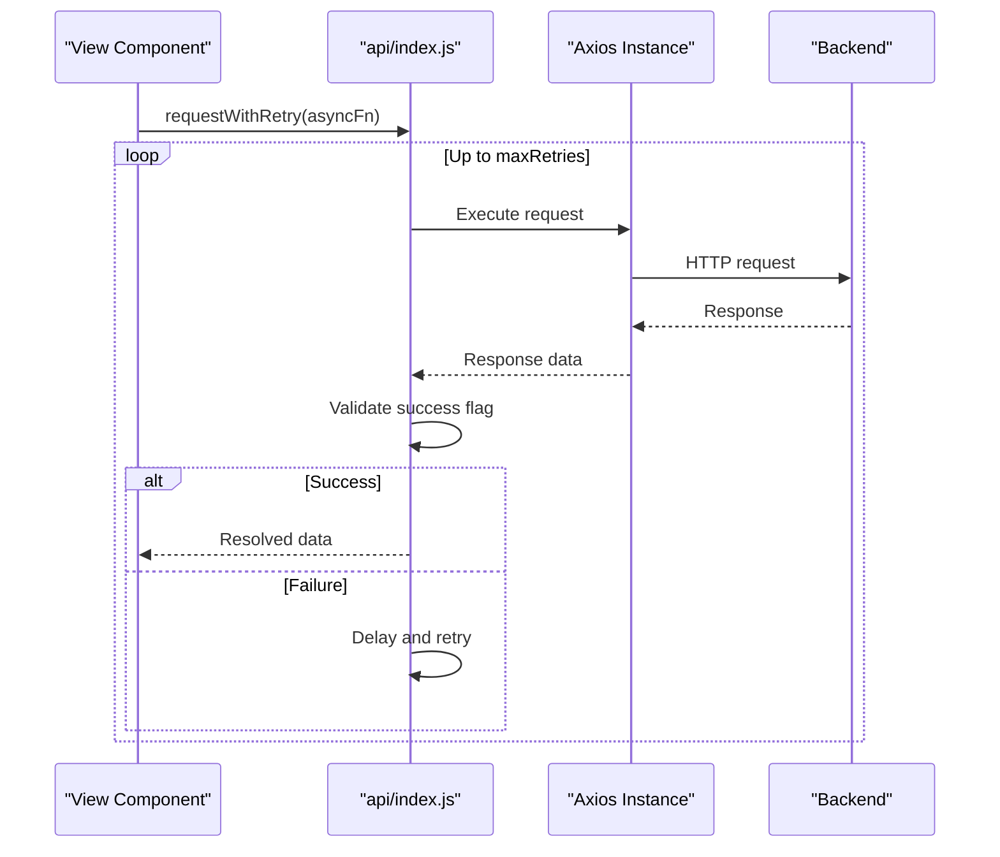
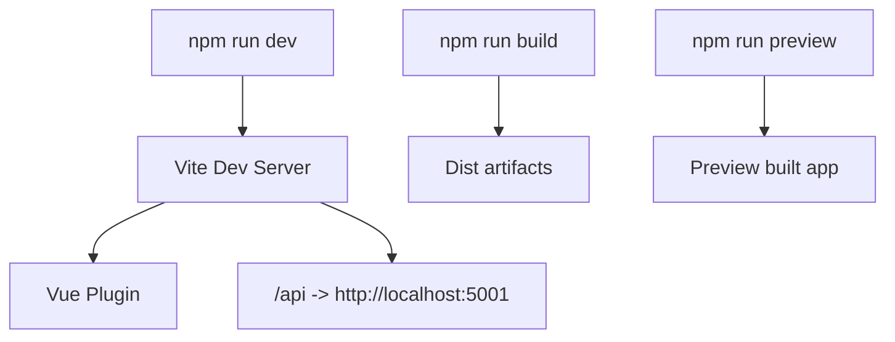
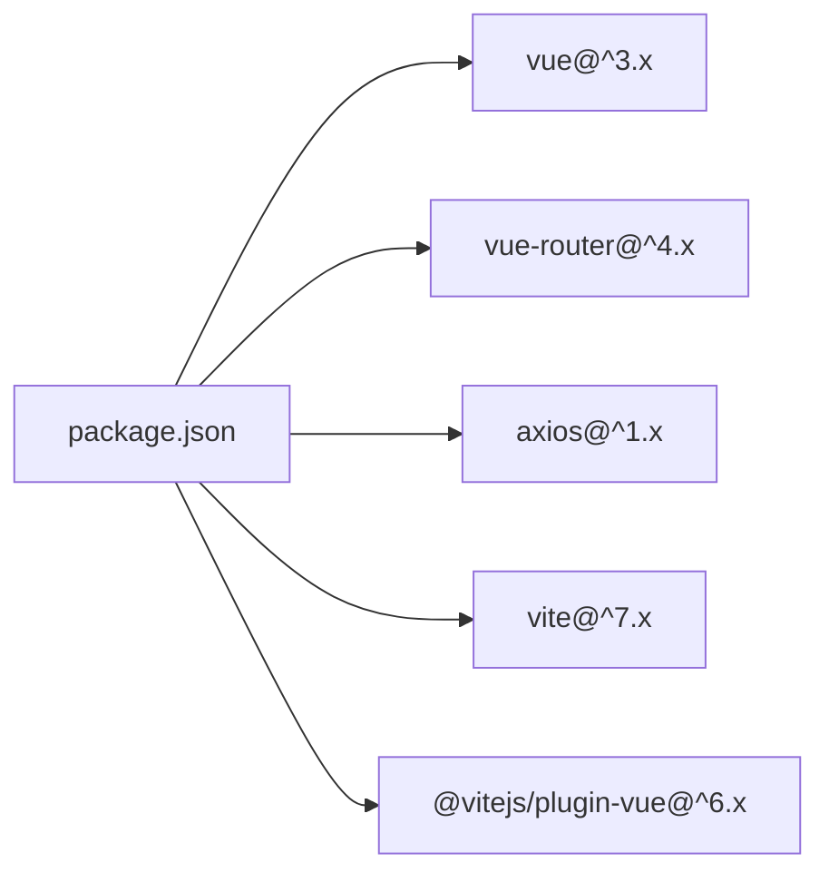

# Vue.js Application Architecture

<cite>
**Referenced Files in This Document**
- [package.json](file://frontend/package.json)
- [vite.config.js](file://frontend/vite.config.js)
- [main.js](file://frontend/src/main.js)
- [App.vue](file://frontend/src/App.vue)
- [index.html](file://frontend/index.html)
- [router/index.js](file://frontend/src/router/index.js)
- [store/pendingUpload.js](file://frontend/src/store/pendingUpload.js)
- [composables/useTheme.js](file://frontend/src/composables/useTheme.js)
- [styles/design-tokens.css](file://frontend/src/styles/design-tokens.css)
- [styles/components.css](file://frontend/src/styles/components.css)
- [api/index.js](file://frontend/src/api/index.js)
- [views/Home.vue](file://frontend/src/views/Home.vue)
- [components/AppShell.vue](file://frontend/src/components/AppShell.vue)
- [components/ThemeToggle.vue](file://frontend/src/components/ThemeToggle.vue)
</cite>

## Table of Contents
1. [Introduction](#introduction)
2. [Project Structure](#project-structure)
3. [Core Components](#core-components)
4. [Architecture Overview](#architecture-overview)
5. [Detailed Component Analysis](#detailed-component-analysis)
6. [Dependency Analysis](#dependency-analysis)
7. [Performance Considerations](#performance-considerations)
8. [Troubleshooting Guide](#troubleshooting-guide)
9. [Conclusion](#conclusion)
10. [Appendices](#appendices)

## Introduction
This document explains the Vue.js application architecture and setup for the frontend module. It covers the application entry point configuration, Vite build system integration, project structure organization, initialization process, plugin configurations, global application settings, Vite configuration specifics, dependency and script definitions, bootstrapping process, global styles integration, and performance optimization strategies. Practical guidance is also provided for extending the architecture and adding new features.

## Project Structure
The frontend module follows a conventional Vue 3 + Vite structure with clear separation of concerns:
- Entry point and mounting: main.js initializes the Vue app and mounts it to index.html.
- Routing: router/index.js defines routes for the application views.
- State management: a small reactive store in store/pendingUpload.js manages cross-route data.
- Composition utilities: composables/useTheme.js encapsulates theme state and persistence.
- Styles: design tokens and shared component styles are centralized in styles/.
- API client: api/index.js centralizes Axios configuration and interceptors.
- Views and components: views/ and components/ organize presentation logic and reusable UI elements.
- Vite configuration: vite.config.js configures the dev server, proxy, and plugins.

**Diagram sources**
- [index.html](file://frontend/index.html)
- [main.js](file://frontend/src/main.js)
- [App.vue](file://frontend/src/App.vue)
- [router/index.js](file://frontend/src/router/index.js)
- [store/pendingUpload.js](file://frontend/src/store/pendingUpload.js)
- [composables/useTheme.js](file://frontend/src/composables/useTheme.js)
- [styles/design-tokens.css](file://frontend/src/styles/design-tokens.css)
- [styles/components.css](file://frontend/src/styles/components.css)
- [api/index.js](file://frontend/src/api/index.js)
- [views/Home.vue](file://frontend/src/views/Home.vue)
- [components/AppShell.vue](file://frontend/src/components/AppShell.vue)
- [components/ThemeToggle.vue](file://frontend/src/components/ThemeToggle.vue)
- [vite.config.js](file://frontend/vite.config.js)
- [package.json](file://frontend/package.json)

**Section sources**
- [package.json:1-22](file://frontend/package.json#L1-L22)
- [vite.config.js:1-19](file://frontend/vite.config.js#L1-L19)
- [main.js:1-15](file://frontend/src/main.js#L1-L15)
- [index.html:1-25](file://frontend/index.html#L1-L25)

## Core Components
This section outlines the primary building blocks of the application and their roles.

- Application bootstrap and mounting
  - The Vue app is created and mounted in main.js, registering the router and importing global styles.
  - See [main.js:1-15](file://frontend/src/main.js#L1-L15).

- Global styles integration
  - Global design tokens and component styles are imported in main.js and applied via CSS custom properties.
  - See [design-tokens.css:1-72](file://frontend/src/styles/design-tokens.css#L1-L72) and [components.css:1-295](file://frontend/src/styles/components.css#L1-L295).
  - The HTML template sets the theme attribute and loads fonts.
  - See [index.html:1-25](file://frontend/index.html#L1-L25).

- Routing configuration
  - Routes are defined in router/index.js with named routes and dynamic parameters.
  - See [router/index.js:1-53](file://frontend/src/router/index.js#L1-L53).

- Reactive state management
  - A small reactive store in store/pendingUpload.js persists temporary upload data across navigation.
  - See [store/pendingUpload.js:1-35](file://frontend/src/store/pendingUpload.js#L1-L35).

- Theme management
  - Theme state and persistence are handled in composables/useTheme.js with a watcher applying the theme to the document element.
  - See [useTheme.js:1-38](file://frontend/src/composables/useTheme.js#L1-L38).

- API client
  - Axios instance configured with base URL, timeout, interceptors, and a retry helper.
  - See [api/index.js:1-68](file://frontend/src/api/index.js#L1-L68).

- Views and components
  - Home view orchestrates uploads, requirements, and navigation to the process view.
  - AppShell provides layout scaffolding with split-view controls and logs.
  - ThemeToggle integrates with the theme composable.
  - See [views/Home.vue:1-364](file://frontend/src/views/Home.vue#L1-L364), [components/AppShell.vue:1-103](file://frontend/src/components/AppShell.vue#L1-L103), and [components/ThemeToggle.vue:1-38](file://frontend/src/components/ThemeToggle.vue#L1-L38).

**Section sources**
- [main.js:1-15](file://frontend/src/main.js#L1-L15)
- [styles/design-tokens.css:1-72](file://frontend/src/styles/design-tokens.css#L1-L72)
- [styles/components.css:1-295](file://frontend/src/styles/components.css#L1-L295)
- [index.html:1-25](file://frontend/index.html#L1-L25)
- [router/index.js:1-53](file://frontend/src/router/index.js#L1-L53)
- [store/pendingUpload.js:1-35](file://frontend/src/store/pendingUpload.js#L1-L35)
- [composables/useTheme.js:1-38](file://frontend/src/composables/useTheme.js#L1-L38)
- [api/index.js:1-68](file://frontend/src/api/index.js#L1-L68)
- [views/Home.vue:1-364](file://frontend/src/views/Home.vue#L1-L364)
- [components/AppShell.vue:1-103](file://frontend/src/components/AppShell.vue#L1-L103)
- [components/ThemeToggle.vue:1-38](file://frontend/src/components/ThemeToggle.vue#L1-L38)

## Architecture Overview
The application follows a modular Vue 3 architecture with a clear separation between routing, state, composition utilities, styling, and API access. The Vite configuration enables a fast development server with proxy support for backend APIs and a Vue plugin for single-file components.

**Diagram sources**
- [main.js:1-15](file://frontend/src/main.js#L1-L15)
- [router/index.js:1-53](file://frontend/src/router/index.js#L1-L53)
- [store/pendingUpload.js:1-35](file://frontend/src/store/pendingUpload.js#L1-L35)
- [composables/useTheme.js:1-38](file://frontend/src/composables/useTheme.js#L1-L38)
- [api/index.js:1-68](file://frontend/src/api/index.js#L1-L68)
- [vite.config.js:1-19](file://frontend/vite.config.js#L1-L19)

## Detailed Component Analysis

### Application Bootstrapping and Initialization
The bootstrapping process initializes the Vue application, registers the router, imports global styles, and mounts the app to the DOM.

**Diagram sources**
- [index.html:21-22](file://frontend/index.html#L21-L22)
- [main.js:1-15](file://frontend/src/main.js#L1-L15)
- [App.vue:1-8](file://frontend/src/App.vue#L1-L8)
- [router/index.js:1-53](file://frontend/src/router/index.js#L1-L53)
- [styles/design-tokens.css:1-72](file://frontend/src/styles/design-tokens.css#L1-L72)
- [styles/components.css:1-295](file://frontend/src/styles/components.css#L1-L295)

**Section sources**
- [index.html:1-25](file://frontend/index.html#L1-L25)
- [main.js:1-15](file://frontend/src/main.js#L1-L15)
- [App.vue:1-8](file://frontend/src/App.vue#L1-L8)

### Theme Management Flow
Theme state is initialized from local storage, applied to the document element, and persisted on toggle.

**Diagram sources**
- [composables/useTheme.js:1-38](file://frontend/src/composables/useTheme.js#L1-L38)
- [components/ThemeToggle.vue:1-38](file://frontend/src/components/ThemeToggle.vue#L1-L38)
- [index.html:12-18](file://frontend/index.html#L12-L18)

**Section sources**
- [composables/useTheme.js:1-38](file://frontend/src/composables/useTheme.js#L1-L38)
- [components/ThemeToggle.vue:1-38](file://frontend/src/components/ThemeToggle.vue#L1-L38)
- [index.html:12-18](file://frontend/index.html#L12-L18)

### Pending Upload Store Pattern
The pending upload store acts as a lightweight cross-route data holder, enabling immediate navigation after initiating a process while deferring heavy operations until the destination view is ready.

**Diagram sources**
- [views/Home.vue:154-160](file://frontend/src/views/Home.vue#L154-L160)
- [store/pendingUpload.js:1-35](file://frontend/src/store/pendingUpload.js#L1-L35)

**Section sources**
- [views/Home.vue:154-160](file://frontend/src/views/Home.vue#L154-L160)
- [store/pendingUpload.js:1-35](file://frontend/src/store/pendingUpload.js#L1-L35)

### API Client and Retry Mechanism
The API client centralizes configuration, request/response interceptors, and a retry helper to improve resilience for long-running operations.

**Diagram sources**
- [api/index.js:1-68](file://frontend/src/api/index.js#L1-L68)

**Section sources**
- [api/index.js:1-68](file://frontend/src/api/index.js#L1-L68)

### Vite Configuration and Development Server
Vite is configured with:
- Vue plugin for SFC support.
- Development server on port 3000 with automatic browser open.
- Proxy for /api requests to the backend service.
- Scripts for dev, build, and preview defined in package.json.

**Diagram sources**
- [vite.config.js:1-19](file://frontend/vite.config.js#L1-L19)
- [package.json:6-10](file://frontend/package.json#L6-L10)

**Section sources**
- [vite.config.js:1-19](file://frontend/vite.config.js#L1-L19)
- [package.json:6-10](file://frontend/package.json#L6-L10)

## Dependency Analysis
The frontend module depends on Vue 3, Vue Router, Axios, and Vite with the Vue plugin. Development and production scripts are defined in package.json.

**Diagram sources**
- [package.json:11-20](file://frontend/package.json#L11-L20)

**Section sources**
- [package.json:1-22](file://frontend/package.json#L1-L22)

## Performance Considerations
- Use the Vue plugin for optimal SFC compilation and tree-shaking.
- Keep global styles minimal and scoped where appropriate to reduce render overhead.
- Prefer lazy-loading views and components for non-critical paths.
- Leverage the retry mechanism for long-running API calls to avoid unnecessary reattempts.
- Utilize computed properties and watchers judiciously to avoid excessive reactivity work.
- Use CSS custom properties for theming to minimize style recalculations.

## Troubleshooting Guide
Common issues and resolutions:
- API timeouts: Increase timeout in the Axios instance if necessary.
- Network errors: Verify backend connectivity and proxy configuration.
- Theme flicker: The HTML script ensures theme persistence on load; confirm local storage availability.
- Hot reload issues: Restart the Vite dev server if changes are not reflected.

**Section sources**
- [api/index.js:24-51](file://frontend/src/api/index.js#L24-L51)
- [index.html:12-18](file://frontend/index.html#L12-L18)
- [vite.config.js:7-17](file://frontend/vite.config.js#L7-L17)

## Conclusion
The Vue.js application employs a clean, modular architecture with Vite as the build toolchain. The initialization process is straightforward, global styles are centralized via CSS custom properties, and the router and store provide clear navigation and state boundaries. The API client adds resilience with interceptors and retries. The Vite configuration supports a smooth development experience with proxying to the backend.

## Appendices

### Extending the Application Architecture
- Add a new route: Define a new route in router/index.js and create a corresponding view component.
- Introduce a new store module: Create a new reactive module similar to store/pendingUpload.js and import it in main.js.
- Create a new composable: Add a composable under composables/ for shared logic and import it in components.
- Integrate a new UI component: Place reusable components under components/ and import them into views.
- Extend global styles: Add new design tokens or component styles to styles/.

### Adding New Features
- Theme-aware components: Use the theme composable to adapt visuals based on current mode.
- Cross-view data: Use the pending upload store pattern to pass data between views during navigation.
- API integrations: Use the existing API client and retry helper for robust communication with backend endpoints.
- Layout enhancements: Extend AppShell to support additional panels or view modes.