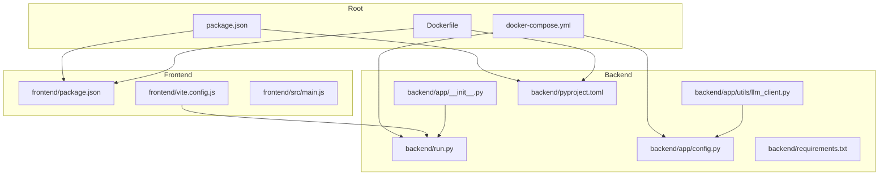
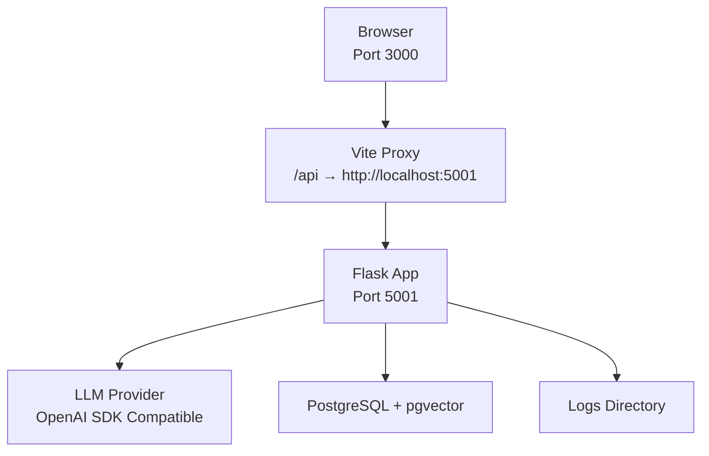
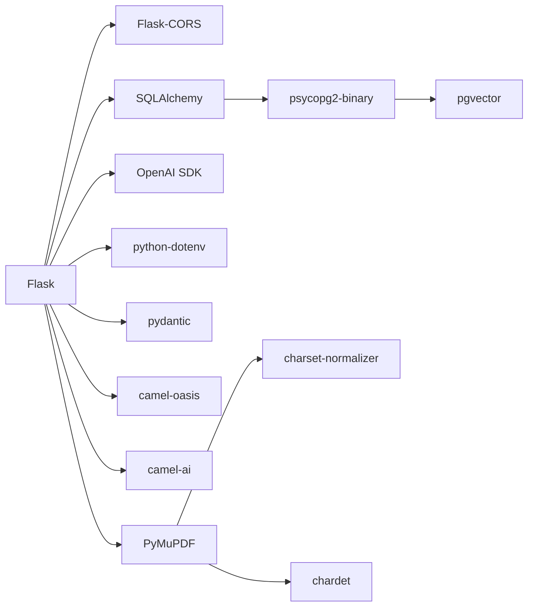

# Getting Started

<cite>
**Referenced Files in This Document**
- [README.md](file://README.md)
- [package.json](file://package.json)
- [Dockerfile](file://Dockerfile)
- [docker-compose.yml](file://docker-compose.yml)
- [backend/pyproject.toml](file://backend/pyproject.toml)
- [backend/requirements.txt](file://backend/requirements.txt)
- [backend/run.py](file://backend/run.py)
- [backend/app/config.py](file://backend/app/config.py)
- [backend/app/__init__.py](file://backend/app/__init__.py)
- [backend/app/utils/llm_client.py](file://backend/app/utils/llm_client.py)
- [frontend/package.json](file://frontend/package.json)
- [frontend/vite.config.js](file://frontend/vite.config.js)
- [frontend/src/main.js](file://frontend/src/main.js)
</cite>

## Table of Contents
1. [Introduction](#introduction)
2. [Project Structure](#project-structure)
3. [Core Components](#core-components)
4. [Architecture Overview](#architecture-overview)
5. [Detailed Component Analysis](#detailed-component-analysis)
6. [Dependency Analysis](#dependency-analysis)
7. [Performance Considerations](#performance-considerations)
8. [Troubleshooting Guide](#troubleshooting-guide)
9. [Conclusion](#conclusion)
10. [Appendices](#appendices)

## Introduction
This guide helps you quickly set up and run the Parallel World AI Prediction Engine. It covers prerequisites, environment configuration, dependency installation, service startup, and verification steps for both source code and Docker deployments. Beginners are encouraged to start with the source code deployment option for easier local development and iteration.

## Project Structure
The project is organized into two primary parts:
- Frontend: Vue 3 single-page application built with Vite, serving the user interface and proxying API requests to the backend.
- Backend: Python Flask application exposing APIs for graph construction, simulation orchestration, and report generation. It integrates with an LLM provider via the OpenAI SDK-compatible client and uses a vector database for knowledge graph storage.

**Diagram sources**
- [package.json:1-22](file://package.json#L1-L22)
- [Dockerfile:1-30](file://Dockerfile#L1-L30)
- [docker-compose.yml:1-38](file://docker-compose.yml#L1-L38)
- [frontend/package.json:1-22](file://frontend/package.json#L1-L22)
- [frontend/vite.config.js:1-19](file://frontend/vite.config.js#L1-L19)
- [frontend/src/main.js:1-15](file://frontend/src/main.js#L1-L15)
- [backend/run.py:1-51](file://backend/run.py#L1-L51)
- [backend/app/config.py:1-76](file://backend/app/config.py#L1-L76)
- [backend/app/__init__.py:1-99](file://backend/app/__init__.py#L1-L99)
- [backend/app/utils/llm_client.py:1-104](file://backend/app/utils/llm_client.py#L1-L104)
- [backend/pyproject.toml:1-58](file://backend/pyproject.toml#L1-L58)
- [backend/requirements.txt:1-36](file://backend/requirements.txt#L1-L36)

**Section sources**
- [README.md:78-178](file://README.md#L78-L178)
- [package.json:1-22](file://package.json#L1-L22)
- [Dockerfile:1-30](file://Dockerfile#L1-L30)
- [docker-compose.yml:1-38](file://docker-compose.yml#L1-L38)
- [frontend/package.json:1-22](file://frontend/package.json#L1-L22)
- [frontend/vite.config.js:1-19](file://frontend/vite.config.js#L1-L19)
- [frontend/src/main.js:1-15](file://frontend/src/main.js#L1-L15)
- [backend/run.py:1-51](file://backend/run.py#L1-L51)
- [backend/app/config.py:1-76](file://backend/app/config.py#L1-L76)
- [backend/app/__init__.py:1-99](file://backend/app/__init__.py#L1-L99)
- [backend/app/utils/llm_client.py:1-104](file://backend/app/utils/llm_client.py#L1-L104)
- [backend/pyproject.toml:1-58](file://backend/pyproject.toml#L1-L58)
- [backend/requirements.txt:1-36](file://backend/requirements.txt#L1-L36)

## Core Components
- Environment variables: LLM API configuration (OpenAI SDK compatible) and database connection string are loaded from the project’s .env file. Validation ensures required keys are present.
- Frontend: Vite dev server runs on port 3000 and proxies API calls under /api to the backend.
- Backend: Flask app exposes health checks, registers API blueprints, initializes the database, and starts the development server on port 5001 by default.
- LLM client: Wraps OpenAI SDK calls with unified configuration and JSON response handling.

Key configuration and runtime behaviors are defined in the files listed below.

**Section sources**
- [backend/app/config.py:20-76](file://backend/app/config.py#L20-L76)
- [backend/app/utils/llm_client.py:14-104](file://backend/app/utils/llm_client.py#L14-L104)
- [frontend/vite.config.js:7-18](file://frontend/vite.config.js#L7-L18)
- [backend/run.py:25-46](file://backend/run.py#L25-L46)
- [backend/app/__init__.py:84-96](file://backend/app/__init__.py#L84-L96)

## Architecture Overview
The system consists of a Vue 3 frontend and a Python Flask backend. The frontend communicates with the backend via HTTP endpoints, while the backend integrates with an LLM provider and a vector database for knowledge graph operations.

**Diagram sources**
- [frontend/vite.config.js:7-18](file://frontend/vite.config.js#L7-L18)
- [backend/run.py:40-45](file://backend/run.py#L40-L45)
- [backend/app/utils/llm_client.py:30-33](file://backend/app/utils/llm_client.py#L30-L33)
- [backend/app/config.py:35-36](file://backend/app/config.py#L35-L36)
- [backend/app/__init__.py:84-96](file://backend/app/__init__.py#L84-L96)

## Detailed Component Analysis

### Prerequisites and Environment Setup
- Node.js 18+: Required for frontend development and build tooling.
- Python 3.11–3.12: Required for backend runtime.
- uv: Recommended Python package manager for fast dependency synchronization.
- Environment variables: Copy the example configuration file and edit it to include your LLM API credentials and optional Zep Cloud configuration.

Verification commands and environment variable requirements are documented in the project’s quick start section.

**Section sources**
- [README.md:82-113](file://README.md#L82-L113)

### Source Code Deployment (Recommended for Beginners)
Step-by-step instructions:
1. Configure environment variables
   - Copy the example configuration file and edit it to include your LLM API key and base URL, and optionally your Zep Cloud key.
2. Install dependencies
   - One-command install for all dependencies (root + frontend + backend).
   - Or install frontend and backend separately using the provided scripts.
3. Start services
   - Run both frontend and backend concurrently from the project root.
   - Alternatively, start them individually.

Service addresses:
- Frontend: http://localhost:3000
- Backend API: http://localhost:3000/api/*

Individual startup scripts are defined in the root package.json.

**Section sources**
- [README.md:90-147](file://README.md#L90-L147)
- [package.json:5-12](file://package.json#L5-L12)

### Docker Deployment
Steps:
1. Configure environment variables (same as source code deployment).
2. Build and start the services using Docker Compose.
   - The compose file defines a Postgres service with pgvector and the main application service.
   - Ports 3000 (frontend) and 5001 (backend) are exposed.
   - A persistent volume is used for Postgres data.

The Dockerfile installs Node.js and uv, copies dependency manifests, installs dependencies, and starts both services in development mode.

**Section sources**
- [README.md:149-162](file://README.md#L149-L162)
- [docker-compose.yml:1-38](file://docker-compose.yml#L1-L38)
- [Dockerfile:1-30](file://Dockerfile#L1-L30)

### Dependency Installation Procedures
- Frontend dependencies
  - Managed by npm in the frontend directory.
  - Scripts in the root package.json install frontend dependencies and run the dev server.
- Backend dependencies
  - Managed by uv (recommended) or pip.
  - The backend supports both pyproject.toml and requirements.txt for dependency definitions.

Backend dependency lists:
- pyproject.toml: Defines core Flask stack, OpenAI SDK, Camel-OASIS, SQLAlchemy, psycopg2, pgvector, and utility packages.
- requirements.txt: Lists Flask, Flask-CORS, OpenAI SDK, Zep Cloud, Camel-OASIS, PyMuPDF, charset-normalizer, chardet, python-dotenv, and pydantic.

**Section sources**
- [frontend/package.json:1-22](file://frontend/package.json#L1-L22)
- [package.json:6-12](file://package.json#L6-L12)
- [backend/pyproject.toml:11-37](file://backend/pyproject.toml#L11-L37)
- [backend/requirements.txt:8-36](file://backend/requirements.txt#L8-L36)

### Service Startup and Verification
- Root scripts
  - setup: Installs root and frontend dependencies.
  - setup:backend: Syncs backend dependencies using uv.
  - setup:all: Installs all dependencies in one command.
  - dev: Starts backend and frontend concurrently.
  - backend: Runs the Flask application via uv.
  - frontend: Starts the Vite dev server.
- Backend startup
  - Validates configuration and starts the Flask app on host and port from environment variables.
  - Exposes a health endpoint to verify database connectivity.
- Frontend startup
  - Vite dev server runs on port 3000 with proxying /api to the backend.

Verification steps:
- Confirm frontend at http://localhost:3000.
- Confirm backend health endpoint at http://localhost:5001/health.
- Ensure logs indicate successful database initialization and service startup.

**Section sources**
- [package.json:5-12](file://package.json#L5-L12)
- [backend/run.py:25-46](file://backend/run.py#L25-L46)
- [backend/app/__init__.py:84-96](file://backend/app/__init__.py#L84-L96)
- [frontend/vite.config.js:7-18](file://frontend/vite.config.js#L7-L18)

### Environment Variable Configuration
Required variables:
- LLM_API_KEY: Your LLM provider API key.
- LLM_BASE_URL: Base URL for the LLM provider (OpenAI SDK compatible).
- LLM_MODEL_NAME: Model identifier to use for completions.
- DATABASE_URL: PostgreSQL connection string for the vector-enabled database.
- Optional: ZEP_API_KEY for Zep Cloud integration.

Validation:
- The backend validates presence of LLM_API_KEY and DATABASE_URL during startup and exits with an error if missing.

**Section sources**
- [README.md:99-112](file://README.md#L99-L112)
- [backend/app/config.py:30-36](file://backend/app/config.py#L30-L36)
- [backend/app/config.py:66-75](file://backend/app/config.py#L66-L75)
- [backend/run.py:27-34](file://backend/run.py#L27-L34)

### LLM Client and OpenAI SDK Compatibility
- The LLM client wraps the OpenAI SDK and reads configuration from environment variables.
- It supports chat and JSON-returning chat modes with response cleaning and validation.
- The backend configuration defaults to a common OpenAI-compatible base URL and model name if not provided.

**Section sources**
- [backend/app/utils/llm_client.py:14-104](file://backend/app/utils/llm_client.py#L14-L104)
- [backend/app/config.py:30-36](file://backend/app/config.py#L30-L36)

### Frontend Proxy and Routing
- Vite proxy configuration forwards API requests under /api to the backend running on port 5001.
- The frontend entry point mounts the Vue application and sets up routing.

**Section sources**
- [frontend/vite.config.js:10-16](file://frontend/vite.config.js#L10-L16)
- [frontend/src/main.js:10-15](file://frontend/src/main.js#L10-L15)

## Dependency Analysis
The backend integrates several key libraries:
- Flask and Flask-CORS for web framework and cross-origin support.
- OpenAI SDK for LLM interactions.
- SQLAlchemy, psycopg2-binary, and pgvector for database operations.
- Camel-OASIS and camel-ai for social simulation.
- PyMuPDF, charset-normalizer, and chardet for file processing and encoding detection.
- python-dotenv and pydantic for environment configuration and validation.

**Diagram sources**
- [backend/pyproject.toml:11-37](file://backend/pyproject.toml#L11-L37)
- [backend/requirements.txt:8-36](file://backend/requirements.txt#L8-L36)

**Section sources**
- [backend/pyproject.toml:11-37](file://backend/pyproject.toml#L11-L37)
- [backend/requirements.txt:8-36](file://backend/requirements.txt#L8-L36)

## Performance Considerations
- Start with smaller simulation round counts to reduce resource consumption when testing with high-cost LLM providers.
- Use uv for faster Python dependency synchronization compared to pip.
- Monitor logs for database connectivity and initialization status to catch issues early.

[No sources needed since this section provides general guidance]

## Troubleshooting Guide
Common issues and resolutions:
- Missing LLM_API_KEY or DATABASE_URL
  - Cause: Configuration validation fails at startup.
  - Resolution: Set required environment variables in .env and rerun.
- Database not reachable
  - Cause: Postgres service not running or incorrect DATABASE_URL.
  - Resolution: Start the Postgres service via Docker Compose and verify the connection string.
- Port conflicts
  - Cause: Ports 3000 or 5001 already in use.
  - Resolution: Stop conflicting services or adjust the ports in Vite and Flask configuration.
- Windows console encoding issues
  - Cause: Garbled text in logs.
  - Resolution: The backend and logging utilities handle UTF-8 reconfiguration automatically; ensure your terminal supports UTF-8.

Verification steps:
- Access the frontend at http://localhost:3000.
- Verify the backend health endpoint at http://localhost:5001/health.
- Review logs in the logs directory for initialization and runtime messages.

**Section sources**
- [backend/run.py:27-34](file://backend/run.py#L27-L34)
- [backend/app/__init__.py:53-56](file://backend/app/__init__.py#L53-L56)
- [backend/app/utils/logger.py:13-24](file://backend/app/utils/logger.py#L13-L24)
- [backend/app/__init__.py:84-96](file://backend/app/__init__.py#L84-L96)

## Conclusion
You now have the essential steps to deploy and run the Parallel World AI Prediction Engine locally or via Docker. Begin with the source code deployment for simplicity, configure your environment variables, install dependencies, and verify the frontend and backend services. Use the troubleshooting guide to resolve common issues and ensure a smooth development experience.

[No sources needed since this section summarizes without analyzing specific files]

## Appendices

### Appendix A: Recommended Beginner Workflow
- Install prerequisites (Node.js 18+, Python 3.11–3.12, uv).
- Configure .env with LLM_API_KEY, LLM_BASE_URL, LLM_MODEL_NAME, and DATABASE_URL.
- Run one-command setup to install all dependencies.
- Start services and verify http://localhost:3000 and http://localhost:5001/health.

**Section sources**
- [README.md:82-147](file://README.md#L82-L147)