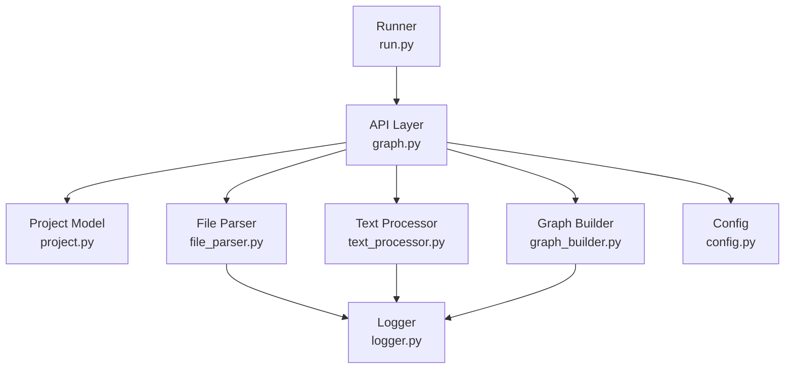
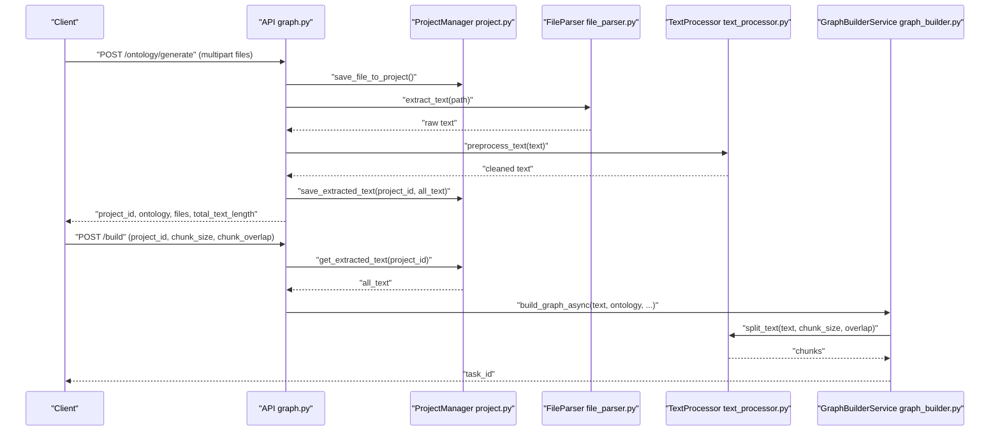
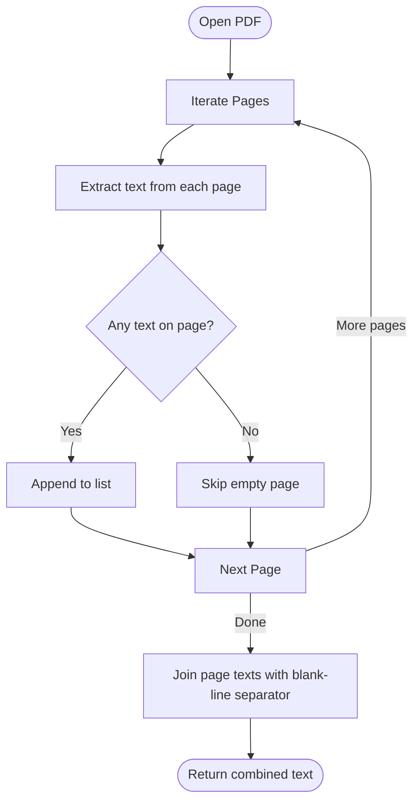
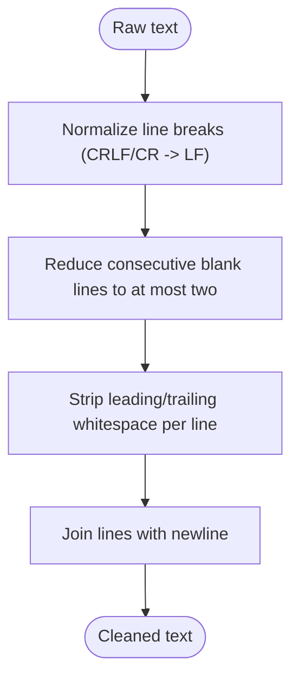
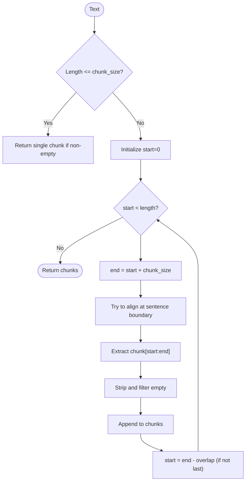
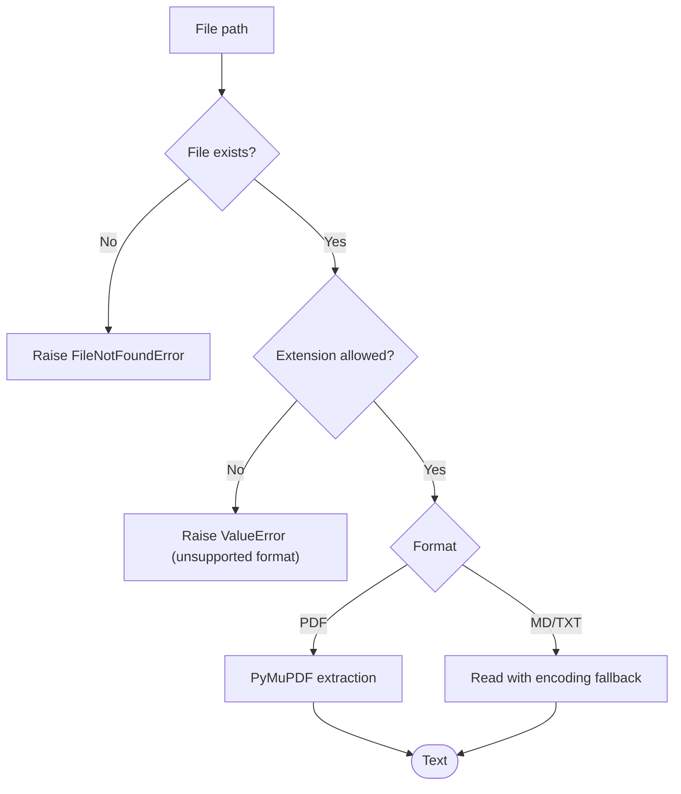
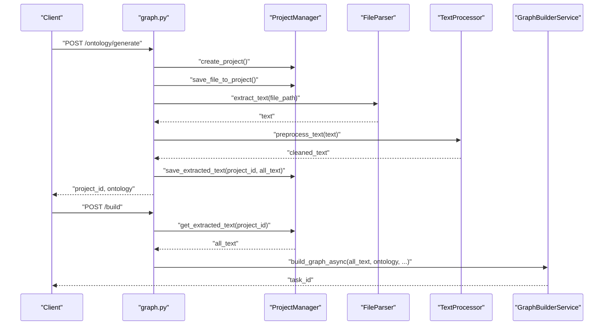
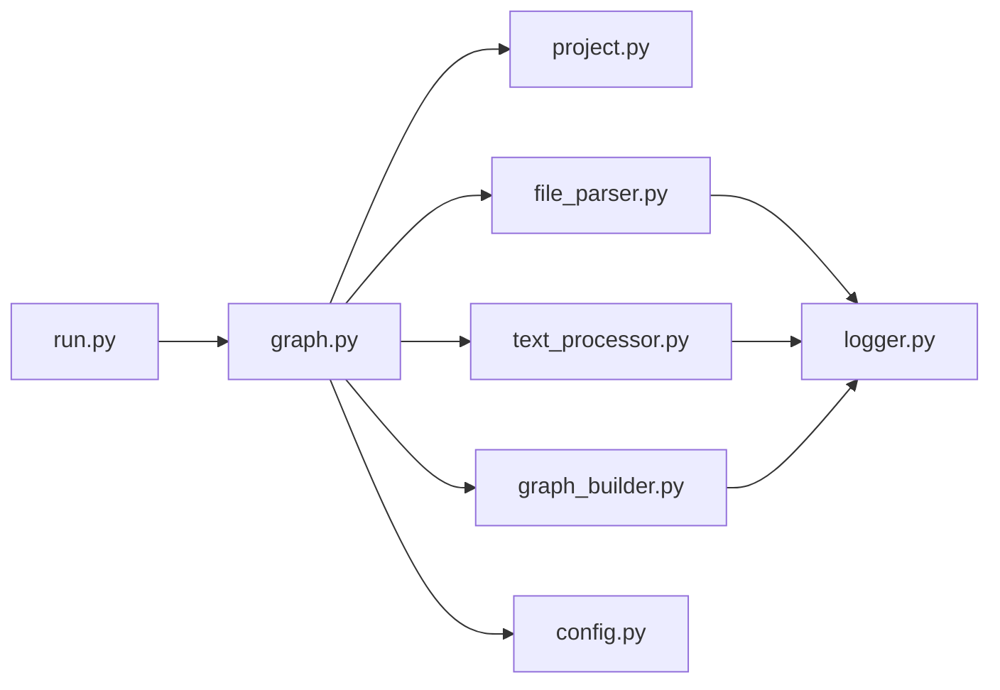

# Document Ingestion Pipeline

<cite>
**Referenced Files in This Document**
- [file_parser.py](file://backend/app/utils/file_parser.py)
- [text_processor.py](file://backend/app/services/text_processor.py)
- [graph.py](file://backend/app/api/graph.py)
- [graph_builder.py](file://backend/app/services/graph_builder.py)
- [project.py](file://backend/app/models/project.py)
- [config.py](file://backend/app/config.py)
- [logger.py](file://backend/app/utils/logger.py)
- [run.py](file://backend/run.py)
</cite>

## Table of Contents
1. [Introduction](#introduction)
2. [Project Structure](#project-structure)
3. [Core Components](#core-components)
4. [Architecture Overview](#architecture-overview)
5. [Detailed Component Analysis](#detailed-component-analysis)
6. [Dependency Analysis](#dependency-analysis)
7. [Performance Considerations](#performance-considerations)
8. [Troubleshooting Guide](#troubleshooting-guide)
9. [Conclusion](#conclusion)

## Introduction
This document describes the Document Ingestion Pipeline that transforms raw documents into structured text for knowledge graph construction. It covers:
- PDF processing workflow using PyMuPDF for text extraction, including page parsing and text formatting
- Text preprocessing pipeline for cleaning, normalization, and encoding handling
- File validation mechanisms for document integrity and format compatibility
- Supported document formats (PDF, DOCX, TXT) and their processing workflows
- Error handling for corrupted files, unsupported formats, and memory management during large document processing
- Configuration options for text extraction parameters and quality thresholds

## Project Structure
The ingestion pipeline spans several modules:
- API layer: orchestrates ingestion and graph building
- Project model: persists project state and extracted text
- File parsing utilities: extracts text from supported formats
- Text processing service: normalizes and chunks text
- Graph builder: splits text into chunks and coordinates LLM-based entity extraction
- Configuration and logging: centralizes settings and diagnostics

**Diagram sources**
- [graph.py:121-255](file://backend/app/api/graph.py#L121-L255)
- [project.py:133-306](file://backend/app/models/project.py#L133-L306)
- [file_parser.py:61-190](file://backend/app/utils/file_parser.py#L61-L190)
- [text_processor.py:9-72](file://backend/app/services/text_processor.py#L9-L72)
- [graph_builder.py:39-307](file://backend/app/services/graph_builder.py#L39-L307)
- [config.py:20-76](file://backend/app/config.py#L20-L76)
- [logger.py:30-127](file://backend/app/utils/logger.py#L30-L127)
- [run.py:25-51](file://backend/run.py#L25-L51)

**Section sources**
- [graph.py:121-255](file://backend/app/api/graph.py#L121-L255)
- [project.py:133-306](file://backend/app/models/project.py#L133-L306)
- [file_parser.py:61-190](file://backend/app/utils/file_parser.py#L61-L190)
- [text_processor.py:9-72](file://backend/app/services/text_processor.py#L9-L72)
- [graph_builder.py:39-307](file://backend/app/services/graph_builder.py#L39-L307)
- [config.py:20-76](file://backend/app/config.py#L20-L76)
- [logger.py:30-127](file://backend/app/utils/logger.py#L30-L127)
- [run.py:25-51](file://backend/run.py#L25-L51)

## Core Components
- FileParser: extracts text from PDF, Markdown, and TXT with robust encoding fallback
- TextProcessor: normalizes whitespace, removes excessive blank lines, and splits text into chunks
- ProjectManager: persists uploaded files, extracted text, and project state
- GraphBuilderService: orchestrates chunking, graph creation, and LLM-based entity extraction
- API endpoints: expose ingestion and graph-building workflows

Key responsibilities:
- Validation: checks file extensions and existence
- Extraction: reads and decodes text with fallback encodings
- Normalization: cleans and standardizes text
- Chunking: splits text into manageable pieces with overlap
- Persistence: stores extracted text and project metadata

**Section sources**
- [file_parser.py:61-190](file://backend/app/utils/file_parser.py#L61-L190)
- [text_processor.py:9-72](file://backend/app/services/text_processor.py#L9-L72)
- [project.py:133-306](file://backend/app/models/project.py#L133-L306)
- [graph_builder.py:39-307](file://backend/app/services/graph_builder.py#L39-L307)

## Architecture Overview
The ingestion pipeline follows a multi-stage flow:
1. Upload and validation: files are validated against allowed extensions and saved to project storage
2. Text extraction: FileParser extracts text from each file with encoding detection
3. Preprocessing: TextProcessor normalizes and cleans the extracted text
4. Chunking: Text is split into overlapping segments for downstream processing
5. Graph building: GraphBuilderService creates a graph, sets the ontology, adds text in batches, and triggers LLM-based entity extraction

**Diagram sources**
- [graph.py:121-255](file://backend/app/api/graph.py#L121-L255)
- [graph.py:259-523](file://backend/app/api/graph.py#L259-L523)
- [project.py:241-306](file://backend/app/models/project.py#L241-L306)
- [file_parser.py:61-190](file://backend/app/utils/file_parser.py#L61-L190)
- [text_processor.py:9-72](file://backend/app/services/text_processor.py#L9-L72)
- [graph_builder.py:51-184](file://backend/app/services/graph_builder.py#L51-L184)

## Detailed Component Analysis

### PDF Processing Workflow (PyMuPDF)
- Page parsing: iterates through pages and extracts raw text
- Layout preservation: preserves page boundaries by joining page texts with blank-line separators
- Text formatting: relies on PyMuPDF’s get_text output; minimal post-processing is applied

**Diagram sources**
- [file_parser.py:96-112](file://backend/app/utils/file_parser.py#L96-L112)

**Section sources**
- [file_parser.py:96-112](file://backend/app/utils/file_parser.py#L96-L112)

### Text Preprocessing Pipeline
- Whitespace normalization: converts CRLF and CR to LF, reduces multiple blank lines to at most two
- Line trimming: strips leading/trailing whitespace per line
- Final cleanup: strips leading/trailing whitespace from the entire text

**Diagram sources**
- [text_processor.py:37-61](file://backend/app/services/text_processor.py#L37-L61)

**Section sources**
- [text_processor.py:37-61](file://backend/app/services/text_processor.py#L37-L61)

### Text Chunking Algorithm
- Character-based splitting with configurable chunk size and overlap
- Sentence-aware boundary detection to minimize mid-sentence splits
- Overlap ensures continuity across chunk boundaries

**Diagram sources**
- [text_processor.py:18-35](file://backend/app/services/text_processor.py#L18-L35)
- [file_parser.py:147-189](file://backend/app/utils/file_parser.py#L147-L189)

**Section sources**
- [text_processor.py:18-35](file://backend/app/services/text_processor.py#L18-L35)
- [file_parser.py:147-189](file://backend/app/utils/file_parser.py#L147-L189)

### File Validation and Supported Formats
- Allowed extensions: pdf, md, txt, markdown
- Existence and extension checks before processing
- Encoding fallback strategy for text files:
  - UTF-8 decode
  - charset_normalizer detection
  - chardet detection
  - UTF-8 with replacement fallback

**Diagram sources**
- [file_parser.py:61-95](file://backend/app/utils/file_parser.py#L61-L95)
- [file_parser.py:11-58](file://backend/app/utils/file_parser.py#L11-L58)
- [config.py:38-41](file://backend/app/config.py#L38-L41)

**Section sources**
- [file_parser.py:61-95](file://backend/app/utils/file_parser.py#L61-L95)
- [file_parser.py:11-58](file://backend/app/utils/file_parser.py#L11-L58)
- [config.py:38-41](file://backend/app/config.py#L38-L41)

### API Workflows and End-to-End Ingestion
- Endpoint 1 (/ontology/generate): uploads files, validates, extracts, preprocesses, saves extracted text, generates ontology, and updates project state
- Endpoint 2 (/build): retrieves extracted text, creates graph, sets ontology, chunks text, adds episodes, and triggers LLM-based extraction

**Diagram sources**
- [graph.py:121-255](file://backend/app/api/graph.py#L121-L255)
- [graph.py:259-523](file://backend/app/api/graph.py#L259-L523)
- [project.py:241-306](file://backend/app/models/project.py#L241-L306)
- [file_parser.py:61-190](file://backend/app/utils/file_parser.py#L61-L190)
- [text_processor.py:9-72](file://backend/app/services/text_processor.py#L9-L72)
- [graph_builder.py:51-184](file://backend/app/services/graph_builder.py#L51-L184)

**Section sources**
- [graph.py:121-255](file://backend/app/api/graph.py#L121-L255)
- [graph.py:259-523](file://backend/app/api/graph.py#L259-L523)
- [project.py:241-306](file://backend/app/models/project.py#L241-L306)
- [file_parser.py:61-190](file://backend/app/utils/file_parser.py#L61-L190)
- [text_processor.py:9-72](file://backend/app/services/text_processor.py#L9-L72)
- [graph_builder.py:51-184](file://backend/app/services/graph_builder.py#L51-L184)

## Dependency Analysis
- API depends on ProjectManager, FileParser, TextProcessor, and GraphBuilderService
- FileParser depends on PyMuPDF for PDF and charset_normalizer/chardet for encoding detection
- TextProcessor depends on regex for normalization and FileParser for chunking
- GraphBuilderService depends on TextProcessor for chunking and on GraphStore for persistence
- ProjectManager persists files and extracted text to disk
- Config centralizes allowed extensions, chunk defaults, and upload limits
- Logger provides consistent logging across modules

**Diagram sources**
- [graph.py:121-255](file://backend/app/api/graph.py#L121-L255)
- [project.py:133-306](file://backend/app/models/project.py#L133-L306)
- [file_parser.py:61-190](file://backend/app/utils/file_parser.py#L61-L190)
- [text_processor.py:9-72](file://backend/app/services/text_processor.py#L9-L72)
- [graph_builder.py:39-307](file://backend/app/services/graph_builder.py#L39-L307)
- [config.py:20-76](file://backend/app/config.py#L20-L76)
- [logger.py:30-127](file://backend/app/utils/logger.py#L30-L127)
- [run.py:25-51](file://backend/run.py#L25-L51)

**Section sources**
- [graph.py:121-255](file://backend/app/api/graph.py#L121-L255)
- [project.py:133-306](file://backend/app/models/project.py#L133-L306)
- [file_parser.py:61-190](file://backend/app/utils/file_parser.py#L61-L190)
- [text_processor.py:9-72](file://backend/app/services/text_processor.py#L9-L72)
- [graph_builder.py:39-307](file://backend/app/services/graph_builder.py#L39-L307)
- [config.py:20-76](file://backend/app/config.py#L20-L76)
- [logger.py:30-127](file://backend/app/utils/logger.py#L30-L127)
- [run.py:25-51](file://backend/run.py#L25-L51)

## Performance Considerations
- Memory management: chunk_size and chunk_overlap balance memory usage and continuity; larger chunks reduce overhead but increase memory pressure
- Large documents: iterative chunking prevents loading entire documents into memory; batching in GraphBuilderService minimizes database overhead
- Encoding detection: charset_normalizer and chardet add overhead; ensure they are only used when UTF-8 fails
- Logging: rotating file handler prevents log growth; ensure UTF-8 output on Windows to avoid I/O issues

[No sources needed since this section provides general guidance]

## Troubleshooting Guide
Common issues and resolutions:
- Unsupported file format: verify extension matches allowed formats; see configuration for allowed extensions
- Corrupted PDF: PyMuPDF raises import errors if missing; ensure PyMuPDF is installed
- Encoding errors: FileParser applies multi-level fallback; if failures persist, inspect file encoding externally
- Empty or minimal extracted text: check preprocessing steps and ensure non-empty content before saving extracted text
- Large uploads: confirm MAX_CONTENT_LENGTH and upload folder permissions; adjust as needed

Operational checks:
- Configuration validation: runner validates required keys before startup
- Logging: use logger to capture detailed traces; console logs are concise, file logs are detailed

**Section sources**
- [config.py:38-41](file://backend/app/config.py#L38-L41)
- [file_parser.py:96-102](file://backend/app/utils/file_parser.py#L96-L102)
- [file_parser.py:11-58](file://backend/app/utils/file_parser.py#L11-L58)
- [run.py:27-34](file://backend/run.py#L27-L34)
- [logger.py:30-88](file://backend/app/utils/logger.py#L30-L88)

## Conclusion
The Document Ingestion Pipeline provides a robust, extensible foundation for transforming raw documents into structured knowledge graph-ready text. It supports PDF, Markdown, and TXT formats, incorporates resilient encoding handling, and integrates with a chunking and graph-building workflow. Configuration options enable tuning for performance and quality, while comprehensive logging and validation support operational reliability.