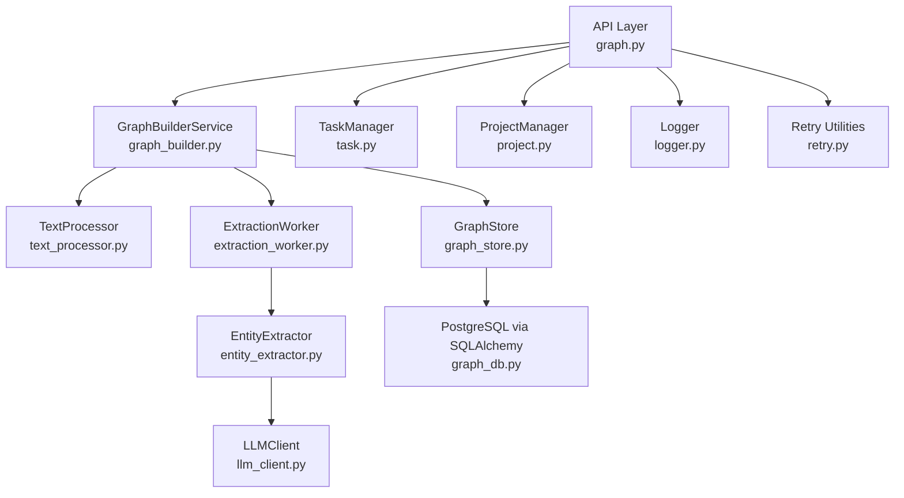
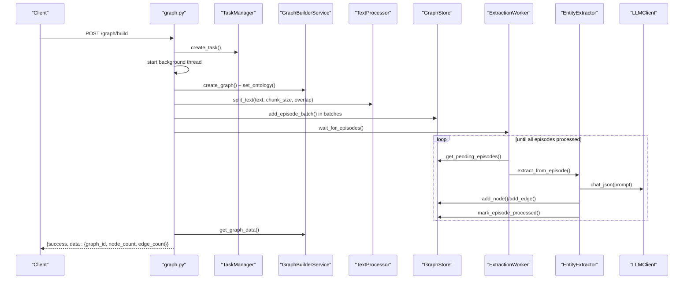
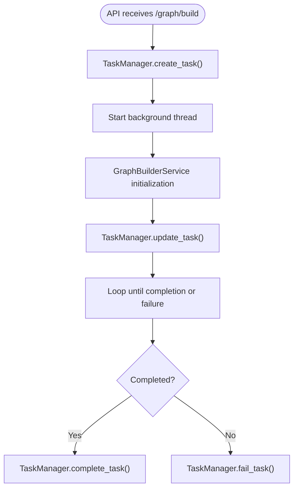
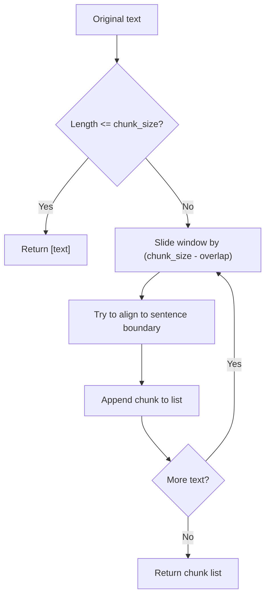
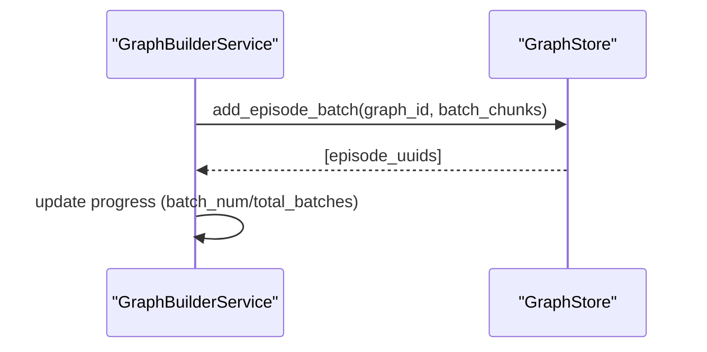
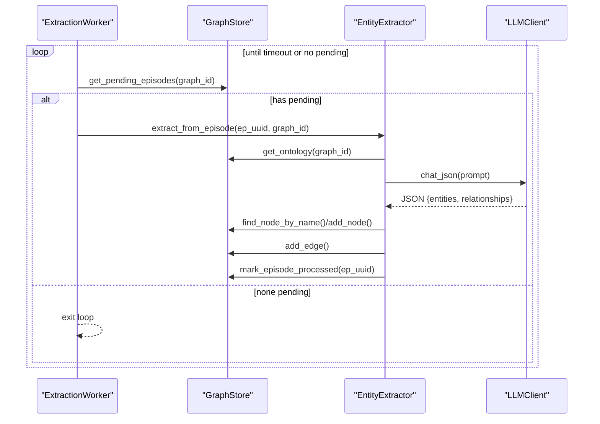
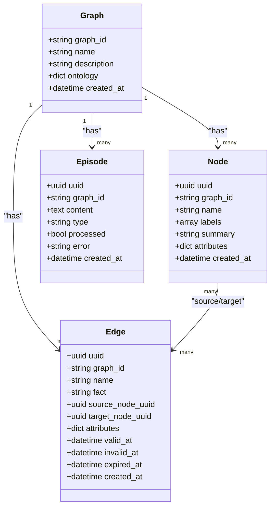
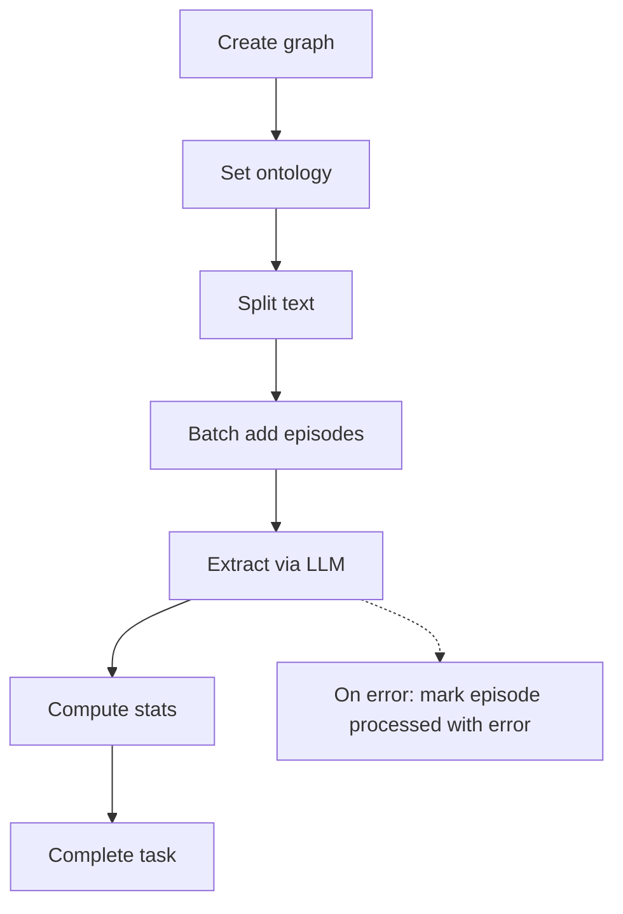
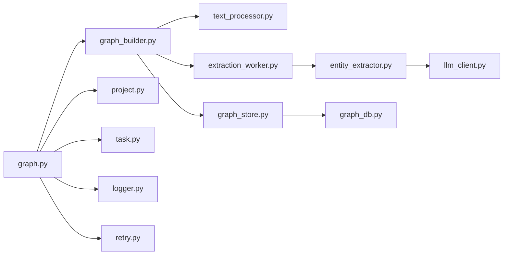

# Graph Construction Workflow

<cite>
**Referenced Files in This Document**
- [graph_builder.py](file://backend/app/services/graph_builder.py)
- [extraction_worker.py](file://backend/app/services/extraction_worker.py)
- [text_processor.py](file://backend/app/services/text_processor.py)
- [graph_store.py](file://backend/app/services/graph_store.py)
- [entity_extractor.py](file://backend/app/services/entity_extractor.py)
- [task.py](file://backend/app/models/task.py)
- [graph_db.py](file://backend/app/models/graph_db.py)
- [graph.py](file://backend/app/api/graph.py)
- [file_parser.py](file://backend/app/utils/file_parser.py)
- [llm_client.py](file://backend/app/utils/llm_client.py)
- [retry.py](file://backend/app/utils/retry.py)
- [config.py](file://backend/app/config.py)
- [logger.py](file://backend/app/utils/logger.py)
- [project.py](file://backend/app/models/project.py)
</cite>

## Table of Contents
1. [Introduction](#introduction)
2. [Project Structure](#project-structure)
3. [Core Components](#core-components)
4. [Architecture Overview](#architecture-overview)
5. [Detailed Component Analysis](#detailed-component-analysis)
6. [Dependency Analysis](#dependency-analysis)
7. [Performance Considerations](#performance-considerations)
8. [Troubleshooting Guide](#troubleshooting-guide)
9. [Conclusion](#conclusion)
10. [Appendices](#appendices)

## Introduction
This document explains the Graph Construction Workflow that transforms processed text into a structured knowledge graph. It covers the asynchronous pipeline using threading and task management, the text chunking strategy with configurable chunk sizes and overlaps, batch processing for memory and throughput control, the entity extraction workflow using ExtractionWorker, the graph persistence layer using GraphStore, progress tracking, and error recovery. It also provides examples of constructing graphs from real-world documents and outlines the resulting graph structure and query capabilities.

## Project Structure
The graph construction spans several modules:
- API layer orchestrates endpoints and task lifecycle
- Services encapsulate business logic for building, extracting, and storing graph data
- Models define the graph schema and database sessions
- Utilities provide LLM integration, retry logic, logging, and file parsing

**Diagram sources**
- [graph.py:1-604](file://backend/app/api/graph.py#L1-L604)
- [graph_builder.py:1-307](file://backend/app/services/graph_builder.py#L1-L307)
- [text_processor.py:1-72](file://backend/app/services/text_processor.py#L1-L72)
- [graph_store.py:1-375](file://backend/app/services/graph_store.py#L1-L375)
- [extraction_worker.py:1-109](file://backend/app/services/extraction_worker.py#L1-L109)
- [entity_extractor.py:1-291](file://backend/app/services/entity_extractor.py#L1-L291)
- [llm_client.py:1-104](file://backend/app/utils/llm_client.py#L1-L104)
- [graph_db.py:1-151](file://backend/app/models/graph_db.py#L1-L151)
- [task.py:1-185](file://backend/app/models/task.py#L1-L185)
- [project.py:1-306](file://backend/app/models/project.py#L1-L306)
- [logger.py:1-127](file://backend/app/utils/logger.py#L1-L127)
- [retry.py:1-239](file://backend/app/utils/retry.py#L1-L239)

**Section sources**
- [graph.py:1-604](file://backend/app/api/graph.py#L1-L604)
- [graph_builder.py:1-307](file://backend/app/services/graph_builder.py#L1-L307)
- [graph_store.py:1-375](file://backend/app/services/graph_store.py#L1-L375)

## Core Components
- GraphBuilderService: Orchestrates asynchronous graph construction, manages task progress, coordinates chunking, batching, and extraction.
- ExtractionWorker: Processes unprocessed episodes in a loop with timeouts and progress callbacks.
- EntityExtractor: Calls LLM to extract entities and relationships, stores nodes and edges, and marks episodes processed.
- GraphStore: Unified persistence layer for graphs, nodes, edges, episodes, and ontologies using PostgreSQL.
- TextProcessor: Provides text preprocessing and chunking with configurable chunk size and overlap.
- TaskManager: Thread-safe task status and progress tracking.
- ProjectManager: Persists project state across API calls.
- LLMClient: Wraps OpenAI-compatible API for JSON extraction.
- Utilities: Logging, retry, and file parsing.

**Section sources**
- [graph_builder.py:39-307](file://backend/app/services/graph_builder.py#L39-L307)
- [extraction_worker.py:16-109](file://backend/app/services/extraction_worker.py#L16-L109)
- [entity_extractor.py:16-291](file://backend/app/services/entity_extractor.py#L16-L291)
- [graph_store.py:21-375](file://backend/app/services/graph_store.py#L21-L375)
- [text_processor.py:9-72](file://backend/app/services/text_processor.py#L9-L72)
- [task.py:54-185](file://backend/app/models/task.py#L54-L185)
- [project.py:101-306](file://backend/app/models/project.py#L101-L306)
- [llm_client.py:14-104](file://backend/app/utils/llm_client.py#L14-L104)

## Architecture Overview
The workflow is initiated by an API endpoint that validates configuration, creates a task, and starts a background thread. The thread orchestrates:
1. Creating a graph and setting the ontology
2. Splitting text into chunks with configurable size and overlap
3. Adding episodes in batches to the database
4. Waiting for LLM-based extraction to complete
5. Returning graph data and updating task status

**Diagram sources**
- [graph.py:259-523](file://backend/app/api/graph.py#L259-L523)
- [graph_builder.py:94-184](file://backend/app/services/graph_builder.py#L94-L184)
- [text_processor.py:18-34](file://backend/app/services/text_processor.py#L18-L34)
- [graph_store.py:89-124](file://backend/app/services/graph_store.py#L89-L124)
- [extraction_worker.py:30-109](file://backend/app/services/extraction_worker.py#L30-L109)
- [entity_extractor.py:26-167](file://backend/app/services/entity_extractor.py#L26-L167)
- [llm_client.py:70-103](file://backend/app/utils/llm_client.py#L70-L103)

## Detailed Component Analysis

### Asynchronous Pipeline and Task Management
- The API creates a task and starts a background thread to avoid blocking the request.
- TaskManager tracks status, progress, and messages. It is thread-safe and supports listing and cleanup.
- GraphBuilderService mirrors progress updates to keep clients informed.

**Diagram sources**
- [graph.py:361-523](file://backend/app/api/graph.py#L361-L523)
- [task.py:73-185](file://backend/app/models/task.py#L73-L185)
- [graph_builder.py:104-184](file://backend/app/services/graph_builder.py#L104-L184)

**Section sources**
- [graph.py:361-523](file://backend/app/api/graph.py#L361-L523)
- [task.py:54-185](file://backend/app/models/task.py#L54-L185)
- [graph_builder.py:51-184](file://backend/app/services/graph_builder.py#L51-L184)

### Text Chunking Strategy
- TextProcessor.split_text uses configurable chunk_size and overlap, attempting to split at sentence boundaries for coherence.
- The chunking respects multilingual separators and avoids splitting mid-sentence when possible.
- Defaults are provided in configuration.

**Diagram sources**
- [text_processor.py:18-34](file://backend/app/services/text_processor.py#L18-L34)
- [file_parser.py:147-189](file://backend/app/utils/file_parser.py#L147-L189)
- [config.py:43-46](file://backend/app/config.py#L43-L46)

**Section sources**
- [text_processor.py:18-34](file://backend/app/services/text_processor.py#L18-L34)
- [file_parser.py:147-189](file://backend/app/utils/file_parser.py#L147-L189)
- [config.py:43-46](file://backend/app/config.py#L43-L46)

### Batch Processing Mechanism
- GraphBuilderService.add_text_batches adds episodes in fixed-size batches and reports progress.
- GraphStore.add_episode_batch persists multiple episodes efficiently in a single transaction.
- Batching controls memory usage and throughput during ingestion.

**Diagram sources**
- [graph_builder.py:199-226](file://backend/app/services/graph_builder.py#L199-L226)
- [graph_store.py:89-104](file://backend/app/services/graph_store.py#L89-L104)

**Section sources**
- [graph_builder.py:199-226](file://backend/app/services/graph_builder.py#L199-L226)
- [graph_store.py:89-104](file://backend/app/services/graph_store.py#L89-L104)

### Entity Extraction Workflow
- ExtractionWorker polls for pending episodes and processes them sequentially with a timeout guard.
- EntityExtractor builds a structured prompt using the graph’s ontology, calls LLM to extract entities and relationships, and stores nodes and edges.
- Episodes are marked processed (or with error) to prevent reprocessing.

**Diagram sources**
- [extraction_worker.py:30-109](file://backend/app/services/extraction_worker.py#L30-L109)
- [entity_extractor.py:26-167](file://backend/app/services/entity_extractor.py#L26-L167)
- [graph_store.py:115-114](file://backend/app/services/graph_store.py#L115-L114)
- [llm_client.py:70-103](file://backend/app/utils/llm_client.py#L70-L103)

**Section sources**
- [extraction_worker.py:30-109](file://backend/app/services/extraction_worker.py#L30-L109)
- [entity_extractor.py:26-167](file://backend/app/services/entity_extractor.py#L26-L167)
- [graph_store.py:115-114](file://backend/app/services/graph_store.py#L115-L114)

### Graph Persistence Layer
- GraphStore encapsulates CRUD operations for graphs, nodes, edges, episodes, and search.
- Nodes and edges include labels, summaries, attributes, and validity timestamps.
- Episodes track processed status and errors to support resiliency.
- Search leverages PostgreSQL ILIKE for facts/names/summaries.

**Diagram sources**
- [graph_db.py:24-105](file://backend/app/models/graph_db.py#L24-L105)
- [graph_store.py:32-375](file://backend/app/services/graph_store.py#L32-L375)

**Section sources**
- [graph_db.py:24-105](file://backend/app/models/graph_db.py#L24-L105)
- [graph_store.py:32-375](file://backend/app/services/graph_store.py#L32-L375)

### Progress Tracking and Error Recovery
- TaskManager maintains progress percentages and messages across stages.
- ExtractionWorker enforces a timeout and logs partial progress; episodes marked processed even on error.
- API endpoints expose task queries and project reset to recover from failures.

**Diagram sources**
- [graph_builder.py:104-184](file://backend/app/services/graph_builder.py#L104-L184)
- [extraction_worker.py:82-88](file://backend/app/services/extraction_worker.py#L82-L88)
- [graph.py:527-543](file://backend/app/api/graph.py#L527-L543)

**Section sources**
- [task.py:54-185](file://backend/app/models/task.py#L54-L185)
- [extraction_worker.py:82-88](file://backend/app/services/extraction_worker.py#L82-L88)
- [graph.py:527-543](file://backend/app/api/graph.py#L527-L543)

### Real-World Examples and Query Capabilities
- Example workflow:
  - Upload PDF/Markdown/TXT files via the first endpoint to generate an ontology.
  - Submit the project_id to the build endpoint with optional chunk_size and chunk_overlap.
  - Poll the task endpoint to monitor progress.
  - Retrieve the constructed graph data and inspect nodes and edges.
- Query capabilities:
  - Full-text search across edges and nodes using GraphStore.search.
  - Statistics via GraphStore.get_graph_statistics.
  - Pagination for nodes and edges to manage large datasets.

**Section sources**
- [graph.py:121-255](file://backend/app/api/graph.py#L121-L255)
- [graph.py:259-523](file://backend/app/api/graph.py#L259-L523)
- [graph_store.py:259-317](file://backend/app/services/graph_store.py#L259-L317)
- [graph_store.py:320-350](file://backend/app/services/graph_store.py#L320-L350)

## Dependency Analysis
- Coupling:
  - GraphBuilderService depends on TextProcessor, GraphStore, ExtractionWorker, and TaskManager.
  - ExtractionWorker depends on GraphStore and EntityExtractor.
  - EntityExtractor depends on GraphStore and LLMClient.
  - API layer depends on ProjectManager, TaskManager, and GraphBuilderService.
- Cohesion:
  - Each service/module focuses on a single responsibility (building, extracting, storing, managing tasks).
- External dependencies:
  - PostgreSQL via SQLAlchemy ORM
  - OpenAI-compatible LLM API
  - PyMuPDF for PDF parsing

**Diagram sources**
- [graph.py:1-604](file://backend/app/api/graph.py#L1-L604)
- [graph_builder.py:1-307](file://backend/app/services/graph_builder.py#L1-L307)
- [project.py:1-306](file://backend/app/models/project.py#L1-L306)
- [task.py:1-185](file://backend/app/models/task.py#L1-L185)
- [text_processor.py:1-72](file://backend/app/services/text_processor.py#L1-L72)
- [graph_store.py:1-375](file://backend/app/services/graph_store.py#L1-L375)
- [extraction_worker.py:1-109](file://backend/app/services/extraction_worker.py#L1-L109)
- [entity_extractor.py:1-291](file://backend/app/services/entity_extractor.py#L1-L291)
- [llm_client.py:1-104](file://backend/app/utils/llm_client.py#L1-L104)
- [graph_db.py:1-151](file://backend/app/models/graph_db.py#L1-L151)
- [logger.py:1-127](file://backend/app/utils/logger.py#L1-L127)
- [retry.py:1-239](file://backend/app/utils/retry.py#L1-L239)

**Section sources**
- [graph.py:1-604](file://backend/app/api/graph.py#L1-L604)
- [graph_builder.py:1-307](file://backend/app/services/graph_builder.py#L1-L307)
- [graph_store.py:1-375](file://backend/app/services/graph_store.py#L1-L375)

## Performance Considerations
- Chunking and overlap:
  - Larger chunk_size increases LLM context but memory usage; overlap ensures continuity.
  - Sentence-aware splitting reduces fragmentation.
- Batching:
  - Adjust batch_size to balance throughput and memory footprint.
- Database tuning:
  - SQLAlchemy session pooling and indexes on graph_id and processed flags improve performance.
- LLM cost and latency:
  - Lower temperature and structured JSON reduce hallucinations and parsing overhead.
  - Consider rate limits and implement retries with backoff.

[No sources needed since this section provides general guidance]

## Troubleshooting Guide
- Configuration validation:
  - Ensure LLM_API_KEY and DATABASE_URL are set; the API validates configuration before building.
- Task monitoring:
  - Use GET /graph/task/{task_id} to inspect progress and error details.
- Episode processing:
  - ExtractionWorker marks episodes processed even on error; check episode.error for details.
- Logs:
  - Centralized logging to file and console aids debugging; verify log directory permissions.
- Retries:
  - Use retry utilities for transient LLM/API failures.

**Section sources**
- [graph.py:282-293](file://backend/app/api/graph.py#L282-L293)
- [graph.py:527-543](file://backend/app/api/graph.py#L527-L543)
- [extraction_worker.py:82-88](file://backend/app/services/extraction_worker.py#L82-L88)
- [logger.py:26-127](file://backend/app/utils/logger.py#L26-L127)
- [retry.py:15-239](file://backend/app/utils/retry.py#L15-L239)

## Conclusion
The Graph Construction Workflow provides a robust, asynchronous pipeline for transforming text into a knowledge graph. It balances configurability (chunk size/overlap, batch size), resilience (progress tracking, error marking, retries), and scalability (batching, pagination, indexing) while leveraging a local LLM and PostgreSQL for full control and reproducibility.

[No sources needed since this section summarizes without analyzing specific files]

## Appendices

### API Endpoints Overview
- POST /graph/ontology/generate: Upload files and generate an ontology; returns project_id and ontology.
- POST /graph/build: Start graph build with project_id, optional chunking parameters; returns task_id.
- GET /graph/task/{task_id}: Query task progress and status.
- GET /graph/data/{graph_id}: Retrieve nodes and edges.
- DELETE /graph/delete/{graph_id}: Delete a graph.

**Section sources**
- [graph.py:121-255](file://backend/app/api/graph.py#L121-L255)
- [graph.py:259-523](file://backend/app/api/graph.py#L259-L523)
- [graph.py:562-604](file://backend/app/api/graph.py#L562-L604)