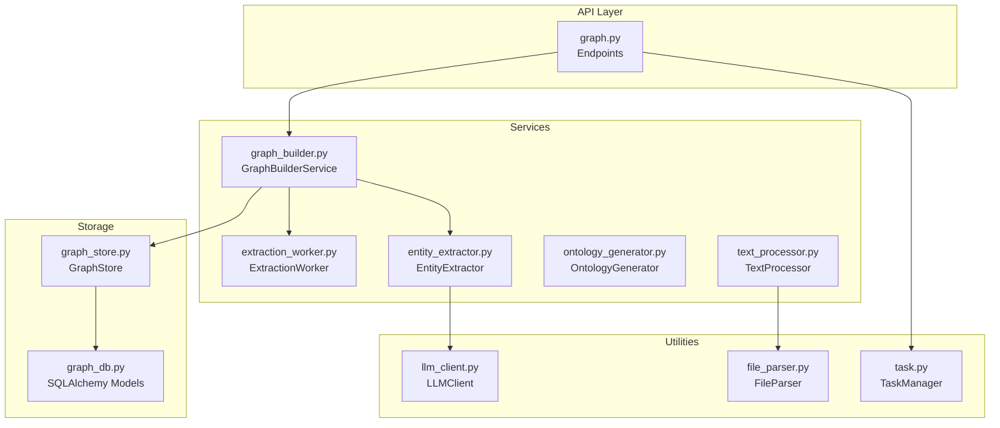
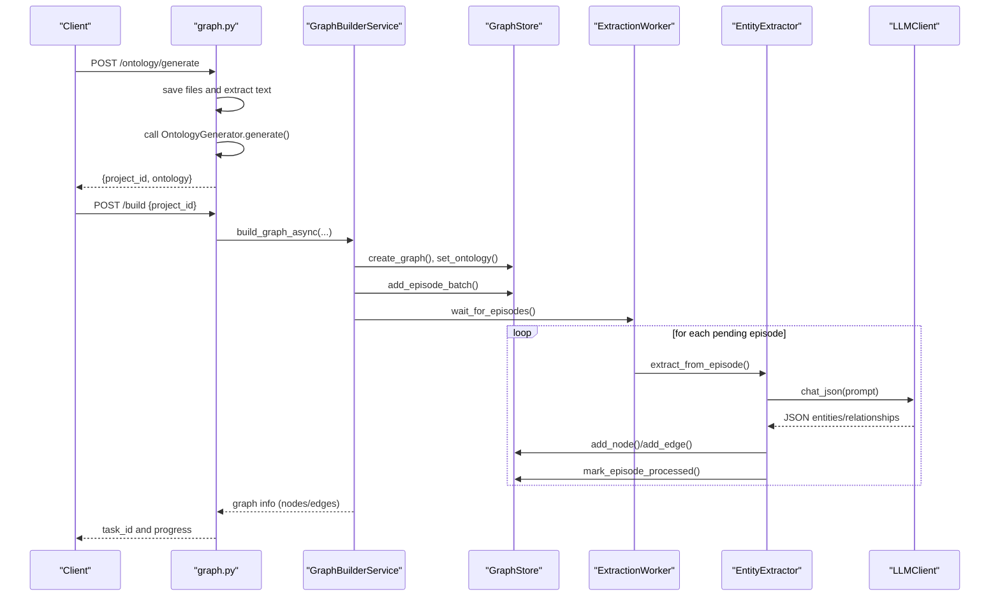
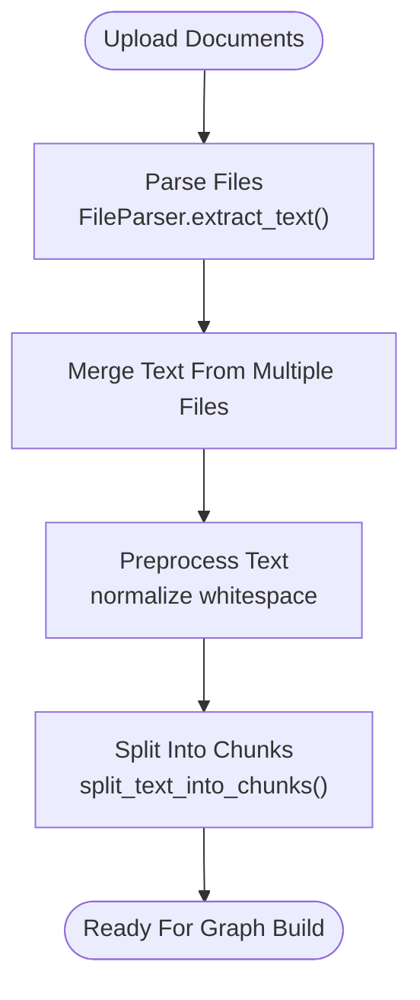
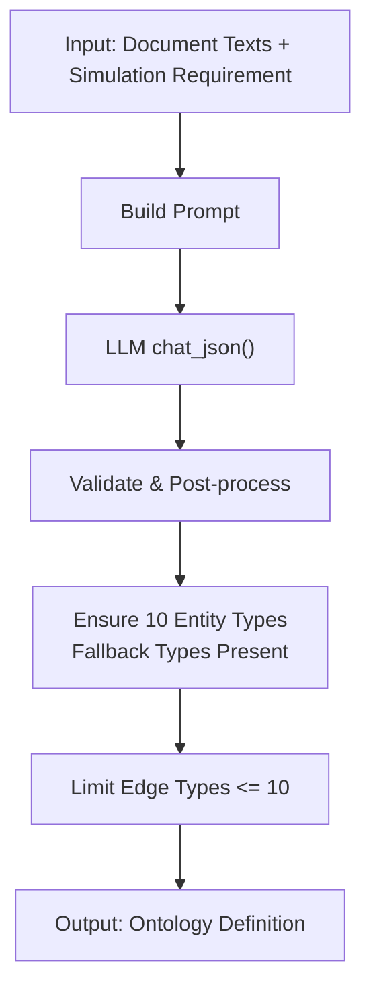
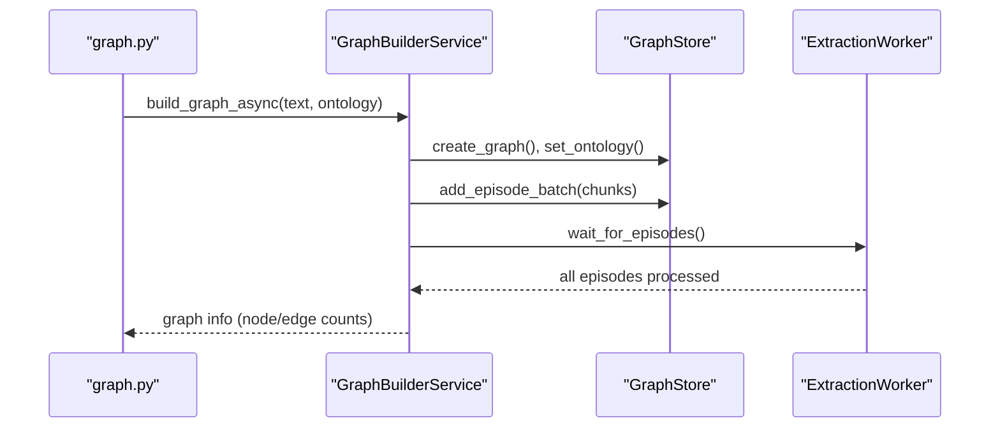
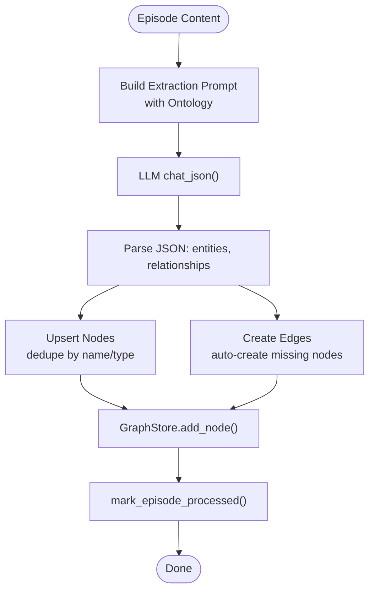
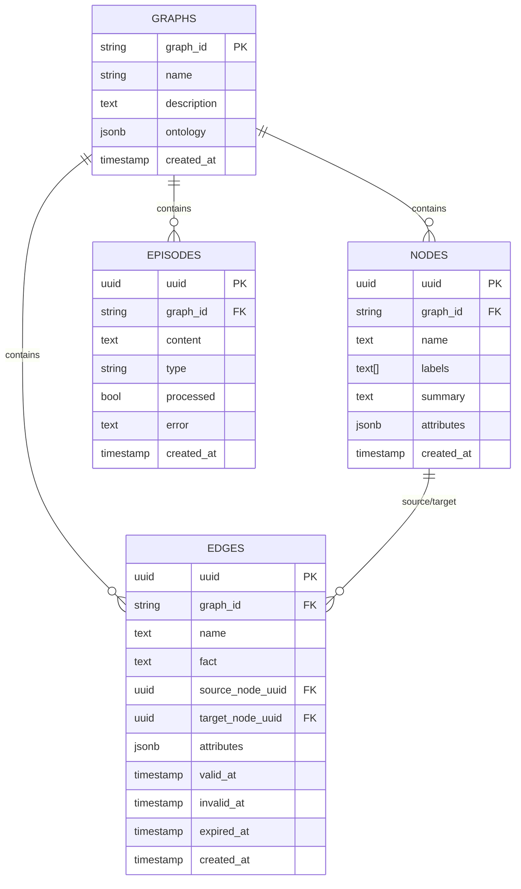
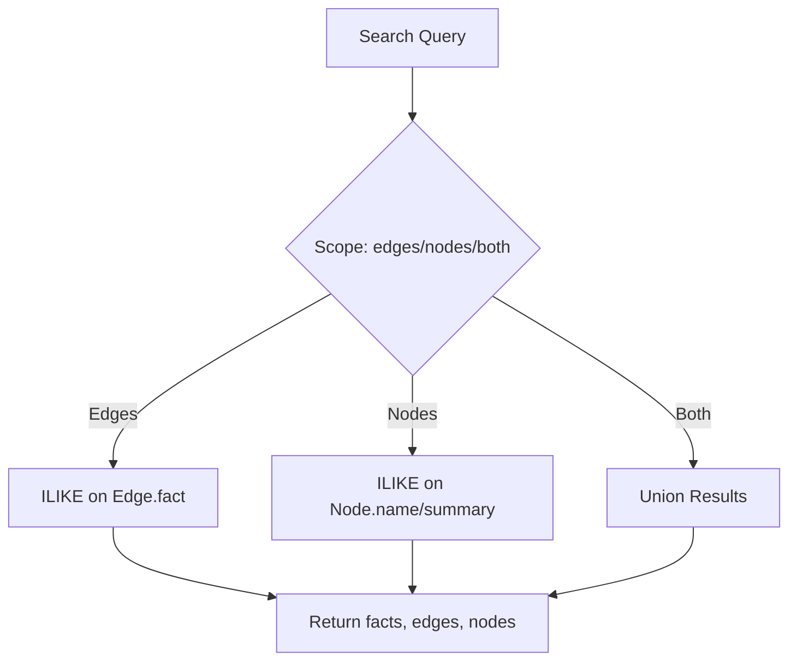
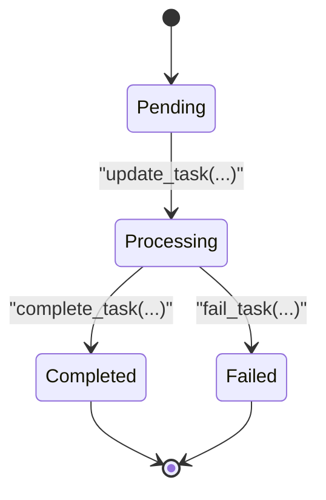
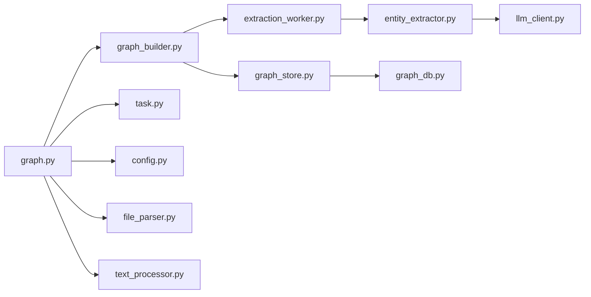

# Knowledge Graph System

<cite>
**Referenced Files in This Document**
- [README.md](file://README.md)
- [README-EN.md](file://README-EN.md)
- [run.py](file://backend/run.py)
- [config.py](file://backend/app/config.py)
- [graph.py](file://backend/app/api/graph.py)
- [graph_db.py](file://backend/app/models/graph_db.py)
- [graph_store.py](file://backend/app/services/graph_store.py)
- [graph_builder.py](file://backend/app/services/graph_builder.py)
- [extraction_worker.py](file://backend/app/services/extraction_worker.py)
- [entity_extractor.py](file://backend/app/services/entity_extractor.py)
- [ontology_generator.py](file://backend/app/services/ontology_generator.py)
- [text_processor.py](file://backend/app/services/text_processor.py)
- [file_parser.py](file://backend/app/utils/file_parser.py)
- [llm_client.py](file://backend/app/utils/llm_client.py)
- [task.py](file://backend/app/models/task.py)
</cite>

## Table of Contents
1. [Introduction](#introduction)
2. [Project Structure](#project-structure)
3. [Core Components](#core-components)
4. [Architecture Overview](#architecture-overview)
5. [Detailed Component Analysis](#detailed-component-analysis)
6. [Dependency Analysis](#dependency-analysis)
7. [Performance Considerations](#performance-considerations)
8. [Troubleshooting Guide](#troubleshooting-guide)
9. [Conclusion](#conclusion)
10. [Appendices](#appendices)

## Introduction
This document explains the Knowledge Graph System that powers Parallel World’s predictive capabilities. It covers the full pipeline from raw document ingestion (PDF, Markdown, and TXT) to text preprocessing, chunking, ontology-driven entity and relationship extraction, graph construction, persistence, and retrieval. It also describes how the system integrates with PostgreSQL and pgvector for semantic search, and how the resulting knowledge graphs enable accurate predictions in social simulation contexts.

## Project Structure
The backend is organized around:
- API layer: Flask blueprints exposing endpoints for project lifecycle, graph building, and task management
- Services: Orchestration, text processing, LLM-based extraction, and graph storage
- Models: SQLAlchemy ORM for graph storage (nodes, edges, episodes, graphs)
- Utilities: LLM client, file parsing, logging, and retry helpers

**Diagram sources**
- [graph.py:1-604](file://backend/app/api/graph.py#L1-L604)
- [graph_builder.py:1-307](file://backend/app/services/graph_builder.py#L1-L307)
- [extraction_worker.py:1-109](file://backend/app/services/extraction_worker.py#L1-L109)
- [entity_extractor.py:1-291](file://backend/app/services/entity_extractor.py#L1-L291)
- [ontology_generator.py:1-449](file://backend/app/services/ontology_generator.py#L1-L449)
- [text_processor.py:1-72](file://backend/app/services/text_processor.py#L1-L72)
- [graph_store.py:1-375](file://backend/app/services/graph_store.py#L1-L375)
- [graph_db.py:1-151](file://backend/app/models/graph_db.py#L1-L151)
- [llm_client.py:1-104](file://backend/app/utils/llm_client.py#L1-L104)
- [file_parser.py:1-190](file://backend/app/utils/file_parser.py#L1-L190)
- [task.py:1-185](file://backend/app/models/task.py#L1-L185)

**Section sources**
- [README.md:70-77](file://README.md#L70-L77)
- [README-EN.md:70-77](file://README-EN.md#L70-L77)
- [run.py:1-51](file://backend/run.py#L1-L51)
- [config.py:1-76](file://backend/app/config.py#L1-L76)

## Core Components
- Document ingestion and preprocessing: FileParser extracts text from PDF, Markdown, and TXT; TextProcessor normalizes whitespace and splits into chunks.
- Ontology generation: OntologyGenerator builds a domain-specific entity and relationship taxonomy tailored for social opinion simulation.
- Graph construction: GraphBuilderService orchestrates asynchronous graph creation, chunk ingestion, and LLM-powered extraction.
- Extraction worker: ExtractionWorker processes pending episodes and applies EntityExtractor to produce nodes and edges.
- Storage and retrieval: GraphStore persists graphs, nodes, edges, and episodes; provides search and statistics.
- LLM integration: LLMClient wraps OpenAI-compatible APIs for structured JSON responses.
- Task management: TaskManager tracks long-running operations with progress and completion status.

**Section sources**
- [file_parser.py:61-190](file://backend/app/utils/file_parser.py#L61-L190)
- [text_processor.py:9-72](file://backend/app/services/text_processor.py#L9-L72)
- [ontology_generator.py:158-449](file://backend/app/services/ontology_generator.py#L158-L449)
- [graph_builder.py:39-307](file://backend/app/services/graph_builder.py#L39-L307)
- [extraction_worker.py:16-109](file://backend/app/services/extraction_worker.py#L16-L109)
- [entity_extractor.py:16-291](file://backend/app/services/entity_extractor.py#L16-L291)
- [graph_store.py:21-375](file://backend/app/services/graph_store.py#L21-L375)
- [llm_client.py:14-104](file://backend/app/utils/llm_client.py#L14-L104)
- [task.py:54-185](file://backend/app/models/task.py#L54-L185)

## Architecture Overview
The system follows a pipeline:
1. Upload and parse documents → extract text
2. Preprocess and chunk text
3. Generate domain-specific ontology
4. Create graph and set ontology
5. Persist text chunks as episodes
6. Background extraction worker processes episodes via LLM
7. Store nodes and edges; maintain statistics
8. Retrieve and search graph data

**Diagram sources**
- [graph.py:121-255](file://backend/app/api/graph.py#L121-L255)
- [graph.py:259-523](file://backend/app/api/graph.py#L259-L523)
- [graph_builder.py:51-184](file://backend/app/services/graph_builder.py#L51-L184)
- [extraction_worker.py:30-109](file://backend/app/services/extraction_worker.py#L30-L109)
- [entity_extractor.py:26-167](file://backend/app/services/entity_extractor.py#L26-L167)
- [llm_client.py:70-104](file://backend/app/utils/llm_client.py#L70-L104)
- [graph_store.py:75-125](file://backend/app/services/graph_store.py#L75-L125)

## Detailed Component Analysis

### Document Ingestion Pipeline (PDF, Markdown, TXT)
- FileParser supports PDF via PyMuPDF, Markdown, and TXT with robust encoding fallback.
- TextProcessor normalizes whitespace and splits text into overlapping chunks optimized for downstream LLM processing.

**Diagram sources**
- [file_parser.py:61-190](file://backend/app/utils/file_parser.py#L61-L190)
- [text_processor.py:18-34](file://backend/app/services/text_processor.py#L18-L34)

**Section sources**
- [file_parser.py:61-190](file://backend/app/utils/file_parser.py#L61-L190)
- [text_processor.py:9-72](file://backend/app/services/text_processor.py#L9-L72)

### Ontology Generation for Social Simulation
- OntologyGenerator designs exactly 10 entity types (8 specific + 2 fallback Person/Organization) and 6–10 relationship types aligned with social media interactions.
- It enforces strict constraints: entity types must refer to real-world actors, attributes avoid reserved names, and output is validated to meet limits.

**Diagram sources**
- [ontology_generator.py:167-345](file://backend/app/services/ontology_generator.py#L167-L345)
- [llm_client.py:70-104](file://backend/app/utils/llm_client.py#L70-L104)

**Section sources**
- [ontology_generator.py:11-155](file://backend/app/services/ontology_generator.py#L11-L155)
- [ontology_generator.py:167-449](file://backend/app/services/ontology_generator.py#L167-L449)

### Graph Construction Workflow
- GraphBuilderService coordinates:
  - Creating a graph and setting its ontology
  - Chunking text and adding episodes in batches
  - Asynchronous LLM extraction via ExtractionWorker
  - Collecting graph statistics and returning structured data

**Diagram sources**
- [graph_builder.py:51-184](file://backend/app/services/graph_builder.py#L51-L184)
- [graph_store.py:75-125](file://backend/app/services/graph_store.py#L75-L125)
- [extraction_worker.py:93-109](file://backend/app/services/extraction_worker.py#L93-L109)

**Section sources**
- [graph_builder.py:39-307](file://backend/app/services/graph_builder.py#L39-L307)
- [graph_store.py:21-375](file://backend/app/services/graph_store.py#L21-L375)

### Entity and Relationship Extraction
- EntityExtractor builds extraction prompts using the ontology, calls LLM for structured JSON, and stores deduplicated nodes and edges.
- Deduplication is performed by name and optional type; missing nodes referenced in relationships are auto-created.

**Diagram sources**
- [entity_extractor.py:26-167](file://backend/app/services/entity_extractor.py#L26-L167)
- [graph_store.py:128-154](file://backend/app/services/graph_store.py#L128-L154)
- [graph_store.py:224-247](file://backend/app/services/graph_store.py#L224-L247)
- [graph_store.py:106-114](file://backend/app/services/graph_store.py#L106-L114)

**Section sources**
- [entity_extractor.py:16-291](file://backend/app/services/entity_extractor.py#L16-L291)
- [graph_store.py:128-247](file://backend/app/services/graph_store.py#L128-L247)

### Graph Schema and Data Models
- Graph: metadata container holding name, description, and JSONB-encoded ontology
- Node: labeled entities with name, labels, summary, attributes, and timestamps
- Edge: directed relationships with fact description, validity windows, and attributes
- Episode: persisted text chunks awaiting extraction

**Diagram sources**
- [graph_db.py:24-106](file://backend/app/models/graph_db.py#L24-L106)

**Section sources**
- [graph_db.py:1-151](file://backend/app/models/graph_db.py#L1-L151)

### Semantic Search and Retrieval
- GraphStore.search performs full-text search across edge facts and node names/summaries using PostgreSQL ILIKE queries.
- Results include matched facts, edges, and nodes with counts and query metadata.

**Diagram sources**
- [graph_store.py:259-317](file://backend/app/services/graph_store.py#L259-L317)

**Section sources**
- [graph_store.py:257-317](file://backend/app/services/graph_store.py#L257-L317)

### Task Management and Progress Tracking
- TaskManager maintains in-memory task state with thread safety, progress percentages, and detailed messages.
- API endpoints expose task status and results for asynchronous graph builds.

**Diagram sources**
- [task.py:14-52](file://backend/app/models/task.py#L14-L52)
- [task.py:106-163](file://backend/app/models/task.py#L106-L163)

**Section sources**
- [task.py:54-185](file://backend/app/models/task.py#L54-L185)
- [graph.py:527-558](file://backend/app/api/graph.py#L527-L558)

## Dependency Analysis
- API depends on services and models for orchestration and persistence.
- Services depend on utilities for LLM calls and file/text processing.
- Storage models rely on SQLAlchemy and pgvector for vector embeddings.

**Diagram sources**
- [graph.py:1-604](file://backend/app/api/graph.py#L1-L604)
- [graph_builder.py:1-307](file://backend/app/services/graph_builder.py#L1-L307)
- [graph_store.py:1-375](file://backend/app/services/graph_store.py#L1-L375)
- [extraction_worker.py:1-109](file://backend/app/services/extraction_worker.py#L1-L109)
- [entity_extractor.py:1-291](file://backend/app/services/entity_extractor.py#L1-L291)
- [llm_client.py:1-104](file://backend/app/utils/llm_client.py#L1-L104)
- [graph_db.py:1-151](file://backend/app/models/graph_db.py#L1-L151)
- [config.py:1-76](file://backend/app/config.py#L1-L76)
- [file_parser.py:1-190](file://backend/app/utils/file_parser.py#L1-L190)
- [text_processor.py:1-72](file://backend/app/services/text_processor.py#L1-L72)

**Section sources**
- [graph.py:1-604](file://backend/app/api/graph.py#L1-L604)
- [graph_builder.py:1-307](file://backend/app/services/graph_builder.py#L1-L307)
- [graph_store.py:1-375](file://backend/app/services/graph_store.py#L1-L375)

## Performance Considerations
- Chunking strategy: Use moderate chunk sizes with overlap to balance context retention and LLM token limits.
- Batch ingestion: Adding episodes in small batches reduces memory pressure and improves throughput.
- Deduplication: Name-based deduplication prevents redundant nodes and edges.
- Search scope: Limit search to edges or nodes depending on query intent to reduce result sets.
- Database tuning: Ensure proper indexing on graph_id, name, and processed flags for efficient lookups.

[No sources needed since this section provides general guidance]

## Troubleshooting Guide
Common issues and resolutions:
- Missing LLM credentials: Ensure LLM_API_KEY and LLM_BASE_URL are configured.
- Database connectivity: Verify DATABASE_URL and that PostgreSQL is reachable.
- PyMuPDF not installed: The system requires PyMuPDF for PDF parsing.
- Large text truncation: Ontology generation truncates input beyond a threshold; ensure key content remains intact.
- Task stuck: Check TaskManager status and logs; confirm ExtractionWorker is running and episodes are progressing.

**Section sources**
- [config.py:30-41](file://backend/app/config.py#L30-L41)
- [config.py:67-75](file://backend/app/config.py#L67-L75)
- [file_parser.py:96-112](file://backend/app/utils/file_parser.py#L96-L112)
- [ontology_generator.py:208-227](file://backend/app/services/ontology_generator.py#L208-L227)
- [task.py:106-163](file://backend/app/models/task.py#L106-L163)

## Conclusion
The Knowledge Graph System transforms heterogeneous documents into a structured, queryable knowledge graph using domain-specific ontologies and LLM-powered extraction. Its modular design enables scalable ingestion, robust persistence, and flexible retrieval, laying the groundwork for advanced social simulations and predictions.

[No sources needed since this section summarizes without analyzing specific files]

## Appendices

### Example Workflow: Building a Graph from Seed Materials
- Upload PDF/Markdown/TXT files
- Call /ontology/generate to derive an ontology
- Call /build with project_id to start graph construction
- Monitor progress via /task/{task_id}
- Retrieve graph data via /data/{graph_id}

**Section sources**
- [graph.py:121-255](file://backend/app/api/graph.py#L121-L255)
- [graph.py:259-523](file://backend/app/api/graph.py#L259-L523)
- [graph.py:527-558](file://backend/app/api/graph.py#L527-L558)
- [graph.py:562-582](file://backend/app/api/graph.py#L562-L582)