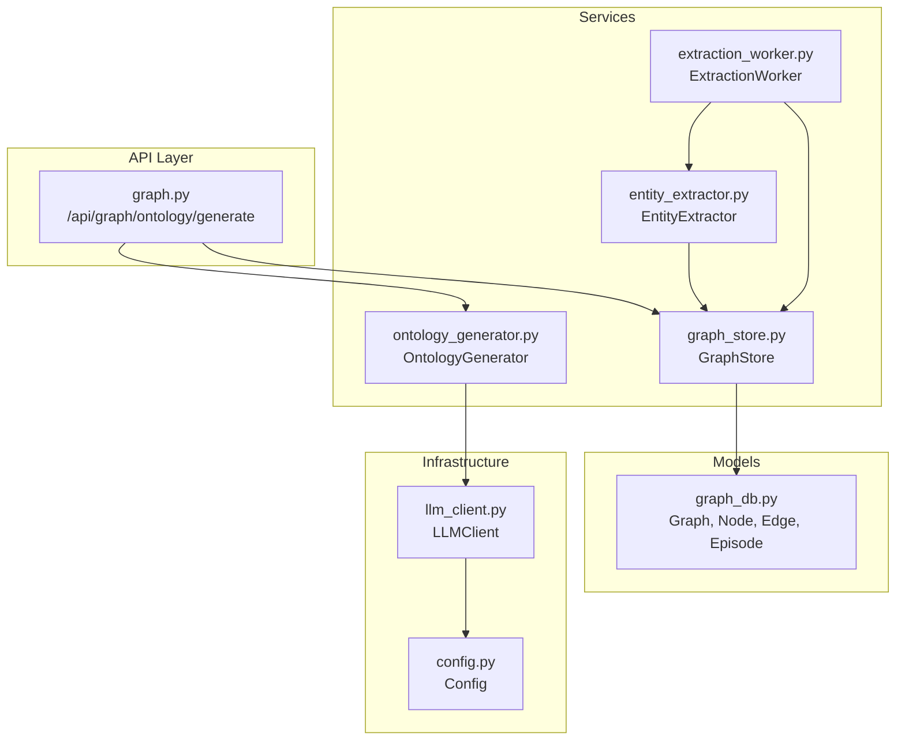
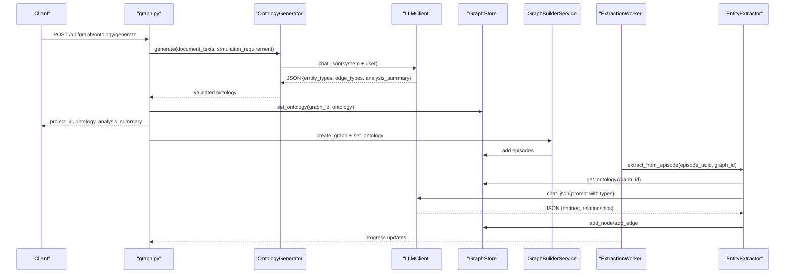
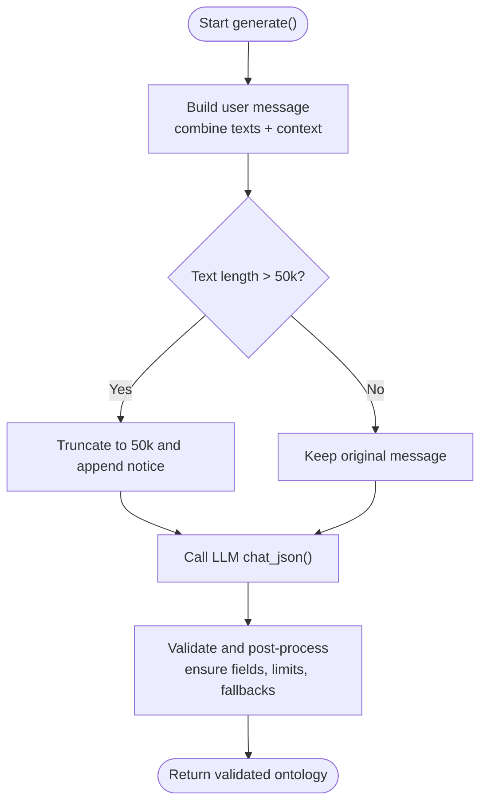
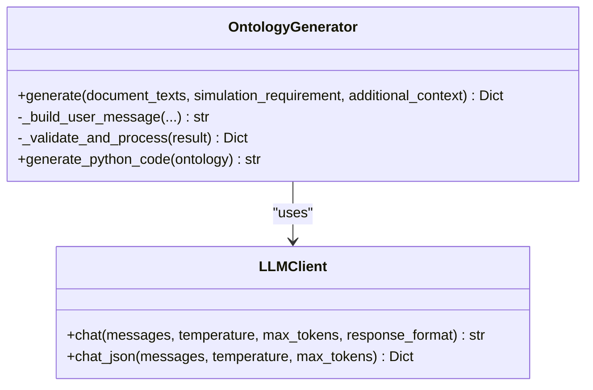
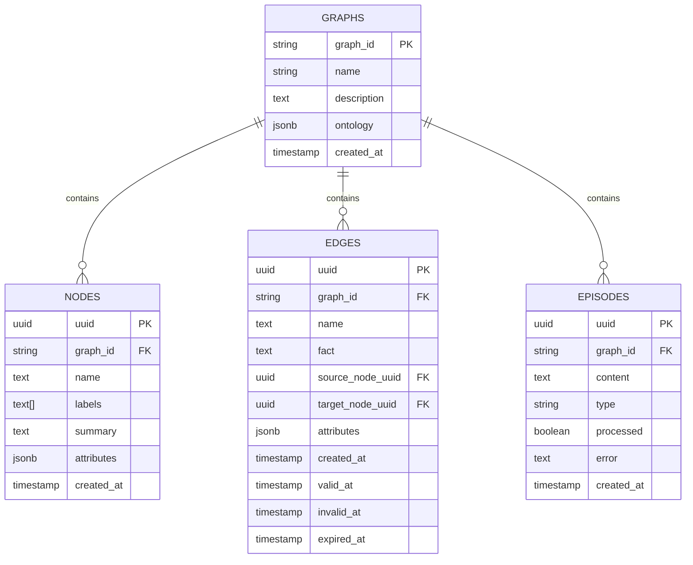
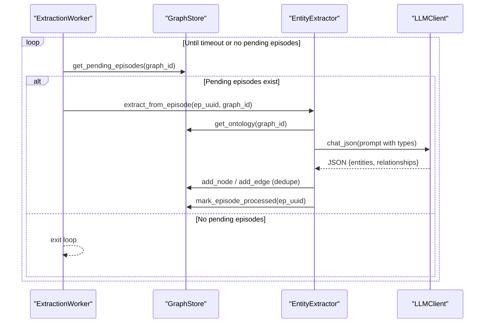
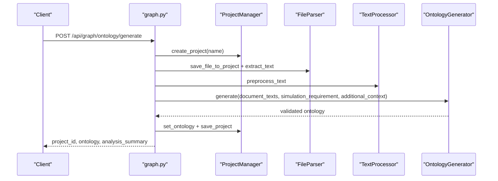
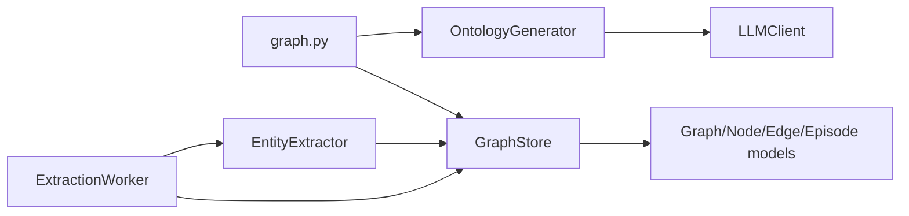
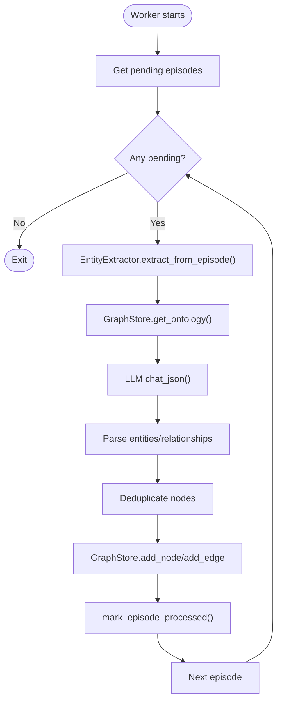

# Ontology Generation Process

<cite>
**Referenced Files in This Document**
- [ontology_generator.py](file://backend/app/services/ontology_generator.py)
- [entity_extractor.py](file://backend/app/services/entity_extractor.py)
- [extraction_worker.py](file://backend/app/services/extraction_worker.py)
- [graph_store.py](file://backend/app/services/graph_store.py)
- [graph_db.py](file://backend/app/models/graph_db.py)
- [llm_client.py](file://backend/app/utils/llm_client.py)
- [graph.py](file://backend/app/api/graph.py)
- [config.py](file://backend/app/config.py)
- [Step1GraphBuild.vue](file://frontend/src/components/Step1GraphBuild.vue)
</cite>

## Table of Contents
1. [Introduction](#introduction)
2. [Project Structure](#project-structure)
3. [Core Components](#core-components)
4. [Architecture Overview](#architecture-overview)
5. [Detailed Component Analysis](#detailed-component-analysis)
6. [Dependency Analysis](#dependency-analysis)
7. [Performance Considerations](#performance-considerations)
8. [Troubleshooting Guide](#troubleshooting-guide)
9. [Conclusion](#conclusion)
10. [Appendices](#appendices)

## Introduction
This document explains the Ontology Generation Process that defines the conceptual framework for knowledge representation in the system. It covers how LLM-driven analysis identifies entity types, relationship types, and attribute schemas from seed materials, and how the resulting ontology is validated and integrated with the extraction pipeline. The process ensures that the generated knowledge graph supports social opinion simulation by focusing on real-world actors and their interactions.

## Project Structure
The ontology generation process spans several backend services and models:
- API layer orchestrating the workflow
- Ontology generation service using LLM prompts
- LLM client abstraction
- Graph storage and persistence
- Extraction worker and entity extractor for validation and application

**Diagram sources**
- [graph.py:121-255](file://backend/app/api/graph.py#L121-L255)
- [ontology_generator.py:158-206](file://backend/app/services/ontology_generator.py#L158-L206)
- [entity_extractor.py:16-25](file://backend/app/services/entity_extractor.py#L16-L25)
- [extraction_worker.py:16-25](file://backend/app/services/extraction_worker.py#L16-L25)
- [graph_store.py:21-72](file://backend/app/services/graph_store.py#L21-L72)
- [graph_db.py:24-105](file://backend/app/models/graph_db.py#L24-L105)
- [llm_client.py:14-34](file://backend/app/utils/llm_client.py#L14-L34)
- [config.py:20-76](file://backend/app/config.py#L20-L76)

**Section sources**
- [graph.py:121-255](file://backend/app/api/graph.py#L121-L255)
- [ontology_generator.py:158-206](file://backend/app/services/ontology_generator.py#L158-L206)
- [entity_extractor.py:16-25](file://backend/app/services/entity_extractor.py#L16-L25)
- [extraction_worker.py:16-25](file://backend/app/services/extraction_worker.py#L16-L25)
- [graph_store.py:21-72](file://backend/app/services/graph_store.py#L21-L72)
- [graph_db.py:24-105](file://backend/app/models/graph_db.py#L24-L105)
- [llm_client.py:14-34](file://backend/app/utils/llm_client.py#L14-L34)
- [config.py:20-76](file://backend/app/config.py#L20-L76)

## Core Components
- OntologyGenerator: Builds a structured prompt and calls the LLM to produce entity and relationship type definitions, then validates and post-processes the result.
- LLMClient: Provides a unified interface to OpenAI-compatible APIs, returning JSON responses for strict schema enforcement.
- GraphStore: Persists the generated ontology and manages episodes, nodes, and edges in PostgreSQL.
- EntityExtractor: Uses the ontology to extract entities and relationships from text using LLM, storing them into the graph.
- ExtractionWorker: Processes unprocessed episodes in batches, invoking the entity extractor and handling timeouts and errors.

**Section sources**
- [ontology_generator.py:158-345](file://backend/app/services/ontology_generator.py#L158-L345)
- [llm_client.py:14-104](file://backend/app/utils/llm_client.py#L14-L104)
- [graph_store.py:56-71](file://backend/app/services/graph_store.py#L56-L71)
- [entity_extractor.py:16-291](file://backend/app/services/entity_extractor.py#L16-L291)
- [extraction_worker.py:16-109](file://backend/app/services/extraction_worker.py#L16-L109)

## Architecture Overview
The Ontology Generation Process follows a clear workflow:
1. Upload seed materials and simulation requirements via the API.
2. Extract text from files and call the OntologyGenerator to produce an ontology.
3. Persist the ontology and trigger graph building.
4. Split text into episodes and process them asynchronously.
5. Validate and apply the generated ontology during extraction.

**Diagram sources**
- [graph.py:121-255](file://backend/app/api/graph.py#L121-L255)
- [ontology_generator.py:167-206](file://backend/app/services/ontology_generator.py#L167-L206)
- [llm_client.py:70-104](file://backend/app/utils/llm_client.py#L70-L104)
- [graph_store.py:56-71](file://backend/app/services/graph_store.py#L56-L71)
- [entity_extractor.py:26-167](file://backend/app/services/entity_extractor.py#L26-L167)
- [extraction_worker.py:26-109](file://backend/app/services/extraction_worker.py#L26-L109)

## Detailed Component Analysis

### Ontology Generation Service
The OntologyGenerator drives the LLM to produce a structured knowledge graph schema tailored for social opinion simulation. It enforces:
- Exactly 10 entity types, with the last two being fallback types (Person and Organization).
- 6–10 relationship types reflecting real-world social media interactions.
- Attribute constraints to avoid reserved words and encourage meaningful properties.

Key behaviors:
- Builds a comprehensive system prompt that defines the simulation domain and output format.
- Truncates input text to a safe length before sending to the LLM.
- Validates and post-processes results to ensure required fields and enforce limits.
- Generates Python code compatible with the graph schema for downstream use.

**Diagram sources**
- [ontology_generator.py:167-206](file://backend/app/services/ontology_generator.py#L167-L206)
- [ontology_generator.py:211-255](file://backend/app/services/ontology_generator.py#L211-L255)
- [ontology_generator.py:257-345](file://backend/app/services/ontology_generator.py#L257-L345)

**Section sources**
- [ontology_generator.py:11-155](file://backend/app/services/ontology_generator.py#L11-L155)
- [ontology_generator.py:167-206](file://backend/app/services/ontology_generator.py#L167-L206)
- [ontology_generator.py:211-255](file://backend/app/services/ontology_generator.py#L211-L255)
- [ontology_generator.py:257-345](file://backend/app/services/ontology_generator.py#L257-L345)

### LLM Client and Prompt Engineering
The LLMClient abstracts OpenAI-compatible APIs and enforces JSON response format for deterministic schema parsing. The OntologyGenerator composes a detailed system prompt that:
- Defines the social opinion simulation domain.
- Specifies output format and constraints.
- Provides entity and relationship type references.
- Enforces mandatory rules for entity type hierarchy and attribute naming.

**Diagram sources**
- [llm_client.py:14-104](file://backend/app/utils/llm_client.py#L14-L104)
- [ontology_generator.py:158-206](file://backend/app/services/ontology_generator.py#L158-L206)

**Section sources**
- [llm_client.py:14-104](file://backend/app/utils/llm_client.py#L14-L104)
- [ontology_generator.py:11-155](file://backend/app/services/ontology_generator.py#L11-L155)

### Graph Storage and Ontology Persistence
GraphStore persists the generated ontology alongside graph metadata and manages episodes, nodes, and edges. The Graph model stores the ontology as JSONB, enabling flexible schema evolution.

**Diagram sources**
- [graph_db.py:24-105](file://backend/app/models/graph_db.py#L24-L105)
- [graph_store.py:56-71](file://backend/app/services/graph_store.py#L56-L71)

**Section sources**
- [graph_db.py:24-105](file://backend/app/models/graph_db.py#L24-L105)
- [graph_store.py:56-71](file://backend/app/services/graph_store.py#L56-L71)

### Entity Extraction and Validation Pipeline
EntityExtractor uses the stored ontology to guide LLM extraction, ensuring entities and relationships conform to the defined schema. It deduplicates nodes, auto-creates missing nodes referenced in relationships, and stores results in the graph. ExtractionWorker coordinates batch processing of episodes with progress callbacks and timeout handling.

**Diagram sources**
- [extraction_worker.py:30-109](file://backend/app/services/extraction_worker.py#L30-L109)
- [entity_extractor.py:26-167](file://backend/app/services/entity_extractor.py#L26-L167)
- [graph_store.py:115-124](file://backend/app/services/graph_store.py#L115-L124)

**Section sources**
- [entity_extractor.py:26-167](file://backend/app/services/entity_extractor.py#L26-L167)
- [extraction_worker.py:30-109](file://backend/app/services/extraction_worker.py#L30-L109)
- [graph_store.py:115-124](file://backend/app/services/graph_store.py#L115-L124)

### API Orchestration for Ontology Generation
The API endpoint handles file uploads, text preprocessing, and orchestration of the OntologyGenerator. It saves extracted text, generates the ontology, persists it to the project, and updates project status.

**Diagram sources**
- [graph.py:121-255](file://backend/app/api/graph.py#L121-L255)

**Section sources**
- [graph.py:121-255](file://backend/app/api/graph.py#L121-L255)

## Dependency Analysis
- OntologyGenerator depends on LLMClient for structured JSON responses.
- EntityExtractor depends on GraphStore for retrieving the ontology and persisting results.
- ExtractionWorker coordinates EntityExtractor and GraphStore for batch processing.
- GraphStore encapsulates SQLAlchemy models for graph, node, edge, and episode persistence.
- API layer orchestrates the entire workflow and delegates to services.

**Diagram sources**
- [ontology_generator.py:164-165](file://backend/app/services/ontology_generator.py#L164-L165)
- [entity_extractor.py:22-24](file://backend/app/services/entity_extractor.py#L22-L24)
- [extraction_worker.py:22-24](file://backend/app/services/extraction_worker.py#L22-L24)
- [graph_store.py:21-72](file://backend/app/services/graph_store.py#L21-L72)
- [graph_db.py:24-105](file://backend/app/models/graph_db.py#L24-L105)
- [graph.py:121-255](file://backend/app/api/graph.py#L121-L255)

**Section sources**
- [ontology_generator.py:164-165](file://backend/app/services/ontology_generator.py#L164-L165)
- [entity_extractor.py:22-24](file://backend/app/services/entity_extractor.py#L22-L24)
- [extraction_worker.py:22-24](file://backend/app/services/extraction_worker.py#L22-L24)
- [graph_store.py:21-72](file://backend/app/services/graph_store.py#L21-L72)
- [graph_db.py:24-105](file://backend/app/models/graph_db.py#L24-L105)
- [graph.py:121-255](file://backend/app/api/graph.py#L121-L255)

## Performance Considerations
- Input truncation: The OntologyGenerator truncates combined text to a maximum length before sending to the LLM to prevent token limit issues.
- Batch processing: ExtractionWorker processes episodes in batches with small delays to balance throughput and rate limits.
- JSON parsing: LLMClient strips markdown code blocks and validates JSON to avoid parsing errors.
- Database indexing: GraphStore models include indexes on frequently queried fields to improve search and retrieval performance.

[No sources needed since this section provides general guidance]

## Troubleshooting Guide
Common issues and resolutions:
- LLM API configuration errors: Verify LLM_API_KEY, LLM_BASE_URL, and LLM_MODEL_NAME in the environment.
- Missing or invalid project status: Ensure the project has generated an ontology before attempting graph building.
- Extraction failures: Check episode processing logs and confirm that GraphStore marks episodes as processed with error details when exceptions occur.
- JSON parsing errors: LLMClient raises explicit errors when the LLM returns invalid JSON; review the raw response and adjust prompts accordingly.

**Section sources**
- [config.py:66-75](file://backend/app/config.py#L66-L75)
- [graph.py:313-320](file://backend/app/api/graph.py#L313-L320)
- [entity_extractor.py:164-167](file://backend/app/services/entity_extractor.py#L164-L167)
- [llm_client.py:99-103](file://backend/app/utils/llm_client.py#L99-L103)

## Conclusion
The Ontology Generation Process provides a robust, LLM-driven framework for defining entity and relationship schemas tailored to social opinion simulation. It enforces strict constraints on entity types and attributes, validates outputs, and integrates seamlessly with the extraction pipeline to construct and validate knowledge graphs. The modular design enables iterative refinement by adjusting prompts, context, and attributes to improve recognition accuracy.

## Appendices

### Entity Classification System
The system defines a strict hierarchy for entity types:
- Fallback types (always included as the last two):
  - Person: natural person not fitting specific types
  - Organization: organization not fitting specific types
- Specific types (8 designed from text content):
  - Examples include Student, Professor, Journalist, Celebrity, Executive, Official, Lawyer, Doctor, University, Company, GovernmentAgency, MediaOutlet, Hospital, School, NGO

These categories ensure that all real-world actors can be represented, with clear boundaries and descriptions to avoid overlap.

**Section sources**
- [ontology_generator.py:79-101](file://backend/app/services/ontology_generator.py#L79-L101)
- [ontology_generator.py:114-140](file://backend/app/services/ontology_generator.py#L114-L140)

### Relationship Type Definition Process
Relationship types are constrained to 6–10 and must reflect real-world social media interactions. The OntologyGenerator references a curated set of relationship types, including:
- WORKS_FOR, STUDIES_AT, AFFILIATED_WITH, REPRESENTS, REGULATES
- REPORTS_ON, COMMENTS_ON, RESPONDS_TO, SUPPORTS, OPPOSES
- COLLABORATES_WITH, COMPETES_WITH

These relationships are validated against the defined entity types to ensure source_target compatibility.

**Section sources**
- [ontology_generator.py:102-107](file://backend/app/services/ontology_generator.py#L102-L107)
- [ontology_generator.py:141-155](file://backend/app/services/ontology_generator.py#L141-L155)

### Attribute Schema Generation
Attributes are limited to 1–3 per entity type and must avoid reserved words. Recommended attribute names include full_name, title, role, position, location, description, org_name, org_type. The OntologyGenerator enforces these constraints and validates descriptions to fit within character limits.

**Section sources**
- [ontology_generator.py:108-113](file://backend/app/services/ontology_generator.py#L108-L113)
- [ontology_generator.py:269-286](file://backend/app/services/ontology_generator.py#L269-L286)

### Ontology Templates and Customization Options
- Template generation: The OntologyGenerator can produce Python code representing entity and relationship types, enabling easy integration into the graph schema.
- Customization: Users can provide additional context to refine entity and relationship definitions. The system enforces limits and fallback inclusion to maintain consistency.

**Section sources**
- [ontology_generator.py:347-449](file://backend/app/services/ontology_generator.py#L347-L449)
- [ontology_generator.py:237-253](file://backend/app/services/ontology_generator.py#L237-L253)

### Iterative Refinement Process
To improve entity and relationship recognition accuracy:
- Adjust simulation requirements and additional context to guide the LLM toward desired schemas.
- Review analysis_summary and adjust prompts iteratively.
- Monitor extraction statistics and refine entity types and attributes based on observed patterns.

**Section sources**
- [graph.py:214-235](file://backend/app/api/graph.py#L214-L235)
- [graph_store.py:320-350](file://backend/app/services/graph_store.py#L320-L350)

### Integration with Extraction Worker
The extraction worker validates and applies the generated ontology by:
- Retrieving the stored ontology from GraphStore.
- Using the ontology to constrain extraction prompts.
- Deduplicating nodes and auto-creating missing nodes referenced in relationships.
- Storing extracted entities and relationships into the graph.

**Diagram sources**
- [extraction_worker.py:30-109](file://backend/app/services/extraction_worker.py#L30-L109)
- [entity_extractor.py:26-167](file://backend/app/services/entity_extractor.py#L26-L167)
- [graph_store.py:115-124](file://backend/app/services/graph_store.py#L115-L124)

**Section sources**
- [extraction_worker.py:30-109](file://backend/app/services/extraction_worker.py#L30-L109)
- [entity_extractor.py:26-167](file://backend/app/services/entity_extractor.py#L26-L167)
- [graph_store.py:115-124](file://backend/app/services/graph_store.py#L115-L124)