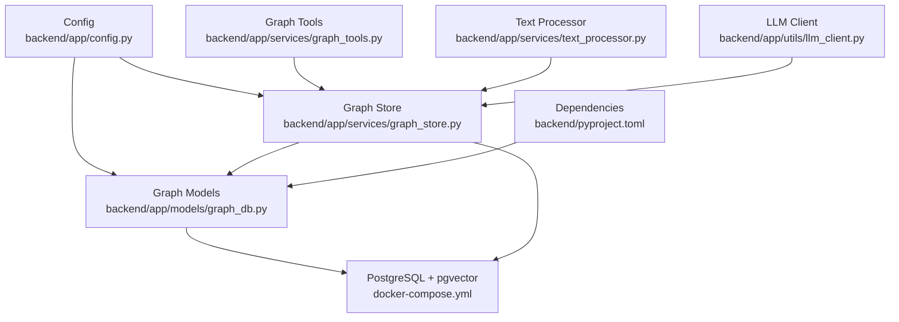
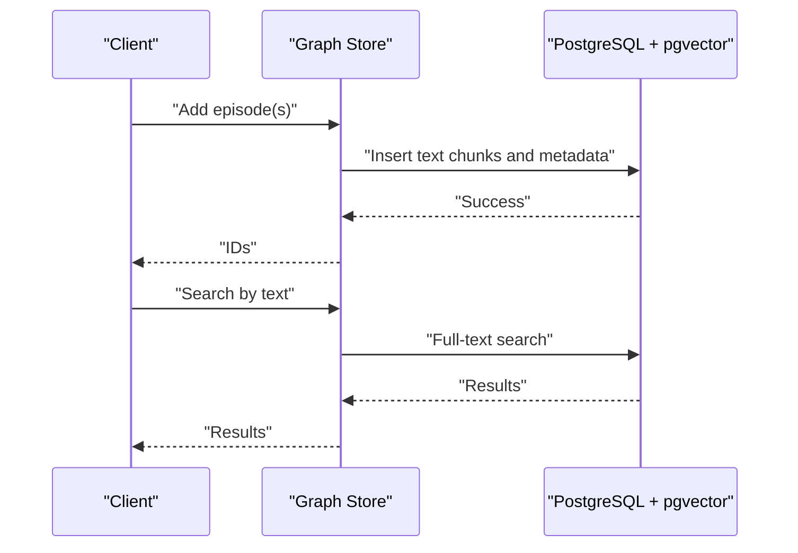
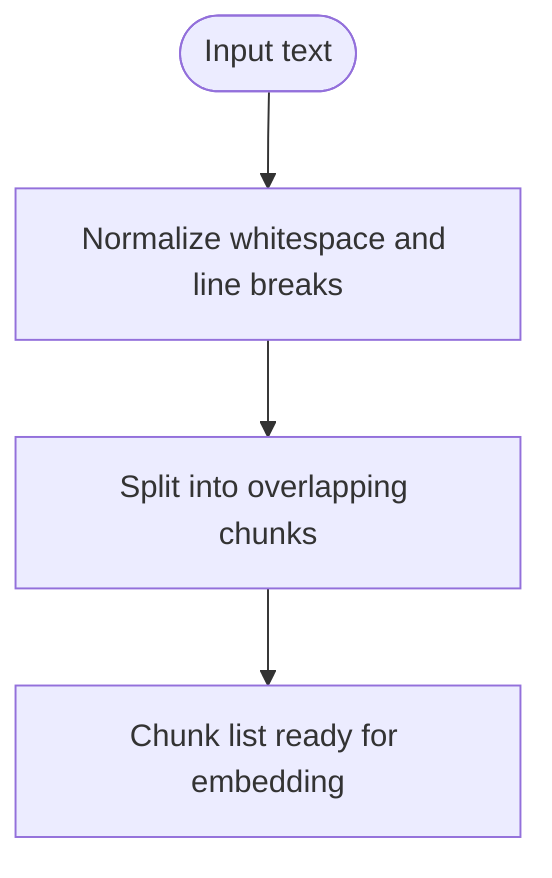
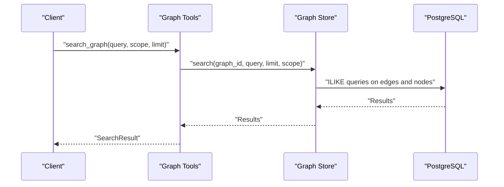
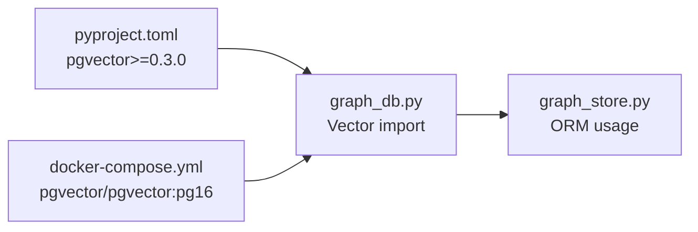

# Vector Storage Integration

<cite>
**Referenced Files in This Document**
- [README.md](file://README.md)
- [docker-compose.yml](file://docker-compose.yml)
- [backend/app/config.py](file://backend/app/config.py)
- [backend/app/models/graph_db.py](file://backend/app/models/graph_db.py)
- [backend/app/services/graph_store.py](file://backend/app/services/graph_store.py)
- [backend/app/services/graph_tools.py](file://backend/app/services/graph_tools.py)
- [backend/app/services/text_processor.py](file://backend/app/services/text_processor.py)
- [backend/app/utils/llm_client.py](file://backend/app/utils/llm_client.py)
- [backend/pyproject.toml](file://backend/pyproject.toml)
- [backend/uv.lock](file://backend/uv.lock)
</cite>

## Table of Contents
1. [Introduction](#introduction)
2. [Project Structure](#project-structure)
3. [Core Components](#core-components)
4. [Architecture Overview](#architecture-overview)
5. [Detailed Component Analysis](#detailed-component-analysis)
6. [Dependency Analysis](#dependency-analysis)
7. [Performance Considerations](#performance-considerations)
8. [Troubleshooting Guide](#troubleshooting-guide)
9. [Conclusion](#conclusion)
10. [Appendices](#appendices)

## Introduction
This document explains the Vector Storage Integration with PostgreSQL and pgvector for semantic search in the project. It covers how text is prepared for embedding, how embeddings are represented in the database, and how similarity search is performed. It also documents the current search capabilities, outlines recommended schema and indexing strategies for vector data, and provides guidance on embedding model selection, hybrid search patterns, and operational considerations such as backup, migration, and scaling.

The project currently uses PostgreSQL with the pgvector extension for vector storage and SQLAlchemy ORM for persistence. While the codebase demonstrates vector column imports and a PostgreSQL-backed Docker image, explicit vector embedding generation and similarity search logic are not present in the analyzed files. Therefore, this document focuses on the existing vector-aware schema and provides practical guidance for integrating vector embeddings and performing semantic similarity search.

## Project Structure
The vector integration touches several backend components:
- Configuration and environment variables for the database connection
- Database models using SQLAlchemy with pgvector support
- A graph store service that persists and queries graph data
- Utilities for text preprocessing and chunking
- LLM client utilities for generating embeddings externally (conceptual guidance)
- Docker Compose configuration that provisions a pgvector-enabled PostgreSQL instance

**Diagram sources**
- [backend/app/config.py:35-36](file://backend/app/config.py#L35-L36)
- [backend/app/models/graph_db.py:16](file://backend/app/models/graph_db.py#L16)
- [backend/app/services/graph_store.py:12-15](file://backend/app/services/graph_store.py#L12-L15)
- [backend/app/services/graph_tools.py:431-460](file://backend/app/services/graph_tools.py#L431-L460)
- [backend/app/services/text_processor.py:18-34](file://backend/app/services/text_processor.py#L18-L34)
- [backend/app/utils/llm_client.py:17-33](file://backend/app/utils/llm_client.py#L17-L33)
- [docker-compose.yml:3](file://docker-compose.yml#L3)
- [backend/pyproject.toml:22](file://backend/pyproject.toml#L22)

**Section sources**
- [README.md:15-178](file://README.md#L15-L178)
- [docker-compose.yml:1-38](file://docker-compose.yml#L1-L38)
- [backend/app/config.py:35-36](file://backend/app/config.py#L35-L36)
- [backend/app/models/graph_db.py:16](file://backend/app/models/graph_db.py#L16)
- [backend/app/services/graph_store.py:12-15](file://backend/app/services/graph_store.py#L12-L15)
- [backend/app/services/graph_tools.py:431-460](file://backend/app/services/graph_tools.py#L431-L460)
- [backend/app/services/text_processor.py:18-34](file://backend/app/services/text_processor.py#L18-L34)
- [backend/app/utils/llm_client.py:17-33](file://backend/app/utils/llm_client.py#L17-L33)
- [backend/pyproject.toml:22](file://backend/pyproject.toml#L22)

## Core Components
- Database configuration and connection URL are loaded from environment variables and used by the SQLAlchemy engine.
- The graph models import the pgvector Vector type, indicating vector column support.
- The graph store provides CRUD and search operations against nodes, edges, and episodes.
- Text processing utilities support chunking and normalization prior to embedding.
- The Docker Compose file provisions a pgvector-enabled PostgreSQL image.

Key observations:
- Vector column type is imported but not yet used in the schema.
- Current search is full-text based using PostgreSQL ILIKE and JSONB fields.
- Embedding generation and similarity search are not implemented in the analyzed files.

**Section sources**
- [backend/app/config.py:35-36](file://backend/app/config.py#L35-L36)
- [backend/app/models/graph_db.py:16](file://backend/app/models/graph_db.py#L16)
- [backend/app/services/graph_store.py:259-316](file://backend/app/services/graph_store.py#L259-L316)
- [backend/app/services/text_processor.py:18-34](file://backend/app/services/text_processor.py#L18-L34)
- [docker-compose.yml:3](file://docker-compose.yml#L3)

## Architecture Overview
The vector-enabled architecture centers on storing textual content in the episodes table and associating vector embeddings with records. The current codebase supports:
- Storing text chunks and metadata
- Full-text search across nodes and edges
- A pgvector-enabled database backend

Proposed vector-enabled flow:
- Preprocessing: chunk text and normalize content
- Embedding: generate vectors externally via an embedding model
- Persistence: store vectors alongside text in a vector-capable table
- Similarity search: perform vector similarity queries against the stored embeddings

**Diagram sources**
- [backend/app/services/graph_store.py:75-104](file://backend/app/services/graph_store.py#L75-L104)
- [backend/app/services/graph_store.py:259-316](file://backend/app/services/graph_store.py#L259-L316)

## Detailed Component Analysis

### Database Schema and Vector Columns
The graph models define core entities (graphs, nodes, edges, episodes) and import the pgvector Vector type. To enable vector storage:
- Add a vector column to the episodes table or introduce a new table for embeddings
- Define appropriate vector dimensions matching the embedding model output
- Create GIN or ivfflat indexes for efficient similarity search

Current schema highlights:
- Episodes table stores raw content and processing state
- Nodes and edges include JSONB and array fields suitable for metadata and attributes

Recommendations:
- Add a vector column to episodes or a dedicated embeddings table
- Align vector dimension with the chosen embedding model
- Use GIN or ivfflat indexes depending on workload characteristics

**Section sources**
- [backend/app/models/graph_db.py:88-105](file://backend/app/models/graph_db.py#L88-L105)
- [backend/app/models/graph_db.py:16](file://backend/app/models/graph_db.py#L16)

### Embedding Model Selection and Configuration
Embedding model selection impacts vector quality and performance:
- Dense sentence transformers (e.g., all-MiniLM-L6-v2) produce compact vectors suitable for similarity search
- Domain-specific models can improve retrieval for specialized corpora
- Consider model throughput and latency when selecting providers

Configuration options:
- Batch size for embedding generation
- Normalization and distance metric (cosine, dot product)
- Dimension alignment with database vector column

Note: The analyzed code does not include embedding generation logic; this section provides conceptual guidance for integrating embeddings externally.

**Section sources**
- [backend/app/utils/llm_client.py:17-33](file://backend/app/utils/llm_client.py#L17-L33)

### Text Preprocessing and Chunking
Text processing utilities support:
- Extracting text from files
- Splitting text into overlapping chunks
- Normalizing whitespace and line breaks

These steps prepare content for embedding generation and downstream retrieval.

**Diagram sources**
- [backend/app/services/text_processor.py:37-61](file://backend/app/services/text_processor.py#L37-L61)

**Section sources**
- [backend/app/services/text_processor.py:13-34](file://backend/app/services/text_processor.py#L13-L34)
- [backend/app/services/text_processor.py:37-61](file://backend/app/services/text_processor.py#L37-L61)

### Current Search Capabilities
The graph store implements:
- Full-text search across edges and nodes using ILIKE patterns
- Node lookup by name and optional label filtering
- Pagination for retrieving nodes and edges

Limitations:
- No vector similarity search is implemented
- Hybrid search combining vector and full-text is not present

**Diagram sources**
- [backend/app/services/graph_tools.py:431-460](file://backend/app/services/graph_tools.py#L431-L460)
- [backend/app/services/graph_store.py:259-316](file://backend/app/services/graph_store.py#L259-L316)

**Section sources**
- [backend/app/services/graph_tools.py:431-460](file://backend/app/services/graph_tools.py#L431-L460)
- [backend/app/services/graph_store.py:259-316](file://backend/app/services/graph_store.py#L259-L316)

### Hybrid Search and Relevance Ranking
Hybrid search combines:
- Vector similarity for semantic closeness
- Traditional filters and full-text search for lexical matching
- Re-ranking strategies (e.g., reciprocal rank fusion) to combine scores

Operational patterns:
- Generate embeddings for query and candidate texts
- Perform vector similarity search and full-text search concurrently
- Merge and re-rank results by weighted scores

Note: These patterns are conceptual and not implemented in the analyzed files.

## Dependency Analysis
The backend declares a pgvector dependency and uses SQLAlchemy with psycopg2-binary. The Docker Compose service runs a pgvector-enabled PostgreSQL image.

**Diagram sources**
- [backend/pyproject.toml:22](file://backend/pyproject.toml#L22)
- [backend/uv.lock:1822-1832](file://backend/uv.lock#L1822-L1832)
- [docker-compose.yml:3](file://docker-compose.yml#L3)
- [backend/app/models/graph_db.py:16](file://backend/app/models/graph_db.py#L16)
- [backend/app/services/graph_store.py:12-15](file://backend/app/services/graph_store.py#L12-L15)

**Section sources**
- [backend/pyproject.toml:22](file://backend/pyproject.toml#L22)
- [backend/uv.lock:1822-1832](file://backend/uv.lock#L1822-L1832)
- [docker-compose.yml:3](file://docker-compose.yml#L3)
- [backend/app/models/graph_db.py:16](file://backend/app/models/graph_db.py#L16)
- [backend/app/services/graph_store.py:12-15](file://backend/app/services/graph_store.py#L12-L15)

## Performance Considerations
- Vector dimensionality: Larger dimensions improve expressiveness but increase storage and compute costs
- Index choice:
  - GIN: Good for small to medium datasets and flexible queries
  - ivfflat: Effective for large-scale similarity search with tunable recall and latency
- Batch embedding: Process embeddings in batches to reduce overhead
- Connection pooling: Use SQLAlchemy’s pool settings to manage concurrent connections
- Monitoring: Track query latency and index hit rates for tuning

[No sources needed since this section provides general guidance]

## Troubleshooting Guide
Common issues and remedies:
- Missing pgvector extension: Ensure the PostgreSQL image supports pgvector and the extension is enabled
- Connection failures: Verify DATABASE_URL and credentials
- Large result sets: Apply pagination and limit parameters in queries
- Embedding mismatches: Confirm vector dimension matches the embedding model output

**Section sources**
- [backend/app/config.py:35-36](file://backend/app/config.py#L35-L36)
- [docker-compose.yml:3](file://docker-compose.yml#L3)

## Conclusion
The project includes the foundational pieces for vector storage with pgvector and SQLAlchemy. While embedding generation and vector similarity search are not implemented in the analyzed files, the schema and infrastructure are aligned with vector-enabled workflows. By adding vector columns, generating embeddings externally, and implementing similarity search queries with appropriate indexes, the system can support robust semantic search and hybrid retrieval patterns.

[No sources needed since this section summarizes without analyzing specific files]

## Appendices

### Appendix A: Vector Schema Design Recommendations
- Add a vector column to episodes or a dedicated embeddings table
- Choose vector dimension matching the embedding model
- Create indexes (e.g., ivfflat) for similarity search
- Store auxiliary metadata (graph_id, content hash, timestamps) for provenance and maintenance

**Section sources**
- [backend/app/models/graph_db.py:88-105](file://backend/app/models/graph_db.py#L88-L105)
- [backend/pyproject.toml:22](file://backend/pyproject.toml#L22)

### Appendix B: Embedding Pipeline Guidance
- Preprocess text using chunking and normalization
- Generate embeddings externally via an embedding model
- Persist vectors with associated metadata
- Query vectors using similarity operators and re-rank results

**Section sources**
- [backend/app/services/text_processor.py:18-34](file://backend/app/services/text_processor.py#L18-L34)
- [backend/app/utils/llm_client.py:17-33](file://backend/app/utils/llm_client.py#L17-L33)

### Appendix C: Operational Considerations
- Backup: Use logical backups for JSONB and vector data; ensure consistent snapshots
- Migration: Add vector columns with default values and backfill during maintenance windows
- Scaling: Use ivfflat with appropriate lists and probes; monitor index build times and query latency

**Section sources**
- [docker-compose.yml:3](file://docker-compose.yml#L3)