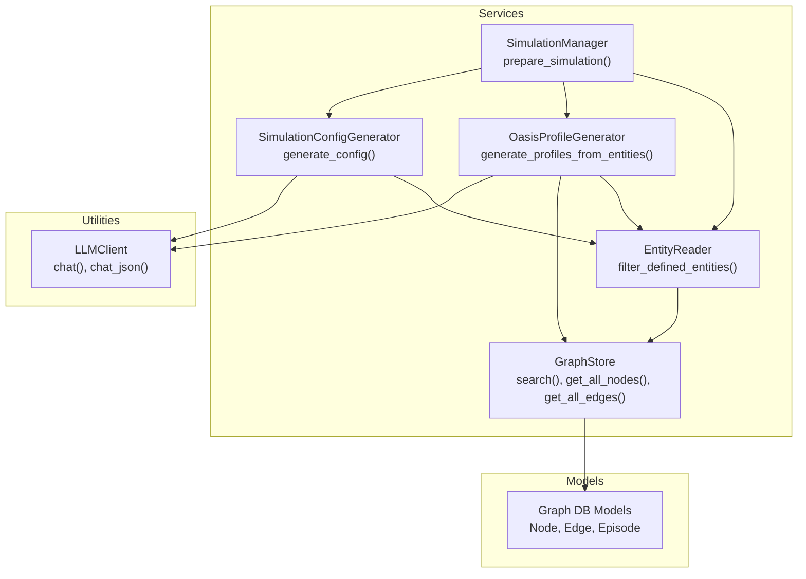
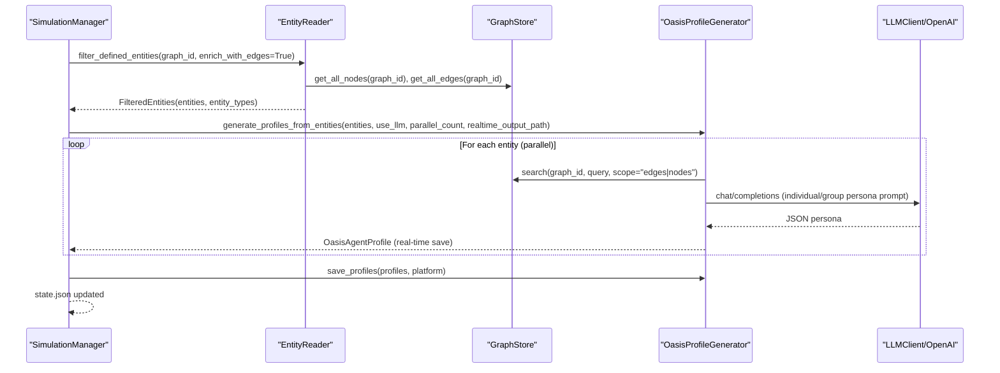
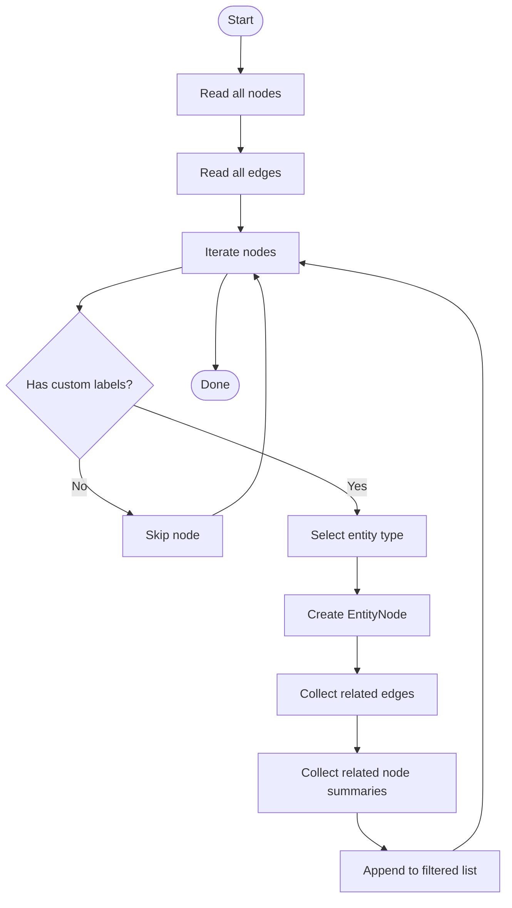
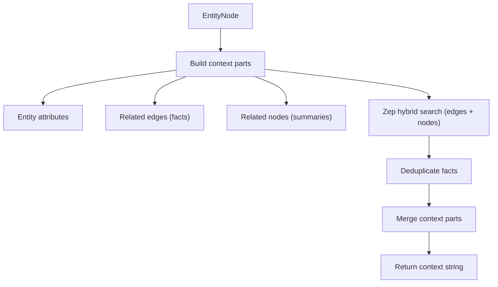
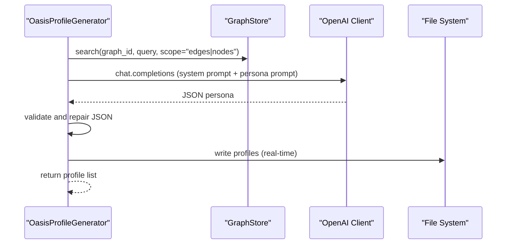
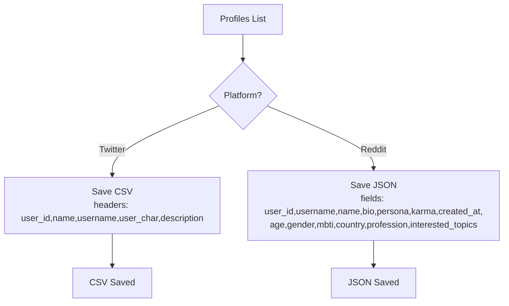
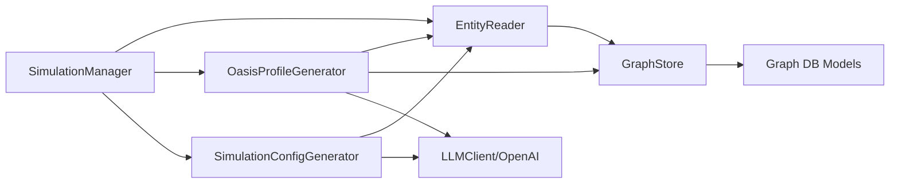
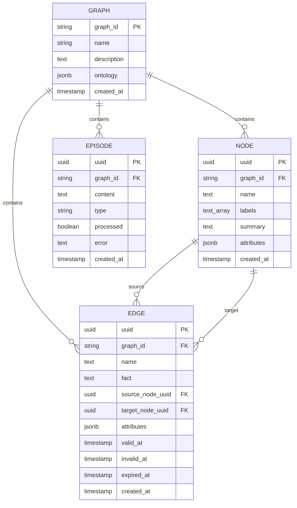

# Agent Personality System

<cite>
**Referenced Files in This Document**
- [oasis_profile_generator.py](file://backend/app/services/oasis_profile_generator.py)
- [entity_reader.py](file://backend/app/services/entity_reader.py)
- [graph_store.py](file://backend/app/services/graph_store.py)
- [simulation_manager.py](file://backend/app/services/simulation_manager.py)
- [simulation_config_generator.py](file://backend/app/services/simulation_config_generator.py)
- [llm_client.py](file://backend/app/utils/llm_client.py)
- [graph_db.py](file://backend/app/models/graph_db.py)
- [config.py](file://backend/app/config.py)
- [test_profile_format.py](file://backend/scripts/test_profile_format.py)
</cite>

## Table of Contents
1. [Introduction](#introduction)
2. [Project Structure](#project-structure)
3. [Core Components](#core-components)
4. [Architecture Overview](#architecture-overview)
5. [Detailed Component Analysis](#detailed-component-analysis)
6. [Dependency Analysis](#dependency-analysis)
7. [Performance Considerations](#performance-considerations)
8. [Troubleshooting Guide](#troubleshooting-guide)
9. [Conclusion](#conclusion)
10. [Appendices](#appendices)

## Introduction
This document describes the agent personality generation system that creates realistic multi-agent profiles for simulation. It explains the OASIS profile generator architecture, entity-based personality creation, the entity reading and filtering pipeline from the knowledge graph, edge enrichment and entity type filtering, LLM-driven personality generation with parallel processing, platform-specific profile formats (CSV for Twitter, JSON for Reddit), real-time saving mechanisms, validation, enrichment with graph context, and batch processing optimizations.

## Project Structure
The personality system spans several backend modules:
- Services: entity reading, graph access, profile generation, configuration generation, and simulation orchestration
- Utilities: LLM client wrapper
- Models: graph database schema
- Scripts: validation and testing utilities

**Diagram sources**
- [entity_reader.py:128-244](file://backend/app/services/entity_reader.py#L128-L244)
- [graph_store.py:259-316](file://backend/app/services/graph_store.py#L259-L316)
- [oasis_profile_generator.py:820-979](file://backend/app/services/oasis_profile_generator.py#L820-L979)
- [simulation_config_generator.py:242-378](file://backend/app/services/simulation_config_generator.py#L242-L378)
- [simulation_manager.py:229-447](file://backend/app/services/simulation_manager.py#L229-L447)
- [llm_client.py:14-104](file://backend/app/utils/llm_client.py#L14-L104)
- [graph_db.py:24-151](file://backend/app/models/graph_db.py#L24-L151)

**Section sources**
- [entity_reader.py:69-244](file://backend/app/services/entity_reader.py#L69-L244)
- [graph_store.py:21-375](file://backend/app/services/graph_store.py#L21-L375)
- [oasis_profile_generator.py:141-1167](file://backend/app/services/oasis_profile_generator.py#L141-L1167)
- [simulation_config_generator.py:199-988](file://backend/app/services/simulation_config_generator.py#L199-L988)
- [simulation_manager.py:114-529](file://backend/app/services/simulation_manager.py#L114-L529)
- [llm_client.py:14-104](file://backend/app/utils/llm_client.py#L14-L104)
- [graph_db.py:24-151](file://backend/app/models/graph_db.py#L24-L151)

## Core Components
- EntityReader: reads nodes and edges from the graph, filters by entity types, and enriches entities with related edges and nodes.
- GraphStore: unified access layer for graph operations (nodes, edges, episodes, search).
- OasisProfileGenerator: transforms entities into OASIS-compatible agent profiles, with LLM enhancement and parallel generation.
- SimulationConfigGenerator: generates simulation parameters (time, events, agent activity) using LLM with stepwise generation.
- SimulationManager: orchestrates the end-to-end workflow, including real-time progress monitoring and file saving.
- LLMClient: wraps OpenAI-style LLM calls with JSON response parsing and cleanup.
- Graph DB Models: SQLAlchemy models for nodes, edges, episodes, and graph metadata.

**Section sources**
- [entity_reader.py:69-345](file://backend/app/services/entity_reader.py#L69-L345)
- [graph_store.py:21-375](file://backend/app/services/graph_store.py#L21-L375)
- [oasis_profile_generator.py:141-1167](file://backend/app/services/oasis_profile_generator.py#L141-L1167)
- [simulation_config_generator.py:199-988](file://backend/app/services/simulation_config_generator.py#L199-L988)
- [simulation_manager.py:114-529](file://backend/app/services/simulation_manager.py#L114-L529)
- [llm_client.py:14-104](file://backend/app/utils/llm_client.py#L14-L104)
- [graph_db.py:24-151](file://backend/app/models/graph_db.py#L24-L151)

## Architecture Overview
The system integrates graph reading, enrichment, and LLM-driven personality generation into a cohesive pipeline. Entities are filtered by type, enriched with graph context, and transformed into platform-specific profile formats. The SimulationManager coordinates real-time progress reporting and saves intermediate and final artifacts.

**Diagram sources**
- [simulation_manager.py:229-447](file://backend/app/services/simulation_manager.py#L229-L447)
- [entity_reader.py:128-244](file://backend/app/services/entity_reader.py#L128-L244)
- [graph_store.py:259-316](file://backend/app/services/graph_store.py#L259-L316)
- [oasis_profile_generator.py:820-979](file://backend/app/services/oasis_profile_generator.py#L820-L979)
- [llm_client.py:14-104](file://backend/app/utils/llm_client.py#L14-L104)

## Detailed Component Analysis

### Entity Reading and Filtering Pipeline
EntityReader reads all nodes and edges from the graph, filters nodes by entity type (ignoring default labels), and enriches each entity with related edges and associated node summaries. It supports:
- Reading all nodes and edges
- Filtering by predefined entity types
- Enrichment with related edges and nodes
- Retrieving a single entity with full context

**Diagram sources**
- [entity_reader.py:128-244](file://backend/app/services/entity_reader.py#L128-L244)

**Section sources**
- [entity_reader.py:82-111](file://backend/app/services/entity_reader.py#L82-L111)
- [entity_reader.py:128-244](file://backend/app/services/entity_reader.py#L128-L244)
- [entity_reader.py:246-345](file://backend/app/services/entity_reader.py#L246-L345)

### Graph Context Retrieval and Edge Enrichment
OasisProfileGenerator builds comprehensive context by combining:
- Entity attributes
- Related facts and relationships
- Associated node summaries
- Hybrid search across edges and nodes using GraphStore

It performs parallel retrieval of edges and nodes to reduce latency and deduplicates facts from hybrid search results.

**Diagram sources**
- [oasis_profile_generator.py:383-456](file://backend/app/services/oasis_profile_generator.py#L383-L456)
- [oasis_profile_generator.py:277-381](file://backend/app/services/oasis_profile_generator.py#L277-L381)
- [graph_store.py:259-316](file://backend/app/services/graph_store.py#L259-L316)

**Section sources**
- [oasis_profile_generator.py:277-381](file://backend/app/services/oasis_profile_generator.py#L277-L381)
- [oasis_profile_generator.py:383-456](file://backend/app/services/oasis_profile_generator.py#L383-L456)
- [graph_store.py:259-316](file://backend/app/services/graph_store.py#L259-L316)

### Personality Profile Generation Workflow
OasisProfileGenerator supports two modes:
- LLM-enhanced: constructs tailored prompts for individuals vs. groups, validates JSON, repairs truncated outputs, and falls back to rule-based generation when needed.
- Rule-based: generates baseline profiles for common entity types.

Parallel processing is implemented using ThreadPoolExecutor to generate multiple profiles concurrently, with real-time saving to CSV/JSON.

**Diagram sources**
- [oasis_profile_generator.py:466-551](file://backend/app/services/oasis_profile_generator.py#L466-L551)
- [oasis_profile_generator.py:575-639](file://backend/app/services/oasis_profile_generator.py#L575-L639)
- [oasis_profile_generator.py:820-979](file://backend/app/services/oasis_profile_generator.py#L820-L979)

**Section sources**
- [oasis_profile_generator.py:141-1167](file://backend/app/services/oasis_profile_generator.py#L141-L1167)
- [oasis_profile_generator.py:820-979](file://backend/app/services/oasis_profile_generator.py#L820-L979)

### Platform-Specific Profile Formats
- Twitter (CSV): OASIS requires CSV with specific headers and normalized fields. The generator ensures CSV compliance and handles newline normalization.
- Reddit (JSON): OASIS requires JSON with user_id and other fields. The generator produces a JSON array with consistent field names and defaults.

**Diagram sources**
- [oasis_profile_generator.py:1035-1154](file://backend/app/services/oasis_profile_generator.py#L1035-L1154)
- [test_profile_format.py:20-128](file://backend/scripts/test_profile_format.py#L20-L128)

**Section sources**
- [oasis_profile_generator.py:1035-1154](file://backend/app/services/oasis_profile_generator.py#L1035-L1154)
- [test_profile_format.py:20-128](file://backend/scripts/test_profile_format.py#L20-L128)

### Real-Time Saving Mechanism
During parallel generation, the system writes profiles to disk incrementally:
- For Twitter: CSV with headers and rows appended as profiles complete.
- For Reddit: JSON array updated with each new profile.
- Thread-safe writes using a lock to prevent race conditions.

**Section sources**
- [oasis_profile_generator.py:857-887](file://backend/app/services/oasis_profile_generator.py#L857-L887)
- [oasis_profile_generator.py:888-979](file://backend/app/services/oasis_profile_generator.py#L888-L979)

### Validation, Enrichment, and Batch Optimizations
- Validation: Ensures required fields are present; repairs malformed JSON; falls back to rule-based generation when LLM fails.
- Enrichment: Combines entity attributes, related edges/nodes, and hybrid search results to build rich context.
- Batch optimizations: Parallel generation with configurable worker count; stepwise LLM generation for simulation config; context truncation to manage token limits.

**Section sources**
- [oasis_profile_generator.py:575-639](file://backend/app/services/oasis_profile_generator.py#L575-L639)
- [simulation_config_generator.py:242-378](file://backend/app/services/simulation_config_generator.py#L242-L378)
- [simulation_config_generator.py:433-533](file://backend/app/services/simulation_config_generator.py#L433-L533)

### Example Parameters and Settings
- Parallel execution: Configure parallel_count in generate_profiles_from_entities (default 5).
- Real-time saving: Provide realtime_output_path and output_platform to save CSV/JSON during generation.
- Profile formats: Use save_profiles(platform="twitter"|"reddit") to persist final artifacts.
- Simulation configuration: Use SimulationConfigGenerator.generate_config with progress callbacks and enable flags for platforms.

**Section sources**
- [oasis_profile_generator.py:820-841](file://backend/app/services/oasis_profile_generator.py#L820-L841)
- [simulation_manager.py:229-447](file://backend/app/services/simulation_manager.py#L229-L447)
- [simulation_config_generator.py:242-378](file://backend/app/services/simulation_config_generator.py#L242-L378)

## Dependency Analysis
The system exhibits clear separation of concerns:
- EntityReader depends on GraphStore for graph operations.
- OasisProfileGenerator depends on GraphStore for enrichment and LLMClient/OpenAI for generation.
- SimulationConfigGenerator depends on EntityReader and LLMClient/OpenAI for parameter generation.
- SimulationManager coordinates all components and persists state.

**Diagram sources**
- [entity_reader.py:69-345](file://backend/app/services/entity_reader.py#L69-L345)
- [graph_store.py:21-375](file://backend/app/services/graph_store.py#L21-L375)
- [oasis_profile_generator.py:141-1167](file://backend/app/services/oasis_profile_generator.py#L141-L1167)
- [simulation_config_generator.py:199-988](file://backend/app/services/simulation_config_generator.py#L199-L988)
- [simulation_manager.py:114-529](file://backend/app/services/simulation_manager.py#L114-L529)
- [llm_client.py:14-104](file://backend/app/utils/llm_client.py#L14-L104)
- [graph_db.py:24-151](file://backend/app/models/graph_db.py#L24-L151)

**Section sources**
- [entity_reader.py:69-345](file://backend/app/services/entity_reader.py#L69-L345)
- [graph_store.py:21-375](file://backend/app/services/graph_store.py#L21-L375)
- [oasis_profile_generator.py:141-1167](file://backend/app/services/oasis_profile_generator.py#L141-L1167)
- [simulation_config_generator.py:199-988](file://backend/app/services/simulation_config_generator.py#L199-L988)
- [simulation_manager.py:114-529](file://backend/app/services/simulation_manager.py#L114-L529)
- [llm_client.py:14-104](file://backend/app/utils/llm_client.py#L14-L104)
- [graph_db.py:24-151](file://backend/app/models/graph_db.py#L24-L151)

## Performance Considerations
- Parallel generation: Use ThreadPoolExecutor with a worker count tuned to available resources and LLM rate limits.
- Graph search parallelism: Hybrid search retrieves edges and nodes concurrently to reduce latency.
- Context truncation: SimulationConfigGenerator truncates context to manage token limits and improve reliability.
- Real-time saving: Writes profiles incrementally to reduce memory usage and provide progress feedback.
- Retry and repair: LLM calls include retry logic and JSON repair to minimize failures.

[No sources needed since this section provides general guidance]

## Troubleshooting Guide
Common issues and resolutions:
- Missing LLM configuration: Ensure LLM_API_KEY is set; otherwise, initialization raises an error.
- Graph retrieval failures: Hybrid search catches exceptions and logs warnings; results fall back to empty context.
- JSON parsing failures: The generator attempts to repair truncated or malformed JSON and falls back to rule-based generation.
- Empty entity sets: If no entities match criteria, the system sets status to failed with a descriptive error.
- Real-time save failures: Writes are wrapped in try/catch; warnings are logged and generation continues.

**Section sources**
- [config.py:66-75](file://backend/app/config.py#L66-L75)
- [oasis_profile_generator.py:277-381](file://backend/app/services/oasis_profile_generator.py#L277-L381)
- [oasis_profile_generator.py:575-639](file://backend/app/services/oasis_profile_generator.py#L575-L639)
- [simulation_manager.py:297-302](file://backend/app/services/simulation_manager.py#L297-L302)
- [oasis_profile_generator.py:857-887](file://backend/app/services/oasis_profile_generator.py#L857-L887)

## Conclusion
The agent personality system integrates robust entity reading, graph enrichment, and LLM-driven generation to produce realistic OASIS-compatible profiles. It supports parallel processing, real-time saving, and platform-specific formats, enabling scalable simulation preparation. The modular design and validation mechanisms ensure reliability and ease of maintenance.

## Appendices

### Appendix A: Configuration Options
- LLM settings: LLM_API_KEY, LLM_BASE_URL, LLM_MODEL_NAME
- Database: DATABASE_URL
- OASIS platform actions and default max rounds
- Upload and chunking settings

**Section sources**
- [config.py:20-76](file://backend/app/config.py#L20-L76)

### Appendix B: Data Models Overview

**Diagram sources**
- [graph_db.py:24-151](file://backend/app/models/graph_db.py#L24-L151)