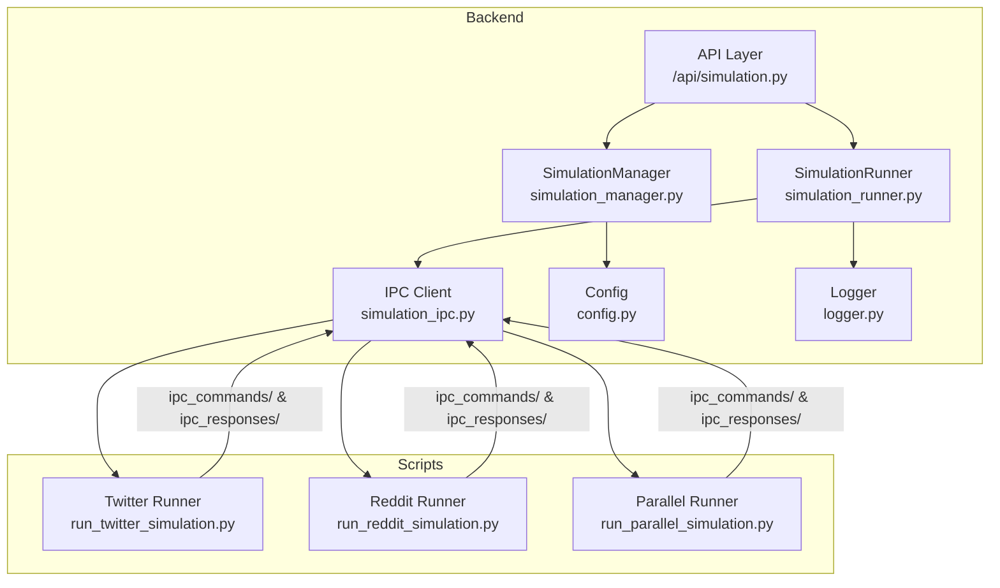
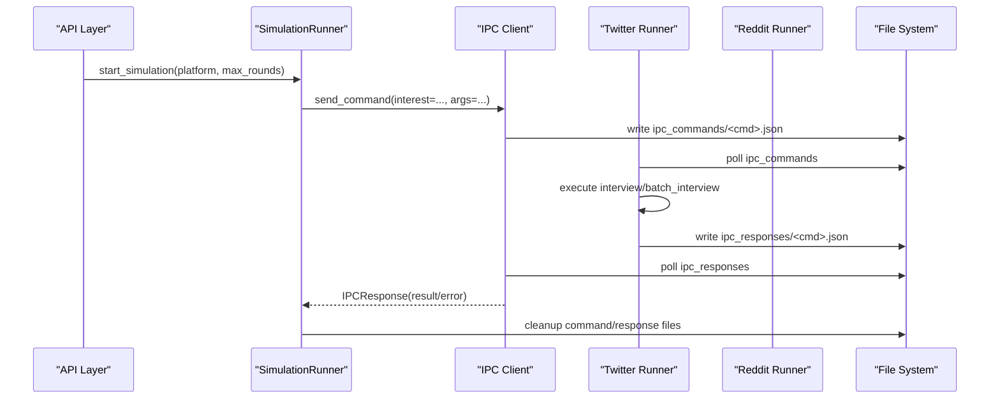
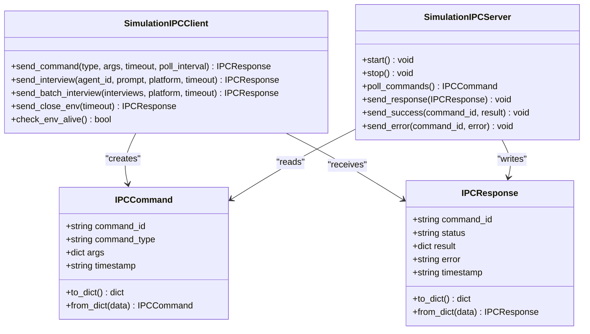
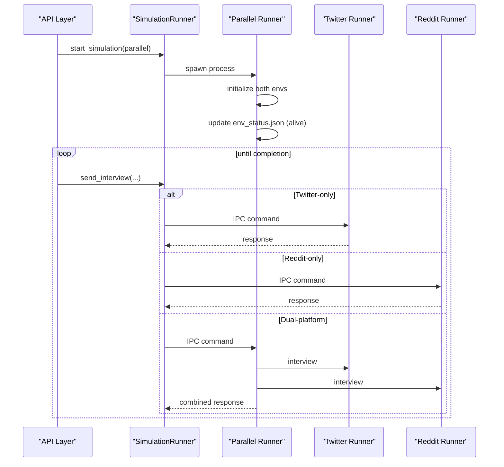
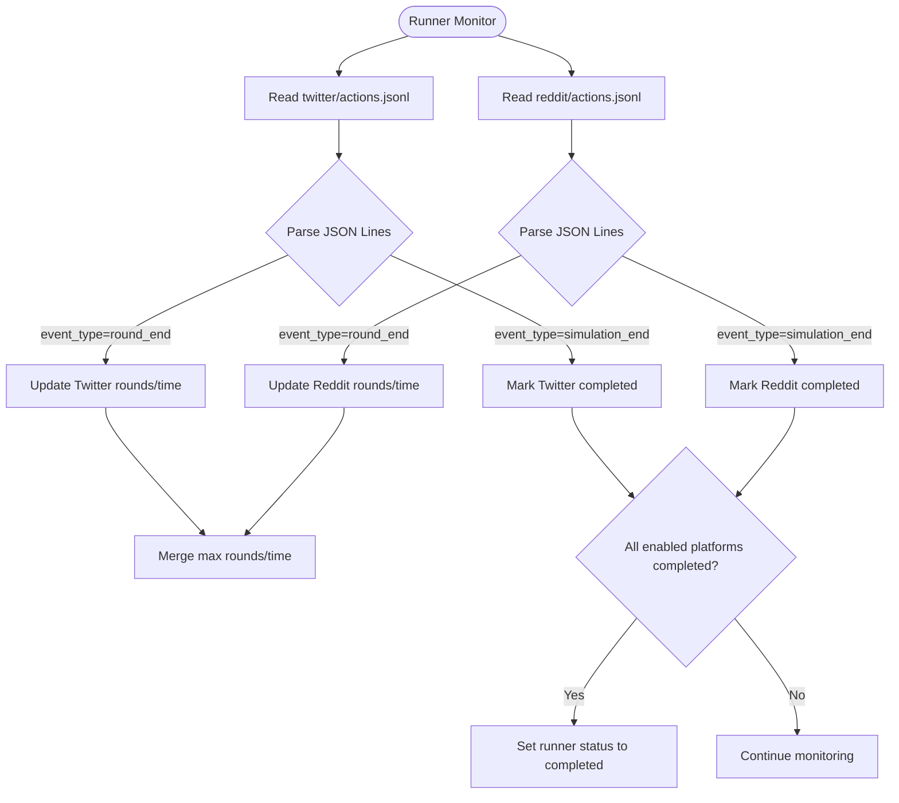
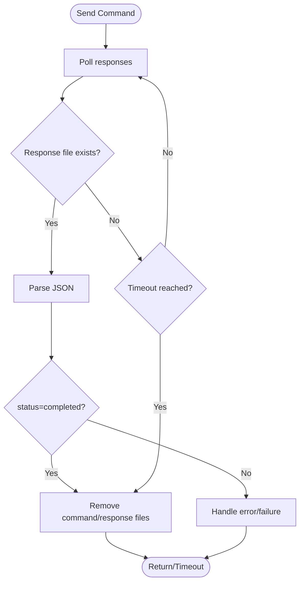
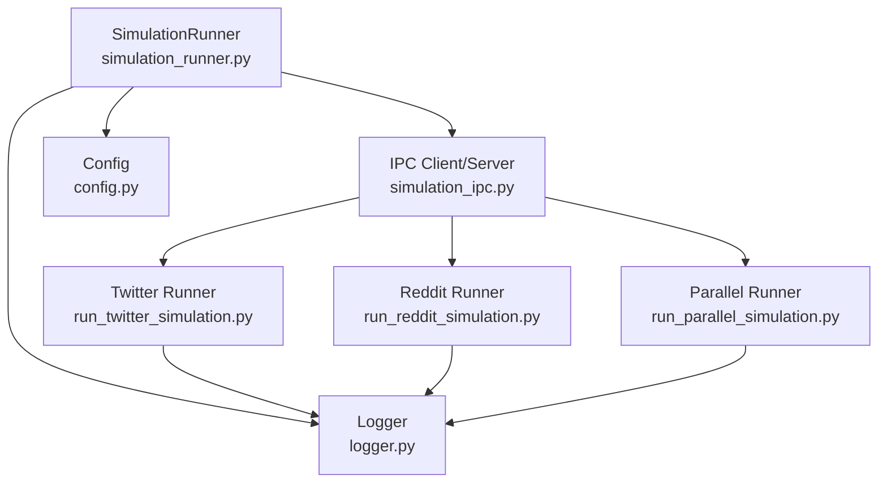

# Inter-Process Communication

<cite>
**Referenced Files in This Document**
- [simulation_ipc.py](file://backend/app/services/simulation_ipc.py)
- [simulation_manager.py](file://backend/app/services/simulation_manager.py)
- [simulation_runner.py](file://backend/app/services/simulation_runner.py)
- [run_parallel_simulation.py](file://backend/scripts/run_parallel_simulation.py)
- [run_twitter_simulation.py](file://backend/scripts/run_twitter_simulation.py)
- [run_reddit_simulation.py](file://backend/scripts/run_reddit_simulation.py)
- [simulation.py](file://backend/app/api/simulation.py)
- [config.py](file://backend/app/config.py)
- [logger.py](file://backend/app/utils/logger.py)
</cite>

## Table of Contents
1. [Introduction](#introduction)
2. [Project Structure](#project-structure)
3. [Core Components](#core-components)
4. [Architecture Overview](#architecture-overview)
5. [Detailed Component Analysis](#detailed-component-analysis)
6. [Dependency Analysis](#dependency-analysis)
7. [Performance Considerations](#performance-considerations)
8. [Troubleshooting Guide](#troubleshooting-guide)
9. [Conclusion](#conclusion)

## Introduction
This document explains the inter-process communication (IPC) system coordinating parallel simulation execution across Twitter and Reddit platforms. It covers the file-system-based command/response protocol used to manage separate simulation processes, synchronize status updates, aggregate results, and coordinate cross-platform interviews. The system supports dual-platform parallel runs, real-time status reporting, process lifecycle management, and robust error handling with timeouts.

## Project Structure
The IPC system spans the Flask backend and dedicated simulation scripts:
- Backend services define the IPC client/server abstractions and orchestrate simulation lifecycle.
- Simulation scripts implement platform-specific runners and a dual-platform coordinator that listens for commands and responds via JSON files.
- APIs expose endpoints to start simulations, query status, and trigger interviews.

**Diagram sources**
- [simulation.py:1428-1599](file://backend/app/api/simulation.py#L1428-L1599)
- [simulation_manager.py:114-529](file://backend/app/services/simulation_manager.py#L114-L529)
- [simulation_runner.py:195-800](file://backend/app/services/simulation_runner.py#L195-L800)
- [simulation_ipc.py:95-395](file://backend/app/services/simulation_ipc.py#L95-L395)
- [run_twitter_simulation.py:134-781](file://backend/scripts/run_twitter_simulation.py#L134-L781)
- [run_reddit_simulation.py:134-769](file://backend/scripts/run_reddit_simulation.py#L134-L769)
- [run_parallel_simulation.py:205-602](file://backend/scripts/run_parallel_simulation.py#L205-L602)

**Section sources**
- [simulation.py:1428-1599](file://backend/app/api/simulation.py#L1428-L1599)
- [simulation_manager.py:114-529](file://backend/app/services/simulation_manager.py#L114-L529)
- [simulation_runner.py:195-800](file://backend/app/services/simulation_runner.py#L195-L800)
- [simulation_ipc.py:95-395](file://backend/app/services/simulation_ipc.py#L95-L395)
- [run_twitter_simulation.py:134-781](file://backend/scripts/run_twitter_simulation.py#L134-L781)
- [run_reddit_simulation.py:134-769](file://backend/scripts/run_reddit_simulation.py#L134-L769)
- [run_parallel_simulation.py:205-602](file://backend/scripts/run_parallel_simulation.py#L205-L602)

## Core Components
- IPC Client (Flask side): Sends commands to simulation processes and waits for responses with timeouts.
- IPC Server (Script side): Polls for pending commands, executes interviews/batch interviews, and writes responses.
- Simulation Manager: Prepares simulation assets and tracks simulation state.
- Simulation Runner: Launches background processes, monitors logs, aggregates real-time status, and manages lifecycle.
- Platform Runners: Twitter and Reddit runners implement interview handling and environment status updates.
- Parallel Runner: Coordinates dual-platform interviews and environment lifecycle.

Key IPC primitives:
- Commands: interview, batch_interview, close_env
- Responses: command_id, status, result/error, timestamp
- Status file: env_status.json for environment health

**Section sources**
- [simulation_ipc.py:25-395](file://backend/app/services/simulation_ipc.py#L25-L395)
- [simulation_manager.py:42-192](file://backend/app/services/simulation_manager.py#L42-L192)
- [simulation_runner.py:195-800](file://backend/app/services/simulation_runner.py#L195-L800)
- [run_twitter_simulation.py:134-781](file://backend/scripts/run_twitter_simulation.py#L134-L781)
- [run_reddit_simulation.py:134-769](file://backend/scripts/run_reddit_simulation.py#L134-L769)
- [run_parallel_simulation.py:205-602](file://backend/scripts/run_parallel_simulation.py#L205-L602)

## Architecture Overview
The IPC architecture uses a file-system channel:
- Backend writes commands to ipc_commands/<command_id>.json
- Simulation scripts poll and execute commands, writing responses to ipc_responses/<command_id>.json
- Backend polls responses and cleans up command/response files
- env_status.json communicates environment liveness and platform availability

**Diagram sources**
- [simulation_runner.py:312-475](file://backend/app/services/simulation_runner.py#L312-L475)
- [simulation_ipc.py:117-187](file://backend/app/services/simulation_ipc.py#L117-L187)
- [run_twitter_simulation.py:343-382](file://backend/scripts/run_twitter_simulation.py#L343-L382)
- [run_reddit_simulation.py:343-382](file://backend/scripts/run_reddit_simulation.py#L343-L382)
- [run_parallel_simulation.py:560-601](file://backend/scripts/run_parallel_simulation.py#L560-L601)

## Detailed Component Analysis

### IPC Message Formats and Protocols
- Command envelope:
  - command_id: UUID string
  - command_type: interview | batch_interview | close_env
  - args: payload dependent on command_type
  - timestamp: ISO format
- Response envelope:
  - command_id: UUID string
  - status: pending | processing | completed | failed
  - result: structured data (interview results, counts, etc.)
  - error: error message if failed
  - timestamp: ISO format
- Environment status:
  - status: alive | running | stopped
  - timestamp: ISO format
  - Additional platform availability fields for dual-platform mode

**Diagram sources**
- [simulation_ipc.py:40-395](file://backend/app/services/simulation_ipc.py#L40-L395)

**Section sources**
- [simulation_ipc.py:25-395](file://backend/app/services/simulation_ipc.py#L25-L395)

### Process Coordination Patterns
- Single-platform runs:
  - Twitter or Reddit runner launched independently, enters command-waiting mode after simulation completes.
  - Backend sends interview commands; runner executes and returns results.
- Dual-platform runs:
  - Parallel runner coordinates both environments, polling and responding to commands for both platforms.
  - Supports platform-scoped and cross-platform interviews.

**Diagram sources**
- [simulation_runner.py:312-475](file://backend/app/services/simulation_runner.py#L312-L475)
- [run_parallel_simulation.py:343-414](file://backend/scripts/run_parallel_simulation.py#L343-L414)
- [run_twitter_simulation.py:214-246](file://backend/scripts/run_twitter_simulation.py#L214-L246)
- [run_reddit_simulation.py:214-246](file://backend/scripts/run_reddit_simulation.py#L214-L246)

**Section sources**
- [simulation_runner.py:312-475](file://backend/app/services/simulation_runner.py#L312-L475)
- [run_parallel_simulation.py:343-414](file://backend/scripts/run_parallel_simulation.py#L343-L414)
- [run_twitter_simulation.py:214-246](file://backend/scripts/run_twitter_simulation.py#L214-L246)
- [run_reddit_simulation.py:214-246](file://backend/scripts/run_reddit_simulation.py#L214-L246)

### Shared State Management and Real-Time Updates
- Simulation state:
  - Backend maintains SimulationState with status, platform flags, timestamps, and counts.
  - Runner maintains SimulationRunState with per-round summaries, recent actions, and platform-specific metrics.
- Real-time status:
  - Runner monitors per-platform action logs (twitter/actions.jsonl, reddit/actions.jsonl).
  - Parses event_type entries (simulation_end, round_end) to update completion and progress.
- Environment status:
  - env_status.json indicates alive/running/stopped and platform availability.

**Diagram sources**
- [simulation_runner.py:478-713](file://backend/app/services/simulation_runner.py#L478-L713)

**Section sources**
- [simulation_manager.py:42-192](file://backend/app/services/simulation_manager.py#L42-L192)
- [simulation_runner.py:100-193](file://backend/app/services/simulation_runner.py#L100-L193)
- [simulation_runner.py:478-713](file://backend/app/services/simulation_runner.py#L478-L713)

### Error Handling, Timeouts, and Lifecycle Coordination
- Timeouts:
  - Backend IPC client enforces per-command timeouts and cleans up stale command files.
- Error propagation:
  - Script-side handlers write error responses; backend surfaces errors and marks runner status as failed.
- Lifecycle:
  - Process groups are terminated cross-platform; Windows uses taskkill, Unix uses process groups.
  - Graceful shutdown via signal handlers and environment status updates.

**Diagram sources**
- [simulation_ipc.py:117-187](file://backend/app/services/simulation_ipc.py#L117-L187)

**Section sources**
- [simulation_ipc.py:117-187](file://backend/app/services/simulation_ipc.py#L117-L187)
- [simulation_runner.py:715-800](file://backend/app/services/simulation_runner.py#L715-L800)
- [run_twitter_simulation.py:737-779](file://backend/scripts/run_twitter_simulation.py#L737-L779)
- [run_reddit_simulation.py:737-769](file://backend/scripts/run_reddit_simulation.py#L737-L769)
- [run_parallel_simulation.py:560-601](file://backend/scripts/run_parallel_simulation.py#L560-L601)

### Resource Management and Process Isolation
- Logging:
  - Centralized logger setup with rotating file handlers and UTF-8 console output.
- Process isolation:
  - Subprocesses started with explicit working directories and UTF-8 environment variables.
  - Process groups created to ensure child processes can be terminated together.
- Cleanup:
  - Runner cleans up run_state.json, action logs, and main simulation log upon completion or failure.

**Section sources**
- [logger.py:30-104](file://backend/app/utils/logger.py#L30-L104)
- [simulation_runner.py:437-456](file://backend/app/services/simulation_runner.py#L437-L456)
- [simulation_runner.py:550-577](file://backend/app/services/simulation_runner.py#L550-L577)

## Dependency Analysis
The IPC system relies on:
- File-system directories for IPC channels (ipc_commands, ipc_responses)
- Environment status file for liveness
- Simulation configuration and profile files for runner initialization
- Logging and configuration modules for diagnostics and environment setup

**Diagram sources**
- [simulation_ipc.py:95-395](file://backend/app/services/simulation_ipc.py#L95-L395)
- [simulation_runner.py:195-800](file://backend/app/services/simulation_runner.py#L195-L800)
- [run_twitter_simulation.py:134-781](file://backend/scripts/run_twitter_simulation.py#L134-L781)
- [run_reddit_simulation.py:134-769](file://backend/scripts/run_reddit_simulation.py#L134-L769)
- [run_parallel_simulation.py:205-602](file://backend/scripts/run_parallel_simulation.py#L205-L602)
- [config.py:47-60](file://backend/app/config.py#L47-L60)
- [logger.py:30-104](file://backend/app/utils/logger.py#L30-L104)

**Section sources**
- [simulation_ipc.py:95-395](file://backend/app/services/simulation_ipc.py#L95-L395)
- [simulation_runner.py:195-800](file://backend/app/services/simulation_runner.py#L195-L800)
- [run_twitter_simulation.py:134-781](file://backend/scripts/run_twitter_simulation.py#L134-L781)
- [run_reddit_simulation.py:134-769](file://backend/scripts/run_reddit_simulation.py#L134-L769)
- [run_parallel_simulation.py:205-602](file://backend/scripts/run_parallel_simulation.py#L205-L602)
- [config.py:47-60](file://backend/app/config.py#L47-L60)
- [logger.py:30-104](file://backend/app/utils/logger.py#L30-L104)

## Performance Considerations
- Polling intervals balance responsiveness and I/O overhead; adjust poll_interval and timeout based on workload.
- JSON parsing and file I/O are synchronous; keep command/response payloads minimal.
- Parallel runners execute interviews concurrently per platform; ensure adequate CPU and LLM concurrency limits.
- Logging to files avoids stdout/stderr buffer blocking during long simulations.

## Troubleshooting Guide
Common issues and resolutions:
- Timeout waiting for responses:
  - Verify ipc_commands and ipc_responses directories exist and are writable.
  - Confirm env_status.json reflects "alive" for dual-platform mode.
- Command parsing failures:
  - Ensure commands are valid JSON with required fields.
  - Check for malformed or partially written files.
- Process termination problems:
  - On Windows, confirm taskkill availability; on Unix, ensure process group permissions.
- Environment not alive:
  - Check env_status.json; ensure runners updated status after initialization.
- Logs not updating:
  - Verify per-platform action logs exist and are being monitored by the runner.

**Section sources**
- [simulation_ipc.py:117-187](file://backend/app/services/simulation_ipc.py#L117-L187)
- [simulation_runner.py:478-577](file://backend/app/services/simulation_runner.py#L478-L577)
- [run_twitter_simulation.py:670-704](file://backend/scripts/run_twitter_simulation.py#L670-L704)
- [run_reddit_simulation.py:658-691](file://backend/scripts/run_reddit_simulation.py#L658-L691)
- [run_parallel_simulation.py:246-254](file://backend/scripts/run_parallel_simulation.py#L246-L254)

## Conclusion
The IPC system provides a robust, file-system-backed coordination mechanism for parallel simulation execution across Twitter and Reddit. It enables flexible interview workflows, real-time status updates, and resilient lifecycle management. By leveraging standardized message envelopes, environment status files, and centralized logging, the system supports scalable, cross-platform simulation orchestration with clear error handling and cleanup procedures.