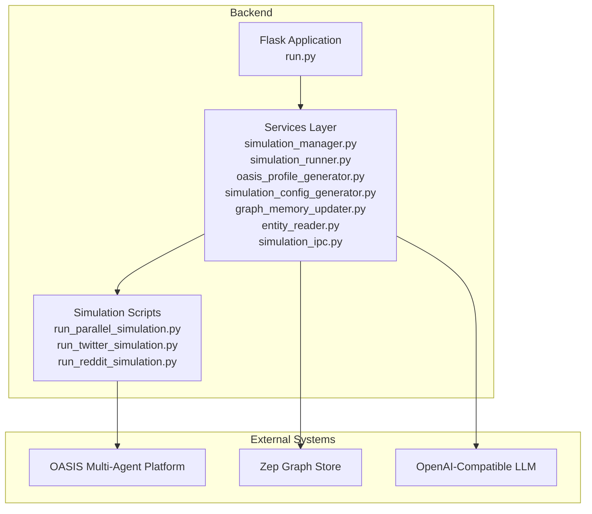
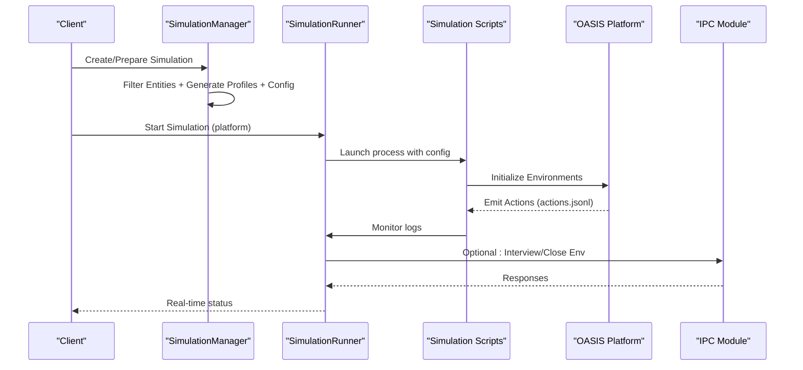
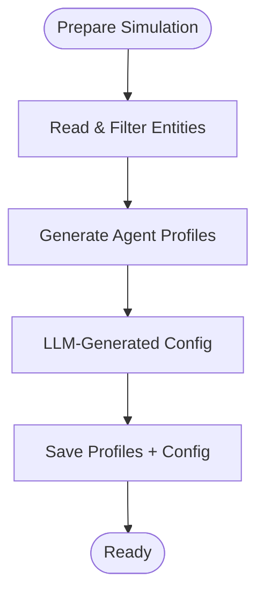
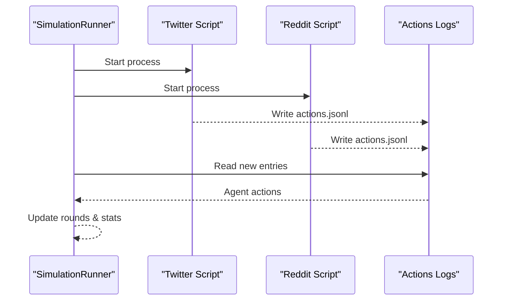
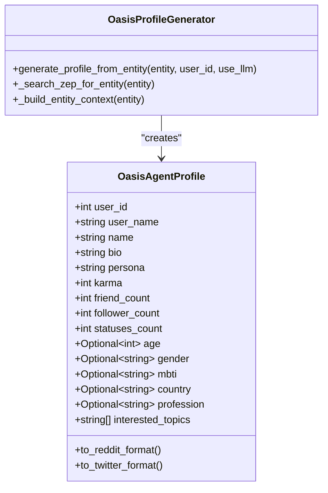
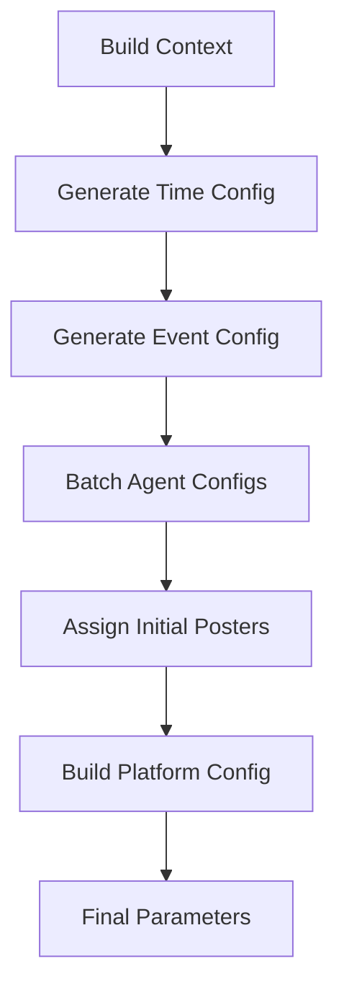
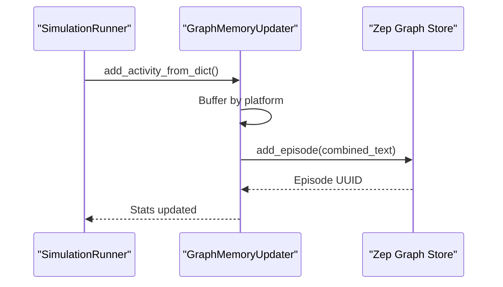
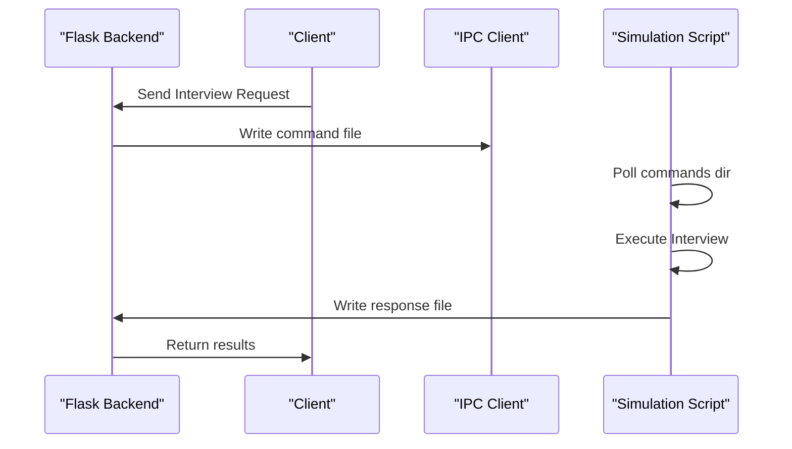
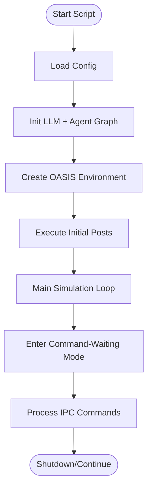
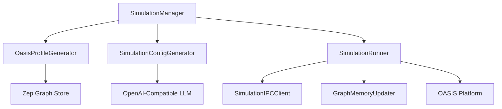

# Multi-Agent Simulation Engine

<cite>
**Referenced Files in This Document**
- [README.md](file://README.md)
- [pyproject.toml](file://backend/pyproject.toml)
- [run.py](file://backend/run.py)
- [simulation_manager.py](file://backend/app/services/simulation_manager.py)
- [simulation_runner.py](file://backend/app/services/simulation_runner.py)
- [simulation_ipc.py](file://backend/app/services/simulation_ipc.py)
- [oasis_profile_generator.py](file://backend/app/services/oasis_profile_generator.py)
- [simulation_config_generator.py](file://backend/app/services/simulation_config_generator.py)
- [graph_memory_updater.py](file://backend/app/services/graph_memory_updater.py)
- [entity_reader.py](file://backend/app/services/entity_reader.py)
- [run_parallel_simulation.py](file://backend/scripts/run_parallel_simulation.py)
- [run_twitter_simulation.py](file://backend/scripts/run_twitter_simulation.py)
- [run_reddit_simulation.py](file://backend/scripts/run_reddit_simulation.py)
</cite>

## Table of Contents
1. [Introduction](#introduction)
2. [Project Structure](#project-structure)
3. [Core Components](#core-components)
4. [Architecture Overview](#architecture-overview)
5. [Detailed Component Analysis](#detailed-component-analysis)
6. [Dependency Analysis](#dependency-analysis)
7. [Performance Considerations](#performance-considerations)
8. [Troubleshooting Guide](#troubleshooting-guide)
9. [Conclusion](#conclusion)

## Introduction
This document describes the Multi-Agent Simulation Engine powering Parallel World's predictive scenarios. Built on the OASIS multi-agent platform, the engine orchestrates dual-platform simulations across Twitter and Reddit, generating agent personalities, configuring simulation parameters, executing agent actions, and managing memory updates. It supports real-time monitoring, inter-process communication (IPC), and dynamic graph memory updates to maintain evolving context.

## Project Structure
The backend is organized around a Flask application that coordinates services for entity processing, profile generation, configuration generation, simulation orchestration, and IPC. Preset scripts execute OASIS simulations in parallel or independently for each platform.

**Diagram sources**
- [run.py:1-51](file://backend/run.py#L1-51)
- [simulation_manager.py:114-529](file://backend/app/services/simulation_manager.py#L114-L529)
- [simulation_runner.py:195-800](file://backend/app/services/simulation_runner.py#L195-L800)
- [oasis_profile_generator.py:141-800](file://backend/app/services/oasis_profile_generator.py#L141-L800)
- [simulation_config_generator.py:199-988](file://backend/app/services/simulation_config_generator.py#L199-L988)
- [graph_memory_updater.py:178-425](file://backend/app/services/graph_memory_updater.py#L178-L425)
- [entity_reader.py:69-345](file://backend/app/services/entity_reader.py#L69-L345)
- [simulation_ipc.py:95-395](file://backend/app/services/simulation_ipc.py#L95-L395)
- [run_parallel_simulation.py:1-800](file://backend/scripts/run_parallel_simulation.py#L1-L800)
- [run_twitter_simulation.py:1-781](file://backend/scripts/run_twitter_simulation.py#L1-L781)
- [run_reddit_simulation.py:1-769](file://backend/scripts/run_reddit_simulation.py#L1-L769)

**Section sources**
- [README.md:1-178](file://README.md#L1-L178)
- [pyproject.toml:1-58](file://backend/pyproject.toml#L1-L58)
- [run.py:1-51](file://backend/run.py#L1-51)

## Core Components
- Simulation Manager: Orchestrates preparation (entity filtering, profile generation, configuration generation) and maintains simulation state.
- Simulation Runner: Executes OASIS simulations in background processes, monitors logs, and exposes real-time status.
- Profile Generator: Translates graph entities into OASIS-compatible agent profiles with rich persona details.
- Configuration Generator: Uses LLMs to intelligently generate time, event, agent, and platform parameters.
- Graph Memory Updater: Streams agent activities to Zep graph for persistent memory and knowledge enrichment.
- IPC Module: Provides file-based command/response protocol for interview and environment control.
- Simulation Scripts: Execute Twitter, Reddit, or parallel dual-platform simulations with command-waiting mode.

**Section sources**
- [simulation_manager.py:114-529](file://backend/app/services/simulation_manager.py#L114-L529)
- [simulation_runner.py:195-800](file://backend/app/services/simulation_runner.py#L195-L800)
- [oasis_profile_generator.py:141-800](file://backend/app/services/oasis_profile_generator.py#L141-L800)
- [simulation_config_generator.py:199-988](file://backend/app/services/simulation_config_generator.py#L199-L988)
- [graph_memory_updater.py:178-425](file://backend/app/services/graph_memory_updater.py#L178-L425)
- [simulation_ipc.py:95-395](file://backend/app/services/simulation_ipc.py#L95-L395)
- [run_parallel_simulation.py:1-800](file://backend/scripts/run_parallel_simulation.py#L1-L800)
- [run_twitter_simulation.py:1-781](file://backend/scripts/run_twitter_simulation.py#L1-L781)
- [run_reddit_simulation.py:1-769](file://backend/scripts/run_reddit_simulation.py#L1-L769)

## Architecture Overview
The engine integrates three major flows:
- Preparation Flow: Reads and filters entities, generates agent profiles, and produces simulation configuration.
- Execution Flow: Starts simulation processes, monitors action logs, and optionally updates graph memory.
- Interaction Flow: Supports live interviews and environment control via IPC.

**Diagram sources**
- [simulation_manager.py:229-457](file://backend/app/services/simulation_manager.py#L229-L457)
- [simulation_runner.py:312-577](file://backend/app/services/simulation_runner.py#L312-L577)
- [run_parallel_simulation.py:560-602](file://backend/scripts/run_parallel_simulation.py#L560-L602)
- [simulation_ipc.py:117-286](file://backend/app/services/simulation_ipc.py#L117-L286)

## Detailed Component Analysis

### Simulation Manager
Responsibilities:
- Read and filter entities from Zep graph.
- Generate OASIS agent profiles (CSV for Twitter, JSON for Reddit).
- Use LLM to generate simulation configuration (time, events, agents, platform).
- Manage simulation state and provide run instructions.

Key behaviors:
- Maintains in-memory and on-disk state for each simulation.
- Supports parallel profile generation and real-time saving.
- Produces runnable commands for scripts.

**Diagram sources**
- [simulation_manager.py:229-457](file://backend/app/services/simulation_manager.py#L229-L457)

**Section sources**
- [simulation_manager.py:114-529](file://backend/app/services/simulation_manager.py#L114-L529)

### Simulation Runner
Responsibilities:
- Launch and supervise simulation processes.
- Monitor per-platform action logs (actions.jsonl).
- Aggregate per-round summaries and recent actions.
- Optionally stream activities to Zep graph.

Key behaviors:
- Tracks per-platform progress independently.
- Parses round_end and simulation_end events.
- Supports graceful termination across platforms.

**Diagram sources**
- [simulation_runner.py:478-577](file://backend/app/services/simulation_runner.py#L478-L577)
- [run_twitter_simulation.py:629-670](file://backend/scripts/run_twitter_simulation.py#L629-L670)
- [run_reddit_simulation.py:622-652](file://backend/scripts/run_reddit_simulation.py#L622-L652)

**Section sources**
- [simulation_runner.py:195-800](file://backend/app/services/simulation_runner.py#L195-L800)

### OASIS Profile Generator
Responsibilities:
- Convert graph entities into OASIS agent profiles.
- Generate rich personas using LLMs or rule-based heuristics.
- Support Twitter (CSV) and Reddit (JSON) formats.

Key behaviors:
- Uses Zep hybrid search to enrich context.
- Distinguishes individual vs. group entity types.
- Writes real-time profile files for immediate use.

**Diagram sources**
- [oasis_profile_generator.py:27-139](file://backend/app/services/oasis_profile_generator.py#L27-L139)
- [oasis_profile_generator.py:141-800](file://backend/app/services/oasis_profile_generator.py#L141-L800)

**Section sources**
- [oasis_profile_generator.py:141-800](file://backend/app/services/oasis_profile_generator.py#L141-L800)

### Simulation Configuration Generator
Responsibilities:
- Generate time, event, agent, and platform configurations.
- Use LLM with stepwise generation to avoid long-context failures.
- Assign initial posters to agent types.

Key behaviors:
- Batch agent configuration generation.
- Dynamic assignment of initial posts to appropriate agents.
- Platform-specific recommendation and echo chamber parameters.

**Diagram sources**
- [simulation_config_generator.py:242-378](file://backend/app/services/simulation_config_generator.py#L242-L378)

**Section sources**
- [simulation_config_generator.py:199-988](file://backend/app/services/simulation_config_generator.py#L199-L988)

### Graph Memory Updater
Responsibilities:
- Stream agent activities to Zep graph in real time.
- Convert structured actions into natural language episodes.
- Batch and retry updates with statistics tracking.

Key behaviors:
- Buffers per-platform activities and flushes in batches.
- Skips DO_NOTHING actions.
- Provides centralized management for multiple simulations.

**Diagram sources**
- [graph_memory_updater.py:252-349](file://backend/app/services/graph_memory_updater.py#L252-L349)
- [simulation_runner.py:677-680](file://backend/app/services/simulation_runner.py#L677-L680)

**Section sources**
- [graph_memory_updater.py:178-425](file://backend/app/services/graph_memory_updater.py#L178-L425)

### IPC Communication
Responsibilities:
- Provide file-based command/response protocol between Flask and simulation scripts.
- Support single and batch interviews, environment close.

Key behaviors:
- Commands written to ipc_commands/, responses read from ipc_responses/.
- Scripts poll for commands and respond asynchronously.
- Backend checks env_status.json to verify environment health.

**Diagram sources**
- [simulation_ipc.py:117-286](file://backend/app/services/simulation_ipc.py#L117-L286)
- [run_parallel_simulation.py:560-602](file://backend/scripts/run_parallel_simulation.py#L560-L602)

**Section sources**
- [simulation_ipc.py:95-395](file://backend/app/services/simulation_ipc.py#L95-L395)

### Dual-Platform Simulation Scripts
Responsibilities:
- Execute Twitter, Reddit, or parallel dual-platform simulations.
- Enter command-waiting mode after simulation completion.
- Support live interviews and environment shutdown.

Key behaviors:
- Load configuration and initialize OASIS environments.
- Execute initial events and run simulation loops.
- Maintain per-platform databases and logs.

**Diagram sources**
- [run_twitter_simulation.py:531-705](file://backend/scripts/run_twitter_simulation.py#L531-L705)
- [run_reddit_simulation.py:523-693](file://backend/scripts/run_reddit_simulation.py#L523-L693)
- [run_parallel_simulation.py:604-602](file://backend/scripts/run_parallel_simulation.py#L604-L602)

**Section sources**
- [run_twitter_simulation.py:1-781](file://backend/scripts/run_twitter_simulation.py#L1-L781)
- [run_reddit_simulation.py:1-769](file://backend/scripts/run_reddit_simulation.py#L1-L769)
- [run_parallel_simulation.py:1-800](file://backend/scripts/run_parallel_simulation.py#L1-L800)

## Dependency Analysis
The engine relies on external systems and libraries:
- OASIS multi-agent platform for simulation environments.
- Zep graph store for knowledge retrieval and memory updates.
- OpenAI-compatible LLM for intelligent configuration and persona generation.
- Flask for backend API orchestration.

**Diagram sources**
- [simulation_manager.py:114-529](file://backend/app/services/simulation_manager.py#L114-L529)
- [oasis_profile_generator.py:141-800](file://backend/app/services/oasis_profile_generator.py#L141-L800)
- [simulation_config_generator.py:199-988](file://backend/app/services/simulation_config_generator.py#L199-L988)
- [simulation_runner.py:195-800](file://backend/app/services/simulation_runner.py#L195-L800)
- [graph_memory_updater.py:178-425](file://backend/app/services/graph_memory_updater.py#L178-L425)
- [simulation_ipc.py:95-395](file://backend/app/services/simulation_ipc.py#L95-L395)

**Section sources**
- [pyproject.toml:11-27](file://backend/pyproject.toml#L11-L27)

## Performance Considerations
- Concurrency control: Semaphore limits concurrent LLM requests in OASIS environments.
- Batch graph updates: Buffered updates reduce API overhead and improve throughput.
- Log parsing efficiency: Position-based reading minimizes I/O overhead.
- Parallel profile generation: Reduces profile creation time for large entity sets.
- Memory management: DO_NOTHING actions are skipped to reduce noise and processing cost.

## Troubleshooting Guide
Common issues and resolutions:
- Configuration errors: Validate environment variables and configuration files before starting the backend.
- Simulation preparation failures: Check entity filtering results and profile generation progress callbacks.
- Runner failures: Inspect main simulation logs and process exit codes; verify platform-specific logs.
- IPC timeouts: Ensure commands/responses directories are accessible and not blocked by file locks.
- Graph memory update failures: Verify Zep credentials and network connectivity; check retry statistics.

**Section sources**
- [run.py:25-46](file://backend/run.py#L25-L46)
- [simulation_manager.py:449-457](file://backend/app/services/simulation_manager.py#L449-L457)
- [simulation_runner.py:522-542](file://backend/app/services/simulation_runner.py#L522-L542)
- [simulation_ipc.py:178-187](file://backend/app/services/simulation_ipc.py#L178-L187)
- [graph_memory_updater.py:321-328](file://backend/app/services/graph_memory_updater.py#L321-L328)

## Conclusion
The Multi-Agent Simulation Engine integrates OASIS-powered dual-platform simulations with intelligent configuration, rich agent profiles, and real-time memory updates. Its modular design enables scalable, observable, and controllable predictive scenarios across Twitter and Reddit, supporting both automated execution and interactive exploration.