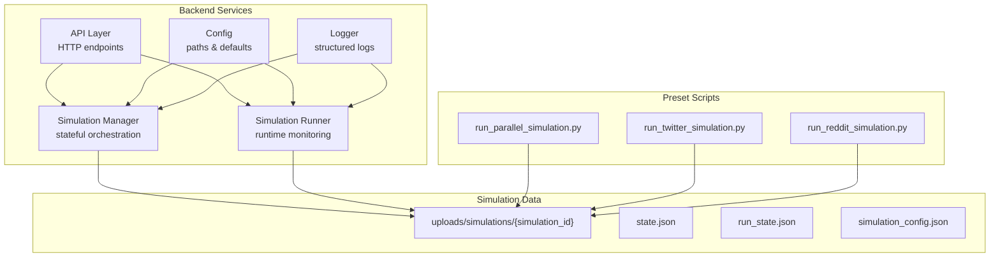
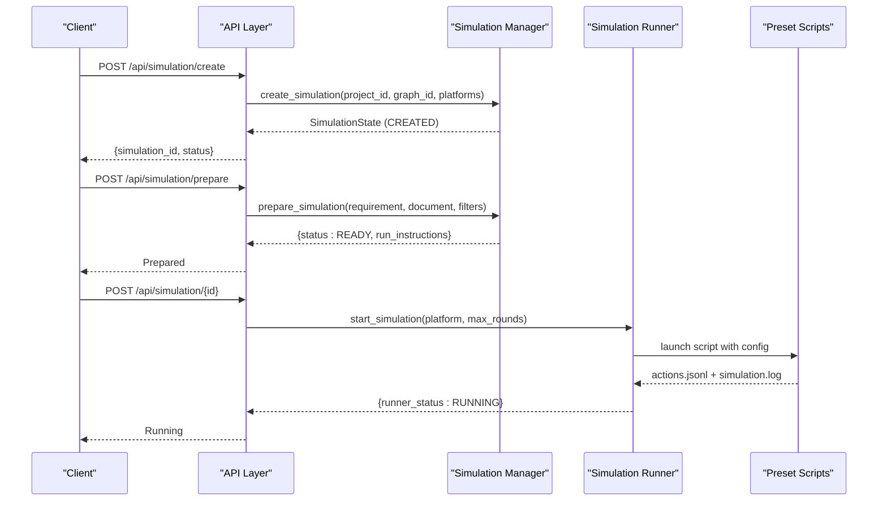
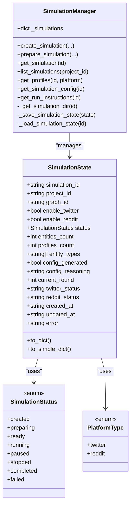
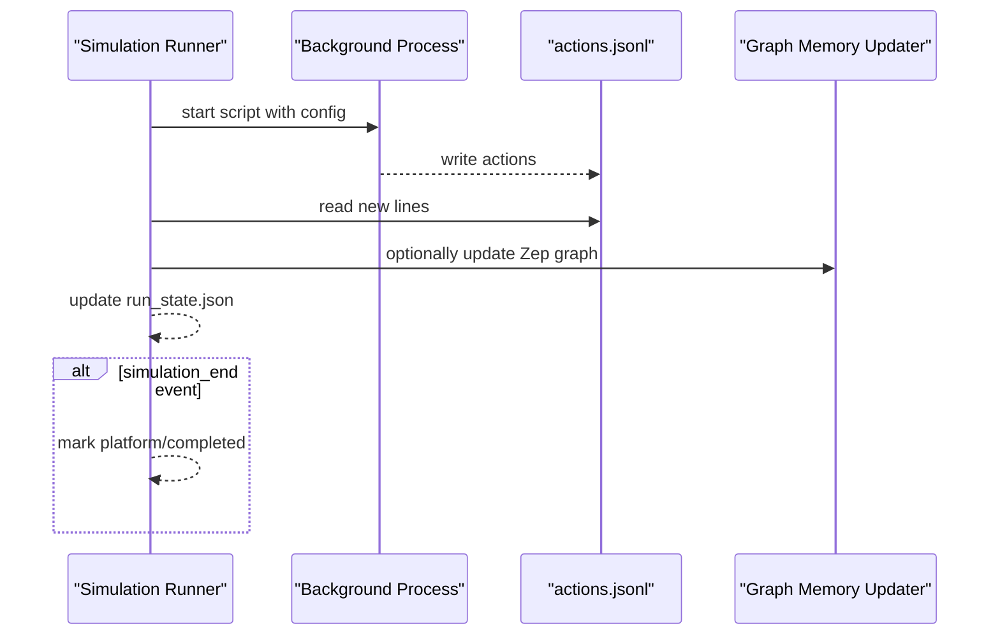
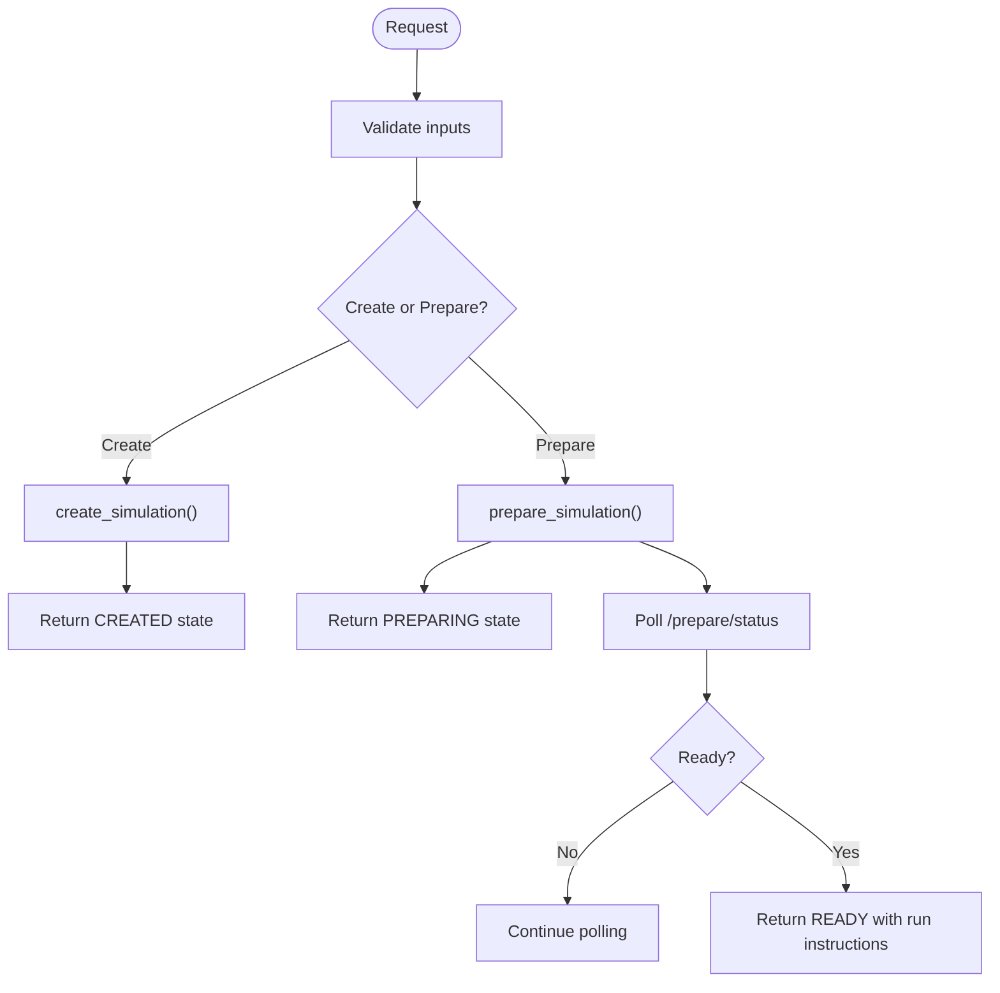
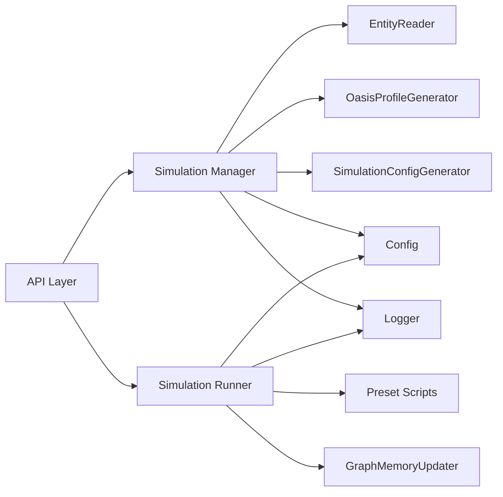
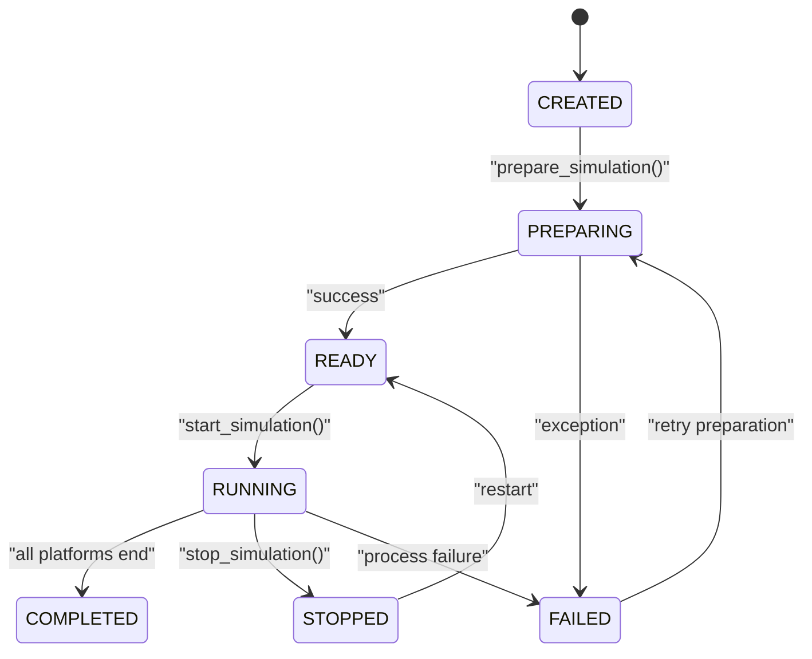

# Simulation Architecture

<cite>
**Referenced Files in This Document**
- [simulation_manager.py](file://backend/app/services/simulation_manager.py)
- [simulation_runner.py](file://backend/app/services/simulation_runner.py)
- [simulation.py](file://backend/app/api/simulation.py)
- [run_parallel_simulation.py](file://backend/scripts/run_parallel_simulation.py)
- [run_twitter_simulation.py](file://backend/scripts/run_twitter_simulation.py)
- [run_reddit_simulation.py](file://backend/scripts/run_reddit_simulation.py)
- [config.py](file://backend/app/config.py)
- [logger.py](file://backend/app/utils/logger.py)
- [state.json](file://backend/uploads/simulations/sim_f9ce2e9f795c/state.json)
- [simulation_config.json](file://backend/uploads/simulations/sim_f9ce2e9f795c/simulation_config.json)
- [run_state.json](file://backend/uploads/simulations/sim_f9ce2e9f795c/run_state.json)
</cite>

## Table of Contents
1. [Introduction](#introduction)
2. [Project Structure](#project-structure)
3. [Core Components](#core-components)
4. [Architecture Overview](#architecture-overview)
5. [Detailed Component Analysis](#detailed-component-analysis)
6. [Dependency Analysis](#dependency-analysis)
7. [Performance Considerations](#performance-considerations)
8. [Troubleshooting Guide](#troubleshooting-guide)
9. [Conclusion](#conclusion)
10. [Appendices](#appendices)

## Introduction
This document explains the simulation architecture that orchestrates multi-agent parallel simulations across Twitter and Reddit platforms. It covers the core simulation manager design pattern, state management, lifecycle from creation to completion, dual-platform orchestration, data directory structure, and state machine semantics. It also documents ID generation, directory management, and state serialization mechanisms, with practical examples of creation, preparation, and monitoring workflows.

## Project Structure
The simulation system is organized into:
- Backend services: simulation manager and runner, API endpoints, configuration, and logging utilities
- Preset scripts: platform-specific runners for Twitter and Reddit, plus a parallel runner
- Simulation data: persistent state and configuration stored under uploads/simulations

**Diagram sources**
- [simulation_manager.py:114-529](file://backend/app/services/simulation_manager.py#L114-L529)
- [simulation_runner.py:195-800](file://backend/app/services/simulation_runner.py#L195-L800)
- [simulation.py:146-791](file://backend/app/api/simulation.py#L146-L791)
- [run_parallel_simulation.py:1-26](file://backend/scripts/run_parallel_simulation.py#L1-L26)
- [run_twitter_simulation.py:1-14](file://backend/scripts/run_twitter_simulation.py#L1-L14)
- [run_reddit_simulation.py:1-14](file://backend/scripts/run_reddit_simulation.py#L1-L14)
- [config.py:47-49](file://backend/app/config.py#L47-L49)

**Section sources**
- [simulation_manager.py:114-139](file://backend/app/services/simulation_manager.py#L114-L139)
- [simulation_runner.py:195-225](file://backend/app/services/simulation_runner.py#L195-L225)
- [simulation.py:146-174](file://backend/app/api/simulation.py#L146-L174)
- [config.py:47-49](file://backend/app/config.py#L47-L49)

## Core Components
- Simulation Manager: Creates, prepares, and persists simulation state; coordinates dual-platform setup and configuration.
- Simulation Runner: Executes simulations in background processes, monitors action logs, and exposes real-time status.
- API Layer: Provides endpoints for creation, preparation, listing, and status queries.
- Preset Scripts: Platform runners that execute OASIS simulations and maintain IPC channels for interviews and shutdown.
- Configuration and Logging: Centralized configuration and structured logging for reliable operations.

Key responsibilities:
- State management: in-memory cache plus persistent JSON serialization
- Dual-platform orchestration: independent round progression and completion detection
- Real-time monitoring: streaming action logs and recent actions
- Process lifecycle: start, monitor, and terminate background simulations

**Section sources**
- [simulation_manager.py:114-192](file://backend/app/services/simulation_manager.py#L114-L192)
- [simulation_runner.py:195-296](file://backend/app/services/simulation_runner.py#L195-L296)
- [simulation.py:146-218](file://backend/app/api/simulation.py#L146-L218)
- [run_parallel_simulation.py:18-26](file://backend/scripts/run_parallel_simulation.py#L18-L26)

## Architecture Overview
The system follows a service-oriented design:
- API layer validates inputs and delegates to Simulation Manager
- Manager prepares environment, generates profiles and configs, and persists state
- Runner launches platform-specific scripts, monitors logs, and updates run state
- Scripts execute OASIS simulations, write action logs, and expose IPC for interviews

**Diagram sources**
- [simulation.py:146-218](file://backend/app/api/simulation.py#L146-L218)
- [simulation_manager.py:193-227](file://backend/app/services/simulation_manager.py#L193-L227)
- [simulation_manager.py:229-447](file://backend/app/services/simulation_manager.py#L229-L447)
- [simulation_runner.py:312-370](file://backend/app/services/simulation_runner.py#L312-L370)
- [run_parallel_simulation.py:18-26](file://backend/scripts/run_parallel_simulation.py#L18-L26)

## Detailed Component Analysis

### Simulation Manager
Responsibilities:
- Create simulation with unique ID and platform flags
- Prepare environment: entity filtering, profile generation, LLM-config generation
- Persist state to JSON and cache in-memory
- Provide run instructions and file accessors

State model:
- SimulationState captures metadata, counts, platform flags, runtime metrics, timestamps, and error info
- Serialization to/from JSON for durability

Lifecycle:
- CREATED → PREPARING → READY → RUNNING → COMPLETED/STOPPED/FAILED
- Failures set status to FAILED and persist error

**Diagram sources**
- [simulation_manager.py:24-112](file://backend/app/services/simulation_manager.py#L24-L112)
- [simulation_manager.py:114-192](file://backend/app/services/simulation_manager.py#L114-L192)

**Section sources**
- [simulation_manager.py:24-112](file://backend/app/services/simulation_manager.py#L24-L112)
- [simulation_manager.py:114-192](file://backend/app/services/simulation_manager.py#L114-L192)
- [simulation_manager.py:193-227](file://backend/app/services/simulation_manager.py#L193-L227)
- [simulation_manager.py:229-447](file://backend/app/services/simulation_manager.py#L229-L447)
- [simulation_manager.py:458-529](file://backend/app/services/simulation_manager.py#L458-L529)

### Simulation Runner
Responsibilities:
- Launch platform scripts as background processes
- Monitor action logs (per-platform) and update run state
- Expose real-time status, recent actions, and completion detection
- Support stop/terminate operations across platforms

Runtime state:
- SimulationRunState tracks rounds, simulated hours, platform flags, action counters, and recent actions
- Persists to run_state.json and caches in-memory

**Diagram sources**
- [simulation_runner.py:312-475](file://backend/app/services/simulation_runner.py#L312-L475)
- [simulation_runner.py:477-577](file://backend/app/services/simulation_runner.py#L477-L577)
- [simulation_runner.py:579-687](file://backend/app/services/simulation_runner.py#L579-L687)

**Section sources**
- [simulation_runner.py:195-296](file://backend/app/services/simulation_runner.py#L195-L296)
- [simulation_runner.py:312-475](file://backend/app/services/simulation_runner.py#L312-L475)
- [simulation_runner.py:477-577](file://backend/app/services/simulation_runner.py#L477-L577)
- [simulation_runner.py:579-687](file://backend/app/services/simulation_runner.py#L579-L687)

### API Layer
Endpoints:
- Create simulation: validates project and graph, creates state
- Prepare simulation: async task with progress callbacks, deduplicates preparation
- Get simulation: returns state and run instructions when ready
- List simulations: filters by project
- Prepare status: checks task progress or completion

**Diagram sources**
- [simulation.py:146-218](file://backend/app/api/simulation.py#L146-L218)
- [simulation.py:340-403](file://backend/app/api/simulation.py#L340-L403)
- [simulation.py:619-729](file://backend/app/api/simulation.py#L619-L729)

**Section sources**
- [simulation.py:146-218](file://backend/app/api/simulation.py#L146-L218)
- [simulation.py:340-403](file://backend/app/api/simulation.py#L340-L403)
- [simulation.py:619-729](file://backend/app/api/simulation.py#L619-L729)

### Preset Scripts (Dual-Platform)
- run_parallel_simulation.py: runs Twitter and Reddit concurrently, writes logs, supports IPC
- run_twitter_simulation.py: Twitter-only runner with interview IPC and optional immediate shutdown
- run_reddit_simulation.py: Reddit-only runner with similar capabilities

Log structure:
- twitter/actions.jsonl and reddit/actions.jsonl
- simulation.log for main process
- run_state.json for runner state

**Section sources**
- [run_parallel_simulation.py:18-26](file://backend/scripts/run_parallel_simulation.py#L18-L26)
- [run_twitter_simulation.py:1-14](file://backend/scripts/run_twitter_simulation.py#L1-L14)
- [run_reddit_simulation.py:1-14](file://backend/scripts/run_reddit_simulation.py#L1-L14)

## Dependency Analysis
- Simulation Manager depends on:
  - EntityReader, OasisProfileGenerator, SimulationConfigGenerator for preparation
  - Logger for audit trails
  - Configuration for data directory paths
- Simulation Runner depends on:
  - Preset scripts for platform execution
  - GraphMemoryUpdater for optional live updates
  - Logger for diagnostics
- API Layer depends on:
  - Simulation Manager and Runner for orchestration
  - TaskManager for async preparation tracking

**Diagram sources**
- [simulation_manager.py:15-21](file://backend/app/services/simulation_manager.py#L15-L21)
- [simulation_runner.py:21-26](file://backend/app/services/simulation_runner.py#L21-L26)
- [simulation.py:14-17](file://backend/app/api/simulation.py#L14-L17)

**Section sources**
- [simulation_manager.py:15-21](file://backend/app/services/simulation_manager.py#L15-L21)
- [simulation_runner.py:21-26](file://backend/app/services/simulation_runner.py#L21-L26)
- [simulation.py:14-17](file://backend/app/api/simulation.py#L14-L17)

## Performance Considerations
- Concurrency and throughput:
  - Parallel profile generation reduces preparation time
  - Semaphore limits in scripts cap concurrent LLM requests to prevent API saturation
- I/O efficiency:
  - Streaming action logs with incremental reads minimizes overhead
  - Separate per-platform logs enable independent progress tracking
- Resource management:
  - Process groups and cross-platform termination ensure cleanup
  - UTF-8 environment variables mitigate encoding issues on Windows

[No sources needed since this section provides general guidance]

## Troubleshooting Guide
Common issues and resolutions:
- Preparation fails due to zero entities:
  - Symptom: status becomes FAILED with a specific message
  - Resolution: verify graph build and entity filters
- Missing required files:
  - Symptom: preparation detection reports missing files
  - Resolution: ensure preparation completed and files exist
- Runner process errors:
  - Symptom: runner_status becomes FAILED with captured error tail
  - Resolution: inspect simulation.log and script outputs
- Stuck running:
  - Symptom: no progress despite active processes
  - Resolution: check action log availability and completion events

**Section sources**
- [simulation_manager.py:297-301](file://backend/app/services/simulation_manager.py#L297-L301)
- [simulation_runner.py:528-538](file://backend/app/services/simulation_runner.py#L528-L538)
- [simulation.py:221-337](file://backend/app/api/simulation.py#L221-L337)

## Conclusion
The simulation architecture combines a stateful manager, a robust runner, and platform-specific scripts to deliver reliable multi-agent simulations across Twitter and Reddit. Its design emphasizes persistence, real-time monitoring, and flexible orchestration, enabling reproducible experiments and actionable insights.

[No sources needed since this section summarizes without analyzing specific files]

## Appendices

### Simulation Lifecycle and State Machine
States: CREATED, PREPARING, READY, RUNNING, PAUSED, STOPPED, COMPLETED, FAILED

**Diagram sources**
- [simulation_manager.py:24-33](file://backend/app/services/simulation_manager.py#L24-L33)
- [simulation_runner.py:36-44](file://backend/app/services/simulation_runner.py#L36-L44)

**Section sources**
- [simulation_manager.py:24-33](file://backend/app/services/simulation_manager.py#L24-L33)
- [simulation_runner.py:36-44](file://backend/app/services/simulation_runner.py#L36-L44)

### Simulation ID Generation and Directory Management
- ID generation: UUID-based short hex with prefix
- Directory: uploads/simulations/{simulation_id}
- Persistence: state.json for manager state, run_state.json for runner state, simulation_config.json for runtime parameters

**Section sources**
- [simulation_manager.py:212-213](file://backend/app/services/simulation_manager.py#L212-L213)
- [simulation_manager.py:138-142](file://backend/app/services/simulation_manager.py#L138-L142)
- [config.py:47-49](file://backend/app/config.py#L47-L49)

### Simulation Data Directory Structure
Example layout for a simulation:
- state.json: manager state snapshot
- simulation_config.json: runtime configuration
- run_state.json: runner state snapshot
- twitter/: actions.jsonl, databases, logs
- reddit/: actions.jsonl, databases, logs
- simulation.log: main process log
- ipc_*: inter-process communication artifacts

**Section sources**
- [state.json:1-31](file://backend/uploads/simulations/sim_f9ce2e9f795c/state.json#L1-L31)
- [simulation_config.json:1-48](file://backend/uploads/simulations/sim_f9ce2e9f795c/simulation_config.json#L1-L48)
- [run_state.json:1-24](file://backend/uploads/simulations/sim_f9ce2e9f795c/run_state.json#L1-L24)
- [run_parallel_simulation.py:18-26](file://backend/scripts/run_parallel_simulation.py#L18-L26)

### Examples

- Creating a simulation:
  - Endpoint: POST /api/simulation/create
  - Fields: project_id, graph_id (optional), enable_twitter, enable_reddit
  - Response: SimulationState with CREATED status

- Preparing a simulation:
  - Endpoint: POST /api/simulation/prepare
  - Parameters: simulation_id, entity_types, use_llm_for_profiles, parallel_profile_count, force_regenerate
  - Progress: tracked via task_id and stage details

- Monitoring a running simulation:
  - Endpoint: GET /api/simulation/{simulation_id}
  - Response includes runner_status, current_round, simulated_hours, recent_actions, and platform flags

**Section sources**
- [simulation.py:146-218](file://backend/app/api/simulation.py#L146-L218)
- [simulation.py:340-403](file://backend/app/api/simulation.py#L340-L403)
- [simulation.py:732-762](file://backend/app/api/simulation.py#L732-L762)
- [simulation_runner.py:230-239](file://backend/app/services/simulation_runner.py#L230-L239)
- [simulation_runner.py:159-192](file://backend/app/services/simulation_runner.py#L159-L192)