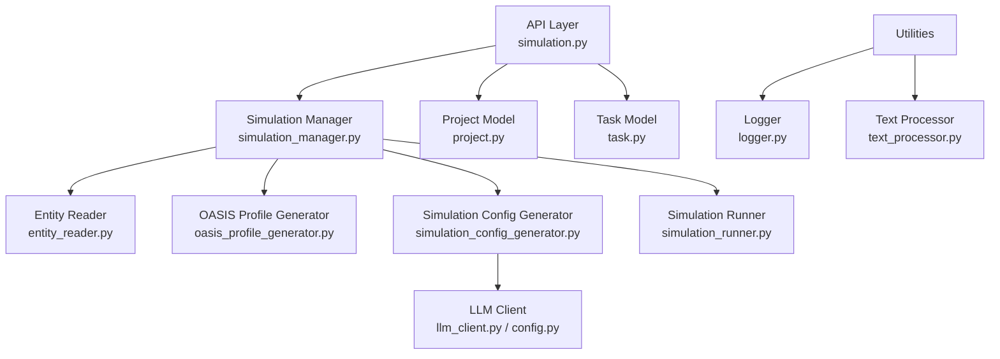
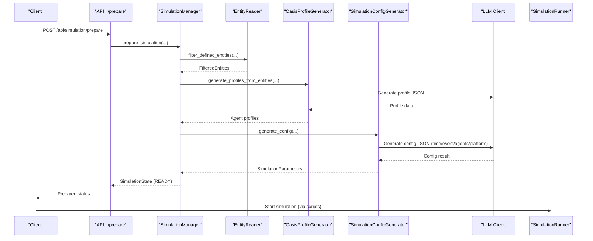
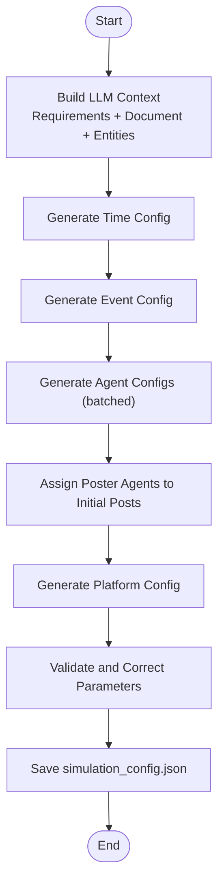
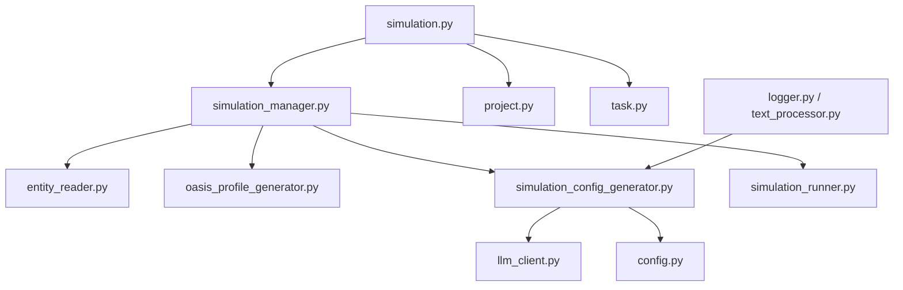

# Simulation Configuration Generation

<cite>
**Referenced Files in This Document**
- [simulation_config_generator.py](file://backend/app/services/simulation_config_generator.py)
- [simulation_manager.py](file://backend/app/services/simulation_manager.py)
- [entity_reader.py](file://backend/app/services/entity_reader.py)
- [oasis_profile_generator.py](file://backend/app/services/oasis_profile_generator.py)
- [simulation.py](file://backend/app/api/simulation.py)
- [config.py](file://backend/app/config.py)
- [project.py](file://backend/app/models/project.py)
- [task.py](file://backend/app/models/task.py)
- [llm_client.py](file://backend/app/utils/llm_client.py)
- [simulation_runner.py](file://backend/app/services/simulation_runner.py)
- [text_processor.py](file://backend/app/utils/text_processor.py)
- [logger.py](file://backend/app/utils/logger.py)
- [simulation_config.json](file://backend/uploads/simulations/sim_f9ce2e9f795c/simulation_config.json)
</cite>

## Table of Contents
1. [Introduction](#introduction)
2. [Project Structure](#project-structure)
3. [Core Components](#core-components)
4. [Architecture Overview](#architecture-overview)
5. [Detailed Component Analysis](#detailed-component-analysis)
6. [Dependency Analysis](#dependency-analysis)
7. [Performance Considerations](#performance-considerations)
8. [Troubleshooting Guide](#troubleshooting-guide)
9. [Conclusion](#conclusion)
10. [Appendices](#appendices)

## Introduction
This document describes the intelligent simulation configuration generation system powered by LLM analysis. It explains how simulation parameters are generated automatically from simulation requirements, document context, and graph entity information. The system produces validated, optimized configuration files tailored to platform-specific dynamics and entity characteristics, enabling reproducible and context-aware social media simulations on Twitter and Reddit.

## Project Structure
The configuration generation spans several backend modules:
- API layer orchestrates preparation and exposes endpoints
- Manager layer coordinates entity reading, profile generation, and config generation
- Services encapsulate LLM-driven parameter generation, entity processing, and platform-specific tuning
- Utilities provide LLM client wrappers, logging, and text processing
- Configuration defines LLM endpoints and platform capabilities

**Diagram sources**
- [simulation.py:146-218](file://backend/app/api/simulation.py#L146-L218)
- [simulation_manager.py:229-456](file://backend/app/services/simulation_manager.py#L229-L456)
- [entity_reader.py:128-244](file://backend/app/services/entity_reader.py#L128-L244)
- [oasis_profile_generator.py:141-265](file://backend/app/services/oasis_profile_generator.py#L141-L265)
- [simulation_config_generator.py:199-378](file://backend/app/services/simulation_config_generator.py#L199-L378)
- [llm_client.py:14-104](file://backend/app/utils/llm_client.py#L14-L104)
- [config.py:20-76](file://backend/app/config.py#L20-L76)
- [simulation_runner.py:195-475](file://backend/app/services/simulation_runner.py#L195-L475)
- [project.py:26-98](file://backend/app/models/project.py#L26-L98)
- [task.py:22-51](file://backend/app/models/task.py#L22-L51)
- [logger.py:30-104](file://backend/app/utils/logger.py#L30-L104)
- [text_processor.py:9-72](file://backend/app/utils/text_processor.py#L9-L72)

**Section sources**
- [simulation.py:146-218](file://backend/app/api/simulation.py#L146-L218)
- [simulation_manager.py:114-137](file://backend/app/services/simulation_manager.py#L114-L137)
- [entity_reader.py:69-81](file://backend/app/services/entity_reader.py#L69-L81)
- [oasis_profile_generator.py:141-202](file://backend/app/services/oasis_profile_generator.py#L141-L202)
- [simulation_config_generator.py:199-241](file://backend/app/services/simulation_config_generator.py#L199-L241)
- [llm_client.py:14-34](file://backend/app/utils/llm_client.py#L14-L34)
- [config.py:20-76](file://backend/app/config.py#L20-L76)
- [simulation_runner.py:195-225](file://backend/app/services/simulation_runner.py#L195-L225)
- [project.py:101-111](file://backend/app/models/project.py#L101-L111)
- [task.py:54-72](file://backend/app/models/task.py#L54-L72)
- [logger.py:30-88](file://backend/app/utils/logger.py#L30-L88)
- [text_processor.py:9-35](file://backend/app/utils/text_processor.py#L9-L35)

## Core Components
- SimulationConfigGenerator: Orchestrates step-by-step LLM-driven parameter generation for time, events, agents, and platform configuration. Implements robust JSON repair and retry logic, context truncation, and validation.
- SimulationManager: Coordinates preparation pipeline: entity reading, profile generation, config generation, and file writing. Manages state and progress callbacks.
- EntityReader: Filters graph nodes by predefined entity types and enriches with edges/nodes for richer context.
- OasisProfileGenerator: Produces OASIS-compatible agent profiles from entities, with optional LLM enhancement and graph retrieval.
- LLM Client and Config: Unified OpenAI-style client and configuration for model selection, base URL, and API key.
- Simulation Runner: Executes simulations using generated configuration and tracks real-time actions and progress.

**Section sources**
- [simulation_config_generator.py:199-378](file://backend/app/services/simulation_config_generator.py#L199-L378)
- [simulation_manager.py:229-456](file://backend/app/services/simulation_manager.py#L229-L456)
- [entity_reader.py:128-244](file://backend/app/services/entity_reader.py#L128-L244)
- [oasis_profile_generator.py:141-265](file://backend/app/services/oasis_profile_generator.py#L141-L265)
- [llm_client.py:14-104](file://backend/app/utils/llm_client.py#L14-L104)
- [config.py:20-76](file://backend/app/config.py#L20-L76)
- [simulation_runner.py:195-475](file://backend/app/services/simulation_runner.py#L195-L475)

## Architecture Overview
The system follows a staged, LLM-guided workflow:
1. Read and filter entities from the graph
2. Generate OASIS agent profiles (optional LLM enhancement)
3. LLM generates simulation configuration (time, events, agents, platform)
4. Save configuration and profile files
5. Run simulation with real-time monitoring

**Diagram sources**
- [simulation.py:340-428](file://backend/app/api/simulation.py#L340-L428)
- [simulation_manager.py:229-456](file://backend/app/services/simulation_manager.py#L229-L456)
- [entity_reader.py:128-244](file://backend/app/services/entity_reader.py#L128-L244)
- [oasis_profile_generator.py:338-373](file://backend/app/services/oasis_profile_generator.py#L338-L373)
- [simulation_config_generator.py:242-378](file://backend/app/services/simulation_config_generator.py#L242-L378)
- [llm_client.py:14-104](file://backend/app/utils/llm_client.py#L14-L104)
- [simulation_runner.py:312-475](file://backend/app/services/simulation_runner.py#L312-L475)

## Detailed Component Analysis

### Simulation Configuration Generation Workflow
The generator builds a context from simulation requirements, document text, and entity summaries, then performs stepwise LLM generation:
- Time configuration: determines total simulation hours, minutes per round, agent activation rates, and daily activity patterns
- Event configuration: extracts trending topics, narrative direction, and initial posts with poster types
- Agent configurations: generates activity levels, posting/comment frequencies, active hours, response delays, sentiment biases, stances, and influence weights
- Platform configuration: sets recommendation weights, viral thresholds, and echo chamber strengths for Twitter and Reddit

**Diagram sources**
- [simulation_config_generator.py:242-378](file://backend/app/services/simulation_config_generator.py#L242-L378)
- [simulation_config_generator.py:380-432](file://backend/app/services/simulation_config_generator.py#L380-L432)
- [simulation_config_generator.py:534-642](file://backend/app/services/simulation_config_generator.py#L534-L642)
- [simulation_config_generator.py:644-723](file://backend/app/services/simulation_config_generator.py#L644-L723)
- [simulation_config_generator.py:725-800](file://backend/app/services/simulation_config_generator.py#L725-L800)
- [simulation_config_generator.py:335-378](file://backend/app/services/simulation_config_generator.py#L335-L378)

**Section sources**
- [simulation_config_generator.py:242-378](file://backend/app/services/simulation_config_generator.py#L242-L378)
- [simulation_config_generator.py:380-432](file://backend/app/services/simulation_config_generator.py#L380-L432)
- [simulation_config_generator.py:534-642](file://backend/app/services/simulation_config_generator.py#L534-L642)
- [simulation_config_generator.py:644-723](file://backend/app/services/simulation_config_generator.py#L644-L723)
- [simulation_config_generator.py:725-800](file://backend/app/services/simulation_config_generator.py#L725-L800)
- [simulation_config_generator.py:335-378](file://backend/app/services/simulation_config_generator.py#L335-L378)

### LLM Reasoning Chain and Rationale Preservation
- The generator captures a reasoning trail for each step and stores it in the configuration metadata for traceability.
- Retry and JSON repair logic ensures robustness against LLM output truncation or malformed JSON.
- Context truncation limits reduce token usage and maintain performance.

**Section sources**
- [simulation_config_generator.py:292-305](file://backend/app/services/simulation_config_generator.py#L292-L305)
- [simulation_config_generator.py:433-533](file://backend/app/services/simulation_config_generator.py#L433-L533)
- [simulation_config_generator.py:212-222](file://backend/app/services/simulation_config_generator.py#L212-L222)

### Simulation Requirement Analysis and Document Context Processing
- The system extracts simulation requirements from the project and augments them with document text and entity summaries.
- Entity summaries are grouped by type and truncated to fit within context limits.
- The manager retrieves project simulation requirements and document text to feed into the generator.

**Section sources**
- [simulation_manager.py:229-456](file://backend/app/services/simulation_manager.py#L229-L456)
- [project.py:101-111](file://backend/app/models/project.py#L101-L111)
- [simulation_config_generator.py:380-432](file://backend/app/services/simulation_config_generator.py#L380-L432)
- [text_processor.py:13-34](file://backend/app/utils/text_processor.py#L13-L34)

### Configuration Validation, Parameter Optimization, and Platform-Specific Tuning
- Validation ensures agent activation bounds respect total agent counts and min/max ordering.
- Optimization includes activity multipliers aligned to typical daily patterns and platform-specific tuning (recommendation weights, viral thresholds, echo chamber strengths).
- Platform-specific defaults are applied for Twitter and Reddit.

**Section sources**
- [simulation_config_generator.py:609-642](file://backend/app/services/simulation_config_generator.py#L609-L642)
- [simulation_config_generator.py:335-358](file://backend/app/services/simulation_config_generator.py#L335-L358)
- [simulation_config_generator.py:27-47](file://backend/app/services/simulation_config_generator.py#L27-L47)

### Configuration File Format, Parameter Ranges, and Constraint Handling
The configuration file includes:
- Simulation identifiers and requirement text
- Time configuration: total simulation hours, minutes per round, agent activation ranges, and hourly activity bands
- Agent configurations: per-agent activity metrics, posting/comment frequencies, active hours, response delays, sentiment bias, stance, and influence weight
- Event configuration: initial posts, scheduled events, trending topics, and narrative direction
- Platform configurations: Twitter and Reddit settings with recommendation weights, viral thresholds, and echo chamber strengths
- LLM metadata: model, base URL, generation timestamp, and reasoning trail

Parameter ranges and constraints:
- Time configuration: total simulation hours typically 24–168; minutes per round 30–120; agents per hour min ≤ max and bounded by total agent count
- Activity levels: 0.0–1.0
- Posting/comment frequencies: ≥0
- Active hours: 0–23 arrays with sensible defaults
- Response delays: minutes with platform-appropriate ranges
- Sentiment bias: −1.0 to 1.0
- Influence weights: ≥0
- Platform tuning: weights sum to 1.0; thresholds and strengths tuned per platform

**Section sources**
- [simulation_config_generator.py:146-197](file://backend/app/services/simulation_config_generator.py#L146-L197)
- [simulation_config_generator.py:82-111](file://backend/app/services/simulation_config_generator.py#L82-L111)
- [simulation_config_generator.py:50-81](file://backend/app/services/simulation_config_generator.py#L50-L81)
- [simulation_config_generator.py:128-144](file://backend/app/services/simulation_config_generator.py#L128-L144)
- [simulation_config_generator.py:129-143](file://backend/app/services/simulation_config_generator.py#L129-L143)
- [simulation_config.json:1-800](file://backend/uploads/simulations/sim_f9ce2e9f795c/simulation_config.json#L1-L800)

### Integration with Entity Data for Context-Aware Configuration
- Entities are filtered by predefined types and enriched with related edges and nodes.
- The generator assigns initial posts to agents based on poster types, using type aliases and influence weighting fallbacks.
- Entity summaries inform time and activity patterns, ensuring realistic agent behaviors.

**Section sources**
- [entity_reader.py:128-244](file://backend/app/services/entity_reader.py#L128-L244)
- [simulation_config_generator.py:725-800](file://backend/app/services/simulation_config_generator.py#L725-L800)
- [oasis_profile_generator.py:141-202](file://backend/app/services/oasis_profile_generator.py#L141-L202)

### Relationship Between Graph Entities and Simulation Parameters
- Entity types drive agent roles (e.g., GovernmentAgency, MediaOutlet, Organization)
- Entity attributes and relationships inform persona generation and platform behavior
- Agent influence weights reflect entity prominence; activity levels and posting frequencies mirror entity engagement patterns

**Section sources**
- [entity_reader.py:44-49](file://backend/app/services/entity_reader.py#L44-L49)
- [oasis_profile_generator.py:167-177](file://backend/app/services/oasis_profile_generator.py#L167-L177)
- [simulation_config_generator.py:50-81](file://backend/app/services/simulation_config_generator.py#L50-L81)

### Example Inputs and Outputs
- Inputs:
  - Simulation requirement text describing scenario and goals
  - Document text providing background and context
  - Filtered entities from the graph with summaries and relationships
- Outputs:
  - simulation_config.json with time, agent, event, and platform configurations
  - Agent profiles for Twitter and Reddit
- Configuration structure:
  - See [simulation_config.json:1-800](file://backend/uploads/simulations/sim_f9ce2e9f795c/simulation_config.json#L1-L800)

**Section sources**
- [simulation_manager.py:229-456](file://backend/app/services/simulation_manager.py#L229-L456)
- [simulation.py:340-428](file://backend/app/api/simulation.py#L340-L428)
- [simulation_config.json:1-800](file://backend/uploads/simulations/sim_f9ce2e9f795c/simulation_config.json#L1-L800)

## Dependency Analysis
Key dependencies and interactions:
- API depends on SimulationManager for orchestration
- SimulationManager depends on EntityReader, OasisProfileGenerator, and SimulationConfigGenerator
- SimulationConfigGenerator depends on LLM client and configuration
- SimulationRunner consumes the generated configuration for execution

**Diagram sources**
- [simulation.py:146-218](file://backend/app/api/simulation.py#L146-L218)
- [simulation_manager.py:229-456](file://backend/app/services/simulation_manager.py#L229-L456)
- [entity_reader.py:128-244](file://backend/app/services/entity_reader.py#L128-L244)
- [oasis_profile_generator.py:141-265](file://backend/app/services/oasis_profile_generator.py#L141-L265)
- [simulation_config_generator.py:199-378](file://backend/app/services/simulation_config_generator.py#L199-L378)
- [llm_client.py:14-104](file://backend/app/utils/llm_client.py#L14-L104)
- [config.py:20-76](file://backend/app/config.py#L20-L76)
- [simulation_runner.py:195-475](file://backend/app/services/simulation_runner.py#L195-L475)
- [project.py:101-111](file://backend/app/models/project.py#L101-L111)
- [task.py:54-72](file://backend/app/models/task.py#L54-L72)
- [logger.py:30-104](file://backend/app/utils/logger.py#L30-L104)
- [text_processor.py:9-72](file://backend/app/utils/text_processor.py#L9-L72)

**Section sources**
- [simulation.py:146-218](file://backend/app/api/simulation.py#L146-L218)
- [simulation_manager.py:229-456](file://backend/app/services/simulation_manager.py#L229-L456)
- [simulation_config_generator.py:199-378](file://backend/app/services/simulation_config_generator.py#L199-L378)
- [config.py:20-76](file://backend/app/config.py#L20-L76)

## Performance Considerations
- Context truncation and batched agent generation reduce LLM token usage and improve reliability
- Retry and JSON repair logic mitigate partial or malformed outputs
- Real-time progress reporting and lightweight parsing minimize overhead during long runs
- Logging with UTF-8 support ensures cross-platform stability

[No sources needed since this section provides general guidance]

## Troubleshooting Guide
Common issues and resolutions:
- LLM API misconfiguration: Verify LLM API key, base URL, and model name in configuration
- Missing required files: Ensure simulation preparation completes and required files exist
- Entity filtering: Confirm graph contains entities matching predefined types
- JSON parsing errors: The generator includes JSON repair routines; check logs for repair attempts
- Simulation not started: Confirm preparation status and run instructions

**Section sources**
- [config.py:30-34](file://backend/app/config.py#L30-L34)
- [simulation_manager.py:229-456](file://backend/app/services/simulation_manager.py#L229-L456)
- [simulation.py:221-338](file://backend/app/api/simulation.py#L221-L338)
- [simulation_config_generator.py:433-533](file://backend/app/services/simulation_config_generator.py#L433-L533)
- [logger.py:30-104](file://backend/app/utils/logger.py#L30-L104)

## Conclusion
The intelligent simulation configuration generation system automates parameter selection by combining LLM reasoning with graph entity context. It validates and optimizes parameters, preserves generation rationale, and applies platform-specific tuning. The resulting configuration enables reproducible, context-aware simulations on Twitter and Reddit.

## Appendices

### Configuration File Schema Highlights
- Simulation identifiers and requirement text
- Time configuration: total simulation hours, minutes per round, agent activation ranges, hourly activity bands
- Agent configurations: activity levels, posting/comment frequencies, active hours, response delays, sentiment bias, stance, influence weights
- Event configuration: initial posts, scheduled events, trending topics, narrative direction
- Platform configurations: Twitter and Reddit settings with recommendation weights, viral thresholds, echo chamber strengths
- LLM metadata: model, base URL, generation timestamp, reasoning trail

**Section sources**
- [simulation_config_generator.py:146-197](file://backend/app/services/simulation_config_generator.py#L146-L197)
- [simulation_config.json:1-800](file://backend/uploads/simulations/sim_f9ce2e9f795c/simulation_config.json#L1-L800)