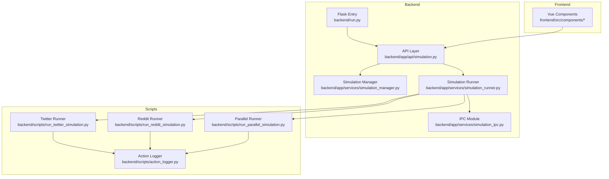
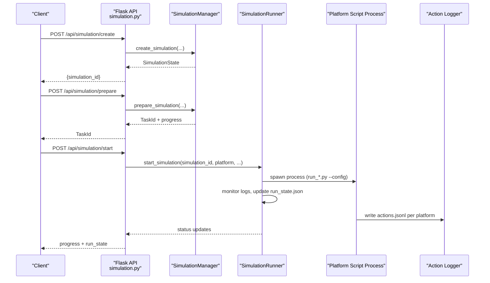
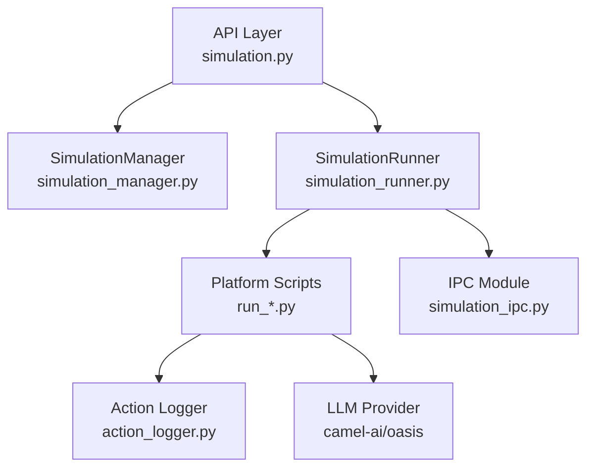

# Simulation Execution Workflow

<cite>
**Referenced Files in This Document**
- [run.py](file://backend/run.py)
- [simulation.py](file://backend/app/api/simulation.py)
- [simulation_manager.py](file://backend/app/services/simulation_manager.py)
- [simulation_runner.py](file://backend/app/services/simulation_runner.py)
- [simulation_ipc.py](file://backend/app/services/simulation_ipc.py)
- [run_twitter_simulation.py](file://backend/scripts/run_twitter_simulation.py)
- [run_reddit_simulation.py](file://backend/scripts/run_reddit_simulation.py)
- [run_parallel_simulation.py](file://backend/scripts/run_parallel_simulation.py)
- [action_logger.py](file://backend/scripts/action_logger.py)
</cite>

## Table of Contents
1. [Introduction](#introduction)
2. [Project Structure](#project-structure)
3. [Core Components](#core-components)
4. [Architecture Overview](#architecture-overview)
5. [Detailed Component Analysis](#detailed-component-analysis)
6. [Dependency Analysis](#dependency-analysis)
7. [Performance Considerations](#performance-considerations)
8. [Troubleshooting Guide](#troubleshooting-guide)
9. [Conclusion](#conclusion)
10. [Appendices](#appendices)

## Introduction
This document explains the simulation execution workflow that orchestrates multi-agent simulation runs across Twitter and Reddit platforms. It covers the backend orchestration, platform-specific execution scripts, environment setup, agent initialization, runtime coordination, action execution patterns, memory updates, context management, round management, status tracking, progress monitoring, integration with external platform APIs, authentication/authorization handling, and result collection/post-processing. It also provides practical execution commands, parameter configurations, and result interpretation patterns.

## Project Structure
The simulation system is composed of:
- Backend orchestration and API: Flask application entry, API endpoints, simulation manager, runner, and IPC utilities
- Platform scripts: Twitter, Reddit, and parallel dual-platform runners
- Logging and action recording: unified action logger and per-platform action logs
- Frontend integration: Vue-based UI components for simulation steps and reporting

**Diagram sources**
- [run.py:1-51](file://backend/run.py#L1-L51)
- [simulation.py:1-200](file://backend/app/api/simulation.py#L1-L200)
- [simulation_manager.py:114-228](file://backend/app/services/simulation_manager.py#L114-L228)
- [simulation_runner.py:195-475](file://backend/app/services/simulation_runner.py#L195-L475)
- [simulation_ipc.py:95-268](file://backend/app/services/simulation_ipc.py#L95-L268)
- [run_twitter_simulation.py:707-781](file://backend/scripts/run_twitter_simulation.py#L707-L781)
- [run_reddit_simulation.py:695-769](file://backend/scripts/run_reddit_simulation.py#L695-L769)
- [run_parallel_simulation.py:1492-1599](file://backend/scripts/run_parallel_simulation.py#L1492-L1599)
- [action_logger.py:119-197](file://backend/scripts/action_logger.py#L119-L197)

**Section sources**
- [run.py:1-51](file://backend/run.py#L1-L51)
- [simulation.py:146-218](file://backend/app/api/simulation.py#L146-L218)

## Core Components
- Simulation Manager: Prepares simulations by reading/filtering entities, generating agent profiles, and creating simulation configuration files. It manages simulation lifecycle states and provides run instructions.
- Simulation Runner: Starts/stops simulation processes, monitors platform action logs, tracks run state, and coordinates graph memory updates.
- Platform Scripts: Twitter, Reddit, and parallel runners initialize LLM models, build agent graphs, run simulation loops, log actions, and support IPC-based interviews.
- IPC Module: Provides command/response channels for interviews and environment control between backend and scripts.
- Action Logger: Writes structured action logs per platform and simulation-wide logs for monitoring.

**Section sources**
- [simulation_manager.py:114-228](file://backend/app/services/simulation_manager.py#L114-L228)
- [simulation_runner.py:195-475](file://backend/app/services/simulation_runner.py#L195-L475)
- [run_twitter_simulation.py:385-705](file://backend/scripts/run_twitter_simulation.py#L385-L705)
- [run_reddit_simulation.py:385-693](file://backend/scripts/run_reddit_simulation.py#L385-L693)
- [run_parallel_simulation.py:1093-1490](file://backend/scripts/run_parallel_simulation.py#L1093-L1490)
- [simulation_ipc.py:95-268](file://backend/app/services/simulation_ipc.py#L95-L268)
- [action_logger.py:22-117](file://backend/scripts/action_logger.py#L22-L117)

## Architecture Overview
The system follows a backend-driven orchestration model:
- API endpoints create and prepare simulations, then delegate execution to platform scripts
- Runner spawns platform processes, monitors logs, and maintains run state
- Scripts execute multi-agent simulations, record actions, and expose IPC for interviews
- Optional graph memory updater integrates with Zep for dynamic memory updates

**Diagram sources**
- [simulation.py:146-218](file://backend/app/api/simulation.py#L146-L218)
- [simulation_manager.py:193-228](file://backend/app/services/simulation_manager.py#L193-L228)
- [simulation_runner.py:312-475](file://backend/app/services/simulation_runner.py#L312-L475)
- [run_twitter_simulation.py:707-781](file://backend/scripts/run_twitter_simulation.py#L707-L781)
- [run_reddit_simulation.py:695-769](file://backend/scripts/run_reddit_simulation.py#L695-L769)
- [run_parallel_simulation.py:1492-1599](file://backend/scripts/run_parallel_simulation.py#L1492-L1599)
- [action_logger.py:22-117](file://backend/scripts/action_logger.py#L22-L117)

## Detailed Component Analysis

### Simulation Manager
Responsibilities:
- Create simulation with project and graph context
- Prepare environment: read/filter entities, generate agent profiles (CSV/JSON), generate simulation config, save artifacts
- Provide run instructions and manage simulation state

Key behaviors:
- Entity filtering and counts preview
- LLM-driven config generation
- Real-time progress callbacks for frontend
- State persistence and readiness checks

**Section sources**
- [simulation_manager.py:114-228](file://backend/app/services/simulation_manager.py#L114-L228)
- [simulation_manager.py:229-456](file://backend/app/services/simulation_manager.py#L229-L456)
- [simulation_manager.py:458-529](file://backend/app/services/simulation_manager.py#L458-L529)

### Simulation Runner
Responsibilities:
- Spawn platform processes (Twitter/Reddit/parallel)
- Monitor per-platform action logs (actions.jsonl)
- Aggregate run state, recent actions, and platform completion
- Coordinate graph memory updates and process termination

Execution flow:
- Validate configuration and load simulation config
- Determine platform and script path
- Launch process with UTF-8 environment and working directory
- Start monitor thread to parse action logs and update run state
- Detect simulation_end events and platform completion
- Stop graph memory updater and clean up resources

**Section sources**
- [simulation_runner.py:195-475](file://backend/app/services/simulation_runner.py#L195-L475)
- [simulation_runner.py:477-577](file://backend/app/services/simulation_runner.py#L477-L577)
- [simulation_runner.py:578-687](file://backend/app/services/simulation_runner.py#L578-L687)
- [simulation_runner.py:688-714](file://backend/app/services/simulation_runner.py#L688-L714)
- [simulation_runner.py:771-800](file://backend/app/services/simulation_runner.py#L771-L800)

### Platform Scripts

#### Twitter Runner
- Loads CSV profiles, creates LLM model from environment, builds Twitter agent graph
- Creates OASIS environment with SQLite DB, executes initial posts, runs simulation loop
- Logs actions to twitter/actions.jsonl, round events, and simulation events
- Supports IPC for interviews and environment shutdown

**Section sources**
- [run_twitter_simulation.py:385-705](file://backend/scripts/run_twitter_simulation.py#L385-L705)
- [run_twitter_simulation.py:707-781](file://backend/scripts/run_twitter_simulation.py#L707-L781)

#### Reddit Runner
- Loads JSON profiles, creates LLM model, builds Reddit agent graph
- Executes initial posts, runs simulation loop, logs actions to reddit/actions.jsonl
- Supports IPC for interviews and environment shutdown

**Section sources**
- [run_reddit_simulation.py:385-693](file://backend/scripts/run_reddit_simulation.py#L385-L693)
- [run_reddit_simulation.py:695-769](file://backend/scripts/run_reddit_simulation.py#L695-L769)

#### Parallel Runner
- Dual-platform execution with separate loggers and DBs
- Uses different LLM configurations per platform (boost for Reddit)
- Context-enriched action logging with database queries
- IPC handler supports single or dual-platform interviews

**Section sources**
- [run_parallel_simulation.py:1093-1490](file://backend/scripts/run_parallel_simulation.py#L1093-L1490)
- [run_parallel_simulation.py:1492-1599](file://backend/scripts/run_parallel_simulation.py#L1492-L1599)
- [run_parallel_simulation.py:657-747](file://backend/scripts/run_parallel_simulation.py#L657-L747)
- [run_parallel_simulation.py:857-982](file://backend/scripts/run_parallel_simulation.py#L857-L982)

### IPC Communication
- Backend client writes commands to ipc_commands and waits for responses in ipc_responses
- Scripts poll commands, execute interviews or close environment, and write responses
- Status file indicates environment availability

**Section sources**
- [simulation_ipc.py:95-268](file://backend/app/services/simulation_ipc.py#L95-L268)
- [simulation_ipc.py:288-395](file://backend/app/services/simulation_ipc.py#L288-L395)

### Action Logging and Context Management
- Unified SimulationLogManager and PlatformActionLogger write actions.jsonl per platform
- Events: simulation_start, round_start/end, simulation_end
- Context enrichment: post/comment/user metadata from DB for richer action records
- Filtering: non-core actions excluded from enriched logs

**Section sources**
- [action_logger.py:22-117](file://backend/scripts/action_logger.py#L22-L117)
- [action_logger.py:119-197](file://backend/scripts/action_logger.py#L119-L197)
- [run_parallel_simulation.py:657-747](file://backend/scripts/run_parallel_simulation.py#L657-L747)
- [run_parallel_simulation.py:857-982](file://backend/scripts/run_parallel_simulation.py#L857-L982)

### Authentication and Authorization
- LLM API keys and base URLs are loaded from environment variables (.env)
- Twitter/Reddit runners require OPENAI-compatible provider configuration
- No explicit OAuth/Twitter API credentials are present in the scripts; external platform APIs are accessed via LLM actions

**Section sources**
- [run_twitter_simulation.py:436-461](file://backend/scripts/run_twitter_simulation.py#L436-L461)
- [run_reddit_simulation.py:443-468](file://backend/scripts/run_reddit_simulation.py#L443-L468)
- [run_parallel_simulation.py:984-1037](file://backend/scripts/run_parallel_simulation.py#L984-L1037)

### Result Collection and Post-Processing
- Per-platform actions.jsonl files contain structured action records
- Runner aggregates recent actions and platform metrics
- Optional graph memory updates integrate with Zep for dynamic memory
- Reports can be derived from collected actions and DB traces

**Section sources**
- [simulation_runner.py:146-193](file://backend/app/services/simulation_runner.py#L146-L193)
- [simulation_runner.py:578-687](file://backend/app/services/simulation_runner.py#L578-L687)
- [run_parallel_simulation.py:1283-1290](file://backend/scripts/run_parallel_simulation.py#L1283-L1290)
- [run_parallel_simulation.py:1482-1489](file://backend/scripts/run_parallel_simulation.py#L1482-L1489)

## Dependency Analysis

**Diagram sources**
- [simulation.py:146-218](file://backend/app/api/simulation.py#L146-L218)
- [simulation_manager.py:114-228](file://backend/app/services/simulation_manager.py#L114-L228)
- [simulation_runner.py:195-475](file://backend/app/services/simulation_runner.py#L195-L475)
- [run_twitter_simulation.py:118-132](file://backend/scripts/run_twitter_simulation.py#L118-L132)
- [run_reddit_simulation.py:118-132](file://backend/scripts/run_reddit_simulation.py#L118-L132)
- [run_parallel_simulation.py:160-175](file://backend/scripts/run_parallel_simulation.py#L160-L175)
- [action_logger.py:22-117](file://backend/scripts/action_logger.py#L22-L117)
- [simulation_ipc.py:95-268](file://backend/app/services/simulation_ipc.py#L95-L268)

**Section sources**
- [simulation_manager.py:114-228](file://backend/app/services/simulation_manager.py#L114-L228)
- [simulation_runner.py:195-475](file://backend/app/services/simulation_runner.py#L195-L475)
- [run_twitter_simulation.py:118-132](file://backend/scripts/run_twitter_simulation.py#L118-L132)
- [run_reddit_simulation.py:118-132](file://backend/scripts/run_reddit_simulation.py#L118-L132)
- [run_parallel_simulation.py:160-175](file://backend/scripts/run_parallel_simulation.py#L160-L175)

## Performance Considerations
- Concurrency control: semaphore limits concurrent LLM requests to prevent API overload
- Encoding: UTF-8 environment variables and file handles ensure compatibility on Windows and third-party libraries
- Log parsing: incremental position tracking and periodic polling minimize overhead
- Parallel execution: dual-platform runner can leverage separate LLM configurations for improved throughput
- Memory updates: optional Zep integration adds overhead; enable only when needed

[No sources needed since this section provides general guidance]

## Troubleshooting Guide
Common issues and resolutions:
- Missing configuration: ensure simulation_config.json exists and is valid
- Process termination: runner supports cross-platform graceful and force termination
- IPC timeouts: verify ipc_commands/ipc_responses directories and file permissions
- LLM API errors: confirm LLM_API_KEY and base URL environment variables
- Encoding issues: ensure PYTHONUTF8 and PYTHONIOENCODING are set on Windows

**Section sources**
- [simulation_runner.py:771-800](file://backend/app/services/simulation_runner.py#L771-L800)
- [simulation_ipc.py:117-188](file://backend/app/services/simulation_ipc.py#L117-L188)
- [run_twitter_simulation.py:436-461](file://backend/scripts/run_twitter_simulation.py#L436-L461)
- [run_reddit_simulation.py:443-468](file://backend/scripts/run_reddit_simulation.py#L443-L468)

## Conclusion
The simulation execution workflow integrates backend orchestration, platform-specific runners, robust logging, and IPC-based runtime control. It supports single and dual-platform simulations, dynamic memory updates, and structured action logs for downstream analysis. Proper configuration of environment variables and platform scripts ensures reliable execution and monitoring.

## Appendices

### Execution Commands and Parameters
- Start Twitter-only simulation:
  - python backend/scripts/run_twitter_simulation.py --config /path/to/simulation_config.json [--max-rounds N] [--no-wait]
- Start Reddit-only simulation:
  - python backend/scripts/run_reddit_simulation.py --config /path/to/simulation_config.json [--max-rounds N] [--no-wait]
- Start dual-platform simulation:
  - python backend/scripts/run_parallel_simulation.py --config /path/to/simulation_config.json [--twitter-only | --reddit-only] [--max-rounds N] [--no-wait]

**Section sources**
- [simulation_manager.py:506-529](file://backend/app/services/simulation_manager.py#L506-L529)
- [run_twitter_simulation.py:707-781](file://backend/scripts/run_twitter_simulation.py#L707-L781)
- [run_reddit_simulation.py:695-769](file://backend/scripts/run_reddit_simulation.py#L695-L769)
- [run_parallel_simulation.py:1492-1599](file://backend/scripts/run_parallel_simulation.py#L1492-L1599)

### Parameter Configuration Highlights
- time_config: total_simulation_hours, minutes_per_round
- agent_configs: per-agent activity levels and active hours
- event_config: initial_posts for seeding the environment
- LLM configuration: LLM_API_KEY, LLM_BASE_URL, LLM_MODEL_NAME (and optional boost variants)

**Section sources**
- [run_twitter_simulation.py:414-418](file://backend/scripts/run_twitter_simulation.py#L414-L418)
- [run_reddit_simulation.py:421-425](file://backend/scripts/run_reddit_simulation.py#L421-L425)
- [run_parallel_simulation.py:1533-1566](file://backend/scripts/run_parallel_simulation.py#L1533-L1566)

### Result Interpretation Patterns
- actions.jsonl: per-round actions with enriched context (post/comment/user metadata)
- run_state.json: aggregated run metrics, platform completion flags, and recent actions
- Interview responses: stored in ipc_responses with command_id.json; check env_status.json for environment availability

**Section sources**
- [action_logger.py:22-117](file://backend/scripts/action_logger.py#L22-L117)
- [simulation_runner.py:146-193](file://backend/app/services/simulation_runner.py#L146-L193)
- [simulation_ipc.py:117-188](file://backend/app/services/simulation_ipc.py#L117-L188)