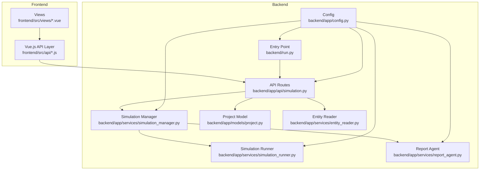
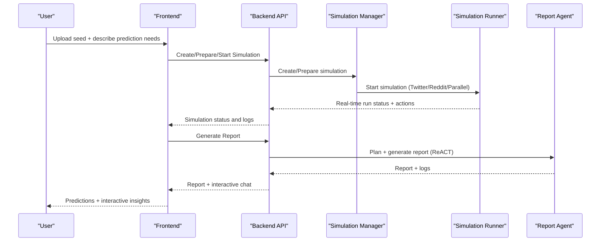
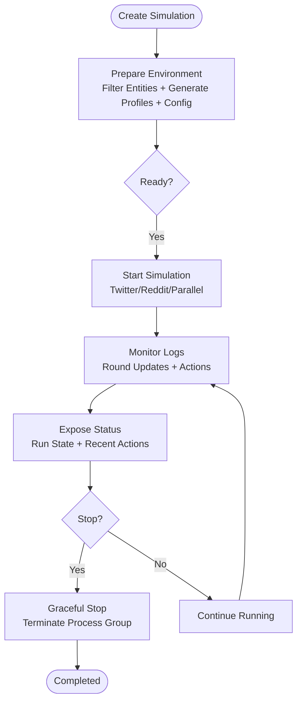
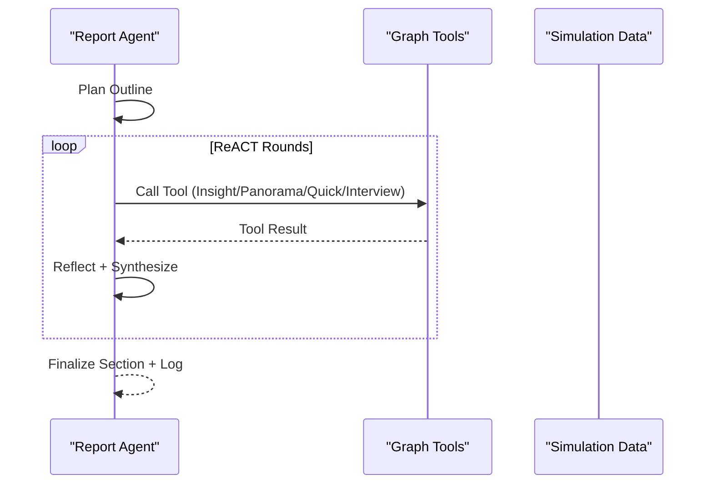
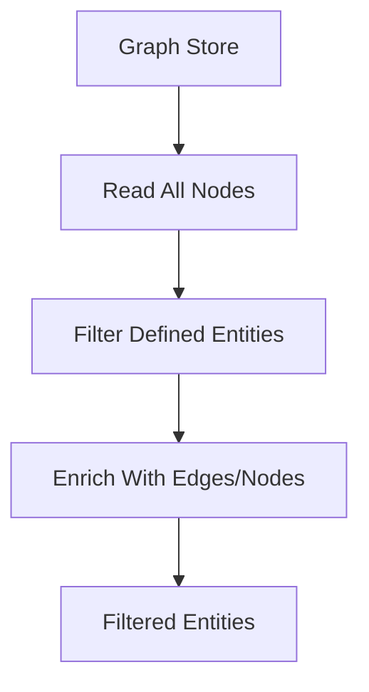
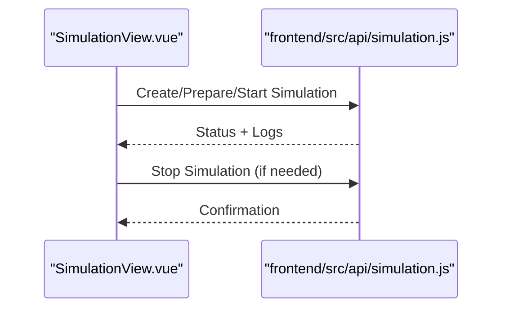
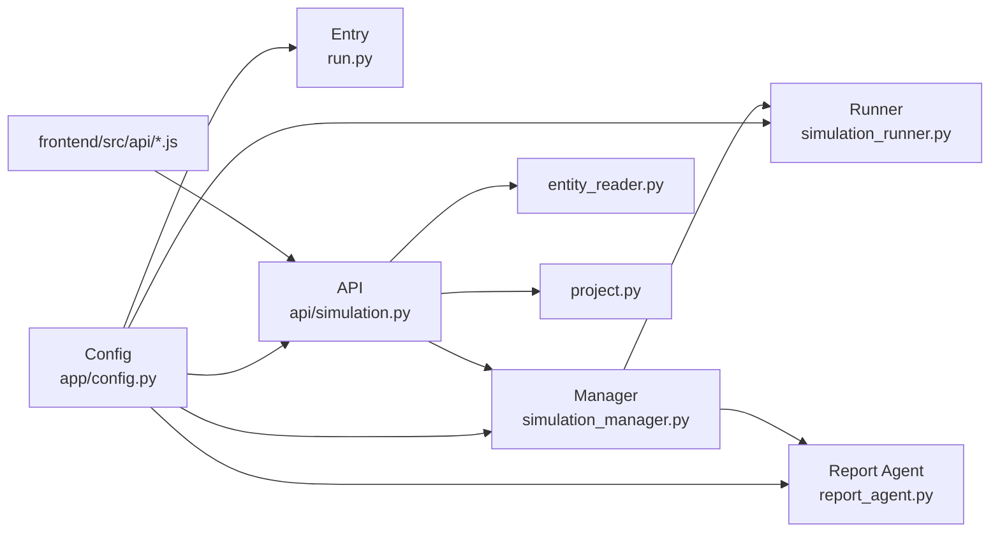

# Project Overview

<cite>
**Referenced Files in This Document**
- [README-EN.md](file://README-EN.md)
- [README.md](file://README.md)
- [run.py](file://backend/run.py)
- [config.py](file://backend/app/config.py)
- [simulation.py](file://backend/app/api/simulation.py)
- [simulation_manager.py](file://backend/app/services/simulation_manager.py)
- [simulation_runner.py](file://backend/app/services/simulation_runner.py)
- [report_agent.py](file://backend/app/services/report_agent.py)
- [project.py](file://backend/app/models/project.py)
- [entity_reader.py](file://backend/app/services/entity_reader.py)
- [simulation.js](file://frontend/src/api/simulation.js)
- [report.js](file://frontend/src/api/report.js)
- [InteractionView.vue](file://frontend/src/views/InteractionView.vue)
- [SimulationView.vue](file://frontend/src/views/SimulationView.vue)
</cite>

## Table of Contents
1. [Introduction](#introduction)
2. [Project Structure](#project-structure)
3. [Core Components](#core-components)
4. [Architecture Overview](#architecture-overview)
5. [Detailed Component Analysis](#detailed-component-analysis)
6. [Dependency Analysis](#dependency-analysis)
7. [Performance Considerations](#performance-considerations)
8. [Troubleshooting Guide](#troubleshooting-guide)
9. [Conclusion](#conclusion)

## Introduction
Parallel World is a next-generation AI prediction engine powered by multi-agent simulation. It transforms real-world seed information (news, policy drafts, financial signals) into a high-fidelity parallel digital world, where thousands of agents with independent personalities, long-term memory, and behavioral logic interact and evolve. Users can dynamically inject variables from a “God’s-eye view” to forecast future trajectories, enabling zero-risk policy testing and creative exploration. The project’s mission spans macro-level decision-making and micro-level creativity, offering a universal swarm intelligence engine that predicts anything.

Key highlights:
- Collective intelligence mirror that maps reality and captures group emergence from individual interactions.
- Zero-risk environment for testing policies and public relations.
- Creative sandbox for exploring alternate outcomes and storytelling.
- Built on the OASIS multi-agent simulation platform and supported by Shanda Group.

**Section sources**
- [README-EN.md:15-29](file://README-EN.md#L15-L29)
- [README.md:15-29](file://README.md#L15-L29)

## Project Structure
The project comprises:
- Backend (Python/FastAPI): orchestration, simulation lifecycle, report generation, and graph integration.
- Frontend (Vue.js): guided workflow, real-time monitoring, and interactive exploration.
- Shared configuration and environment variables for LLM, database, and simulation parameters.
- Docker and Docker Compose for containerized deployment.

**Diagram sources**
- [run.py:25-46](file://backend/run.py#L25-L46)
- [config.py:20-76](file://backend/app/config.py#L20-L76)
- [simulation.py:146-219](file://backend/app/api/simulation.py#L146-L219)
- [simulation_manager.py:114-137](file://backend/app/services/simulation_manager.py#L114-L137)
- [simulation_runner.py:195-225](file://backend/app/services/simulation_runner.py#L195-L225)
- [report_agent.py:469-589](file://backend/app/services/report_agent.py#L469-L589)
- [project.py:101-120](file://backend/app/models/project.py#L101-L120)
- [entity_reader.py:69-81](file://backend/app/services/entity_reader.py#L69-L81)

**Section sources**
- [README-EN.md:70-77](file://README-EN.md#L70-L77)
- [README.md:70-77](file://README.md#L70-L77)

## Core Components
- Simulation Lifecycle: create, prepare, run, monitor, and stop simulations.
- Multi-Agent Environments: Twitter and Reddit platforms orchestrated via OASIS.
- Report Generation: ReACT-driven report agent with tool-rich introspection.
- Graph Integration: entity reading, filtering, and contextual enrichment.
- Project Context: persistent project state and metadata.
- Frontend Workflow: guided steps for graph building, environment setup, simulation, report, and interaction.

**Section sources**
- [simulation.py:146-219](file://backend/app/api/simulation.py#L146-L219)
- [simulation_manager.py:114-137](file://backend/app/services/simulation_manager.py#L114-L137)
- [simulation_runner.py:195-225](file://backend/app/services/simulation_runner.py#L195-L225)
- [report_agent.py:469-589](file://backend/app/services/report_agent.py#L469-L589)
- [entity_reader.py:128-244](file://backend/app/services/entity_reader.py#L128-L244)
- [project.py:26-99](file://backend/app/models/project.py#L26-L99)

## Architecture Overview
The system operates as a pipeline:
1. Knowledge Graph Construction: seed ingestion and GraphRAG.
2. Environment Setup: entity extraction, persona generation, and configuration.
3. Simulation: dual-platform parallel runs with dynamic temporal updates.
4. Report Generation: ReACT-based report with tool-assisted insights.
5. Deep Interaction: chat with agents and Report Agent.

**Diagram sources**
- [simulation.py:146-219](file://backend/app/api/simulation.py#L146-L219)
- [simulation_manager.py:229-457](file://backend/app/services/simulation_manager.py#L229-L457)
- [simulation_runner.py:312-475](file://backend/app/services/simulation_runner.py#L312-L475)
- [report_agent.py:469-589](file://backend/app/services/report_agent.py#L469-L589)

## Detailed Component Analysis

### Simulation Lifecycle and Orchestration
- Creation: assigns a simulation ID and links to a project/graph.
- Preparation: filters entities, generates agent profiles, and configures simulation parameters.
- Execution: runs OASIS simulations in background, monitors logs, and updates run state.
- Monitoring: exposes real-time status, recent actions, and platform-specific metrics.
- Termination: supports graceful stop and process-group termination.

**Diagram sources**
- [simulation.py:146-219](file://backend/app/api/simulation.py#L146-L219)
- [simulation_manager.py:229-457](file://backend/app/services/simulation_manager.py#L229-L457)
- [simulation_runner.py:312-577](file://backend/app/services/simulation_runner.py#L312-L577)

**Section sources**
- [simulation.py:146-219](file://backend/app/api/simulation.py#L146-L219)
- [simulation_manager.py:229-457](file://backend/app/services/simulation_manager.py#L229-L457)
- [simulation_runner.py:312-577](file://backend/app/services/simulation_runner.py#L312-L577)

### Report Agent and ReACT Reasoning
- Planning: outlines report structure based on simulation requirements and graph context.
- Generation: section-by-section synthesis using ReACT loops with tool calls.
- Tools: insight retrieval, panorama search, quick search, and agent interviews.
- Logging: detailed JSONL and console logs for reproducibility and debugging.

**Diagram sources**
- [report_agent.py:469-589](file://backend/app/services/report_agent.py#L469-L589)
- [report_agent.py:590-792](file://backend/app/services/report_agent.py#L590-L792)

**Section sources**
- [report_agent.py:469-589](file://backend/app/services/report_agent.py#L469-L589)
- [report_agent.py:590-792](file://backend/app/services/report_agent.py#L590-L792)

### Graph Integration and Entity Reading
- Reads nodes/edges from the knowledge graph.
- Filters entities by predefined types and enriches with related edges/nodes.
- Supports targeted retrieval for simulation preparation and report tooling.

**Diagram sources**
- [entity_reader.py:128-244](file://backend/app/services/entity_reader.py#L128-L244)

**Section sources**
- [entity_reader.py:128-244](file://backend/app/services/entity_reader.py#L128-L244)

### Frontend Workflow and Interaction
- Step 2 (Environment Setup): loads project and graph, prepares simulation.
- Step 3 (Simulation Run): starts and monitors simulation with real-time logs.
- Step 5 (Interaction): explores report, chats with Report Agent, and inspects graph.

**Diagram sources**
- [SimulationView.vue:137-178](file://frontend/src/views/SimulationView.vue#L137-L178)
- [simulation.js:7-85](file://frontend/src/api/simulation.js#L7-L85)

**Section sources**
- [SimulationView.vue:137-178](file://frontend/src/views/SimulationView.vue#L137-L178)
- [InteractionView.vue:74-127](file://frontend/src/views/InteractionView.vue#L74-L127)
- [simulation.js:7-85](file://frontend/src/api/simulation.js#L7-L85)
- [report.js:7-51](file://frontend/src/api/report.js#L7-L51)

## Dependency Analysis
- Backend entry point loads configuration and starts the Flask app.
- Simulation APIs depend on the Simulation Manager, which coordinates Runner and Report Agent.
- Frontend communicates with backend via typed API modules for simulation and report operations.
- Configuration centralizes LLM, database, and simulation parameters.

**Diagram sources**
- [run.py:25-46](file://backend/run.py#L25-L46)
- [config.py:20-76](file://backend/app/config.py#L20-L76)
- [simulation.py:146-219](file://backend/app/api/simulation.py#L146-L219)
- [simulation_manager.py:114-137](file://backend/app/services/simulation_manager.py#L114-L137)
- [simulation_runner.py:195-225](file://backend/app/services/simulation_runner.py#L195-L225)
- [report_agent.py:469-589](file://backend/app/services/report_agent.py#L469-L589)
- [entity_reader.py:69-81](file://backend/app/services/entity_reader.py#L69-L81)
- [project.py:101-120](file://backend/app/models/project.py#L101-L120)

**Section sources**
- [run.py:25-46](file://backend/run.py#L25-L46)
- [config.py:20-76](file://backend/app/config.py#L20-L76)

## Performance Considerations
- Asynchronous preparation and simulation reduce latency and improve throughput.
- Real-time log parsing and incremental updates minimize UI blocking.
- Process-group termination ensures clean shutdown of simulation environments.
- Configurable chunk sizes and parallel profile generation balance accuracy and cost.

[No sources needed since this section provides general guidance]

## Troubleshooting Guide
Common issues and remedies:
- Configuration errors: validate environment variables for LLM and database; the backend checks and reports missing keys.
- Simulation not ready: ensure preparation completes and status is ready before starting.
- Process termination: use graceful stop and fallback to force stop if needed.
- Frontend retries: API wrappers include retry logic for transient failures.

**Section sources**
- [run.py:27-34](file://backend/run.py#L27-L34)
- [simulation.py:340-379](file://backend/app/api/simulation.py#L340-L379)
- [simulation_runner.py:772-800](file://backend/app/services/simulation_runner.py#L772-L800)
- [simulation.js:7-9](file://frontend/src/api/simulation.js#L7-L9)

## Conclusion
Parallel World enables a new paradigm of prediction and exploration by constructing high-fidelity parallel worlds with thousands of interacting agents. Its “God’s-eye view” allows users to dynamically inject variables and forecast futures, supporting zero-risk policy testing and creative simulation. Backed by OASIS and strategic support from Shanda Group, the platform combines robust engineering with a clear vision to map reality through collective intelligence.

[No sources needed since this section summarizes without analyzing specific files]