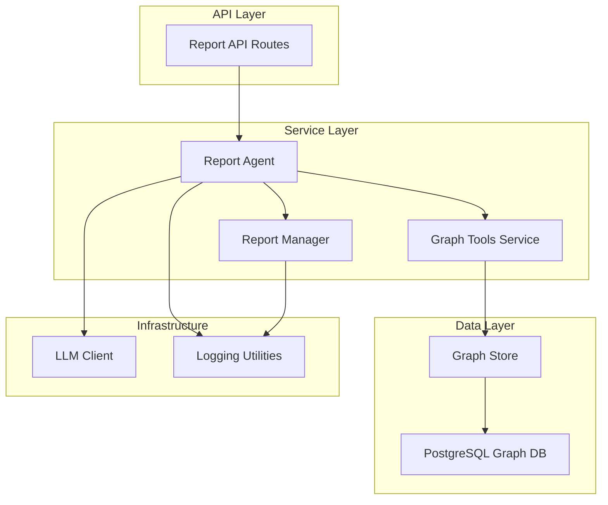
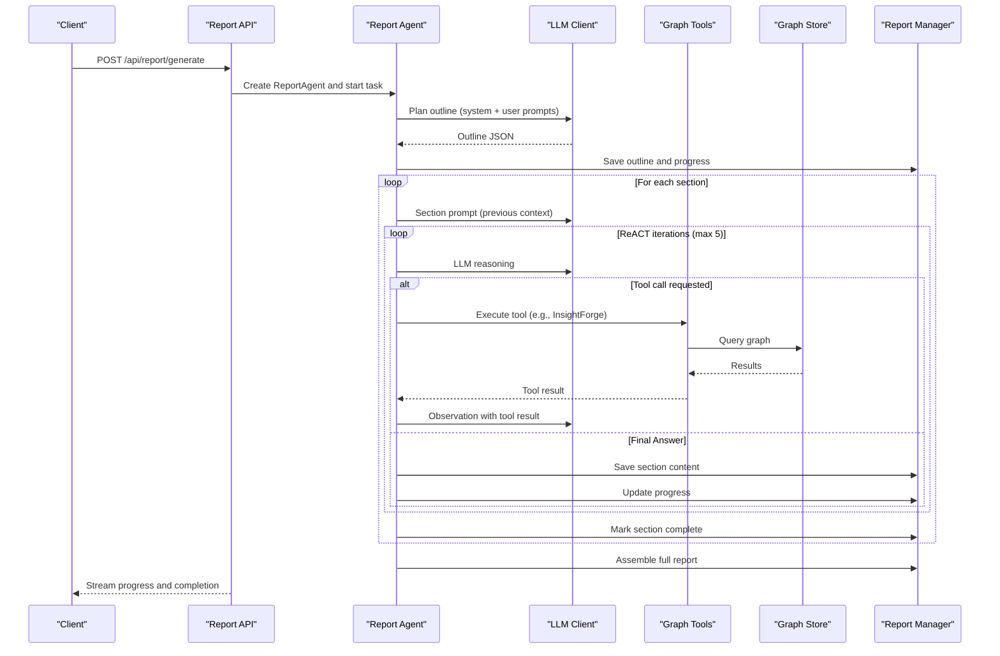
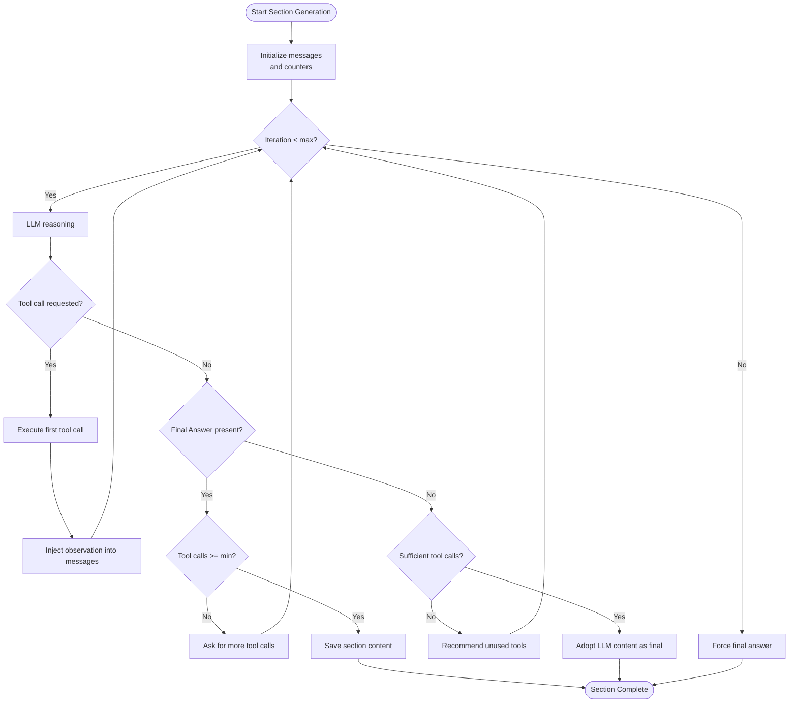
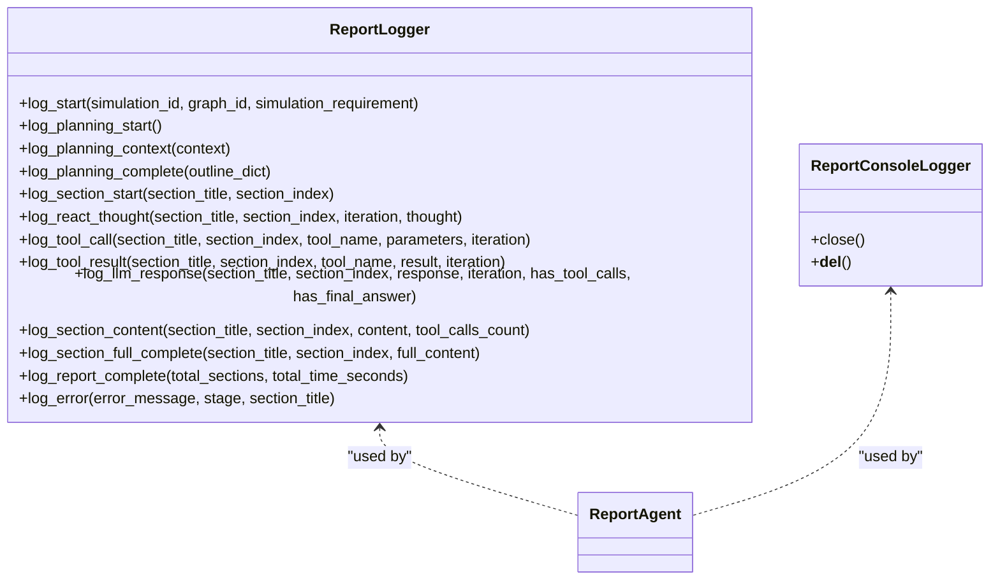
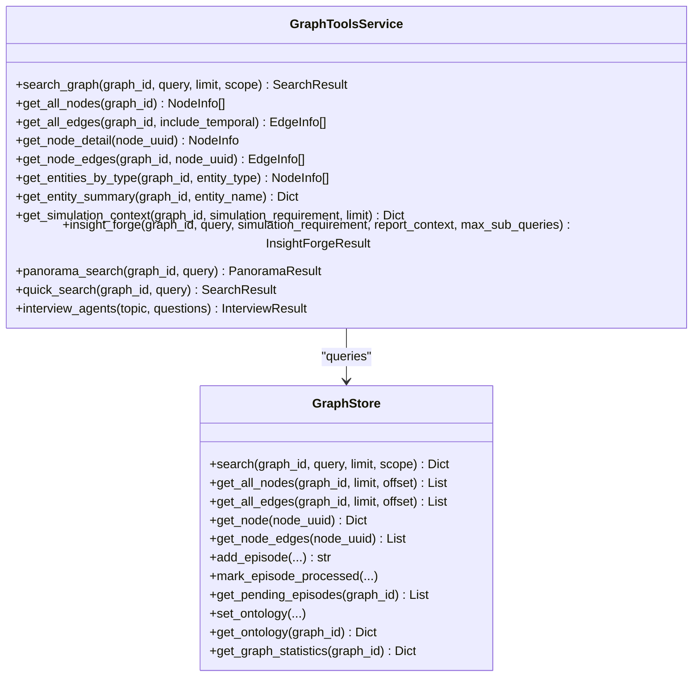
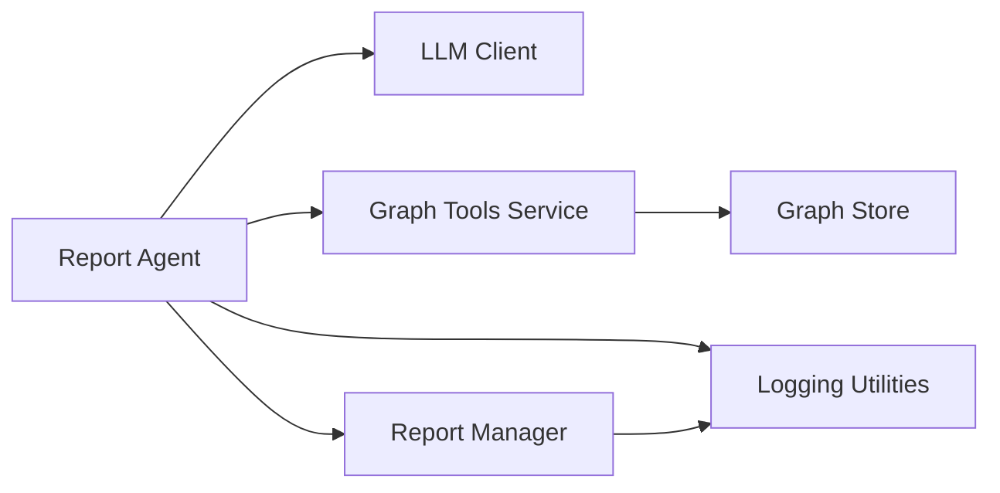

# ReACT Pattern Implementation

<cite>
**Referenced Files in This Document**
- [report_agent.py](file://backend/app/services/report_agent.py)
- [graph_tools.py](file://backend/app/services/graph_tools.py)
- [graph_store.py](file://backend/app/services/graph_store.py)
- [llm_client.py](file://backend/app/utils/llm_client.py)
- [logger.py](file://backend/app/utils/logger.py)
- [report.py](file://backend/app/api/report.py)
- [config.py](file://backend/app/config.py)
</cite>

## Table of Contents
1. [Introduction](#introduction)
2. [Project Structure](#project-structure)
3. [Core Components](#core-components)
4. [Architecture Overview](#architecture-overview)
5. [Detailed Component Analysis](#detailed-component-analysis)
6. [Dependency Analysis](#dependency-analysis)
7. [Performance Considerations](#performance-considerations)
8. [Troubleshooting Guide](#troubleshooting-guide)
9. [Conclusion](#conclusion)

## Introduction
This document explains the ReACT (Reasoning and Acting) pattern implementation in the Report Agent. The ReACT methodology enables the AI agent to perform multi-step reasoning and decision-making by iteratively observing information, reasoning about what to learn next, acting by calling retrieval tools, and reflecting on progress toward report objectives. The implementation includes:
- Thought-process logging that captures each ReACT iteration’s observation, action, and reflection
- A ReACT loop that gathers information, analyzes results, and refines conclusions
- Integration with tool-calling mechanisms to retrieve simulation data
- A reflection phase that evaluates progress and adjusts strategy

## Project Structure
The ReACT implementation spans several modules:
- Report Agent orchestrates planning, section generation, and logging
- Graph Tools provide retrieval capabilities (deep insight, panorama, quick search, interviews)
- Graph Store persists and queries the simulation graph
- LLM Client handles model interactions
- API routes expose report generation and progress endpoints
- Logging utilities capture structured and console logs

**Diagram sources**
- [report_agent.py:1532-1764](file://backend/app/services/report_agent.py#L1532-L1764)
- [graph_tools.py:398-748](file://backend/app/services/graph_tools.py#L398-L748)
- [graph_store.py:21-375](file://backend/app/services/graph_store.py#L21-L375)
- [llm_client.py:14-104](file://backend/app/utils/llm_client.py#L14-L104)
- [report.py:24-196](file://backend/app/api/report.py#L24-L196)

**Section sources**
- [report_agent.py:1532-1764](file://backend/app/services/report_agent.py#L1532-L1764)
- [graph_tools.py:398-748](file://backend/app/services/graph_tools.py#L398-L748)
- [graph_store.py:21-375](file://backend/app/services/graph_store.py#L21-L375)
- [llm_client.py:14-104](file://backend/app/utils/llm_client.py#L14-L104)
- [report.py:24-196](file://backend/app/api/report.py#L24-L196)

## Core Components
- Report Agent: Implements the ReACT loop, manages tool calls, and logs detailed execution traces
- Graph Tools Service: Provides four retrieval tools (InsightForge, Panorama, QuickSearch, Interview) and graph utilities
- Graph Store: Accesses the PostgreSQL graph database for nodes, edges, and statistics
- LLM Client: Wraps OpenAI-compatible API calls for ReACT reasoning and tool-call parsing
- Report Manager: Persists and streams report artifacts, outlines, progress, and logs
- Logging: Structured JSONL logging for agent actions and console logging for runtime info

**Section sources**
- [report_agent.py:873-907](file://backend/app/services/report_agent.py#L873-L907)
- [graph_tools.py:398-748](file://backend/app/services/graph_tools.py#L398-L748)
- [graph_store.py:21-375](file://backend/app/services/graph_store.py#L21-L375)
- [llm_client.py:14-104](file://backend/app/utils/llm_client.py#L14-L104)
- [report.py:564-748](file://backend/app/api/report.py#L564-L748)

## Architecture Overview
The ReACT pipeline integrates LLM reasoning, tool execution, and logging to produce a structured report. The flow includes:
- Planning: Outline structure determined by the LLM
- Generation: Each section uses ReACT to gather and synthesize information
- Reflection: Iterative refinement guided by tool feedback and progress checks
- Persistence: Section-by-section output and streaming progress

**Diagram sources**
- [report_agent.py:1219-1530](file://backend/app/services/report_agent.py#L1219-L1530)
- [report_agent.py:1532-1764](file://backend/app/services/report_agent.py#L1532-L1764)
- [graph_tools.py:751-908](file://backend/app/services/graph_tools.py#L751-L908)
- [graph_store.py:259-316](file://backend/app/services/graph_store.py#L259-L316)
- [report.py:24-196](file://backend/app/api/report.py#L24-L196)

## Detailed Component Analysis

### ReACT Loop Mechanics
The ReACT loop coordinates four phases per iteration:
- Thought: The LLM decides whether to call a tool or finalize content
- Action: Executes the first tool call and records parameters
- Observation: Injects tool results into the conversation
- Reflection: Evaluates sufficiency of tool calls and adjusts strategy

Key behaviors:
- Enforces single-tool-per-response rule and rejects combined tool-call/Final Answer outputs
- Tracks tool usage and enforces minimum tool calls per section
- Logs each iteration’s thought, tool call, result, and LLM response
- Forces completion if maximum iterations are reached

**Diagram sources**
- [report_agent.py:1284-1530](file://backend/app/services/report_agent.py#L1284-L1530)

**Section sources**
- [report_agent.py:1219-1530](file://backend/app/services/report_agent.py#L1219-L1530)

### Thought-Process Logging System
The logging system captures every ReACT iteration with:
- Timestamps and elapsed time
- Action types: react_thought, tool_call, tool_result, llm_response
- Stage tracking: planning, generating, completed
- Section context: title and index
- Full content for tool results and LLM responses (no truncation)

The structured logs enable real-time monitoring and post-mortem analysis of agent behavior.

**Diagram sources**
- [report_agent.py:35-304](file://backend/app/services/report_agent.py#L35-L304)
- [report_agent.py:306-386](file://backend/app/services/report_agent.py#L306-L386)

**Section sources**
- [report_agent.py:35-304](file://backend/app/services/report_agent.py#L35-L304)
- [report_agent.py:306-386](file://backend/app/services/report_agent.py#L306-L386)

### Tool Integration and Observations
The agent integrates four retrieval tools:
- InsightForge: Multi-dimensional deep insight retrieval with sub-question decomposition
- Panorama: Broad search capturing active and historical facts
- QuickSearch: Lightweight verification and targeted retrieval
- Interview: Real-agent interviews across platforms

Observations are formatted and injected back into the LLM conversation to guide the next reasoning step.

**Diagram sources**
- [graph_tools.py:398-748](file://backend/app/services/graph_tools.py#L398-L748)
- [graph_store.py:259-350](file://backend/app/services/graph_store.py#L259-L350)

**Section sources**
- [graph_tools.py:398-748](file://backend/app/services/graph_tools.py#L398-L748)
- [graph_store.py:259-350](file://backend/app/services/graph_store.py#L259-L350)

### Reflection Phase and Strategy Adjustment
The reflection phase occurs implicitly through:
- Tool usage enforcement: minimum tool calls per section
- Unused tool hints: encourages diversity in tool selection
- Conflict resolution: handles LLM output formatting issues
- Forced completion: ensures progress even if the agent stalls

These mechanisms collectively evaluate progress toward report objectives and adjust strategy to gather richer, more balanced insights.

**Section sources**
- [report_agent.py:1327-1530](file://backend/app/services/report_agent.py#L1327-L1530)

### Execution Traces and Examples
Example ReACT execution traces (conceptual):
- Iteration 1
  - Thought: “Need to understand event trajectory and stakeholder reactions.”
  - Action: Call Panorama to get active and historical facts.
  - Observation: Retrieved timeline of events and stakeholder positions.
  - Reflection: “Need deeper entity insights; call InsightForge.”
- Iteration 2
  - Thought: “Need core entities and relationship chains.”
  - Action: Call InsightForge with sub-questions.
  - Observation: Retrieved entity profiles and relationship chains.
  - Reflection: “Need stakeholder perspectives; call Interview.”
- Iteration 3
  - Thought: “Need first-hand quotes and comparative perspectives.”
  - Action: Call Interview with curated questions.
  - Observation: Interview transcripts and key quotes.
  - Reflection: “Sufficient evidence gathered; finalize content.”

These traces are captured in the structured logs for each section, enabling real-time monitoring and post-run analysis.

**Section sources**
- [report_agent.py:1364-1467](file://backend/app/services/report_agent.py#L1364-L1467)
- [report_agent.py:1582-1587](file://backend/app/services/report_agent.py#L1582-L1587)

## Dependency Analysis
The ReACT implementation depends on:
- LLM Client for reasoning and tool-call parsing
- Graph Tools Service for retrieval operations
- Graph Store for graph queries and statistics
- Report Manager for persistence and progress streaming
- Logging utilities for structured and console logs

**Diagram sources**
- [report_agent.py:883-907](file://backend/app/services/report_agent.py#L883-L907)
- [llm_client.py:14-104](file://backend/app/utils/llm_client.py#L14-L104)
- [graph_tools.py:398-422](file://backend/app/services/graph_tools.py#L398-L422)
- [graph_store.py:21-375](file://backend/app/services/graph_store.py#L21-L375)
- [report.py:564-748](file://backend/app/api/report.py#L564-L748)

**Section sources**
- [report_agent.py:883-907](file://backend/app/services/report_agent.py#L883-L907)
- [llm_client.py:14-104](file://backend/app/utils/llm_client.py#L14-L104)
- [graph_tools.py:398-422](file://backend/app/services/graph_tools.py#L398-L422)
- [graph_store.py:21-375](file://backend/app/services/graph_store.py#L21-L375)
- [report.py:564-748](file://backend/app/api/report.py#L564-L748)

## Performance Considerations
- Token limits: Responses are constrained to prevent excessive token usage; consider truncating long tool results when necessary
- Tool quotas: Maximum tool calls per section and per chat prevent runaway resource consumption
- Streaming progress: Section-by-section output reduces latency and improves user experience
- Logging overhead: Structured logs are appended incrementally; ensure disk I/O does not bottleneck generation

[No sources needed since this section provides general guidance]

## Troubleshooting Guide
Common issues and resolutions:
- LLM returns None: The agent retries once and forces completion if needed
- Combined tool call and Final Answer: The agent requests a corrected response or truncates to first tool call
- Tool call limit exceeded: The agent informs the LLM and requires a Final Answer
- Missing tool results: Verify tool parameters and graph connectivity
- Logging failures: Confirm log directory permissions and disk space

**Section sources**
- [report_agent.py:1309-1318](file://backend/app/services/report_agent.py#L1309-L1318)
- [report_agent.py:1327-1362](file://backend/app/services/report_agent.py#L1327-L1362)
- [report_agent.py:1407-1416](file://backend/app/services/report_agent.py#L1407-L1416)
- [logger.py:26-88](file://backend/app/utils/logger.py#L26-L88)

## Conclusion
The ReACT pattern implementation in the Report Agent provides a robust, iterative framework for multi-step reasoning and decision-making. By integrating structured logging, diverse retrieval tools, and enforced reflection, the agent systematically gathers evidence, synthesizes insights, and produces high-quality, report-ready content. The modular design supports scalability, observability, and continuous improvement.