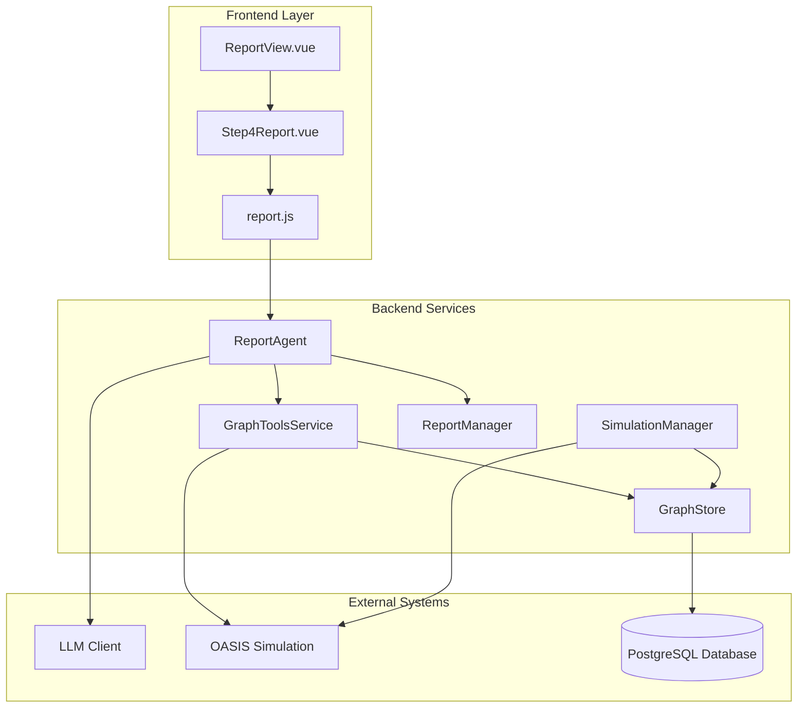
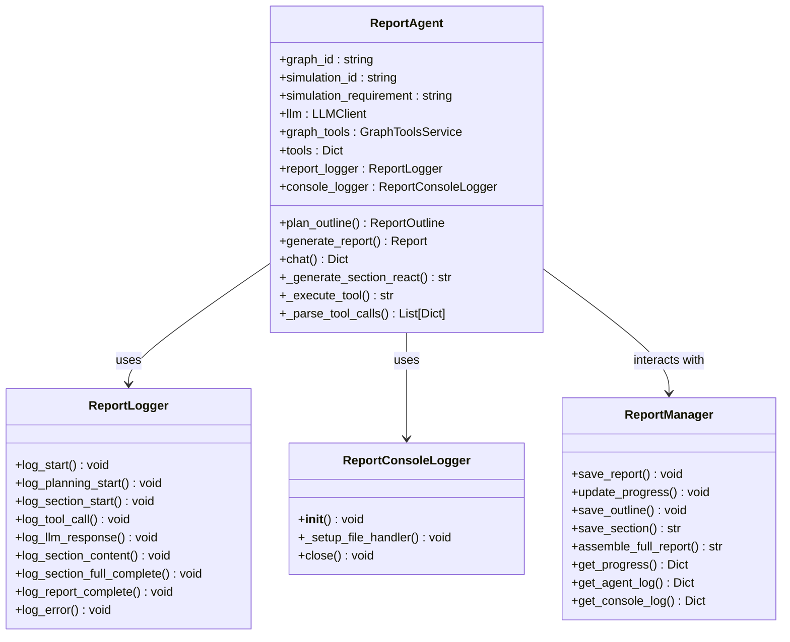
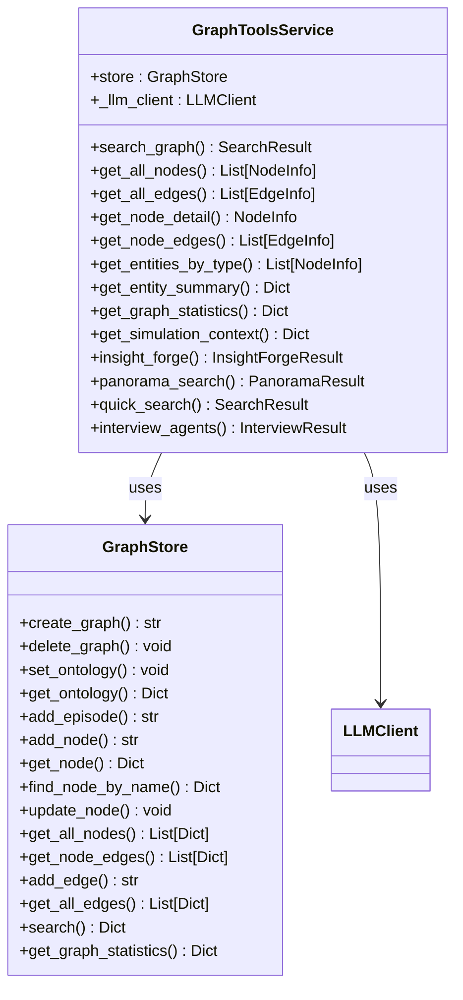
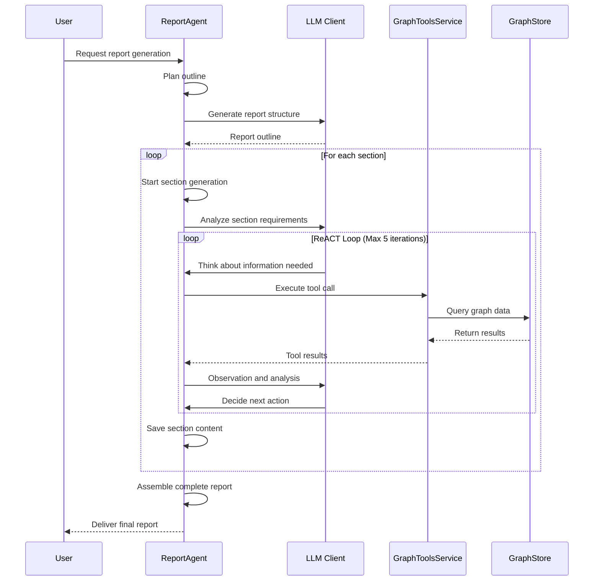
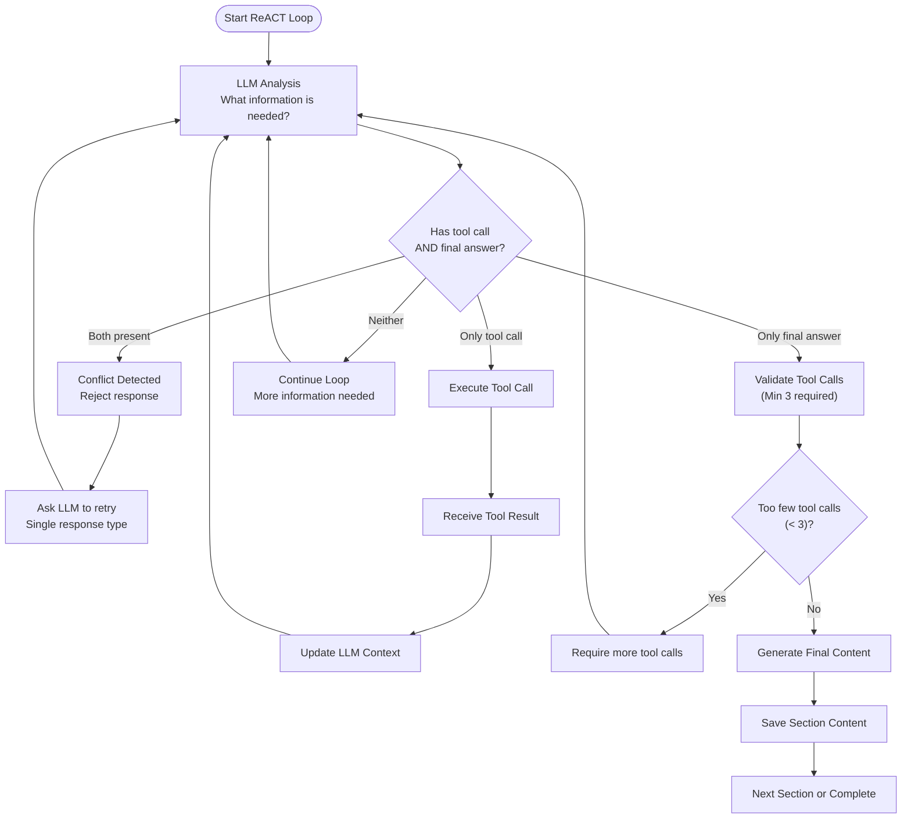
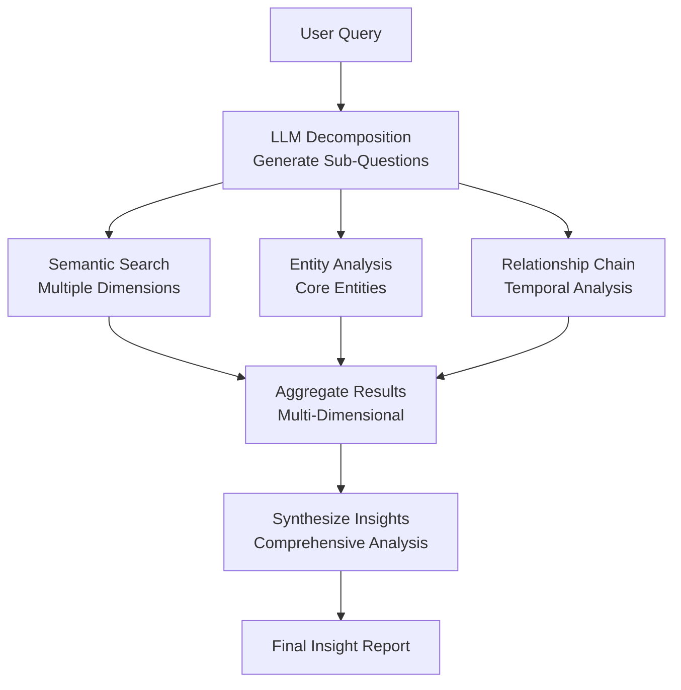
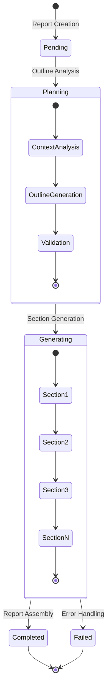
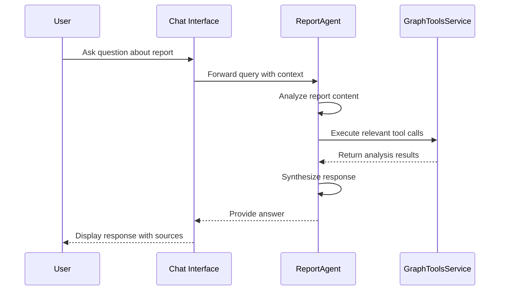

# Report Generation System

<cite>
**Referenced Files in This Document**
- [report_agent.py](file://backend/app/services/report_agent.py)
- [graph_tools.py](file://backend/app/services/graph_tools.py)
- [report.py](file://backend/app/api/report.py)
- [graph_store.py](file://backend/app/services/graph_store.py)
- [simulation_manager.py](file://backend/app/services/simulation_manager.py)
- [project.py](file://backend/app/models/project.py)
- [config.py](file://backend/app/config.py)
- [llm_client.py](file://backend/app/utils/llm_client.py)
- [ReportView.vue](file://frontend/src/views/ReportView.vue)
- [Step4Report.vue](file://frontend/src/components/Step4Report.vue)
- [report.js](file://frontend/src/api/report.js)
</cite>

## Table of Contents
1. [Introduction](#introduction)
2. [System Architecture](#system-architecture)
3. [Core Components](#core-components)
4. [ReACT Pattern Implementation](#react-pattern-implementation)
5. [Tool Integration System](#tool-integration-system)
6. [Report Generation Workflow](#report-generation-workflow)
7. [AI-Powered Analysis Features](#ai-powered-analysis-features)
8. [User Interaction and Review](#user-interaction-and-review)
9. [Customization Options](#customization-options)
10. [Performance Considerations](#performance-considerations)
11. [Troubleshooting Guide](#troubleshooting-guide)
12. [Conclusion](#conclusion)

## Introduction

The Report Generation System is an AI-powered platform that creates comprehensive simulation-based prediction reports using advanced reasoning patterns and deep graph querying capabilities. Built on the ReACT (Reasoning and Acting) pattern, the system orchestrates complex multi-step analysis workflows that combine artificial intelligence with real-time data exploration of simulated social environments.

This system serves as a sophisticated analytical tool that transforms raw simulation data into actionable insights, providing users with detailed reports that predict future social trends, population behaviors, and emerging risks based on controlled simulation experiments. The platform integrates seamlessly with the OASIS simulation environment, offering both automated report generation and interactive analysis capabilities.

## System Architecture

The Report Generation System follows a modular architecture that separates concerns between AI reasoning, data querying, simulation management, and user interface components.

**Diagram sources**
- [report_agent.py:864-917](file://backend/app/services/report_agent.py#L864-L917)
- [graph_tools.py:398-430](file://backend/app/services/graph_tools.py#L398-L430)
- [report.py:24-196](file://backend/app/api/report.py#L24-L196)

The architecture enables real-time collaboration between AI reasoning engines and dynamic data exploration, providing users with transparent visibility into the entire analysis process through detailed logging and progress tracking.

**Section sources**
- [report_agent.py:864-917](file://backend/app/services/report_agent.py#L864-L917)
- [graph_tools.py:398-430](file://backend/app/services/graph_tools.py#L398-L430)
- [report.py:24-196](file://backend/app/api/report.py#L24-L196)

## Core Components

### ReportAgent - Central Intelligence Engine

The ReportAgent serves as the primary orchestrator of the entire report generation process, implementing sophisticated reasoning patterns and managing complex multi-step workflows.

**Diagram sources**
- [report_agent.py:864-917](file://backend/app/services/report_agent.py#L864-L917)
- [report_agent.py:35-304](file://backend/app/services/report_agent.py#L35-L304)
- [report_agent.py:1883-1881](file://backend/app/services/report_agent.py#L1883-L1881)

The ReportAgent implements a sophisticated state management system that tracks progress through distinct phases: planning, generation, and completion, with detailed logging for transparency and debugging.

**Section sources**
- [report_agent.py:864-917](file://backend/app/services/report_agent.py#L864-L917)
- [report_agent.py:35-304](file://backend/app/services/report_agent.py#L35-L304)
- [report_agent.py:1883-1881](file://backend/app/services/report_agent.py#L1883-L1881)

### GraphToolsService - Data Access Layer

The GraphToolsService provides unified access to the underlying graph database and simulation environment, offering specialized tools for different types of data exploration and analysis.

**Diagram sources**
- [graph_tools.py:398-430](file://backend/app/services/graph_tools.py#L398-L430)
- [graph_store.py:21-375](file://backend/app/services/graph_store.py#L21-L375)

The service implements a comprehensive toolkit for graph exploration, combining traditional semantic search with advanced relationship analysis and temporal reasoning capabilities.

**Section sources**
- [graph_tools.py:398-430](file://backend/app/services/graph_tools.py#L398-L430)
- [graph_store.py:21-375](file://backend/app/services/graph_store.py#L21-L375)

## ReACT Pattern Implementation

The Report Generation System implements the ReACT (Reasoning and Acting) pattern to achieve sophisticated multi-step problem-solving capabilities.

**Diagram sources**
- [report_agent.py:1220-1531](file://backend/app/services/report_agent.py#L1220-L1531)
- [report_agent.py:1600-1764](file://backend/app/services/report_agent.py#L1600-L1764)

The ReACT implementation enforces strict constraints on tool usage and content generation, requiring a minimum number of tool calls per section and preventing simultaneous tool calls and final answers in the same response.

**Section sources**
- [report_agent.py:1220-1531](file://backend/app/services/report_agent.py#L1220-L1531)
- [report_agent.py:1600-1764](file://backend/app/services/report_agent.py#L1600-L1764)

### ReACT Loop Mechanics

The ReACT loop operates through a sophisticated validation system that ensures proper reasoning flow and prevents common AI interaction pitfalls.

**Diagram sources**
- [report_agent.py:1327-1531](file://backend/app/services/report_agent.py#L1327-L1531)

**Section sources**
- [report_agent.py:1327-1531](file://backend/app/services/report_agent.py#L1327-L1531)

## Tool Integration System

The system provides four primary tool categories, each designed for specific types of analysis and data exploration.

### Deep Insight Retrieval (InsightForge)

The most sophisticated tool, InsightForge automatically decomposes complex queries into sub-questions and performs multi-dimensional analysis across semantic search, entity insights, and relationship chains.

**Diagram sources**
- [graph_tools.py:751-800](file://backend/app/services/graph_tools.py#L751-L800)

### Panorama Search

Provides broad perspective analysis by retrieving complete information including historical and expired content, essential for understanding temporal evolution of social phenomena.

### Quick Search

Lightweight tool for straightforward information retrieval, optimized for speed and simplicity in routine queries.

### Agent Interview System

Direct interface to the OASIS simulation environment, enabling real-time interviews with simulated agents across Twitter and Reddit platforms to gather authentic perspectives and stakeholder viewpoints.

**Section sources**
- [graph_tools.py:751-800](file://backend/app/services/graph_tools.py#L751-L800)

## Report Generation Workflow

The report generation process follows a structured three-phase approach that ensures comprehensive coverage of all analysis requirements.

**Diagram sources**
- [report_agent.py:1532-1764](file://backend/app/services/report_agent.py#L1532-L1764)

### Phase 1: Planning and Outline Generation

The system begins by analyzing the simulation context and generating an optimal report structure tailored to the specific prediction scenario.

### Phase 2: Section-by-Section Generation

Each report section undergoes independent ReACT processing with dedicated tool usage and content validation.

### Phase 3: Report Assembly and Delivery

Final assembly combines all generated sections into a cohesive, professionally formatted report with consistent styling and navigation.

**Section sources**
- [report_agent.py:1532-1764](file://backend/app/services/report_agent.py#L1532-L1764)

## AI-Powered Analysis Features

### Intelligent Context Understanding

The system leverages advanced LLM capabilities to understand complex simulation requirements and generate appropriate analytical frameworks. The context analysis incorporates graph statistics, entity distributions, and temporal relationships to inform report structure decisions.

### Multi-Perspective Analysis

Through the Agent Interview system, the platform captures authentic stakeholder perspectives from diverse social groups, providing rich qualitative insights that complement quantitative analysis from simulation data.

### Temporal Reasoning

Advanced temporal analysis capabilities enable understanding of how social phenomena evolve over time, distinguishing between current valid states and historical/expired conditions in the simulation environment.

**Section sources**
- [report_agent.py:1136-1219](file://backend/app/services/report_agent.py#L1136-L1219)
- [graph_tools.py:211-279](file://backend/app/services/graph_tools.py#L211-L279)

## User Interaction and Review

The system provides comprehensive interaction capabilities through both automated report generation and live chat functionality.

### Live Chat Interface

Users can engage in real-time conversations with the ReportAgent, asking clarifying questions and requesting additional analysis without interrupting ongoing report generation.

**Diagram sources**
- [report_agent.py:1766-1881](file://backend/app/services/report_agent.py#L1766-L1881)

### Interactive Report Exploration

The frontend provides sophisticated report viewing capabilities with section navigation, timeline visualization, and real-time progress monitoring.

**Section sources**
- [report_agent.py:1766-1881](file://backend/app/services/report_agent.py#L1766-L1881)

## Customization Options

### Report Template Customization

The system supports flexible report structure customization through configurable outline generation that adapts to different analysis domains and stakeholder requirements.

### Analysis Focus Areas

Users can specify different analysis focuses through targeted tool selection and parameter tuning, allowing emphasis on specific aspects of the simulation such as demographic analysis, behavioral patterns, or temporal evolution.

### Output Formatting

Flexible output formatting options enable customization of report presentation, including section organization, emphasis patterns, and citation styles.

**Section sources**
- [report_agent.py:1136-1219](file://backend/app/services/report_agent.py#L1136-L1219)

## Performance Considerations

### Scalable Architecture

The system employs asynchronous processing and streaming output to handle large-scale simulations efficiently, with progress tracking and incremental report delivery.

### Resource Optimization

Intelligent caching mechanisms and tool call optimization minimize computational overhead while maintaining analysis quality and responsiveness.

### Memory Management

Sophisticated memory management ensures efficient handling of large datasets and complex analysis workflows without compromising system stability.

## Troubleshooting Guide

### Common Issues and Solutions

**Report Generation Failures**: Monitor agent logs for detailed error information and tool execution failures. Check LLM API connectivity and database access permissions.

**Tool Execution Problems**: Verify graph database connectivity and ensure simulation environment availability for agent interview requests.

**Performance Issues**: Monitor system resource utilization and consider adjusting tool call limits or report complexity settings.

### Debugging Capabilities

Comprehensive logging infrastructure provides detailed insights into system operations, including agent decision-making processes, tool execution sequences, and error conditions.

**Section sources**
- [report_agent.py:292-304](file://backend/app/services/report_agent.py#L292-L304)

## Conclusion

The Report Generation System represents a sophisticated integration of AI reasoning capabilities, advanced data exploration tools, and user-friendly interaction interfaces. By leveraging the ReACT pattern and comprehensive tool integration, the system delivers actionable insights from complex simulation environments while maintaining transparency and control throughout the analysis process.

The modular architecture ensures scalability and maintainability, while the comprehensive logging and debugging capabilities provide robust operational support. Users benefit from both automated report generation and interactive analysis capabilities, enabling iterative refinement of insights and deeper understanding of simulation outcomes.

This system establishes a foundation for advanced predictive analytics in social simulation contexts, providing valuable tools for researchers, analysts, and decision-makers seeking to understand complex social dynamics and anticipate future trends.