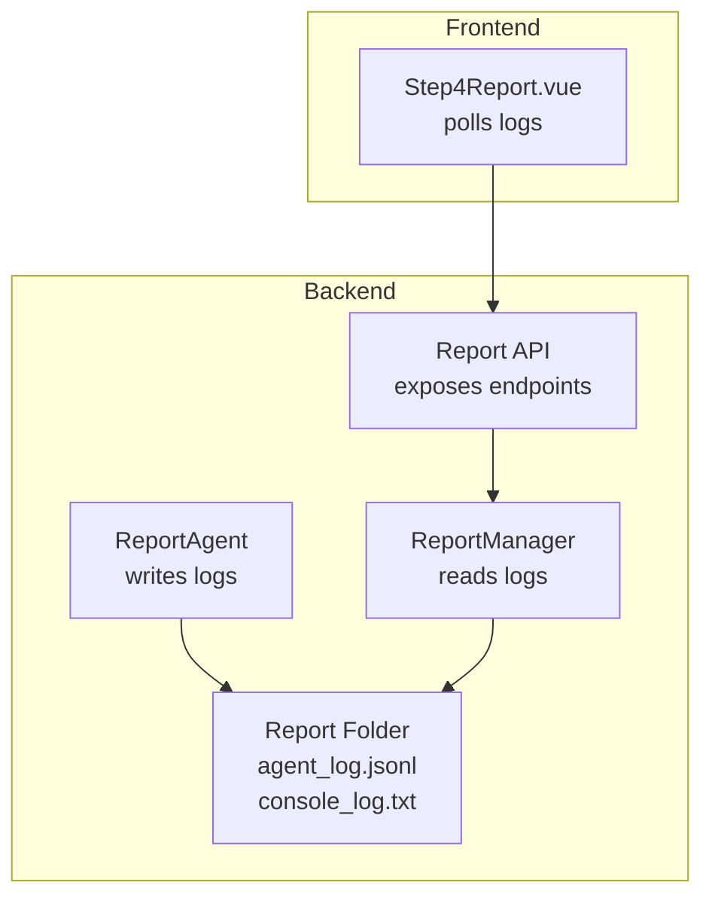
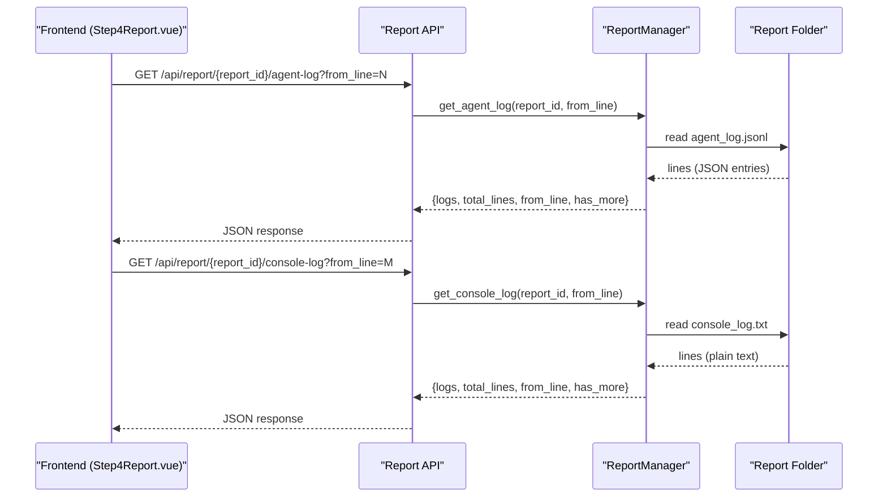
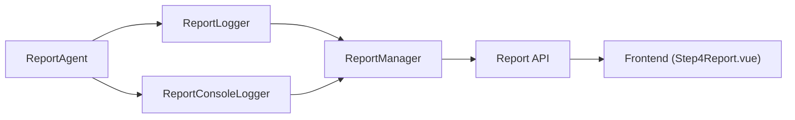

# Report Logging and Monitoring

<cite>
**Referenced Files in This Document**
- [report_agent.py](file://backend/app/services/report_agent.py)
- [report.py](file://backend/app/api/report.py)
- [logger.py](file://backend/app/utils/logger.py)
- [Step4Report.vue](file://frontend/src/components/Step4Report.vue)
</cite>

## Table of Contents
1. [Introduction](#introduction)
2. [Project Structure](#project-structure)
3. [Core Components](#core-components)
4. [Architecture Overview](#architecture-overview)
5. [Detailed Component Analysis](#detailed-component-analysis)
6. [Dependency Analysis](#dependency-analysis)
7. [Performance Considerations](#performance-considerations)
8. [Troubleshooting Guide](#troubleshooting-guide)
9. [Conclusion](#conclusion)

## Introduction
This document describes the report logging and monitoring system that tracks agent activities during report generation. It focuses on:
- The ReportLogger class that writes detailed agent_log.jsonl entries with timestamps, actions, stages, iterations, tool names, and results.
- The ReportConsoleLogger that maintains console_log.txt with human-readable, formatted console logs.
- The logging schema and example entries for each phase of report generation.
- Real-time monitoring capabilities for frontend applications to track progress and receive completion notifications.
- Error logging and recovery mechanisms for debugging and troubleshooting.

## Project Structure
The logging system spans backend services and frontend components:
- Backend services write structured JSON logs (agent_log.jsonl) and plain-text console logs (console_log.txt) to report-specific folders.
- Backend APIs expose endpoints to fetch incremental and full logs.
- Frontend polls these endpoints to render live logs and monitor progress.

**Diagram sources**
- [report_agent.py:35-304](file://backend/app/services/report_agent.py#L35-L304)
- [report.py:787-891](file://backend/app/api/report.py#L787-L891)
- [Step4Report.vue:2127-2183](file://frontend/src/components/Step4Report.vue#L2127-L2183)

**Section sources**
- [report_agent.py:35-304](file://backend/app/services/report_agent.py#L35-L304)
- [report.py:787-891](file://backend/app/api/report.py#L787-L891)
- [logger.py:30-127](file://backend/app/utils/logger.py#L30-L127)
- [Step4Report.vue:2127-2183](file://frontend/src/components/Step4Report.vue#L2127-L2183)

## Core Components
- ReportLogger: Creates and manages agent_log.jsonl with detailed, timestamped entries for each action and stage.
- ReportConsoleLogger: Creates and manages console_log.txt with formatted console-style logs attached to relevant backend loggers.
- ReportManager: Provides read APIs for agent_log.jsonl and console_log.txt, supporting incremental retrieval and streaming.

Key responsibilities:
- Structured logging for debugging, auditing, and analytics.
- Human-readable logs for operational visibility.
- Real-time frontend monitoring via polling endpoints.

**Section sources**
- [report_agent.py:35-304](file://backend/app/services/report_agent.py#L35-L304)
- [report_agent.py:1947-2075](file://backend/app/services/report_agent.py#L1947-L2075)
- [report.py:787-891](file://backend/app/api/report.py#L787-L891)

## Architecture Overview
The system integrates backend logging with frontend monitoring:
- ReportAgent initializes ReportLogger and ReportConsoleLogger.
- Logs are appended to files in the report folder.
- ReportManager exposes endpoints to read logs incrementally or in full.
- Frontend polls endpoints at intervals to update UI.

**Diagram sources**
- [report.py:787-891](file://backend/app/api/report.py#L787-L891)
- [report_agent.py:1957-2075](file://backend/app/services/report_agent.py#L1957-L2075)
- [Step4Report.vue:2127-2183](file://frontend/src/components/Step4Report.vue#L2127-L2183)

## Detailed Component Analysis

### ReportLogger
Purpose:
- Maintain a detailed, append-only JSON Lines log (agent_log.jsonl) for each report.
- Capture lifecycle events, planning, ReACT iterations, tool calls/results, LLM responses, section completions, and errors.

Schema highlights:
- Top-level fields: timestamp, elapsed_seconds, report_id, action, stage, section_title, section_index, details.
- action values include: report_start, planning_start, planning_context, planning_complete, section_start, react_thought, tool_call, tool_result, llm_response, section_content, section_complete, report_complete, error.
- stage values include: pending, planning, generating, completed.
- details contains contextual information (e.g., messages, outlines, tool parameters/results, content lengths).

Example entry types:
- Start: action=report_start, stage=pending, details includes simulation identifiers and requirement.
- Planning: actions for start, context retrieval, and completion with outline.
- Generating: actions for each ReACT round (react_thought), tool calls (tool_call/tool_result), LLM responses (llm_response), and section content updates (section_content).
- Completion: action=section_complete or report_complete with totals and timing.
- Errors: action=error with stage and message.

Real-time monitoring:
- Frontend polls GET /api/report/{report_id}/agent-log with incremental from_line to receive new entries.

Audit trail:
- Full content and results are logged (not truncated) for later inspection and reproducibility.

**Section sources**
- [report_agent.py:35-304](file://backend/app/services/report_agent.py#L35-L304)
- [report_agent.py:66-98](file://backend/app/services/report_agent.py#L66-L98)
- [report_agent.py:99-140](file://backend/app/services/report_agent.py#L99-L140)
- [report_agent.py:142-164](file://backend/app/services/report_agent.py#L142-L164)
- [report_agent.py:166-234](file://backend/app/services/report_agent.py#L166-L234)
- [report_agent.py:236-278](file://backend/app/services/report_agent.py#L236-L278)
- [report_agent.py:280-303](file://backend/app/services/report_agent.py#L280-L303)
- [report.py:787-843](file://backend/app/api/report.py#L787-L843)

### ReportConsoleLogger
Purpose:
- Provide human-readable console-style logs in console_log.txt.
- Attach a file handler to backend loggers to mirror INFO/WARNING/etc. logs to the file.

Behavior:
- Initializes a FileHandler with a concise timestamped format.
- Attaches the handler to specific backend loggers (e.g., report_agent, graph_tools).
- Ensures proper cleanup on close or object destruction.

Frontend consumption:
- Frontend polls GET /api/report/{report_id}/console-log with incremental from_line to render readable progress.

**Section sources**
- [report_agent.py:306-386](file://backend/app/services/report_agent.py#L306-L386)
- [report_agent.py:334-363](file://backend/app/services/report_agent.py#L334-L363)
- [report_agent.py:1957-2001](file://backend/app/services/report_agent.py#L1957-L2001)
- [report.py:848-891](file://backend/app/api/report.py#L848-L891)

### ReportManager
Responsibilities:
- Provide read access to logs:
  - get_agent_log(report_id, from_line) returns parsed JSON entries.
  - get_agent_log_stream(report_id) returns the entire agent log.
  - get_console_log(report_id, from_line) returns plain text lines.
  - get_console_log_stream(report_id) returns the entire console log.
- Manage file paths for agent_log.jsonl and console_log.txt.

Incremental retrieval:
- from_line enables efficient tailing of logs without re-downloading entire files.

**Section sources**
- [report_agent.py:1947-2075](file://backend/app/services/report_agent.py#L1947-L2075)
- [report_agent.py:2018-2077](file://backend/app/services/report_agent.py#L2018-L2077)
- [report_agent.py:1957-2001](file://backend/app/services/report_agent.py#L1957-L2001)
- [report_agent.py:2004-2015](file://backend/app/services/report_agent.py#L2004-L2015)

### Frontend Monitoring (Step4Report.vue)
Frontend polling:
- Periodically calls:
  - getConsoleLog(reportId, consoleLogLine.value) to fetch console_log.txt increments.
  - getAgentLog(reportId, agentLogLine.value) to fetch agent_log.jsonl increments.
- Auto-scrolls to bottom when new logs arrive.
- Starts polling on mount and stops on unmount.

Intervals:
- Agent log polling: ~2 seconds.
- Console log polling: ~1.5 seconds.

Completion detection:
- Frontend listens for action=section_complete or action=report_complete in agent_log.jsonl to mark section completion and overall completion.

**Section sources**
- [Step4Report.vue:2127-2183](file://frontend/src/components/Step4Report.vue#L2127-L2183)

## Dependency Analysis
- ReportLogger depends on:
  - ReportManager’s file path helpers to locate agent_log.jsonl.
  - Backend logging utilities for consistent timestamps and elapsed time.
- ReportConsoleLogger depends on:
  - Python logging module to attach a FileHandler to backend loggers.
- Report API endpoints depend on:
  - ReportManager to read logs from disk.
- Frontend depends on:
  - Report API endpoints for incremental log retrieval.

**Diagram sources**
- [report_agent.py:35-386](file://backend/app/services/report_agent.py#L35-L386)
- [report.py:787-891](file://backend/app/api/report.py#L787-L891)
- [Step4Report.vue:2127-2183](file://frontend/src/components/Step4Report.vue#L2127-L2183)

**Section sources**
- [report_agent.py:35-386](file://backend/app/services/report_agent.py#L35-L386)
- [report.py:787-891](file://backend/app/api/report.py#L787-L891)

## Performance Considerations
- JSON Lines append: Efficient for streaming and incremental reads; minimal overhead for frequent writes.
- Incremental retrieval: Using from_line avoids large payload transfers and reduces bandwidth.
- File handler attachment: Avoids duplicate handlers and ensures logs are mirrored consistently.
- Polling intervals: Balanced to provide near-real-time updates without over-polling.

[No sources needed since this section provides general guidance]

## Troubleshooting Guide
Common scenarios and resolutions:
- Missing logs:
  - Verify report folder exists and agent_log.jsonl/console_log.txt are being written.
  - Confirm ReportManager file paths and permissions.
- Parsing errors:
  - Agent log parsing skips malformed lines; inspect raw file for corruption.
- Incomplete console logs:
  - Ensure ReportConsoleLogger is initialized and handlers are attached to relevant loggers.
- Frontend not updating:
  - Check polling intervals and from_line progression.
  - Confirm API endpoints return success and data.

Error logging and recovery:
- Use action=error entries to capture failures with stage and messages.
- Combine error logs with console_log.txt for contextual clues.
- Monitor completion notifications (action=report_complete) to detect successful runs.

**Section sources**
- [report_agent.py:292-303](file://backend/app/services/report_agent.py#L292-L303)
- [report_agent.py:2054-2056](file://backend/app/services/report_agent.py#L2054-L2056)
- [report_agent.py:334-363](file://backend/app/services/report_agent.py#L334-L363)
- [report.py:793-809](file://backend/app/api/report.py#L793-L809)
- [report.py:875-891](file://backend/app/api/report.py#L875-L891)

## Conclusion
The logging and monitoring system provides:
- A structured, auditable trail via agent_log.jsonl.
- Human-readable progress via console_log.txt.
- Real-time frontend monitoring through incremental API endpoints.
- Clear error logging and completion notifications for robust troubleshooting and operational oversight.