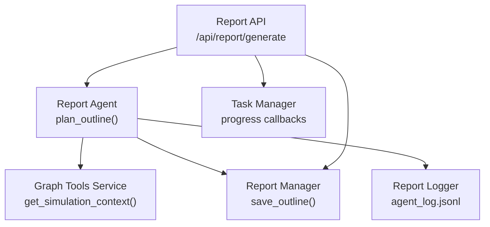
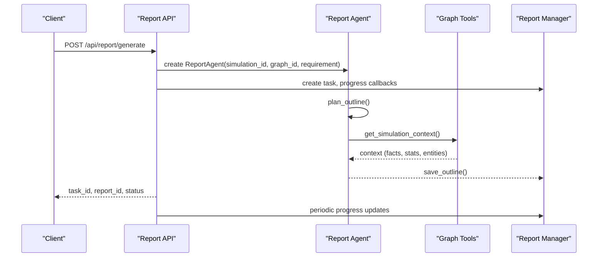
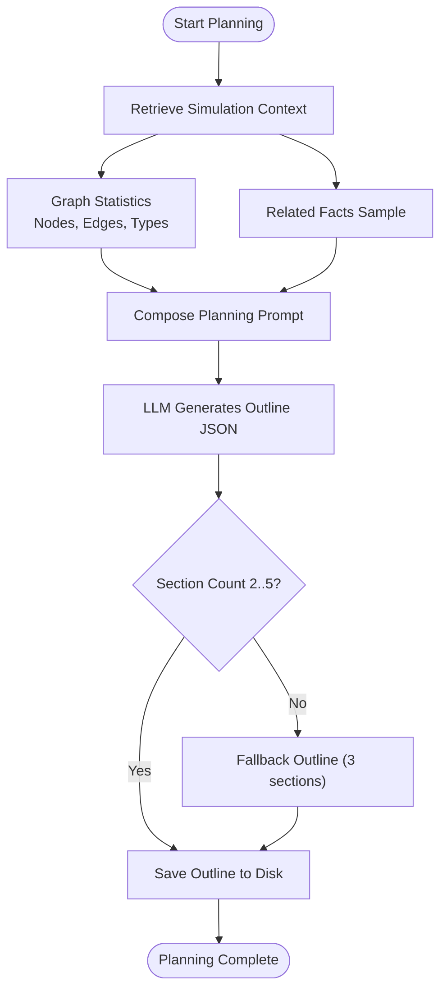
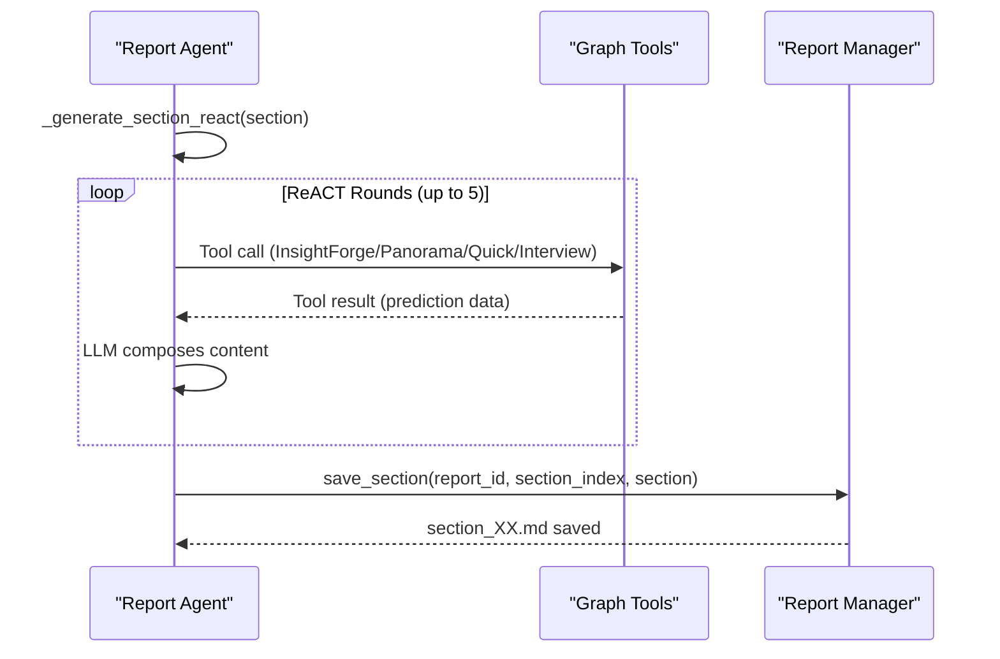
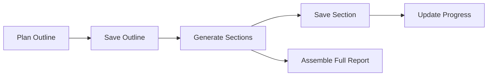
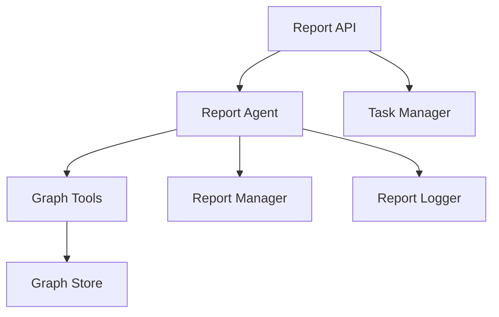

# Report Outline Planning

<cite>
**Referenced Files in This Document**
- [report_agent.py](file://backend/app/services/report_agent.py)
- [graph_tools.py](file://backend/app/services/graph_tools.py)
- [report.py](file://backend/app/api/report.py)
- [simulation_manager.py](file://backend/app/services/simulation_manager.py)
- [project.py](file://backend/app/models/project.py)
- [task.py](file://backend/app/models/task.py)
</cite>

## Table of Contents
1. [Introduction](#introduction)
2. [Project Structure](#project-structure)
3. [Core Components](#core-components)
4. [Architecture Overview](#architecture-overview)
5. [Detailed Component Analysis](#detailed-component-analysis)
6. [Dependency Analysis](#dependency-analysis)
7. [Performance Considerations](#performance-considerations)
8. [Troubleshooting Guide](#troubleshooting-guide)
9. [Conclusion](#conclusion)

## Introduction
This document explains the Report Outline Planning system that generates structured report frameworks for simulation-based future prediction reports. It covers:
- The planning prompt system that analyzes simulation requirements and generates appropriate section structures
- The outline generation process that produces report titles, summaries, and section arrangements based on simulation results
- Constraints and guidelines governing section count limits (minimum 2, maximum 5) and content focus requirements
- Examples of outline planning for different simulation scenarios
- How the planner’s output integrates with the section generation workflow to feed into detailed content creation

## Project Structure
The outline planning system is implemented within the backend services and APIs:
- Report generation orchestration and planning are handled by the Report Agent service
- Retrieval tools for simulation context and prediction data are provided by the Graph Tools service
- The API layer exposes endpoints to trigger report generation and stream progress
- Simulation and project metadata provide the context and requirements for planning

**Diagram sources**
- [report.py:24-187](file://backend/app/api/report.py#L24-L187)
- [report_agent.py:1136-1219](file://backend/app/services/report_agent.py#L1136-L1219)
- [graph_tools.py:696-747](file://backend/app/services/graph_tools.py#L696-L747)
- [task.py:73-100](file://backend/app/models/task.py#L73-L100)

**Section sources**
- [report.py:24-187](file://backend/app/api/report.py#L24-L187)
- [report_agent.py:1136-1219](file://backend/app/services/report_agent.py#L1136-L1219)
- [graph_tools.py:696-747](file://backend/app/services/graph_tools.py#L696-L747)
- [task.py:73-100](file://backend/app/models/task.py#L73-L100)

## Core Components
- Report Agent: Orchestrates planning and generation, defines prompts, executes ReACT loops, and manages logs
- Graph Tools Service: Provides retrieval tools (InsightForge, PanoramaSearch, QuickSearch, InterviewAgents) and simulation context
- Report Manager: Persists outlines, sections, and progress; assembles final report
- API Layer: Exposes endpoints to start generation, poll progress, and fetch results
- Task Manager: Tracks long-running tasks and updates progress

Key planning and generation constants and prompts:
- Planning prompt template and constraints (2–5 sections)
- Section generation prompt with strict formatting and tool-use rules
- ReACT loop controls for tool calls and content generation

**Section sources**
- [report_agent.py:549-611](file://backend/app/services/report_agent.py#L549-L611)
- [report_agent.py:612-792](file://backend/app/services/report_agent.py#L612-L792)
- [report_agent.py:1136-1219](file://backend/app/services/report_agent.py#L1136-L1219)
- [report_agent.py:1220-1531](file://backend/app/services/report_agent.py#L1220-L1531)

## Architecture Overview
The outline planning workflow integrates with the broader report generation pipeline:

**Diagram sources**
- [report.py:24-187](file://backend/app/api/report.py#L24-L187)
- [report_agent.py:1136-1219](file://backend/app/services/report_agent.py#L1136-L1219)
- [graph_tools.py:696-747](file://backend/app/services/graph_tools.py#L696-L747)
- [report_agent.py:1611-1626](file://backend/app/services/report_agent.py#L1611-L1626)

## Detailed Component Analysis

### Planning Prompt System
The planner analyzes simulation requirements and constructs a report outline with:
- Title: derived from prediction insights
- Summary: one-sentence synthesis of core findings
- Sections: 2–5, each with a descriptive title and description

Constraints enforced by the planner:
- Section count: minimum 2, maximum 5
- Content focus: prediction results, not current state analysis
- Structure: designed by the planner based on prediction outcomes

**Diagram sources**
- [report_agent.py:1136-1219](file://backend/app/services/report_agent.py#L1136-L1219)
- [graph_tools.py:696-747](file://backend/app/services/graph_tools.py#L696-L747)

**Section sources**
- [report_agent.py:549-611](file://backend/app/services/report_agent.py#L549-L611)
- [report_agent.py:1136-1219](file://backend/app/services/report_agent.py#L1136-L1219)
- [graph_tools.py:696-747](file://backend/app/services/graph_tools.py#L696-L747)

### Outline Generation Process
After planning, the system proceeds to generate sections:
- Each section is generated using a ReACT loop with retrieval tools
- Strict formatting rules ensure content remains prediction-focused and properly cited
- Sections are saved incrementally for real-time streaming

**Diagram sources**
- [report_agent.py:1220-1531](file://backend/app/services/report_agent.py#L1220-L1531)
- [graph_tools.py:751-896](file://backend/app/services/graph_tools.py#L751-L896)
- [graph_tools.py:951-1041](file://backend/app/services/graph_tools.py#L951-L1041)
- [graph_tools.py:1043-1076](file://backend/app/services/graph_tools.py#L1043-L1076)
- [graph_tools.py:1078-1288](file://backend/app/services/graph_tools.py#L1078-L1288)

**Section sources**
- [report_agent.py:1220-1531](file://backend/app/services/report_agent.py#L1220-L1531)
- [graph_tools.py:751-896](file://backend/app/services/graph_tools.py#L751-L896)
- [graph_tools.py:951-1041](file://backend/app/services/graph_tools.py#L951-L1041)
- [graph_tools.py:1043-1076](file://backend/app/services/graph_tools.py#L1043-L1076)
- [graph_tools.py:1078-1288](file://backend/app/services/graph_tools.py#L1078-L1288)

### Constraints and Guidelines
- Section count limits: 2–5 sections; planner enforces this and falls back if needed
- Content focus: emphasize prediction outcomes; avoid current-state analysis
- Tool usage: mix multiple tools per section; minimum tool calls enforced
- Formatting: no Markdown headings inside sections; use bold, lists, and quotes for structure

**Section sources**
- [report_agent.py:570-588](file://backend/app/services/report_agent.py#L570-L588)
- [report_agent.py:639-766](file://backend/app/services/report_agent.py#L639-L766)
- [report_agent.py:807-824](file://backend/app/services/report_agent.py#L807-L824)

### Examples of Outline Planning
- Example 1: Policy change simulation
  - Title: “Policy Change Impact on Public Sentiment”
  - Summary: “Under the proposed policy framework, public sentiment shifted toward cautious optimism with regional variations.”
  - Sections: “Policy Framework Overview,” “Public Reaction Trajectory,” “Regional Variations,” “Risk Indicators,” “Recommendations”

- Example 2: Product launch simulation
  - Title: “Product Launch Market Penetration Forecast”
  - Summary: “Early adoption exceeded projections, driven by influencer engagement and targeted campaigns.”
  - Sections: “Launch Strategy and Messaging,” “Early Adoption Patterns,” “Influencer Impact Analysis,” “Market Segmentation Insights,” “Long-term Growth Risks”

- Example 3: Crisis communication simulation
  - Title: “Crisis Communication Effectiveness”
  - Summary: “Transparent early communication reduced panic; delayed messaging led to increased distrust.”
  - Sections: “Communication Timeline,” “Trust Dynamics,” “Stakeholder Perceptions,” “Media Coverage Evolution,” “Lessons Learned”

Note: These examples illustrate typical structures; the planner adapts to the specific prediction outcomes and context.

**Section sources**
- [report_agent.py:1209-1218](file://backend/app/services/report_agent.py#L1209-L1218)

### Maintaining Focus on Prediction Results
The system ensures focus on future predictions:
- Planner emphasizes “future preview” and “prediction results”
- Section prompts prohibit current-state analysis and require citations from simulation data
- ReACT loop enforces tool usage to ground content in simulation outputs

**Section sources**
- [report_agent.py:551-568](file://backend/app/services/report_agent.py#L551-L568)
- [report_agent.py:624-636](file://backend/app/services/report_agent.py#L624-L636)
- [report_agent.py:642-646](file://backend/app/services/report_agent.py#L642-L646)

### Integration Between Planning and Section Generation
The planner’s output feeds directly into section generation:
- The outline is saved immediately after planning completes
- Section generation consumes the outline and previous section content to maintain coherence
- Incremental saving of sections enables real-time progress streaming

**Diagram sources**
- [report_agent.py:1611-1626](file://backend/app/services/report_agent.py#L1611-L1626)
- [report_agent.py:1656-1674](file://backend/app/services/report_agent.py#L1656-L1674)
- [report_agent.py:1707-1708](file://backend/app/services/report_agent.py#L1707-L1708)

**Section sources**
- [report_agent.py:1611-1626](file://backend/app/services/report_agent.py#L1611-L1626)
- [report_agent.py:1656-1674](file://backend/app/services/report_agent.py#L1656-L1674)
- [report_agent.py:1707-1708](file://backend/app/services/report_agent.py#L1707-L1708)

## Dependency Analysis
- Report Agent depends on:
  - Graph Tools for retrieving simulation context and prediction data
  - Report Manager for persistence and progress tracking
  - Task Manager for asynchronous task lifecycle
- API layer coordinates task creation and progress reporting
- Simulation and Project models provide context (requirements, graph IDs)

**Diagram sources**
- [report_agent.py:883-916](file://backend/app/services/report_agent.py#L883-L916)
- [graph_tools.py:398-422](file://backend/app/services/graph_tools.py#L398-L422)
- [report.py:124-175](file://backend/app/api/report.py#L124-L175)

**Section sources**
- [report_agent.py:883-916](file://backend/app/services/report_agent.py#L883-L916)
- [graph_tools.py:398-422](file://backend/app/services/graph_tools.py#L398-L422)
- [report.py:124-175](file://backend/app/api/report.py#L124-L175)

## Performance Considerations
- Tool call quotas: maximum 5 per section; enforced to balance depth and latency
- ReACT iteration limits: capped at 5 rounds to prevent long waits
- Logging overhead: structured logs (JSONL) and console logs are persisted; monitor disk usage
- Streaming progress: frequent updates reduce perceived latency for clients

[No sources needed since this section provides general guidance]

## Troubleshooting Guide
Common issues and resolutions:
- Planning fails or returns fallback outline:
  - Verify simulation context retrieval succeeds
  - Check LLM availability and response stability
- Section generation stalls:
  - Confirm tool calls are executed and results returned
  - Ensure minimum tool calls per section are met
- Progress not updating:
  - Validate task manager updates and progress file writes
- Report not assembling:
  - Confirm all section files exist and are readable

**Section sources**
- [report_agent.py:1207-1218](file://backend/app/services/report_agent.py#L1207-L1218)
- [report_agent.py:1374-1402](file://backend/app/services/report_agent.py#L1374-L1402)
- [report_agent.py:1740-1764](file://backend/app/services/report_agent.py#L1740-L1764)
- [task.py:106-144](file://backend/app/models/task.py#L106-L144)

## Conclusion
The Report Outline Planning system transforms simulation requirements into focused, prediction-driven report frameworks. By enforcing strict section count limits, maintaining emphasis on future outcomes, and integrating tightly with retrieval-driven section generation, it ensures coherent, evidence-backed reports that reflect simulation predictions rather than current state analysis. The modular design supports real-time progress streaming and robust error handling for reliable deployment.