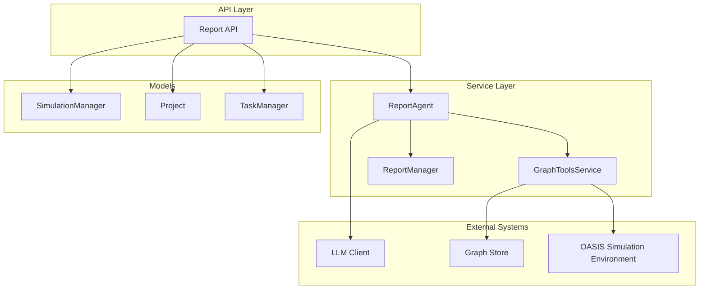
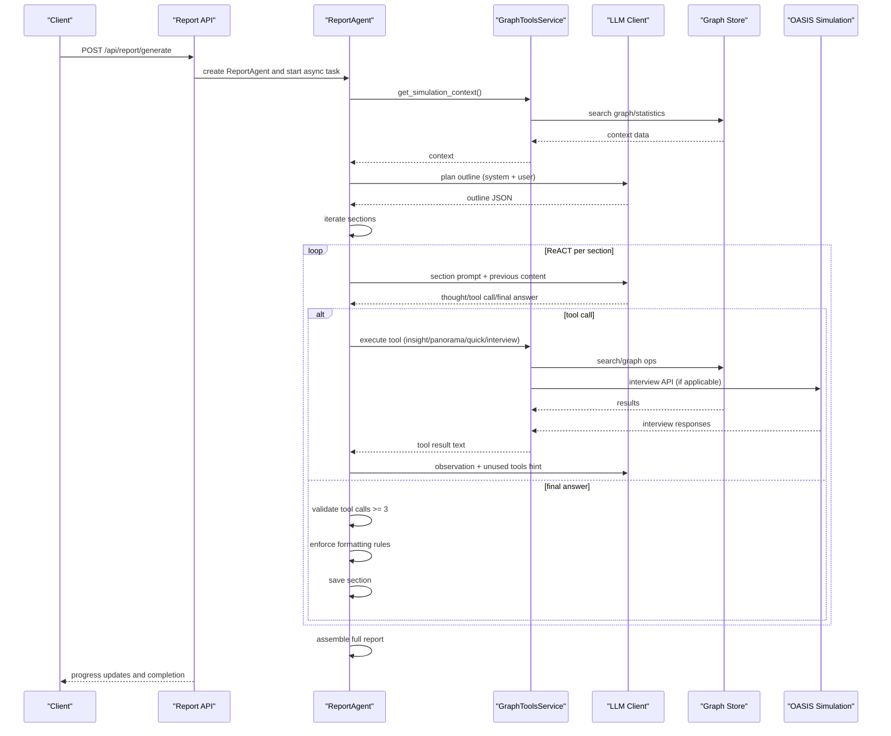
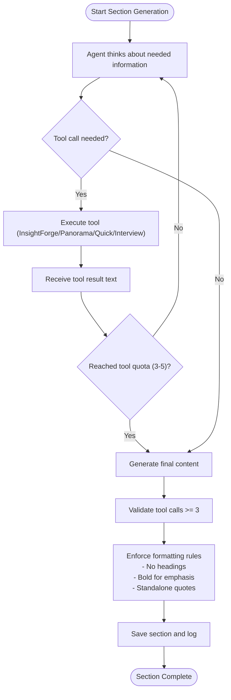
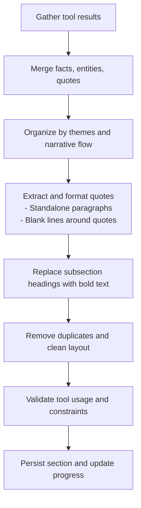
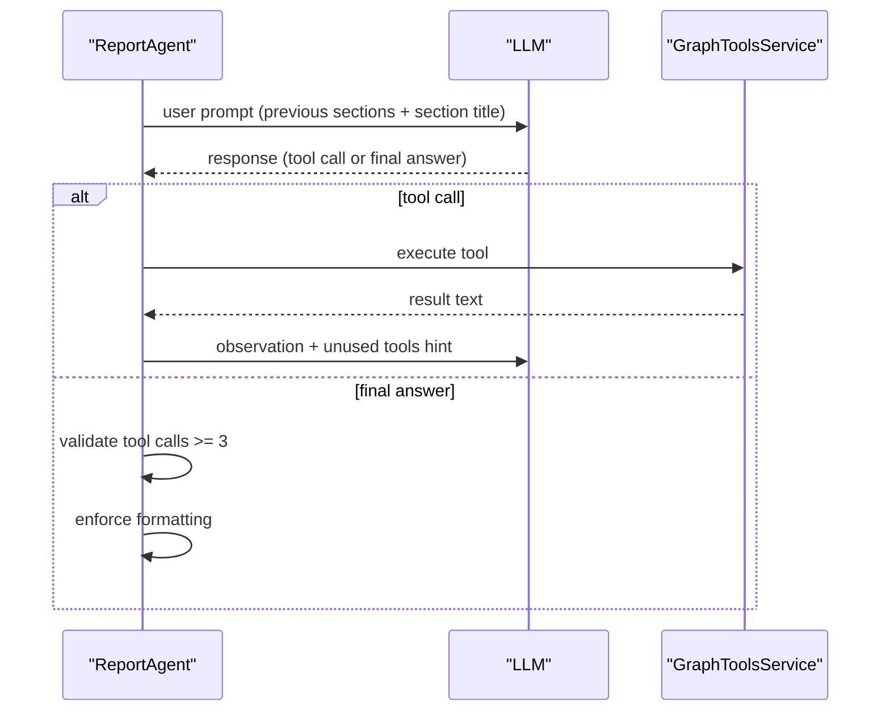
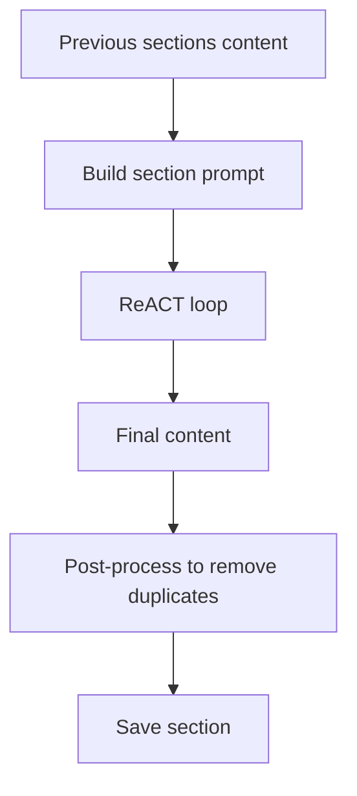
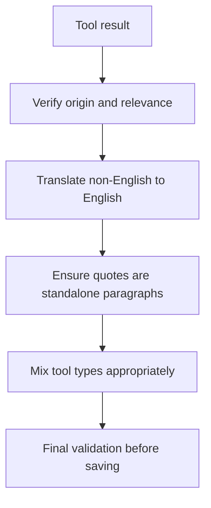
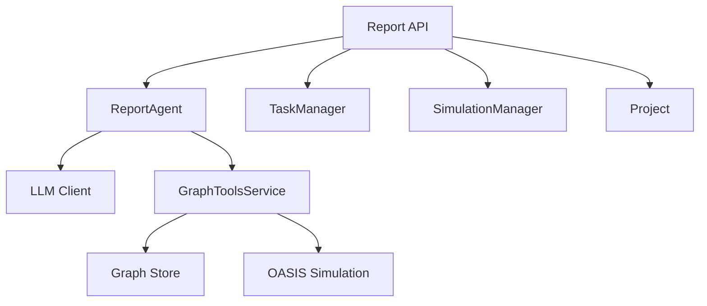

# Section Content Generation

<cite>
**Referenced Files in This Document**
- [report_agent.py](file://backend/app/services/report_agent.py)
- [graph_tools.py](file://backend/app/services/graph_tools.py)
- [report.py](file://backend/app/api/report.py)
- [simulation_manager.py](file://backend/app/services/simulation_manager.py)
- [project.py](file://backend/app/models/project.py)
- [task.py](file://backend/app/models/task.py)
</cite>

## Table of Contents
1. [Introduction](#introduction)
2. [Project Structure](#project-structure)
3. [Core Components](#core-components)
4. [Architecture Overview](#architecture-overview)
5. [Detailed Component Analysis](#detailed-component-analysis)
6. [Dependency Analysis](#dependency-analysis)
7. [Performance Considerations](#performance-considerations)
8. [Troubleshooting Guide](#troubleshooting-guide)
9. [Conclusion](#conclusion)

## Introduction
This document explains the section content generation process that transforms tool-retrieved information into cohesive report sections. It details the ReACT-based prompts guiding AI agents to structure content according to strict formatting requirements, the synthesis process integrating multiple tool results, and the enforcement of formatting constraints. It also covers tool usage requirements (3–5 tool calls per section with mixed tool types), repetition avoidance mechanisms, integration with previous section content, and quality assurance checks that validate content authenticity against simulation data.

## Project Structure
The section content generation spans several backend modules:
- Report Agent orchestrates planning, section-by-section generation, and post-processing
- Graph Tools provide retrieval capabilities (deep insight, panorama, quick search, interview agents)
- API endpoints manage report lifecycle and expose progress and content
- Simulation and project models supply context and state for the generation process
- Task management tracks long-running operations

**Diagram sources**
- [report_agent.py:864-917](file://backend/app/services/report_agent.py#L864-L917)
- [graph_tools.py:398-423](file://backend/app/services/graph_tools.py#L398-L423)
- [report.py:24-187](file://backend/app/api/report.py#L24-L187)
- [simulation_manager.py:114-137](file://backend/app/services/simulation_manager.py#L114-L137)
- [project.py:101-120](file://backend/app/models/project.py#L101-L120)
- [task.py:54-71](file://backend/app/models/task.py#L54-L71)

**Section sources**
- [report_agent.py:864-917](file://backend/app/services/report_agent.py#L864-L917)
- [graph_tools.py:398-423](file://backend/app/services/graph_tools.py#L398-L423)
- [report.py:24-187](file://backend/app/api/report.py#L24-L187)

## Core Components
- ReportAgent: Implements ReACT pattern to plan outlines and generate sections, enforcing tool usage limits and formatting rules
- GraphToolsService: Provides four retrieval tools—InsightForge (deep multi-dimensional analysis), PanoramaSearch (broad temporal view), QuickSearch (simple retrieval), and InterviewAgents (real Agent interviews)—plus basic graph utilities
- ReportManager: Persists report artifacts, manages progress, and assembles final Markdown
- API endpoints: Expose report generation, progress, sections, and agent logs; coordinate asynchronous execution

Key constraints enforced:
- Each section uses 3–5 tool calls with mixed tool types
- No headings within sections; use bold text and lists instead
- Strict quote formatting with standalone paragraphs
- Logical coherence with previous sections and repetition avoidance
- Faithful representation of simulation predictions

**Section sources**
- [report_agent.py:864-917](file://backend/app/services/report_agent.py#L864-L917)
- [report_agent.py:1220-1531](file://backend/app/services/report_agent.py#L1220-L1531)
- [graph_tools.py:398-423](file://backend/app/services/graph_tools.py#L398-L423)
- [report_agent.py:1883-2399](file://backend/app/services/report_agent.py#L1883-L2399)

## Architecture Overview
The generation pipeline follows a ReACT loop per section:
1. Planning: Outline structure determined by analyzing simulation context
2. Generation: For each section, the agent thinks about needed information, calls tools, observes results, and iterates until tool quota is met
3. Finalization: The agent produces section content adhering to formatting rules; content is saved incrementally and later assembled into a complete report

**Diagram sources**
- [report_agent.py:1532-1764](file://backend/app/services/report_agent.py#L1532-L1764)
- [report_agent.py:1220-1531](file://backend/app/services/report_agent.py#L1220-L1531)
- [graph_tools.py:749-1077](file://backend/app/services/graph_tools.py#L749-L1077)
- [report.py:24-187](file://backend/app/api/report.py#L24-L187)

## Detailed Component Analysis

### Section Generation Prompts and Constraints
The system enforces strict formatting and content requirements:
- Tool usage: 3–5 calls per section with mixed tool types
- No headings within sections; use bold text (**...) for subsections
- Quote format: standalone paragraphs with blank lines before and after
- Language consistency: all content in English; translations preserved
- Faithfulness: content must reflect simulation results; avoid fabricating information
- Repetition avoidance: previous sections' content is integrated to prevent duplication

**Diagram sources**
- [report_agent.py:1220-1531](file://backend/app/services/report_agent.py#L1220-L1531)
- [report_agent.py:768-792](file://backend/app/services/report_agent.py#L768-L792)

**Section sources**
- [report_agent.py:614-792](file://backend/app/services/report_agent.py#L614-L792)
- [report_agent.py:793-825](file://backend/app/services/report_agent.py#L793-L825)

### Content Synthesis and Formatting Enforcement
During synthesis, the agent integrates multiple tool results:
- InsightForge aggregates facts, entities, and relationship chains
- PanoramaSearch distinguishes active vs historical facts and timelines
- QuickSearch verifies specific claims
- InterviewAgents collects first-hand Agent perspectives

Formatting enforcement occurs post-generation:
- Duplicate headings removed
- Non-section headings converted to bold text
- Horizontal rules and excessive blank lines cleaned up
- Section content sanitized to ensure no headings and proper quote formatting

**Diagram sources**
- [graph_tools.py:749-1077](file://backend/app/services/graph_tools.py#L749-L1077)
- [report_agent.py:2131-2197](file://backend/app/services/report_agent.py#L2131-L2197)
- [report_agent.py:2299-2399](file://backend/app/services/report_agent.py#L2299-L2399)

**Section sources**
- [graph_tools.py:749-1077](file://backend/app/services/graph_tools.py#L749-L1077)
- [report_agent.py:2131-2197](file://backend/app/services/report_agent.py#L2131-L2197)
- [report_agent.py:2299-2399](file://backend/app/services/report_agent.py#L2299-L2399)

### Tool Usage Requirements and Mixed Types
The agent enforces:
- Minimum 3 tool calls per section
- Maximum 5 tool calls per section
- Mixed tool types per section (e.g., InsightForge + PanoramaSearch + InterviewAgents)
- Tool call limit messaging and forced completion when exceeded

**Diagram sources**
- [report_agent.py:1284-1500](file://backend/app/services/report_agent.py#L1284-L1500)
- [report_agent.py:800-825](file://backend/app/services/report_agent.py#L800-L825)

**Section sources**
- [report_agent.py:800-825](file://backend/app/services/report_agent.py#L800-L825)
- [report_agent.py:1284-1500](file://backend/app/services/report_agent.py#L1284-L1500)

### Repetition Avoidance and Previous Section Integration
To avoid repetition:
- Previous sections' content is passed into each section’s prompt (truncated to 4000 chars per section)
- The agent is instructed to avoid repeating information already covered
- During post-processing, duplicate headings and redundant content are removed

**Diagram sources**
- [report_agent.py:1262-1277](file://backend/app/services/report_agent.py#L1262-L1277)
- [report_agent.py:2334-2399](file://backend/app/services/report_agent.py#L2334-L2399)

**Section sources**
- [report_agent.py:1262-1277](file://backend/app/services/report_agent.py#L1262-L1277)
- [report_agent.py:2334-2399](file://backend/app/services/report_agent.py#L2334-L2399)

### Quality Assurance Against Simulation Data
Quality checks include:
- Tool usage validation (≥3 calls, ≤5 calls)
- Faithful representation: content must originate from tool results
- Translation consistency: non-English tool outputs translated to fluent English
- Interview authenticity: real Agent responses from OASIS environment
- Post-processing: removal of invalid headings and formatting anomalies

**Diagram sources**
- [report_agent.py:642-665](file://backend/app/services/report_agent.py#L642-L665)
- [graph_tools.py:1078-1288](file://backend/app/services/graph_tools.py#L1078-L1288)

**Section sources**
- [report_agent.py:642-665](file://backend/app/services/report_agent.py#L642-L665)
- [graph_tools.py:1078-1288](file://backend/app/services/graph_tools.py#L1078-L1288)

## Dependency Analysis
The generation process depends on:
- LLM client for planning, reasoning, and synthesis
- GraphToolsService for retrieval and interviews
- Graph store for search and node/edge queries
- Simulation environment for real Agent interviews
- API layer for orchestration and progress reporting

**Diagram sources**
- [report_agent.py:883-917](file://backend/app/services/report_agent.py#L883-L917)
- [graph_tools.py:418-429](file://backend/app/services/graph_tools.py#L418-L429)
- [report.py:24-187](file://backend/app/api/report.py#L24-L187)
- [simulation_manager.py:114-137](file://backend/app/services/simulation_manager.py#L114-L137)
- [project.py:101-120](file://backend/app/models/project.py#L101-L120)
- [task.py:54-71](file://backend/app/models/task.py#L54-L71)

**Section sources**
- [report_agent.py:883-917](file://backend/app/services/report_agent.py#L883-L917)
- [graph_tools.py:418-429](file://backend/app/services/graph_tools.py#L418-L429)
- [report.py:24-187](file://backend/app/api/report.py#L24-L187)

## Performance Considerations
- Asynchronous generation: API endpoints return immediately with task IDs; clients poll progress
- Incremental section saving: sections are persisted as soon as generated, enabling early access
- Tool call limits: enforced to balance depth and runtime
- Post-processing cleanup: removes formatting anomalies and duplicates to reduce downstream processing overhead

[No sources needed since this section provides general guidance]

## Troubleshooting Guide
Common issues and resolutions:
- Empty or partial LLM responses: the agent retries with corrective prompts and may truncate conflicting outputs
- Tool call conflicts: if both tool call and final answer appear, the agent requests corrected output
- Interview failures: missing or inactive simulation environment prevents interviews; agent falls back with explanatory summaries
- Progress polling: use dedicated endpoints to monitor generation status and retrieve logs

**Section sources**
- [report_agent.py:1327-1362](file://backend/app/services/report_agent.py#L1327-L1362)
- [report_agent.py:1404-1468](file://backend/app/services/report_agent.py#L1404-L1468)
- [graph_tools.py:1194-1278](file://backend/app/services/graph_tools.py#L1194-L1278)
- [report.py:564-748](file://backend/app/api/report.py#L564-L748)

## Conclusion
The section content generation process combines ReACT-driven reasoning with strict formatting and quality controls. By mandating 3–5 mixed tool calls per section, enforcing bold text and standalone quotes, integrating previous sections to avoid repetition, and validating authenticity against simulation data, the system ensures coherent, faithful, and readable reports. The modular architecture with asynchronous execution and incremental persistence enables scalable and transparent report generation.