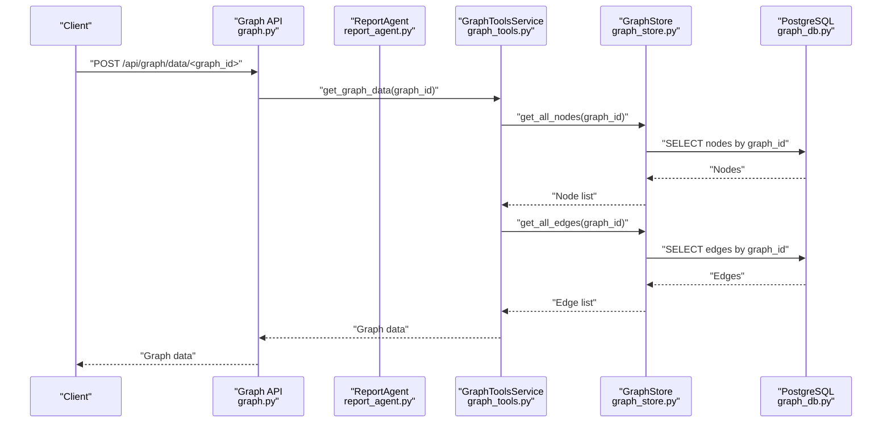
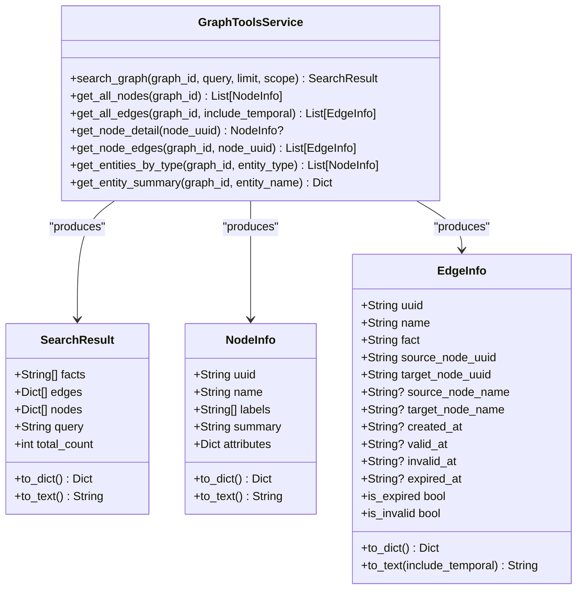
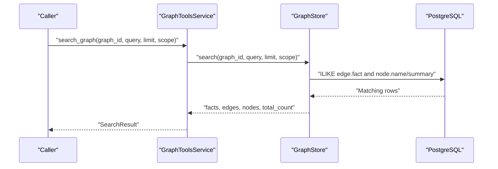
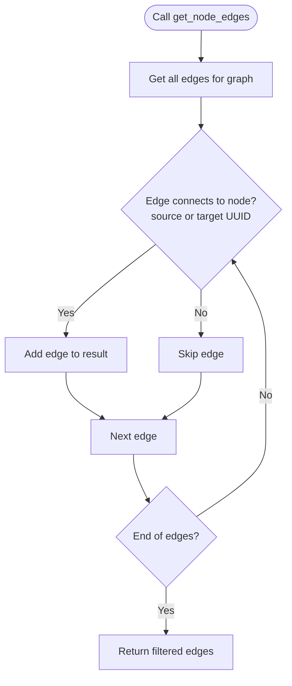
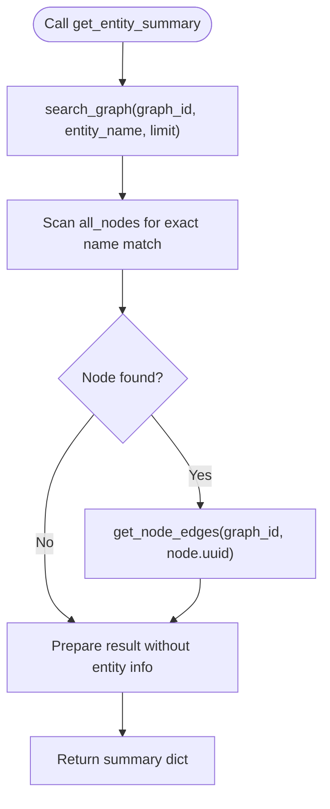
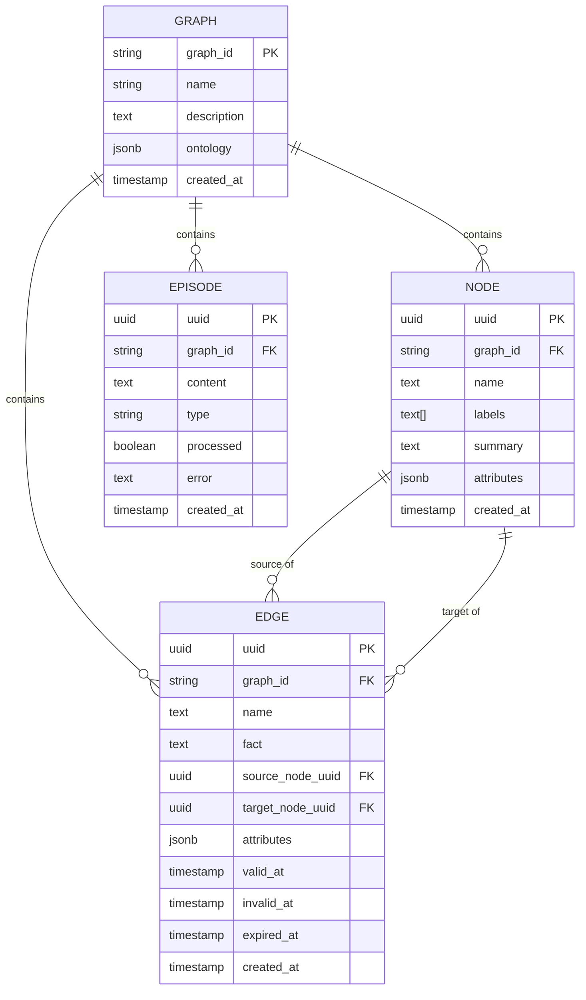
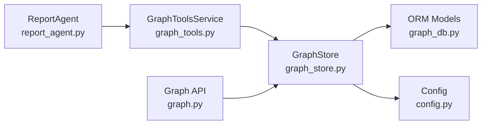

# Basic Graph Search and Navigation Tools

<cite>
**Referenced Files in This Document**
- [graph_tools.py](file://backend/app/services/graph_tools.py)
- [graph_store.py](file://backend/app/services/graph_store.py)
- [graph_db.py](file://backend/app/models/graph_db.py)
- [config.py](file://backend/app/config.py)
- [report_agent.py](file://backend/app/services/report_agent.py)
- [graph.py](file://backend/app/api/graph.py)
</cite>

## Table of Contents
1. [Introduction](#introduction)
2. [Project Structure](#project-structure)
3. [Core Components](#core-components)
4. [Architecture Overview](#architecture-overview)
5. [Detailed Component Analysis](#detailed-component-analysis)
6. [Dependency Analysis](#dependency-analysis)
7. [Performance Considerations](#performance-considerations)
8. [Troubleshooting Guide](#troubleshooting-guide)
9. [Conclusion](#conclusion)
10. [Appendices](#appendices)

## Introduction
This document describes the foundational graph search and navigation tools that power the GraphToolsService. These tools enable granular exploration of a knowledge graph stored in PostgreSQL, including:
- search_graph: PostgreSQL full-text search across edges and nodes
- get_all_nodes: Retrieve complete node lists
- get_all_edges: Retrieve all edges with temporal validity fields
- get_node_detail: Fetch detailed information for a single node
- get_node_edges: Explore relationships connected to a specific node
- get_entities_by_type: Filter entities by categorical labels
- get_entity_summary: Produce a relationship-centric summary for an entity

It also documents the SearchResult, NodeInfo, and EdgeInfo data structures and their conversion to text formats for LLM consumption. Finally, it explains how these tools integrate with higher-level systems (Report Agent) and the broader architecture.

## Project Structure
The graph search and navigation capabilities are implemented in the backend Python application under the services and models packages. The key files are:
- Services: graph_tools.py (high-level tools), graph_store.py (SQLAlchemy access layer), report_agent.py (higher-level orchestration)
- Models: graph_db.py (SQLAlchemy ORM for nodes, edges, episodes, graphs)
- Configuration: config.py (database connection and runtime settings)
- API: graph.py (graph lifecycle and data endpoints)

```mermaid
graph TB
subgraph "Services"
GT["GraphToolsService<br/>graph_tools.py"]
GS["GraphStore<br/>graph_store.py"]
RA["ReportAgent<br/>report_agent.py"]
end
subgraph "Models"
DB["ORM Models<br/>graph_db.py"]
end
subgraph "Config"
CFG["Config<br/>config.py"]
end
subgraph "API"
API["Graph API<br/>graph.py"]
end
GT --> GS
RA --> GT
GS --> DB
API --> GS
CFG --> GS
```

**Diagram sources**
- [graph_tools.py:398-430](file://backend/app/services/graph_tools.py#L398-L430)
- [graph_store.py:21-375](file://backend/app/services/graph_store.py#L21-L375)
- [graph_db.py:24-105](file://backend/app/models/graph_db.py#L24-L105)
- [config.py:20-76](file://backend/app/config.py#L20-L76)
- [report_agent.py:905-917](file://backend/app/services/report_agent.py#L905-L917)
- [graph.py:562-581](file://backend/app/api/graph.py#L562-L581)

**Section sources**
- [graph_tools.py:1-120](file://backend/app/services/graph_tools.py#L1-L120)
- [graph_store.py:1-30](file://backend/app/services/graph_store.py#L1-L30)
- [graph_db.py:1-25](file://backend/app/models/graph_db.py#L1-L25)
- [config.py:1-20](file://backend/app/config.py#L1-L20)

## Core Components
This section introduces the core data structures and the GraphToolsService methods that implement the basic graph navigation and search.

- SearchResult: Aggregates facts, edges, nodes, query, and total_count; converts to dict and text for LLM consumption.
- NodeInfo: Encapsulates node identity, labels, summary, and attributes; converts to dict and text.
- EdgeInfo: Encapsulates edge identity, name, fact, source/target UUIDs, and temporal fields; converts to dict and text with optional temporal details.

GraphToolsService exposes the following methods:
- search_graph: PostgreSQL full-text search across edges and nodes
- get_all_nodes: Paginated retrieval of nodes
- get_all_edges: Paginated retrieval of edges with temporal fields
- get_node_detail: Fetch a single node by UUID
- get_node_edges: Filter edges connected to a given node
- get_entities_by_type: Filter nodes by label membership
- get_entity_summary: Combine search results and related edges for a named entity

These methods are designed to support higher-level tools and agents that require granular graph exploration.

**Section sources**
- [graph_tools.py:24-133](file://backend/app/services/graph_tools.py#L24-L133)
- [graph_tools.py:431-660](file://backend/app/services/graph_tools.py#L431-L660)

## Architecture Overview
The system architecture separates concerns across layers:
- API layer: Exposes endpoints for graph lifecycle and data retrieval
- Service layer: Implements GraphToolsService and GraphStore
- Model layer: SQLAlchemy ORM for nodes, edges, episodes, and graphs
- Configuration: Centralized settings for database and runtime behavior



**Diagram sources**
- [graph.py:562-581](file://backend/app/api/graph.py#L562-L581)
- [report_agent.py:1156-1160](file://backend/app/services/report_agent.py#L1156-L1160)
- [graph_tools.py:462-523](file://backend/app/services/graph_tools.py#L462-L523)
- [graph_store.py:195-255](file://backend/app/services/graph_store.py#L195-L255)
- [graph_db.py:39-85](file://backend/app/models/graph_db.py#L39-L85)

## Detailed Component Analysis

### GraphToolsService Methods and Data Structures
This section documents each method and the data structures they produce, along with their conversion to text for LLM processing.

- SearchResult
  - Fields: facts, edges, nodes, query, total_count
  - to_dict(): Returns a serializable dictionary
  - to_text(): Converts to a human-readable string for LLM consumption

- NodeInfo
  - Fields: uuid, name, labels, summary, attributes
  - to_dict(): Returns a serializable dictionary
  - to_text(): Produces a concise textual representation of an entity

- EdgeInfo
  - Fields: uuid, name, fact, source_node_uuid, target_node_uuid, source_node_name, target_node_name, created_at, valid_at, invalid_at, expired_at
  - to_dict(): Returns a serializable dictionary
  - to_text(include_temporal): Converts to a readable relationship statement; optionally includes temporal validity
  - Properties: is_expired, is_invalid

- search_graph
  - Purpose: Full-text search using PostgreSQL ILIKE against edge facts and node names/summaries
  - Parameters: graph_id, query, limit, scope ("edges", "nodes", "both")
  - Returns: SearchResult

- get_all_nodes
  - Purpose: Retrieve all nodes for a graph (paginated)
  - Parameters: graph_id
  - Returns: List[NodeInfo]

- get_all_edges
  - Purpose: Retrieve all edges for a graph (paginated)
  - Parameters: graph_id, include_temporal (default True)
  - Returns: List[EdgeInfo]

- get_node_detail
  - Purpose: Fetch a single node by UUID
  - Parameters: node_uuid
  - Returns: Optional[NodeInfo]

- get_node_edges
  - Purpose: Filter edges connected to a specific node (source or target)
  - Parameters: graph_id, node_uuid
  - Returns: List[EdgeInfo]

- get_entities_by_type
  - Purpose: Filter nodes whose labels include a given type
  - Parameters: graph_id, entity_type
  - Returns: List[NodeInfo]

- get_entity_summary
  - Purpose: Summarize an entity’s related facts and edges
  - Parameters: graph_id, entity_name
  - Returns: Dict with entity_name, entity_info, related_facts, related_edges, total_relations



**Diagram sources**
- [graph_tools.py:24-133](file://backend/app/services/graph_tools.py#L24-L133)
- [graph_tools.py:431-660](file://backend/app/services/graph_tools.py#L431-L660)

**Section sources**
- [graph_tools.py:24-133](file://backend/app/services/graph_tools.py#L24-L133)
- [graph_tools.py:431-660](file://backend/app/services/graph_tools.py#L431-L660)

### Search Workflow (search_graph)
The search_graph method delegates to GraphStore.search, which performs PostgreSQL ILIKE-based full-text search across:
- Edge facts
- Node names and summaries

Results are aggregated into SearchResult with facts, edges, and nodes, and a total_count.



**Diagram sources**
- [graph_tools.py:431-461](file://backend/app/services/graph_tools.py#L431-L461)
- [graph_store.py:259-316](file://backend/app/services/graph_store.py#L259-L316)

**Section sources**
- [graph_tools.py:431-461](file://backend/app/services/graph_tools.py#L431-L461)
- [graph_store.py:259-316](file://backend/app/services/graph_store.py#L259-L316)

### Node and Edge Retrieval Workflows
- get_all_nodes: Retrieves nodes with pagination and converts to NodeInfo list.
- get_all_edges: Retrieves edges with pagination and converts to EdgeInfo list; optionally includes temporal fields.
- get_node_detail: Fetches a single node by UUID and wraps it in NodeInfo.
- get_node_edges: Retrieves all edges and filters for those connected to the specified node.



**Diagram sources**
- [graph_tools.py:554-584](file://backend/app/services/graph_tools.py#L554-L584)
- [graph_store.py:249-255](file://backend/app/services/graph_store.py#L249-L255)

**Section sources**
- [graph_tools.py:462-523](file://backend/app/services/graph_tools.py#L462-L523)
- [graph_tools.py:554-584](file://backend/app/services/graph_tools.py#L554-L584)
- [graph_store.py:195-255](file://backend/app/services/graph_store.py#L195-L255)

### Entity Filtering and Summary
- get_entities_by_type: Iterates all nodes and selects those whose labels include the specified type.
- get_entity_summary: Combines search results and related edges for a named entity, returning structured information for downstream use.



**Diagram sources**
- [graph_tools.py:614-660](file://backend/app/services/graph_tools.py#L614-L660)
- [graph_store.py:195-255](file://backend/app/services/graph_store.py#L195-L255)

**Section sources**
- [graph_tools.py:586-660](file://backend/app/services/graph_tools.py#L586-L660)

### Data Model and Temporal Semantics
The graph model defines nodes, edges, episodes, and graphs with explicit temporal fields on edges:
- Node: uuid, graph_id, name, labels, summary, attributes, created_at
- Edge: uuid, graph_id, name, fact, source_node_uuid, target_node_uuid, attributes, valid_at, invalid_at, expired_at, created_at
- Episode: uuid, graph_id, content, type, processed, error, created_at
- Graph: graph_id, name, description, ontology, created_at

Temporal semantics:
- valid_at/invalide_at define the validity window
- expired_at indicates expiration
- created_at captures creation time



**Diagram sources**
- [graph_db.py:24-105](file://backend/app/models/graph_db.py#L24-L105)

**Section sources**
- [graph_db.py:24-105](file://backend/app/models/graph_db.py#L24-L105)

## Dependency Analysis
The following diagram shows the primary dependencies among components:



**Diagram sources**
- [report_agent.py:905-917](file://backend/app/services/report_agent.py#L905-L917)
- [graph_tools.py:398-430](file://backend/app/services/graph_tools.py#L398-L430)
- [graph_store.py:21-375](file://backend/app/services/graph_store.py#L21-L375)
- [graph_db.py:24-105](file://backend/app/models/graph_db.py#L24-L105)
- [config.py:20-76](file://backend/app/config.py#L20-L76)
- [graph.py:562-581](file://backend/app/api/graph.py#L562-L581)

**Section sources**
- [report_agent.py:905-917](file://backend/app/services/report_agent.py#L905-L917)
- [graph_tools.py:398-430](file://backend/app/services/graph_tools.py#L398-L430)
- [graph_store.py:21-375](file://backend/app/services/graph_store.py#L21-L375)
- [graph_db.py:24-105](file://backend/app/models/graph_db.py#L24-L105)
- [config.py:20-76](file://backend/app/config.py#L20-L76)
- [graph.py:562-581](file://backend/app/api/graph.py#L562-L581)

## Performance Considerations
- Pagination: get_all_nodes and get_all_edges use limit and offset to prevent large result sets. Tune limits based on downstream consumers.
- Full-text search: search_graph uses ILIKE queries. For large graphs, consider adding PostgreSQL full-text search indexes or vector embeddings for richer semantic search.
- Temporal filtering: EdgeInfo includes temporal fields. Use valid_at/invalid_at/expired_at judiciously to avoid scanning unnecessary historical data.
- Node/edge counts: get_graph_statistics provides counts and distributions. Use these to inform sampling strategies.
- Concurrency: GraphStore uses SQLAlchemy sessions. Ensure proper session management and consider connection pooling settings.

[No sources needed since this section provides general guidance]

## Troubleshooting Guide
Common issues and resolutions:
- Database connectivity: Verify DATABASE_URL in Config and ensure PostgreSQL is reachable.
- Missing graph_id: Ensure the graph exists before invoking tools.
- Empty results: For search_graph, confirm query terms and scope. Consider broadening scope or adjusting limit.
- Node not found: get_node_detail returns None if the UUID is invalid or missing.
- Edge filtering: get_node_edges relies on GraphStore.get_all_edges; ensure edges exist and UUIDs are valid.

Operational checks:
- Validate configuration via Config.validate.
- Inspect logs for detailed error messages.
- Use API endpoints for manual verification of graph data.

**Section sources**
- [config.py:66-76](file://backend/app/config.py#L66-L76)
- [graph_tools.py:525-553](file://backend/app/services/graph_tools.py#L525-L553)
- [graph_store.py:195-255](file://backend/app/services/graph_store.py#L195-L255)

## Conclusion
The basic graph search and navigation tools provide a robust foundation for exploring knowledge graphs stored in PostgreSQL. They offer efficient retrieval of nodes and edges, flexible filtering by type, and contextual summaries for entities. Their design supports higher-level agents and services by exposing clear data structures and text conversions tailored for LLM processing.

[No sources needed since this section summarizes without analyzing specific files]

## Appendices

### Practical Usage Patterns
- Granular exploration: Use get_all_nodes and get_all_edges to seed downstream analysis; apply get_node_edges to drill into relationships.
- Categorical filtering: Use get_entities_by_type to segment entities by roles or categories.
- Contextual summaries: Use get_entity_summary to combine search results and related edges for a named entity.
- Integration with higher-level tools: ReportAgent orchestrates these tools to plan and generate reports.

[No sources needed since this section provides general guidance]