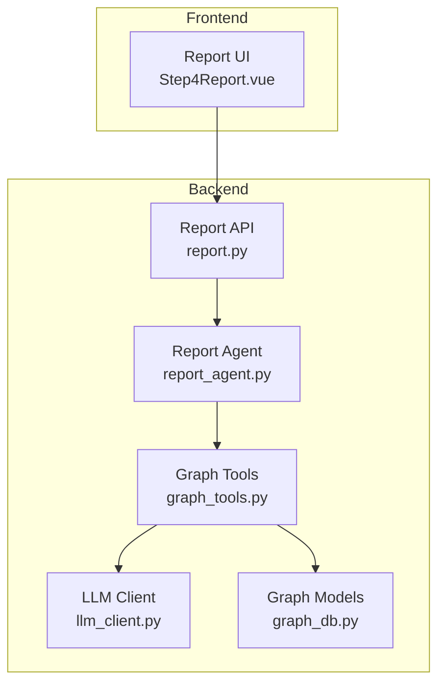
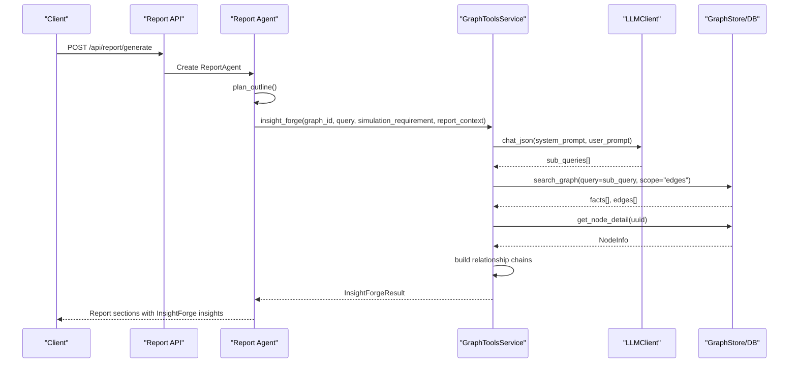
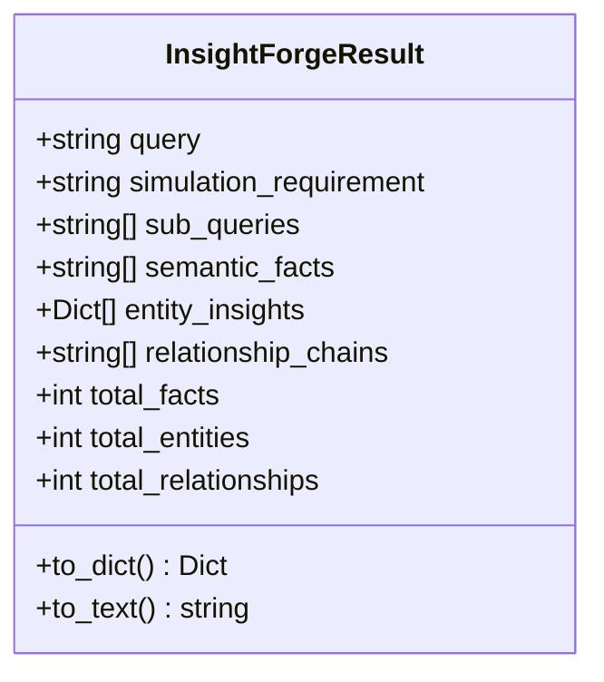
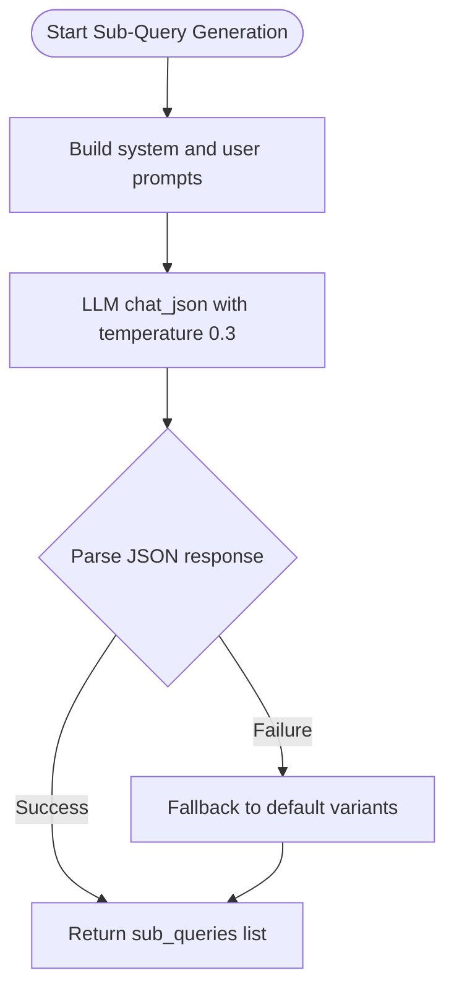
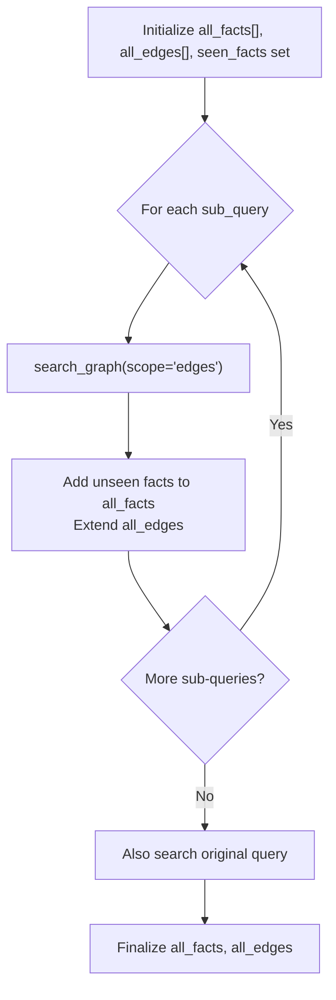
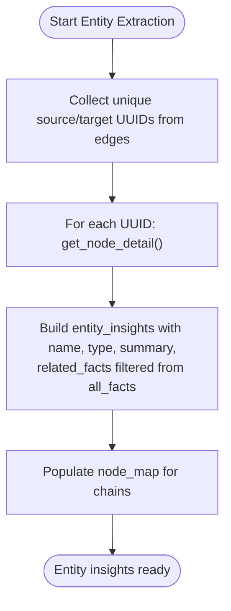
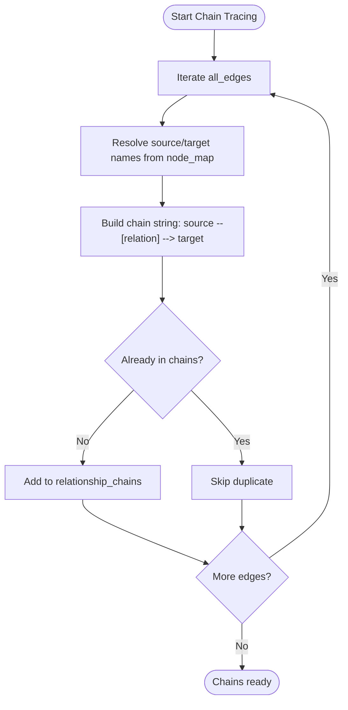
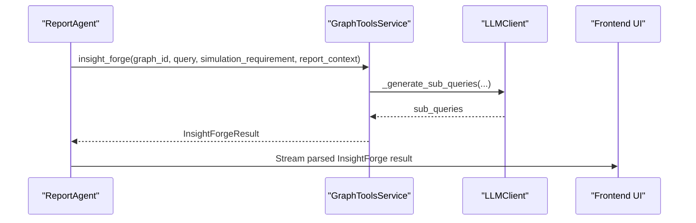
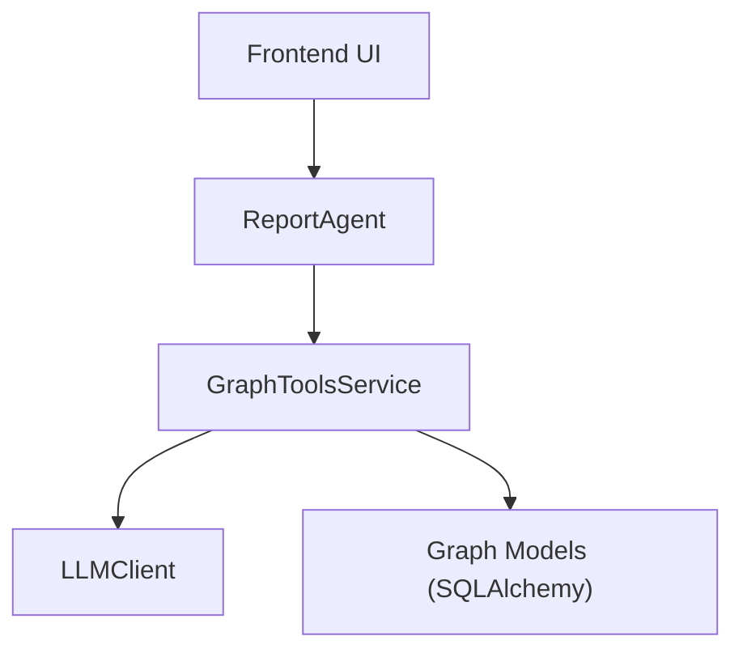

# InsightForge Deep Insight Retrieval Tool

<cite>
**Referenced Files in This Document**
- [graph_tools.py](file://backend/app/services/graph_tools.py)
- [report_agent.py](file://backend/app/services/report_agent.py)
- [llm_client.py](file://backend/app/utils/llm_client.py)
- [graph_db.py](file://backend/app/models/graph_db.py)
- [report.py](file://backend/app/api/report.py)
- [Step4Report.vue](file://frontend/src/components/Step4Report.vue)
- [README.md](file://README.md)
</cite>

## Table of Contents
1. [Introduction](#introduction)
2. [Project Structure](#project-structure)
3. [Core Components](#core-components)
4. [Architecture Overview](#architecture-overview)
5. [Detailed Component Analysis](#detailed-component-analysis)
6. [Dependency Analysis](#dependency-analysis)
7. [Performance Considerations](#performance-considerations)
8. [Troubleshooting Guide](#troubleshooting-guide)
9. [Conclusion](#conclusion)
10. [Appendices](#appendices)

## Introduction
InsightForge is the most powerful hybrid retrieval function in the MiroFish system, designed to transform complex prediction questions into deep insights. It automatically decomposes user queries into multiple sub-questions, performs multi-dimensional semantic search across the knowledge graph, extracts related entities with detailed information, traces relationship chains, and consolidates results into a comprehensive analysis. InsightForge integrates tightly with the Report Agent system to support future prediction reports, enabling users to understand evolving scenarios, multi-perspective viewpoints, and temporal dynamics within simulated worlds.

## Project Structure
The InsightForge tool resides in the backend services layer and interacts with the knowledge graph, LLM client, and the Report Agent pipeline. The frontend consumes InsightForge results to render interactive displays during report generation.

**Diagram sources**
- [report.py:24-187](file://backend/app/api/report.py#L24-L187)
- [report_agent.py:1532-1738](file://backend/app/services/report_agent.py#L1532-L1738)
- [graph_tools.py:398-896](file://backend/app/services/graph_tools.py#L398-L896)
- [llm_client.py:14-104](file://backend/app/utils/llm_client.py#L14-L104)
- [graph_db.py:24-105](file://backend/app/models/graph_db.py#L24-L105)

**Section sources**
- [README.md:15-77](file://README.md#L15-L77)
- [report.py:24-187](file://backend/app/api/report.py#L24-L187)

## Core Components
- InsightForgeResult: The structured output container for multi-dimensional retrieval results, including sub-queries, semantic facts, entity insights, relationship chains, and statistics.
- GraphToolsService.insight_forge: The core hybrid retrieval function orchestrating sub-question decomposition, semantic search, entity extraction, and relationship chain tracing.
- LLMClient: Provides unified OpenAI-compatible chat and JSON modes used by InsightForge for sub-question generation.
- Report Agent: Integrates InsightForge into the ReACT-driven report generation pipeline, enabling deep retrieval and writing across report sections.

**Section sources**
- [graph_tools.py:135-166](file://backend/app/services/graph_tools.py#L135-L166)
- [graph_tools.py:751-896](file://backend/app/services/graph_tools.py#L751-L896)
- [llm_client.py:14-104](file://backend/app/utils/llm_client.py#L14-L104)
- [report_agent.py:475-491](file://backend/app/services/report_agent.py#L475-L491)

## Architecture Overview
InsightForge operates as a multi-stage pipeline:
1. Sub-question generation using LLM prompts tailored to the simulation requirement and optional report context.
2. Multi-dimensional semantic search across edges/facts in the knowledge graph.
3. Entity extraction by mapping edges to node UUIDs and retrieving detailed node information.
4. Relationship chain tracing by constructing readable chains from edge data.
5. Consolidation into InsightForgeResult with statistics and human-readable text.

**Diagram sources**
- [report.py:24-187](file://backend/app/api/report.py#L24-L187)
- [report_agent.py:1290-1467](file://backend/app/services/report_agent.py#L1290-L1467)
- [graph_tools.py:751-896](file://backend/app/services/graph_tools.py#L751-L896)
- [llm_client.py:70-104](file://backend/app/utils/llm_client.py#L70-L104)
- [graph_db.py:24-105](file://backend/app/models/graph_db.py#L24-L105)

## Detailed Component Analysis

### InsightForgeResult Data Structure
InsightForgeResult encapsulates the complete retrieval outcome:
- Fields: query, simulation_requirement, sub_queries, semantic_facts, entity_insights, relationship_chains, and counters for total_facts, total_entities, total_relationships.
- Methods: to_dict() for serialization and to_text() for LLM-friendly presentation, including statistics and formatted sections for facts, entities, and relationship chains.

**Diagram sources**
- [graph_tools.py:135-208](file://backend/app/services/graph_tools.py#L135-L208)

**Section sources**
- [graph_tools.py:135-208](file://backend/app/services/graph_tools.py#L135-L208)

### Sub-Query Generation Process
InsightForge leverages an LLM to decompose complex questions into multiple sub-questions aligned with the simulation scenario and optional report context. The process:
- Constructs a system prompt emphasizing dimensionality (who, what, why, how, when, where) and relevance to the simulated world.
- Builds a user prompt incorporating simulation_requirement, optional report_context, and the original query.
- Calls LLM chat_json with a low temperature to encourage deterministic decomposition.
- Falls back to default variants if LLM fails.

**Diagram sources**
- [graph_tools.py:898-950](file://backend/app/services/graph_tools.py#L898-L950)
- [llm_client.py:70-104](file://backend/app/utils/llm_client.py#L70-L104)

**Section sources**
- [graph_tools.py:898-950](file://backend/app/services/graph_tools.py#L898-L950)
- [llm_client.py:14-104](file://backend/app/utils/llm_client.py#L14-L104)

### Multi-Dimensional Search Strategy
InsightForge performs semantic search across edges/facts using the knowledge graph:
- Iterates through generated sub-queries and the original query to collect unique facts and edges.
- Uses a seen_facts set to deduplicate across queries.
- Aggregates all_facts and all_edges for downstream entity extraction and relationship chain tracing.

**Diagram sources**
- [graph_tools.py:797-830](file://backend/app/services/graph_tools.py#L797-L830)

**Section sources**
- [graph_tools.py:797-830](file://backend/app/services/graph_tools.py#L797-L830)

### Entity Extraction Algorithms
Entity extraction focuses on retrieving detailed information for nodes connected by edges:
- Extracts UUIDs from all_edges and fetches NodeInfo for each UUID via get_node_detail.
- Builds entity_insights with uuid, name, type, summary, and related_facts (facts containing the entity name).
- Maintains a node_map for relationship chain construction.

**Diagram sources**
- [graph_tools.py:832-875](file://backend/app/services/graph_tools.py#L832-L875)

**Section sources**
- [graph_tools.py:832-875](file://backend/app/services/graph_tools.py#L832-L875)

### Relationship Chain Tracing Mechanisms
Relationship chains are constructed from edge data:
- Iterates through all_edges and builds readable chains using source/target names from node_map.
- Ensures uniqueness and readability of chains for consolidated reporting.

**Diagram sources**
- [graph_tools.py:877-896](file://backend/app/services/graph_tools.py#L877-L896)

**Section sources**
- [graph_tools.py:877-896](file://backend/app/services/graph_tools.py#L877-L896)

### Integration with Report Agent System
The Report Agent integrates InsightForge into a ReACT-driven workflow:
- During section generation, the agent calls insight_forge with a report_context derived from the current section and simulation requirement.
- The agent logs tool calls and results to structured logs and streams results to the frontend.
- The frontend parses InsightForge text output into a structured view for user consumption.

**Diagram sources**
- [report_agent.py:1290-1467](file://backend/app/services/report_agent.py#L1290-L1467)
- [graph_tools.py:751-896](file://backend/app/services/graph_tools.py#L751-L896)
- [Step4Report.vue:541-623](file://frontend/src/components/Step4Report.vue#L541-L623)

**Section sources**
- [report_agent.py:1290-1467](file://backend/app/services/report_agent.py#L1290-L1467)
- [Step4Report.vue:279-282](file://frontend/src/components/Step4Report.vue#L279-L282)
- [Step4Report.vue:541-623](file://frontend/src/components/Step4Report.vue#L541-L623)

## Dependency Analysis
InsightForge depends on:
- LLMClient for sub-question generation (OpenAI-compatible chat and JSON modes).
- GraphStore/Graph DB for semantic search and node/edge retrieval.
- Report Agent for orchestration and frontend integration.

**Diagram sources**
- [graph_tools.py:418-429](file://backend/app/services/graph_tools.py#L418-L429)
- [llm_client.py:14-104](file://backend/app/utils/llm_client.py#L14-L104)
- [graph_db.py:24-105](file://backend/app/models/graph_db.py#L24-L105)
- [report_agent.py:1532-1738](file://backend/app/services/report_agent.py#L1532-L1738)

**Section sources**
- [graph_tools.py:418-429](file://backend/app/services/graph_tools.py#L418-L429)
- [graph_db.py:24-105](file://backend/app/models/graph_db.py#L24-L105)
- [report_agent.py:1532-1738](file://backend/app/services/report_agent.py#L1532-L1738)

## Performance Considerations
- Sub-query generation: Temperature 0.3 balances determinism and quality; adjust based on LLM behavior.
- Search limits: The implementation uses fixed limits for sub-searches and main search; tune limits to balance recall and latency.
- Deduplication: Using a seen_facts set prevents redundant processing; ensure efficient hashing for large datasets.
- Entity extraction: Fetching NodeInfo per UUID scales with the number of related entities; consider batching or caching if needed.
- Relationship chains: Building chains from all edges is linear in edge count; keep node_map lookup efficient.
- Frontend parsing: Regex-based parsing of InsightForge text should be robust against varied LLM outputs.

[No sources needed since this section provides general guidance]

## Troubleshooting Guide
Common issues and resolutions:
- LLM sub-question generation failures: The fallback mechanism returns default variants; verify LLM configuration and prompts.
- Empty or partial results: Check graph search scope and limits; ensure graph contains relevant edges/facts.
- Node retrieval failures: Validate UUIDs extracted from edges and confirm node existence in the graph.
- Frontend parsing mismatches: The frontend expects specific sections and formats; ensure InsightForgeResult.to_text remains consistent.

**Section sources**
- [graph_tools.py:941-950](file://backend/app/services/graph_tools.py#L941-L950)
- [graph_tools.py:850-872](file://backend/app/services/graph_tools.py#L850-L872)
- [Step4Report.vue:541-623](file://frontend/src/components/Step4Report.vue#L541-L623)

## Conclusion
InsightForge delivers a powerful, automated approach to deep insight retrieval by combining LLM-driven sub-question decomposition with multi-dimensional semantic search, entity extraction, and relationship chain tracing. Its integration with the Report Agent enables comprehensive future prediction reports enriched with temporal dynamics and multi-perspective insights, making it a cornerstone of the MiroFish system.

[No sources needed since this section summarizes without analyzing specific files]

## Appendices

### Practical Examples
- Complex prediction scenarios: InsightForge decomposes multi-faceted questions into focused sub-questions, retrieves relevant facts, identifies key entities, and traces causal chains to produce actionable insights.
- Temporal relationships: The knowledge graph encodes validity and expiration timestamps; InsightForge leverages these to distinguish active from historical facts and to construct accurate relationship chains.
- Report integration: The Report Agent calls InsightForge during section generation, parses results into structured views, and streams them to the frontend for real-time visualization.

**Section sources**
- [graph_tools.py:751-896](file://backend/app/services/graph_tools.py#L751-L896)
- [report_agent.py:1290-1467](file://backend/app/services/report_agent.py#L1290-L1467)
- [Step4Report.vue:541-623](file://frontend/src/components/Step4Report.vue#L541-L623)

### Configuration Options
- LLM configuration: API key, base URL, and model name are managed by LLMClient and must be set via environment variables.
- InsightForge parameters: max_sub_queries controls the number of generated sub-questions; adjust based on complexity and cost constraints.
- Search limits: Limits for sub-searches and main search can be tuned to balance performance and coverage.

**Section sources**
- [llm_client.py:17-33](file://backend/app/utils/llm_client.py#L17-L33)
- [graph_tools.py:756-757](file://backend/app/services/graph_tools.py#L756-L757)
- [graph_tools.py:806-822](file://backend/app/services/graph_tools.py#L806-L822)