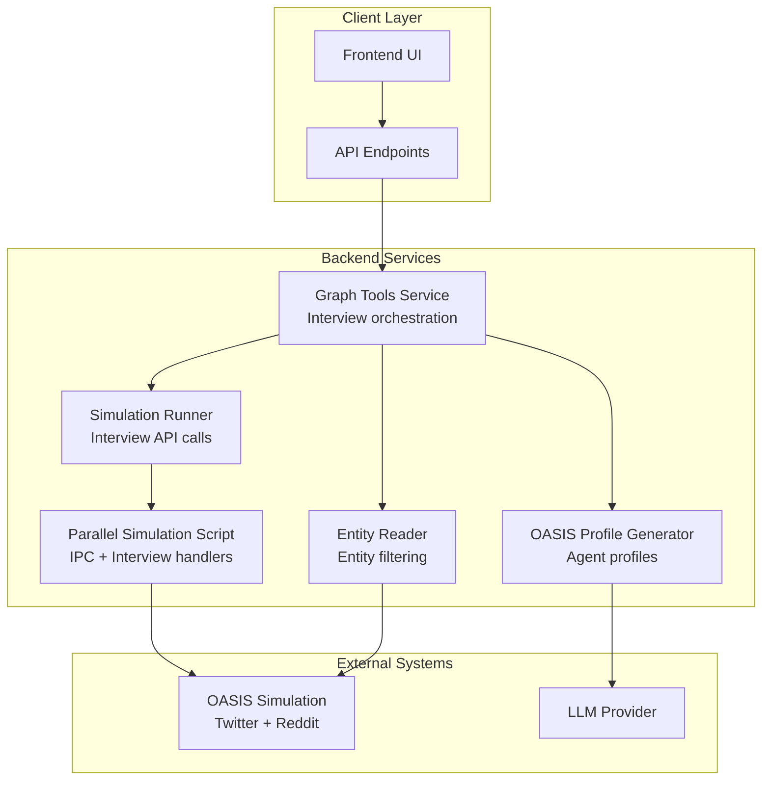
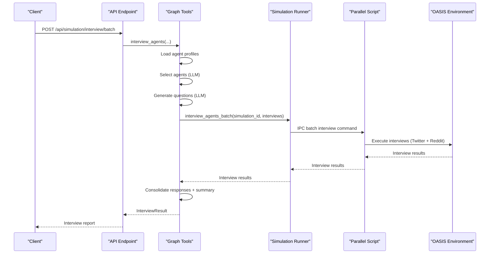
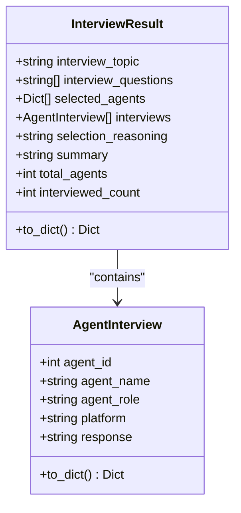
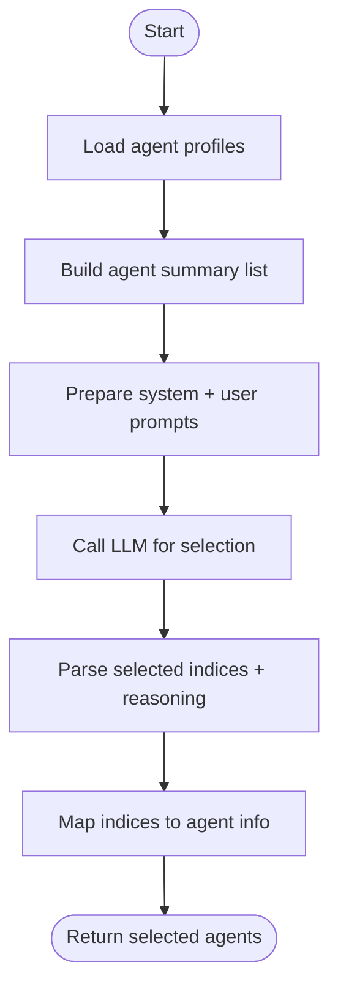
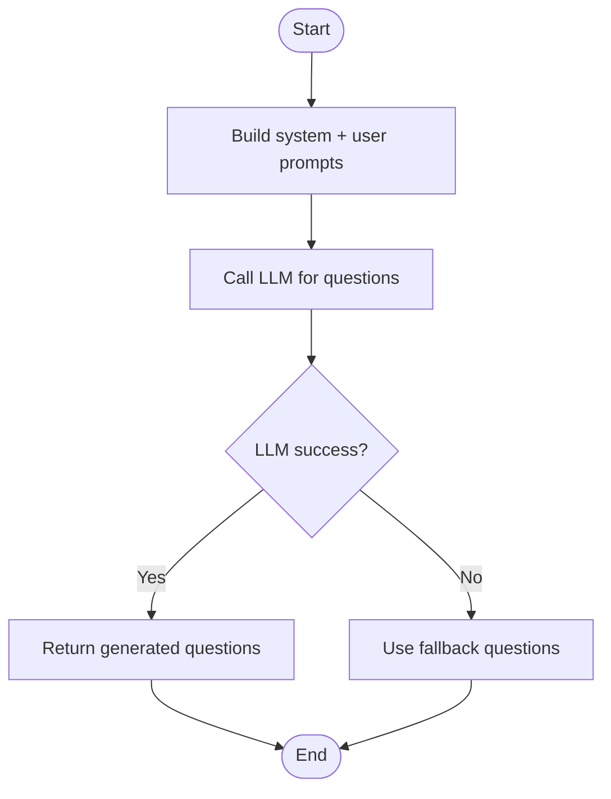
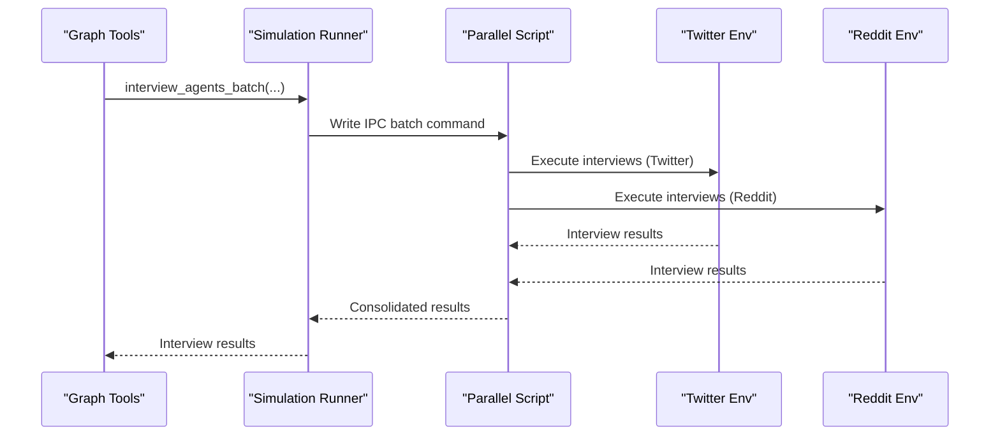
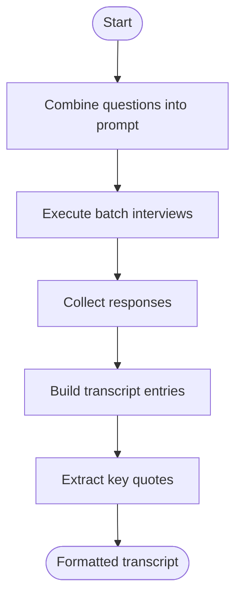
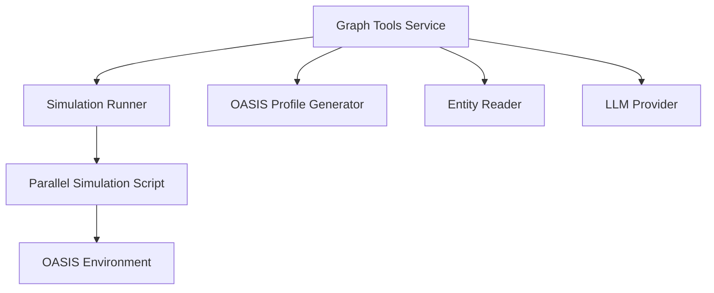

# Interview Agents Multi-Perspective Interview Tool

<cite>
**Referenced Files in This Document**
- [graph_tools.py](file://backend/app/services/graph_tools.py)
- [simulation_runner.py](file://backend/app/services/simulation_runner.py)
- [run_parallel_simulation.py](file://backend/scripts/run_parallel_simulation.py)
- [simulation.py](file://backend/app/api/simulation.py)
- [oasis_profile_generator.py](file://backend/app/services/oasis_profile_generator.py)
- [entity_reader.py](file://backend/app/services/entity_reader.py)
- [README.md](file://README.md)
</cite>

## Table of Contents
1. [Introduction](#introduction)
2. [Project Structure](#project-structure)
3. [Core Components](#core-components)
4. [Architecture Overview](#architecture-overview)
5. [Detailed Component Analysis](#detailed-component-analysis)
6. [Dependency Analysis](#dependency-analysis)
7. [Performance Considerations](#performance-considerations)
8. [Troubleshooting Guide](#troubleshooting-guide)
9. [Conclusion](#conclusion)

## Introduction
The Interview Agents tool enables multi-perspective interviews with simulated agents to gather diverse viewpoints and stakeholder opinions. It integrates with the broader Parallel World simulation framework to select relevant agents, generate targeted questions, execute interviews across Twitter and Reddit platforms, and consolidate insights into a comprehensive interview report. This document explains how the tool selects agents based on topic relevance, generates interview questions, processes agent responses, and produces a structured interview report with key quotes and summaries.

## Project Structure
The Interview Agents functionality spans several backend modules:
- Graph tools service: orchestrates agent selection, question generation, interview execution, and report consolidation
- Simulation runner: manages interview API calls to the running OASIS environment
- Parallel simulation script: implements the interview command handlers and dual-platform execution
- API endpoints: expose interview capabilities to clients
- Profile and entity services: provide agent profiles and entity context for selection

**Diagram sources**
- [graph_tools.py:1078-1200](file://backend/app/services/graph_tools.py#L1078-L1200)
- [simulation_runner.py:195-475](file://backend/app/services/simulation_runner.py#L195-L475)
- [run_parallel_simulation.py:217-602](file://backend/scripts/run_parallel_simulation.py#L217-L602)
- [oasis_profile_generator.py:141-202](file://backend/app/services/oasis_profile_generator.py#L141-L202)
- [entity_reader.py:69-133](file://backend/app/services/entity_reader.py#L69-L133)

**Section sources**
- [README.md:15-29](file://README.md#L15-L29)
- [graph_tools.py:1078-1200](file://backend/app/services/graph_tools.py#L1078-L1200)

## Core Components
- InterviewResult: Consolidates interview topic, selected agents, questions, responses, selection reasoning, and summary
- AgentInterview: Represents a single agent's interview response (agent_id, agent_name, agent_role, platform, response)
- Interview orchestration: Loads profiles, selects agents, generates questions, executes interviews, and builds the report
- Dual-platform interview execution: Simultaneously interviews agents on Twitter and Reddit via IPC

Key responsibilities:
- Agent selection: LLM-driven selection based on relevance, diversity, and role alignment
- Question generation: LLM-powered question creation aligned with the interview topic and selected agents
- Interview execution: Batch interviews across platforms with optimized prompts
- Response processing: Extracts responses, formats transcripts, and compiles key quotes
- Report generation: Produces a consolidated summary and interview transcript

**Section sources**
- [graph_tools.py:337-370](file://backend/app/services/graph_tools.py#L337-L370)
- [graph_tools.py:1078-1200](file://backend/app/services/graph_tools.py#L1078-L1200)
- [graph_tools.py:1367-1487](file://backend/app/services/graph_tools.py#L1367-L1487)

## Architecture Overview
The Interview Agents tool follows a layered architecture:
- Client initiates interviews via API endpoints
- Graph tools service orchestrates the interview pipeline
- Simulation runner coordinates with the running OASIS environment
- Parallel simulation script handles IPC commands and dual-platform interviews
- Results are stored in the simulation directory and returned to the client

**Diagram sources**
- [graph_tools.py:1078-1200](file://backend/app/services/graph_tools.py#L1078-L1200)
- [simulation_runner.py:195-475](file://backend/app/services/simulation_runner.py#L195-L475)
- [run_parallel_simulation.py:217-602](file://backend/scripts/run_parallel_simulation.py#L217-L602)

## Detailed Component Analysis

### InterviewResult and AgentInterview Data Structures
- InterviewResult: Holds the interview topic, selected agents, questions, responses, selection reasoning, and summary. Provides serialization to dictionary for API responses.
- AgentInterview: Captures agent identification, role, platform, and response content for transcript formatting.

**Diagram sources**
- [graph_tools.py:337-370](file://backend/app/services/graph_tools.py#L337-L370)

**Section sources**
- [graph_tools.py:337-370](file://backend/app/services/graph_tools.py#L337-L370)

### Agent Selection Reasoning Process
The tool uses an LLM to select agents based on:
- Topic relevance to the interview requirement
- Diversity of perspectives (supporters, opponents, neutrals, professionals)
- Roles directly related to the event
- Agent identity/profession alignment

Selection pipeline:
1. Load agent profiles and build a summary list
2. Construct system and user prompts for the LLM
3. Parse JSON response to obtain selected indices and reasoning
4. Map indices to complete agent information

**Diagram sources**
- [graph_tools.py:1367-1431](file://backend/app/services/graph_tools.py#L1367-L1431)

**Section sources**
- [graph_tools.py:1367-1431](file://backend/app/services/graph_tools.py#L1367-L1431)

### Interview Question Generation
Questions are generated using an LLM with:
- Interview requirement as context
- Simulation background for scenario grounding
- Selected agent roles to tailor questions

Generation pipeline:
1. Construct system prompt emphasizing direct text responses and structured answers
2. Build user prompt with interview requirement, simulation background, and agent roles
3. Call LLM to produce a list of 3–5 questions
4. Fallback to default questions if generation fails

**Diagram sources**
- [graph_tools.py:1464-1487](file://backend/app/services/graph_tools.py#L1464-L1487)

**Section sources**
- [graph_tools.py:1464-1487](file://backend/app/services/graph_tools.py#L1464-L1487)

### Interview Execution and Dual-Platform Processing
The tool executes interviews across Twitter and Reddit platforms:
- Optimized prompt prefix ensures agents respond directly in text without tool calls
- Batch interviews are executed simultaneously on both platforms
- Results are fetched from platform-specific databases and consolidated

**Diagram sources**
- [graph_tools.py:1154-1200](file://backend/app/services/graph_tools.py#L1154-L1200)
- [simulation_runner.py:195-475](file://backend/app/services/simulation_runner.py#L195-L475)
- [run_parallel_simulation.py:217-602](file://backend/scripts/run_parallel_simulation.py#L217-L602)

**Section sources**
- [graph_tools.py:1154-1200](file://backend/app/services/graph_tools.py#L1154-L1200)
- [run_parallel_simulation.py:317-415](file://backend/scripts/run_parallel_simulation.py#L317-L415)

### Interview Transcript Formatting System
The tool formats interview transcripts with:
- Structured question numbering
- Clear separation between answers
- Platform-specific attribution
- Key quote extraction for highlights

Formatting pipeline:
1. Combine questions into a single prompt with optimized prefix
2. Execute batch interviews and collect responses
3. Build transcript entries with agent role and platform
4. Extract key quotes from responses for report highlights

**Diagram sources**
- [graph_tools.py:1154-1200](file://backend/app/services/graph_tools.py#L1154-L1200)
- [run_parallel_simulation.py:517-558](file://backend/scripts/run_parallel_simulation.py#L517-L558)

**Section sources**
- [graph_tools.py:1154-1200](file://backend/app/services/graph_tools.py#L1154-L1200)
- [run_parallel_simulation.py:517-558](file://backend/scripts/run_parallel_simulation.py#L517-L558)

### Example Interview Scenarios
- Scenario 1: Understanding student perspectives on campus policy changes
  - Agent selection: Students, faculty, administrators, and student leaders
  - Questions: Focus on impact, proposed solutions, and community concerns
  - Output: Diverse viewpoints, key quotes, and a synthesized summary
- Scenario 2: Stakeholder analysis for a public health initiative
  - Agent selection: Health experts, government officials, NGOs, and citizens
  - Questions: Implementation challenges, benefits, and communication strategies
  - Output: Multi-stakeholder insights and actionable recommendations

[No sources needed since this section provides conceptual examples]

## Dependency Analysis
The Interview Agents tool depends on:
- Graph tools service for orchestration and report consolidation
- Simulation runner for API coordination with the OASIS environment
- Parallel simulation script for IPC-based interview execution
- Profile and entity services for agent context and filtering
- LLM provider for agent selection and question generation

**Diagram sources**
- [graph_tools.py:1078-1200](file://backend/app/services/graph_tools.py#L1078-L1200)
- [simulation_runner.py:195-475](file://backend/app/services/simulation_runner.py#L195-L475)
- [run_parallel_simulation.py:217-602](file://backend/scripts/run_parallel_simulation.py#L217-L602)
- [oasis_profile_generator.py:141-202](file://backend/app/services/oasis_profile_generator.py#L141-L202)
- [entity_reader.py:69-133](file://backend/app/services/entity_reader.py#L69-L133)

**Section sources**
- [graph_tools.py:1078-1200](file://backend/app/services/graph_tools.py#L1078-L1200)
- [simulation_runner.py:195-475](file://backend/app/services/simulation_runner.py#L195-L475)
- [run_parallel_simulation.py:217-602](file://backend/scripts/run_parallel_simulation.py#L217-L602)
- [oasis_profile_generator.py:141-202](file://backend/app/services/oasis_profile_generator.py#L141-L202)
- [entity_reader.py:69-133](file://backend/app/services/entity_reader.py#L69-L133)

## Performance Considerations
- Dual-platform interviews increase latency; the tool sets extended timeouts for batch operations
- LLM calls for selection and question generation are rate-limited; consider caching or batching
- Large-scale interviews benefit from parallel processing and efficient database queries
- Prompt optimization reduces unnecessary tool calls and improves response quality

[No sources needed since this section provides general guidance]

## Troubleshooting Guide
Common issues and resolutions:
- Simulation environment not running: The interview API requires a running OASIS environment; ensure the environment is active before calling interview endpoints
- Missing profile files: Verify that simulation preparation completed and profile files exist in the simulation directory
- Interview API failures: Check IPC command handling and platform availability; confirm that both Twitter and Reddit environments are initialized
- LLM generation failures: Retry with adjusted prompts or fallback to default questions

**Section sources**
- [graph_tools.py:1266-1287](file://backend/app/services/graph_tools.py#L1266-L1287)
- [simulation_runner.py:771-800](file://backend/app/services/simulation_runner.py#L771-L800)
- [run_parallel_simulation.py:560-602](file://backend/scripts/run_parallel_simulation.py#L560-L602)

## Conclusion
The Interview Agents tool provides a robust framework for gathering multi-perspective insights from simulated agents. By intelligently selecting agents, generating targeted questions, executing dual-platform interviews, and consolidating results into a structured report, it enhances predictive analysis and scenario evaluation with human-like perspectives and stakeholder viewpoints.

[No sources needed since this section summarizes without analyzing specific files]