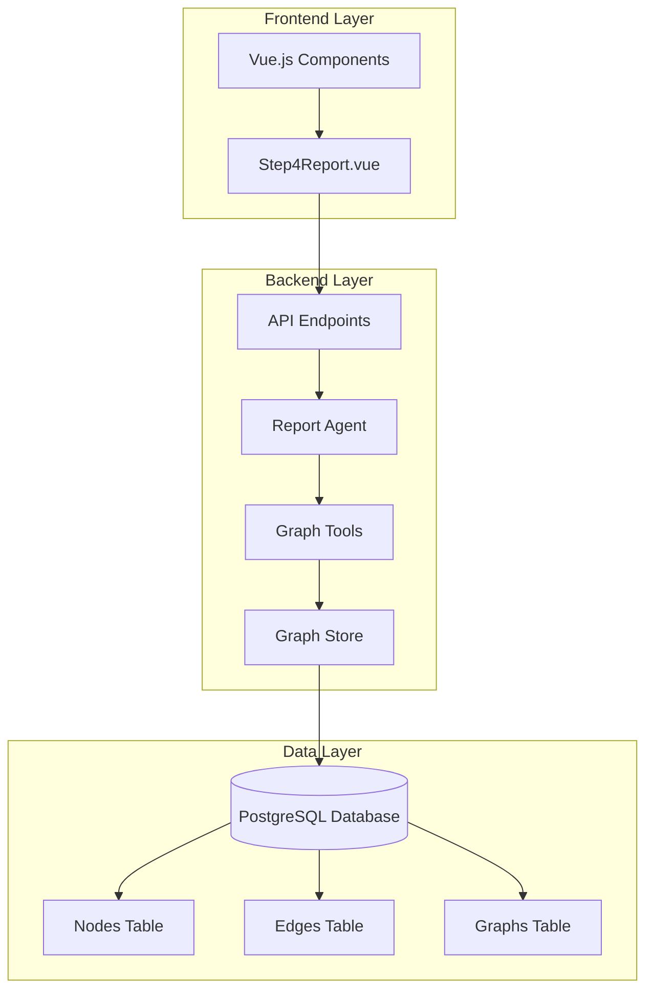
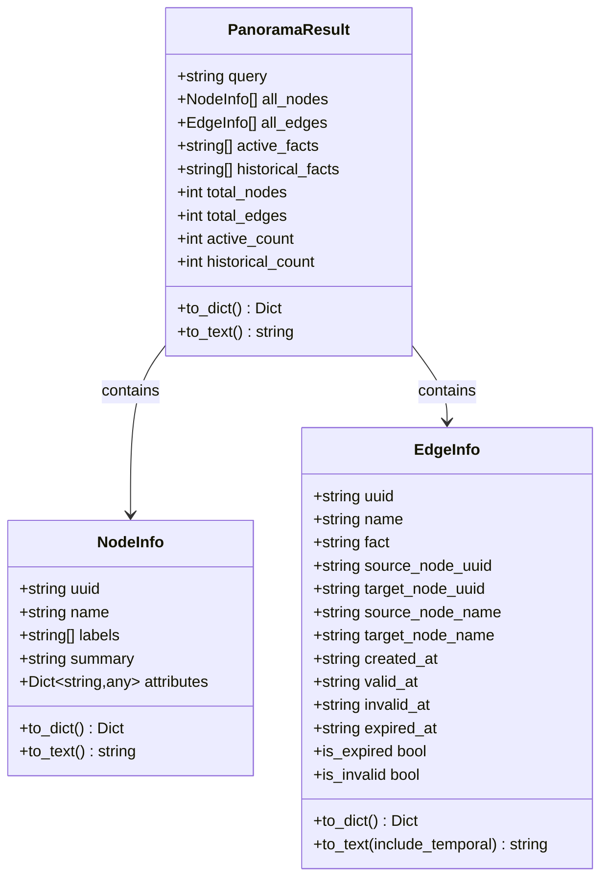
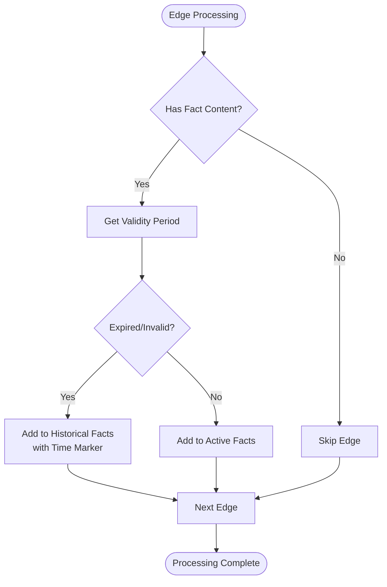
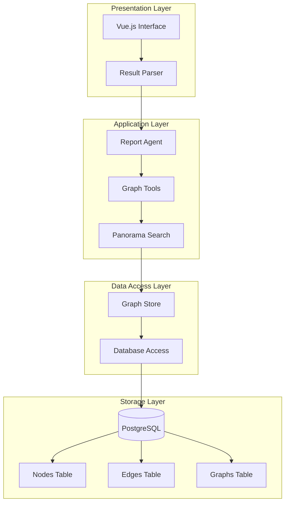
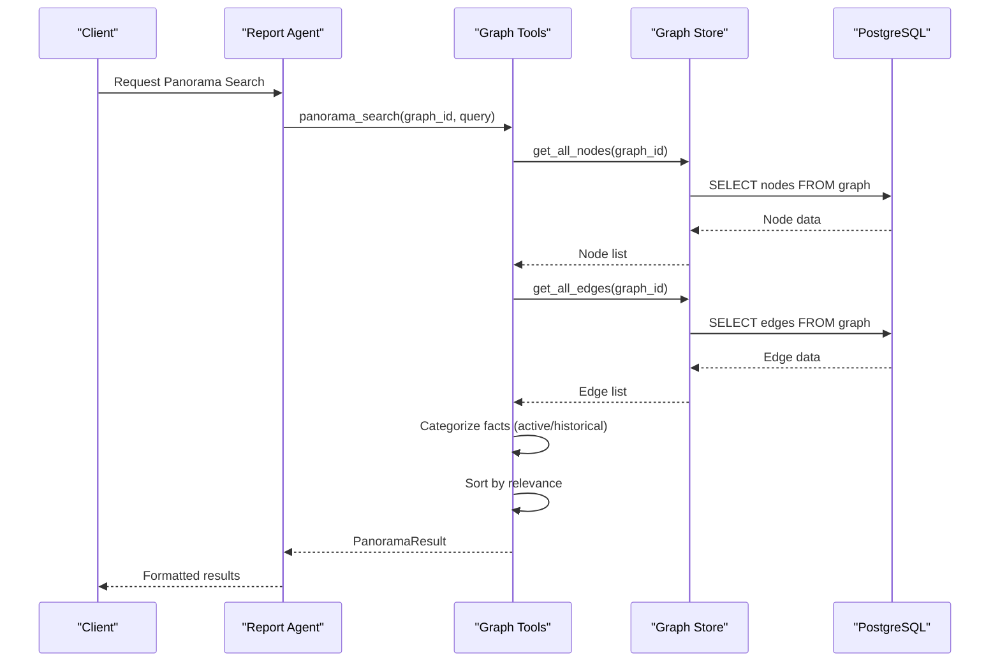
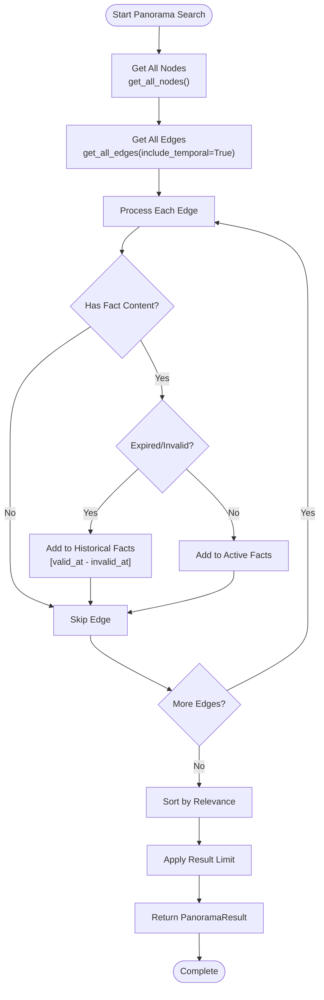
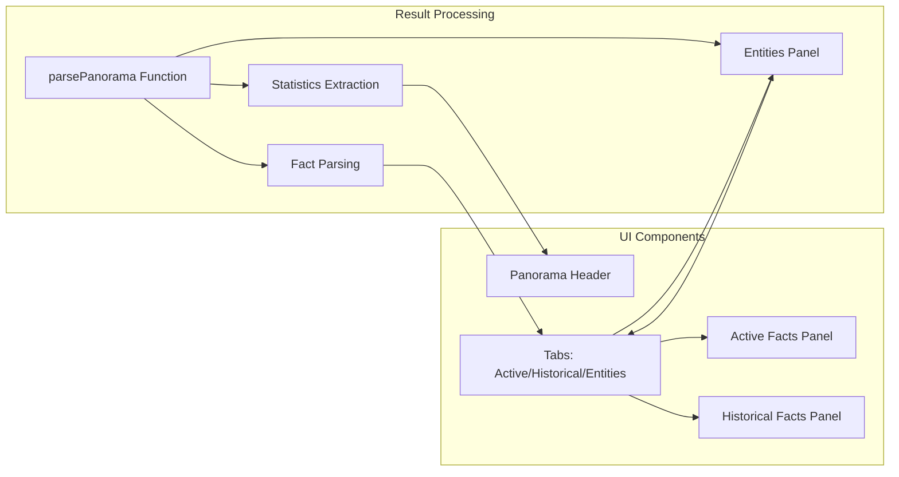
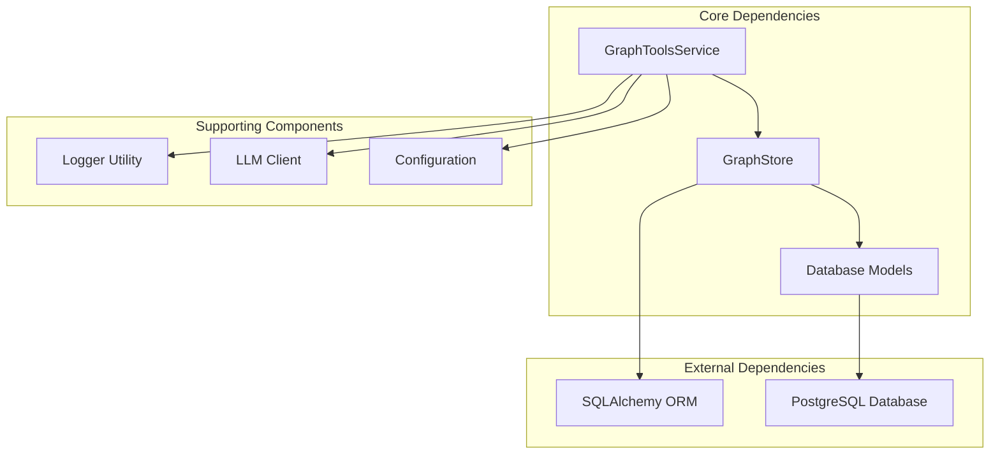
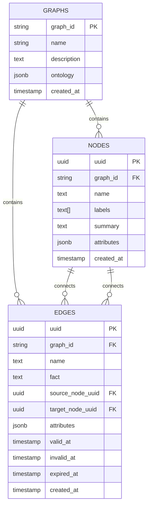

# Panorama Search Broad Search Tool

<cite>
**Referenced Files in This Document**
- [graph_tools.py](file://backend/app/services/graph_tools.py)
- [graph_store.py](file://backend/app/services/graph_store.py)
- [graph_db.py](file://backend/app/models/graph_db.py)
- [report_agent.py](file://backend/app/services/report_agent.py)
- [Step4Report.vue](file://frontend/src/components/Step4Report.vue)
- [README-EN.md](file://README-EN.md)
</cite>

## Table of Contents
1. [Introduction](#introduction)
2. [Project Structure](#project-structure)
3. [Core Components](#core-components)
4. [Architecture Overview](#architecture-overview)
5. [Detailed Component Analysis](#detailed-component-analysis)
6. [Dependency Analysis](#dependency-analysis)
7. [Performance Considerations](#performance-considerations)
8. [Troubleshooting Guide](#troubleshooting-guide)
9. [Conclusion](#conclusion)

## Introduction
Panorama Search is a comprehensive broad-search tool designed to provide the complete picture by retrieving all nodes, edges, active facts, and historical/expired facts from the knowledge graph. Unlike targeted search approaches, Panorama Search performs a breadth-first exploration of the entire graph to capture the full evolution of events and relationships. This makes it ideal for scenario analysis, historical trend identification, and comprehensive context gathering for report generation.

The tool distinguishes between currently active and historical information, enabling users to understand both current state and temporal evolution of the knowledge graph. Its ability to retrieve expired content alongside active facts provides crucial context for understanding how situations have developed over time.

## Project Structure
The Panorama Search implementation spans multiple layers of the application architecture:

**Diagram sources**
- [graph_tools.py:398-423](file://backend/app/services/graph_tools.py#L398-L423)
- [graph_store.py:21-28](file://backend/app/services/graph_store.py#L21-L28)
- [graph_db.py:24-86](file://backend/app/models/graph_db.py#L24-L86)

**Section sources**
- [README-EN.md:70-77](file://README-EN.md#L70-L77)
- [graph_tools.py:1-22](file://backend/app/services/graph_tools.py#L1-L22)

## Core Components

### PanoramaResult Data Structure
The PanoramaResult class serves as the central data container for Panorama Search results, providing a comprehensive view of the knowledge graph:

**Diagram sources**
- [graph_tools.py:211-279](file://backend/app/services/graph_tools.py#L211-L279)
- [graph_tools.py:54-133](file://backend/app/services/graph_tools.py#L54-L133)

The data structure provides four distinct categories of information:
- **All nodes**: Complete entity inventory with labels, summaries, and attributes
- **All edges**: Complete relationship network including temporal validity information
- **Active facts**: Currently valid statements and relationships
- **Historical facts**: Expired or invalid information with temporal markers

**Section sources**
- [graph_tools.py:211-279](file://backend/app/services/graph_tools.py#L211-L279)
- [graph_tools.py:54-133](file://backend/app/services/graph_tools.py#L54-L133)

### Temporal Filtering Mechanisms
Panorama Search implements sophisticated temporal filtering through the EdgeInfo class, which tracks validity periods and expiration:

**Diagram sources**
- [graph_tools.py:996-1016](file://backend/app/services/graph_tools.py#L996-L1016)

The temporal filtering system distinguishes between:
- **Active facts**: Edges without expiration or invalidation timestamps
- **Historical facts**: Edges marked as expired or invalid, with formatted time ranges

**Section sources**
- [graph_tools.py:88-133](file://backend/app/services/graph_tools.py#L88-L133)
- [graph_tools.py:996-1016](file://backend/app/services/graph_tools.py#L996-L1016)

## Architecture Overview

### System Architecture
Panorama Search operates within a multi-layered architecture that separates concerns between data access, business logic, and presentation:

**Diagram sources**
- [graph_tools.py:398-423](file://backend/app/services/graph_tools.py#L398-L423)
- [graph_store.py:21-28](file://backend/app/services/graph_store.py#L21-L28)
- [graph_db.py:24-86](file://backend/app/models/graph_db.py#L24-L86)

### Data Flow Architecture
The Panorama Search process follows a structured data flow pattern:

**Diagram sources**
- [graph_tools.py:951-1041](file://backend/app/services/graph_tools.py#L951-L1041)
- [graph_store.py:195-256](file://backend/app/services/graph_store.py#L195-L256)

**Section sources**
- [graph_tools.py:951-1041](file://backend/app/services/graph_tools.py#L951-L1041)
- [graph_store.py:195-256](file://backend/app/services/graph_store.py#L195-L256)

## Detailed Component Analysis

### Breadth-First Search Implementation
Panorama Search implements a comprehensive breadth-first approach that systematically explores the entire knowledge graph:

**Diagram sources**
- [graph_tools.py:977-1041](file://backend/app/services/graph_tools.py#L977-L1041)

The implementation ensures complete coverage by:
1. **Retrieving all nodes** regardless of their relationship status
2. **Collecting all edges** with temporal information preserved
3. **Categorizing facts** based on validity timestamps
4. **Applying relevance scoring** using query keywords
5. **Maintaining result limits** for usability

**Section sources**
- [graph_tools.py:951-1041](file://backend/app/services/graph_tools.py#L951-L1041)

### Temporal Information Management
The EdgeInfo class provides comprehensive temporal tracking essential for historical analysis:

| Property | Purpose | Example Value |
|----------|---------|---------------|
| `uuid` | Unique identifier | `"550e8400-e29b-41d4-a716-446655440000"` |
| `name` | Relationship type | `"WORKS_AT"` |
| `fact` | Statement content | `"Alice works at Tech Corp"` |
| `source_node_uuid` | Origin entity | `"b3a5c2d1-f4e6-7890-a1b2-c3d4e5f67890"` |
| `target_node_uuid` | Destination entity | `"f0e9d8c7-b6a5-4321-fedc-ba9876543210"` |
| `created_at` | Creation timestamp | `"2024-01-15T10:30:00Z"` |
| `valid_at` | Validity start | `"2024-01-15T10:30:00Z"` |
| `invalid_at` | Invalidity timestamp | `"2024-03-20T14:15:00Z"` |
| `expired_at` | Expiration timestamp | `"2024-06-01T00:00:00Z"` |

**Section sources**
- [graph_tools.py:88-133](file://backend/app/services/graph_tools.py#L88-L133)

### Frontend Integration and Display
The frontend provides comprehensive visualization of Panorama Search results through specialized components:

**Diagram sources**
- [Step4Report.vue:625-685](file://frontend/src/components/Step4Report.vue#L625-L685)
- [Step4Report.vue:1132-1215](file://frontend/src/components/Step4Report.vue#L1132-L1215)

**Section sources**
- [Step4Report.vue:625-685](file://frontend/src/components/Step4Report.vue#L625-L685)
- [Step4Report.vue:1132-1215](file://frontend/src/components/Step4Report.vue#L1132-L1215)

## Dependency Analysis

### Component Dependencies
The Panorama Search implementation demonstrates clear separation of concerns with well-defined dependencies:

**Diagram sources**
- [graph_tools.py:16-21](file://backend/app/services/graph_tools.py#L16-L21)
- [graph_store.py:12-16](file://backend/app/services/graph_store.py#L12-L16)
- [graph_db.py:19-21](file://backend/app/models/graph_db.py#L19-L21)

### Data Model Relationships
The underlying database schema supports the Panorama Search functionality through well-designed relationships:

**Diagram sources**
- [graph_db.py:24-86](file://backend/app/models/graph_db.py#L24-L86)

**Section sources**
- [graph_tools.py:16-21](file://backend/app/services/graph_tools.py#L16-L21)
- [graph_store.py:12-16](file://backend/app/services/graph_store.py#L12-L16)
- [graph_db.py:24-86](file://backend/app/models/graph_db.py#L24-L86)

## Performance Considerations

### Scalability Challenges
Panorama Search faces several performance challenges due to its comprehensive nature:

1. **Memory Usage**: Retrieving all nodes and edges can consume significant memory for large graphs
2. **Processing Time**: Sorting and categorizing thousands of edges takes considerable time
3. **Database Load**: Full-table scans of nodes and edges strain database resources
4. **Network Bandwidth**: Large result sets require efficient serialization

### Optimization Strategies
Several optimization approaches can improve performance:

- **Pagination**: Implement pagination for node and edge retrieval
- **Caching**: Cache frequently accessed graph statistics
- **Asynchronous Processing**: Process large queries asynchronously
- **Result Limiting**: Apply reasonable limits to prevent overwhelming result sets
- **Index Optimization**: Ensure proper indexing on temporal fields

### Memory Management
The implementation includes safeguards against excessive memory usage:
- Results are limited by configurable parameters
- Fact lists are truncated to prevent memory overflow
- Pagination is supported in the underlying data access layer

## Troubleshooting Guide

### Common Issues and Solutions

#### Empty Results
**Symptoms**: Panorama Search returns minimal or empty results
**Causes**: 
- No edges found in the graph
- Query terms don't match any facts
- Graph contains only nodes without relationships

**Solutions**:
- Verify graph construction completed successfully
- Check that edges contain factual content
- Adjust query terms to broader keywords

#### Performance Degradation
**Symptoms**: Slow response times with large graphs
**Causes**:
- Excessive node/edge counts
- Insufficient system resources
- Database performance issues

**Solutions**:
- Implement result limits
- Optimize database indexes
- Consider asynchronous processing
- Monitor system resource usage

#### Memory Exhaustion
**Symptoms**: Out-of-memory errors during processing
**Causes**:
- Very large graphs with millions of edges
- Insufficient system RAM
- Inefficient result handling

**Solutions**:
- Reduce result limits
- Implement streaming processing
- Optimize data structures
- Increase system resources

### Debugging Tools
The system provides comprehensive logging for troubleshooting:

- **Detailed Logging**: Every major operation logs its progress
- **Error Tracking**: Exceptions are caught and logged with context
- **Performance Metrics**: Timing information helps identify bottlenecks
- **Result Validation**: Automated checks ensure data integrity

**Section sources**
- [graph_tools.py:977-1041](file://backend/app/services/graph_tools.py#L977-L1041)

## Conclusion

Panorama Search represents a powerful comprehensive search tool that provides complete visibility into knowledge graph evolution. Its ability to retrieve all nodes, edges, active facts, and historical information makes it indispensable for scenario analysis, historical trend identification, and comprehensive context gathering.

The tool's strength lies in its systematic approach to knowledge discovery, where breadth-first exploration ensures no relevant information is missed. The temporal filtering mechanisms provide crucial context about how information has evolved over time, distinguishing between current state and historical records.

For report generation, Panorama Search serves as an invaluable foundation, providing the complete background information needed to understand complex scenarios fully. Its integration with the broader Parallel World ecosystem enables comprehensive analysis that combines automated insights with human expertise.

The implementation demonstrates robust engineering practices with clear separation of concerns, comprehensive error handling, and scalable architecture. While performance considerations are important for very large graphs, the tool's design provides multiple optimization opportunities to maintain effectiveness across different scales of knowledge graphs.