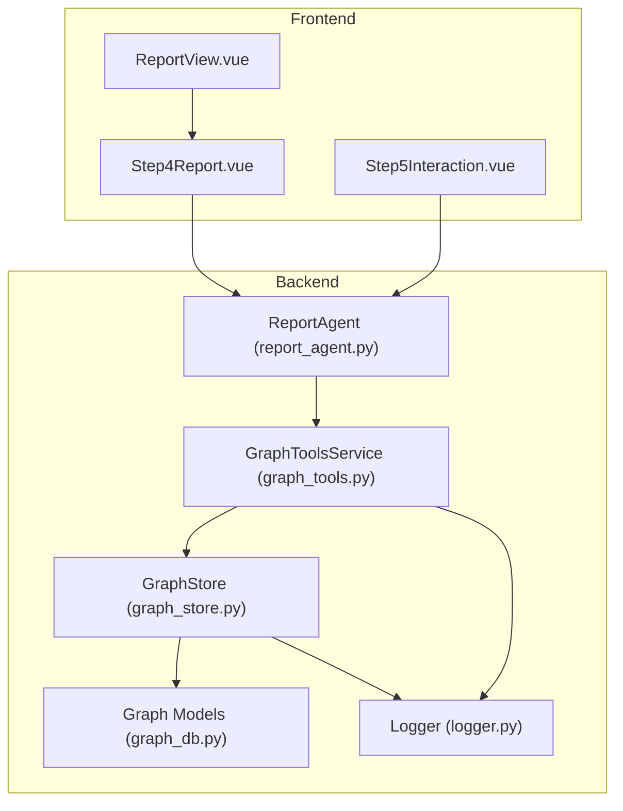
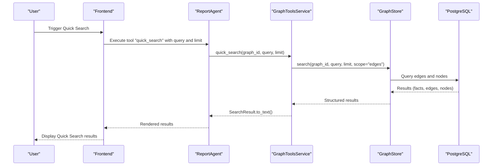
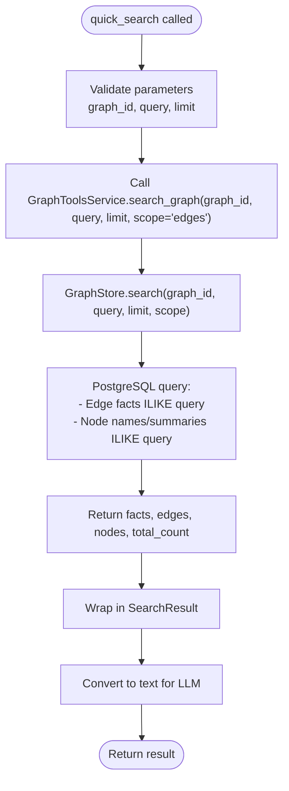
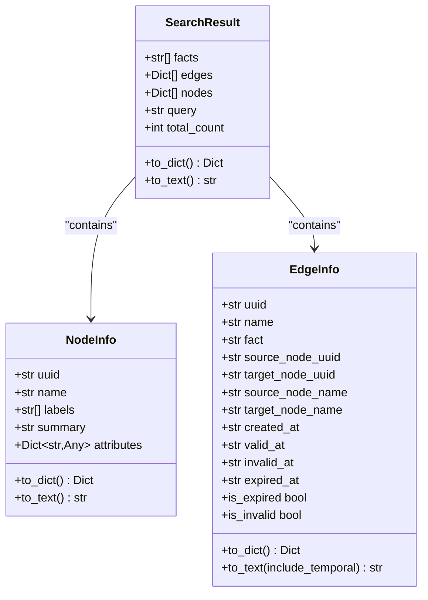
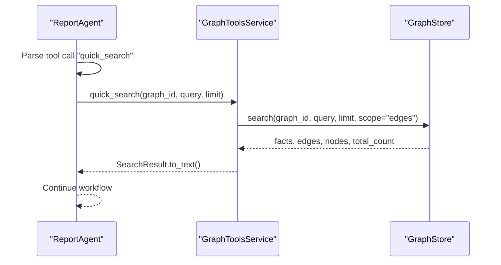
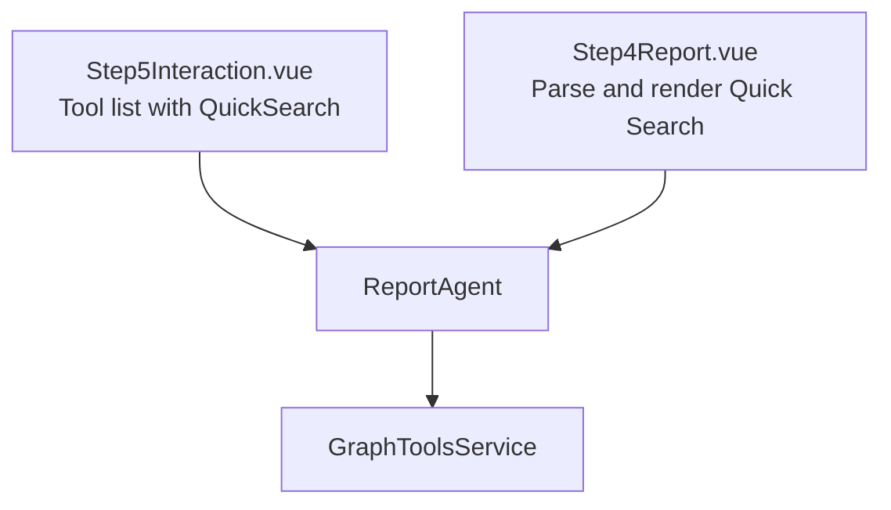
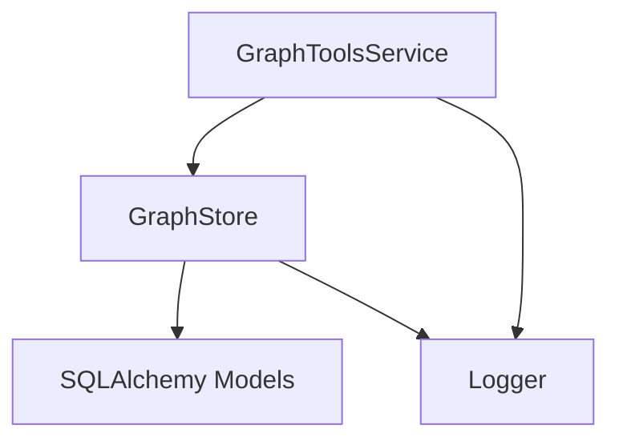

# Quick Search Simple Information Retrieval Tool

<cite>
**Referenced Files in This Document**
- [README.md](file://README.md)
- [graph_tools.py](file://backend/app/services/graph_tools.py)
- [graph_store.py](file://backend/app/services/graph_store.py)
- [graph_db.py](file://backend/app/models/graph_db.py)
- [report_agent.py](file://backend/app/services/report_agent.py)
- [Step5Interaction.vue](file://frontend/src/components/Step5Interaction.vue)
- [Step4Report.vue](file://frontend/src/components/Step4Report.vue)
- [ReportView.vue](file://frontend/src/views/ReportView.vue)
- [logger.py](file://backend/app/utils/logger.py)
</cite>

## Table of Contents
1. [Introduction](#introduction)
2. [Project Structure](#project-structure)
3. [Core Components](#core-components)
4. [Architecture Overview](#architecture-overview)
5. [Detailed Component Analysis](#detailed-component-analysis)
6. [Dependency Analysis](#dependency-analysis)
7. [Performance Considerations](#performance-considerations)
8. [Troubleshooting Guide](#troubleshooting-guide)
9. [Conclusion](#conclusion)

## Introduction
Quick Search is a fast and efficient information retrieval tool designed for rapid access to relevant facts and relationships within a knowledge graph. It focuses on speed and simplicity, delivering targeted results from edge facts and node attributes with minimal overhead. Compared to deeper retrieval tools like InsightForge and PanoramaSearch, Quick Search prioritizes low-latency responses for straightforward queries, making it ideal for initial information gathering and as a first-pass filter in multi-step analysis workflows.

Quick Search integrates seamlessly into the broader tool selection system used by the Report Agent. It serves as a foundational retrieval primitive that can be combined with other tools to build comprehensive analysis pipelines. Its results are formatted consistently for downstream consumption by the report generation system and rendered in the frontend for quick inspection.

## Project Structure
The Quick Search implementation spans backend services and frontend components:
- Backend services handle graph search, result formatting, and integration with the Report Agent.
- Frontend components render Quick Search results and integrate the tool into the user workflow.
- Logging ensures observability of search operations.

**Diagram sources**
- [report_agent.py:994-1005](file://backend/app/services/report_agent.py#L994-L1005)
- [graph_tools.py:431-460](file://backend/app/services/graph_tools.py#L431-L460)
- [graph_store.py:259-316](file://backend/app/services/graph_store.py#L259-L316)
- [graph_db.py:24-105](file://backend/app/models/graph_db.py#L24-L105)
- [logger.py:30-88](file://backend/app/utils/logger.py#L30-L88)

**Section sources**
- [README.md:70-76](file://README.md#L70-L76)
- [graph_tools.py:398-423](file://backend/app/services/graph_tools.py#L398-L423)
- [report_agent.py:994-1005](file://backend/app/services/report_agent.py#L994-L1005)

## Core Components
- GraphToolsService: Provides the quick_search method and wraps graph operations. It delegates to GraphStore for search and formats results into SearchResult objects.
- GraphStore: Implements PostgreSQL-backed search across edges and nodes, returning facts, edges, and nodes with counts.
- SearchResult: Standardized result container with facts, edges, nodes, query, and total_count, plus conversion helpers for LLM-friendly text.
- ReportAgent: Exposes quick_search as a tool callable by the agent, forwarding parameters and converting results to text.
- Frontend components: Render Quick Search results and present them alongside other tools in the workflow.

Key responsibilities:
- Fast retrieval: Direct search against edge facts and node names/summaries.
- Lightweight processing: Minimal post-processing to preserve speed.
- Consistent output: Structured results suitable for report generation and human review.

**Section sources**
- [graph_tools.py:431-460](file://backend/app/services/graph_tools.py#L431-L460)
- [graph_tools.py:1043-1076](file://backend/app/services/graph_tools.py#L1043-L1076)
- [graph_store.py:259-316](file://backend/app/services/graph_store.py#L259-L316)
- [report_agent.py:994-1005](file://backend/app/services/report_agent.py#L994-L1005)

## Architecture Overview
Quick Search follows a layered architecture:
- Presentation layer: Frontend components render results and integrate tool usage into the workflow.
- Application layer: ReportAgent orchestrates tool execution and manages tool selection.
- Service layer: GraphToolsService encapsulates retrieval logic and result formatting.
- Data access layer: GraphStore executes PostgreSQL queries and returns structured results.
- Persistence layer: SQLAlchemy models define graph entities and relationships.

**Diagram sources**
- [report_agent.py:994-1005](file://backend/app/services/report_agent.py#L994-L1005)
- [graph_tools.py:1043-1076](file://backend/app/services/graph_tools.py#L1043-L1076)
- [graph_store.py:259-316](file://backend/app/services/graph_store.py#L259-L316)

## Detailed Component Analysis

### Quick Search Implementation
Quick Search is implemented as a thin wrapper around the existing graph search functionality. It:
- Calls GraphToolsService.search_graph with scope set to "edges".
- Returns a SearchResult object containing facts, edges, nodes, query, and total_count.
- Converts results to text via SearchResult.to_text for LLM consumption.

**Diagram sources**
- [graph_tools.py:1043-1076](file://backend/app/services/graph_tools.py#L1043-L1076)
- [graph_tools.py:431-460](file://backend/app/services/graph_tools.py#L431-L460)
- [graph_store.py:259-316](file://backend/app/services/graph_store.py#L259-L316)

**Section sources**
- [graph_tools.py:1043-1076](file://backend/app/services/graph_tools.py#L1043-L1076)
- [graph_tools.py:431-460](file://backend/app/services/graph_tools.py#L431-L460)
- [graph_store.py:259-316](file://backend/app/services/graph_store.py#L259-L316)

### Result Format and Rendering
Quick Search returns a standardized SearchResult with:
- facts: List of relevant facts extracted from edge facts and node summaries.
- edges: List of related edges with identifiers and relationship names.
- nodes: List of related nodes with identifiers, labels, and summaries.
- query: Original search query.
- total_count: Total number of facts found.

Frontend parsing extracts:
- Search query and result count.
- Facts list.
- Optional edges and nodes when present.

Rendering displays:
- Header with query and result count.
- Tabs for Facts, Relations, and Nodes when available.
- Expandable lists for facts with initial truncation.

**Diagram sources**
- [graph_tools.py:24-52](file://backend/app/services/graph_tools.py#L24-L52)
- [graph_tools.py:54-76](file://backend/app/services/graph_tools.py#L54-L76)
- [graph_tools.py:78-133](file://backend/app/services/graph_tools.py#L78-L133)

**Section sources**
- [graph_tools.py:24-52](file://backend/app/services/graph_tools.py#L24-L52)
- [graph_tools.py:54-76](file://backend/app/services/graph_tools.py#L54-L76)
- [graph_tools.py:78-133](file://backend/app/services/graph_tools.py#L78-L133)
- [Step4Report.vue:902-940](file://frontend/src/components/Step4Report.vue#L902-L940)
- [Step4Report.vue:1576-1658](file://frontend/src/components/Step4Report.vue#L1576-L1658)

### Integration with Tool Selection System
Quick Search is exposed as a tool within the Report Agent’s toolset. It is invoked by name and supports parameters:
- query: The search query string.
- limit: Maximum number of results to return.

The agent routes the tool call to GraphToolsService.quick_search, converts the result to text, and continues the workflow.

**Diagram sources**
- [report_agent.py:994-1005](file://backend/app/services/report_agent.py#L994-L1005)
- [graph_tools.py:1043-1076](file://backend/app/services/graph_tools.py#L1043-L1076)
- [graph_store.py:259-316](file://backend/app/services/graph_store.py#L259-L316)

**Section sources**
- [report_agent.py:994-1005](file://backend/app/services/report_agent.py#L994-L1005)
- [graph_tools.py:1043-1076](file://backend/app/services/graph_tools.py#L1043-L1076)

### Frontend Integration and User Experience
The frontend integrates Quick Search into:
- Step 5 Interaction: Presents QuickSearch Rapid Retrieval as a selectable tool with a concise description.
- Step 4 Report: Parses and renders Quick Search results, supporting tabs for facts, edges, and nodes.

**Diagram sources**
- [Step5Interaction.vue:191-201](file://frontend/src/components/Step5Interaction.vue#L191-L201)
- [Step4Report.vue:902-940](file://frontend/src/components/Step4Report.vue#L902-L940)
- [Step4Report.vue:1576-1658](file://frontend/src/components/Step4Report.vue#L1576-L1658)

**Section sources**
- [Step5Interaction.vue:191-201](file://frontend/src/components/Step5Interaction.vue#L191-L201)
- [Step4Report.vue:902-940](file://frontend/src/components/Step4Report.vue#L902-L940)
- [Step4Report.vue:1576-1658](file://frontend/src/components/Step4Report.vue#L1576-L1658)

## Dependency Analysis
Quick Search depends on:
- GraphToolsService.search_graph for unified search logic.
- GraphStore.search for PostgreSQL-backed retrieval.
- SQLAlchemy models for graph persistence.
- Logger for operational visibility.

**Diagram sources**
- [graph_tools.py:431-460](file://backend/app/services/graph_tools.py#L431-L460)
- [graph_store.py:259-316](file://backend/app/services/graph_store.py#L259-L316)
- [graph_db.py:24-105](file://backend/app/models/graph_db.py#L24-L105)
- [logger.py:30-88](file://backend/app/utils/logger.py#L30-L88)

**Section sources**
- [graph_tools.py:431-460](file://backend/app/services/graph_tools.py#L431-L460)
- [graph_store.py:259-316](file://backend/app/services/graph_store.py#L259-L316)
- [graph_db.py:24-105](file://backend/app/models/graph_db.py#L24-L105)
- [logger.py:30-88](file://backend/app/utils/logger.py#L30-L88)

## Performance Considerations
- Scope and limits: Quick Search searches edges by default with configurable limits, minimizing database load.
- Indexing: PostgreSQL indices on graph_id, node names, and edge facts improve query performance.
- Lightweight processing: Minimal post-processing preserves speed; results are returned as-is with counts.
- Frontend truncation: Initial fact list truncation reduces rendering overhead in the UI.

Recommendations:
- Use appropriate limit values based on use case to balance completeness and speed.
- Prefer edge-scoped queries for focused, discrete fact retrieval.
- Monitor logs for slow queries and adjust indices or query patterns as needed.

**Section sources**
- [graph_store.py:259-316](file://backend/app/services/graph_store.py#L259-L316)
- [graph_db.py:55-85](file://backend/app/models/graph_db.py#L55-L85)
- [logger.py:30-88](file://backend/app/utils/logger.py#L30-L88)

## Troubleshooting Guide
Common issues and resolutions:
- Empty results: Verify query keywords and graph content; ensure the graph contains relevant edges and nodes.
- Slow performance: Confirm PostgreSQL indices exist and consider reducing limit or refining query terms.
- Parsing failures: Ensure the result text format matches expectations; Quick Search outputs a standardized structure suitable for parsing.
- Logging: Use INFO-level logs to track search operations and troubleshoot execution paths.

Operational tips:
- Inspect logs for search queries and counts to validate behavior.
- Validate database connectivity and session management.
- Confirm tool invocation parameters (graph_id, query, limit) are correctly passed.

**Section sources**
- [logger.py:30-88](file://backend/app/utils/logger.py#L30-L88)
- [report_agent.py:994-1005](file://backend/app/services/report_agent.py#L994-L1005)
- [graph_tools.py:1043-1076](file://backend/app/services/graph_tools.py#L1043-L1076)

## Conclusion
Quick Search provides a fast, reliable mechanism for retrieving specific facts and relationships from a knowledge graph. By focusing on edge facts and node attributes with minimal processing, it enables rapid initial discovery and integrates smoothly into multi-step analysis workflows. Combined with other tools like InsightForge and PanoramaSearch, Quick Search forms a layered retrieval strategy that balances speed and depth, making it an essential component of the system’s information retrieval toolkit.