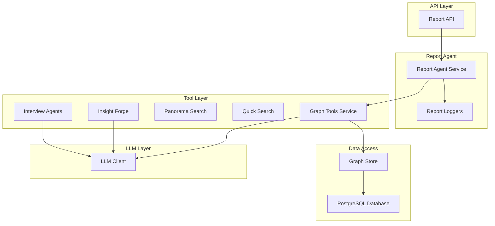
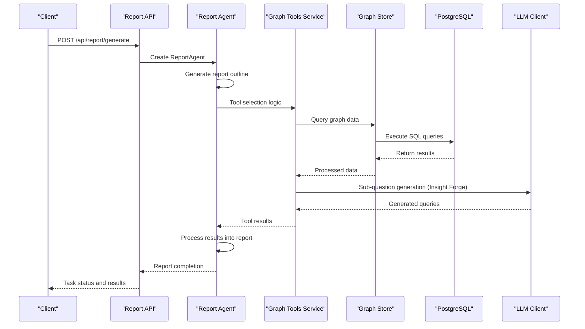
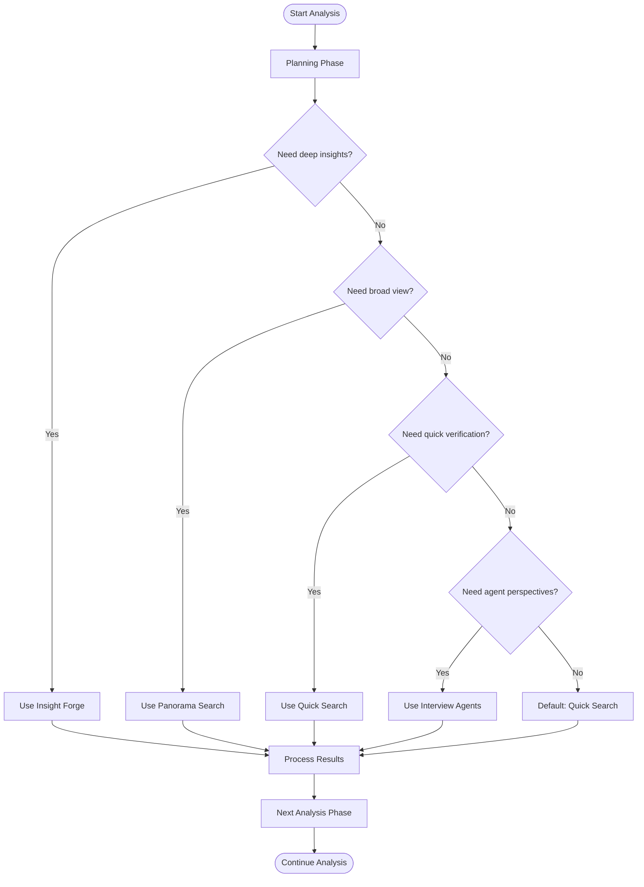
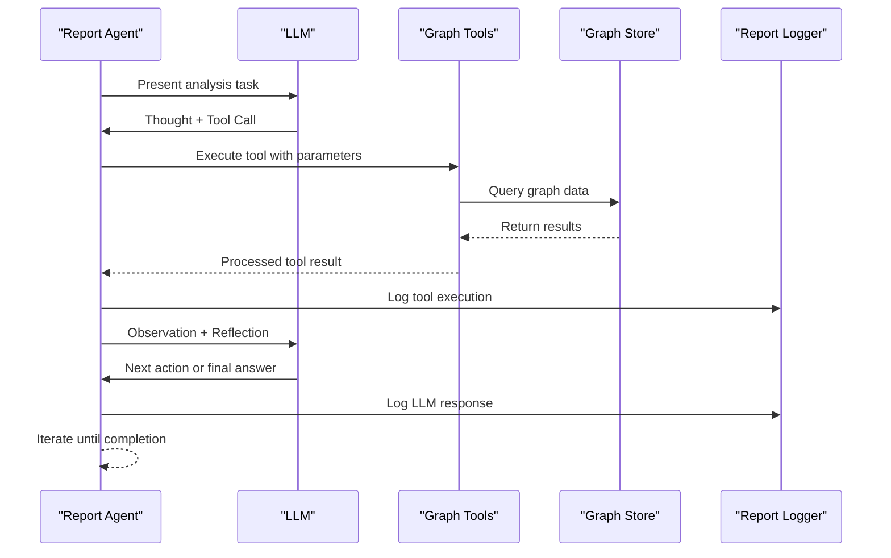
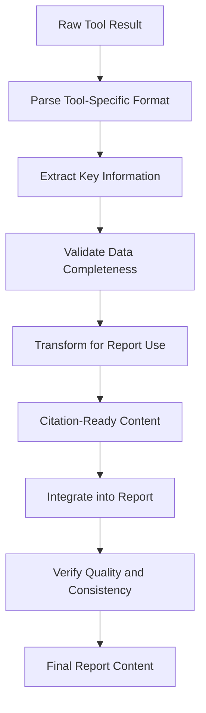
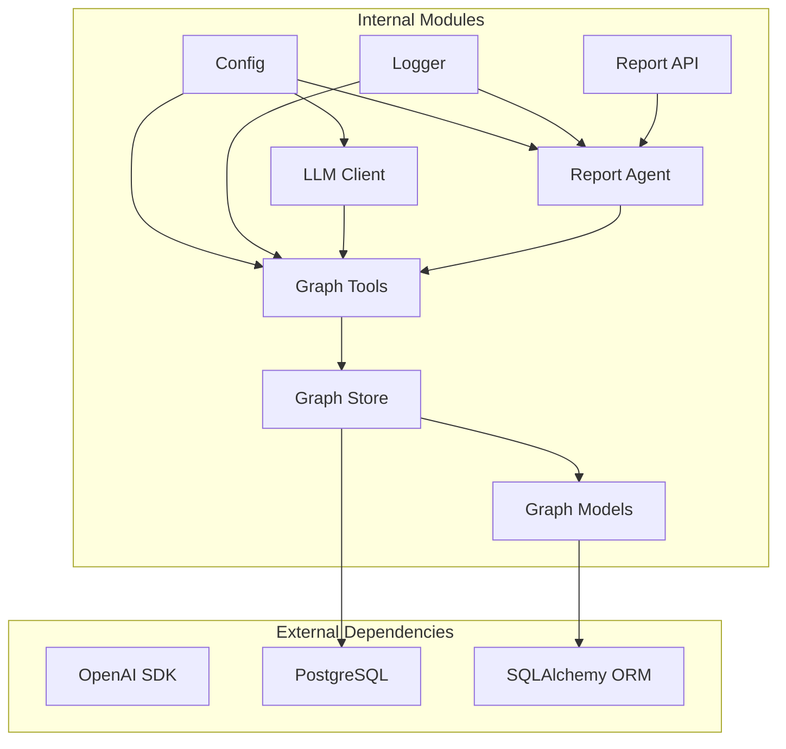

# Tool Integration System

<cite>
**Referenced Files in This Document**
- [report_agent.py](file://backend/app/services/report_agent.py)
- [graph_tools.py](file://backend/app/services/graph_tools.py)
- [graph_store.py](file://backend/app/services/graph_store.py)
- [llm_client.py](file://backend/app/utils/llm_client.py)
- [report.py](file://backend/app/api/report.py)
- [config.py](file://backend/app/config.py)
- [graph_db.py](file://backend/app/models/graph_db.py)
</cite>

## Table of Contents
1. [Introduction](#introduction)
2. [Project Structure](#project-structure)
3. [Core Components](#core-components)
4. [Architecture Overview](#architecture-overview)
5. [Detailed Component Analysis](#detailed-component-analysis)
6. [Dependency Analysis](#dependency-analysis)
7. [Performance Considerations](#performance-considerations)
8. [Troubleshooting Guide](#troubleshooting-guide)
9. [Conclusion](#conclusion)

## Introduction
This document describes the tool integration system that powers the Report Agent's capabilities. The system implements a ReACT (Reasoning and Acting) pattern to generate comprehensive simulation-based reports. It orchestrates four distinct tool categories:
- Insight Forge: Deep insight retrieval across multiple dimensions
- Panorama Search: Broad search for complete picture and evolution tracking
- Quick Search: Simple, fast information retrieval
- Interview Agents: Real agent interviews from the OASIS simulation environment

The system provides a robust tool description framework, intelligent tool selection logic, and a seamless tool calling mechanism integrated with the ReACT pattern. It ensures results are processed, interpreted, and integrated into report generation while maintaining detailed logging for transparency and debugging.

## Project Structure
The tool integration system spans several backend modules:
- Report Agent service: Orchestrates ReACT loops, manages tool selection, and integrates results
- Graph Tools service: Implements the four core retrieval tools and auxiliary utilities
- Graph Store: Unified data access layer for PostgreSQL-backed knowledge graph
- LLM Client: Unified OpenAI-compatible interface for reasoning tasks
- API Layer: Exposes endpoints for report generation, tool debugging, and agent interaction
- Configuration: Centralized settings for tool limits, temperatures, and environment variables

**Diagram sources**
- [report_agent.py:1-800](file://backend/app/services/report_agent.py#L1-L800)
- [graph_tools.py:398-1542](file://backend/app/services/graph_tools.py#L398-L1542)
- [graph_store.py:21-375](file://backend/app/services/graph_store.py#L21-L375)
- [llm_client.py:14-104](file://backend/app/utils/llm_client.py#L14-L104)
- [report.py:24-196](file://backend/app/api/report.py#L24-L196)

**Section sources**
- [report_agent.py:1-800](file://backend/app/services/report_agent.py#L1-L800)
- [graph_tools.py:1-1542](file://backend/app/services/graph_tools.py#L1-L1542)
- [graph_store.py:1-375](file://backend/app/services/graph_store.py#L1-L375)
- [llm_client.py:1-104](file://backend/app/utils/llm_client.py#L1-L104)
- [report.py:1-1016](file://backend/app/api/report.py#L1-L1016)
- [config.py:20-76](file://backend/app/config.py#L20-L76)

## Core Components
This section outlines the four main tool categories and their capabilities:

### Insight Forge (Deep Insight Retrieval)
A powerful hybrid retrieval tool that:
- Automatically decomposes complex queries into multiple sub-questions using LLM reasoning
- Performs semantic search across edges for each sub-question
- Extracts related entities and retrieves detailed node information
- Traces relationship chains to build comprehensive insights
- Consolidates results into a unified analysis report

Key features:
- Multi-dimensional analysis covering facts, entities, and relationships
- Automatic sub-question generation with configurable limits
- Comprehensive result aggregation with statistics tracking
- Full-text output without truncation for report citations

### Panorama Search (Breadth Search)
A broad search tool designed to capture the complete picture:
- Retrieves all related nodes and edges in the graph
- Distinguishes between currently active and historical/expired facts
- Provides timeline and evolution context for events
- Categorizes and sorts results by relevance to the query

Key features:
- Includes expired/invalid content for historical context
- Time-aware edge processing with validity markers
- Relevance scoring based on query keywords
- Complete entity and relationship inventory

### Quick Search (Simple Information Retrieval)
A lightweight, fast retrieval tool:
- Direct semantic search against edge facts
- Optimized for simple, direct information queries
- Minimal processing overhead for rapid feedback
- Suitable for verification and confirmation tasks

Key features:
- Streamlined search pipeline
- Configurable result limits
- Edge-focused semantic matching
- Fast response times for iterative refinement

### Interview Agents (Real Agent Interviews)
A specialized tool that connects to the OASIS simulation environment:
- Reads agent profile files to understand available personas
- Uses LLM to intelligently select relevant agents based on interview requirements
- Generates or accepts custom interview questions
- Calls the real OASIS interview API for dual-platform simultaneous interviews
- Consolidates results into a comprehensive multi-perspective analysis

Key features:
- Dual-platform (Twitter and Reddit) simultaneous interviews
- Automated agent selection with reasoning explanations
- Structured question generation with LLM assistance
- Real-time API integration with error handling and fallbacks

**Section sources**
- [graph_tools.py:751-1542](file://backend/app/services/graph_tools.py#L751-L1542)
- [report_agent.py:473-548](file://backend/app/services/report_agent.py#L473-L548)

## Architecture Overview
The tool integration system follows a layered architecture with clear separation of concerns:

**Diagram sources**
- [report_agent.py:1-800](file://backend/app/services/report_agent.py#L1-L800)
- [graph_tools.py:398-1542](file://backend/app/services/graph_tools.py#L398-L1542)
- [graph_store.py:259-375](file://backend/app/services/graph_store.py#L259-L375)
- [report.py:24-196](file://backend/app/api/report.py#L24-L196)

The architecture emphasizes:
- Asynchronous report generation with progress tracking
- Modular tool services with clear interfaces
- Robust logging and monitoring throughout the pipeline
- Configurable tool limits and safety controls

## Detailed Component Analysis

### Tool Description System
The system provides comprehensive tool descriptions that inform users about capabilities and use cases:

```mermaid
classDiagram
class ToolDescription {
+string name
+string description
+string use_cases
+string return_content
+to_text() string
}
class InsightForgeDesc {
+name "Insight Forge"
+description "Deep Insight Retrieval - Powerful Retrieval Tool"
+use_cases "Need to deeply analyze a topic<br/>Need to understand multiple aspects<br/>Need to gather rich material"
+return_content "Relevant fact excerpts<br/>Core entity insights<br/>Relationship chain analysis"
}
class PanoramaDesc {
+name "Panorama Search"
+description "Broad Search - Get a Full Panorama View"
+use_cases "Need to understand complete development<br/>Need to compare public opinion changes<br/>Need comprehensive entity information"
+return_content "Currently valid facts<br/>Historical/expired facts<br/>All involved entities"
}
class QuickSearchDesc {
+name "Quick Search"
+description "Simple Search - Quick Retrieval"
+use_cases "Need to quickly find specific information<br/>Need to verify a fact<br/>Simple information retrieval"
+return_content "List of facts most relevant to query"
}
class InterviewDesc {
+name "Interview Agents"
+description "Deep Interview - Real Agent Interviews"
+use_cases "Need to understand event perspectives<br/>Collect opinions from multiple parties<br/>Get real responses from simulation Agents"
+return_content "Identity information<br/>Interview responses<br/>Key quotes<br/>Interview summary"
}
ToolDescription <|-- InsightForgeDesc
ToolDescription <|-- PanoramaDesc
ToolDescription <|-- QuickSearchDesc
ToolDescription <|-- InterviewDesc
```

**Diagram sources**
- [report_agent.py:473-548](file://backend/app/services/report_agent.py#L473-L548)

The tool descriptions guide users in selecting appropriate tools for different analysis scenarios and ensure transparency about expected outputs.

**Section sources**
- [report_agent.py:473-548](file://backend/app/services/report_agent.py#L473-L548)

### Tool Selection Logic
The system implements intelligent tool selection based on analysis phases and information needs:

The selection logic prioritizes:
- Depth-first exploration for complex topics using Insight Forge
- Broad context establishment with Panorama Search
- Rapid verification and confirmation with Quick Search
- Multi-perspective validation through Interview Agents

**Section sources**
- [report_agent.py:704-766](file://backend/app/services/report_agent.py#L704-L766)

### Tool Calling Mechanism (ReACT Pattern)
The system integrates tools seamlessly with the ReACT pattern:

**Diagram sources**
- [report_agent.py:793-800](file://backend/app/services/report_agent.py#L793-L800)
- [graph_tools.py:398-430](file://backend/app/services/graph_tools.py#L398-L430)

Key mechanisms:
- Structured tool call format with name and parameters
- Observation templates for result presentation
- Iterative ReACT loop with reflection
- Comprehensive logging for auditability

**Section sources**
- [report_agent.py:793-800](file://backend/app/services/report_agent.py#L793-L800)
- [graph_tools.py:398-430](file://backend/app/services/graph_tools.py#L398-L430)

### Tool Result Interpretation and Integration
The system processes tool results through structured interpretation:

Processing steps include:
- Fact extraction and entity identification
- Relationship chain construction
- Timeline and validity filtering
- Multi-platform result consolidation
- Quote extraction and formatting

**Section sources**
- [graph_tools.py:135-279](file://backend/app/services/graph_tools.py#L135-L279)
- [graph_tools.py:337-396](file://backend/app/services/graph_tools.py#L337-L396)

### Example Tool Combinations
Common analysis scenarios and recommended tool combinations:

**Scenario 1: Event Impact Analysis**
- Initial broad understanding: Panorama Search
- Deep causal investigation: Insight Forge (multiple sub-questions)
- Agent perspectives: Interview Agents
- Verification: Quick Search

**Scenario 2: Policy Evolution Tracking**
- Timeline comprehension: Panorama Search (include expired)
- Stakeholder analysis: Insight Forge (entity insights)
- Multi-party perspectives: Interview Agents
- Fact-checking: Quick Search

**Scenario 3: Rapid Situation Assessment**
- Quick facts: Quick Search
- Context verification: Panorama Search
- Expert opinions: Interview Agents
- Cross-validation: Insight Forge

## Dependency Analysis
The tool integration system exhibits well-defined dependencies:

**Diagram sources**
- [config.py:20-76](file://backend/app/config.py#L20-L76)
- [llm_client.py:14-104](file://backend/app/utils/llm_client.py#L14-L104)
- [graph_tools.py:16-21](file://backend/app/services/graph_tools.py#L16-L21)
- [graph_store.py:12-16](file://backend/app/services/graph_store.py#L12-L16)
- [graph_db.py:6-21](file://backend/app/models/graph_db.py#L6-L21)
- [report.py:11-18](file://backend/app/api/report.py#L11-L18)

Key dependency characteristics:
- Loose coupling between tool services and external APIs
- Centralized configuration management
- Clear separation between data access and business logic
- Modular design enabling independent testing and maintenance

**Section sources**
- [config.py:20-76](file://backend/app/config.py#L20-L76)
- [graph_tools.py:16-21](file://backend/app/services/graph_tools.py#L16-L21)
- [graph_store.py:12-16](file://backend/app/services/graph_store.py#L12-L16)
- [graph_db.py:6-21](file://backend/app/models/graph_db.py#L6-L21)
- [report.py:11-18](file://backend/app/api/report.py#L11-L18)

## Performance Considerations
The system incorporates several performance optimizations:

### Asynchronous Processing
- Long-running report generation runs in background threads
- Task-based progress tracking prevents UI blocking
- Incremental section generation allows early content delivery

### Tool Optimization Strategies
- Insight Forge uses LLM-driven sub-question decomposition to reduce search scope
- Panorama Search implements relevance scoring for efficient result ranking
- Quick Search employs minimal processing for rapid feedback
- Interview Agents use intelligent agent selection to minimize API calls

### Resource Management
- Configurable tool call limits prevent resource exhaustion
- Database connection pooling optimizes graph queries
- Result caching reduces redundant computations
- Memory-efficient streaming for large result sets

## Troubleshooting Guide
The system provides comprehensive logging and error handling:

### Common Issues and Solutions
**Tool Execution Failures**
- Check LLM API connectivity and credentials
- Verify database connectivity and permissions
- Review tool-specific error messages in agent logs

**Report Generation Delays**
- Monitor task progress endpoints
- Check database query performance
- Validate tool call frequency limits

**Interview Agent Failures**
- Confirm OASIS simulation environment status
- Verify agent profile availability
- Check interview API response formats

### Diagnostic Tools
The API exposes debugging endpoints:
- Graph search tool for manual testing
- Statistics endpoint for graph health checks
- Complete log streaming for real-time monitoring
- Incremental log retrieval for large datasets

**Section sources**
- [report.py:928-1016](file://backend/app/api/report.py#L928-L1016)
- [report_agent.py:292-304](file://backend/app/services/report_agent.py#L292-L304)

## Conclusion
The tool integration system represents a sophisticated approach to AI-powered report generation. By combining four specialized tools with intelligent selection logic and a robust ReACT pattern implementation, it enables comprehensive analysis of complex simulation environments. The system's modular design, extensive logging, and performance optimizations make it suitable for production deployment while maintaining flexibility for future enhancements.

The integration of real agent interviews through the OASIS environment adds unique value by providing authentic perspectives from simulated agents, enhancing the credibility and depth of generated reports. The comprehensive tool description system and structured result interpretation ensure transparency and reproducibility in the analysis process.