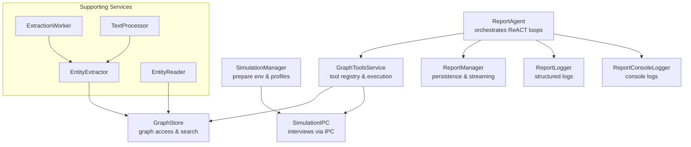
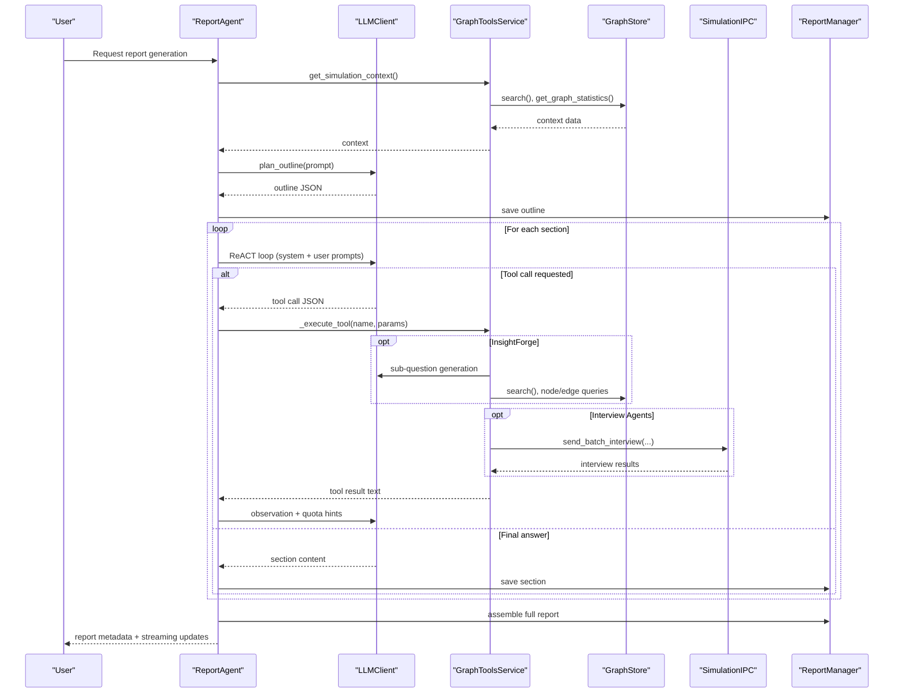
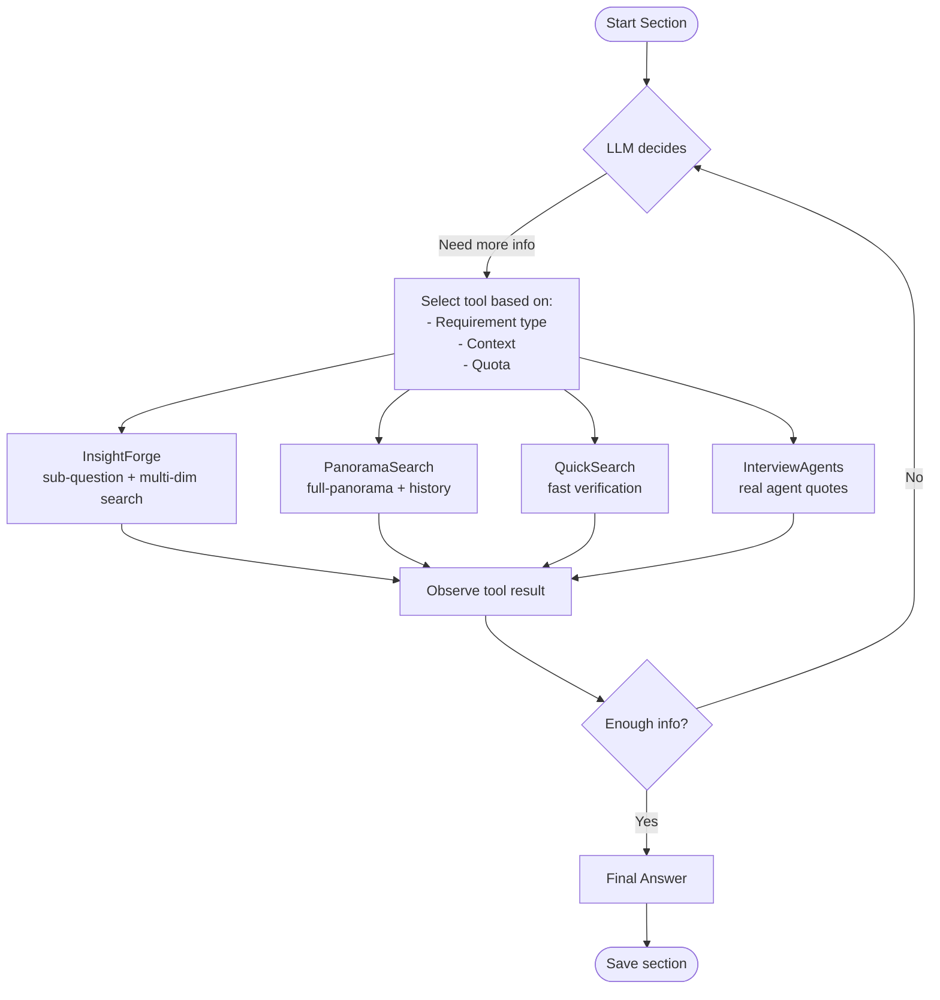
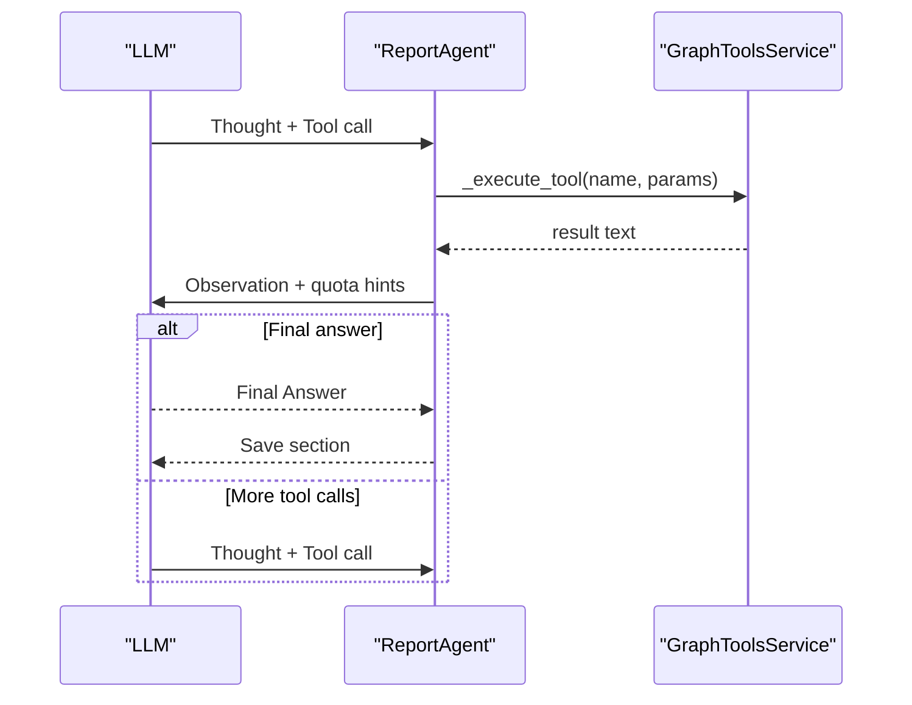
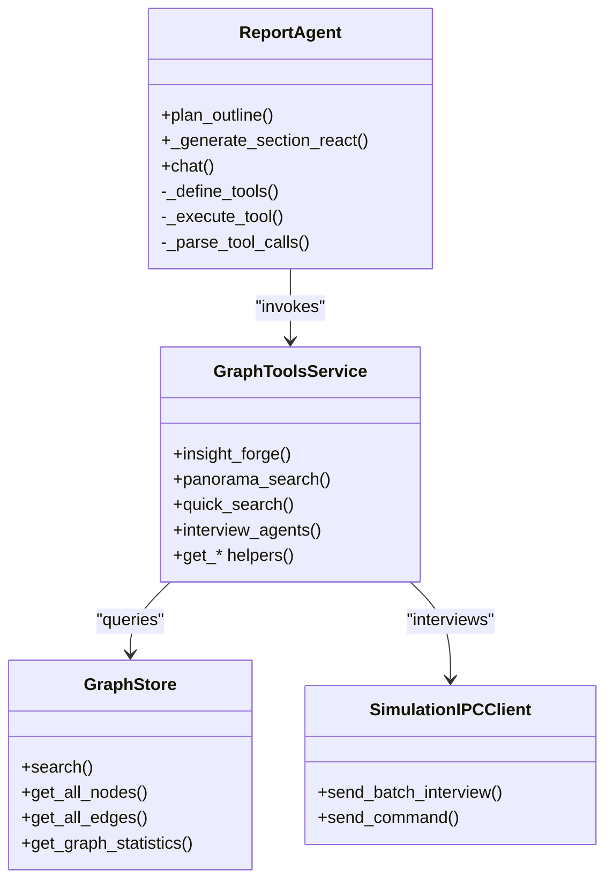
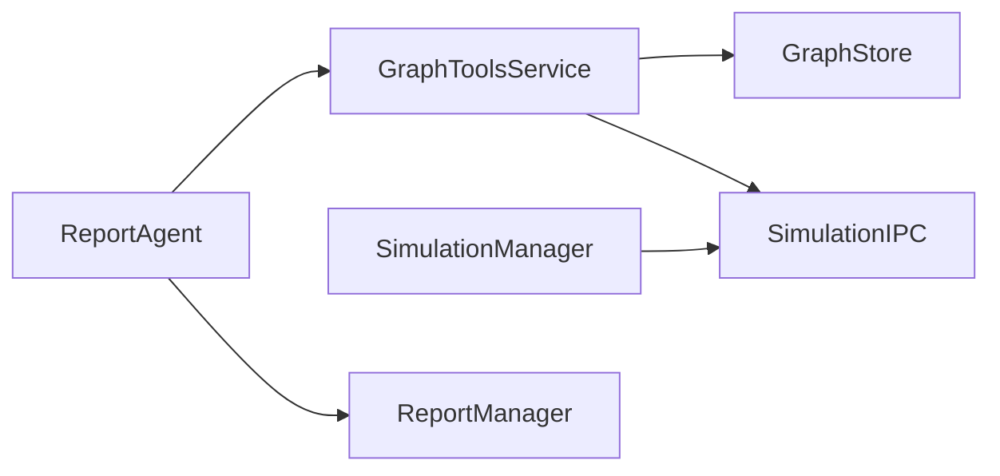

# Tool Selection Logic and Integration Patterns

<cite>
**Referenced Files in This Document**
- [report_agent.py](file://backend/app/services/report_agent.py)
- [graph_tools.py](file://backend/app/services/graph_tools.py)
- [graph_store.py](file://backend/app/services/graph_store.py)
- [simulation_ipc.py](file://backend/app/services/simulation_ipc.py)
- [simulation_manager.py](file://backend/app/services/simulation_manager.py)
- [entity_extractor.py](file://backend/app/services/entity_extractor.py)
- [entity_reader.py](file://backend/app/services/entity_reader.py)
- [extraction_worker.py](file://backend/app/services/extraction_worker.py)
- [text_processor.py](file://backend/app/services/text_processor.py)
</cite>

## Table of Contents
1. [Introduction](#introduction)
2. [Project Structure](#project-structure)
3. [Core Components](#core-components)
4. [Architecture Overview](#architecture-overview)
5. [Detailed Component Analysis](#detailed-component-analysis)
6. [Dependency Analysis](#dependency-analysis)
7. [Performance Considerations](#performance-considerations)
8. [Troubleshooting Guide](#troubleshooting-guide)
9. [Conclusion](#conclusion)

## Introduction
This document explains the tool selection logic and integration patterns used by the Report Agent system to coordinate multiple analysis tools within a multi-step, ReACT-driven workflow. It covers how the system decides which tool to use based on the current analysis phase, information requirements, and report context; how tools integrate to form coherent workflows; the ReACT pattern implementation; tool description and capability systems; error handling and fallback strategies; and performance optimization techniques.

## Project Structure
The Report Agent orchestrates a suite of retrieval and synthesis tools around a ReACT loop. The primary components are:
- ReportAgent: Orchestrator that plans outlines, executes ReACT loops per section, and manages logging and persistence.
- GraphToolsService: Provides the core retrieval tools (InsightForge, Panorama, Quick, Interview) backed by GraphStore.
- GraphStore: Unified access layer to the knowledge graph (nodes, edges, episodes, search).
- SimulationIPC: Inter-process communication bridge to the OASIS simulation environment for real agent interviews.
- SimulationManager: Prepares simulation environments and manages agent profiles and configuration.
- Supporting services: Entity extraction, entity reading, and text processing for preprocessing and enrichment.

**Diagram sources**
- [report_agent.py:864-1064](file://backend/app/services/report_agent.py#L864-L1064)
- [graph_tools.py:398-430](file://backend/app/services/graph_tools.py#L398-L430)
- [graph_store.py:21-375](file://backend/app/services/graph_store.py#L21-L375)
- [simulation_ipc.py:95-286](file://backend/app/services/simulation_ipc.py#L95-L286)
- [simulation_manager.py:114-529](file://backend/app/services/simulation_manager.py#L114-L529)

**Section sources**
- [report_agent.py:1-120](file://backend/app/services/report_agent.py#L1-L120)
- [graph_tools.py:1-40](file://backend/app/services/graph_tools.py#L1-L40)

## Core Components
- ReportAgent: Implements ReACT reasoning and acting, maintains tool definitions, parses tool calls, enforces quotas, and logs detailed actions.
- GraphToolsService: Exposes four retrieval tools and auxiliary graph operations; integrates LLMs for sub-question decomposition and multi-dimensional analysis.
- GraphStore: Provides graph search, node/edge CRUD, statistics, and full-text search across facts and summaries.
- SimulationIPC/SimulationManager: Enable real-time interviews with simulation agents across Twitter and Reddit platforms.
- ReportManager: Handles persistence, streaming updates, and assembling final reports.

**Section sources**
- [report_agent.py:864-1064](file://backend/app/services/report_agent.py#L864-L1064)
- [graph_tools.py:398-750](file://backend/app/services/graph_tools.py#L398-L750)
- [graph_store.py:258-350](file://backend/app/services/graph_store.py#L258-L350)
- [simulation_ipc.py:95-286](file://backend/app/services/simulation_ipc.py#L95-L286)
- [simulation_manager.py:114-200](file://backend/app/services/simulation_manager.py#L114-L200)

## Architecture Overview
The system coordinates three major phases:
1. Planning: Uses LLM to generate a report outline based on simulation context.
2. Generation: Executes ReACT loops per section, invoking tools to gather evidence and synthesize content.
3. Reflection: Validates content completeness and accuracy; persists progress and final report.

**Diagram sources**
- [report_agent.py:1136-1738](file://backend/app/services/report_agent.py#L1136-L1738)
- [graph_tools.py:749-1064](file://backend/app/services/graph_tools.py#L749-L1064)
- [simulation_ipc.py:117-252](file://backend/app/services/simulation_ipc.py#L117-L252)

## Detailed Component Analysis

### Tool Selection Logic
- Phase-based selection:
  - Planning: Uses get_simulation_context to prime LLM with graph statistics and related facts.
  - Generation: Per section, the LLM decides whether to call tools or produce final content.
- Information requirement-driven selection:
  - InsightForge: Chosen for deep, multi-dimensional analysis requiring sub-question decomposition.
  - PanoramaSearch: Chosen for broad, full-panorama views including historical/expired facts.
  - QuickSearch: Chosen for fast, targeted verification.
  - InterviewAgents: Chosen when first-hand agent perspectives are needed.
- Context preservation:
  - Report context passed to InsightForge to refine sub-questions.
  - Previous sections’ content is included to maintain coherence.
- Quota enforcement:
  - Maximum tool calls per section enforced; insufficient tool calls rejected with guidance.
  - Unused tools hint encourages balanced exploration.

**Diagram sources**
- [report_agent.py:1220-1530](file://backend/app/services/report_agent.py#L1220-L1530)
- [graph_tools.py:749-1064](file://backend/app/services/graph_tools.py#L749-L1064)

**Section sources**
- [report_agent.py:918-1064](file://backend/app/services/report_agent.py#L918-L1064)
- [report_agent.py:1220-1530](file://backend/app/services/report_agent.py#L1220-L1530)

### ReACT Pattern Implementation
- Loop structure:
  - Thought: Analyze what information is needed.
  - Action: Call one tool at a time.
  - Observation: Inject tool result into next LLM turn.
  - Repeat until tool quota or sufficient information reached.
- Strict formatting:
  - Tool calls must be wrapped in a specific tag format; fallback to bare JSON supported.
  - Final answer must start with a specific marker; conflicts resolved with retries and degradation.
- Quotas and feedback:
  - Enforced tool call limits per section and per chat.
  - Unused tools hint and insufficient tool call warnings guide balanced exploration.

**Diagram sources**
- [report_agent.py:1284-1530](file://backend/app/services/report_agent.py#L1284-L1530)

**Section sources**
- [report_agent.py:793-825](file://backend/app/services/report_agent.py#L793-L825)
- [report_agent.py:1066-1124](file://backend/app/services/report_agent.py#L1066-L1124)

### Tool Integration Mechanisms
- Result chaining:
  - Tool results are appended to the conversation context as observations.
  - Previous sections’ content is included to prevent repetition and maintain coherence.
- Context preservation:
  - Report context passed to InsightForge to improve sub-question quality.
  - Section index and titles logged for traceability.
- Information synthesis:
  - Different tools complement each other: InsightForge for depth, Panorama for breadth, Quick for verification, Interview for first-hand quotes.
- Multi-step workflows:
  - Sections are saved incrementally; the system can stream progress and partial results.

**Diagram sources**
- [report_agent.py:864-1064](file://backend/app/services/report_agent.py#L864-L1064)
- [graph_tools.py:398-750](file://backend/app/services/graph_tools.py#L398-L750)
- [graph_store.py:258-350](file://backend/app/services/graph_store.py#L258-L350)
- [simulation_ipc.py:95-252](file://backend/app/services/simulation_ipc.py#L95-L252)

**Section sources**
- [report_agent.py:1630-1738](file://backend/app/services/report_agent.py#L1630-L1738)
- [graph_tools.py:749-1064](file://backend/app/services/graph_tools.py#L749-L1064)

### Tool Description System
- Centralized descriptions:
  - Each tool’s description and parameters are defined in the tool registry and rendered into prompts.
- Capability signaling:
  - Descriptions enumerate use cases and return content to guide selection.
- Dynamic recommendation:
  - During ReACT, unused tools are suggested to encourage balanced exploration.

**Section sources**
- [report_agent.py:918-953](file://backend/app/services/report_agent.py#L918-L953)
- [report_agent.py:1126-1134](file://backend/app/services/report_agent.py#L1126-L1134)

### Examples of Tool Combination Strategies
- Deep analysis scenario:
  - Start with InsightForge to decompose the query into sub-questions and gather multi-dimensional insights.
  - Follow-up with PanoramaSearch to understand timelines and historical context.
  - Use QuickSearch for targeted fact-checking.
  - End with InterviewAgents to include first-hand agent perspectives.
- Balanced exploration:
  - Mix InsightForge and PanoramaSearch to cover depth and breadth.
  - Add InterviewAgents to enrich qualitative insights.
- Focused verification:
  - Use QuickSearch for rapid confirmation of claims, then InsightForge for deeper synthesis.

**Section sources**
- [report_agent.py:705-715](file://backend/app/services/report_agent.py#L705-L715)
- [report_agent.py:1450-1466](file://backend/app/services/report_agent.py#L1450-L1466)

### Error Handling and Fallback Mechanisms
- Tool execution failures:
  - Wrapped in try/catch; failures logged and surfaced as tool result text.
- LLM response issues:
  - Conflicts (both tool call and final answer) retried; after threshold, first tool call is executed and content adopted.
  - Empty responses handled with graceful degradation and forced completion.
- IPC timeouts:
  - SimulationIPC raises explicit timeouts; callers handle and fall back to cached or summarized results.
- Persistence safety:
  - Partial sections saved; progress tracked; errors recorded with status updates.

**Section sources**
- [report_agent.py:1059-1061](file://backend/app/services/report_agent.py#L1059-L1061)
- [report_agent.py:1327-1361](file://backend/app/services/report_agent.py#L1327-L1361)
- [report_agent.py:1512-1520](file://backend/app/services/report_agent.py#L1512-L1520)
- [simulation_ipc.py:178-187](file://backend/app/services/simulation_ipc.py#L178-L187)

### Performance Optimization Techniques
- Tool call quotas:
  - Limits reduce LLM token usage and latency per section.
- Incremental saving:
  - Sections saved immediately; front-end receives real-time progress updates.
- Efficient search:
  - GraphStore uses PostgreSQL full-text search and paginated retrieval.
- Parallel profile generation:
  - SimulationManager supports parallel persona generation to reduce preparation time.
- Logging overhead minimized:
  - Structured logs append-only; console logs attached to relevant loggers.

**Section sources**
- [report_agent.py:874-881](file://backend/app/services/report_agent.py#L874-L881)
- [report_agent.py:1630-1696](file://backend/app/services/report_agent.py#L1630-L1696)
- [graph_store.py:258-316](file://backend/app/services/graph_store.py#L258-L316)
- [simulation_manager.py:338-346](file://backend/app/services/simulation_manager.py#L338-L346)

## Dependency Analysis
- Coupling:
  - ReportAgent depends on GraphToolsService and ReportManager; GraphToolsService depends on GraphStore and SimulationIPC.
- Cohesion:
  - GraphToolsService encapsulates retrieval logic; SimulationManager encapsulates simulation lifecycle.
- External integrations:
  - SimulationIPC bridges to external simulation scripts; GraphStore abstracts database operations.

**Diagram sources**
- [report_agent.py:864-916](file://backend/app/services/report_agent.py#L864-L916)
- [graph_tools.py:398-430](file://backend/app/services/graph_tools.py#L398-L430)
- [simulation_ipc.py:95-116](file://backend/app/services/simulation_ipc.py#L95-L116)
- [simulation_manager.py:114-137](file://backend/app/services/simulation_manager.py#L114-L137)

**Section sources**
- [report_agent.py:864-916](file://backend/app/services/report_agent.py#L864-L916)
- [graph_tools.py:398-430](file://backend/app/services/graph_tools.py#L398-L430)

## Performance Considerations
- Token and latency control:
  - Tool call limits and concise prompts minimize LLM cost and latency.
- Streaming and persistence:
  - Section-by-section saving enables early visibility and reduces memory footprint.
- Database efficiency:
  - Paginated retrieval and full-text search tuned to query scope.
- Parallelism:
  - Simulation profile generation parallelization reduces preparation time.

[No sources needed since this section provides general guidance]

## Troubleshooting Guide
- Tool selection issues:
  - Verify tool descriptions and parameters are correctly defined and included in prompts.
  - Ensure quota enforcement is configured appropriately for the scenario.
- IPC interview failures:
  - Confirm simulation environment is alive and responsive; check IPC command/response files.
- LLM formatting errors:
  - Validate tool call wrapping and final answer markers; adjust prompts to enforce stricter formatting.
- Data inconsistencies:
  - Use GraphStore statistics and search to cross-validate facts and entity relationships.

**Section sources**
- [report_agent.py:1066-1124](file://backend/app/services/report_agent.py#L1066-L1124)
- [simulation_ipc.py:270-286](file://backend/app/services/simulation_ipc.py#L270-L286)
- [graph_store.py:320-350](file://backend/app/services/graph_store.py#L320-L350)

## Conclusion
The Report Agent system implements a robust, ReACT-driven orchestration of retrieval tools tailored to simulation-based report generation. Its tool selection logic balances depth, breadth, verification, and first-hand perspectives, guided by clear descriptions and quotas. Integration patterns preserve context, chain results, and synthesize information across multi-step workflows. Built-in error handling and performance optimizations ensure reliability and responsiveness, while the tool description system enables intelligent selection and optimal workflow orchestration.