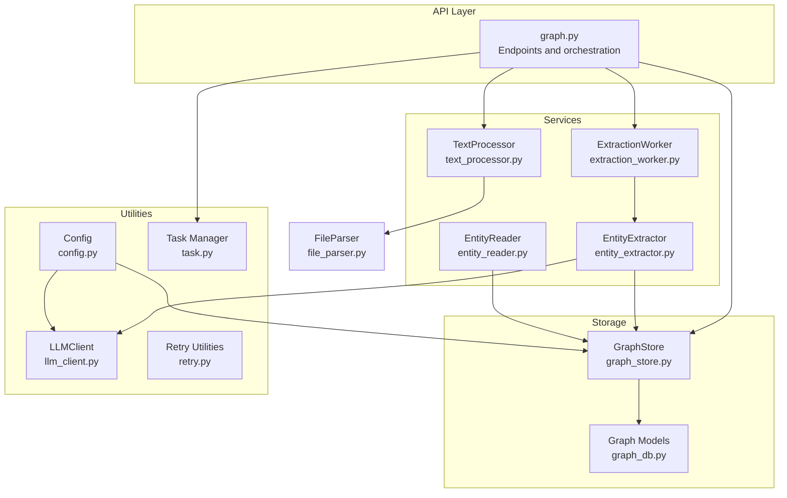
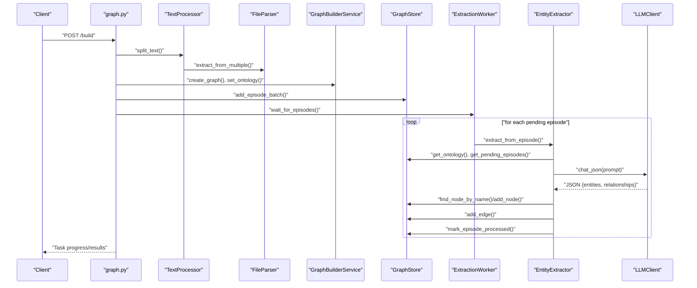
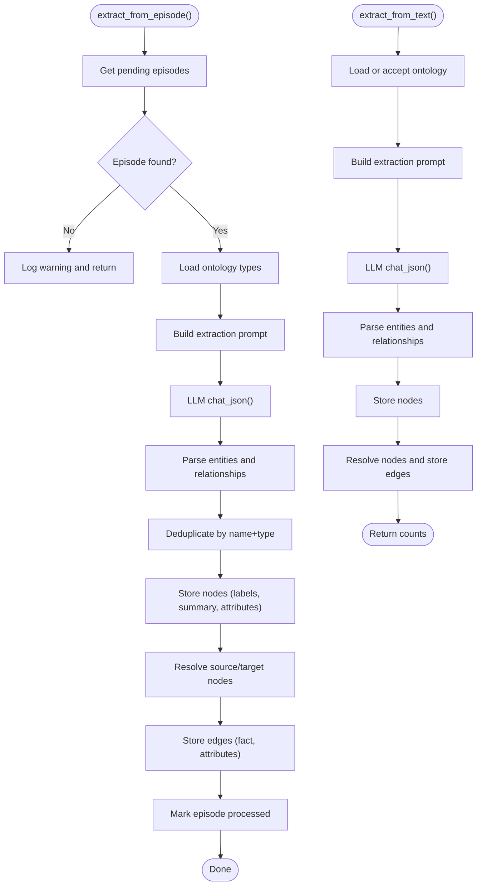
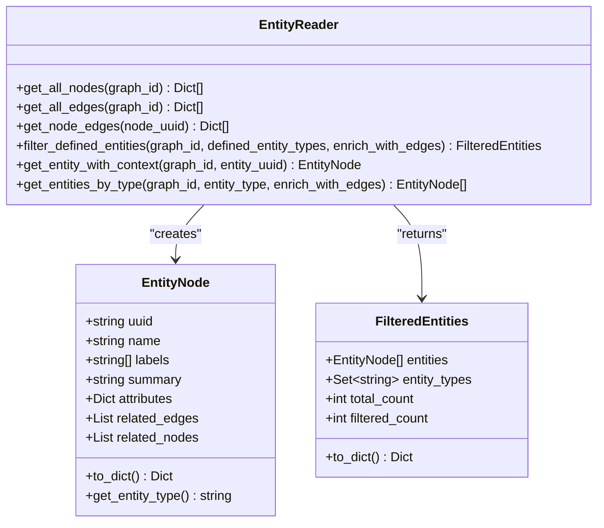
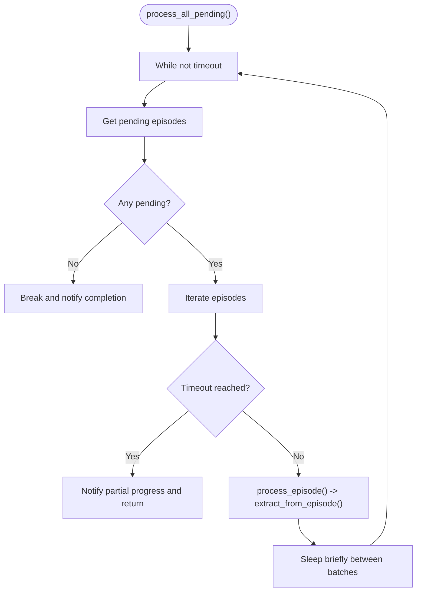
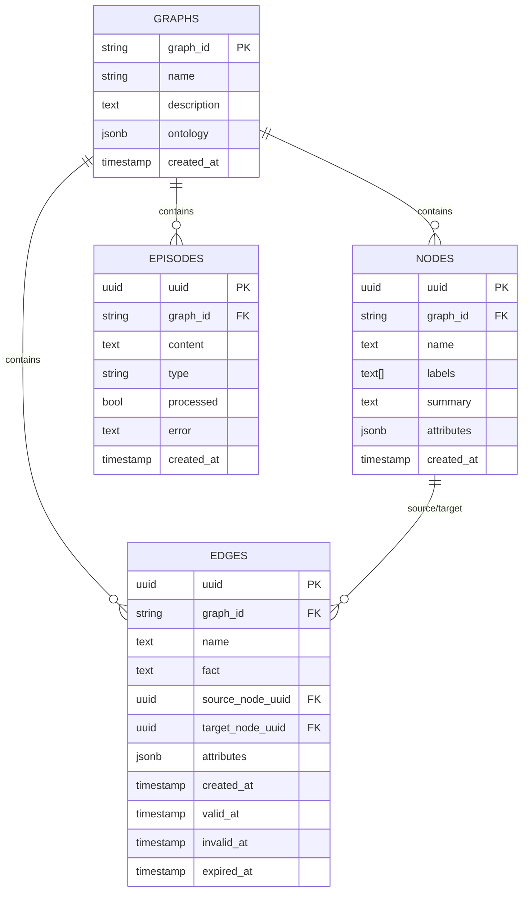
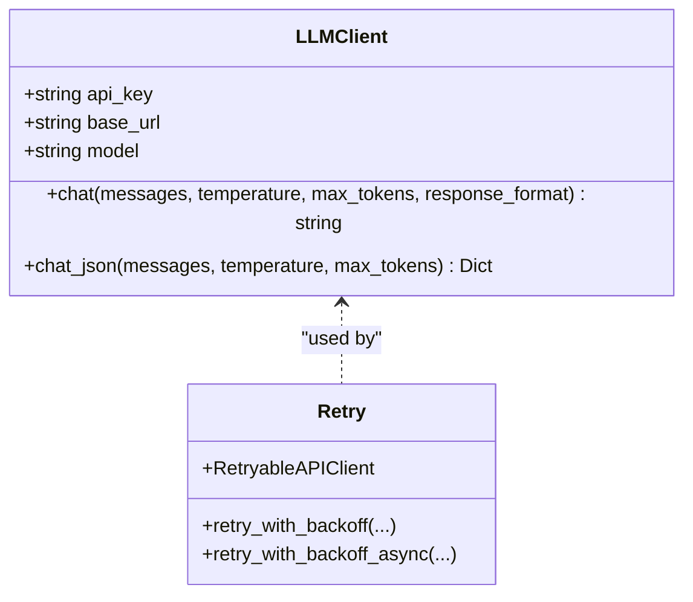
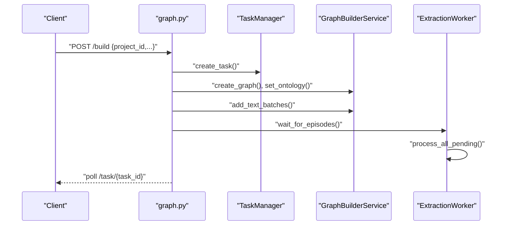
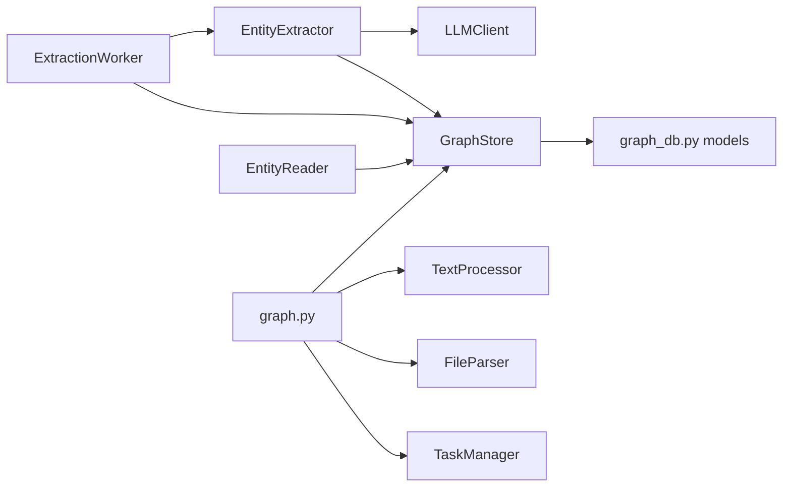

# Entity Extraction Services

<cite>
**Referenced Files in This Document**
- [entity_extractor.py](file://backend/app/services/entity_extractor.py)
- [entity_reader.py](file://backend/app/services/entity_reader.py)
- [extraction_worker.py](file://backend/app/services/extraction_worker.py)
- [graph_store.py](file://backend/app/services/graph_store.py)
- [graph_db.py](file://backend/app/models/graph_db.py)
- [llm_client.py](file://backend/app/utils/llm_client.py)
- [retry.py](file://backend/app/utils/retry.py)
- [config.py](file://backend/app/config.py)
- [graph.py](file://backend/app/api/graph.py)
- [text_processor.py](file://backend/app/services/text_processor.py)
- [file_parser.py](file://backend/app/utils/file_parser.py)
- [task.py](file://backend/app/models/task.py)
</cite>

## Table of Contents
1. [Introduction](#introduction)
2. [Project Structure](#project-structure)
3. [Core Components](#core-components)
4. [Architecture Overview](#architecture-overview)
5. [Detailed Component Analysis](#detailed-component-analysis)
6. [Dependency Analysis](#dependency-analysis)
7. [Performance Considerations](#performance-considerations)
8. [Troubleshooting Guide](#troubleshooting-guide)
9. [Conclusion](#conclusion)
10. [Appendices](#appendices)

## Introduction
This document explains the entity extraction ecosystem that transforms raw text into a structured knowledge graph. It covers three core services:
- Entity Extractor: identifies and extracts named entities and relationships from text using LLM analysis.
- Entity Reader: reads and filters structured graph data, returning enriched entity representations.
- Extraction Worker: orchestrates background processing of text chunks (episodes) and coordinates asynchronous LLM extraction.

It also documents the pipeline from ingestion to structured output, including entity type classification, relationship mapping, attribute extraction, validation rules, performance tuning, error handling, and quality metrics.

## Project Structure
The entity extraction services reside in the backend Python application and integrate with a PostgreSQL-backed graph store, an LLM client, and a task management system. The API layer coordinates ingestion, chunking, and orchestration.

**Diagram sources**
- [graph.py:259-523](file://backend/app/api/graph.py#L259-L523)
- [text_processor.py:1-72](file://backend/app/services/text_processor.py#L1-L72)
- [extraction_worker.py:1-109](file://backend/app/services/extraction_worker.py#L1-L109)
- [entity_extractor.py:1-291](file://backend/app/services/entity_extractor.py#L1-L291)
- [entity_reader.py:1-345](file://backend/app/services/entity_reader.py#L1-L345)
- [graph_store.py:1-375](file://backend/app/services/graph_store.py#L1-L375)
- [graph_db.py:1-151](file://backend/app/models/graph_db.py#L1-L151)
- [llm_client.py:1-104](file://backend/app/utils/llm_client.py#L1-L104)
- [config.py:1-76](file://backend/app/config.py#L1-L76)
- [retry.py:1-239](file://backend/app/utils/retry.py#L1-L239)
- [task.py:1-185](file://backend/app/models/task.py#L1-L185)
- [file_parser.py:1-190](file://backend/app/utils/file_parser.py#L1-L190)

**Section sources**
- [graph.py:259-523](file://backend/app/api/graph.py#L259-L523)
- [text_processor.py:1-72](file://backend/app/services/text_processor.py#L1-L72)
- [file_parser.py:1-190](file://backend/app/utils/file_parser.py#L1-L190)

## Core Components
- Entity Extractor: Builds extraction prompts using graph ontology, queries the LLM, parses JSON results, and persists nodes and edges to the graph store. It deduplicates entities and auto-creates missing nodes referenced in relationships.
- Entity Reader: Filters nodes by custom labels (excluding default “Entity”/“Node”), enriches entities with related edges and neighbor nodes, and exposes typed collections for downstream consumption.
- Extraction Worker: Polls for pending episodes, processes them asynchronously, and reports progress via callbacks. It integrates with the graph store to mark episodes processed and capture errors.

**Section sources**
- [entity_extractor.py:16-291](file://backend/app/services/entity_extractor.py#L16-L291)
- [entity_reader.py:69-345](file://backend/app/services/entity_reader.py#L69-L345)
- [extraction_worker.py:16-109](file://backend/app/services/extraction_worker.py#L16-L109)

## Architecture Overview
The pipeline begins with file uploads and text preprocessing, followed by chunking and graph creation. An ontology defines entity and relationship types. Episodes are enqueued and processed asynchronously by the Extraction Worker, which delegates to the Entity Extractor. Results are stored in the graph store and later read by the Entity Reader for visualization and reporting.

**Diagram sources**
- [graph.py:259-523](file://backend/app/api/graph.py#L259-L523)
- [text_processor.py:18-34](file://backend/app/services/text_processor.py#L18-L34)
- [file_parser.py:124-144](file://backend/app/utils/file_parser.py#L124-L144)
- [graph_store.py:75-124](file://backend/app/services/graph_store.py#L75-L124)
- [extraction_worker.py:30-109](file://backend/app/services/extraction_worker.py#L30-L109)
- [entity_extractor.py:26-167](file://backend/app/services/entity_extractor.py#L26-L167)
- [llm_client.py:70-104](file://backend/app/utils/llm_client.py#L70-L104)

## Detailed Component Analysis

### Entity Extractor
Responsibilities:
- Construct extraction prompts using defined entity and relationship types from the graph ontology.
- Call the LLM with a structured JSON request and parse the response.
- Deduplicate entities by name and type within the graph; create nodes with labels and attributes.
- Resolve relationship endpoints by name/type, auto-creating missing nodes if needed.
- Persist edges with facts and attributes; mark episodes processed and record errors.

Key workflows:
- Episode-based extraction: fetches a single episode, builds prompt, calls LLM, stores nodes and edges, marks processed.
- Direct text extraction: same as above but operates on arbitrary text without episodes.

**Diagram sources**
- [entity_extractor.py:26-167](file://backend/app/services/entity_extractor.py#L26-L167)
- [entity_extractor.py:168-245](file://backend/app/services/entity_extractor.py#L168-L245)

**Section sources**
- [entity_extractor.py:16-291](file://backend/app/services/entity_extractor.py#L16-L291)
- [llm_client.py:70-104](file://backend/app/utils/llm_client.py#L70-L104)
- [graph_store.py:166-182](file://backend/app/services/graph_store.py#L166-L182)
- [graph_store.py:224-247](file://backend/app/services/graph_store.py#L224-L247)

### Entity Reader
Responsibilities:
- Retrieve all nodes and edges for a graph.
- Filter nodes by custom labels (excluding default “Entity”/“Node”) to produce defined entities.
- Enrich entities with related edges and neighboring nodes.
- Provide typed collections and single-entity context retrieval.

**Diagram sources**
- [entity_reader.py:20-67](file://backend/app/services/entity_reader.py#L20-L67)
- [entity_reader.py:69-345](file://backend/app/services/entity_reader.py#L69-L345)

**Section sources**
- [entity_reader.py:69-345](file://backend/app/services/entity_reader.py#L69-L345)
- [graph_store.py:195-221](file://backend/app/services/graph_store.py#L195-L221)

### Extraction Worker
Responsibilities:
- Continuously poll for pending episodes and process them via the Entity Extractor.
- Support progress callbacks and timeouts.
- Handle per-episode errors by marking episodes processed with error metadata.

**Diagram sources**
- [extraction_worker.py:30-109](file://backend/app/services/extraction_worker.py#L30-L109)

**Section sources**
- [extraction_worker.py:16-109](file://backend/app/services/extraction_worker.py#L16-L109)

### Graph Store and Models
Graph Store provides a unified access layer for:
- Graph lifecycle (create/delete)
- Episode management (add, batch add, mark processed, list pending)
- Node CRUD (add, get, find by name, update, list with pagination)
- Edge CRUD (add, list)
- Search (full-text on facts/nodes)
- Statistics (counts and entity type distribution)
- Session management and pooling

Models define the schema for graphs, nodes, edges, and episodes with indexes and relationships.

**Diagram sources**
- [graph_db.py:24-105](file://backend/app/models/graph_db.py#L24-L105)
- [graph_store.py:32-124](file://backend/app/services/graph_store.py#L32-L124)

**Section sources**
- [graph_store.py:21-375](file://backend/app/services/graph_store.py#L21-L375)
- [graph_db.py:1-151](file://backend/app/models/graph_db.py#L1-L151)

### LLM Client and Retry Utilities
- LLMClient wraps OpenAI-compatible APIs, supports JSON response parsing, and cleans up model-specific artifacts.
- Retry utilities provide exponential backoff with jitter and batch retry helpers for robust external API calls.

**Diagram sources**
- [llm_client.py:14-104](file://backend/app/utils/llm_client.py#L14-L104)
- [retry.py:15-239](file://backend/app/utils/retry.py#L15-L239)

**Section sources**
- [llm_client.py:14-104](file://backend/app/utils/llm_client.py#L14-L104)
- [retry.py:15-239](file://backend/app/utils/retry.py#L15-L239)

### API Orchestration and Task Management
- The API endpoint orchestrates text extraction, chunking, graph creation, and LLM processing.
- TaskManager tracks progress and results for long-running operations.

**Diagram sources**
- [graph.py:259-523](file://backend/app/api/graph.py#L259-L523)
- [task.py:54-185](file://backend/app/models/task.py#L54-L185)

**Section sources**
- [graph.py:259-523](file://backend/app/api/graph.py#L259-L523)
- [task.py:54-185](file://backend/app/models/task.py#L54-L185)

## Dependency Analysis
- Entity Extractor depends on LLMClient for inference and GraphStore for persistence.
- Extraction Worker composes EntityExtractor and GraphStore.
- Entity Reader depends on GraphStore for node/edge retrieval.
- API layer coordinates TextProcessor/FileParser, GraphBuilderService, and TaskManager.
- GraphStore encapsulates SQLAlchemy models and session management.

**Diagram sources**
- [entity_extractor.py:22-24](file://backend/app/services/entity_extractor.py#L22-L24)
- [extraction_worker.py:22-24](file://backend/app/services/extraction_worker.py#L22-L24)
- [entity_reader.py:79-80](file://backend/app/services/entity_reader.py#L79-L80)
- [graph.py:259-523](file://backend/app/api/graph.py#L259-L523)
- [graph_store.py:27-28](file://backend/app/services/graph_store.py#L27-L28)
- [graph_db.py:24-105](file://backend/app/models/graph_db.py#L24-L105)

**Section sources**
- [entity_extractor.py:1-291](file://backend/app/services/entity_extractor.py#L1-L291)
- [entity_reader.py:1-345](file://backend/app/services/entity_reader.py#L1-L345)
- [extraction_worker.py:1-109](file://backend/app/services/extraction_worker.py#L1-L109)
- [graph_store.py:1-375](file://backend/app/services/graph_store.py#L1-L375)
- [graph_db.py:1-151](file://backend/app/models/graph_db.py#L1-L151)
- [llm_client.py:1-104](file://backend/app/utils/llm_client.py#L1-L104)
- [retry.py:1-239](file://backend/app/utils/retry.py#L1-L239)
- [graph.py:1-604](file://backend/app/api/graph.py#L1-L604)
- [task.py:1-185](file://backend/app/models/task.py#L1-L185)

## Performance Considerations
- Concurrency and batching:
  - Extraction Worker iterates episodes with a small inter-check sleep to avoid tight loops and reduce contention.
  - TextProcessor splits text with configurable chunk size and overlap to balance LLM context limits and recall.
- Memory optimization:
  - Pagination in GraphStore node/edge retrieval prevents loading entire graphs into memory at once.
  - EntityExtractor deduplicates entities by name+type to minimize redundant writes.
- LLM cost and latency:
  - Lower temperature during JSON calls improves determinism.
  - Prompt includes defined types to constrain outputs and improve accuracy.
- Database tuning:
  - SQLAlchemy session pooling and pre-ping reduce connection overhead.
  - Indexes on graph_id/name support efficient lookups.

[No sources needed since this section provides general guidance]

## Troubleshooting Guide
Common issues and remedies:
- LLM API failures:
  - Wrap LLM calls with retry decorators to apply exponential backoff and jitter.
  - Validate LLM configuration keys and base URLs.
- JSON parsing errors:
  - LLMClient strips code blocks and cleans responses; ensure the model returns valid JSON.
  - Consider adding post-hoc JSON repair strategies if needed.
- Extraction errors:
  - Extraction Worker marks episodes processed even on failure; inspect error fields and logs.
  - Verify that episodes are marked processed to prevent repeated work.
- Ontology mismatches:
  - Ensure entity and relationship types are set in the graph’s ontology before extraction.
  - Validate that entity types include fallbacks (Person/Organization) as recommended by the ontology generator.

**Section sources**
- [retry.py:15-129](file://backend/app/utils/retry.py#L15-L129)
- [llm_client.py:70-104](file://backend/app/utils/llm_client.py#L70-L104)
- [config.py:30-33](file://backend/app/config.py#L30-L33)
- [extraction_worker.py:82-88](file://backend/app/services/extraction_worker.py#L82-L88)
- [graph_store.py:106-124](file://backend/app/services/graph_store.py#L106-L124)

## Conclusion
The entity extraction ecosystem integrates ingestion, chunking, LLM-powered extraction, and graph persistence. Entity Extractor focuses on accurate entity and relationship identification guided by an ontology. Entity Reader provides filtered, enriched views for downstream applications. Extraction Worker ensures scalable, asynchronous processing with progress tracking and error handling. Together, these components form a robust pipeline for transforming raw text into a structured knowledge graph.

[No sources needed since this section summarizes without analyzing specific files]

## Appendices

### Extraction Pipeline Steps
- Upload and parse files.
- Preprocess and chunk text.
- Create graph and set ontology.
- Add episodes and wait for LLM extraction.
- Read and filter entities for visualization/reporting.

**Section sources**
- [graph.py:121-255](file://backend/app/api/graph.py#L121-L255)
- [text_processor.py:18-34](file://backend/app/services/text_processor.py#L18-L34)
- [file_parser.py:124-144](file://backend/app/utils/file_parser.py#L124-L144)
- [graph_store.py:32-124](file://backend/app/services/graph_store.py#L32-L124)
- [extraction_worker.py:30-109](file://backend/app/services/extraction_worker.py#L30-L109)
- [entity_reader.py:128-244](file://backend/app/services/entity_reader.py#L128-L244)

### Example Extraction Configurations
- LLM configuration:
  - API key, base URL, and model name are loaded from environment variables.
- Text chunking:
  - Adjust chunk size and overlap to balance context and cost.
- Extraction:
  - Use low temperature for JSON mode to improve consistency.

**Section sources**
- [config.py:30-45](file://backend/app/config.py#L30-L45)
- [llm_client.py:17-33](file://backend/app/utils/llm_client.py#L17-L33)
- [text_processor.py:18-34](file://backend/app/services/text_processor.py#L18-L34)

### Validation Rules and Quality Metrics
- Validation:
  - Entities require non-empty names; relationships require non-empty source/target.
  - Deduplicate by name and type to avoid redundancy.
- Metrics:
  - Track processed episode counts, node/edge counts, and entity type distributions via graph statistics.

**Section sources**
- [entity_extractor.py:68-91](file://backend/app/services/entity_extractor.py#L68-L91)
- [entity_extractor.py:226-242](file://backend/app/services/entity_extractor.py#L226-L242)
- [graph_store.py:320-350](file://backend/app/services/graph_store.py#L320-L350)